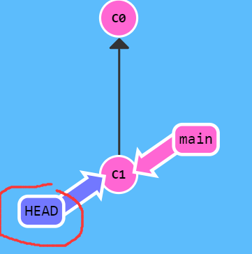
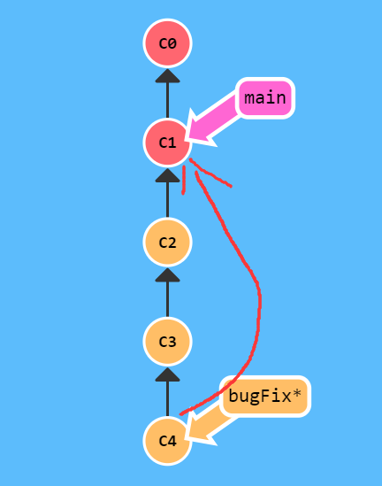

# git reset to removed from the staging area


# Git branching learning  
https://learngitbranching.js.org/?demo=&locale=zh_CN  


```python
基础
git help <command>: 获取 git 命令的帮助信息
git init: 创建一个新的 git 仓库，其数据会存放在一个名为 .git 的目录下
git status: 显示当前的仓库状态
git add <filename>: 添加文件到暂存区
git commit: 创建一个新的提交
git log: 显示历史日志
git log --all --graph --decorate: 可视化历史记录（有向无环图）
git diff <filename>: 显示与暂存区文件的差异
git diff <revision> <filename>: 显示某个文件两个版本之间的差异
git checkout <revision>: 更新 HEAD 和目前的分支

```
```
分支和合并
git branch: 显示分支
git branch <name>: 创建分支
git checkout -b <name>: 创建分支并切换到该分支
相当于 git branch <name>; git checkout <name>
git merge <revision>: 合并到当前分支
git mergetool: 使用工具来处理合并冲突
git rebase: 将一系列补丁变基（rebase）为新的基线

```
```
远端操作
git remote: 列出远端
git remote add <name> <url>: 添加一个远端
git push <remote> <local branch>:<remote branch>: 将对象传送至远端并更新远端引用
git branch --set-upstream-to=<remote>/<remote branch>: 创建本地和远端分支的关联关系
git fetch: 从远端获取对象/索引
git pull: 相当于 git fetch; git merge
git clone: 从远端下载仓库
```

```
撤销
git commit --amend: 编辑提交的内容或信息
git reset HEAD <file>: 恢复暂存的文件
git checkout -- <file>: 丢弃修改
git restore: git2.32版本后取代git reset 进行许多撤销操作
```

```
Git 高级操作
git config: Git 是一个 高度可定制的 工具
git clone --depth=1: 浅克隆（shallow clone），不包括完整的版本历史信息
git add -p: 交互式暂存
git rebase -i: 交互式变基
git blame: 查看最后修改某行的人
git stash: 暂时移除工作目录下的修改内容
git bisect: 通过二分查找搜索历史记录
.gitignore: 指定 故意不追踪的文件
```
 


# Git Branch
 Git 的分支也非常轻量。它们只是简单地指向某个提交纪录.这是因为即使创建再多的分支也不会造成储存或内存上的开销，并且按逻辑分解工作到不同的分支要比维护那些特别臃肿的分支简单多了

+ 建一个到名为 newImage 的分支。
`git branch newImage`  

 
+ 往新分支里提交一些东西  
`git commit`  
为什么 main 分支前进了，但 newImage 分支还待在原地呢  
这是因为我们没有“在”这个新分支上，看到 main 分支上的那个星号（*）了吗？这表示当前所在的分支是 main。  

  
 
  
+ Git 我们想要切换到新的分支上  
`git checkout <name>`   
下面的命令会让我们在提交修改之前先切换到新的分支上  
`git checkout newImage; git commit`   
这就对了！我们的修改已经保存到新的分支里了。  
    
  

  
```
git branch bugFix;
git checkout bugFix;
```

# Git Merge  
如何将两个分支合并到一起。新建一个分支，在其上开发某个新功能，开发完成后再合并回主线。  

+ 我们准备了两个分支，每个分支上各有一个独有的提交。这意味着没有一个分支包含了我们修改的所有内容。  
咱们通过合并这两个分支来解决这个问题。  
`git merge bugFix`    


 我们要把 bugFix 合 main 现在指向了一个拥有两个父节点的提交记录。假如从 main 开始沿着箭头向上看，  
 在到达起点的路上会经过所有的提交记录。这意味着 main 包含了对代码库的所有修改。  
  
+ 把 main 分支合并到 bugFix：
git checkout bugFix; git merge main  
因为 main 继承自 bugFix，Git 什么都不用做，只是简单地把 bugFix 移动到 main 所指向的那个提交记录

  
  
```
git checkout -b bugFix;
git commit;
git checkout master;
git commit;
git merge bugFix;
```

# Git Rebase
第二种合并分支的方法是 git rebase。Rebase 实际上就是取出一系列的提交记录，“复制”它们，然后在另外一个地方逐个的放下去。Rebase 的优势就是可以创造更线性的提交历史  

+ 把 bugFix 分支里的工作直接移到 main 分支上。使得两个分支的功能按顺序开发，但实际上它们是并行开发的。  
`git rebase main`  
现在 bugFix 分支上的工作在 main 的最顶端，同时我们也得到了一个更线性的提交序列  


+ 切换到了 main 上。把它 rebase 到 bugFix 分支上  
git rebase bugFix  
好了！由于 bugFix 继承自 main，所以 Git 只是简单的把 main 分支的引用向前移动了一下而已  


  
```
git checkout -b bugFix;
git commit;
git checkout master;
git commit;
git checkout bugFix;
git rebase master;
```

# 在 Git 提交树上移动  
## HEAD  
HEAD 是一个对当前检出记录的符号引用 —— 也就是指向你正在其基础上进行工作的提交记录  
HEAD 总是指向当前分支上最近一次提交记录。大多数修改提交树的 Git 命令都是从改变 HEAD 的指向开始的。HEAD 通常情况下是指向分支名的（如 bugFix）。在你提交时，改变了 bugFix 的状态，这一变化通过 HEAD 变得可见。 
  
+ 提交前后 HEAD 的位置  
```
git checkout C1; 
git checkout main; 
git commit; 
git checkout C2  
```


HEAD 指向了 main，随着提交向前移动。
（这些命令并不是真的在查看 HEAD 指向，如果想看 HEAD 指向，可以通过 cat .git/HEAD 查看， 如果 HEAD 指向的是一个引用，还可以用 git symbolic-ref HEAD 查看它的指向。）  

+ 分离的 HEAD
分离的 HEAD 就是让其指向了某个具体的提交记录而不是分支名。在命令执行之前的状态如下所示  
HEAD -> main -> C1;  HEAD 指向 main， main 指向 C1  
`git checkout C1` 
 

现在变成了HEAD -> C1  

+ 相对引用  
使用相对引用的话，你就可以从一个易于记忆的地方（比如 bugFix 分支或 HEAD）开始计算  
相对引用非常给力，这里我介绍两个简单的用法：  
 ```
 使用 ^ 向上移动 1 个提交记录  
 使用 ~<num> 向上移动多个提交记录，如 ~3
 ```  
+ 操作符 (^)  
把这个符号加在引用名称的后面，表示让 Git 寻找指定提交记录的父提交。  
所以 main^ 相当于“main 的父节点”。main^^ 是 main 的第二个父节点
现在咱们切换到 main 的父节点  
`git checkout main^`  
 
 
多次移动引用参照  
```
git checkout C3; 
git checkout HEAD^; 
git checkout HEAD^; 
git checkout HEAD^  
```

 
  

+ “~”操作符  
如果你想在提交树中向上移动很多步的话，该操作符后面可以跟一个数字（可选，不跟数字时与 ^ 相同，向上移动一次），指定向上移动多少次。  
咱们用 ~<num> 一次后退四步。  
`git checkout HEAD~4`


+ 强制修改分支位置  
移动分支。可以直接使用 -f 选项让分支指向另一个提交。例如:  
`git branch -f main HEAD~3`  
上面的命令会将 main 分支强制指向 HEAD 的第 3 级父提交。  



```
git branch -f master C6;
git branch -f bugFix C0;
git checkout C1;
```

# 撤销变更  
主要有两种方法用来撤销变更 —— 一是 git reset，还有就是 git revert  

## Git Reset
通过把分支记录回退几个提交记录来实现撤销改动。git reset 向上移动分支，原来指向的提交记录就跟从来没有提交过一样  
`git reset HEAD~1`

   
 Git 把 main 分支移回到 C1；现在我们的本地代码库根本就不知道有 C2 这个提交了。
（在reset后， C2 所做的变更还在，但是处于未加入暂存区状态。）  

## Git revert  
为了撤销更改并分享给别人，我们需要使用 git revert。  
`git revert HEAD`  

 
在我们要撤销的提交记录后面居然多了一个新提交！这是因为新提交记录 C2' 引入了更改  
这些更改刚好是用来撤销 C2 这个提交的。也就是说 C2' 的状态与 C1 是相同的。 
revert 之后就可以把你的更改推送到远程仓库  

  
```
git reset local~1;
git checkout pushed;
git revert pushed;
```  

# 整理提交记录  
## Git Cherry-pick  
命令形式为:git cherry-pick <提交号>...  
如果你想将一些提交复制到当前所在的位置（HEAD）下面的话， Cherry-pick 是最直接的方式了  

建立side仓库复制到main分支，并用