[Getting started | Kubernetes](https://kubernetes.io/docs/setup/)  
[Introduction to Kubernetes (LFS158) - The Linux Foundation](https://trainingportal.linuxfoundation.org/courses/introduction-to-kubernetes)  

# exam scope
 **A Certified Kubernetes Administrator (CKA) will be able to:   
认证 Kubernetes 管理员 (CKA) 将能够：**

- Demonstrate their ability to do basic installation as well as configuring and managing production-grade Kubernetes clusters.  
    展示他们进行基本安装以及配置和管理生产级 Kubernetes 集群的能力。
- Understand key concepts such as Kubernetes networking, storage, security, maintenance, logging and monitoring, application lifecycle, troubleshooting, API object primitives.  
    了解 Kubernetes 网络、存储、安全性、维护、日志记录和监控、应用程序生命周期、故障排除、API 对象原语等关键概念。
- Ability to establish basic use-cases for end users.  
    能够为最终用户建立基本用例。

## Storage – 10%  存储 – 10%**

- Implement storage classes and dynamic volume provisioning  
    实施存储类别和动态卷配置
- Configure volume types, access modes and reclaim policies  
    配置卷类型、访问模式和回收策略
- Manage persistent volumes and persistent volume claims  
    管理持久卷和持久卷声明

## Troubleshooting – 30%  故障排除 – 30%**

- Troubleshoot clusters and nodes  
    集群和节点故障排除
- Troubleshoot cluster components  
    对集群组件进行故障排除
- Monitor cluster and application resource usage  
    监控集群和应用程序资源使用情况
- Manage and evaluate container output streams  
    管理和评估容器输出流
- Troubleshoot services and networking  
    排除服务和网络故障

## Workloads and Scheduling – 15%   
工作负载和调度 – 15%**

- Understand application deployments and how to perform rolling update and rollbacks  
    了解应用程序部署以及如何执行滚动更新和回滚
- Use ConfigMaps and Secrets to configure applications  
    使用 ConfigMap 和 Secrets 来配置应用程序
- Configure workload autoscaling  
    配置工作负载自动缩放
- Understand the primitives used to create robust, self-healing, application deployments  
    了解用于创建健壮的、自我修复的应用程序部署的原语
- Configure Pod admission and scheduling (limits, node affinity, etc.)  
    配置 Pod 准入和调度（限制、节点关联性等）

## Cluster Architecture, Installation and Configuration – 25%  
集群架构、安装和配置 – 25%**

- Manage role based access control (RBAC)  
    管理基于角色的访问控制 (RBAC)
- Prepare underlying infrastructure for installing a Kubernetes cluster  
    准备用于安装 Kubernetes 集群的底层基础设施
- Create and manage Kubernetes clusters using kubeadm  
    使用 kubeadm 创建和管理 Kubernetes 集群
- Manage the lifecycle of Kubernetes clusters  
    管理 Kubernetes 集群的生命周期
- Implement and configure a highly-available control plane  
    实施和配置高可用性控制平面
- Use Helm and Kustomize to install cluster components  
    使用 Helm 和 Kustomize 安装集群组件
- Understand extension interfaces (CNI, CSI, CRI, etc.)  
    了解扩展接口（CNI、CSI、CRI 等）
- Understand CRDs, install and configure operators  
    了解 CRD、安装和配置操作员

## Servicing and Networking – 20%  
服务和网络 – 20%**

- Understand connectivity between Pods  
    了解 Pod 之间的连接
- Define and enforce Network Policies  
    定义和实施网络策略
- Use ClusterIP, NodePort, LoadBalancer service types and endpoints  
    使用 ClusterIP、NodePort、LoadBalancer 服务类型和端点
- Use the Gateway API to manage Ingress traffic  
    使用网关 API 管理入口流量
- Know how to use Ingress controllers and Ingress resources  
    了解如何使用 Ingress 控制器和 Ingress 资源
- Understand and use CoreDNS  
    了解并使用 CoreDNS

# Tips
`export KUBE_EDITOR=nano`
### quick start
```
kubectl create deployment nginx --image=nginx --replicas=4

```

###  generate a resource definition file
```shell
kubectl run nginx-pod --image=nginx --dry-run=client -o yaml > nginx-pod.yaml

kubectl create deployment --image=nginx nginx --dry-run=client -o yaml

# Create a Service named nginx of type NodePort to expose pod nginx's port 80 on port 30080 on the nodes:
kubectl expose pod redis --port=6379 --name redis-service --dry-run=client -o yaml
```


```sh
ps -ef | grep /usr/bin/kubelet
```

## edit pod config and reload
```sh
$ kubectl get pods webapp-color -o yaml > new-webapp.yaml

$ kubectl delete pods webapp-color


$ kubectl get service mysql -n alpha -o yaml > mysql-service.yaml

```
# Basic concept

## Container Orchestration容器编排
To enable these functionalities you need an underlying platform with a set of resources. The platform needs to orchestrate the connectivity between the containers and automatically scale up or down based on the load. This whole process of automatically deploying and managing containers is known as Container Orchestration. 要启用这些功能，您需要一个具有一组资源的底层平台。该平台需要编排容器之间的连接，并根据负载自动扩展或缩小。自动部署和管理容器的整个过程称为容器编排。  
There are various advantages of container orchestration. Your application is now highly available as hardware failures do not bring your application down because you have multiple instances of your application running on different nodes. The user traffic is load balanced across the various containers. When demand increases, deploy more instances of the application seamlessly and within a matter of second and we have the ability to do that at a service level. When we run out of hardware resources, scale the number of nodes up/down without having to take down the application. And do all of these easily with a set of declarative object configuration file容器编排有多种优点。您的应用程序现在具有高可用性，因为硬件故障不会导致您的应用程序停机，因为您的应用程序的多个实例在不同的节点上运行。用户流量在各个容器之间进行负载平衡。当需求增加时，只需几秒钟即可无缝部署更多应用程序实例，我们有能力在服务级别上做到这一点。当我们用完硬件资源时，可以增加/减少节点数量，而无需关闭应用程序。并使用一组声明性对象配置文件轻松完成所有这些  
## Nodes(Minions)  
A node is a machine – physical or virtual – on which kubernetes is installed. A node is a worker machine and this is were containers will be launched by kubernetes. 节点是安装了 kubernetes 的物理或虚拟机器。节点是一台工作机器，这是 kubernetes 启动的容器。
## Cluster 
A cluster is a set of nodes grouped together. This way even if one node fails you have your application still accessible from the other nodes. Moreover having multiple nodes helps in sharing load as well 集群是一组聚集在一起的节点。这样，即使一个节点发生故障，您仍然可以从其他节点访问您的应用程序。此外，拥有多个节点也有助于分担负载  
## Master
Now we have a cluster, but who is responsible for managing the cluster? Were is the information about the members of the cluster stored? How are the nodes monitored? When a node fails how do you move the workload of the failed node to another worker node? That’s were the Master comes in. The master is another node with Kubernetes installed in it, and is configured as a Master. The master watches over the nodes in the cluster and is responsible for the actual orchestration of containers on the worker nodes. 现在我们有了一个集群，但是谁负责管理集群呢？是否存储了集群成员的信息？节点是如何监控的？当一个节点发生故障时，如何将故障节点的工作负载转移到另一个工作节点？这就是 Master 的作用。master 是另一个安装了 Kubernetes 的节点，并被配置为 Master。主节点监视集群中的节点，并负责工作节点上容器的实际编排。
## Components
[Kubernetes Components | Kubernetes](https://kubernetes.io/docs/concepts/overview/components/)  
When you install Kubernetes on a System, you are actually installing the following components. An API Server. An ETCD service. A kubelet service. A Container Runtime, Controllers and Schedulers 当您在系统上安装 Kubernetes 时，您实际上正在安装以下组件。 API 服务器。 ETCD 服务。 kubelet 服务。容器运行时、控制器和调度程序  
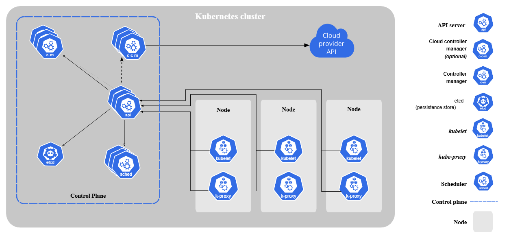  
The API server acts as the front-end for kubernetes. The users, management devices, Command line interfaces all talk to the API server to interact with the kubernetes cluster. API 服务器充当 kubernetes 的前端。用户、管理设备、命令行界面都与API服务器通信以与kubernetes集群交互。  
### ETCD
Next is the ETCD key store. ETCD is a distributed reliable key-value store used by kubernetes to store all data used to manage the cluster. Think of it this way, when you have multiple nodes and multiple masters in your cluster, etcd stores all that information on all the nodes in the cluster in a distributed manner. ETCD is responsible for implementing locks within the cluster to ensure there are no conflicts between the Masters 接下来是 ETCD 密钥存储。 ETCD 是 kubernetes 用来存储用于管理集群的所有数据的分布式可靠键值存储。这样想，当集群中有多个节点和多个主节点时，etcd 以分布式方式将所有信息存储在集群中的所有节点上。 ETCD 负责实现集群内部的锁，保证Master之间不发生冲突  

### kube-apiserver
Kube-apiserver is responsible for **`authenticating`**, **`validating`** requests, **`retrieving`** and **`Updating`** data in ETCD key-value store. In fact kube-apiserver is the only component that interacts directly to the etcd datastore. The other components such as kube-scheduler, kube-controller-manager and kubelet uses the API-Server to update in the cluster in their respective areas.  
Kube-apiserver 负责对请求进行 **`authenticating`** 、 **`validating`** ，以及 **`retrieving`** 和 **`Updating`** ETCD 键值存储中的数据。实际上，kube-apiserver 是唯一直接与 etcd 数据存储交互的组件。其他组件（如 kube-scheduler、kube-controller-manager 和 kubelet）使用 API-Server 在集群的各自区域中进行更新。
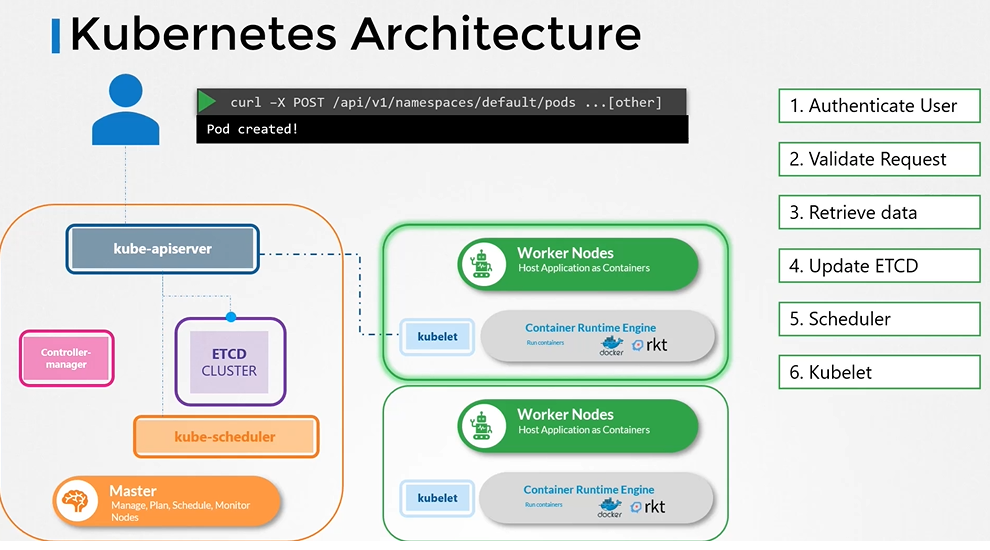

### # Kube Scheduler
The scheduler is responsible for distributing work or containers across multiple nodes. It looks for newly created containers and assigns them to Nodes. 调度程序负责跨多个节点分配工作或容器。它查找新创建的容器并将它们分配给节点。    
The kube-scheduler is only responsible for deciding which pod goes on which node. It doesn't actually place the pod on the nodes, that's the job of the **`kubelet`**.  kube-scheduler 只负责决定哪个 pod 运行在哪个节点上。它实际上并不将 pod 放置到节点上，这是 **`kubelet`** 的工作。
### kube-controller-manager
[kube-controller-manager | Kubernetes](https://kubernetes.io/docs/reference/command-line-tools-reference/kube-controller-manager/)  
The controllers are the brain behind orchestration. They are responsible for noticing and responding when nodes, containers or endpoints goes down. The controllers makes decisions to bring up new containers in such cases 控制器是编排背后的大脑。它们负责在节点、容器或端点出现故障时进行通知并做出响应。在这种情况下，管制员决定调出新集装箱  


The container runtime is the underlying software that is used to run containers 容器运行时是用于运行容器的底层软件  
  
## Master vs Worker Nodes  
  
The master server has the kube-apiserver and that is what makes it a master 主服务器有 kube-apiserver，这就是它成为主服务器的原因  
The worker node (or minion) as it is also known, is were the containers are hosted. For example Docker containers, and to run docker containers on a system 工作节点（或 Minion）也称为容器节点。例如 Docker 容器，以及在系统上运行 docker 容器  
Similarly the worker nodes have the kubelet agent that is responsible for interacting with the master to provide health information of the worker node and carry out actions requested by the master on the worker nodes 类似地，工作节点有 kubelet 代理，负责与主节点交互，提供工作节点的健康信息，并在工作节点上执行主节点请求的操作  
All the information gathered are stored in a key-value store on the Master. The key value store is based on the popular etcd framework as we just discussed. The master also has the controller manager and the scheduler. There are other components as well, but we will stop there for now. The reason we went through this is to understand what components constitute the master and worker nodes. This will help us install and configure the right components on different systems when we setup our infrastructure 收集到的所有信息都存储在主服务器上的键值存储中。正如我们刚才讨论的，键值存储基于流行的 etcd 框架。主站还具有控制器管理器和调度器。还有其他组件，但我们现在就到此为止。我们进行此操作的原因是为了了解哪些组件构成了主节点和工作节点。这将帮助我们在设置基础设施时在不同的系统上安装和配置正确的组件  
## kubectl  
[Install and Set Up kubectl on Linux | Kubernetes](https://kubernetes.io/docs/tasks/tools/install-kubectl-linux/)  
kubelet is the agent that runs on each node in the cluster. The agent is responsible for making sure that the containers are running on the nodes as expected. kubelet 是在集群中每个节点上运行的代理。代理负责确保容器按预期在节点上运行。
the command line utilities known as the kube command line tool or kubectl or kube control as it is also called. The kube control tool is used to deploy and manage applications on a kubernetes cluster, to get cluster information, get the status of nodes in the cluster and many other things 命令行实用程序称为 kube 命令行工具或 kubectl 或 kube 控件，因为它也被称为。 kube控制工具用于在kubernetes集群上部署和管理应用程序，获取集群信息，获取集群中节点的状态等等  
The `kubectl run` command is used to deploy an application on the cluster.   
The `kubectl cluster-info` command is used to view information about the cluster  
`kubectl get pod` command is used to list all the nodes part of the cluster.  


## yaml
```yaml
# YAML Template Example

# A key-value pair
app_name: MyCoolApp

# Strings, numbers, and booleans as values
version: 1.0
debug: true

# Nested objects using indentation
database:
  host: localhost
  port: 5432
  username: admin
  password: secret

# Lists (arrays) start with a dash (-)
features:
  - user_authentication
  - data_analysis
  - reporting

# Nested lists and objects
servers:
  - name: frontend
    ip: 192.168.1.1
    roles:
      - web
      - cache
  - name: backend
    ip: 192.168.1.2
    roles:
      - database
      - api

# Multi-line strings using | or >
description: |
  This is a long description
  that spans multiple lines.

# Aliases and references
default_role: &default_role admin
users:
  - name: Alice
    role: *default_role
  - name: Bob
    role: user

# Environment variables as mappings
env:
  PROD:
    url: https://api.example.com
    timeout: 30
  DEV:
    url: http://localhost:8000
    timeout: 10

# Comments start with a hash (#)
# Use them to describe the purpose of the settings

```

### Setup
`export KUBE_EDITOR=nano`
### Installation 
[Install Tools | Kubernetes](https://kubernetes.io/docs/tasks/tools/)  
[minikube start | minikube](https://minikube.sigs.k8s.io/docs/start/?arch=%2Flinux%2Fx86-64%2Fstable%2Fbinary+download#Service)  
[Play with Kubernetes](https://labs.play-with-k8s.com/)  
install the latest minikube stable release on x86-64 Linux using binary download:  
````shell
curl -LO https://github.com/kubernetes/minikube/releases/latest/download/minikube-linux-amd64

sudo install minikube-linux-amd64 /usr/local/bin/minikube && rm minikube-linux-amd64

minikube version

minikube config set rootless true

minikube start --driver=podman

minikube status

minikube kubectl -- get po -A

minikube dashboard

kubectl create deployment hello-minikube1 --image=kicbase/echo-server:1.0

kubectl get deployment

kubectl expose deployment hello-minikube1 --type=LoadBalancer --port=8080

minikube service hello-minikube1
````

### yaml setting
```yaml
apiVersion: v1
kind: Pod

# metadata is data about the object
metadata:
  name: nginx
  # labels are key value pairs that can be used to select and identify objects
  labels:
    app: nginx
    tier: frontend

# spec is the desired state of the object
spec:
    containers:
    - name: nginx
        image: nginx

```

##  Replication
### Replication Controller
The replication controller helps us run multiple instances of a single POD in the kubernetes cluster thus providing High Availability 复制控制器可帮助我们在kubernetes群集中运行多个实例，从而提供高可用性  
Another reason we need replication controller is to create multiple PODs to share the load across them 我们需要复制控制器的另一个原因是创建多个POD来共享它们的负载  
the replication controller spans across multiple nodes in the cluster. It helps us balance the load across multiple pods on different nodes as well as scale our application when the demand increases ，复制控制器跨越集群中的多个节点跨越。它有助于我们平衡不同节点上多个豆荚的负载，并在需求增加时扩展我们的应用  
## Replica Sets
[ReplicaSet | Kubernetes](https://kubernetes.io/docs/concepts/workloads/controllers/replicaset/#replicaset-as-an-horizontal-pod-autoscaler-target)  
All Kubernetes objects are defined using YAML, but the content of the YAML file depends on the resource you're defining. Here’s how a ReplicaSet YAML differs from, say, a basic Pod YAML:所有 Kubernetes 对象均使用 YAML 定义，但 YAML 文件的内容取决于您定义的资源。ReplicaSet YAML 与基本 Pod YAML 的区别如下：

### 1. Resource Kind and Purpose

- **ReplicaSet YAML:副本集 YAML：**
    
    - **Purpose:** Ensures that a specified number of identical Pods are running at any given time.**目的：**确保在任何给定时间都有指定数量的相同 Pod 正在运行。
    - **Kind:** The YAML file uses `kind: ReplicaSet` (and usually `apiVersion: apps/v1`), which tells Kubernetes to manage a set of Pod replicas.**Kind：** YAML 文件使用`kind: ReplicaSet` （通常是`apiVersion: apps/v1` ），它告诉 Kubernetes 管理一组 Pod 副本。
    - **Usage:** ReplicaSets are often used under the hood by higher-level objects like Deployments. They contain a `selector` to match Pods and a `template` section that defines the Pod specification.**用法：** ReplicaSet 通常由高级对象（如 Deployment）在后台使用。它们包含一个用于匹配 Pod 的`selector`和一个定义 Pod 规范的`template`部分。
- **Normal (e.g., Pod) YAML:普通（例如 Pod）YAML：**
    
    - **Purpose:** Directly creates a single Pod (or another resource like a Service, ConfigMap, etc.) with a specific configuration.**目的：**直接创建具有特定配置的单个 Pod（或其他资源，如 Service、ConfigMap 等）。
    - **Kind:** For a Pod, the YAML would use `kind: Pod` (and typically `apiVersion: v1`), defining a standalone pod without automatic replica management.**Kind：**对于 Pod，YAML 将使用`kind: Pod` （通常是`apiVersion: v1` ），定义没有自动副本管理的独立 Pod。

### 2. **Structure and Key Sections**

- **ReplicaSet YAML Example:ReplicaSet YAML 示例：**
```yaml
apiVersion: apps/v1
kind: ReplicaSet
metadata:
  name: myapp-replicaset
spec:
  replicas: 3
  selector:
    matchLabels:
      app: myapp
  template:
    metadata:
      labels:
        app: myapp
    spec:
      containers:
        - name: nginx
          image: nginx

```

- **`replicas:`** Specifies how many pod replicas should run.**`replicas:`**指定应该运行多少个 pod 副本。
- **`selector:`** Determines which Pods are managed by this ReplicaSet.**`selector:`**确定哪些 Pod 由此 ReplicaSet 管理。
- **`template:`** Provides the blueprint for the Pods that the ReplicaSet creates.**`template:`**为 ReplicaSet 创建的 Pod 提供蓝图。


Pod YAML Example:Pod YAML 示例：
```
apiVersion: v1
kind: Pod
metadata:
  name: myapp-pod
  labels:
    app: myapp
spec:
  containers:
    - name: nginx
      image: nginx

```
This defines a single Pod with no replica management.这定义了一个没有副本管理的单个 Pod。
### 3. **Use Cases**

- **ReplicaSet YAML:副本集 YAML：**
    
    - When you need to ensure that a certain number of Pods are always running, especially in production or scalable environments.当你需要确保一定数量的 Pod 始终在运行时，尤其是在生产或可扩展的环境中。
    - Often managed indirectly through a Deployment for rolling updates and easier management.通常通过部署间接管理，以实现滚动更新和更轻松的管理。
- **Pod YAML:Pod YAML：**
    
    - Useful for simple, one-off tasks, testing, or when you want full control over a single Pod without any automated replication.适用于简单的一次性任务、测试，或者当你想完全控制单个 Pod 而不需要任何自动复制时。

In summary, while both types of YAML files use the same underlying YAML syntax, a ReplicaSet YAML includes additional fields (like `replicas`, `selector`, and `template`) to manage multiple Pods automatically, whereas a simple Pod YAML focuses on defining one Pod only.总之，虽然两种类型的 YAML 文件都使用相同的底层 YAML 语法，但 ReplicaSet YAML 包含附加字段（如`replicas` 、 `selector`和`template` ）来自动管理多个 Pod，而简单 Pod YAML 仅专注于定义一个 Pod。

```bash
green@green-VirtualBox:/media/sf_vm_share_folder$ minikube kubectl -- create -f replicaset-definition.yml
replicaset.apps/myapp-replicaset created

green@green-VirtualBox:/media/sf_vm_share_folder$ minikube kubectl get replicaset
NAME               DESIRED   CURRENT   READY   AGE
myapp-replicaset   3         3         3       43s

green@green-VirtualBox:/media/sf_vm_share_folder$ minikube kubectl get pods
NAME                     READY   STATUS    RESTARTS       AGE
myapp-replicaset-87s44   1/1     Running   0              61s
myapp-replicaset-dr4n9   1/1     Running   0              62s
myapp-replicaset-pz2nw   1/1     Running   0              61s
nginx                    1/1     Running   1 (111s ago)   19h

```

### ReplicaSet selector field
The `selector` section defines the criteria used by the ReplicaSet to identify which pods it should manage. In your example:`selector`部分定义了 ReplicaSet 用于确定其应管理哪些 Pod 的标准。在您的示例中：

`selector:   matchLabels:     env: prod`

This tells Kubernetes that any pod with the label `env: prod` is part of this ReplicaSet. It ensures that the ReplicaSet will only manage pods that match these labels, and it also allows Kubernetes to detect if any pod doesn't belong to the ReplicaSet. This matching mechanism is essential for maintaining the desired state of the cluster by scaling up or down the correct set of pods.这告诉 Kubernetes，任何带有标签`env: prod` Pod 都是此 ReplicaSet 的一部分。它确保 ReplicaSet 只管理与这些标签匹配的 Pod，并且还允许 Kubernetes 检测是否有任何 Pod 不属于 ReplicaSet。这种匹配机制对于通过扩大或缩小正确的 Pod 集来维持集群的所需状态至关重要。

The labels under the ReplicaSet's metadata and the selector in the spec serve different purposes:ReplicaSet 的元数据下的标签和 spec 中的选择器有不同的用途：

- **ReplicaSet Metadata Labels:ReplicaSet 元数据标签：**  
    These labels (`metadata.labels`) are simply descriptive tags for the ReplicaSet object itself. They help you organize and filter resources when listing them.这些标签 ( `metadata.labels` ) 只是 ReplicaSet 对象本身的描述性标记。它们可帮助您在列出资源时对其进行组织和筛选。
    
- **Selector in Spec:规范中的选择器：**  
    The `spec.selector.matchLabels` is a critical configuration that tells the ReplicaSet which pods it should manage. This selector must match the labels defined in the pod template under `spec.template.metadata.labels`. Kubernetes uses this selector to determine which pods belong to the ReplicaSet, regardless of any labels on the ReplicaSet object itself.`spec.selector.matchLabels`是一项关键配置，它告诉 ReplicaSet 应该管理哪些 Pod。此选择器必须与`spec.template.metadata.labels`下 Pod 模板中定义的标签相匹配。Kubernetes 使用此选择器来确定哪些 Pod 属于 ReplicaSet，而不管 ReplicaSet 对象本身上的任何标签。
    

In short, even though you define labels on the ReplicaSet object, they are not used to match pods. The selector is explicitly needed to identify and manage the pods created by the ReplicaSet.简而言之，即使你在 ReplicaSet 对象上定义了标签，它们也不会用于匹配 Pod。明确需要选择器来识别和管理 ReplicaSet 创建的 Pod。
### scale up
You can update the number of replicas without reapplying the entire YAML file by using the `kubectl scale` command. For example, if your ReplicaSet is named `myapp-replicaset`, run:您可以使用`kubectl scale`命令更新副本数量，而无需重新应用整个 YAML 文件。例如，如果您的 ReplicaSet 名为`myapp-replicaset` ，请运行：

`minikube kubectl -- scale replicaset myapp-replicaset --replicas=6`

This command updates your running ReplicaSet to maintain 6 replicas instead of 3.此命令将更新您正在运行的 ReplicaSet 以维护 6 个副本而不是 3 个。

Alternatively, you can modify the YAML file’s `replicas` field to 6 and use:或者，您可以将 YAML 文件的`replicas`字段修改为 6 并使用：

`minikube kubectl -- apply -f replicaset-definition.yml`

However, using the `scale` command is more direct for changing the replica count on an existing resource.但是，使用`scale`命令可以更直接地更改现有资源上的副本数量。

## Deployment
[Deployments | Kubernetes](https://kubernetes.io/docs/concepts/workloads/controllers/deployment/)  
A Deployment manages a set of Pods to run an application workload, usually one that doesn't maintain state.  Deployment 管理一组 Pod 来运行应用程序工作负载，通常不维护状态。 
A Deployment is a higher-level abstraction that manages ReplicaSets, while a ReplicaSet directly ensures that a specified number of pod replicas are running. Here are the key differences:Deployment 是管理 ReplicaSet 的更高级别的抽象，而 ReplicaSet 则直接确保指定数量的 pod 副本正在运行。以下是主要区别：

- **Management Scope:管理范围：**
    
    - **Deployment:部署：**
        - Manages ReplicaSets and provides declarative updates to Pods.管理 ReplicaSet 并为 Pod 提供声明性更新。
        - Automatically handles rollouts, rollbacks, and scaling of ReplicaSets.自动处理 ReplicaSet 的推出、回滚和扩展。
    - **ReplicaSet:副本集：**
        - Ensures a specified number of identical pods are running at any given time.确保在任何给定时间都有指定数量的相同 pod 正在运行。
        - Lacks built-in mechanisms for rolling updates or version management.缺乏滚动更新或版本管理的内置机制。
- **Use Cases:用例：**
    
    - **Deployment:部署：**
        - Ideal for managing stateless applications where you need controlled rollouts, updates, and rollback capabilities.非常适合管理需要控制推出、更新和回滚功能的无状态应用程序。
        - Provides a simple way to update pods with zero downtime.提供一种简单的方法来更新 Pod，且无需停机。
    - **ReplicaSet:副本集：**
        - Primarily used as a building block for Deployments.主要用作部署的构建块。
        - Can be used on its own for simpler use cases, but without the advanced management features that a Deployment offers.可以单独用于更简单的用例，但没有部署提供的高级管理功能。
- **Lifecycle Management:生命周期管理：**
    
    - **Deployment:部署：**
        - Maintains a history of previous ReplicaSets, allowing easy rollback to earlier versions if needed.维护以前的 ReplicaSet 的历史记录，以便在需要时轻松回滚到早期版本。
        - Enables advanced update strategies such as rolling updates.启用滚动更新等高级更新策略。
    - **ReplicaSet:副本集：**
        - Focuses solely on ensuring the desired number of pod replicas, without handling updates beyond pod creation.仅关注确保所需的 pod 副本数量，而不处理 pod 创建之外的更新。

In essence, while both resources ensure that your application has a certain number of running pods, Deployments add a layer of control, making it easier to manage application updates and lifecycle changes compared to managing ReplicaSets directly.本质上，虽然这两种资源都可以确保您的应用程序具有一定数量的正在运行的 pod，但与直接管理 ReplicaSet 相比，Deployment 增加了一层控制层，使得管理应用程序更新和生命周期更改变得更加容易。

### use case
- Create a Deployment to rollout a ReplicaSet. The ReplicaSet creates Pods in the background. Check the status of the rollout to see if it succeeds or not.创建 Deployment 以部署 ReplicaSet。ReplicaSet 在后台创建 Pod。检查部署状态以查看部署是否成功。
- Declare the new state of the Pods by updating the PodTemplateSpec of the Deployment. A new ReplicaSet is created and the Deployment manages moving the Pods from the old ReplicaSet to the new one at a controlled rate. Each new ReplicaSet updates the revision of the Deployment.通过更新 Deployment 的 PodTemplateSpec 来声明 Pod 的新状态 。创建一个新的 ReplicaSet，Deployment 以受控的速率管理将 Pod 从旧 ReplicaSet 移动到新 ReplicaSet。每个新的 ReplicaSet 都会更新 Deployment 的修订版本。
- Rollback to an earlier Deployment revision if the current state of the Deployment is not stable. Each rollback updates the revision of the Deployment.如果 Deployment 的当前状态不稳定， 则回滚到较早的 Deployment 修订版本 。每次回滚都会更新 Deployment 的修订版本。
- Scale up the Deployment to facilitate more load.扩大部署以承载更多负载 。
- Pause the rollout of a Deployment to apply multiple fixes to its PodTemplateSpec and then resume it to start a new rollout.暂停 Deployment 的推出以对其 PodTemplateSpec 应用多个修复，然后恢复它以开始新的推出。
- Use the status of the Deployment as an indicator that a rollout has stuck. 使用部署状态作为推出已停滞的指标。
- Clean up older ReplicaSets that you don't need anymore.清理不再需要的旧 ReplicaSet 。


```yaml
apiVersion: apps/v1
kind: Deployment
metadata:
  name: my-app-deployment
  labels:
    tier: frontend
    app: nginx
spec:
  selector:
    matchLabels:
      env: prod
  replicas: 3
  template:
    metadata:
      labels:
        env: prod
    spec:
      containers:
      - name: nginx
        image: nginx
        resources:
          limits:
            memory: "512Mi"
            cpu: "500m"
          requests:
            memory: "256Mi"
            cpu: "250m"

```

```sh
green@green-VirtualBox:/media/sf_vm_share_folder/k8s/deployment$ minikube kubectl -- create -f deployment.yaml
deployment.apps/my-app-deployment created

green@green-VirtualBox:/media/sf_vm_share_folder/k8s/deployment$ minikube kubectl get deployments
NAME                READY   UP-TO-DATE   AVAILABLE   AGE
my-app-deployment   3/3     3            3           43s

green@green-VirtualBox:/media/sf_vm_share_folder/k8s/deployment$ minikube kubectl get pods
NAME                                 READY   STATUS    RESTARTS        AGE
my-app-deployment-795dc4ccbd-d28km   1/1     Running   0               81s
my-app-deployment-795dc4ccbd-vdbsj   1/1     Running   0               81s
my-app-deployment-795dc4ccbd-wl44j   1/1     Running   0               81s


```

### update and rollback
```shell
green@green-VirtualBox:/media/sf_vm_share_folder/k8s/deployment$ minikube kubectl -- set image deployment/my-app-deployment nginx=nginx:1.19
deployment.apps/my-app-deployment image updated

green@green-VirtualBox:/media/sf_vm_share_folder/k8s/deployment$ minikube kubectl -- rollout status deployment/my-app-deployment
Waiting for deployment "my-app-deployment" rollout to finish: 1 out of 2 new replicas have been updated...
Waiting for deployment "my-app-deployment" rollout to finish: 1 out of 2 new replicas have been updated...
Waiting for deployment "my-app-deployment" rollout to finish: 1 out of 2 new replicas have been updated...
Waiting for deployment "my-app-deployment" rollout to finish: 1 old replicas are pending termination...
Waiting for deployment "my-app-deployment" rollout to finish: 1 old replicas are pending termination...
deployment "my-app-deployment" successfully rolled out

green@green-VirtualBox:/media/sf_vm_share_folder/k8s/deployment$ minikube kubectl -- rollout history deployment/my-app-deployment
deployment.apps/my-app-deployment 
REVISION  CHANGE-CAUSE
2         <none>
3         <none>
4         <none>

```

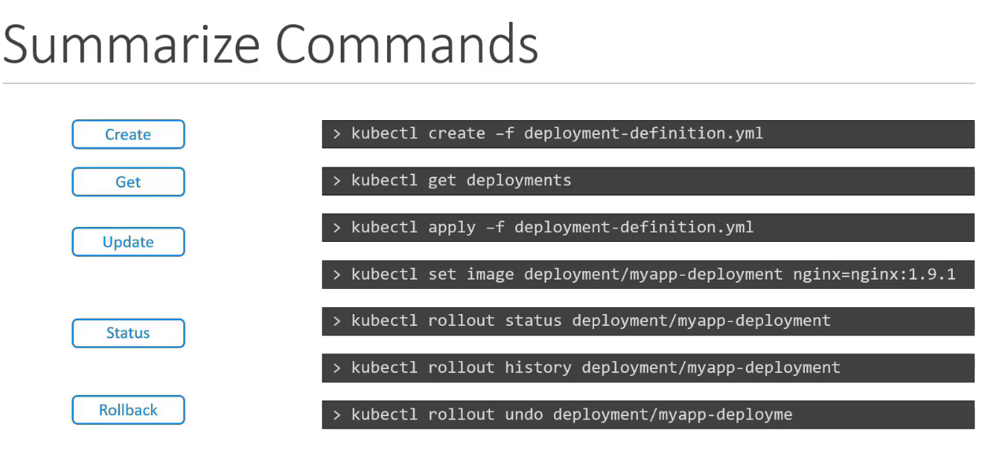  

## Namespaces
[Namespaces | Kubernetes](https://kubernetes.io/docs/concepts/overview/working-with-objects/namespaces/)  
In Kubernetes, _namespaces_ provide a mechanism for isolating groups of resources within a single cluster. Names of resources need to be unique within a namespace, but not across namespaces. Namespace-based scoping is applicable only for namespaced [objects](https://kubernetes.io/docs/concepts/overview/working-with-objects/#kubernetes-objects) _(e.g. Deployments, Services, etc.)_ and not for cluster-wide objects _(e.g. StorageClass, Nodes, PersistentVolumes, etc.)_.  
在 Kubernetes 中， _命名空间_提供了一种隔离单个集群内资源组的机制。资源名称在命名空间内需要唯一，但跨命名空间则不需要唯一。基于命名空间的范围仅适用于命名空间[对象](https://kubernetes.io/docs/concepts/overview/working-with-objects/#kubernetes-objects)_（例如 Deployments、Services 等），_ 而不适用于集群范围的对象 _（例如 StorageClass、Nodes、PersistentVolumes 等）_ 。
Namespaces are a way to divide cluster resources between multiple users (via resource quota).命名空间是在多个用户之间划分集群资源的一种方式（通过资源配额 ）。
To list the pods in another namespace. Use **`kubectl get pods`** command along with the **`--namespace`** flag or argument.  列出另一个命名空间中的 pod。使用 **`kubectl get pods`** 命令以及 **`--namespace`** 标志或参数。

```
$ kubectl get pods --namespace=kube-system
```

To create the pod with the pod-definition file in another namespace, use the **`--namespace`** option.  要在另一个命名空间中使用 pod-definition 文件创建 pod，请使用 **`--namespace`** 选项。

```
$ kubectl create -f pod-definition.yaml --namespace=dev
```
## Networking
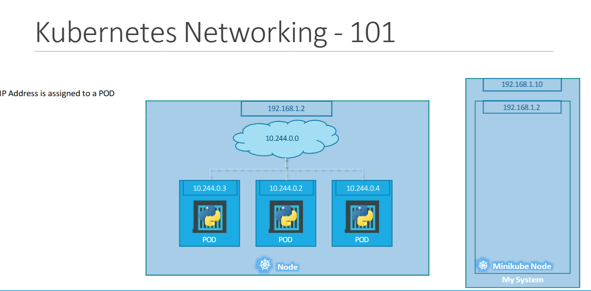
Kubernetes networking is a foundational concept that enables communication between various components in a cluster, as well as with external clients. Here’s an overview of the key elements:Kubernetes 网络是一个基础概念，它支持集群中各个组件以及外部客户端之间的通信。以下是关键元素的概述：

---

### 1. **Pod Networking**

- **Flat Network Model:扁平网络模型：**  
    Each pod in a Kubernetes cluster gets its own IP address. This allows pods to communicate with each other directly without NAT. The network is “flat” meaning every pod can, in theory, reach every other pod across nodes.Kubernetes 集群中的每个 Pod 都有自己的 IP 地址。这样 Pod 就可以直接相互通信，而无需 NAT。网络是“扁平”的，这意味着每个 Pod 理论上都可以跨节点访问其他每个 Pod。
    
- **Container Network Interface (CNI):容器网络接口 (CNI)：**  
    Kubernetes uses CNI plugins (like Calico, Flannel, or Weave Net) to implement the networking model. These plugins handle pod-to-pod connectivity, IP allocation, and sometimes network policies.Kubernetes 使用 CNI 插件（如 Calico、Flannel 或 Weave Net）来实现网络模型。这些插件负责处理 Pod 到 Pod 的连接、IP 分配，有时还负责处理网络策略。
    

---

### 2. **Service Networking**

- **Services:服务：**  
    A Service in Kubernetes defines a logical set of pods and a policy by which to access them. Services provide a stable IP address and DNS name, abstracting away the underlying pod IPs.Kubernetes 中的服务定义了一组逻辑上的 Pod 以及访问这些 Pod 的策略。服务提供稳定的 IP 地址和 DNS 名称，从而抽象出底层 Pod IP。
    
- **Types of Services:服务类型：**
    
    - **ClusterIP:** Accessible only within the cluster (default).**ClusterIP：**仅在集群内可访问（默认）。
    - **NodePort:** Exposes the service on a static port on each node.**NodePort：**在每个节点上的静态端口上公开服务。
    - **LoadBalancer:** Uses an external load balancer (in cloud environments) to distribute traffic.**LoadBalancer：**使用外部负载均衡器（在云环境中）来分配流量。
    - **ExternalName:** Maps a service to a DNS name.**ExternalName：**将服务映射到 DNS 名称。
- **Service Discovery:服务发现：**  
    Kubernetes automatically registers services in its internal DNS, allowing pods to discover and communicate using service names.Kubernetes 会自动在其内部 DNS 中注册服务，从而允许 Pod 使用服务名称进行发现和通信。
    

---

### 3. **Ingress**

- **Ingress Controller:入口控制器：**  
    Ingress provides a way to expose HTTP and HTTPS routes from outside the cluster to services within the cluster. It can handle SSL termination, virtual hosting, and load balancing.Ingress 提供了一种将集群外部的 HTTP 和 HTTPS 路由暴露给集群内部服务的方法。它可以处理 SSL 终止、虚拟主机和负载平衡。
    
- **Ingress Resource:入口资源：**  
    This defines the rules for routing external traffic to services based on hostnames or paths.这定义了根据主机名或路径将外部流量路由到服务的规则。
    

---

### 4. **Network Policies**

- **Access Control:访问控制：**  
    Network Policies allow you to specify how groups of pods are allowed to communicate with each other and with other network endpoints. They enable you to restrict traffic for security purposes.网络策略允许您指定 Pod 组如何相互通信以及与其他网络端点通信。它们使您能够出于安全目的限制流量。
    
- **Fine-Grained Rules:细粒度规则：**  
    You can define ingress (incoming) and egress (outgoing) rules based on pod labels, namespaces, or IP blocks.您可以根据 pod 标签、命名空间或 IP 块定义入口（传入）和出口（传出）规则。
    

---

### 5. External Connectivity
- **NodePort and LoadBalancer Services:NodePort 和 LoadBalancer 服务：**  
    These enable external traffic to reach services inside the cluster.这些使得外部流量能够到达集群内部的服务。
    
- **Ingress:入口：**  
    Offers more sophisticated routing capabilities and can act as a single entry point to your cluster.提供更复杂的路由功能，并可以作为集群的单一入口点。
    

---

### Summary

- **Pod Networking:** Each pod has a unique IP, and CNI plugins manage connectivity.**Pod 网络：**每个 pod 都有一个唯一的 IP，CNI 插件管理连接。
- **Service Networking:** Services provide stable endpoints for accessing sets of pods.**服务网络：**服务为访问 pod 集提供稳定的端点。
- **Ingress:** Routes external traffic to internal services using defined rules.**入口：**使用定义的规则将外部流量路由到内部服务。
- **Network Policies:** Control traffic flow between pods for security and compliance.**网络策略：**控制 pod 之间的流量以确保安全性和合规性。

Understanding these concepts helps ensure that your applications can communicate reliably and securely within the cluster and with the outside world.理解这些概念有助于确保您的应用程序能够在集群内和外部世界可靠、安全地进行通信。

## Service
[Using a Service to Expose Your App | Kubernetes](https://kubernetes.io/docs/tutorials/kubernetes-basics/expose/expose-intro/)  
[Service | Kubernetes](https://kubernetes.io/docs/concepts/services-networking/service/)  
​In Kubernetes, a **Service** is an abstraction that defines a logical set of Pods and a policy to access them, enabling external traffic exposure, load balancing, and service discovery for those Pods.在 Kubernetes 中， **Service**是一种抽象，它定义了一组逻辑 Pod 及其访问策略，从而为这些 Pod 实现外部流量暴露、负载平衡和服务发现。 ​Kubernetes Services enables communication between various components within and outside of the application.  Kubernetes 服务支持应用程序内部和外部各个组件之间的通信。

**Why Are Services Needed?为什么需要服务？**

Pods in Kubernetes are ephemeral; they can be created and destroyed dynamically, leading to changes in their IP addresses. This ephemeral nature makes it challenging for other components or external clients to reliably communicate with Pods. Services address this challenge by providing a stable network endpoint, ensuring consistent access to the Pods regardless of their lifecycle. ​[kubernetes.io](https://kubernetes.io/docs/concepts/services-networking/service/)Kubernetes 中的 Pod 是临时的；它们可以动态创建和销毁，从而导致其 IP 地址发生变化。这种临时性使得其他组件或外部客户端难以与 Pod 进行可靠的通信。服务通过提供稳定的网络端点来解决这一挑战，确保无论 Pod 的生命周期如何，都能一致地访问它们。

**Key Components of a Service:服务的关键组成部分：**

- **Label Selector:** Defines how the Service identifies the Pods it routes traffic to. For example, a Service can target all Pods with the label `app: nginx`.​[kubernetes.io+1spacelift.io+1](https://kubernetes.io/docs/tutorials/kubernetes-basics/expose/expose-intro/)**标签选择器：**定义服务如何识别其将流量路由到的 Pod。例如，服务可以定位带有标签`app: nginx`所有 Pod。 [​kubernetes.io +1 spacelift.io +1](https://kubernetes.io/docs/tutorials/kubernetes-basics/expose/expose-intro/)
    
- **ClusterIP:** An internal IP address assigned to the Service, used for routing traffic within the cluster.​**ClusterIP：**分配给服务的内部 IP 地址，用于在集群内路由流量。
    
- **Port Definitions:** Specify the ports on which the Service is accessible and the corresponding target ports on the Pods.​**端口定义：**指定服务可访问的端口以及 Pod 上对应的目标端口。
    

### Types of Kubernetes Services:
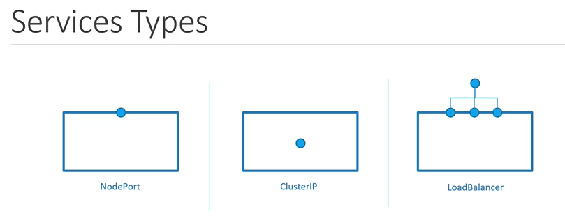

#### ClusterIP (Default):
Exposes the Service on an internal IP within the cluster, making it accessible only from within the cluster.​[kubernetes.io](https://kubernetes.io/docs/tutorials/kubernetes-basics/expose/expose-intro/)**ClusterIP（默认）：**在集群内的内部 IP 上公开服务，使其只能从集群内部访问。 [​kubernetes.io](https://kubernetes.io/docs/tutorials/kubernetes-basics/expose/expose-intro/)
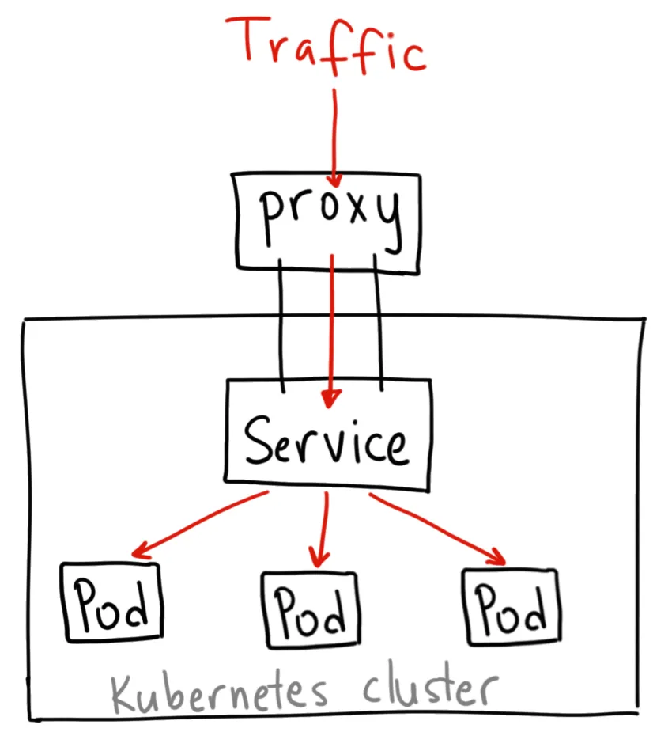
#### NodePort: 
Exposes the Service on the same port of each selected Node in the cluster using NAT, making it accessible from outside the cluster using `<NodeIP>:<NodePort>`.​[kubernetes.io](https://kubernetes.io/docs/tutorials/kubernetes-basics/expose/expose-intro/)**NodePort：**使用 NAT 在集群中每个选定节点的同一端口上公开服务，从而可以使用`<NodeIP>:<NodePort>`从集群外部访问该服务。 [​kubernetes.io](https://kubernetes.io/docs/tutorials/kubernetes-basics/expose/expose-intro/)
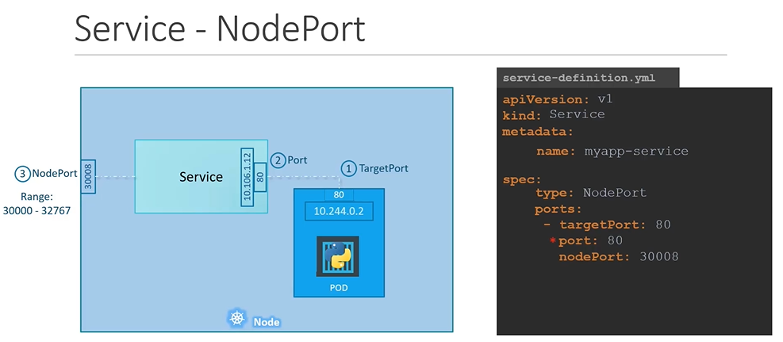
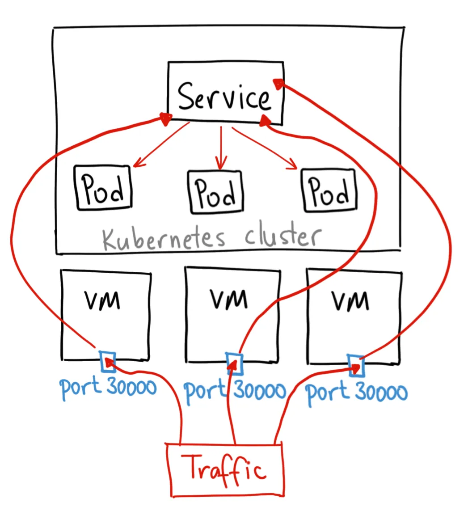
#### LoadBalancer:
Creates an external load balancer (if supported by the cloud provider) and assigns a fixed, external IP to the Service.​[kubernetes.io](https://kubernetes.io/docs/tutorials/kubernetes-basics/expose/expose-intro/)**LoadBalancer：**创建一个外部负载均衡器（如果云提供商支持）并为服务分配一个固定的外部 IP。 [​kubernetes.io](https://kubernetes.io/docs/tutorials/kubernetes-basics/expose/expose-intro/)
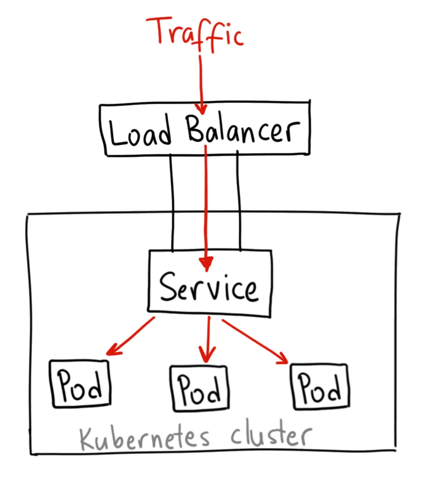

#### ExternalName:
Maps the Service to the contents of the `externalName` field (e.g., `foo.bar.example.com`), by returning a CNAME record with its value.​[kubernetes.io](https://kubernetes.io/docs/tutorials/kubernetes-basics/expose/expose-intro/)**ExternalName：**通过返回带有其值的 CNAME 记录，将服务映射到`externalName`字段的内容（例如`foo.bar.example.com` ）。 [​kubernetes.io](https://kubernetes.io/docs/tutorials/kubernetes-basics/expose/expose-intro/)

**Example of a Service Definition:服务定义示例：**

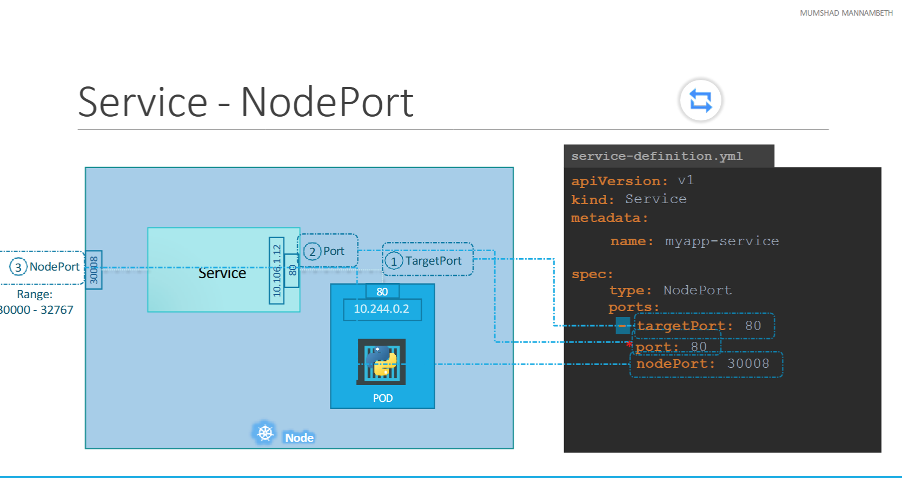

```yaml
apiVersion: v1
kind: Service
metadata:
  name: myapp-service
spec:
  type: NodePort
  ports:
    - targetPort: 80
      port: 80
      nodePort: 30008


```

In this example, the Service named `my-service` targets Pods with the label `app: nginx`, forwarding traffic from port 80 of the Service to port 9376 of the Pods.​[kubernetes.io](https://kubernetes.io/docs/concepts/services-networking/service/)在此示例中，名为`my-service`服务以带有标签`app: nginx` Pod 为目标，将流量从服务的端口 80 转发到 Pod 的端口 9376。 [​kubernetes.io](https://kubernetes.io/docs/concepts/services-networking/service/)

**Benefits of Using Services:使用服务的好处：**

- **Decoupling:** Services enable a loose coupling between dependent Pods, allowing backend Pods to be replaced without affecting the frontend Pods.​[kubernetes.io](https://kubernetes.io/docs/tutorials/kubernetes-basics/expose/expose-intro/)**解耦：**服务使依赖的 Pod 之间实现松散耦合，允许替换后端 Pod 而不影响前端 Pod。 [​kubernetes.io](https://kubernetes.io/docs/tutorials/kubernetes-basics/expose/expose-intro/)
    
- **Service Discovery:** Kubernetes automatically assigns DNS names to Services, facilitating easy discovery and communication between components.​**服务发现：** Kubernetes 自动为服务分配 DNS 名称，方便组件之间轻松发现和通信。
    
- **Load Balancing:** Services distribute network traffic across the set of Pods, ensuring even load distribution and high availability.​[spacelift.io](https://spacelift.io/blog/kubernetes-service)**负载平衡：**服务在 Pod 集之间分配网络流量，确保负载分布均匀且可用性高。 [​spacelift.io](https://spacelift.io/blog/kubernetes-service)
    

By leveraging Services, Kubernetes ensures that applications remain accessible, scalable, and maintainable, even as the underlying Pods are dynamically managed.​通过利用服务，Kubernetes 可以确保应用程序保持可访问、可扩展和可维护，即使底层 Pod 是动态管理的。

### cluster ip
[DNS for Services and Pods | Kubernetes](https://kubernetes.io/docs/concepts/services-networking/dns-pod-service/)  

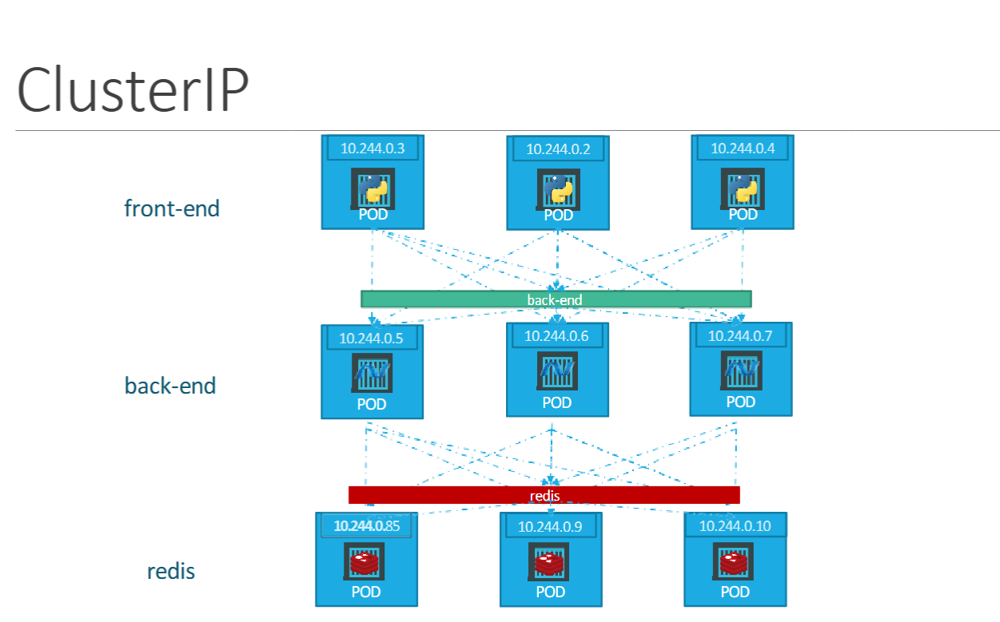  
​In Kubernetes, a **ClusterIP** service is the default method for exposing applications internally within a cluster. It provides a stable internal IP address, allowing pods to communicate with each other without exposing the service outside the cluster. ​[LinkedIn](https://www.linkedin.com/pulse/clusterip-service-kubernetes-christopher-adamson-jvy3c)在 Kubernetes 中， **ClusterIP**服务是集群内部公开应用程序的默认方法。它提供稳定的内部 IP 地址，允许 Pod 相互通信，而无需将服务暴露在集群外部。 [​LinkedIn](https://www.linkedin.com/pulse/clusterip-service-kubernetes-christopher-adamson-jvy3c)

**Key Characteristics of ClusterIP Services: ClusterIP 服务的主要特点：**

- **Internal Access Only:** Accessible solely within the Kubernetes cluster, not from external networks.​**仅限内部访问：**只能在 Kubernetes 集群内访问，不能从外部网络访问。
    
- **Stable IP Address:** Assigns a consistent internal IP for reliable inter-pod communication.​**稳定的 IP 地址：**分配一致的内部 IP，以实现可靠的 pod 间通信。
```
apiVersion: vl
kind: Service
metadata :
	name : back—end
spec :
	type: ClusterIP
	ports :
	— targetPort: 80
		port: 80
	selector :
		app: myapp
		type: back-end

```

### loadbalancer
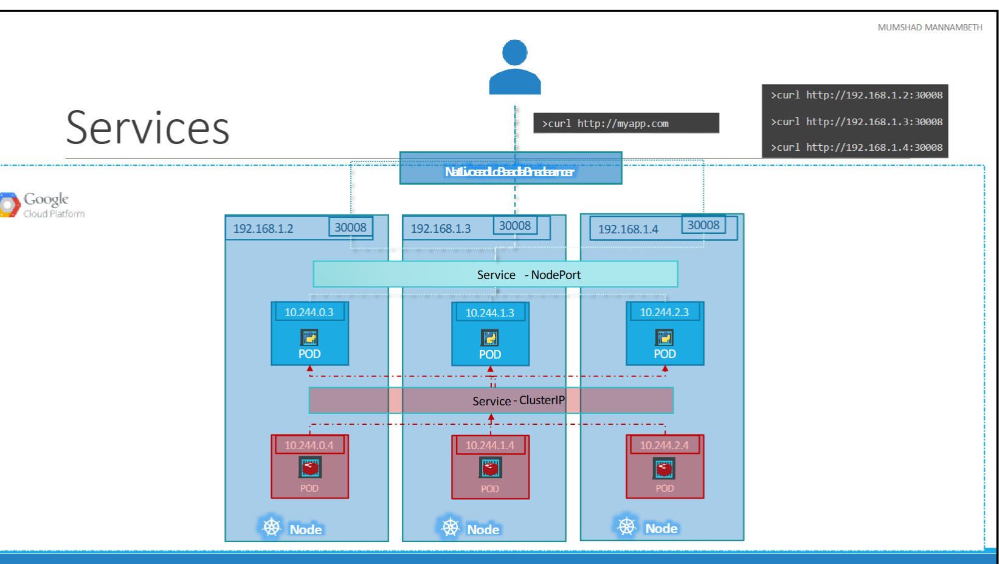
A **LoadBalancer** service in Kubernetes automatically provisions an external load balancer (usually provided by a cloud provider) to distribute incoming traffic across your application's pods. This type of service assigns an external IP address that can be used to access your application from outside the cluster. It’s especially useful in production environments where you need to expose your application to the internet without manual load balancer configuration.Kubernetes 中的**LoadBalancer**服务会自动配置外部负载均衡器（通常由云提供商提供），以在应用程序的 Pod 之间分配传入流量。此类服务会分配一个外部 IP 地址，可用于从集群外部访问应用程序。它在生产环境中特别有用，因为您需要在无需手动配置负载均衡器的情况下将应用程序暴露给互联网。

## Difference between replicaset & deployment & service
- **ReplicaSet:副本集：**  
    This object is responsible for maintaining a stable set of replica Pods running at any given time. Its main job is to ensure that a specified number of pod replicas are active, restarting any that fail.此对象负责维护一组稳定的 Pod 副本，这些副本在任何给定时间都处于运行状态。其主要工作是确保指定数量的 Pod 副本处于活动状态，并重新启动任何发生故障的 Pod 副本。
    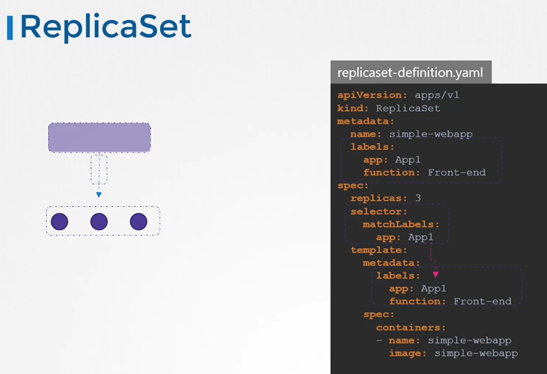
    
- **Deployment:部署：**  
    A Deployment builds on the ReplicaSet. It provides declarative updates to Pods and ReplicaSets, which means you can easily roll out new versions of your application, roll back to previous versions, and manage updates without downtime. Essentially, a Deployment creates and manages a ReplicaSet behind the scenes.Deployment 建立在 ReplicaSet 之上。它为 Pod 和 ReplicaSet 提供声明式更新，这意味着您可以轻松推出应用程序的新版本、回滚到以前的版本以及管理更新而无需停机。本质上，Deployment 在后台创建和管理 ReplicaSet。
    
- **Service:服务：**  
    While ReplicaSets and Deployments focus on running your application, a Service defines a stable network endpoint for accessing a group of Pods. It abstracts away the dynamic nature of Pods (which might be created or destroyed) by providing a consistent IP address and DNS name, often also load-balancing traffic across the Pods.虽然 ReplicaSet 和 Deployment 专注于运行您的应用程序，但 Service 定义了一个稳定的网络端点来访问一组 Pod。它通过提供一致的 IP 地址和 DNS 名称来抽象 Pod 的动态特性（可能会被创建或销毁），通常还会在 Pod 之间进行流量负载平衡。
    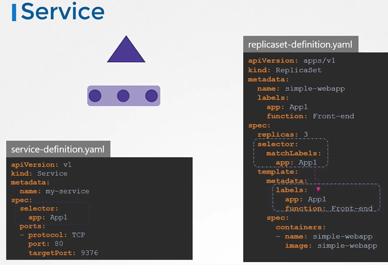
    

In summary, a ReplicaSet ensures the right number of Pods are running; a Deployment manages those ReplicaSets and handles application updates; and a Service provides reliable network access to your Pods.总之，ReplicaSet 确保运行正确数量的 Pod；Deployment 管理这些 ReplicaSet 并处理应用程序更新；Service 为您的 Pod 提供可靠的网络访问。

## Scheduling
[Assigning Pods to Nodes | Kubernetes](https://kubernetes.io/docs/concepts/scheduling-eviction/assign-pod-node/)  
[Kubernetes API Concepts | Kubernetes](https://kubernetes.io/docs/reference/using-api/api-concepts/)  
### Labels and Selectors
Labels and Selectors are standard methods to group things together. 标签和选择器是将事物分组在一起的标准方法。Labels are properties attached to each item. 标签是附加在每个项目上的属性。
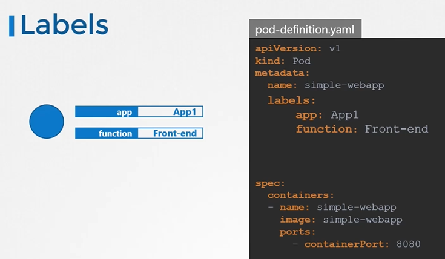
Via a _label selector_, the client/user can identify a set of objects. The label selector is the core grouping primitive in Kubernetes.  通过_标签选择器_ ，客户端/用户可以识别一组对象。标签选择器是 Kubernetes 中的核心分组原语。
### Taints and Tolerations
Node affinity is a property of Pods that attracts them to a set of nodes (either as a preference or a hard requirement). Taints are the opposite -- they allow a node to repel a set of pods.节点亲和性 是 Pod 的属性，可将它们吸引到一组节点（作为偏好或硬性要求）。 污点则相反 - 它们允许节点排斥一组 Pod。
Tolerations are applied to pods. Tolerations allow the scheduler to schedule pods with matching taints. Tolerations allow scheduling but don't guarantee scheduling: the scheduler also evaluates other parameters as part of its function.容忍度适用于 Pod。容忍度允许调度程序根据匹配的 污点。容忍度允许调度，但不保证调度：调度程序还 评估其他参数 作为其功能的一部分。
Taints and tolerations work together to ensure that pods are not scheduled onto inappropriate nodes. One or more taints are applied to a node; this marks that the node should not accept any pods that do not tolerate the taints.  污点和容忍度协同工作，以确保 Pod 不会被调度到不合适的节点上。一个节点上会应用一个或多个污点；这标志着该节点不应接受任何不容忍污点的 Pod。
#### taint
Use kubectl taint nodes command to taint a node.
使用 kubectl taint nodes 命令来污染节点。
You add a taint to a node using [kubectl taint](https://kubernetes.io/docs/reference/generated/kubectl/kubectl-commands#taint). For example,  
您可以使用 [kubectl taint](https://kubernetes.io/docs/reference/generated/kubectl/kubectl-commands#taint) 向节点添加污点。例如，

```shell
kubectl taint nodes node1 key1=value1:NoSchedule
```

places a taint on node `node1`. The taint has key `key1`, value `value1`, and taint effect `NoSchedule`. This means that no pod will be able to schedule onto `node1` unless it has a matching toleration.  
在节点 `node1` 上放置污点。污点的键为 `key1` ，值是 `value1` ，污点效果为 `NoSchedule` 。这意味着，除非具有匹配的容忍度，否则任何 Pod 都无法调度到 `node1` 上。

To remove the taint added by the command above, you can run:  
要删除上述命令添加的污点，您可以运行：

```shell
kubectl taint nodes node1 key1=value1:NoSchedule-
```

#### Tolerations
```yaml
apiVersion: v1
kind: Pod
metadata:
 name: myapp-pod
spec:
 containers:
 - name: nginx-container
   image: nginx
 tolerations:
 - key: "app"
   operator: "Equal"
   value: "blue"
   effect: "NoSchedule"
```
means that if a node is tainted with `app=blue` and has the effect `NoSchedule`, this pod can be scheduled on that node. Without the toleration, the node’s taint would normally repel pods that don’t tolerate it.意味着如果某个节点被 `app=blue` 污染，并且具有 `NoSchedule` 效果，则此 pod 可以调度到该节点。如果没有容忍，节点的污染通常会排斥不容忍它的 pod。

### Node Selectors
[Assigning Pods to Nodes | Kubernetes](https://kubernetes.io/docs/concepts/scheduling-eviction/assign-pod-node/)  
`nodeSelector` is the simplest recommended form of node selection constraint. You can add the `nodeSelector` field to your Pod specification and specify the [node labels](https://kubernetes.io/docs/concepts/scheduling-eviction/assign-pod-node/#built-in-node-labels) you want the target node to have. Kubernetes only schedules the Pod onto nodes that have each of the labels you specify.  
`nodeSelector` 是最简单的推荐节点选择约束形式。您可以将 `nodeSelector` 字段添加到 Pod 规范中，并指定 您希望目标节点具有的[节点标签](https://kubernetes.io/docs/concepts/scheduling-eviction/assign-pod-node/#built-in-node-labels) 。Kubernetes 仅将 Pod 调度到具有您指定的每个标签的节点上。
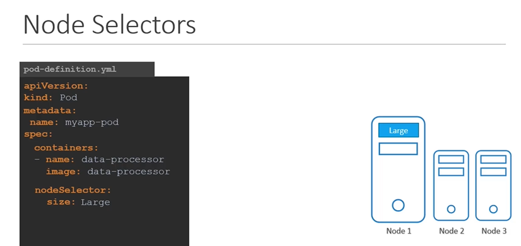
### Node Affinity
```yaml
apiVersion: apps/v1
kind: Deployment
metadata:
  name: red
  labels:
    app: red
spec:
  replicas: 2
  selector:
    matchLabels:
      app: red
  template:
    metadata:
      labels:
        app: red
    spec:
      affinity:
        nodeAffinity:
          requiredDuringSchedulingIgnoredDuringExecution:
            nodeSelectorTerms:
            - matchExpressions:
              - key: node-role.kubernetes.io/control-plane
                operator: Exists
      containers:
      - name: nginx
        image: nginx

```
Create a new deployment named red with the nginx image and 2 replicas, and ensure it gets placed on the controlplane node only. Use the label key - node-role.kubernetes.io/control-plane - which is already set on the controlplane node. 使用 nginx 镜像和 2 个副本创建一个名为 red 的新部署，并确保它仅放置在控制平面节点上。 使用已在控制平面节点上设置的标签键 - node-role.kubernetes.io/control-plane。
### Resource Limits
[Resource Management for Pods and Containers | Kubernetes](https://kubernetes.io/docs/concepts/configuration/manage-resources-containers/)  
When you specify the resource request for containers in a Pod, the kube-scheduler uses this information to decide which node to place the Pod on. When you specify a resource limit for a container, the kubelet enforces those limits so that the running container is not allowed to use more of that resource than the limit you set. The kubelet also reserves at least the request amount of that system resource specifically for that container to use.
当你指定 Pod 中容器的资源请求时， kube-scheduler 使用此信息来决定将 Pod 放置在哪个节点上。当您为容器指定资源限制时， kubelet 会强制执行这些限制，以便正在运行的容器使用的资源不得超过您设置的限制。kubelet 还会至少保留请求量的系统资源供该容器使用。
By default, k8s sets resource limits to 1 CPU and 512Mi of memory 默认情况下，k8s 将资源限制设置为 1 个 CPU 和 512Mi 内存  
### DaemonSet
DaemonSets are like replicasets, as it helps in to deploy multiple instances of pod. But it runs one copy of your pod on each node in your cluster. DaemonSet 类似于副本集，因为它有助于部署 pod 的多个实例。但它会在集群中的每个节点上运行 pod 的一个副本。
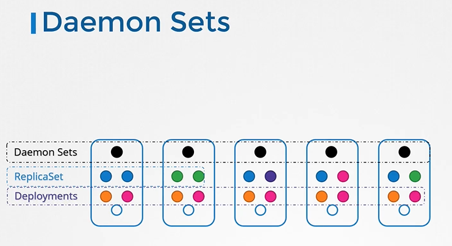
Some typical uses of a DaemonSet are:
DaemonSet 的一些典型用途包括：
- running a cluster storage daemon on every node 在每个节点上运行集群存储守护进程  
- running a logs collection daemon on every node 在每个节点上运行日志收集守护进程  
- running a node monitoring daemon on every node 在每个节点上运行节点监控守护进程

### Static Pods
Static Pods are managed directly by the kubelet daemon on a specific node, without the API server observing them. Unlike Pods that are managed by the control plane (for example, a Deployment); instead, the kubelet watches each static Pod (and restarts it if it fails). 静态 Pod 由特定节点上的 kubelet 守护进程直接管理，无需 API 服务器 观察它们。 与由控制平面管理的 Pod（例如 部署）；相反，kubelet 会监视每个静态 Pod（如果失败，则重新启动它）。

###  Multiple Schedulers
The scheduler is not just an admission controller; for each pod that is created, it finds the "best" machine for that pod, and if no machine is suitable, the pod remains unscheduled until a machine becomes suitable.  
调度程序不仅仅是一个准入控制器；对于创建的每个 Pod，它会为该 Pod 找到“最佳”机器，如果没有合适的机器，则 Pod 将保持未调度状态，直到有机器变得合适。

### Admission Control
[Admission Control in Kubernetes | Kubernetes](https://kubernetes.io/docs/reference/access-authn-authz/admission-controllers/)
An admission controller is a piece of code that intercepts requests to the Kubernetes API server prior to persistence of the resource, but after the request is authenticated and authorized.
准入控制器是一段代码，它在资源持久化之前、但在请求经过身份验证和授权之后拦截对 Kubernetes API 服务器的请求。

Admission control mechanisms may be _validating_, _mutating_, or both. Mutating controllers may modify the data for the resource being modified; validating controllers may not.  
准入控制机制可能是_验证_ 、 _变更_或两者兼而有之。变更控制器可能会修改正在修改的资源的数据；验证控制器则不会。  

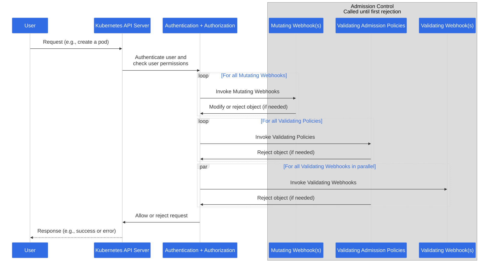
## Logging and Monitoring 
[Resource metrics pipeline | Kubernetes](https://kubernetes.io/docs/tasks/debug/debug-cluster/resource-metrics-pipeline/)
[Tools for Monitoring Resources | Kubernetes](https://kubernetes.io/docs/tasks/debug/debug-cluster/resource-usage-monitoring/)  
To scale an application and provide a reliable service, you need to understand how the application behaves when it is deployed. You can examine application performance in a Kubernetes cluster by examining the containers, pods, services, and the characteristics of the overall cluster. Kubernetes provides detailed information about an application's resource usage at each of these levels. This information allows you to evaluate your application's performance and where bottlenecks can be removed to improve overall performance.
要扩展应用程序并提供可靠的服务，您需要 了解应用程序在部署时的行为。您可以检查 通过检查容器来检查 Kubernetes 集群中的应用程序性能， 豆荚 ， 服务 ，以及整个集群的特征。Kubernetes 在每个级别上提供有关应用程序资源使用情况的详细信息。这些信息可让您评估应用程序的性能以及可以消除哪些瓶颈以提高整体性能。
```
kubectl top node
kubectl logs webapp-1
```

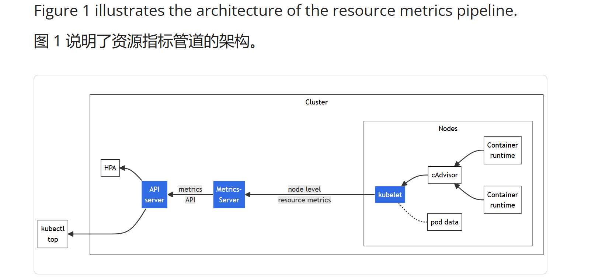

## Application Lifecycle Management
[Deployments | Kubernetes](https://kubernetes.io/docs/concepts/workloads/controllers/deployment/)  
[Run a Stateless Application Using a Deployment | Kubernetes](https://kubernetes.io/docs/tasks/run-application/run-stateless-application-deployment/)  
A Deployment provides declarative updates for Pods and ReplicaSets.
Deployment 为 Pod 提供声明式更新，并且 副本集。

You describe a desired state in a Deployment, and the Deployment Controller changes the actual state to the desired state at a controlled rate. You can define Deployments to create new ReplicaSets, or to remove existing Deployments and adopt all their resources with new Deployments.
您在 Deployment 中描述所需状态 ，然后 Deployment Controller 会以受控的速率将实际状态更改为所需状态。您可以定义 Deployment 来创建新的 ReplicaSet，或删除现有 Deployment 并使用新 Deployment 来采用其所有资源。
### Rolling Updates and Rollback

```sh
# see the status of the rollout
$ kubectl rollout status deployment/myapp-deployment

# see the history and revisions
$ kubectl rollout history deployment/myapp-deployment

# To undo a change
$ kubectl rollout undo deployment/myapp-deployment
```

### Commands and Arguments in Kubernetes
Anything that is appended to the docker run command will go into the args property of the pod definition file in the form of an array.
附加到 docker run 命令的任何内容都将以数组的形式进入 pod 定义文件的 args 属性。
The command field corresponds to the entrypoint instruction in the Dockerfile so to summarize there are 2 fields that correspond to 2 instructions in the Dockerfile.
命令字段对应于 Dockerfile 中的入口点指令，因此总结一下，有 2 个字段对应于 Dockerfile 中的 2 条指令。
```
apiVersion: v1
kind: Pod
metadata:
  name: ubuntu-sleeper-pod
spec:
 containers:
 - name: ubuntu-sleeper
   image: ubuntu-sleeper
   command: ["sleep2.0"]
   args: ["10"]
```
### Configure Environment Variables
[Define Environment Variables for a Container | Kubernetes](https://kubernetes.io/docs/tasks/inject-data-application/define-environment-variable-container/)  
To set an environment variable set an env property in pod definition file.
要设置环境变量，请在 pod 定义文件中设置 env 属性。
```
apiVersion: v1
kind: Pod
metadata:
  name: simple-webapp-color
spec:
 containers:
 - name: simple-webapp-color
   image: simple-webapp-color
   ports:
   - containerPort: 8080
   env:
   - name: APP_COLOR
     value: pink
```

### Configure ConfigMaps
[Configure a Pod to Use a ConfigMap | Kubernetes](https://kubernetes.io/docs/tasks/configure-pod-container/configure-pod-configmap/)  
The ConfigMap concept allow you to decouple configuration artifacts from image content to keep containerized applications portable. For example, you can download and run the same container image to spin up containers for the purposes of local development, system test, or running a live end-user workload.
ConfigMap 概念允许你将配置工件与镜像内容分离为 保持容器化应用程序的可移植性。例如，您可以下载并运行相同的 容器映像用于启动容器以用于本地开发、系统测试或运行实时最终用户工作负载。
creating a configmap 
```
$ kubectl create configmap app-config --from-literal=APP_COLOR=blue --from-literal=APP_MODE=prod

$ kubectl create configmap app-config --from-file=app_config.properties (Another way)
```
or 

```yaml 
# 
apiVersion: v1
kind: ConfigMap
metadata:
 name: app-config
data:
 APP_COLOR: blue
 APP_MODE: prod


# Create a config map definition file and run the 'kubectl create` command to deploy it.
$ kubectl create -f config-map.yaml

```

Inject configmap in pod  在 pod 中注入 configmap   
```yaml
apiVersion: v1
kind: Pod
metadata:
  name: simple-webapp-color
spec:
 containers:
 - name: simple-webapp-color
   image: simple-webapp-color
   ports:
   - containerPort: 8080
   envFrom:
   - configMapRef:
       name: app-config
```

### Secrets
[Secrets | Kubernetes](https://kubernetes.io/docs/concepts/configuration/secret/)  
A Secret is an object that contains a small amount of sensitive data such as a password, a token, or a key. Such information might otherwise be put in a Pod specification or in a container image. Using a Secret means that you don't need to include confidential data in your application code.
Secret 是包含少量敏感数据的对象，例如 密码、令牌或密钥。否则，这些信息可能会被放在 Pod 规范或 容器镜像。使用 Secret 意味着您不需要在应用程序代码中包含机密数据。
```shell
$ kubectl create secret generic app-secret --from-literal=DB_Host=mysql --from-literal=DB_User=root --from-literal=DB_Password=paswrd

$ kubectl create secret generic app-secret --from-file=app_secret.properties
```

```yaml
 apiVersion: v1
 kind: Pod
 metadata:
   name: simple-webapp-color
 spec:
  containers:
  - name: simple-webapp-color
    image: simple-webapp-color
    ports:
    - containerPort: 8080
    envFrom:
    - secretRef:
        name: app-secret
```

###  Multi-Container Pods
```yaml
# create a new multi-container pod
apiVersion: v1
kind: Pod
metadata:
  name: simple-webapp
  labels:
    name: simple-webapp
spec:
  containers:
  - name: simple-webapp
    image: simple-webapp
    ports:
    - ContainerPort: 8080
  - name: log-agent
    image: log-agent
```

### Init Containers
[Init Containers | Kubernetes](https://kubernetes.io/docs/concepts/workloads/pods/init-containers/)  
[Configure Pod Initialization | Kubernetes](https://kubernetes.io/docs/tasks/configure-pod-container/configure-pod-initialization/)  
When a POD is first created the initContainer is run, and the process in the initContainer must run to a completion before the real container hosting the application starts.
首次创建 POD 时，将运行 initContainer，并且 initContainer 中的进程必须运行完成，然后托管应用程序的实际容器才能启动。

You can configure multiple such initContainers as well, like how we did for multi-containers pod. In that case, each init container is run one at a time in sequential order.
您也可以配置多个这样的 initContainer，就像我们对多容器 pod 所做的那样。在这种情况下，每个 init 容器按顺序一次运行一个。

If any of the initContainers fail to complete, Kubernetes restarts the Pod repeatedly until the Init Container succeeds.
如果任何 initContainer 未能完成，Kubernetes 将反复重启 Pod，直到 Init Container 成功。
```yaml
apiVersion: v1
kind: Pod
metadata:
  name: myapp-pod
  labels:
    app: myapp
spec:
  containers:
  - name: myapp-container
    image: busybox:1.28
    command: ['sh', '-c', 'echo The app is running! && sleep 3600']
  initContainers:
  - name: init-myservice
    image: busybox
    command: ['sh', '-c', 'git clone <some-repository-that-will-be-used-by-application> ;']
```

## Cluster Maintenance
[Safely Drain a Node | Kubernetes](https://kubernetes.io/docs/tasks/administer-cluster/safely-drain-node/)  
```sh
# You can purposefully drain the node of all the workloads so that the workloads are moved to other nodes
$ kubectl drain node-1

# When the node is back online after a maintenance, it is still unschedulable. You then need to uncordon it.
$ kubectl uncordon node-1

$ kubectl drain node01 --ignore-daemonsets

```

### Cluster Upgrade
At any time, kubernetes supports only up to the recent 3 minor versions
任何时候，kubernetes 仅支持最近的 3 个次要版本
The recommended approach is to upgrade one minor version at a time.
建议的方法是一次升级一个小版本。
[kubeadm upgrade | Kubernetes](https://kubernetes.io/docs/reference/setup-tools/kubeadm/kubeadm-upgrade/)  
[Upgrading kubeadm clusters | Kubernetes](https://kubernetes.io/docs/tasks/administer-cluster/kubeadm/kubeadm-upgrade/)  

```shell

kubeadm upgrade plan

# Upgrade kubeadm from v1.11 to v1.12
$ apt-get upgrade -y kubeadm=1.12.0-00

# Upgrade the cluster
$ kubeadm upgrade apply v1.12.0

# Upgrade 'kubelet' on the master node
$ apt-get upgrade kubelet=1.12.0-00

$ systemctl restart kubelet


# ## Upgrade worker nodes
# move the workloads to other nodes
$ kubectl drain node-1

# Upgrade kubeadm and kubelet packages
$ apt-get upgrade -y kubeadm=1.12.0-00
$ apt-get upgrade -y kubelet=1.12.0-00

# Update the node configuration for the new kubelet version
$ kubeadm upgrade node config --kubelet-version v1.12.0

# resume service
$ systemctl restart kubelet
$ kubectl uncordon node-1
```

### Backup and Restore
[Operating etcd clusters for Kubernetes | Kubernetes](https://kubernetes.io/docs/tasks/administer-cluster/configure-upgrade-etcd/)  
```shell
# Backup - Resource Configs
$ kubectl get all --all-namespaces -o yaml > all-deploy-services.yaml
$ export ETCDCTL_API=3

# Backup - ETCD
$ ETCDCTL_API=3 etcdctl snapshot save snapshot.db
$  ETCDCTL_API=3 etcdctl snapshot status snapshot.db

#
$ ETCDCTL_API=3 etcdctl  --data-dir /var/lib/etcd-from-backup \
snapshot restore /opt/snapshot-pre-boot.db
# To restore etcd from the backup at later in time. First stop kube-apiserver service
$ service kube-apiserver stop

$ systemctl daemon-reload
$ service etcd restart
$ service kube-apiserver start
```

## Security
### Authentication
All user access is managed by apiserver and all of the requests goes through apiserver. 所有用户访问均由 apiserver 管理，所有请求都经过 apiserver。
```shell
# To authenticate using the basic credentials while accessing the API server specify the username and password in a curl command.
$ curl -v -k http://master-node-ip:6443/api/v1/pods -u "user1:password123"
```
### TLS
The two primary requirements are to have all the various services within the cluster to use server certificates and all clients to use client certificates to verify they are who they say they are.
两个主要要求是让集群内的所有各种服务使用服务器证书，并让所有客户端使用客户端证书来验证他们的身份。 
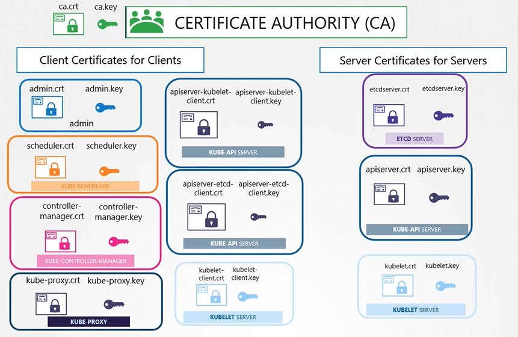  
```shell
## ## Certificate Authority (CA)
# Generate Keys
$ openssl genrsa -out ca.key 2048

# Generate CSR
$ openssl req -new -key ca.key -subj "/CN=KUBERNETES-CA" -out ca.csr

# Sign certificates
$ openssl x509 -req -in ca.csr -signkey ca.key -out ca.crt

==================================================
# ## Generating Client Certificates
# Generate Keys  生成钥匙
$ openssl genrsa -out admin.key 2048

# Generate CSR  生成 CSR
$ openssl req -new -key admin.key -subj "/CN=kube-admin" -out admin.csr

#Sign certificates  签署证书
$ openssl x509 -req -in admin.csr -CA ca.crt -CAkey ca.key -out admin.crt

```
We follow the same procedure to generate client certificate for all other components that access the kube-apiserver.
我们遵循相同的程序为访问 kube-apiserver 的所有其他组件生成客户端证书。

[PKI certificates and requirements | Kubernetes](https://kubernetes.io/docs/setup/best-practices/certificates/#certificate-paths)  

view certificates in a kubernetes cluster.
```shell
# how to view certificates in a kubernetes cluster.
$ cat /etc/systemd/system/kube-apiserver.service
$ cat /etc/kubernetes/manifests/kube-apiserver.yaml

# To view the details of the certificate 查看证书的详细信息

$ openssl x509 -in /etc/kubernetes/pki/apiserver.crt -text -noout
```

Certificate Health-Check Spreadsheet 证书健康检查电子表格
[Certificate Health-Check Spreadsheet](https://github.com/mmumshad/kubernetes-the-hard-way/raw/refs/heads/master/tools/kubernetes-certs-checker.xlsx) 


### Certificate API
how to manage certificates and certificate API's in kubernetes  
With the certificate API, we now send a certificate signing request (CSR) directly to kubernetes through an API call. 通过证书 API，我们现在可以通过 API 调用直接向 kubernetes 发送证书签名请求 (CSR)。This certificate can then be extracted and shared with the user. 然后可以提取该证书并与用户共享。
```shell
# A user first creates a key 用户首先创建一个密钥
$ openssl genrsa -out jane.key 2048

# Generates a CSR   生成 CSR
$ openssl req -new -key jane.key -subj "/CN=jane" -out jane.csr 

# Sends the request to the administrator and the adminsitrator takes the key and creates a CSR object, with kind as "CertificateSigningRequest" and a encoded "jane.csr"

apiVersion: certificates.k8s.io/v1beta1
kind: CertificateSigningRequest
metadata:
  name: jane
spec:
  groups:
  - system:authenticated
  usages:
  - digital signature
  - key encipherment
  - server auth
  request:
    <certificate-goes-here>

$ cat jane.csr |base64 $ kubectl create -f jane.yaml

# To list the csr's  列出 csr
$ kubectl get csr

# Approve the request  批准请求
$ kubectl certificate approve jane

# To view the certificate  查看证书
$ kubectl get csr jane -o yaml

# To decode it  解码
$ echo "<certificate>" |base64 --decode
```

### KubeConfig
[Configure Access to Multiple Clusters | Kubernetes](https://kubernetes.io/docs/tasks/access-application-cluster/configure-access-multiple-clusters/)  
Client uses the certificate file and key to query the kubernetes Rest API for a list of pods using curl.
客户端使用证书文件和密钥通过 curl 向 kubernetes Rest API 查询 pod 列表。

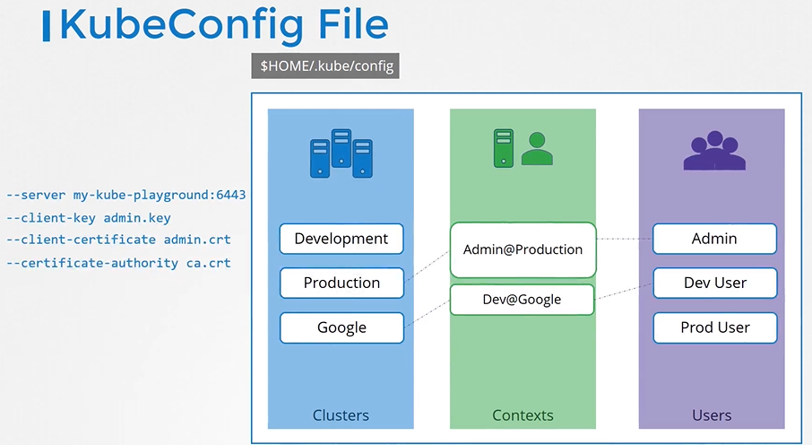    
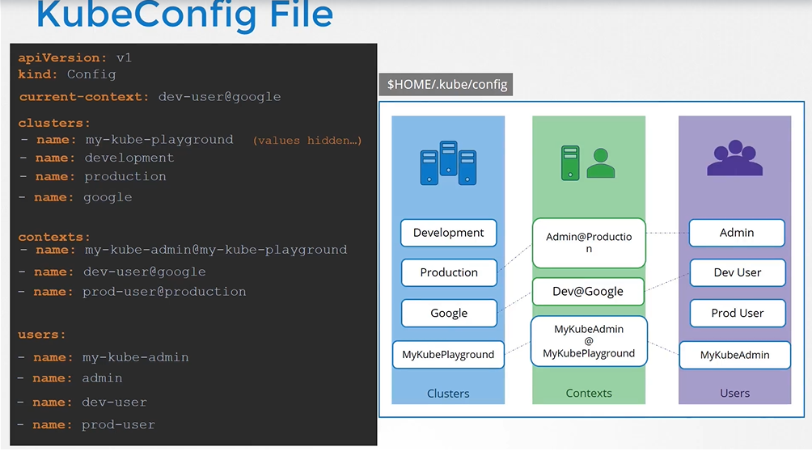  

```shell
# We can move these information to a configuration file called kubeconfig. And the specify this file as the kubeconfig option in the command. 我们可以把这些信息移动到一个名为 kubeconfig 的配置文件中。并在命令中将此文件指定为 kubeconfig 选项。
$ kubectl get pods --kubeconfig config

# To view the current file being used 查看当前正在使用的文件
$ kubectl config view

# You can specify the kubeconfig file with kubectl config view with "--kubeconfig" flag 您可以使用带有“--kubeconfig”标志的 kubectl config view 指定 kubeconfig 文件
$ kubectl config veiw --kubeconfig=my-custom-config

# How do you update your current context? Or change the current context 如何更新当前上下文？或者更改当前上下文

$ kubectl config use-context <context-name>
ex: 
$ kubectl config use-context prod-user@production


```

### Kubernetes API
[The Kubernetes API | Kubernetes](https://kubernetes.io/docs/concepts/overview/kubernetes-api/)  
[Kubernetes API Concepts | Kubernetes](https://kubernetes.io/docs/reference/using-api/api-concepts/)  
[Use an HTTP Proxy to Access the Kubernetes API | Kubernetes](https://kubernetes.io/docs/tasks/extend-kubernetes/http-proxy-access-api/)  
The kubernetes API is grouped into multiple such groups based on their purpose. Such as one for APIs, one for healthz, metrics and logs etc.
kubernetes API 根据其用途分为多个这样的组。例如一个用于 APIs ，一个用于 healthz ， metrics 和 logs 等。
The core group - Where all the functionality exists 核心组 - 所有功能所在的位置  
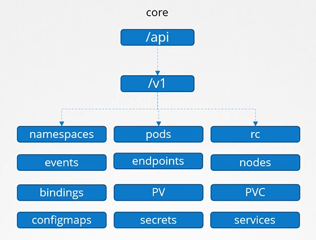
The Named group - More organized and going forward all the newer features are going to be made available to these named groups. 命名组 - 更加有组织，并且未来所有较新的功能都将提供给这些命名组。  
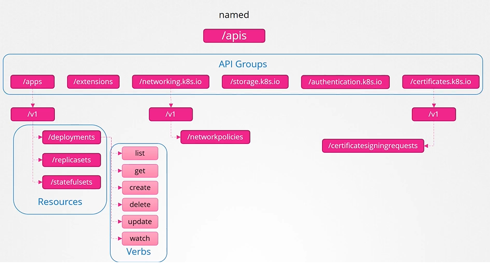
### Authorization
[Authorization | Kubernetes](https://kubernetes.io/docs/reference/access-authn-authz/authorization/)  
Kubernetes authorization of API requests takes place within the API server. The API server evaluates all of the request attributes against all policies, potentially also consulting external services, and then allows or denies the request.
Kubernetes 对 API 请求的授权在 API 服务器内进行。API 服务器会根据所有策略评估所有请求属性，可能还会咨询外部服务，然后允许或拒绝该请求。
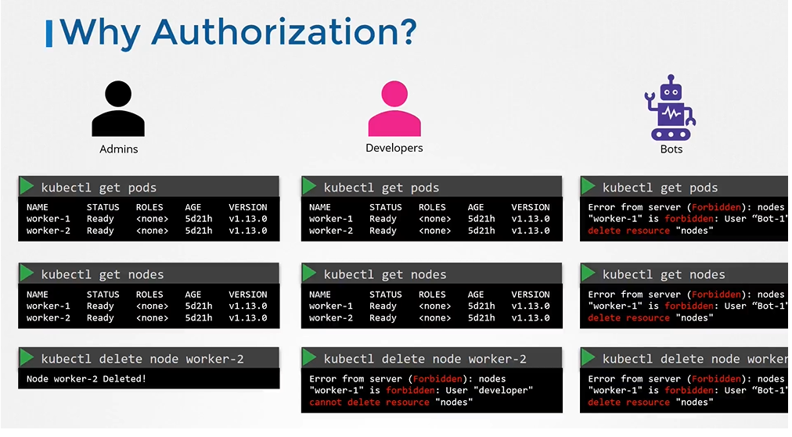
There are different authorization mechanisms supported by kubernetes  kubernetes 支持不同的授权机制
- Node Authorization  节点授权
- Attribute-based Authorization (ABAC)  基于属性的授权 (ABAC)
- Role-Based Authorization (RBAC)  基于角色的授权 (RBAC)
- Webhook  

### Role-based access control (RBAC)
[Using RBAC Authorization | Kubernetes](https://kubernetes.io/docs/reference/access-authn-authz/rbac/)  
A Role always sets permissions within a particular namespace; when you create a Role, you have to specify the namespace it belongs in.
角色总是在特定的命名空间内设置权限；创建角色时，必须指定它所属的命名空间。

ClusterRole, by contrast, is a non-namespaced resource. The resources have different names (Role and ClusterRole) because a Kubernetes object always has to be either namespaced or not namespaced; it can't be both.
相比之下，ClusterRole 是一种非命名空间资源。这些资源具有不同的名称（Role 和 ClusterRole），因为 Kubernetes 对象始终必须是命名空间或非命名空间；不能两者兼而有之。
If you want to define a role within a namespace, use a Role; if you want to define a role cluster-wide, use a ClusterRole.
如果您想在命名空间内定义角色，请使用 Role；如果您想在集群范围内定义角色，请使用 ClusterRole。
```yaml
# create the role with kubectl command
apiVersion: rbac.authorization.k8s.io/v1
kind: Role
metadata:
  name: developer
rules:
- apiGroups: [""] # "" indicates the core API group
  resources: ["pods"]
  verbs: ["get", "list", "update", "delete", "create"]
- apiGroups: [""]
  resources: ["ConfigMap"]
  verbs: ["create"]

```
A role binding grants the permissions defined in a role to a user or set of users. It holds a list of _subjects_ (users, groups, or service accounts), and a reference to the role being granted. A RoleBinding grants permissions within a specific namespace whereas a ClusterRoleBinding grants that access cluster-wide.  
角色绑定将角色中定义的权限授予用户或一组用户。它包含一个_主体_列表（用户、组或服务帐户）以及对被授予角色的引用。RoleBinding 在特定命名空间内授予权限，而 ClusterRoleBinding 授予集群范围内的访问权限。
```yaml
# create the role binding using kubectl command
apiVersion: rbac.authorization.k8s.io/v1
kind: RoleBinding
metadata:
  name: devuser-developer-binding
subjects:
- kind: User
  name: dev-user # "name" is case sensitive
  apiGroup: rbac.authorization.k8s.io
roleRef:
  kind: Role
  name: developer
  apiGroup: rbac.authorization.k8s.io
```

```shell
# To list roles  列出角色
$ kubectl get roles

# To list rolebindings  列出角色绑定
$ kubectl get rolebindings

# To describe role  描述角色
$ kubectl describe role developer

# To describe rolebinding  描述角色绑定
$ kubectl describe rolebinding devuser-developer-binding
```

Check Access  检查访问 You can use the kubectl auth command 您可以使用 kubectl auth 命令
```shell 
$ kubectl auth can-i create deployments
$ kubectl auth can-i delete nodes
$ kubectl auth can-i create deployments --as dev-user
$ kubectl auth can-i create pods --as dev-user
$ kubectl auth can-i create pods --as dev-user --namespace test
```

### image security
To add security context on the container and a field called securityContext under the spec section.
在容器上添加安全上下文，并在 spec 部分下添加一个名为 securityContext 的字段。
```yaml
apiVersion: v1
kind: Pod
metadata:
  name: web-pod
spec:

  securityContext:
    runAsUser: 1000


  containers:
  - name: ubuntu
    image: ubuntu
    command: ["sleep", "3600"]
```

To set the same context at the container level, then move the whole section under container section.
要在容器级别设置相同的上下文，请将整个部分移至容器部分下。
```yaml
apiVersion: v1
kind: Pod
metadata:
  name: web-pod
spec:
  containers:
  - name: ubuntu
    image: ubuntu
    command: ["sleep", "3600"]


    securityContext:
      runAsUser: 1000
	  #To add capabilities use the capabilities option 要添加功能，请使用 capabilities 选项
	  capabilities: 
        add: ["MAC_ADMIN"]
```

### Network Policies
[Network Policies | Kubernetes](https://kubernetes.io/docs/concepts/services-networking/network-policies/)  
[Declare Network Policy | Kubernetes](https://kubernetes.io/docs/tasks/administer-cluster/declare-network-policy/)  
If you want to control traffic flow at the IP address or port level for TCP, UDP, and SCTP protocols, then you might consider using Kubernetes NetworkPolicies for particular applications in your cluster. NetworkPolicies are an application-centric construct which allow you to specify how a pod is allowed to communicate with various network "entities" (we use the word "entity" here to avoid overloading the more common terms such as "endpoints" and "services", which have specific Kubernetes connotations) over the network. NetworkPolicies apply to a connection with a pod on one or both ends, and are not relevant to other connections.
如果您想要在 IP 地址或端口级别控制 TCP、UDP 和 SCTP 协议的流量， 那么您可以考虑对集群中的特定应用程序使用 Kubernetes NetworkPolicies。 网络策略是一个以应用程序为中心的构造，它允许你指定 pod 可以通过网络与各种网络“实体”（我们在这里使用“实体”一词，以避免重载更常见的术语，例如“端点”和“服务”，这些术语具有特定的 Kubernetes 内涵）进行通信。网络策略适用于一端或两端具有 pod 的连接，与其他连接无关。

The entities that a Pod can communicate with are identified through a combination of the following three identifiers:
Pod 可以与之通信的实体通过以下三个标识符的组合来识别：

Other pods that are allowed (exception: a pod cannot block access to itself)
允许的其他 Pod（例外：Pod 不能阻止对自身的访问）
Namespaces that are allowed
允许的命名空间
IP blocks (exception: traffic to and from the node where a Pod is running is always allowed, regardless of the IP address of the Pod or the node)
IP 块（例外：无论 Pod 或节点的 IP 地址是什么，始终允许往返于运行 Pod 的节点的流量）

Create network policy  创建网络策略
```yaml
# To limit the access to the nginx service so that only Pods with the label access: true can query it, create a NetworkPolicy object as follows:为了限制对 nginx 服务的访问，以便只有带有标签 access: true Pod 可以查询它，请创建一个 NetworkPolicy 对象，如下所示：

apiVersion: networking.k8s.io/v1
kind: NetworkPolicy
metadata:
  name: access-nginx
spec:
  podSelector:
    matchLabels:
      app: nginx
  ingress:
  - from:
    - podSelector:
        matchLabels:
          access: "true"

```

## Storage
### Persistent Volumes
A Persistent Volume is a cluster-wide pool of storage volumes configured by an administrator to be used by users deploying application on the cluster. The users can now select storage from this pool using Persistent Volume Claims.
持久卷是管理员配置的集群范围的存储卷池，供在集群上部署应用程序的用户使用。用户现在可以使用持久卷声明从此池中选择存储。
[Persistent Volumes | Kubernetes](https://kubernetes.io/docs/concepts/storage/persistent-volumes/)  
[Configure a Pod to Use a PersistentVolume for Storage | Kubernetes](https://kubernetes.io/docs/tasks/configure-pod-container/configure-persistent-volume-storage/)  
```shell
$ kubectl create -f pv-definition.yaml
persistentvolume/pv-vol1 created

$ kubectl get pv
NAME      CAPACITY   ACCESS MODES   RECLAIM POLICY   STATUS      CLAIM   STORAGECLASS   REASON   AGE
pv-vol1   1Gi        RWO            Retain           Available                                   3min

$ kubectl delete pv pv-vol1
persistentvolume "pv-vol1" deleted

```

```yaml
# pv-definition.yaml
kind: PersistentVolume
apiVersion: v1
metadata:
  name: pv-vol1
spec:
  accessModes: [ "ReadWriteOnce" ]
  capacity:
   storage: 1Gi
  hostPath:
   path: /tmp/data
```
 
### Persistent Volume Claims
Once the Persistent Volume Claim created, Kubernetes binds the Persistent Volumes to claim based on the request and properties set on the volume.
一旦创建了持久卷声明，Kubernetes 就会根据卷上设置的请求和属性将持久卷绑定到声明中。
```yaml
# pv-definition.yaml

kind: PersistentVolume
apiVersion: v1
metadata:
    name: pv-vol1
spec:
    accessModes: [ "ReadWriteOnce" ]
    capacity:
     storage: 1Gi
    hostPath:
     path: /tmp/data
```

```shell
# Create the Persistent Volume Claim 创建持久卷声明
$ kubectl create -f pvc-definition.yaml
persistentvolumeclaim/myclaim created

$ kubectl get pvc
NAME      STATUS    VOLUME   CAPACITY   ACCESS MODES   STORAGECLASS   AGE
myclaim   Pending                                                     35s

$ kubectl get pvc
NAME      STATUS   VOLUME    CAPACITY   ACCESS MODES   STORAGECLASS   AGE
myclaim   Bound    pv-vol1   1Gi        RWO                           1min

# Delete the Persistent Volume Claim 删除持久卷声明
$ kubectl delete pvc myclaim
```

### Using PVC in PODs 
In this case, Pods access storage by using the claim as a volume. Persistent Volume Claim must exist in the same namespace as the Pod using the claim.
在这种情况下，Pod 通过使用声明作为卷来访问存储。持久卷声明必须与使用声明的 Pod 位于同一命名空间中。
The cluster finds the claim in the Pod's namespace and uses it to get the Persistent Volume backing the claim. The volume is then mounted to the host and into the Pod.
集群在 Pod 的命名空间中找到声明，并使用它来获取支持声明的持久卷。然后，该卷被挂载到主机和 Pod 中。
Persistent Volume is a cluster-scoped and Persistent Volume Claim is a namespace-scoped.
持久卷是集群范围的，而持久卷声明是命名空间范围的。
```yaml
# pod-definition.yaml

apiVersion: v1
kind: Pod
metadata:
  name: mypod
spec:
  containers:
    - name: myfrontend
      image: nginx
      volumeMounts:
      - mountPath: "/var/www/html"
        name: web
  volumes:
    - name: web
      persistentVolumeClaim:
        claimName: myclaim
```

### Storage Class
[Storage Classes | Kubernetes](https://kubernetes.io/docs/concepts/storage/storage-classes/)  
A StorageClass provides a way for administrators to describe the classes of storage they offer. Different classes might map to quality-of-service levels, or to backup policies, or to arbitrary policies determined by the cluster administrators. Kubernetes itself is unopinionated about what classes represent.
StorageClass 为管理员提供了一种描述其提供的存储类别的方法。不同的类别可能映射到服务质量级别、备份策略或集群管理员确定的任意策略。Kubernetes 本身对于类别代表什么并无意见。
Now we have a Storage Class, So we no longer to define Persistent Volume. It will create automatically when a Storage Class is created. It's called Dynamic Provisioning.
现在我们有了存储类，所以我们不再需要定义持久卷。当创建存储类时，它将自动创建。这称为动态配置 。
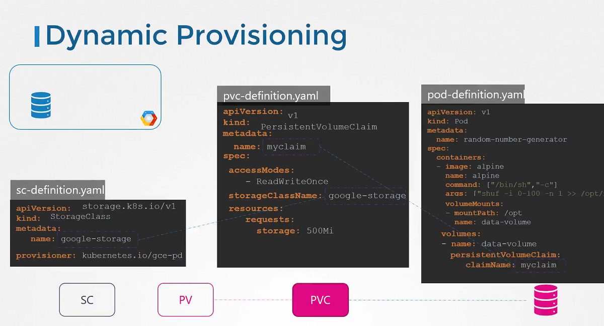

## Cluster Networking
[Cluster Networking | Kubernetes](https://kubernetes.io/docs/concepts/cluster-administration/networking/)  

### Switching, Routing and Gateways
Switching  交换
```shell
# To see the interface on the host system 查看主机系统上的界面
$ ip link

# To see the IP Address interfaces. 查看 IP 地址接口。
$ ip addr
```

Routing  路由
```shell
# To see the existing routing table on the host system. 查看主机系统上现有的路由表。
$ route
$ ip route show
or
$ ip route list

# To add entries into the routing table. 将条目添加到路由表。
$ ip route add 192.168.1.0/24 via 192.168.2.1
```

Gateways  网关
```shell
# To add a default route. 添加默认路由。
$ ip route add default via 192.168.2.1

# To check the IP forwarding is enabled on the host.检查主机上是否启用了 IP 转发。
$ cat /proc/sys/net/ipv4/ip_forward
0

$ echo 1 > /proc/sys/net/ipv4/ip_forward

# Enable packet forwarding for IPv4. 启用 IPv4 数据包转发。
$ cat /etc/sysctl.conf

# Uncomment the line
net.ipv4.ip_forward=1

# To view the sysctl variables. 查看 sysctl 变量。
$ sysctl -a 

# To reload the sysctl configuration. 重新加载 sysctl 配置。
$ sysctl --system
```

Name Resolution  名称解析
With help of the ping command. Checking the reachability of the IP Addr on the Network. 借助 ping 命令，检查网络上 IP 地址的可达性。
```shell
$ ping 172.17.0.64
PING 172.17.0.64 (172.17.0.64) 56(84) bytes of data.
64 bytes from 172.17.0.64: icmp_seq=1 ttl=64 time=0.384 ms

$ cat >> /etc/hosts
172.17.0.64  web

$ ping web
PING web (172.17.0.64) 56(84) bytes of data.
64 bytes from web (172.17.0.64): icmp_seq=1 ttl=64 time=0.491 ms
```

### DNS 
```shell

# Every host has a DNS resolution configuration file at /etc/resolv.conf. 每个主机都有一个 DNS 解析配置文件，位于 /etc/resolv.conf 。
$ cat /etc/resolv.conf
nameserver 127.0.0.53
options edns0

# To change the order of dns resolution, we need to do changes into the /etc/nsswitch.conf file.要更改 DNS 解析的顺序，我们需要对 /etc/nsswitch.conf 文件进行更改。
$ cat /etc/nsswitch.conf

hosts:          files dns
networks:       files

# If it fails in some conditions. 如果在某些情况下失败。
$ ping wwww.github.com
ping: www.github.com: Temporary failure in name resolution

# Adding well known public nameserver in the /etc/resolv.conf file. 在 /etc/resolv.conf 文件中添加众所周知的公共名称服务器。
$ cat /etc/resolv.conf
nameserver   127.0.0.53
nameserver   8.8.8.8
options edns0

$ ping www.github.com
PING github.com (140.82.121.3) 56(84) bytes of data.
64 bytes from 140.82.121.3 (140.82.121.3): icmp_seq=1 ttl=57 time=7.07 ms
64 bytes from 140.82.121.3 (140.82.121.3): icmp_seq=2 ttl=57 time=5.42 ms
```

### Network Namespaces
# Pre-requisite Network Namespaces

  - Take me to [Lecture](https://kodekloud.com/topic/prerequsite-network-namespaces/)

In this section, we will take a look at **Network Namespaces**


## Process Namespace

> On the container
```
$ ps aux      
```

> On the host
```
$ ps aux 

```

## Network Namespace

```
$ route
```

```
$ arp
```

## Create Network Namespace

```
$ ip netns add red

$ ip netns add blue
```
- List the network namespace

```
$ ip netns
```

## Exec in Network Namespace

- List the interfaces on the host

```
$ ip link
```

- Exec inside the network namespace

```
$ ip netns exec red ip link
1: lo: <LOOPBACK> mtu 65536 qdisc noop state DOWN mode DEFAULT group default qlen 1000
    link/loopback 00:00:00:00:00:00 brd 00:00:00:00:00:00

$ ip netns exec blue ip link
1: lo: <LOOPBACK> mtu 65536 qdisc noop state DOWN mode DEFAULT group default qlen 1000
    link/loopback 00:00:00:00:00:00 brd 00:00:00:00:00:00
```
- You can try with other options as well. Both works the same.
```
$ ip -n red link
1: lo: <LOOPBACK> mtu 65536 qdisc noop state DOWN mode DEFAULT group default qlen 1000
    link/loopback 00:00:00:00:00:00 brd 00:00:00:00:00:00
```

## ARP and Routing Table

> On the host
```
$ arp
Address                  HWtype  HWaddress           Flags Mask            Iface
172.17.0.21              ether   02:42:ac:11:00:15   C                     ens3
172.17.0.55              ether   02:42:ac:11:00:37   C                     ens3
```

> On the Network Namespace
```
$ ip netns exec red arp
Address                  HWtype  HWaddress           Flags Mask            Iface

$ ip netns exec blue arp
Address                  HWtype  HWaddress           Flags Mask            Iface
```

> On the host 
```
$ route
```

> On the Network Namespace
```
$ ip netns exec red route
Kernel IP routing table
Destination     Gateway         Genmask         Flags Metric Ref    Use Iface

$ ip netns exec blue route
Kernel IP routing table
Destination     Gateway         Genmask         Flags Metric Ref    Use Iface
```

## Virtual Cable

- To create a virtual cable
```
$ ip link add veth-red type veth peer name veth-blue
```

- To attach with the network namespaces
```
$ ip link set veth-red netns red

$ ip link set veth-blue netns blue
```

- To add an IP address
```
$ ip -n red addr add 192.168.15.1/24 dev veth-red

$ ip -n blue addr add 192.168.15.2/24 dev veth-blue
```

- To turn it up `ns` interfaces
```
$ ip -n red link set veth-red up

$ ip -n blue link set veth-blue up
```

- Check the reachability 
```
$ ip netns exec red ping 192.168.15.2
PING 192.168.15.2 (192.168.15.2) 56(84) bytes of data.
64 bytes from 192.168.15.2: icmp_seq=1 ttl=64 time=0.035 ms
64 bytes from 192.168.15.2: icmp_seq=2 ttl=64 time=0.046 ms

$ ip netns exec red arp
Address                  HWtype  HWaddress           Flags Mask            Iface
192.168.15.2             ether   da:a7:29:c4:5a:45   C                     veth-red

$ ip netns exec blue arp
Address                  HWtype  HWaddress           Flags Mask            Iface
192.168.15.1             ether   92:d1:52:38:c8:bc   C                     veth-blue

```

- Delete the link.
```
$ ip -n red link del veth-red
```

> On the host
```
# Not available
$ arp
Address                  HWtype  HWaddress           Flags Mask            Iface
172.16.0.72              ether   06:fe:61:1a:75:47   C                     ens3
172.17.0.68              ether   02:42:ac:11:00:44   C                     ens3
172.17.0.74              ether   02:42:ac:11:00:4a   C                     ens3
172.17.0.75              ether   02:42:ac:11:00:4b   C                     ens3
```

## Linux Bridge

- Create a network namespace

```
$ ip netns add red

$ ip netns add blue
``` 
- To create a internal virtual bridge network, we add a new interface to the host
```
$ ip link add v-net-0 type bridge
```
- Display in the host
```
$ ip link
8: v-net-0: <BROADCAST,MULTICAST> mtu 1500 qdisc noop state DOWN mode DEFAULT group default qlen 1000
    link/ether fa:fd:d4:9b:33:66 brd ff:ff:ff:ff:ff:ff
```
- Currently it's down, so turn it up
```
$ ip link set dev v-net-0 up
```
- To connect network namespace to the bridge. Creating a virtual cabel
```
$ ip link add veth-red type veth peer name veth-red-br

$ ip link add veth-blue type veth peer name veth-blue-br
```
- Set with the network namespaces
```
$ ip link set veth-red netns red

$ ip link set veth-blue netns blue

$ ip link set veth-red-br master v-net-0

$ ip link set veth-blue-br master v-net-0
```
- To add an IP address
```
$ ip -n red addr add 192.168.15.1/24 dev veth-red

$ ip -n blue addr add 192.168.15.2/24 dev veth-blue
```
- To turn it up `ns` interfaces
```
$ ip -n red link set veth-red up

$ ip -n blue link set veth-blue up
```
- To add an IP address
```
$ ip addr add 192.168.15.5/24 dev v-net-0
```
- Turn it up added interfaces on the host
```
$ ip link set dev veth-red-br up
$ ip link set dev veth-blue-br up
```

> On the host
```
$ ping 192.168.15.1
```

> On the ns
```
$ ip netns exec blue ping 192.168.1.1
Connect: Network is unreachable

$ ip netns exec blue route

$ ip netns exec blue ip route add 192.168.1.0/24 via 192.168.15.5

# Check the IP Address of the host
$ ip a

$ ip netns exec blue ping 192.168.1.1
PING 192.168.1.1 (192.168.1.1) 56(84) bytes of data.

$ iptables -t nat -A POSTROUTING -s 192.168.15.0/24 -j MASQUERADE

$ ip netns exec blue ping 192.168.1.1

$ ip netns exec blue ping 8.8.8.8

$ ip netns exec blue route

$ ip netns exec blue ip route add default via 192.168.15.5

$ ip netns exec blue ping 8.8.8.8
```

- Adding port forwarding rule to the iptables

```
$ iptables -t nat -A PREROUTING --dport 80 --to-destination 192.168.15.2:80 -j DNAT
```
```
$ iptables -nvL -t nat
```

### Service Networking
[Service | Kubernetes](https://kubernetes.io/docs/concepts/services-networking/service/) 
```yaml
# clusterIP.yaml

apiVersion: v1
kind: Service
metadata:
  name: local-cluster
spec:
  ports:
  - port: 80
    targetPort: 80
  selector:
    app: nginx
    
#==============================#

# nodeportIP.yaml
apiVersion: v1
kind: Service
metadata:
  name: nodeport-wide
spec:
  type: NodePort
  ports:
  - port: 80
    targetPort: 80
  selector:
    app: nginx
```


## Install kubernetes
### set up VMs
```shell
# config vm
vagrant up
# login
vagrant ssh controlplane
# destory and reload vm
vagrant destroy node02
rmdir "<path-to-vm-folder>\node02"

# power off all vm
vagrant suspend [name|id]

vagrant resume [name|id]
```

[Installing kubeadm | Kubernetes](https://kubernetes.io/docs/setup/production-environment/tools/kubeadm/install-kubeadm/)  

[certified-kubernetes-administrator-course/docs/11-Install-Kubernetes-the-kubeadm-way/04-Demo-Deployment-with-Kubeadm.md at master · kodekloudhub/certified-kubernetes-administrator-course · GitHub](https://github.com/kodekloudhub/certified-kubernetes-administrator-course/blob/master/docs/11-Install-Kubernetes-the-kubeadm-way/04-Demo-Deployment-with-Kubeadm.md)  

[certified-kubernetes-administrator-course/kubeadm-clusters/virtualbox/docs/02-compute-resources.md at master · kodekloudhub/certified-kubernetes-administrator-course · GitHub](https://github.com/kodekloudhub/certified-kubernetes-administrator-course/blob/master/kubeadm-clusters/virtualbox/docs/02-compute-resources.md)  

[Creating a cluster with kubeadm | Kubernetes](https://kubernetes.io/docs/setup/production-environment/tools/kubeadm/create-cluster-kubeadm/)

### install packages for VMs
```shell
# Update the apt package index and install packages needed to use the Kubernetes apt repository:
sudo apt-get update
# apt-transport-https may be a dummy package; if so, you can skip that package
sudo apt-get install -y apt-transport-https ca-certificates curl gpg


# Download the public signing key for the Kubernetes package repositories. The same signing key is used for all repositories so you can disregard the version in the URL:下载 Kubernetes 包存储库的公共签名密钥。所有存储库都使用相同的签名密钥，因此您可以忽略 URL 中的版本：
# If the directory `/etc/apt/keyrings` does not exist, it should be created before the curl command, read the note below.
# sudo mkdir -p -m 755 /etc/apt/keyrings
curl -fsSL https://pkgs.k8s.io/core:/stable:/v1.32/deb/Release.key | sudo gpg --dearmor -o /etc/apt/keyrings/kubernetes-apt-keyring.gpg


# Add the appropriate Kubernetes apt repository.
# This overwrites any existing configuration in /etc/apt/sources.list.d/kubernetes.list
echo 'deb [signed-by=/etc/apt/keyrings/kubernetes-apt-keyring.gpg] https://pkgs.k8s.io/core:/stable:/v1.32/deb/ /' | sudo tee /etc/apt/sources.list.d/kubernetes.list


# Update the apt package index, install kubelet, kubeadm and kubectl, and pin their version: 更新 apt 包索引，安装 kubelet、kubeadm 和 kubectl，并固定其版本：
sudo apt-get update
sudo apt-get install -y kubelet kubeadm kubectl
sudo apt-mark hold kubelet kubeadm kubectl

```

### config container runtime
```shell
# install container runtime
sudo apt install -y containerd


# To use the systemd cgroup driver in /etc/containerd/config.toml with runc, set 要将 /etc/containerd/config.toml 中的 systemd cgroup 驱动程序与 runc 一起使用，请设置
sudo containerd config default | sed 's/SystemdCgroup = false/SystemdCgroup = true/'| sudo tee /etc/containerd/config.toml

# apply change 
sudo systemctl restart containerd
```

### config network set to allow IP forwarding
```sh

cat <<EOF | sudo tee /etc/modules-load.d/11-k8s.conf
br_netfilter
EOF

sudo modprobe br_netfilter

cat <<EOF | sudo tee /etc/sysctl.d/11-k8s.conf
net.bridge.bridge-nf-call-ip6tables = 1
net.bridge.bridge-nf-call-iptables = 1
net.ipv4.ip_forward = 1
EOF

sudo sysctl --system


```

validate ip forwarding
```sh
vagrant@controlplane:$ cat /proc/sys/net/ipv4/ip_forward
1
```

### initiate kubeadm 
[Creating a cluster with kubeadm | Kubernetes](https://kubernetes.io/docs/setup/production-environment/tools/kubeadm/create-cluster-kubeadm/)  
```shell
vagrant@controlplane:~$ ip addr show dev enp0s8

3: enp0s8: <BROADCAST,MULTICAST,UP,LOWER_UP> mtu 1500 qdisc fq_codel state UP group default qlen 1000
    link/ether 08:00:27:ab:62:65 brd ff:ff:ff:ff:ff:ff
    inet 192.168.0.26/24 metric 100 brd 192.168.0.255 scope global dynamic enp0s8

# "192.168.0.26" is the controlplane ip address

# initate kubeadm
kubeadm init --apiserver-advertise-address <master-node-ip> --pod-network-cidr "<all pods subnet>" --upload-certs 

# example:
# kubeadm init --apiserver-advertise-address 192.168.0.26 --pod-network-cidr "10.244.0.0/16" --upload-certs


## find and copy those command after initiate kubeadm
# To start using your cluster, you need to run the following as a regular user:
mkdir -p $HOME/.kube
sudo cp -i /etc/kubernetes/admin.conf $HOME/.kube/config
sudo chown $(id -u):$(id -g) $HOME/.kube/config

# save it for later

sudo kubeadm join 192.168.0.26:6443 --token cavknq.r94ovn31jeaqi3yi \
        --discovery-token-ca-cert-hash sha256:9c4c3d0dec606ca4f04c4cc42f3e6b6493f3fd421bcca93ef07f52595ccdf51e

```

### Choose a Pod network add-on
[Creating a cluster with kubeadm | Kubernetes](https://kubernetes.io/docs/setup/production-environment/tools/kubeadm/create-cluster-kubeadm/#pod-network)  
```shell 
# Installing a Pod network add-on  
kubectl apply -f https://github.com/flannel-io/flannel/releases/latest/download/kube-flannel.yml

# 
vagrant@controlplane:~$ kubectl get pods -n kube-flannel
NAME                    READY   STATUS    RESTARTS   AGE
kube-flannel-ds-rpmck   1/1     Running   0          4m13s

vagrant@controlplane:~$ kubectl get nodes
NAME           STATUS   ROLES           AGE     VERSION
controlplane   Ready    control-plane   4h55m   v1.32.3
```


### join worker node
```shell
vagrant@node01:~$ sudo kubeadm join 192.168.0.26:6443 --token cavknq.r94ovn31jeaqi3yi \
        --discovery-token-ca-cert-hash sha256:9c4c3d0dec606ca4f04c4cc42f3e6b6493f3fd421bcca93ef07f52595ccdf51e

vagrant@controlplane:~$ kubectl get nodes
NAME           STATUS   ROLES           AGE     VERSION
controlplane   Ready    control-plane   4h57m   v1.32.3
node01         Ready    <none>          52s     v1.32.3
node02         Ready    <none>          43s     v1.32.3
```