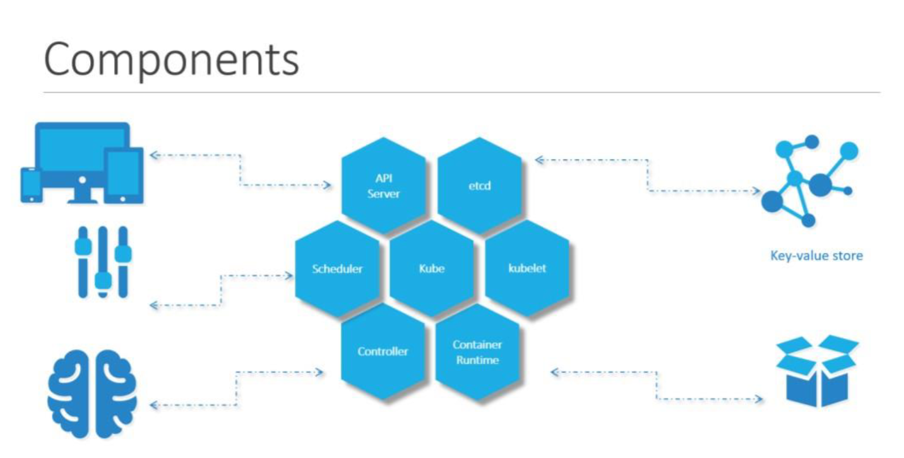
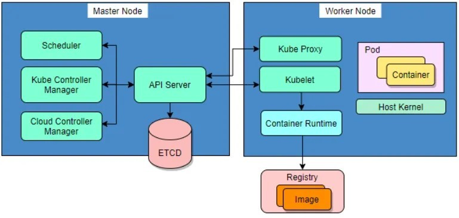

[Getting started | Kubernetes](https://kubernetes.io/docs/setup/)  
[Introduction to Kubernetes (LFS158) - The Linux Foundation](https://trainingportal.linuxfoundation.org/courses/introduction-to-kubernetes)  

# exam scope
 **A Certified Kubernetes Administrator (CKA) will be able to:   
认证 Kubernetes 管理员 (CKA) 将能够：**

- Demonstrate their ability to do basic installation as well as configuring and managing production-grade Kubernetes clusters.  
    展示他们进行基本安装以及配置和管理生产级 Kubernetes 集群的能力。
- Understand key concepts such as Kubernetes networking, storage, security, maintenance, logging and monitoring, application lifecycle, troubleshooting, API object primitives.  
    了解 Kubernetes 网络、存储、安全性、维护、日志记录和监控、应用程序生命周期、故障排除、API 对象原语等关键概念。
- Ability to establish basic use-cases for end users.  
    能够为最终用户建立基本用例。

## Storage – 10%  存储 – 10%**

- Implement storage classes and dynamic volume provisioning  
    实施存储类别和动态卷配置
- Configure volume types, access modes and reclaim policies  
    配置卷类型、访问模式和回收策略
- Manage persistent volumes and persistent volume claims  
    管理持久卷和持久卷声明

## Troubleshooting – 30%  故障排除 – 30%**

- Troubleshoot clusters and nodes  
    集群和节点故障排除
- Troubleshoot cluster components  
    对集群组件进行故障排除
- Monitor cluster and application resource usage  
    监控集群和应用程序资源使用情况
- Manage and evaluate container output streams  
    管理和评估容器输出流
- Troubleshoot services and networking  
    排除服务和网络故障

## Workloads and Scheduling – 15%   
工作负载和调度 – 15%**

- Understand application deployments and how to perform rolling update and rollbacks  
    了解应用程序部署以及如何执行滚动更新和回滚
- Use ConfigMaps and Secrets to configure applications  
    使用 ConfigMap 和 Secrets 来配置应用程序
- Configure workload autoscaling  
    配置工作负载自动缩放
- Understand the primitives used to create robust, self-healing, application deployments  
    了解用于创建健壮的、自我修复的应用程序部署的原语
- Configure Pod admission and scheduling (limits, node affinity, etc.)  
    配置 Pod 准入和调度（限制、节点关联性等）

## Cluster Architecture, Installation and Configuration – 25%  
集群架构、安装和配置 – 25%**

- Manage role based access control (RBAC)  
    管理基于角色的访问控制 (RBAC)
- Prepare underlying infrastructure for installing a Kubernetes cluster  
    准备用于安装 Kubernetes 集群的底层基础设施
- Create and manage Kubernetes clusters using kubeadm  
    使用 kubeadm 创建和管理 Kubernetes 集群
- Manage the lifecycle of Kubernetes clusters  
    管理 Kubernetes 集群的生命周期
- Implement and configure a highly-available control plane  
    实施和配置高可用性控制平面
- Use Helm and Kustomize to install cluster components  
    使用 Helm 和 Kustomize 安装集群组件
- Understand extension interfaces (CNI, CSI, CRI, etc.)  
    了解扩展接口（CNI、CSI、CRI 等）
- Understand CRDs, install and configure operators  
    了解 CRD、安装和配置操作员

## Servicing and Networking – 20%  
服务和网络 – 20%**

- Understand connectivity between Pods  
    了解 Pod 之间的连接
- Define and enforce Network Policies  
    定义和实施网络策略
- Use ClusterIP, NodePort, LoadBalancer service types and endpoints  
    使用 ClusterIP、NodePort、LoadBalancer 服务类型和端点
- Use the Gateway API to manage Ingress traffic  
    使用网关 API 管理入口流量
- Know how to use Ingress controllers and Ingress resources  
    了解如何使用 Ingress 控制器和 Ingress 资源
- Understand and use CoreDNS  
    了解并使用 CoreDNS

# Basic concept
  
## Container Orchestration容器编排
To enable these functionalities you need an underlying platform with a set of resources. The platform needs to orchestrate the connectivity between the containers and automatically scale up or down based on the load. This whole process of automatically deploying and managing containers is known as Container Orchestration. 要启用这些功能，您需要一个具有一组资源的底层平台。该平台需要编排容器之间的连接，并根据负载自动扩展或缩小。自动部署和管理容器的整个过程称为容器编排。  
There are various advantages of container orchestration. Your application is now highly available as hardware failures do not bring your application down because you have multiple instances of your application running on different nodes. The user traffic is load balanced across the various containers. When demand increases, deploy more instances of the application seamlessly and within a matter of second and we have the ability to do that at a service level. When we run out of hardware resources, scale the number of nodes up/down without having to take down the application. And do all of these easily with a set of declarative object configuration file容器编排有多种优点。您的应用程序现在具有高可用性，因为硬件故障不会导致您的应用程序停机，因为您的应用程序的多个实例在不同的节点上运行。用户流量在各个容器之间进行负载平衡。当需求增加时，只需几秒钟即可无缝部署更多应用程序实例，我们有能力在服务级别上做到这一点。当我们用完硬件资源时，可以增加/减少节点数量，而无需关闭应用程序。并使用一组声明性对象配置文件轻松完成所有这些  
## Nodes(Minions)  
A node is a machine – physical or virtual – on which kubernetes is installed. A node is a worker machine and this is were containers will be launched by kubernetes. 节点是安装了 kubernetes 的物理或虚拟机器。节点是一台工作机器，这是 kubernetes 启动的容器。
## Cluster 
A cluster is a set of nodes grouped together. This way even if one node fails you have your application still accessible from the other nodes. Moreover having multiple nodes helps in sharing load as well 集群是一组聚集在一起的节点。这样，即使一个节点发生故障，您仍然可以从其他节点访问您的应用程序。此外，拥有多个节点也有助于分担负载  
## Master
Now we have a cluster, but who is responsible for managing the cluster? Were is the information about the members of the cluster stored? How are the nodes monitored? When a node fails how do you move the workload of the failed node to another worker node? That’s were the Master comes in. The master is another node with Kubernetes installed in it, and is configured as a Master. The master watches over the nodes in the cluster and is responsible for the actual orchestration of containers on the worker nodes. 现在我们有了一个集群，但是谁负责管理集群呢？是否存储了集群成员的信息？节点是如何监控的？当一个节点发生故障时，如何将故障节点的工作负载转移到另一个工作节点？这就是 Master 的作用。master 是另一个安装了 Kubernetes 的节点，并被配置为 Master。主节点监视集群中的节点，并负责工作节点上容器的实际编排。
## Components
When you install Kubernetes on a System, you are actually installing the following components. An API Server. An ETCD service. A kubelet service. A Container Runtime, Controllers and Schedulers 当您在系统上安装 Kubernetes 时，您实际上正在安装以下组件。 API 服务器。 ETCD 服务。 kubelet 服务。容器运行时、控制器和调度程序  
  
The API server acts as the front-end for kubernetes. The users, management devices, Command line interfaces all talk to the API server to interact with the kubernetes cluster. API 服务器充当 kubernetes 的前端。用户、管理设备、命令行界面都与API服务器通信以与kubernetes集群交互。  
Next is the ETCD key store. ETCD is a distributed reliable key-value store used by kubernetes to store all data used to manage the cluster. Think of it this way, when you have multiple nodes and multiple masters in your cluster, etcd stores all that information on all the nodes in the cluster in a distributed manner. ETCD is responsible for implementing locks within the cluster to ensure there are no conflicts between the Masters 接下来是 ETCD 密钥存储。 ETCD 是 kubernetes 用来存储用于管理集群的所有数据的分布式可靠键值存储。这样想，当集群中有多个节点和多个主节点时，etcd 以分布式方式将所有信息存储在集群中的所有节点上。 ETCD 负责实现集群内部的锁，保证Master之间不发生冲突  
The scheduler is responsible for distributing work or containers across multiple nodes. It looks for newly created containers and assigns them to Nodes. 调度程序负责跨多个节点分配工作或容器。它查找新创建的容器并将它们分配给节点。  
The controllers are the brain behind orchestration. They are responsible for noticing and responding when nodes, containers or endpoints goes down. The controllers makes decisions to bring up new containers in such cases 控制器是编排背后的大脑。它们负责在节点、容器或端点出现故障时进行通知并做出响应。在这种情况下，管制员决定调出新集装箱  
The container runtime is the underlying software that is used to run containers 容器运行时是用于运行容器的底层软件  
kubelet is the agent that runs on each node in the cluster. The agent is responsible for making sure that the containers are running on the nodes as expected. kubelet 是在集群中每个节点上运行的代理。代理负责确保容器按预期在节点上运行。  
## Master vs Worker Nodes  
  
The master server has the kube-apiserver and that is what makes it a master 主服务器有 kube-apiserver，这就是它成为主服务器的原因  
The worker node (or minion) as it is also known, is were the containers are hosted. For example Docker containers, and to run docker containers on a system 工作节点（或 Minion）也称为容器节点。例如 Docker 容器，以及在系统上运行 docker 容器  
Similarly the worker nodes have the kubelet agent that is responsible for interacting with the master to provide health information of the worker node and carry out actions requested by the master on the worker nodes 类似地，工作节点有 kubelet 代理，负责与主节点交互，提供工作节点的健康信息，并在工作节点上执行主节点请求的操作  
All the information gathered are stored in a key-value store on the Master. The key value store is based on the popular etcd framework as we just discussed. The master also has the controller manager and the scheduler. There are other components as well, but we will stop there for now. The reason we went through this is to understand what components constitute the master and worker nodes. This will help us install and configure the right components on different systems when we setup our infrastructure 收集到的所有信息都存储在主服务器上的键值存储中。正如我们刚才讨论的，键值存储基于流行的 etcd 框架。主站还具有控制器管理器和调度器。还有其他组件，但我们现在就到此为止。我们进行此操作的原因是为了了解哪些组件构成了主节点和工作节点。这将帮助我们在设置基础设施时在不同的系统上安装和配置正确的组件  
## kubectl  
[Install and Set Up kubectl on Linux | Kubernetes](https://kubernetes.io/docs/tasks/tools/install-kubectl-linux/)  
the command line utilities known as the kube command line tool or kubectl or kube control as it is also called. The kube control tool is used to deploy and manage applications on a kubernetes cluster, to get cluster information, get the status of nodes in the cluster and many other things 命令行实用程序称为 kube 命令行工具或 kubectl 或 kube 控件，因为它也被称为。 kube控制工具用于在kubernetes集群上部署和管理应用程序，获取集群信息，获取集群中节点的状态等等  
The `kubectl run` command is used to deploy an application on the cluster.   
The `kubectl cluster-info` command is used to view information about the cluster  
`kubectl get pod` command is used to list all the nodes part of the cluster.  
## yaml
```yaml
# YAML Template Example

# A key-value pair
app_name: MyCoolApp

# Strings, numbers, and booleans as values
version: 1.0
debug: true

# Nested objects using indentation
database:
  host: localhost
  port: 5432
  username: admin
  password: secret

# Lists (arrays) start with a dash (-)
features:
  - user_authentication
  - data_analysis
  - reporting

# Nested lists and objects
servers:
  - name: frontend
    ip: 192.168.1.1
    roles:
      - web
      - cache
  - name: backend
    ip: 192.168.1.2
    roles:
      - database
      - api

# Multi-line strings using | or >
description: |
  This is a long description
  that spans multiple lines.

# Aliases and references
default_role: &default_role admin
users:
  - name: Alice
    role: *default_role
  - name: Bob
    role: user

# Environment variables as mappings
env:
  PROD:
    url: https://api.example.com
    timeout: 30
  DEV:
    url: http://localhost:8000
    timeout: 10

# Comments start with a hash (#)
# Use them to describe the purpose of the settings

```

# Setup
## Installation 
[Install Tools | Kubernetes](https://kubernetes.io/docs/tasks/tools/)  
[minikube start | minikube](https://minikube.sigs.k8s.io/docs/start/?arch=%2Flinux%2Fx86-64%2Fstable%2Fbinary+download#Service)  
[Play with Kubernetes](https://labs.play-with-k8s.com/)  
install the latest minikube stable release on x86-64 Linux using binary download:  
````shell
curl -LO https://github.com/kubernetes/minikube/releases/latest/download/minikube-linux-amd64

sudo install minikube-linux-amd64 /usr/local/bin/minikube && rm minikube-linux-amd64

minikube version

minikube config set rootless true

minikube start --driver=podman

minikube status

minikube kubectl -- get po -A

minikube dashboard

kubectl create deployment hello-minikube1 --image=kicbase/echo-server:1.0

kubectl get deployment

kubectl expose deployment hello-minikube1 --type=LoadBalancer --port=8080

minikube service hello-minikube1
````

## yaml setting
```yaml
apiVersion: v1
kind: Pod

# metadata is data about the object
metadata:
  name: nginx
  # labels are key value pairs that can be used to select and identify objects
  labels:
    app: nginx
    tier: frontend

# spec is the desired state of the object
spec:
    containers:
    - name: nginx
        image: nginx

```


