Create time: 2022-10-29  Last update: 2022-11-09

# How to use the FIT study Note document
1. download the [markdown file repository](https://github.com/GreenH47/mynote) and  navigate to the `docs` folder
2. view all the markdown files via [Obsidian vault](https://help.obsidian.md/How+to/Working+with+multiple+vaults) that can show the linked section in the note document    
3. You may find some extra material or program template  repository in the Course Brief introduction for the FIT Note markdown Document (some course don't have )

4. you can view [the web page](https://greenh47.github.io/mynote/) which transfer from MD file online but will lose the extra information or wrong    markdown display

# FIT5032 Course Brief introduction

| week | Introduction                               |
| ---- | ------------------------------------------ |
| 1    |  Intro to Web development and ASP.Net.  |
| 2    | The Front End, UX, Accessibility and Scaffolding                 |
| 3    | Introduction to C# & Version Control                       |
| 4    | Entity Framework Scaffolding                           |
| 5    | Fundamental Client Side JavaScript (jQuery; datatable; calendar; maps; rich text)        |
| 6    | Validation                                 |
| 7    | Security & Microsoft Identity  (authentication Login Roles)           |
| 8    | Email, Upload & Signal R                   |
| 9    | Web Optimisations(Reducing HTTP Connections Reducing File sizes Caching Perceived improvements) & Evolution of ASP.NET CORE                               |
| 10   | Modern JavaScript Web Development Approach (AngularJS) |
| 11   | Testing and Deployment in Cloud            |

[](https://github.com/GreenH47/FIT5032_2022s2)

[This repository](https://github.com/GreenH47/FIT5032_2022s2) contents weekly task and my assignment template for [FIT5032 - Internet Application Development](https://handbook.monash.edu/2022/units/FIT5032?year=2022) done for the year 2022. (Semester 2)  

Solutions are working out of the box. (Due to the nature of this unit)  
You can run the project by running the .mdf files which are intentionally in the repository so that it would be working. (some parts are hidden for safety but not influence the framework working)
# FIT5032 week 1 MVC & ASP .net
## Lecture Note
+ Introduction to Internet Applications Development
+ Understand the purpose of ASP.NET MVC
+ Understand the benefits of the MVC architecture
## Q&A part
### ★what is MVC
+ The Model-View-Controller (MVC) architectural pattern separates an application into three main groups of components: Models, Views, and Controllers


### Which action in MVC request & response
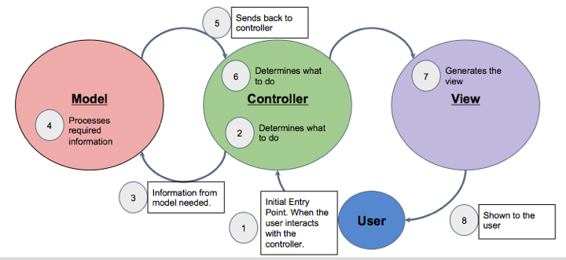  
+ if no model in the project. The `controller` will received the user's command and return  the result to the `VIEW`

### Which functionality/files in each component of MVC?  
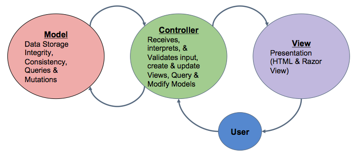  
Model:  
+ database  
+ Defines the data validation rules  
+ contains code that defines its relationship with other models

Controller:  
+ Controls the application flow or logic of the application
+ decides what response is to be generated and passes the response (output) to the  `view`
+  calls to `model` to access data

View:  
+  View is the outputs or responses that are sent back to the user once a request is processed
+ the presentation layer of an application
+ Razor View in .net

### What is Model? Functionality? Responsibilities?
+ A class or set of classes that describes all the business logic and additionally<mark style="background: #3CB371;"> handles data access</mark> for an application.
+ Also contains code that<mark style="background: #3CB371;"> defines its relationship with other models</mark>.
+ Defines the <mark style="background: #3CB371;">data validation rules</mark> to be used when adding or updating data.

### What is Controller? Functionality? Responsibilities?
+ <mark style="background: #ff0000;">Controllers are the components that handle user interaction, work with the model, and ultimately select a view to render.</mark>
+ Controls the <mark style="background: #3CB371;">application flow or logic</mark> of the application
+ Controller logic decides what <mark style="background: #3CB371;">response</mark> is to be generated
+ Controller logic normally contains calls to models to <mark style="background: #0000CD;">access data</mark>, and also other functionalities like access control checks etc
+ Controller passes the response (output) to the view

### What is View? Functionality? Responsibilities?  
+ <mark style="background: #0000CD;">presenting content through the user interface.</mark> They use the Razor view engine to embed .NET code in HTML markup.
+ Consist of markup (like HTML) code with embedded .NET code. Can also be other forms of output like XML, PDF documents etc.
+ Views can be thought of as the <mark style="background: #0000CD;">presentation layer</mark> of an application and ideally should be as "dumb" as possible

### ★★ Advantages of ASP.NET MVC = Why use MVC? = MVC benefit
+ Enables the full control over the rendered HTML (前端可使用逻辑)
+ Provides clean separation of concerns(SoC). (职能可分开)
+  Enables Test Driven Development (TDD).(以method为单位  容易写test)
+  Easy integration with JavaScript frameworks.(容易集成js框架)
+ Following the design of stateless nature of the web. (网页不存数据从model拿数据，不记录用户状态及自身状态)
+ RESTful urls that enables Search Engine Optimisation.(get post in url)
+  No ViewState and PostBack events in comparison to ASP.NET Web Forms ()
### ★★★ Layers/Components in ASP.NET
+ Front End Technology (Razor)
+  .NET (This will be the server side programming technology)
+  IIS (This is the server itself)
+  MS SQL Server
### Separation of Concerns (SOC) 依据功能分成独立几个模块开发
+ 
+ 改变显示去view ， 改变数据多少去controller，改变数据结构去model
+ Is a design principle for separating a computer program into distinct sections, such that <mark style="background: #0000CD;">each section addresses a separate concern</mark>.
+ A concern can be as general as the details of the hardware the code is being optimized for, or as specific as the name of a class to instantiate.
+  The value of separation of concerns is<mark style="background: #3CB371;"> simplifying development and maintenance </mark>of computer programs.
+ When concerns are well-separated, <mark style="background: #0000CD;">individual sections can be reused, as well as developed and updated</mark> independently.
+  For example, user interface logic tends to change more frequently than business logic. If presentation code and business logic are combined in a single object, an object containing business logic must be modified every time the user interface is changed
### Single Responsibility Principle (SRP) 每个模块如何划分 class， reuse
+ The single-responsibility principle (SRP) is a computer-programming principle that states that <mark style="background: #D2691E;">every module, class or function in a computer program should have responsibility over a single part of that program's functionality,</mark> and it should encapsulate that part.

# FIT5032 Week 2 Usability
## Lecture note

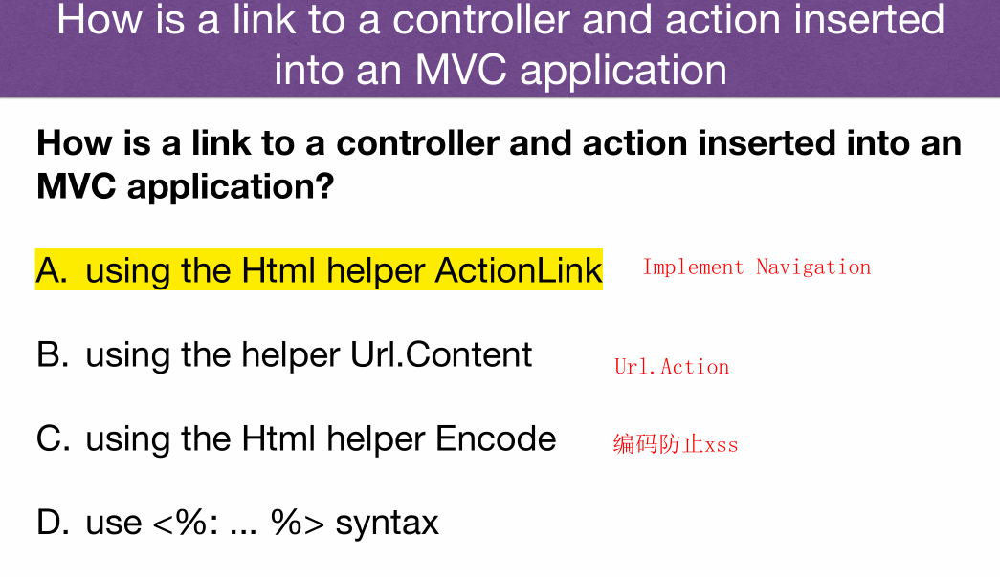

## QA part
### ★★★ The 6 Principles Of Design (Donald Norman  举例说明

Visibility  
+ 第一眼要看到所有的 link，并且之后 link 代表的含义
+ Users need to know what all the options are, and know straight away how to access them.
+ For example, on Moodle, the minute you login, it is immediately obvious what the possible options are

Feedback  
+ 网站要针对用户的操作给出反馈，点击有反应
+ Feedback is when a system provides users with information about what has been completed or  accomplished.  
+  One example, is that on the Monash Home page, when the user uses the mouse to hover over  the “Study” option, a drop down menu appears giving feedback to the users’ action.

Affordance  
+ 图标的样式和功能相同，放大镜代表搜索
+ A situation where an object’s sensory characteristics intuitively imply its functionality and use.  
+  When a control behaves as its appearance suggests

Mapping  
+ 图标和文字相对应的表示 link/button 含义
+ Mapping is the relationship between control and effect. The idea is that with good design, the  controls to something will closely resemble what they affect

Constraints   
+ 在同一个页面上，减少和用户的交互（给用户尽可能少的选择）  
+ UI 需要限制当前页面功能的个数，以及引导用户进行下一步操作
+ 单个页面的功能不宜过于复杂
+ Constraints is about limiting the range of interaction possibilities for the user to simplify the  interface and guide the user to the appropriate next action

Consistency  
+ 同级目录/button/link 样式要类似，例如，按 Link 通向相关页面，Button 提交 Action
+ Consistency refers to having similar operations and similar elements for achieving similar tasks.  By leveraging consistent elements throughout your entire experience, you make your experience  far easier to use
### ★★ Web Usability Guidelines (from Flow Bohl)
[](http://www.79er.com/blog/articles/Usability-best-practice-for-UX-design.php)
### ★★★ How to handle request in ASP.Net MVC?  
+ The default route table consists of one route.

 
+ Breaks all incoming requests into three segments (a URL segment is anything between forward slashes).
+  The first segment is mapped to a <mark style="background: #0000CD;">controller name</mark>, `home student)`
+ the second segment is mapped to an <mark style="background: #ff0000;">action name</mark>, `about index`
+ and the final segment is mapped to a <mark style="background: #D2691E;">parameter passed to the action named Id</mark> `123`

### How to combine controller and view/url together? / How to add new view binding with controller?
```csharp
[HttpPost]
public ActionResult Edit(Student std)
{// update student to the database
    return RedirectToAction("Index");
}
```
Add Action Method, the name should be the same name as `view` name. and `view` folder name should be same as `controller`name


### How to return the right view from controller method
+ If you want to return a view from a controller action, you need to  create a <mark style="background: #ff0000;">sub folder in the Views folder with the same name as the  controller</mark>.  
+ 
+ In this subfolder you need to create an .cshtml file with the <mark style="background: #0000CD;">same  name as the controller action</mark>.  `create/delete.cshtml`

### ★★★ What is the role of the layout file in an ASP.Net MVC application? / How to design a website application in the same UI component, same heading image,  same navigation bar?
+ Razor views use a layout to determine their look and feel  
+ render css and js in application level
+ The default view is held in `Views/Shared/layout.cshtml`
+ header; footer; navigation bar

### How to render css/js in view/cshtml? (Defer JS)
`@Styles.Render("~/Content/css") `   
is rendered as  
`<link href="/Content/site.css" rel="stylesheet"/>`  
The lines  
```js
@Scripts.Render(“~/bundles/modernizr")  
@Scripts.Render("~/bundles/jquery")  
@Scripts.Render(“~/bundles/bootstraps")
```
are rendered as  
```html
<script src="/Scripts/modernizr-2.8.3.js"></script>  
<script src="/Scripts/jquery-3.4.1.js"></script>  
<script src="/Scripts/bootstraps.js"></script>
```
The JavaScript libraries for jQuery, modernizr, bootstraps are built into the MVC  framework.  

# FIT5032 Week 3 csharp and git
## Lecture note
+ C# Basics: data types and operators
+  C# Language Constructs
+ introduction to Language Integrated Query (LINQ)
+ Git
+ 
## QA
### what is .net
+ .NET is a free, cross-platform, open source developer platform for building many different types of applications.
+ C# is part of the .NET ecosystem
### CLR, IL and JIT
The Common Language Runtime (CLR)  
+ manages the execution of all .NET applications
+ 掌控程序运行，例如 exception handler, 管理 code 等在运行期间的一系列问题  
  
Intermediate language (IL)
+ Program – Intermediate Language – Machine Code
+ 在编译后转换成机器识别的语言  
  
The JIT (Just-In-Time) compile
+ 在运行时 compile，有问题时报错或者 throw exception  实时编译

###  ★ C#，Java , JS
| feature            | c#  | java | js  |
| ------------------ | --- | ---- | --- |
| Strongly Typed     | y   | y    |     |
| Object Oriented    | y   | y    |     |
| Component-oriented | y   |      |     |

### Object Oriented
+ Abstraction 抽象 interface
+ Encapsulation 封装 class
+ Inheritance 继承 super class
+ Polymorphism 多态 override  

### ★ Component Oriented Programming
+ 功能封装为Component 然后复用
+ A technique of developing software applications by combining preexisting and new components.
+  Heavily relies on: polymorphism, encapsulation, late binding, inheritance (through interfaces) and most importantly binary re-usability

### Differ between ToString() & Convert.ToString()
```csharp
int age = 35;  
string strAge1 = age.ToString();  
string strAge2 = Convert.ToString(age);
```
Convert.ToString() function can handle null values  
ToString() can not handle null values
### ★★  C# Comparison Operators
```
== Equality  
!= OR <> Inequality  
< Less Than  
> Greater Than  
<= Less Than or Equal To  
>= Greater Than or Equal To
??  null-coalescing operator. 
It returns the left-hand operand if the operand is not null; otherwise it returns the right hand operand
?. Null-conditional operator 
returns null if the  left-hand operand evaluates to null
=> lambda operator. 
It is used in lambda  expressions to separate the input variables on the left side from  the lambda body on the right side
```
### # What is difference between `String` and `string`
+ `string` is just an alias of `System.String` so there is no difference.
+ `string` is just a keyword mainly used in creating a variable
+ `System.String` is a class which gives you a rich set of functions and properties to manipulate the string
### C# Logical Operators
```
&& And  
|| OR  
! NOT
```
### ★★Language Integrated Query (LINQ)
+ LINQ offers a consistent model for working with data across various kinds of data sources and formats.
+ <mark style="background: #3CB371;">Always working with objects</mark>.
+  All LINQ query operations consist of three distinct actions <mark style="background: #0000CD;">Obtain the data source; Create the query; Execute the query</mark>  

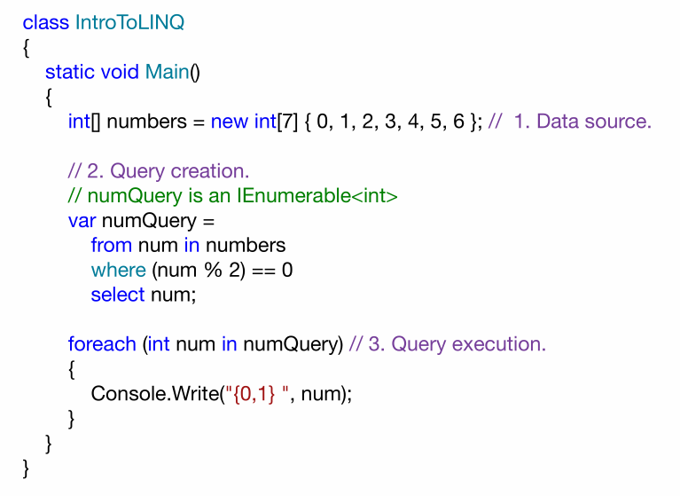
### ★★LINQ VS SQL
+ Generally, when querying databases, LINQ is in most cases a  significantly more productive querying language than SQL
+ When it runs, LINQ to SQL translates into SQL in the object model and sends them to the database for  execution. When the database returns the result, LINQ to SQL translates  them back to objects  
  


# ★★★FIT5032 Week 4 Entity Framework Scaffolding
## Lecture note
  

## QA
### what is Scaffolding? why use? benefit
+ A code generation framework for ASP.NET Web  applications.  
+ Easy to add boilerplate code to your project that  interacts with a data model.  
+ Can reduce the amount of time to develop standard  data operations in your project.  
+ Can quickly add needed controllers and view that will  interact with models
###   What is Entity Framework / benefit / Why use?  
+ 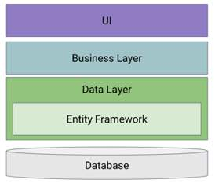
+ The Entity Framework is a set of technologies that support the <mark style="background: #3CB371;">development of data-oriented</mark> software applications.
+  Entity Framework is an object-relational mapper (ORM) that reduces the impedance mismatch between the object-oriented world of .NET Framework developers and the world of relational databases
+ It saves data stored in the properties of  business entities and also retrieves data  from the database and converts it to  business entities objects automatically.
### ★★★What is ORM/Advantages and Disadvantages
+ Object-Relational Mapping (ORM) is a technique that  lets you query and manipulate data from a database  using an object-oriented paradigm   


### What are the Impedance Mismatch in ORM?

+ Encapsulation – in OOP every class has internal and private implementation that is  contained and maintained by the class instance. (RDMS uses “public” data 封装后 class中private的data 和function无法在DB映射
+ Data type differences – no pointer/reference data types are allowed in the relational  systems. oop中的数据类型(string int)在关系型数据库中会变成(varchar number)
+ Structure and integrity – in OOP it is considered normal to have highly nested structures (objects containing sets of different objects recursively, thus producing quite complicated object graphs).oop中的复杂嵌套关系，在数据库中可能无法正常转译
### Core abilities in EF API

### What context class do in EF?

```csharp
public class AppDbContext : DbContext
{
    public AppDbContext(DbContextOptions<AppDbContext> options)
        : base(options)
    {
    }

    public DbSet<Employee> Employees { get; set; }
    public DbSet<Department> Employees { get; set; }
}
```
### What is Entity in EF?
+ An entity in Entity Framework is a<mark style="background: #ff0000;"> class in the domain of  your application</mark> which is included as a `DbSet<TEntity>`  type property in the derived context class.  
+ An Entity can include two types of properties: <mark style="background: #3CB371;">Scalar  Properties and Navigation Properties</mark>
### how to build model
+ database First Approach (This is where a database is  created first using Data Definition Language. So, you  are writing SQL first)  
+ Model First Approach (This is where a Visual Designer  is used or the model is mapped out via XML  configuration files)  
+ Code First Approach (This is when Code (C# classes)  are written or created)
### Development Workflow
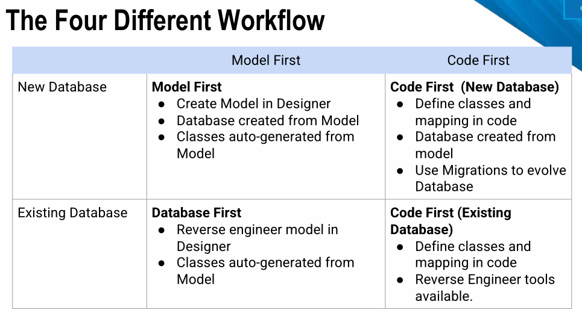
###  A General Guideline

### ★ What is Model First Approach
create the entities,  relationships, and inheritance hierarchies directly on the  design surface of EDMX and then generate the  database from your model   
<mark style="background: #0000CD;">draw table and relationship -> generate and execute SQL -> generate Model </mark>

### ★ What is Code First Approach
<mark style="background: #3CB371;">Create Entity -> Create Context Class -> Generate Tables in DB</mark>  

### ★★★Advantages and Disadvantages of Code First
Advantages  
+ Ability to “version” control database
+ Reduces the amount of automatically generated code significantly
+ A “developer” centric approach  
  
Disadvantages  
+ Difficult if new to the C# environment and already know SQL.
+ Heavily depends on the architecture of the systems in use, using it may be more difficult in scenarios where the database layer is important.
### ★ Advantages and Disadvantages of DB First
Advantages  
+ Assumes that the database design does not change over time. 
+ Knowledge of SQL will make this task significantly easier in  comparison to Code First.  

Disadvantages  
+ Requires an understanding of SQL to create the Database.  
+  Changes to the database can negatively impact development as  auto-generated codes may not be working as intended  
+ Lack the correct annotation attributes (sometimes)
### Inheritance Strategy

### Eager Loading and Lazy Loading
 Eager Loading  
+  Eager loading is the process whereby a query for one type of entity also <mark style="background: #3CB371;">loads related entities </mark>as part of the query.
+ <mark style="background: #D2691E;">This is done so that we do not need to write a separate query for the related entity type</mark>.
+ Eager loading is achieved using the Include() method.  
  
Lazy Loading
+ The loading of related data, only happens when it is request

# FIT5032 Week 5 JS
## Lecture note


## QA
### ★★ What is JS(JavaScript) / features
+ JavaScript is a lightweight, interpreted or JIT compiled programming  language with first class function
+ JavaScript is a prototype-based, multi-paradigm, dynamic scripting  language, supporting object-oriented, imperative and declarative styles

### ★★ What’s difference between Server-side vs Client-side code? How can browser/ client PC run dynamic logic? Use JS
+ Client-side code is code  that is r<mark style="background: #0000CD;">an on the user’s  computer</mark> - when the page is viewed, the <mark style="background: #3CB371;">client side  code is downloaded and then run and displayed by the  browser</mark>. This is what we call client-side JavaScript. <mark style="background: #D2691E;">(write on  html) </mark> (vue jquery)
+ JavaScript can also be used as server-side.<mark style="background: #ff0000;">(write on mvc)</mark> Recently,  there is a huge surge in the popularity of using  JavaScript as server side code in the Node.js  environment(Node.js)
### ★★ JavaScript Libraries and Framework
+ JavaScript library: <mark style="background: #0000CD;">pre-written JavaScript which allows for easier development  of JavaScript applications.</mark> Examples of JavaScript libraries(jQuery d3.js) are `<script src="/Scripts/modernizr-2.8.3.js"></script>`
+ JavaScript framework: A framework <mark style="background: #3CB371;">defines the entire application design</mark>.  Examples of JavaScript frameworks are(vue react)
### ★★ Briefly describe how the bundling of CSS and JavaScript files is  implemented in ASP.Net MVC applications
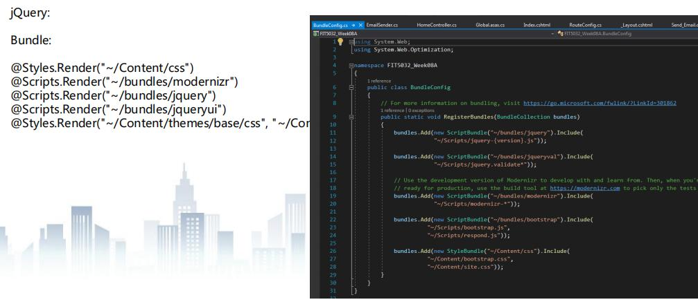
#### How to add new external JS lib in .Net App?
+ js file to `Scripts` folder; css file to `Content` folder
+ configure those file in `BundleConfig.cs`
+ import the bundle in `layout.cshtml`  or other page `@Styles.Render("~/Content/css")` `@Scripts.Render("~/bundles/modernizr")`
#### Styles.Render() and Scripts.Render()
[link to section How to render css/js in view/cshtml? (Defer JS)](#How%20to%20render%20css/js%20in%20view/cshtml?%20(Defer%20JS))
+ Style.Render is used to render a bundle of CSS files defined within BundleConfig.cs files. Styles.Render create style tag(s) for the CSS bundle
+ Scripts.Render is also used to render a bundle of Script files by rendering script tag(s) for the Script bundle.
### ★★ HTML defer
+ Scripts with the defer attribute are executed in order (i.e. first script 1, then script 2). This  also does not block the browser.  
+ 延迟标签会按顺序激活  
+ 激活时机是在整体页面全部被 load 之后  
+ 缺陷：如果 JS 很多或者页面很大，页面延迟会特别高
```html
<script src="path/to/script1.js" defer></script>  
<script src="path/to/script2.js" defer></script>
```
### ★★ html async
+ Scripts with the async attribute are executed asynchronously.  
+ 异步标签控制 script 可以在下载同时解析之后的 tag（HTML）  
+ 使用场景，此 script 对页面的初次加载不是必不可少的，类似网页动画
+ 缺陷：再有多个 JS 的时候，谁先下载完毕，谁先执行，没有 sequence 控制
```html
<script src="path/to/script1.js" async></script>  
<script src="path/to/script2.js" async></script>  
<script async src="my.js"></script>
```
  
# ★★★ FIT5032 Week 6 Validation
## Lecture note


## QA
### ★★★ What is input validation? / Which data should be validated?
+ 所有用户/第三方所输入的数据必须要 validation  
+ correct format and data type
+ not null fields
+ data types dates, numeric and text fields
+ data is within valid ranges e.g. age (ranges)
+ specific format  email addresses or post codes etc
### ★★★ What the purpose in input validation
+ Ensure backend/DB get the right format and legal data(range
+ Validation to minimise security issues (SQL injection attacks)  
  
Client side validation  
+ Client side validation is recommended to reduce  round trips to the server
+ before the data submit  to the server eg  ("Please enter a valid email address")  
  
Server side validation  
```csharp
[Required]
[StringLength(100)]
public string Title { get; set; } = null!;

if (!ModelState.IsValid)
{ return View(movie); }
```

### How many validations can we implement in the ASP.NET?

+ there should be validation in the View layer, Control layer as well as the  Model layer
+ View layer： JS, client side validation
+ Control layer: server side validation, form validation (HTTP post) 这个算 business layer  validation
+ Model layer: Validation Attributes(Annotation), database table constraint （FK not found
### Validation in Models  
   
+ Validation Attributes(Annotation), `[Required(ErrorMessage = "Please Enter Name”)]`
+ database table constraint （FK not found `[DataType(DataType.Date)]` `[DataType(DataType.Date, ErrorMessage = "You can only enter date format")]`
+ 
### Validation in Views
`@Html.ValidationMessageFor(model => model.Name,  "Please Enter a Name", new { @class = "text-danger" }`  
### Regular Expressions
`^[A-Za-z]+\-{0,1}[0-9]*\-*[A-Za-z]+$`


### ★★★How to bind data from http request to method parameters?

+ Model binding in ASP.NET MVC maps data from <mark style="background: #0000CD;">HTTP requests to action method  parameters</mark>.
+ The parameters may be simple types such as strings, integers, or floats, or they may be  complex types  

POST 
+ Viewmodel for frontend (can contain more than one table)
+ get input value to viewmodel (set username)
+ Post viewmodel to DB  
 
### ★★ What is the sequence of server-side validation? why use server-side validation

+ The last layer to protect invalid data interact with DB 整个应用的最后一层防线
+ Defined standard validation on model field, can be used in multiple views 定义 model & field 的标准 validation
+ Can use the jQuery unobstructive validation to generate client side validation automatically <mark style="background: #3CB371;">在 client page/cshtml 自动生成 HTML（JS）代码实现 validation</mark>
```csharp
if (ModelState.IsValid)
{
	db.Patients.Add(patient);
	db.SaveChanges();
	return RedirectToAction("Index");
}
```

### jQuery Unobtrusive Validation

+ add <mark style="background: #0000CD;">validation to our MVC views </mark>without any  additional client-side coding
+ In order words, once you have included server side validation via validation attribute, the  client side scripts to validate the forms will be automatically generated

### Client Side Validation


+ the main reason client side validation is important is because it significantly increases  the user experience.   增强了用户体验
+ Instead of making round trips to the server, users can get an instant feedback.  减少传输等待时间
+ Client side validation will also in a way offload the workload to the client instead of the  server.   减轻了 Server 的负担
```csharp
<div class="editor-field">  
    @Html.EditorFor(model => model.Email)  
    @Html.ValidationMessageFor(model => model.Email)  
</div>
```

### Why we use client/view validation combined with server/model  validation?


### ValidationMessage VS ValidationSummary / Why do we need customize validation message?/ How can we use customised validation message instead of model validation attributes message?
Validation Error Messages  
```
[Required(ErrorMessage="Please enter student name.")]
public string StudentName { get; set; }

@Html.ValidationMessageFor(model => model.Name,  "Please Enter a Name", new { @class = "text-danger" } 
```
  
Validation Summary  
+ `@Html.ValidationSummary(true, "", new { @class = "text-  danger" })`
+ A Summary of the Validation Errors (excluding those  already given) can be made 显示所有错误消息  


### What function/UI component can implement usability in Web application
Tool Tips  
+ Displayed Text when user hovers over element  
+ Implemented by Html title attribute  
+ 
```csharp
//method 1
@Html.TextBox("MyTextbox", new { title = "I'm a Tooltip!”})

//method 2
@Html.EditorFor(model => model.Name, new { htmlAttributes =  new { title = "This is where you type in your name"} })
```

Tab Index  
+ Allows a user to tab through user input fields in a  specified order
+ `@Html.EditorFor(model => model.phone, new { htmlAttributes = new { @class = "form- control", tabindex = 1 } })`  
  
Hot Keys  
+ Hotkeys allow the user to jump to a specific input element based on the key pressed (e.g. ALT-d) 跳转到该view 
+ `@Html.EditorFor(model => model.todaysDate, new { htmlAttributes = new { @class = "form-control" , accesskey = "d" } })`
# FIT5032 Week 7 Security and Identity
## Lecture Note


## QA
### Top 10 Web Application Security Risks
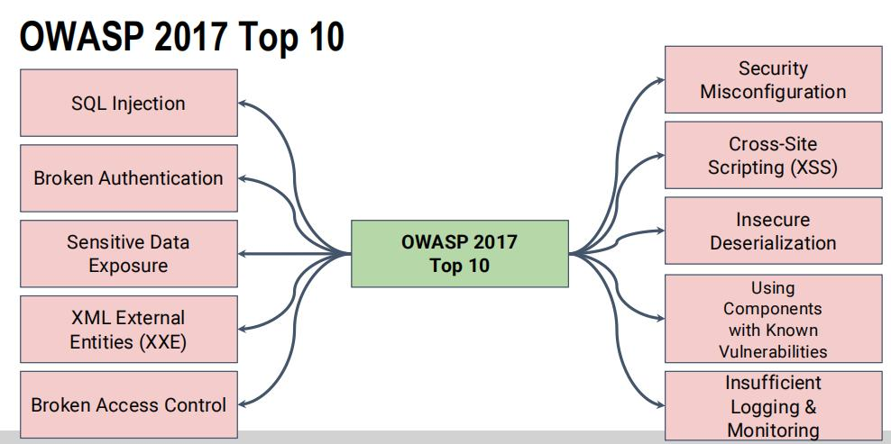

### What is password hash? Why we use it?
+ When storing a password, hash it with a salt, and then  with any future login attempts, hash the password the  user enters and compare it with the stored hash. 
+ If the two match up, then it's virtually certain that the  user entering the password entered the right one `E.g. Abcd = 》 sdkfjqwo123jlk... （a fixed length 256 or 512 bits`
+ As hashed are inherently one-way in their nature, so even if data is exposed, hashed pwd cannot  be exposed.  This significant secure the data in DB
### ★★ Authorization(Role Func) vs Authentication(Login)
+ Authentication is the process of verifying who you are. When you log on to a PC with a  username and password you are authenticating. <mark style="background: #0000CD;">Authentication is the process of ascertaining  that somebody is really is who he claims to be. </mark> 
+ Authorization is the process of verifying that you have access to something.(`[AllowAnonymous]` 跳过验证阶段) Gaining access to  a resource (e.g. directory on a hard disk) because the permissions configured on it allow you  access is authorization. In short, <mark style="background: #3CB371;">authorization refers to rules that determine who is allowed  to do what.</mark> 

### Multi-factor authentication
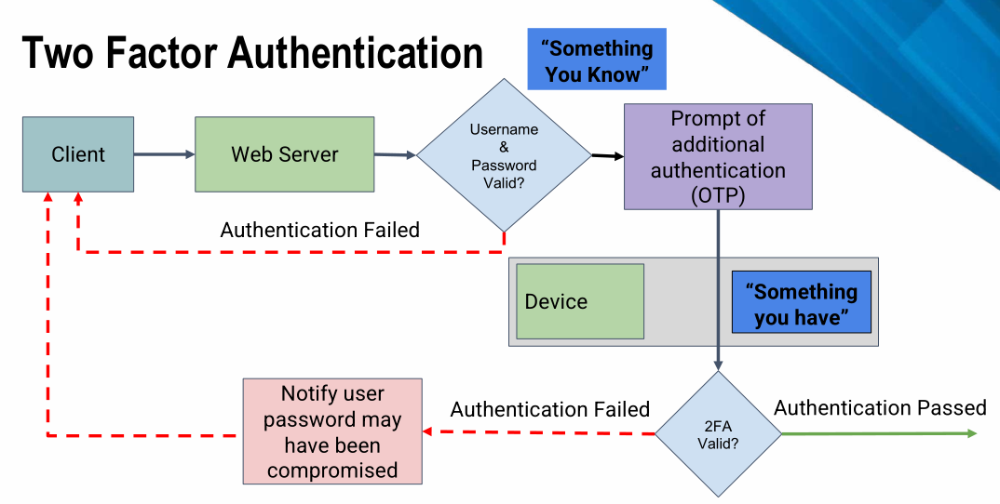

+ The authentication factors must come from two or more of the  following
+ something the claimant knows (e.g. a personal  identification number (PIN), password or response to a  challenge) <mark style="background: #ff0000;">(Something you know)</mark>
+ something the claimant has (e.g. a physical token, smart  card or software certificate) <mark style="background: #3CB371;">(Something you have)</mark>
+ something the claimant is (e.g. a fingerprint or iris scan). <mark style="background: #0000CD;"> (Something you are)  </mark>
+ Advantages: password easy to loss 密码容易丢; provides additional security by  adding protection in layers增加保护.
+ Users must carry a mobile phone, charged, and kept in range of a cellular network,  whenever authentication might be necessary.需要带手机 The user must share their personal mobile number with the provider, reducing personal  privacy and potentially allowing spam.需要共享号码
### ★★ How to secure an Action/Controller?
An Action (e.g. from the HomeController) can be  restricted to logged in users <mark style="background: #ff0000;">Use the [Authorize] annotation</mark>
```csharpsharp
[Authorize]  
public ActionResult Contact()  
{  ViewBag.Message = "Your contact page.";  
	return View();}
```
Now the user must log in to access the Contact action  

### User Account Tables


The AspNetUser table has the details of the user that  have registered
  

in the AspNetRoles table We can specify roles in the application by adding entries
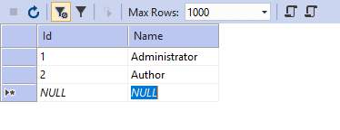

AspNetUserRoles table  The Mapping of the Users to the roles is done


### ★★ How to secure Actions/Controllers based on role?
Use `[Authorize(Roles = “Administrator”)]`  name of the roles are your choice.  
 `[Authorize(Roles = “HRManager,Finance")]` HRManager or Finance roles can access 
```csharp
[Authorize(Roles = “PowerUser")]  
[Authorize(Roles = “ControlPanelUser")
public ActionResult Contact(){}
```
User must be both PowerUser and  ControlPanelUser can access
### Selecting/Viewing items owned by log in user
```csharp
using Microsoft.AspNet.Identity;
// GET: Articles  
public ActionResult IndexUserNames()  
{  //return View(db.Articles.ToList());  
string currentUserId = User.Identity.GetUserId();  
return View(db.Articles.Where(m=> m.AuthorId ==  
currentUserId).ToList());  
}  
```
```csharp
//admin can view every list
if (User.IsInRole("Admin"))
{
	patients = db.Patients.ToList();
}
```
User id to select just the items that are created by the  user (for viewing in the index view.
### ★★How to implement Identity in ASP.Net MVC
+  Using Usernames and Passwords to log in  
+ Using roles such as administrator, user etc  
+ Mapping of usernames to roles  

### Why use role based security? / Authorization
+ Users can be restricted to their own data  
+ Administrators given write access to all data  
+ Public (no logged in users) given read access  only

### Cross Site Scripting (XSS)
+ ASP.Net MVC has built in checks to ensure scripts are  not submitted via user input
+ Disable validation for the relevant action `[ValidateInput(false)]`

### Cross Site Request Forgery (CSRF) Attack
+ ASP.Net MVC has a built in functionality to stop this  
+ Add `@Html.AntiForgeryToken()` to the form  
+ Add `[ValidateAntiForgeryToken]`  to the action method  
```html
<!--using it in view-->
<!--Razor view syntax is different from normal html-->
using (Html.BeginForm()) {
	@Html.AntiForgeryToken()
	<input type="text" id="fname" name="fname">
	<input type="submit" value="Submit">}
```
```csharp
//using it in controller
[HttpPost]
[ValidateAntiForgeryToken]
public ActionResult Create([Bind(Include = "Id,FirstName,LastName,UserId")] Patient patient){}
```
### OpenID

+ OpenID is an open standard and decentralized  authentication protocol.   
+  It allows Clients to verify the identity of the End- User based on the authentication performed by  an Authorization Server, as well as to obtain basic  profile information about the End-User in an  interoperable and REST-like manner.   
+ Remember one username and one password

### OAuth

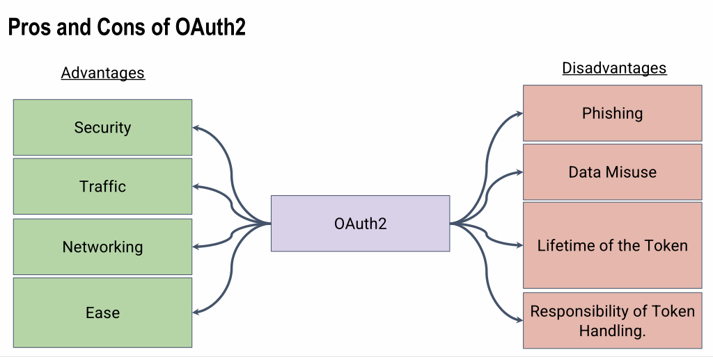
+ OAuth 2.0 focuses on client developer simplicity while  providing specific authorization flows for web  applications, desktop applications, mobile phones, and  living room devices

# FIT5032 Week 8 Email
## Lecture Note
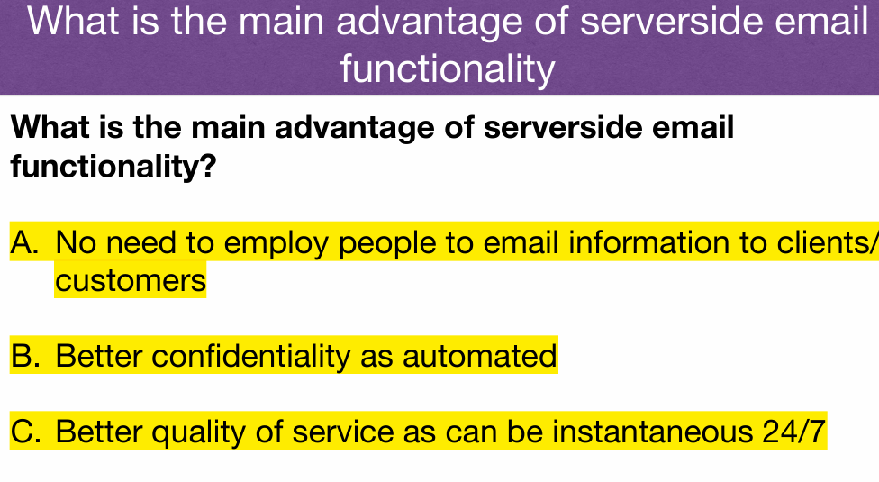


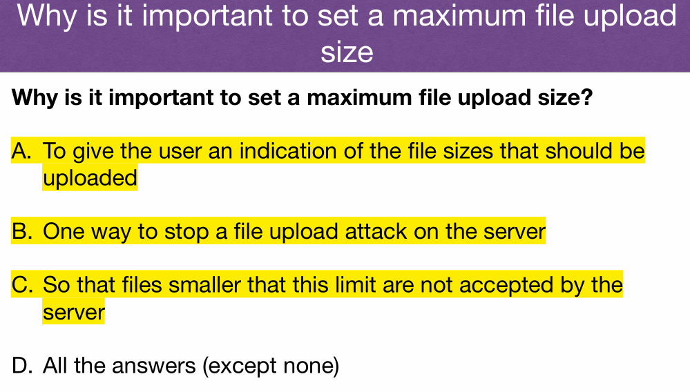


## QA
### SignalR
Real-time web functionality is the ability to have server code push content to  connected clients instantly as it becomes available, rather than having the  server wait for a client to request new data 实时返回数据不用刷新 server update后立即发送
chat room dashboard


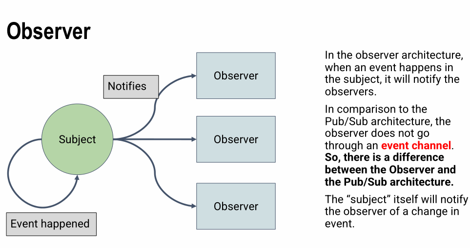
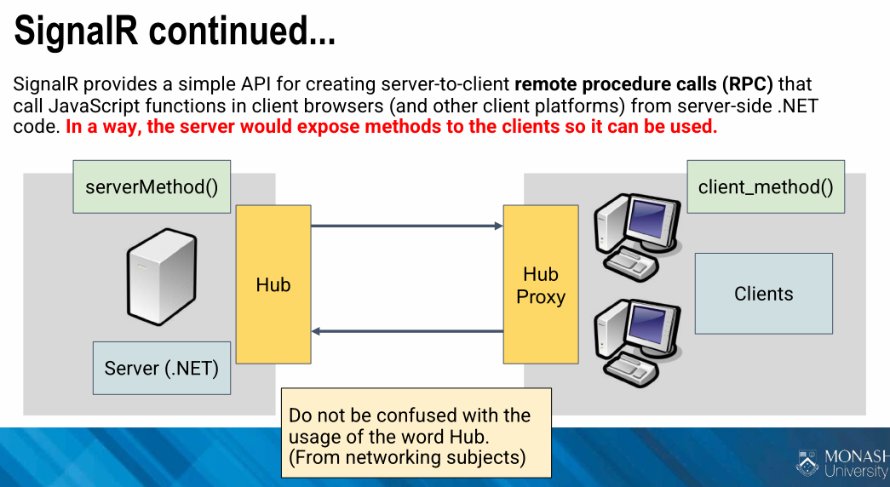

# FIT5032 Week 9 Web Optimisations
## Lecture Note


## QA
### How to implement web optimization
+ Reducing HTTP Connections  Each connection and request is time consuming and takes resources  
+  Reducing File sizes  Larger file sizes take more bandwidth (and time) to down load  
+ Caching  Can reduce the need to request a resource that has already been down loaded  
+  Perceived Improvements  Some changes can be made that does not improve absolute performance, but  makes the user believe there is an improvement (due to lower latencies and quicker  perceived response time)
### how to Reduce HTTP request
+ Combing images  
+ Reduce the size of files  
+  Making JavaScript asynchronous `<script async src="foobar.js"></script>`
### Minify CSS and JavaScript
Minify:  
Removing unnecessary characters from your HTML  White space characters   New line characters   Comments   Block delimiters  

Uglify  
Changing variables and functions with long names into shortnames  Can act as an obfuscator, but is just a simple replacement  

Bundle  
Bundler combines multiple files into a single file  Often used with minify and uglify

### ★★★ What’s difference between async and defer in render JS? / How to render JS without block body content render? / When use async instead of defer?  
Defer 会在（dom 树加载之后）按顺序执行，Async 会在下载结束之后立即执行
Use the async or defer JavaScript to avoid render blocking.  *Does not mean the webpage is fully loaded before JavaScript is executed  
`<script async src="foobar.js"></script> `  

Deferring JavaScript   Ultimate goal is loading or parsing JavaScript only after page content has loaded
### ★★★ What is differ between APS.Net Framework and ASP.NET  Core?
[reference](https://www.interviewbit.com/blog/net-core-vs-net-framework/#:~:text=NET%20Framework%20is%20a%20platform,app%20needs%20and%20developer%20workflows)

# FIT5032 Week 10 Modern JavaScript
## Lecture Note
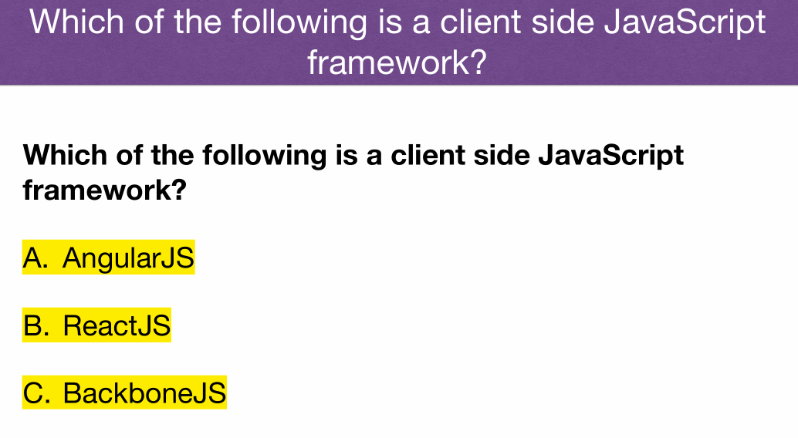

## QA
###  ★ How to communicate from client and serve

### architecture between traditional and modern web application

### What is API? 
API stands for application programming interface, which is a set of definitions and protocols for building and integrating application software.  
APIs let your product or service communicate with other products and services without having to know how they’re implemented.  

### API Features? 
+ Platform independence. Any client should be able to call the  API, regardless of how the API is implemented internally. This  requires using standard protocols, and having a mechanism  whereby the client and the web service can agree on the  format of the data to exchange.  无论platform 任何client都可以使用API获得数据
+ Service evolution. The web API should be able to evolve and  add functionality independently from client applications. As the  API evolves, existing client applications should continue to  function without modification. All functionality should be  discoverable, so that client applications can fully utilize it. API与用户application 当API改变时 程序可继续使用  (不改变对应function的名字)
### Why use API?  
+ Easy to read and work with
+ Hard to misuse
+ Complete and concise

https://swaggerhub.com/blog/api-design/api-design-best-practices/
### ★ What is web API?  
A unique type of interface where the communication  takes place using the Internet and Web-specific  protocols such as HTTP 使用网络协议通过Internet连接API  
The API defines a set of endpoints, request  messages and response structures.  XML and JSON are two examples of response  media types.

### ★★★ What is restful Web Service/API? Benefits/WHY? Features?

What is:  
+ Representational State Transfer (REST) as an architectural approach to designing web services.  
+ REST is independent of any underlying protocol and is  not necessarily tied to HTTP. However, most common REST  implementations use HTTP as the application protocol  

Advantage:  
+ A primary advantage of REST over HTTP is that it uses open  standards, and does not bind the implementation of the API or the  client applications any specific implementation 只要能生成HTTP request 都能使用 API 
+ Separation between the client and the server: Separates the  user interface from the server and the data storage 用户界面与服务器和数据存储分离
+ Visibility, reliability and scalability. Each development team  can scale the product without too much problem. They can  migrate to other servers or make all kinds of changes in the  database, provided the data from each request is sent correctly 易扩展迁移
+ The REST API is always independent of the type of platform  or languages: the REST API always adapts to the type of  syntax or platforms being used 兼容性好
### Common HTTP Methods used by RESTful APIs
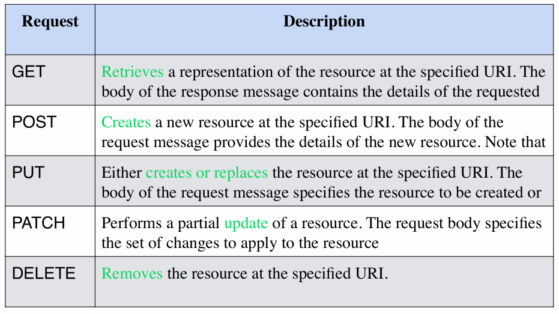

### Benefits of JavaScript Frameworks
+ Some frameworks customised for:  mobile devices; single-page applications  
+ With cross-compatibility issues of web browsers  
+ JavaScript frameworks provided the standard API’s  
+ More recently standards such as HTML5 allow even  more portable applications
### Single Page Applications
+ Allow all functionality to be in one page  
+ HTML page, JavaScript, CSS etc loaded on first page  load  Dynamic (ajax) interaction with the server   Retrieves data from webservice (normally)  
+ User interface control moves from server to the client
### Why use Angular JS? Features?
+ Built in data binding  Bi-directional data binding, from model to view and  view to model  
+  HTML as template language for views  
+ User interface (UI) model and controller handled by the  Browser   No need to contact server for these UI based updates  New views can be rendered without server interaction  

Components  
+ ng-app − defines and links an AngularJS  application to HTML.  
+ ng-model − binds the values of AngularJS  application data to HTML input controls.  
+  ng-bind − binds the AngularJS Application data to  HTML tags

# FIT5032 Week 11 testing
## Lecture Note


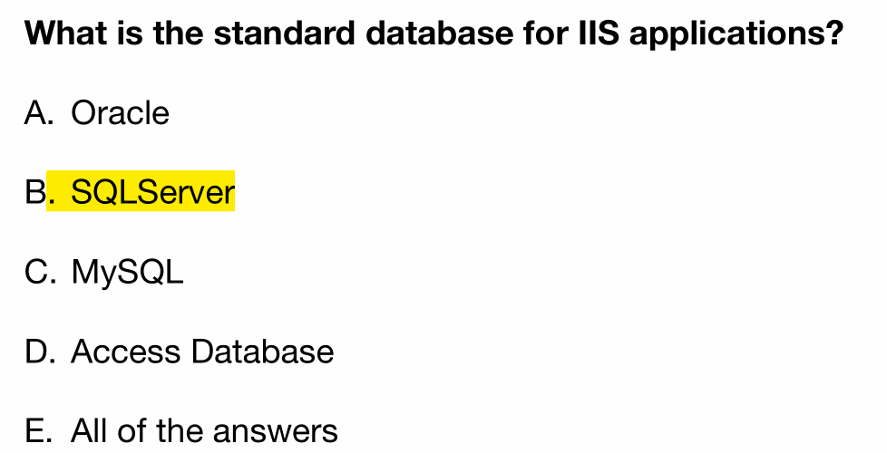

## QA
### ★ Development Pipeline
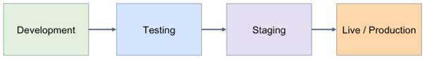
+ During development using internal Visual Studio embedded webservers and database  servers
+ When hosting web application, full IIS and database needed
+ Depending on service provided;   If just platform provided then need to manage IIS and databases;   If service provided, then just need to manage software;  If software provided, then just need to manage data  
### Modern Development Practices


+ Modern applications are developed using Continuous  Integration & Continuous Development [CI/CD reference](https://www.atlassian.com/continuous-delivery/principles/continuous-integration-vs-delivery-vs-deployment)  
+ CI merge their changes back to the main branch as often as possible.  
+ CD automatically deploys all code changes to a testing and/or production environment after the build stage.  
+ CD  every change that passes all stages of your production pipeline is released to your customers
+ Integration, merge commit into develop  在“集成”期间很少且经常执行的步骤的实践，而不是等到代码完成后再将所有代码组合在一起并进行测试。
+ Delivery, release after a mount of time or amount of requirement branch merged into dev branch  Decide which requirements or function can be release at this version.  持续交付建立在通过持续集成建立的构建和测试自动化的基础之上。
+ Deployment, upload the app package like apk to Google app store or web server.  Install new app in the web server, replace the old version.持续部署将持续集成和交付的实践得出其合乎逻辑的结论：

### What is test? Why test?
+ Software testing is a way to assess the quality of the  software and to reduce the risk of software failure in  operation
+ A defect (fault or bug) in the software code or in some  other related work product.  
+ An error that leads to the introduction of a defect in one  work product can trigger an error that leads to the  introduction of a defect in a related work product.  
+ If a defect in the code is executed, this may cause a  failure, but not necessarily in all circumstances.
### Functional vs Non-Functional Testing
+ Functional testing involves tests that evaluate functions  that the system should perform. <mark style="background: #0000CD;">The functions are  “what” the system should do</mark>.  
+ Non-functional testing of a system evaluates  characteristics of systems and software such as  usability, performance efficiency or security. Non-  functional testing is the <mark style="background: #3CB371;">testing of “how well” the system  behaves. </mark>This is often called quality requirements  
  

### Test Techniques
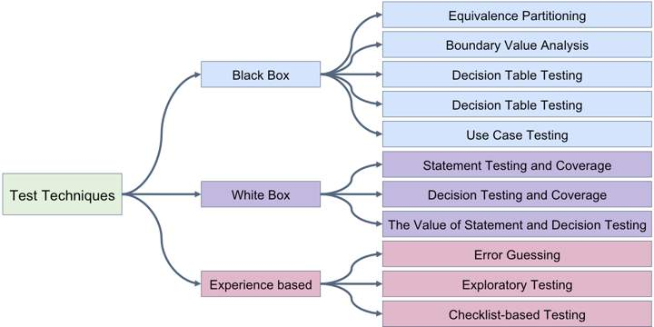
### Blackbox
+ based on an analysis of  the appropriate test basis (e.g., formal requirements  documents, specifications, use cases, user stories, or  business processes).根据不同document进行
+ Black-box test techniques concentrate on the inputs and  outputs of the test object without reference to its internal  structure 只关注input和output不关注logic
### Whitebox
+ an analysis of  the architecture, detailed design, internal structure, or  the code of the test object  concentrate on the structure and processing  within the test object. 根据结构跟processing进行测试
### Experience-based test
from the tester’s skill and  intuition, and their experience with similar applications  and technologies. 根据经验与熟悉程度进行测试
### test Driven Development
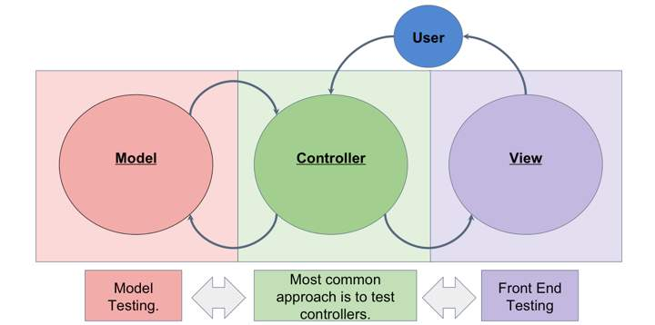  
Test-driven development (TDD) is a software  development process that relies on the repetition  of a very short development cycle. 先写test case确定预期结果，再写代码，然后用case进行测试
### Hosting ASP.Net applications
Several alternatives to hosting ASP.Net applications   Host on your own servers；  Manage webserver and databases  

Host on a managed platform；  Using webserver and databases provided by service provider  

Host on Cloud platforms such as Azure；  Platform exposes services such as webserver and databases  

One Server shared by all hosts  
• Each host given a different virtual directory  
• Even though on one machine each host can have own domain  address  
• Independence of different applications enforced by security  
constraints   

Many virtual machines each with own Server  
• More popular modern method  
• Reduces the likelihood of applications interfering with each other  
• May be more resource intensive than a single share IIS server
### IIS / Kestrel servers
IIS is the default webserver for ASP.Net application in Windows.  Many service providers have IIS based hosting.   

Kestrel is a cross-platform web server for ASP.Net Core.  
• Included by default in ASP.NET Core project templates.  
• Other hosting options for ASP.Net Core  
• Windows services without IIS  
• Linux with Nginx as reverse proxy  
• Linux with Apache as reverse proxy

### Deploying to host platform and DB connection
Deploying to a host platform  
+ Essentially copying files to the relevant directory/folder on the server  
+ Often automated by a one click deploy application  
+ Needs to be configured to the correct webserver (often copied via ftp  etc  

Database configuration  
+ Database must be set up on the host.  
+ Need to export database definition and any data from Visual Studio  internal SQLServer  
+ Import database definition and data into the hosted SQLServer  

# FIT5032 Mock Exam
## m1 What is the role of the layout file in an ASP.Net MVC application
[link to section★★★ What is the role of the layout file in an ASP.Net MVC application? / How to design a website application in the same UI component, same heading image, same navigation bar?](#★★★%20What%20is%20the%20role%20of%20the%20layout%20file%20in%20an%20ASP.Net%20MVC%20application?%20/%20How%20to%20design%20a%20website%20application%20in%20the%20same%20UI%20component,%20same%20heading%20image,%20same%20navigation%20bar?)   
In this file, render css and js in application level.  Include the basic common UI component which are header section,navigation bar and footer section
## m2 Briefly describe how the bundling of CSS and JavaScript files is  implemented in ASP.Net MVC applications
[link to section★★ Briefly describe how the bundling of CSS and JavaScript files is implemented in ASP.Net MVC applications](#★★%20Briefly%20describe%20how%20the%20bundling%20of%20CSS%20and%20JavaScript%20files%20is%20implemented%20in%20ASP.Net%20MVC%20applications)  
+ Firstly register the CSS and JS in the bundleconfig.cs file and rename script bundle name.  This bundle allow include multiple js or css files  
+ Secondly use @Style.Render and @Scripts.Render to render/import css/js in the html page.  Then the imported css and js can be used in this web page
## m3 How to make ASP.Net website responsive
+ First need to have bootstrap in your project.   
+ Define the container width in bootstap.css according with different screen width.   
+ Use this css container as `<div>` style
## m4 In terms of internet application development what do we mean by  Navigation (from the Flow Bohl usability categories)
[link to section ★★ Web Usability Guidelines (from Flow Bohl)](#★★%20Web%20Usability%20Guidelines%20(from%20Flow%20Bohl))  
Visual cues should be in place that set priorities and guide a user into the desired direction. A user will likely ask 'where am I?' or 'how can I get where I want to go'. Knowing what users expect and organizing the content accordingly is key to good information architecture and UX design
## m5 When would a required field validation be used in an application? In  your example, what error message would you give if the validation failed?  (How about Compare/Regular Express)
[link to section Validation in Views](#Validation%20in%20Views)  
[link to section Validation in Models](#Validation%20in%20Models)  
When a field should be required(not null or empty) in the entity, we need to set required  validation  
`[Required(ErrorMessage=”This is required field!”)]`  
`@Html.ValidationMessageFor(model => model.Name, "Please Enter a Name", new { @class = "text-danger" }` 
## m6 When would a Data Type validation be used in an application? In your  example, what error message would you give if the validation failed
[link to section Validation in Models](#Validation%20in%20Models)  
When a field should be a specific data type in the entity(so as in model), we need to set  data type validation.
`[DataType(DataType.Date, ErrorMessage = "You can only enter date format")]`
## m7 What is the difference between String and string data types in ASP.Net  MVC Applications
[link to section What is difference between `String` and `string`](#What%20is%20difference%20between%20`String`%20and%20`string`)    

string is an alias for String. In application, there is no difference in using either.  PS: String used to access build in function in String class Sting
## m8 Briefly describe the role of OAuth in ASP.Net Identity implementation.  Give an example
[link to section OAuth](#OAuth)   
OAuth provide a third-part Authorization and Authentication service  
1. When user log in, app redirect to Google Oauth Service page.  
2. User enter Google identity(username and pwd)  
3. Google Oauth service identify the Google username/pwd  
4. If identify succeed, redirect back to app and tag Authorization success, the user  passed the authorization and authentication(also return group tag)  
5. If identify failed, report invalid username/pwd, redirect back........ (E.g 403)  
**PS: This significant secure/efficient the Authorization and Authentication in app.

## m9 What are the main high level differences between a standard ASP.Net  MVC application and an ASP.Net application that uses the Web API
[link to section ★ What is web API?](#★%20What%20is%20web%20API?)  
[link to section Benefits of JavaScript Frameworks](#Benefits%20of%20JavaScript%20Frameworks)  
[other reference](https://www.dotnettricks.com/learn/webapi/difference-between-aspnet-mvc-and-aspnet-web-api#:~:text=Asp.Net%20Web%20API%20VS,returns%20only%20data%2C%20not%20view.)
+ MVC returns the rendered view(html page) to client browsers.  The returned view controlled by controller in server. 
+ Web API only return data in json or xml to client SPA(JS framework).  The action invoked by http method in JS function(AJAX).

## m10 Give two example scenarios where in one the async method is  preferred and in the other the defer method is preferred
[link to section ★★ HTML defer](#★★%20HTML%20defer)  
[link to section ★★ html async](#★★%20html%20async)  

+ Defer: A.js need to download data and B.js need to assign data in the UI component or  other logic based on data. This requirement need sequence execution, so use deffer tag  
+ Async: Like import / load Google analysis JS lib, this lib does not depend on any other lib,  so use async tag to execute js as soon as it downloaded completed
## m11 Identify 3 usability features of an application that can be implemented  to support a novice (new) user of an Internet application. Briefly describe  each
[link to section What function/UI component can implement usability in Web application](#What%20function/UI%20component%20can%20implement%20usability%20in%20Web%20application)  

+ Tool Tips Displayed Text when user hovers over element  
+ Tab Index Allows a user to tab through user input fields in a specified order  
+ Hot Keys Hotkeys allow the user to jump to a specific input element based on the key pressed
## m12 Briefly discuss the role of code testing framework in Continuous  Integration and Continuous Delivery/Deployment in relation to modern  ASP.NET MVC applications development
[link to section Modern Development Practices](#Modern%20Development%20Practices)  


## m13 Briefly explain how models can be used to represent data in ASP.Net  MVC application
[link to section ★★★How to bind data from http request to method parameters?](#★★★How%20to%20bind%20data%20from%20http%20request%20to%20method%20parameters?)    
Entity represent Model in the EF. Use LINQ to CRUD data from DB.  
View shows data by binding model in controller(Use entity/model to CRUD data)
## m14 Describe how Models, Controllers and Views can be automatically  generated from the database. Clearly identify the different Actions (and  related Views) that can be automatically generated
[link to section What is Entity Framework / benefit / Why use?](#What%20is%20Entity%20Framework%20/%20benefit%20/%20Why%20use?)  
[link to section ★ Advantages and Disadvantages of DB First](#★%20Advantages%20and%20Disadvantages%20of%20DB%20First)  
Using EF generate model from Database, this is database first approach.  
Then generate controller and view from models using scaffolding

## m15 How can an AngularJS client in the ASP.Net MVC application  consume the Web API endpoint? Briefly describe the approach
[link to section Common HTTP Methods used by RESTful APIs](#Common%20HTTP%20Methods%20used%20by%20RESTful%20APIs)
1. User access html page.  
2. Html page render js file
3. In the JS function method, invoke angular JS controller to access api and receive  response data  
4. Use Angular bi-directional data bind data from view and ng-model  
5. Display data in html
## m16 Discuss three differences between ASP.NET Framework MVC and  ASP.NET Core
[link to section ★★★ What is differ between APS.Net Framework and ASP.NET Core?](#★★★%20What%20is%20differ%20between%20APS.Net%20Framework%20and%20ASP.NET%20Core?)  

## b1 Identify the main components you will use in your application. 7 marks
+ Model: aim to data storage, integrity,CRUD data from DB  
+ Controller: Mapping/update view, validation, link model and view  
+ View: presentation logic  
+ IIS server  
+ SQLServer
##  b2 Briefly describe how to combat XSS (Cross Site Scripting) and CSRF (Cross Site  Request Forgery) for this application
[link to section Cross Site Scripting (XSS)](#Cross%20Site%20Scripting%20(XSS))  
[link to section Cross Site Request Forgery (CSRF) Attack](#Cross%20Site%20Request%20Forgery%20(CSRF)%20Attack)  
XSS: .NET has build in XSS protection, no need to add more. Keep default to set `[ValidateInput(true)]  ` 

CSRF: Add `@Html.AntiForgeryToken() ` in the view, to set signature in html view  Add `[ValidationAntiForgeryToken] `to valid the signature in controller
## b3 Discuss a use case for real time interaction with end users using SignalR
[link to section SignalR](#SignalR)  
Chat room.  
One user send a message and server push this message to all clients who has subscribed.
## b4 Briefly discuss how would you ensure quality using code testing framework
[link to section Modern Development Practices](#Modern%20Development%20Practices)  
Black box Testing, white box testing  
Continuous Integration, merge commit into develop  
Continuous Delivery, release after a mount of time or amount of requirement branch merged into  dev branch  
Decide which requirements or function can be release at this version.  
Continuous Deployment, upload the app package like apk to Google app store or web server.  
Install new app in the web server, replace the old version

# FIT5032 exam note 
## 1. Why use MVC, explain MVC feature Separation of concerns(Soc) and Single Responsibility  Principle  
[link to section ★★ Advantages of ASP.NET MVC = Why use MVC? = MVC benefit](#★★%20Advantages%20of%20ASP.NET%20MVC%20=%20Why%20use%20MVC?%20=%20MVC%20benefit)   
[link to section Separation of Concerns (SOC) 依据功能分成独立几个模块开发](#Separation%20of%20Concerns%20(SOC)%20依据功能分成独立几个模块开发)  
[link to section Single Responsibility Principle (SRP) 每个模块如何划分 class， reuse](#Single%20Responsibility%20Principle%20(SRP)%20每个模块如何划分%20class，%20reuse)   
(前端可使用逻辑) (职能可分开)(以method为单位 容易写test)(容易集成js框架)  
SOC: each section addresses a separate concern; simplifying development and maintenance; individual sections can be reused, as well as developed and updated  
SRP: very module, class or function in a computer program should have responsibility over a single part of that program's functionality,

## 2. Why use layout file, what differ in using layout file? Differ between other html?  
[link to section ★★★ What is the role of the layout file in an ASP.Net MVC application? / How to design a website application in the same UI component, same heading image, same navigation bar?](#★★★%20What%20is%20the%20role%20of%20the%20layout%20file%20in%20an%20ASP.Net%20MVC%20application?%20/%20How%20to%20design%20a%20website%20application%20in%20the%20same%20UI%20component,%20same%20heading%20image,%20same%20navigation%20bar?)  
-   Razor views use a layout to determine their look and feel
-   The default view is held in `Views/Shared/layout.cshtml`
-   header; footer; navigation bar
- 
## 3. Advantage and Disadvantage of Code first,model first and DB first, brief explain the flow  of each  
[link to section Development Workflow](#Development%20Workflow)  
[link to section ★ What is Model First Approach](#★%20What%20is%20Model%20First%20Approach)  
[link to section ★ What is Code First Approach](#★%20What%20is%20Code%20First%20Approach)  
[link to section ★ Advantages and Disadvantages of DB First](#★%20Advantages%20and%20Disadvantages%20of%20DB%20First)  
## 4. How to navigate page in ASP.NET MVC? (usability branch, implement branch)  
[link to section ★★★ How to handle request in ASP.Net MVC?](#★★★%20How%20to%20handle%20request%20in%20ASP.Net%20MVC?)

## 5. How to use regular expression validation?  
[link to section Regular Expressions](#Regular%20Expressions)  


## 6. What is jQuery? Why use it?  
[link to section jQuery Unobtrusive Validation](#jQuery%20Unobtrusive%20Validation)  
add validation to our MVC views  
pnce you have included server side validation via validation attribute, the client side scripts to validate the forms will be automatically generated

## 7. Demo how is SQL injection and how to prevent it.  
[link to section Cross Site Scripting (XSS)](#Cross%20Site%20Scripting%20(XSS))  
-   ASP.Net MVC has built in checks to ensure scripts are not submitted via user input `[ValidateInput(true)]`
## 8. What does controller action method do?  
[link to section How to combine controller and view/url together? / How to add new view binding with controller?](#How%20to%20combine%20controller%20and%20view/url%20together?%20/%20How%20to%20add%20new%20view%20binding%20with%20controller?)  

An action (or action method) is a method on a controller that handles incoming requests. Controllers provide a logical means of grouping similar actions together, allowing common sets of rules (e.g. routing, caching, authorization) to be applied collectively. Incoming requests are mapped to actions through routing

## 9. Describe Identity flow you used in your assignment. (Include DB structure)  
[link to section ★★How to implement Identity in ASP.Net MVC](#★★How%20to%20implement%20Identity%20in%20ASP.Net%20MVC)  
[link to section User Account Tables](#User%20Account%20Tables)  
## 10. How to convert .Net MVC to .Net Web API?  

## 11. What is Continuous Integration/Continuous Delivery/Continuous Deployment?  
[link to section Modern Development Practices](#Modern%20Development%20Practices)  
CI merge their changes back to the main branch as often as possible.  
CD automatically deploys all code changes to a testing and/or production environment after the build stage.  
CD  every change that passes all stages of your production pipeline is released to your customers

## 12. Cons and pros of Angular JS  
[link to section Why use Angular JS? Features?](#Why%20use%20Angular%20JS?%20Features?)  
[The pros and cons of choosing AngularJS](https://devm.io/javascript/the-pros-and-cons-of-choosing-angularjs-124850)  
改进的服务器性能   
更快的应用程序原型设计  
必须支持 JavaScript  
学习困难
## 13. Demo example of SignalR and explain what is subscriber?  
[link to section SignalR](#SignalR)   
Chat room.  
One user send a message and server push this message to all clients who has subscribed. 

## 14. Web Optimized manners, list 3  
[link to section How to implement web optimization](#How%20to%20implement%20web%20optimization)     
-   Reducing HTTP Connections Each connection and request is time consuming and takes resources
-   Reducing File sizes Larger file sizes take more bandwidth (and time) to down load
-   Caching Can reduce the need to request a resource that has already been down loaded
-   Perceived Improvements Some changes can be made that does not improve absolute performance, but makes the user believe there is an improvement (due to lower latencies and quicker perceived response time)
## 15. Why use ASP.NET Core?  
[link to section ★★★ What is differ between APS.Net Framework and ASP.NET Core?](#★★★%20What%20is%20differ%20between%20APS.Net%20Framework%20and%20ASP.NET%20Core?)  
用于构建 Web UI 和 Web API 的统一故事。 
为可测试性而设计  
能够在 Windows、macOS 和 Linux 上开发和运行。  
开源和以社区为中心。   
现代客户端框架和开发工作流程的集成。