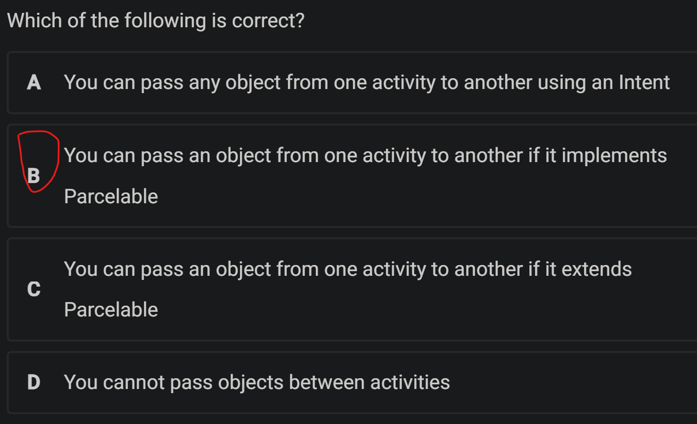
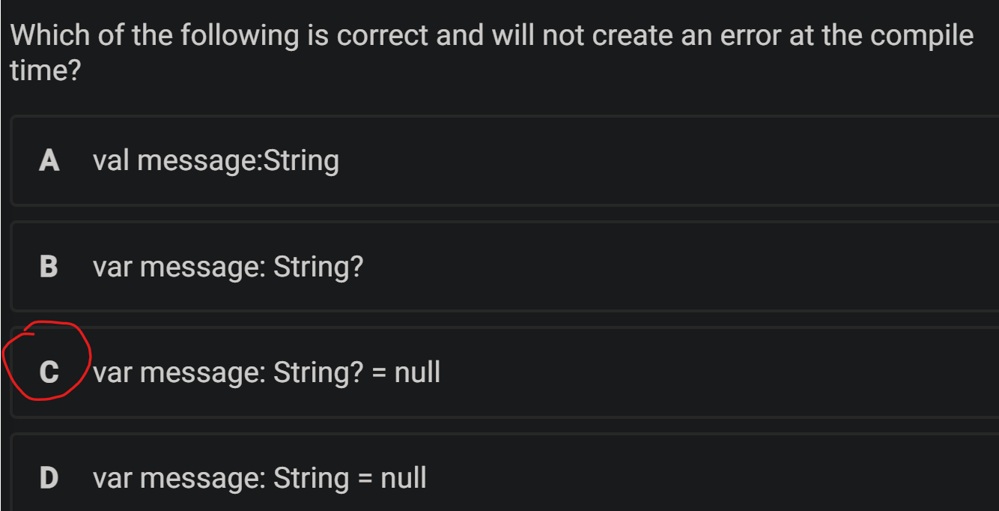
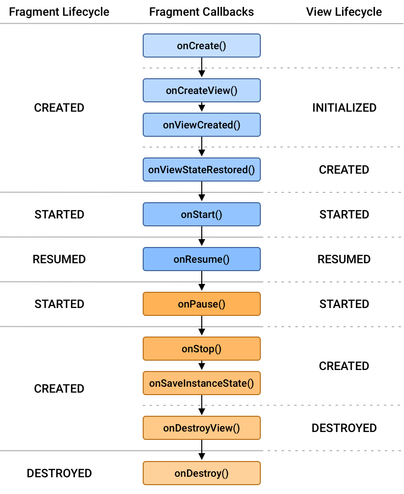

Create time: 2023-02-24  Last update: 2023-02-24

# How to use the FIT study Note document
1. download the [markdown file repository](https://github.com/GreenH47/mynote) and  navigate to the `docs` folder
2. view all the markdown files via [Obsidian vault](https://help.obsidian.md/How+to/Working+with+multiple+vaults) that can show the linked section in the note document    
3. You may find some extra material or program template  repository in the Course Brief introduction for the FIT Note markdown Document (some course don't have )

4. you can view [the web page](https://greenh47.github.io/mynote/) which transfer from MD file online but will lose the extra information or wrong    markdown display

  
# FIT5046 - Mobile and distributed computing systems Course Brief introduction

## outline
  
  

This unit focuses on the most current and key topics in mobile and distributed computing. We will mainly focus on learning key concepts of mobile computing using Android, and then look at ubiquitous and context-aware computing, IoT, wireless sensors, and location-aware computing. While we will discuss these topics in the lectures, you will learn practically in the labs how to create and develop a mobile, distributed Android app. Each semester we develop a real world and useful mobile app for Android platforms.

[FIT5046 - Mobile and distributed computing systems](https://handbook.monash.edu/2023/units/FIT5046?year=2023) done for the year 2023. (Semester 1)  
## software and Programming Language for the unit
+ Android Studio Electric Eel, 2022.1.1 (stable version) SDK 13  API 33  [Android Studio Electric Eel | 2022 年 1 月 1 日  |  Android 开发者  |  Android Developers](https://developer.android.com/studio/releases)  
+  Java The original language  
+   Kotlin  We learn the Kotlin code by comparing to Java and only  limited to the lecture topics

# week 1 Introduction to Mobile and Distributed Computing
## exercise
  

## Learning Objectives:
+ what is a distributed system? what is a mobile and distributed system?   
+ what are the main architectures/models for developing mobile and distributed systems?  
+ What is a web service? why are web services important in developing distributed and mobile systems?  
+ What is REST? What are the architectural constraints of REST? What are the interface constraints of REST?  
+ The role of JSON in web services?  
## lecture
An Overview of Distributed Systems  
An Overview of Mobile and Distributed Computing  
Web Services  
### Distributed Computing
A computing paradigm where a number of autonomous  entities (most likely heterogeneous)  which are geographically distributed  can communicate and exchange messages  through a computer network  to achieve certain related tasks (common goals)
+ Vertical distribution: placing logically different layers/components on different machines  Each layer on one single machine  
+ Horizontal distribution: a single logical layer/component is distributed across multiple machines to improve scalability E.g. distributing a database on multiple machines (distributed database   
### Mobile and Distributed Computing
+ It is a class of distributed computing systems. It integrates mobile and wireless devices into distributed systems (Wireless sensor, smart device)  
+ Mobile computing is associated with mobility of hardware, users,data, applications and network in computer applications  
### Distributed Computing Models
The client/server model  
+ Server processes offer  services to clients processes  
+ Usually there is a data storage at the backend  
+   

Peer-to-peer
+ Each process logically equal to each other  
+ Data flows between the processes  
+ 

### SOA  (Service-Oriented Architecture)
Service-oriented architecture was introduced as a paradigm  for distributed systems  
+ Application functionalities (software components) are provided as  services (independent modules)  
+ <mark style="background: #0000CD;">Exposed to public (clients) using a standard interface protocol,  aka an application programming interface (API)</mark> 
+ <mark style="background: #3CB371;">Message based interactions through these interfaces</mark>  
+ Reuse of services and composition of services  
+ Interoperability to support different platforms
### web service
+ SOA is implemented by creating web services  
+ “A Web service is a piece of software/code designed to <mark style="background: #0000CD;">support  interoperable machine-to-machine interaction over a network</mark>”  <mark style="background: #0000CD;">(W3C) </mark> 
+ Web services <mark style="background: #ff0000;">provide a standard interface to make the  functionalities available to the public (clients)  </mark>
+ Web services provide access to business logic, data and processes  or other services  
+ Web services were originally <mark style="background: #3CB371;">implemented as SOAP web services  and later evolved into RESTful web services (RESTful Web APIs)  </mark>
### REST (REpresentational State Transfer)
+ REST is not a protocol, a technology, a standard, or a specification  
+ The architecture consists of elements and relationships between these  elements  
+ <mark style="background: #0000CD;">The REST architecture’s constraints that control the roles the  roles/features of these elements and also their allowed relationships  ( Architectural Constraints   Interface Constraints  ) </mark> 
+ While REST is not a standard, it uses standards(HTTP  URL  XML)  
### REST and Resources
A resource:  
Any information that can be named can be a resource  

A resource identifier:  
Each resource becomes accessible via a URI/URL  

A representation:  
+ It is a document capturing the current state of a resource  
+ A resource can have different representations (e.g. JSON or XML) 

REST (REpresentational State Transfer):  
+ each resource state has a representation, and this  representation can be updated and transferred from the  server to the client application

### Architectural Constraints
+ Client/Server  
+ Stateless  
+ Cache  
+ Uniform Interface  
+ Layered Systems  
+ Code-On-Demand   
#### Client/Server


### JSON
+ JSON stands for JavaScript Object Notation  
+ JSON is lightweight text-data interchange format  
+ JSON is "self-describing" and easy to understand  
+ A value can be a string, a number, true/false or null, an object or an array  值可以是字符串、数字、true/false 或 null、对象或数组
+  Data is separated by commas  数据以逗号分隔
+  Curly braces hold objects and square brackets hold array 大括号包含对象，方括号包含数组  
+ 
### JSON structures
Objects: a collection of name/value pairs Objects in name/value pairs , each name is followed by a colon   
```json
{"firstName": "John"}
```

Arrays: an ordered list of values  
```json
{"phoneNumber": [
{
"type": "home", "number": "212 555-1234"
},
{
"type": "fax", "number": "646 555-4567"
} ] }
```
### JSON Data Types
+ a string `{ "name":"John" }`  
+ a number `{ "age":30 }`  
+ a Boolean `{ "sale":true }`  
+ null `{ "middlename":null }` 
+ an object (JSON object) `{  
"address": {  
"streetAddress": "21 2nd Street", "city": "New York", "state": "NY", "postalCode": 10021 }} `  
+ 

### Parsing JSON
```json
{ "firstName": "John", "lastName": "Smith", "age": 25, "address": { "streetAddress":  
"21 2nd Street", "city": "New York", "state": "NY", "postalCode": 10021  
},"phoneNumbers": [ {"type": "home", "number": "212 555-1234" }, {"type": "fax",  
"number": "646 555-4567" } ] }
```
[Json Parser Online](http://json.parser.online.fr/)  
[Site Unreachable](https://jsoneditoronline.org)  
  

In Android, we will use org.json libraries `import org.json.JSONObject;`  
The JSONObject class is used to create or parse JSON  
```kotlin
JSONObject jsonObject = new JSONObject(result);  
JSONArray jsonArray = jsonObject.getJSONArray("items");  
if(jsonArray != null && jsonArray.length() > 0) {  
snippet =jsonArray.getJSONObject(0).getString("snippet");  
}
```

## tutorial
1. system image (try to use Tiramisu version API 33).    
2. device (pixal_3a)  
3. change the Android application’s title `res/values/strings.xml` change the value of the `app_name t` and  rerun the app  
4. change the message `res/layout/activity_main.xml`   

# Week 2 Android: an Introduction
+ An understanding of 3 different ways to develop mobile applications  
+ An understanding of<mark style="background: #ff0000;"> Android environment and structure</mark>  
+ An understanding of <mark style="background: #3CB371;">important files in Android and their purpose </mark> 
+ An understanding of <mark style="background: #0000CD;">Android Views, Layout and ViewGroup</mark>  
+ An understanding of <mark style="background: #D2691E;">AVD (Android Virtual Devices), and Debugging</mark>
## Lecture
```ad-note
title: Outline:
1. Mobile Applications 
1. Android History    
1. Androidx  
1. Android Studio  
1. Layouts  
1. Android Files  
1. AVD (Android Virtual Devices
```
### FLux


### Mobile Applications
Native apps : 
+ native language like Android or Swift; 
+ machine code; 
+ native app stores; 
+ requires installation on the device;
+ not cross-platform
+ high performance  
+ Provides full access to all the features and hardware of the  device  
+ Offline operation
+ Built-in security layer 

Web apps:  
+ built with HTML, CSS and JavaScript
+ No need to download and install the app
+ Run in the web browser and Cross-platform
+ The lack of access to hardware features (e.g. sensors or camera)
+ speed and responsiveness Low performance

Hybrid apps:  
+ combining the benefits of both web technologies and native apps’ features/capabilities
+ High quality and flexible UIs
+ Developed for different app platforms from a single codebase  
+ But native apps have better performance, offer more functionalities  (interacting directly with OS), and their size is smaller

Progressive Web Apps (PWAs):   
+ similar to hybrid apps, PWA apps are built using a combination of web  technologies and strategies to extend the capabilities of hybrid app
+ Service Workers (enable offline operation, push new contents, and  notifications)  

Flutter:   
+ An open source framework by Google  Written in Dart language  
+ For building multi-platform applications from a single codebase  
+ Fast performance  
+ Offers automated testing and developer tooling  
+ Supports different screen sizes

### Layouts and Views


+ A <mark style="background: #0000CD;">layout resource</mark> (e.g. activity_main.xml) defines the <mark style="background: #0000CD;">whole architecture  of the UI for an activity or a fragment</mark>  
+ A <mark style="background: #ff0000;">layout</mark> defines the <mark style="background: #ff0000;">structure for a user interface of the app</mark>, e.g.  LinearLayout, ConstraintLayout, or RelativeLayout  
+ These different layout classes extend ViewGroup, which is like an invisible  container that can contain other views  
+ A <mark style="background: #3CB371;">View is the basic class for widgets (UI components)</mark>  
+ The <mark style="background: #D2691E;">View objects are known as widgets </mark>e.g. a Button or a TextField  
+ [Layouts  |  Android Developers](https://developer.android.com/develop/ui/views/layout/declaring-layout)

Layout Types : RelativeLayout and Linear layouts (Vertical or Horizontal)  
#### ConstraintLayout
```java
<Button  
	android:id="@+id/button"  
	android:layout_width="wrap_content"  
	android:layout_height="wrap_content"  
	app:layout_constraintBottom_toBottomOf="parent"  
	app:layout_constraintEnd_toEndOf="parent"  
	app:layout_constraintStart_toStartOf="parent"  
	app:layout_constraintTop_toTopOf="parent" />
```
+ default layout in  Android Studio  
+ creating complex layouts  
+ it can be built entirely by using the Layout  Editor's visual tools (not the xml code  
+ flat view hierarchy (not suitable for the  nested view groups)  
+ It requires adding constraints to define the  position of a view  At least one horizontal and one vertical  constraint for the view  
+ [Build a Responsive UI with ConstraintLayout  |  Android Developers](https://developer.android.com/develop/ui/views/layout/constraint-layout)


### Android Directories and Files
#### manifests (AndroidManifest.xml)  
 `manifests/AndroidManifest.xml`   
+ All Android applications have It includes the important information about the app, and components of the  application such as the activities and services  
+ For declaring the required permissions like the access to the internet: `<uses-permission android:name="android.permission.INTERNE`  

#### Gradle Scripts  
1. `build.gradle (Project: APPLICATION_NAME)`  
2.  `build.gradle (Module: app)`  
3.  `settings.gradle`
+ provides a custom build  tool to manage and configure building  android APK files  
+  It facilitates importing, downloading and adding local and remote dependencies
Important build gradle files:  
```
build.gradle (Project: APPLICATION_NAME)  
settings.gradle (Project Settings)  
build.gradle (Module: APPLICATION_NAME)
```

##### `build.gradle (Project: APPLICATION_NAME)`  And `settings.gradle (Project Settings)`  
+ import and use remote repositories    
+ A repository refers to location where all the libraries and jar files are stored  and A repository can a local or remote repository  
+ Remote repositories can be added in the `settings.gradle` file  By default, Android repositories include [Google's Maven Repository](https://maven.google.com/web/index.html), and the  [Maven Central](https://central.sonatype.com/)
```kotlin
// settings.gradle
pluginManagement {  
	repositories {  
		gradlePluginPortal()  
		google()  
		mavenCentral()  
	}  
}  
dependencyResolutionManagement {  

repositoriesMode.set(RepositoriesMode.FAIL_ON_PROJECT_REPOS)  
	repositories {  
		google()  
		mavenCentral()  
	}  
}  
rootProject.name = "Helloworld"  
include ':app'
```
##### `build.gradle (Module: APPLICATION_NAME)`
+ Gradle Module level file  includes information about  minSdk, targetSdk,  versionCode and name  
+ add external  libraries (dependencies) in  build.gradle (Module:app)  but you must add their  repository they belong to in  the settings.gradle
```java
dependencies {  
	implementation 'androidx.appcompat:appcompat:1.4.1'  
	implementation 'com.google.android.material:material:1.5.0'  
	implementation 'androidx.constraintlayout:constraintlayout:2.1.3'  
	testImplementation 'junit:junit:4.13.2'  
	androidTestImplementation 'androidx.test.ext:junit:1.1.3'  
	androidTestImplementation 'androidx.test.espresso:espresso-core:3.4.0'
}
```


#### java: 
`java/PACKAGE_NAME/ MainActivity.java`  
+ defines how the  application will behave and interact  with the user
+ When you build and run your  application, in the MainActivity class,  the setContentView() method loads  and inflates the XML layout file that  passed to it as an argument and  create a view hierarchy tree
```java
package com.example.helloworld;  
import androidx.appcompat.app.AppCompatActivity;  
import android.os.Bundle;  

//It is the base class for activities  and adds the newer platform  features
public class MainActivity extends AppCompatActivity {  
	@Override  
	protected void onCreate(Bundle savedInstanceState) {  
		//OnCreate() is called when the  system creates the activity. You  initialize components and  views in this method, and this is  where you must call  setContentView()
		super.onCreate(savedInstanceState);  
		//setContentView() defines the layout for the  activity's user interface by setting the activity  content from a layout resource that will be  inflated (e.g. activity_main.xml)
		setContentView(R.layout.activity_main);  
	}  
}
```
#### res  
```
res/drawable  
res/layout/activity_main.xml (and any other layout files)  
res/menu - menu layout files  
res/values/strings.xml
```
##### `res/values/strings.xml`  
+ declare and include String variables 
+ managing all UI text in a single location and easier to find and update text in an app
+ In the Java code, reference it as `String message = getString(R.string.edit_message);`
```kotlin
//res/layout/activity_main.xml
...  
<EditText android:id="@+id/edit_message"  
	android:layout_width="wrap_content"  
	android:layout_height="wrap_content"  
	android:hint="@string/edit_message" />  
...
```

```kotlin
// res/values/strings.xml
<resources>  
	<string name="app_name">My Application</string>  
	<string name="edit_message">Enter a word</string>  
	</resource
```
##### `activity_main.xml`
+ Under the app->res->layout  
+ controls the entire project’s UI  
+ View modes: Design, Code, Split  

#### Views and Ids
+ To access and manipulate views, you need to provide an id `android:id="@+id/textView"`
+ These ids after Save (compile) will automatically appear in R.java and you can  reference them by their name
+ Without an id, you cannot reference a view in an activity or a fragment `TextView textView = findViewById(R.id.textView);` `textView.setText("First lab exercise");`
+ Instead of using findViewById for each view, You can use View binding that is  part of Android Jetpack `binding.editText.setText(“Hello");`
### Activity Lifecycle

1. `onCreate()` Initialize the activity components e.g. creating  views, or populating lists with data
2. `OnStart()` the activity becomes visible
3. `onResume()` The activity is ready to accept the user input  At the top of the activity stack (in the foreground)
4. `onPause()` The activity loses focus, and will enter the  stopped or resumed state
5. `onStop()` The activity is no longer visible
6. `onDestroy()` The activity is about to be terminated
## Tutorial
### Views and Events
To learn about view objects such as a button and how to register with event listeners  
#### UI design
This code uses a LinearLayout with a "horizontal"  orientation instead of a ConstraintLayout. For simple applications like ours, LinearLayout is easier and  faster to work with[`activity_main.xml`](#`activity_main.xml`)
```xml

<?xml version="1.0" encoding="utf-8"?>  
<!-- res/layout/activity_main.xml --> 
<LinearLayout xmlns:android="http://schemas.android.com/apk/res/android"  
    android:id="@+id/activity_main"  
    android:layout_width="match_parent"  
    android:layout_height="wrap_content"  
    android:orientation="vertical">  
  
    <!-- user input area -->  
    <EditText  
        android:id="@+id/editMessage"  
        android:layout_width="match_parent"  
        android:layout_height="wrap_content"  
        android:hint="@string/editMessage"  
        android:inputType="text" />
        <!-- You can change the inputType to  
		“phone” or "textPassword" to  
		facilitate data entry according to its  
		type -->  
  
    <!-- reverse button -->  
    <Button  
        android:id="@+id/reverse_button"  
        android:layout_width="match_parent"  
        android:layout_height="wrap_content"  
        android:text="REVERSE" />  
  
    <!-- claer button -->  
    <Button  
        android:id="@+id/clear_button"  
        android:layout_width="match_parent"  
        android:layout_height="wrap_content"  
        android:text="CLAER" />  
</LinearLayout>
```
#### declared and defined variable
[`res/values/strings.xml`](#`res/values/strings.xml`)
```xml
<!-- res/values/strings.xml  -->  
<resources>  
    <string name="app_name">EventListenerJava</string>  
    <!-- declared and defined editMessage  -->  
    <string name="editMessage">Enter a word</string>  
</resources>
```
#### Build Method
```java
// java/com/example/eventlistenerjava/MainActivity.java
package com.example.eventlistenerjava;  
  
import androidx.appcompat.app.AppCompatActivity;  
  
import android.os.Bundle;  
import android.view.View;  
import android.widget.Button;  
import android.widget.EditText;  
  
public class MainActivity extends AppCompatActivity {  
  
    @Override  
    protected void onCreate(Bundle savedInstanceState) {  
        super.onCreate(savedInstanceState);  
        setContentView(R.layout.activity_main);  
  
        /*  
        * get a reference to the reverse button and then register it with OnClickListener.        * For the onClick() method,the code below reverses any text the user enters in        * the EditText (using the StringBuilder). You need to import libraries for Button,        * EditText and View        * */        Button reverseButton = findViewById(R.id.reverse_button);  
        reverseButton.setOnClickListener(new View.OnClickListener(){  
            @Override  
            public void onClick(View v) {  
                EditText editText = findViewById(R.id.editMessage);  
                String builder= new StringBuilder(editText.getText()).reverse().toString();  
                editText.setText(builder);  
            }  
        });  
  
        /*  
        * clear_button so when it is clicked, the text in the edit text is cleared        * (by setting the text to the empty string)        * */        Button clearButton= findViewById(R.id.clear_button);  
        clearButton.setOnClickListener(new View.OnClickListener() {  
            @Override  
            public void onClick(View v) {  
                EditText editText =findViewById(R.id.editMessage);  
                editText.setText("");  
            }  
        });  
        /*  
        * If replace with lambda function:        * clearButton.setOnClickListener(v -> {            EditText editText =findViewById(R.id.editMessage);            editText.setText("");           });        * */  
  
  
    }  
}
```

### Spinner
spinner definition: Spinners are similar to [combo boxes](https://docs.oracle.com/javase/tutorial/uiswing/components/combobox.html) and [lists](https://docs.oracle.com/javase/tutorial/uiswing/components/list.html) in that they let the user choose from a range of values. Like editable combo boxes, spinners allow the user to type in a value.   

To learn about how to use a spinner and an ArrayAdapter.    
To learn about how to populate a spinner, add new items to it at run time, and get the items selected from a spinner  
```xml
<?xml version="1.0" encoding="utf-8"?>  
<!-- res/layout/activity_main.xml  -->  
<LinearLayout xmlns:android="http://schemas.android.com/apk/res/android"  
    android:id="@+id/activity_main"  
    android:layout_width="match_parent"  
    android:layout_height="match_parent"  
    android:orientation="vertical">  
  
    <!-- text input box  -->  
    <EditText  
        android:id="@+id/editText"  
        android:layout_width="match_parent"  
        android:layout_height="wrap_content"  
        android:hint="Enter a movie name"  
        />  
  
    <!-- add movie button  -->  
    <Button  
        android:id="@+id/addButton"  
        android:layout_width="match_parent"  
        android:layout_height="wrap_content"  
        android:text="Add a New Movie"  
        />  
  
    <!-- claer button  -->  
    <Button  
        android:id="@+id/clearButton"  
        android:layout_width="match_parent"  
        android:layout_height="wrap_content"  
        android:text="Clear" />  
  
    <!-- spinner List  -->  
    <Spinner  
        android:id="@+id/movieSpinner"  
        android:layout_width="match_parent"  
        android:layout_height="wrap_content"  
        />  
</LinearLayout>
```

```java
// java/com/example/spinnerjava/MainActivity.java  
public class MainActivity extends AppCompatActivity {  
    @Override  
    protected void onCreate(Bundle savedInstanceState) {  
        super.onCreate(savedInstanceState);  
        setContentView(R.layout.activity_main);  
  
        //initialize buttons, edit text, and spinner  
        Button addButton = findViewById(R.id.addButton);  
        Button clearButton = findViewById(R.id.clearButton);  
        EditText editText = findViewById(R.id.editText);  
        Spinner movieSpinner = findViewById(R.id.movieSpinner);  
  
        //initialize spinner list and adapter  
        List<String> list = new ArrayList<String>();  
        list.add("Toy Story");  
        list.add("Up");  
        list.add("Shrek");  
        final ArrayAdapter<String> spinnerAdapter = new ArrayAdapter<String>(this ,android.R.layout.simple_spinner_item,  
                list);  
        movieSpinner.setAdapter(spinnerAdapter);  
  
        //add button listener to add new movie to spinner  
        addButton.setOnClickListener(new View.OnClickListener() {  
            public void onClick(View v) {  
                String newMovie= editText.getText().toString();  
                spinnerAdapter.add(newMovie);  
                spinnerAdapter.notifyDataSetChanged();  
                movieSpinner.setSelection(spinnerAdapter.getPosition(newMovie));  
            }  
        });  
  
        //clear button listener to clear edit text  
        clearButton.setOnClickListener(new View.OnClickListener() {  
            public void onClick(View v) {  
                editText.setText("");  
            }  
        });  
  
        //movie spinner listener to display selected movie in toast message  
        // Each time an item is selected, a toast is displayed        movieSpinner.setOnItemSelectedListener(new AdapterView.OnItemSelectedListener() {  
            @Override  
            public void onItemSelected(AdapterView<?> parent, View view, int position, long id) {  
                String selectedMovie = parent.getItemAtPosition(position).toString();  
                Toast.makeText(parent.getContext(), "Movie selected is " + selectedMovie,Toast.LENGTH_LONG).show();  
            }  
            @Override  
            public void onNothingSelected(AdapterView<?> parent) {  
            }  
        });  
    }  
}
```

# Week 3 Android Views and Intent
## Lecture
+ Views and Event Handling  
+ View Binding  
+ Intent and Multiple Activities 
+ Bundle  
+ Kotlin
### quiz




### Events and Event Listeners
Events are created from interactions with view objects like clicking a button  
Event Listeners can capture user interactions with UI  
event listener is an interface in the View class  contains a single callback method Callback methods will be called when the View to which the listener  has been registered is triggered by user interaction with the UI item  `View.OnClickListene` is an event listener and its callback method  is onClick()   
```java
protected void onCreate(Bundle savedInstanceState) {  
	super.onCreate(savedInstanceState);  
	setContentView(R.layout.activity_main);  
	Button clearButton= findViewById(R.id.clearButton);  
	// Creating an instance of View.OnClickListener interface  
	clearButton.setOnClickListener(new View.OnClickListener() {  
	//must implement the onClick() method  
	@Override  
		public void onClick(View v) {  
			EditText editText = findViewById(R.id.edit_message);  
			editText.setText("");
		}
	});
}
```
### View Binding
  + It automatically creates a binding class for each XML layout file  It provides an easier way to work with UI elements (views)
  + ViewBinding is an interface that binds the views (e.g. a button) in an XML  Layout file to their declared names (e.g. addButton)
  + The auto-generated binding class implements `ViewBinding` 
#### How to View Binding
1. <mark style="background: #0000CD;">declare a private variable  based on the name of the XML file</mark> using  the PascalCase and add ‘Binding’ at the  end, e.g. activity_main.xml becomes  `ActivityMainBinding`  `private ActivityMainBinding binding;`  
2. create an instance of the binding  class by invoking the static <mark style="background: #ff0000;">inflate()  method</mark> to inflate the layout XML file  (activity_main.xml) and <mark style="background: #ff0000;">create view  objects</mark> from it `binding = ActivityMainBinding.inflate(getLayoutInflater();`  
3. get a <mark style="background: #3CB371;">reference to the root view</mark>  and pass it to <mark style="background: #3CB371;">`setContentView()`</mark> to make  it the <mark style="background: #3CB371;">active view</mark> on the screen `View view = binding.getRoot()` `setContentView(view);`  
4. access any views  without using findViewById() `binding.editMessage.setText("");` 
5. The generate binding classes reside in `app > build > generated > data_binding_base_class_source_out > debug > your app package > databinding`
### Multiple Activities
Android applications can include more than one activity  
When multiple activities are used, t<mark style="background: #3CB371;">he first activity (MainActivity)  starts the second activity using an Intent</mark>   
An <mark style="background: #D2691E;">Intent is mainly used for launching activities, services or broadcasts</mark>
```java
// To Start an Activity – Main Activity  
private ActivityMainBinding binding;  
@Override  
protected void onCreate(Bundle savedInstanceState) {  
super.onCreate(savedInstanceState);  
binding = ActivityMainBinding.inflate(getLayoutInflater());  
View view = binding.getRoot();
public class MainActivity extends AppCompatActivity {
	private ActivityMainBinding binding;  
	@Override  
	protected void onCreate(Bundle savedInstanceState) {  
		super.onCreate(savedInstanceState);  
		binding = ActivityMainBinding.inflate(getLayoutInflater());  
		View view = binding.getRoot();  
		setContentView(view);  
		
			binding.startButton.setOnClickListener(new View.OnClickListener() {  
			@Override  
			public void onClick(View v) {  
				Intent intent = new Intent(MainActivity.this, SecondActivity.class);  
				startActivity(intent);  
			} });  
	}  
}  

```
### Intent
+ An <mark style="background: #3CB371;">Intent is used to start an activity</mark>  `public Intent (Context, Class)`
+ first parameter  <mark style="background: #ff0000;">provide context of the application or activity</mark>  
+ Class parameter, <mark style="background: #0000CD;">to which the system delivers the  Intent</mark> (here the activity we want to start)  
+ coding at the activity level, you can use the keyword `Intent intent = new Intent(this, SecondActivity.class);`  
+ access the activity’s context via  `MainActivity.this` or the application’s context via `getApplicationContext()`: `Intent intent = new Intent(MainActivity.this, SecondActivity.class);`  
+ after the intent is instantiated, start the activity by calling: `startActivity(intent);`
### To Start an Activity – Second Activity
+ reuse the same intent passed to  this activity by calling `getIntent()` 
+ call the setClass method  
+ invoke the  startActivity(intent)
```java
protected void onCreate(Bundle savedInstanceState) {  
	super.onCreate(savedInstanceState);  
	binding = ActivitySecondBinding.inflate(getLayoutInflater());  
	View view = binding.getRoot();  
	setContentView(view);  
	Intent intent=getIntent();  
	binding.startButton.setOnClickListener(new  
	View.OnClickListener() {  
		@Override  
		public void onClick(View v) {  
			intent.setClass(SecondActivity.this, MainActivity.class);  
			startActivity(intent)
```
### Passing Data
+ When you have multiple activities you most likely need to pass  data between them  
+ You can use objects of:  Intent,  Bundle  
#### Using an Intent to Pass Primitive Data
+ [Intent  |  Android Developers](https://developer.android.com/reference/android/content/Intent)
+ add extra data using the putExtra() method that  requires two parameters (the key name and its value  
+ `intent.putExtra(String name, String value)`  
+ `intent.putExtra(String name, double value)`  
```java
Intent intent = new Intent(MainActivity.this, SecondActivity.class);  
intent.putExtra(“message”, msg);  
startActivity(intent);
```
#### Getting Data from an Intent
+ use `getIntent()` To get data from the intent in the second activity `Intent intent=getIntent();`  
+ retrieve the data that it is carrying  by using a right method that matches the type of data `String msg = intent.getStringExtra(“message”);`  
```java
//public int getIntExtra (String name, int defaultValue)  
int count = intent.getIntExtra(“count", 0);  
//public double getDoubleExtra (String name, double defaultValue)  
double price = intent.getDoubleExtra("price", 0.00);
```
#### Pass Data from Main Activity to the Second Activity
```java
//In the MainActivity.java
binding.startButton.setOnClickListener(new View.OnClickListener() {  
	@Override  
	public void onClick(View v) {  
		Intent intent = new Intent(MainActivity.this, SecondActivity.class);  
		intent.putExtra("message", "This is a message from the First Activity");  
		startActivity(intent);  
	} });
}
```

```java
//In the SecondActivity.java
// here you get and use the intent that was sent  
final Intent intent=getIntent();  
String msg = intent.getStringExtra("message");  
binding.textView.setText(msg);  
binding.startButton.setOnClickListener(new View.OnClickListener()  
{  
	@Override  
	public void onClick(View v) {  
		intent.setClass(SecondActivity.this, MainActivity.class);  
		startActivity(intent);  
} });  
}
```
### Bundle
With intents,  use a Bundle to send a set of data items   
Multiple data items can be added to one Bundle object and then  it can be added to the Intent by calling putExtras()  
```
Bundle bundle=new Bundle();  
bundle.putString(“name”, “Helen”);  
bundle.putString(“surname”, “Jones”);  
bundle.putString(“phone”, “9902000”);  
intent.putExtras (bundle);  
startActivity(intent);
```
To retrieve the data from the bundle in the second activity:
```
Bundle bundle=getIntent(). getExtras();  
String name=bundle.getString(“name”);
```
### Kotlin
#### Kotlin Classes
+ The primary constructor of a class can be part of the class header  class `class Book (var title: String) { /*...*/ }`  
+ the initialization  code must be placed in initializer blocks `class PlayNumber (private var number: Int) {  init{  if(number <10) number=10`  
+ Kotlin classes are final. To make a class inheritable, use  the open keyword `open class Person`  
+ single colon character ( : ) instead of the Java extends keyword `class MyView : View { /*...*/ }`  
+ No need for the new keyword `val playNumber = PlayNumber(100)`  
+Anonymous inner class instances are created using an object  expression `binding.clearBtn.setOnClickListener(object : View.OnClickListener {  override fun onClick(v: View?) { ...}`  
#### Kotlin functions
+ all methods are functions (fun)
+ A colon (:) is used in the function for the return type  
+ Functions with parameters and without parameters
```kotlin
fun increment(num: Int): Int {  
	var numVar =num  
	return ++numVar;  
}

fun random(): Int {  
	return (1..number).random()  
}
```
#### Kotlin Properties
+ Kotlin’s default getter and setter  <mark style="background: #0000CD;">Properties must be initialized or custom accessors</mark> must be provided
+ Properties in Kotlin classes are declared as var or val 
+ Var is used for mutable properties `var message: String=“Hello" OR var message =“Hello"`  
+ val is used for read-only properties `val message: String=“Hello" OR val message =“Hello"`  
```kotlin
var width: Int =10  
var height: Int = 10  
val area: Int  
get() = width * heigh
```
#### Null Safety
allow nulls and declare a property as nullable, `var message: String? =“Hello”  message = null`   
using nullable references:  
1. check for null using a condition `if (message != null`  
2. make a safe call by using this symbol ? `val msgLength = message?.length`  
3. Use the !! operator to convert any value to a non-null type  and throw an exception if the value is null `val msgLength = message!!.length`

## Lab 04 ViewBinding and Kotlin
To learn about View Binding and how to use it  
To learn how to convert the Java code into Kotlin  
```java
//
public class MainActivity extends AppCompatActivity {  
    private ActivityMainBinding binding;  
    @Override  
    protected void onCreate(Bundle savedInstanceState) {  
        super.onCreate(savedInstanceState);  
        binding = ActivityMainBinding.inflate(getLayoutInflater());  
        // Get a reference to the root view  
        View view = binding.getRoot();  
        // The root view needs to be passed as an input to setContentView()  
        setContentView(view);  
        // setContentView(R.layout.activity_main);  
        //Button reverseButton = findViewById(R.id.reverse_button);
        binding.reverseButton.setOnClickListener(new View.OnClickListener() {  
            @Override  
            public void onClick(View v) {  
                EditText editText = findViewById(R.id.editMessage);  
                String builder = new StringBuilder(editText.getText()).reverse().toString();  
                editText.setText(builder);  
            }  
        });  
        //Button clearButton= findViewById(R.id.clear_button);  
        binding.clearButton.setOnClickListener(new View.OnClickListener() {  
            @Override  
            public void onClick(View v) {  
            //EditText editText =findViewById(R.id.editMessage);  
                binding.editMessage.setText("");  
            }  
        });  
    }  
}
```

`Button reverseButton = findViewById(R.id.reverse_button);` is used to find a view from the current layout by its ID and store it as a variable. This is the traditional way of accessing views in Android.  
On the other hand, `binding.reverseButton.setOnClickListener(new View.OnClickListener()` is a part of the View Binding library, which generates a binding class at compile-time that allows for type-safe access to views. It creates an instance of the generated binding class and uses it to directly access the view and set the onClickListener for the reverse button.
### Code challenge
1. `val message: String`:  `val` variable must be initialized when it is declared, `val message: String = ""` or `var message: String`  
2. `var message: String? = null` = `var message: String?`  
3. `lateinit var message: String`: `lateinit` can only be used with mutable data types (`var`) and the variable must be assigned a value before it is used, `lateinit var message: String = ""`  
4. `lateinit val message: String`: A `val` must be initialized when it is declared and cannot be changed later `lateinit var message: String = ""` 
5. `lateinit var message: String?`  `lateinit` can only be used with mutable data types (`var`) and the variable must be assigned a value `lateinit var message: String? = null`  


## Lab 05 Spinner
To learn about how to use ViewBinding with a spinner in Kotlin language

## Lab 06 Kotlin Basic Concepts
learn about how to create a class and call its functions in Kotlin language  

## Lab 7 - Multiple Activities and Intent
To learn about how to create multiple activities and navigate between them.  
To learn about how to use Intent to start an activity and pass data between activities  


# Assignment 1: Research Paper Analysis Presentation (Weight: 15%) - Due 27/03/2023 4:30pm
```ad-note
title: Requirment
collapse:
## requirement
Assignment 1  - Research Paper Presentation (15%)   
Presentations in your allocated lab in Week 5  (on-campus students must present in person and online students will present online via Zoom)  
This is a group assignment (group of 2), where each group member will present their own slides (5 minutes each).   
Your group member should be from the same lab.  
Attendance in Week 5 lab is compulsory.  
This assignment uses questions at the end of the presentation as the method of validation.  
[Monash University - 登录](https://lms.monash.edu/mod/assign/view.php?id=11206852)  
```

[Building a Crowdsensing Platform Based on Spatio-Temporal Fencing | SpringerLink](https://link.springer.com/chapter/10.1007/978-3-030-94822-1_52)
# Week 4
## Lecture
Fragments;  
Loading fragments;  
Sharing data between fragments;  
LiveData and ViewModel;   
SharedPreferences ;  
Fragments - Kotlin version;  

### Fragment
+ build parts of an app’s user interface  
+ fragment has its own layout and lifecycle  
+ A fragment must be hosted in an activity  
+ The fragment has a view hierarchy that attaches to the host’s view hierarchy  
+ Fragments provide modularity and reusability, and allows well-structured design of your UI and better management of your code  
#### Fragment’s Lifecycle
[](https://developer.android.com/guide/fragments/lifecycle)
+ A fragment has its own lifecycle that is directly affected  by its host activity's lifecycle  
+ A fragment's view has a separate Lifecycle  
+ FragmentManager attaches fragments to their host  activity and detaches them: 
+ onAttach() is called when the fragment is added to a  FragmentManager and attached to its host activity  
+ onDetach() is called when the fragment is removed from a  FragmentManager and detached from its host activity  
#### Fragment Class and Fragment XML Layout
+ To load a fragment in an activity, you need to use a FragmentManager and a FragmentTransaction  
+ You can use fragmentTransaction.replace() or fragmentTransaction.add() to load a fragment into a container view in your activity’s layout  
+ You can also load a fragment from another fragment using childFragmentManager  
+ You can add fragments to a back stack that is managed by the activity, allowing you to reverse the changes  
+ You should use a FrameLayout or another layout as your container view for fragments, instead of using `<fragment>`  tags in your XML file
### Loading fragments  
+ To share data between fragments, you should not have fragments communicate directly with other fragments or with their host activity  
+ The Fragment library provides two options for communication: a shared ViewModel and the Fragment Result API  
+ A shared ViewModel is an ideal choice when you need to share persistent data with any custom APIs  
+ A shared ViewModel can be accessed by multiple fragments or by fragments and their host activity using a ViewModelProvider  
+ A shared ViewModel can store and manage UI data using LiveData or MutableLiveData classes  
+ The Fragment Result API is an ideal choice when you need to share a one-time result with data that can be placed in a Bundle  
+ The Fragment Result API allows you to pass and receive results between fragments using setFragmentResult() and setFragmentResultListener() methods  
+ The Fragment Result API also allows you to pass and receive results between parent and child fragments or between fragments and their host activity
###  LiveData and ViewModel  
+ LiveData is an observable data holder class that respects the lifecycle of other app components  
+ LiveData only updates app component observers that are in an active lifecycle state (STARTED or RESUMED)  
+ LiveData automatically removes observers when their lifecycle state changes to DESTROYED  
+ LiveData ensures that your UI matches your data state and avoids memory leaks, crashes, manual lifecycle handling, and configuration changes issues  
+ ViewModel is a class that stores and manages UI data  
+ ViewModel allows the app’s data to survive configuration changes such as screen rotation  
+ ViewModel can be accessed by multiple fragments or by fragments and their host activity using a ViewModelProvider    
+ ViewModel can store and manage LiveData objects using MutableLiveData or LiveData classes
### SharedPreferences 
+ SharedPreferences is a way to store and retrieve small amounts of primitive data as key/value pairs in an XML file on the device storage  
+ SharedPreferences can be used to save user preferences or data that can be used in different activities within the app  
+ SharedPreferences are kept private within the scope of the application and persist across user sessions  
+ To create SharedPreferences, you need to call getSharedPreferences() method with a name and a mode (usually MODE_PRIVATE)  
+ To access and modify SharedPreferences, you need to use a SharedPreferences.Editor object that provides methods such as putString(), putInt(), remove(), clear(), etc.  
+ To read SharedPreferences, you need to use methods such as getString(), getInt(), contains(), getAll(), etc

### Fragments - Kotlin version 
+ To create a fragment in Kotlin, you need to extend the Fragment class or its subclasses and provide your fragment’s layout resource to the base constructor  
+ To add a fragment to an activity, you need to use a FragmentContainerView that defines where the fragment should be placed within the activity’s view hierarchy  
+ You can add a fragment either by defining it in your activity’s layout file using `<fragment>` tag or by programmatically adding it using a FragmentManager and a FragmentTransaction  
+ You can communicate between fragments and activities using interfaces, shared ViewModel, or Fragment Result API 
+ You can animate transitions between fragments using animations or transitions
## Tutorial
+ To learn how to create, add and load fragments  
+ To learn how to pass data between fragments using different options:  
	+ SharedPreferences (persistent)  
	+ LiveData and ViewModel  
+ To learn how to use View Binding with fragments  
+ To learn how to achieve all these tasks in Kotlin

Include the following dependencies for Fragment, LiveData and ViewModel in the module level gradle,  and set the view binding to true  
```java
//build.gradle
    // This block enables specific build features  
    buildFeatures {  
        // This line enables the View Binding feature for the application  
        viewBinding true  
    }  
}  
  
dependencies {  
    implementation 'androidx.appcompat:appcompat:1.6.0'  
    // This line imports the AppCompat library  
    implementation 'com.google.android.material:material:1.7.0'  
    // This line imports the Material Design Library  
    implementation 'androidx.constraintlayout:constraintlayout:2.1.4'  
    // This line imports the ConstraintLayout library  
    implementation 'androidx.fragment:fragment:1.5.5'  
    // This line imports the AndroidX Fragment library  
    implementation 'androidx.lifecycle:lifecycle-viewmodel:2.5.1'  
    // This line imports the ViewModel component of the Android Lifecycle library  
    implementation 'androidx.lifecycle:lifecycle-livedata:2.5.1'  
    // This line imports the LiveData component of the Android Lifecycle library  
    testImplementation 'junit:junit:4.13.2'  
    // This line imports the JUnit testing framework for unit testing  
    androidTestImplementation 'androidx.test.ext:junit:1.1.5'  
    // This line imports the JUnit library for instrumentation testing  
    androidTestImplementation 'androidx.test.espresso:espresso-core:3.5.1'  
    // This line imports the Espresso library for UI testing  
}
```  

Replace the code in activity_main.xml with the code below. This includes two buttons to load each  fragment and a container (FragmentContainerView) that the fragments will be loaded into it  
```xml
<?xml version="1.0" encoding="utf-8"?>  
<LinearLayout  
    xmlns:android="http://schemas.android.com/apk/res/android"  
    android:layout_width="match_parent"  
    android:layout_height="match_parent"  
    android:orientation="vertical">  
  
    <Button        android:id="@+id/addButton"  
        android:layout_width="match_parent"  
        android:layout_height="wrap_content"  
        android:text="Add Fragment"  
        android:textSize="20sp" />  
  
    <Button        android:id="@+id/viewButton"  
        android:layout_width="match_parent"  
        android:layout_height="wrap_content"  
        android:layout_marginTop="10dp"  
        android:text="View Fragment"  
        android:textSize="20sp" />  
  
    <androidx.fragment.app.FragmentContainerView        android:id="@+id/fragment_container_view"  
        android:layout_width="match_parent"  
        android:layout_height="match_parent"  
        android:layout_marginTop="10dp" />  
</LinearLayout>
```  

the layout folder, choose: New > XML > Layout XML File  Add two new XML layout files, called add_fragment and view_fragment  the code in the `add _fragment.xml` layout with the code below. The layout has one EditText  and two buttons to add a message and to clear the EditText  
```xml
<?xml version="1.0" encoding="utf-8"?>  
<LinearLayout  
    xmlns:android="http://schemas.android.com/apk/res/android"  
    xmlns:app="http://schemas.android.com/apk/res-auto"  
    android:id="@+id/activity_main"  
    android:layout_width="match_parent"  
    android:layout_height="match_parent"  
    android:orientation="vertical">  
  
    <!-- // This block creates an EditText view where the user can enter a message -->  
    <EditText  
        android:id="@+id/editText"  
        android:layout_width="match_parent"  
        android:layout_height="wrap_content"  
        android:hint="Enter a message" />  
  
    <!--  // This block creates a button that executes an action when clicked -->  
    <Button  
        android:id="@+id/addButton"  
        android:layout_width="match_parent"  
        android:layout_height="wrap_content"  
        android:text="Add" />  
  
    <!--  // This block creates a button that executes an action when clicked -->  
    <Button  
        android:id="@+id/clearButton"  
        android:layout_width="match_parent"  
        android:layout_height="wrap_content"  
        android:text="Clear" />  
  
</LinearLayout>
```  
the code in the view_fragment.xml layout with the code below. The layout includes one  TextView that will display the message entered in the AddFragment  
```xml
<?xml version="1.0" encoding="utf-8"?>  
<!--  // This block creates a parent LinearLayout with no orientation and match_parent width and height -->  
<LinearLayout  
    xmlns:android="http://schemas.android.com/apk/res/android"  
    android:layout_width="match_parent"  
    android:layout_height="match_parent">  
  
    <!--  // This block creates a TextView element with match_parent width, wrap_content height, and 20sp text size -->  
    <TextView  
        android:id="@+id/text_message"  
        android:layout_width="match_parent"  
        android:layout_height="wrap_content"  
        android:textSize="20sp" />  
  
</LinearLayout>
```  

Locate the folder  where the MainActivity.java is, and right click on it and add two Java classes one by one, called  AddFragment.java and ViewFragment.java  These fragment classes must extend Fragment from the library of androidx.fragment.app.Fragment fragments 中的代码主要是在 onCreateView() 方法中编写的。我们将使用 SharedPreferences 来存储由一个片段添加的消息，并在另一个片段（视图片段）中检索和显示它。 SharedPreferences 将数据永久存储在 xml 文件中，因此它可能不是在此处的片段之间传递数据的最佳解决方案，但我们将其包含在此处以便您了解 Android 中的另一个概念。稍后，我们将为此目的使用 LiveData。我们也在片段中使用视图绑定，但由于片段的视图在片段本身之前被销毁，因此它的方法是清理引用的最佳位置。我们在 onDestroyView() 方法中将绑定设置为 null。
```java
package com.example.fragmentjava;  
  
import android.content.Context;  
import android.content.SharedPreferences;  
import android.os.Bundle;  
import android.view.LayoutInflater;  
import android.view.View;  
import android.view.ViewGroup;  
  
import androidx.fragment.app.Fragment;  
  
import com.example.fragmentjava.databinding.AddFragmentBinding;  
  
public class AddFragment extends Fragment {  
  
    // Declaration of the addBinding variable with AddFragmentBinding data type  
    private AddFragmentBinding addBinding;  
  
    // Constructor for the AddFragment class  
    public AddFragment(){}  
  
    // onCreateView() method, called when the view is created  
    @Override  
    public View onCreateView(LayoutInflater inflater, ViewGroup container,  
                             Bundle savedInstanceState) {  
  
        // Inflate the View for this fragment  
        addBinding = AddFragmentBinding.inflate(inflater, container, false);  
  
        // Create a View object from the inflated binding  
        View view = addBinding.getRoot();  
  
        // Set up an onClickListener for the addButton  
        addBinding.addButton.setOnClickListener(new View.OnClickListener() {  
            @Override  
            public void onClick(View v) {  
                // Get the message string from editText  
                String message = addBinding.editText.getText().toString();  
  
                // If the message is not empty  
                if (!message.isEmpty() ) {  
                    // Store the message in SharedPreferences with a key "message"  
                    SharedPreferences sharedPref= requireActivity().  
                            getSharedPreferences("Message", Context.MODE_PRIVATE);  
                    SharedPreferences.Editor spEditor = sharedPref.edit();  
                    spEditor.putString("message", message);  
                    spEditor.apply();  
                }  
            }  
        });  
  
        // Set up an onClickListener for the clearButton  
        addBinding.clearButton.setOnClickListener(new View.OnClickListener() {  
            @Override  
            public void onClick(View v) {  
                // Clear the editText view  
                addBinding.editText.setText("");  
            }  
        });  
  
        // Return the View object  
        return view;  
    }  
  
    // onDestroyView() method, called when the fragment's view is destroyed  
    @Override  
    public void onDestroyView() {  
        super.onDestroyView();  
        // Set addBinding variable to null to avoid memory leaks  
        addBinding = null;  
    }  
}
```  
The code `AddFragmentBinding.inflate(inflater, container, false)` is inflating a layout for the AddFragment using the `AddFragmentBinding` class generated by data binding.

`inflater` is an object of `LayoutInflater` class, and `container` is the ViewGroup container that provides the layout parameters for the fragment view. The `false` parameter indicates that the fragment view should not be attached to the container immediately.

`AddFragmentBinding` is a generated class that is used to bind the views defined in the layout XML file to the code. It's a more convenient and efficient way of accessing views than calling `findViewById()`. Once the layout is inflated, the `binding` object contains references to all the views in the layout, and can be used to modify or access them in the fragment's code.  

 Replace the code in ViewFragment.java with the code below. We use SharedPreferences to retrieve the message that was entered in the AddFragment  
 ```java
 package com.example.fragmentjava;  
  
import android.content.Context;  
import android.content.SharedPreferences;  
import android.os.Bundle;  
import android.view.LayoutInflater;  
import android.view.View;  
import android.view.ViewGroup;  
  
import androidx.fragment.app.Fragment;  
  
import com.example.fragmentjava.databinding.ViewFragmentBinding;  
  
// This is the class declaration for the ViewFragment class that extends Fragment  
public class ViewFragment extends Fragment {  
  
    // Declaration of the binding variable with ViewFragmentBinding data type  
    private ViewFragmentBinding binding;  
  
    // Constructor for the ViewFragment class  
    public ViewFragment(){}  
  
    // onCreateView() method, called when the view is created  
    @Override  
    public View onCreateView(LayoutInflater inflater, ViewGroup container,  
                             Bundle savedInstanceState) {  
  
        // Inflate the View for this fragment using the binding  
        binding = ViewFragmentBinding.inflate(inflater, container, false);  
        View view = binding.getRoot();  
  
        // Read the text message from SharedPreferences
        // Open the shared preferences for this app's named "Message" file.
        // This file is private and can't be accessed by other apps.
        SharedPreferences sharedPref= requireActivity().
                getSharedPreferences("Message", Context.MODE_PRIVATE);
        // Retrieve the string value associated with the key "message" from 
        // the shared preferences file. If the value is not found or has been 
        // removed, the default value is null.
        String message = sharedPref.getString("message", null);
  
        // Set text in textView to the retrieved message  
        binding.textMessage.setText("Message from AddFragment: " + message);  
  
        // Return the View object  
        return view;  
    }  
  
    // onDestroyView() method, called when the fragment's view is destroyed  
    @Override  
    public void onDestroyView() {  
        super.onDestroyView();  
        // Set binding variable to null to avoid memory leaks  
        binding = null;  
    }  
}
```  

Replace the code in MainActivity.java with the code below. When each button is clicked, it loads the corresponding fragment in the fragment container. This requires FragmentManager and FragmentTransaction to replace the existing fragment with the next one. When the add button is clicked the existing fragment is replaced with the AddFragment, and when the view button is clicked, the existing fragment is replaced with the ViewFragment. These fragments are loaded inside a FragmentContainerView, that is added to the activity_main.xml with the id of fragment_container_view  
```java
public class MainActivity extends AppCompatActivity {

    // Declare an instance variable of the ActivityMainBinding class as a member field of the MainActivity class
    private ActivityMainBinding binding;
    
    @Override
    protected void onCreate(Bundle savedInstanceState) {
        super.onCreate(savedInstanceState);

        // Inflate the layout for this activity using the provided LayoutInflater
        binding = ActivityMainBinding.inflate(getLayoutInflater());
        View view = binding.getRoot();

        // Set the content view of this activity to the root view of the inflated binding
        setContentView(view);

        // Set an onClickListener on the View button, which replaces the current fragment view with a new ViewFragment
        binding.viewButton.setOnClickListener(new View.OnClickListener() {
            @Override
            public void onClick(View v) {
                replaceFragment(new ViewFragment());
            }
        });
        
        // Set an onClickListener on the Add button, which replaces the current fragment view with a new AddFragment
        binding.addButton.setOnClickListener(new View.OnClickListener() {
            @Override
            public void onClick(View v) {
                replaceFragment(new AddFragment());
            }
        });
    }

    // A private helper method used to replace the current fragment with a new fragment
    private void replaceFragment(Fragment nextFragment) {
        FragmentManager fragmentManager = getSupportFragmentManager();
        FragmentTransaction fragmentTransaction = fragmentManager.beginTransaction();

        // Replace the fragment in the container view with the provided nextFragment
        fragmentTransaction.replace(R.id.fragment_container_view, nextFragment);

        // Commit the transaction to the back stack and execute it
        fragmentTransaction.commit();
    }
}

``` 

