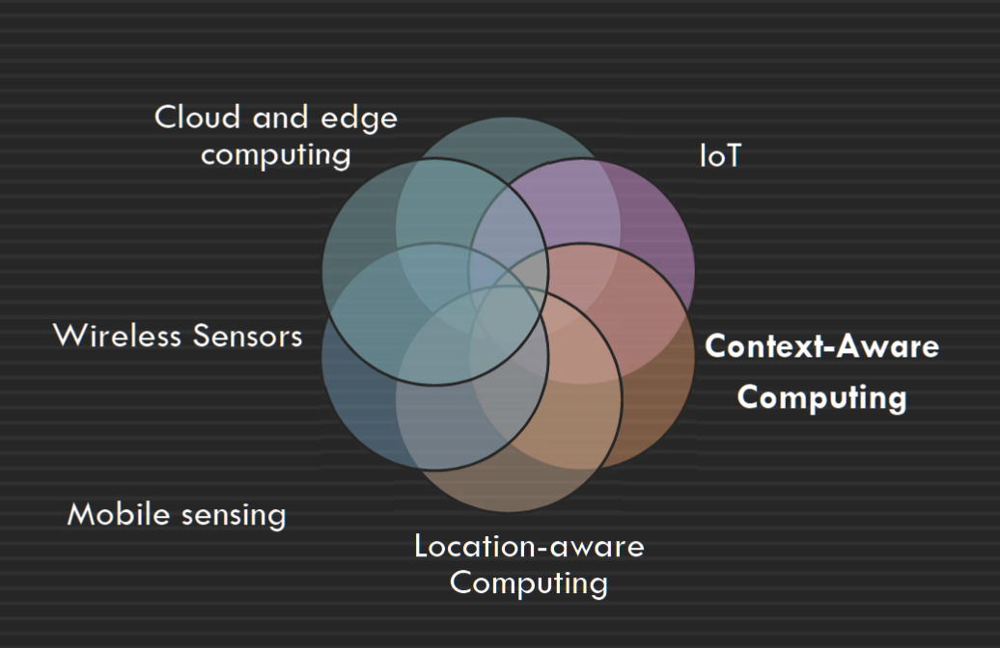
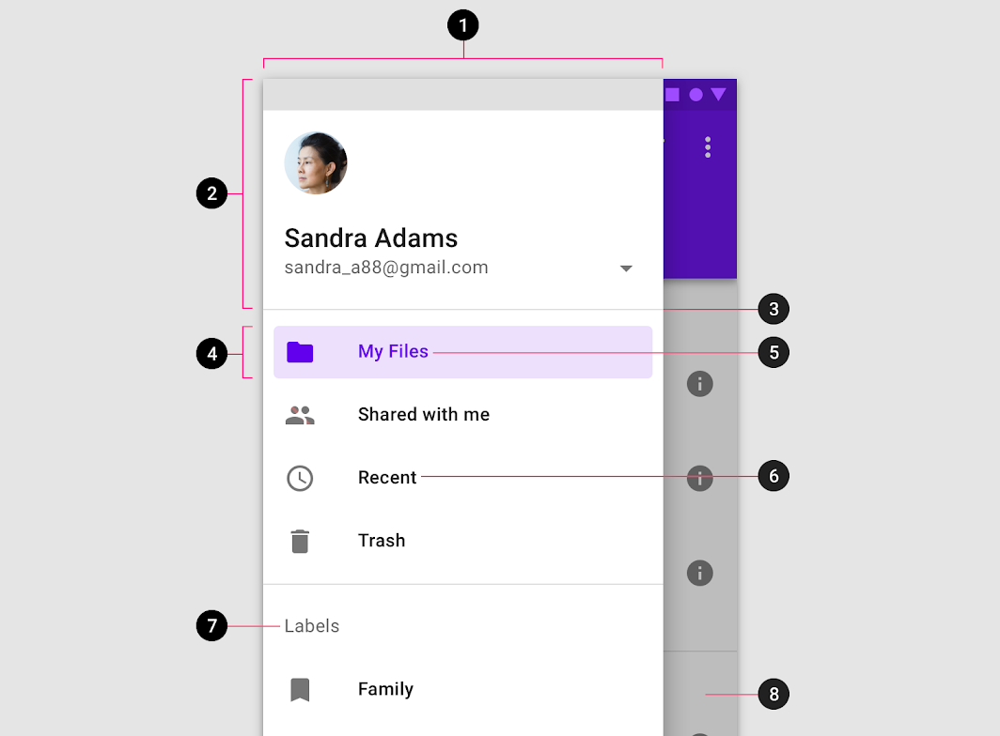
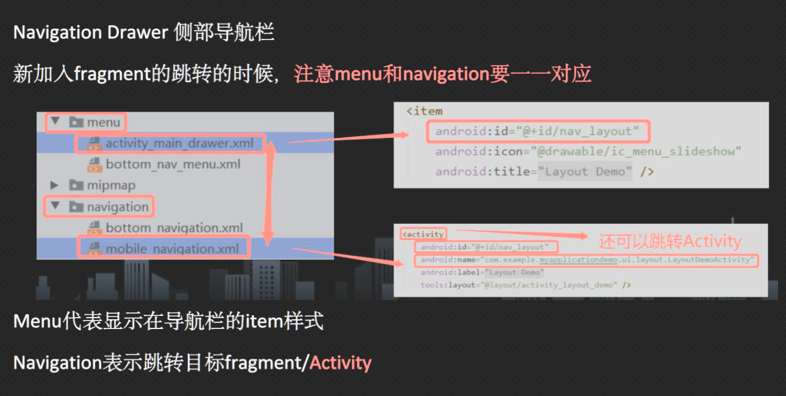

Create time: 2023-02-24  Last update: 2023-02-24

# How to use the FIT study Note document
1. download the [markdown file repository](https://github.com/GreenH47/mynote) and  navigate to the `docs` folder
2. view all the markdown files via [Obsidian vault](https://help.obsidian.md/How+to/Working+with+multiple+vaults) that can show the linked section in the note document    
3. You may find some extra material or program template  repository in the Course Brief introduction for the FIT Note markdown Document (some course don't have )

4. you can view [the web page](https://greenh47.github.io/mynote/) which transfer from MD file online but will lose the extra information or wrong    markdown display

  
# FIT5046 - Mobile and distributed computing systems Course Brief introduction

## outline
  
  

This unit focuses on the most current and key topics in mobile and distributed computing. We will mainly focus on learning key concepts of mobile computing using Android, and then look at ubiquitous and context-aware computing, IoT, wireless sensors, and location-aware computing. While we will discuss these topics in the lectures, you will learn practically in the labs how to create and develop a mobile, distributed Android app. Each semester we develop a real world and useful mobile app for Android platforms.

[FIT5046 - Mobile and distributed computing systems](https://handbook.monash.edu/2023/units/FIT5046?year=2023) done for the year 2023. (Semester 1)  
## software and Programming Language for the unit
+ Android Studio Electric Eel, 2022.1.1 (stable version) SDK 13  API 33  [Android Studio Electric Eel | 2022 年 1 月 1 日  |  Android 开发者  |  Android Developers](https://developer.android.com/studio/releases)  
+  Java The original language  
+   Kotlin  We learn the Kotlin code by comparing to Java and only  limited to the lecture topics
# Final exam review
## week 1 
[230521_serverless,microservices,RESTFUL](../chat/230521_serverless,microservices,RESTFUL.md) 
### What is the (distributed) computing paradigms
A computing paradigm where a number of <mark style="background: #ff0000;">autonomous独立 entities </mark>(most likely heterogeneous异质) which are geographically distributed can<mark style="background: #3CB371;"> communicate and exchange messages</mark> through a <mark style="background: #0000CD;">computer network</mark> to achieve certain related tasks (common goals)一种计算范式，其中许多地理分布的自治实体（很可能是异构的）可以通过计算机网络进行通信和交换消息以实现某些相关任务（共同目标）

### What are the main types of distributed computing paradigms
+ Vertical distribution: placing logically different layers/components on different machines  Each layer on one single machine  垂直分布：将逻辑上不同的层/组件放置在不同的机器上  每一层都在一台机器上
+  Horizontal distribution: a single logical layer/component is distributed across multiple machines to improve scalability E.g. distributing a database on multiple machines (distributed database)水平分布：单个逻辑层/组件分布在多台机器上以提高可伸缩性例如在多台机器上分布数据库（分布式数据库）

### Mobile and Distributed Computing
+ it is a class of distributed computing systems  It integrates mobile and wireless devices into distributed systems 它是一类分布式计算系统它将移动和无线设备集成到分布式系统中
+ Mobile computing is associated with mobility of hardware, users, data, applications and network in computer applications 移动计算与计算机应用程序中硬件、用户、数据、应用程序和网络的移动性相关联

### What are the main architectures/models for developing mobile and distributed systems?
+ The client/server model Server processes offer services to clients processes Usually there is a data storage at the backend 客户端/服务器模型  服务器进程为客户端进程提供服务  通常在后端有一个数据存储 
+ Peer-to-peer Each process logically equal to each other Data flows between the processes 点对点  每个进程在逻辑上彼此相等  数据在进程之间流动

### Distributed Computing and SOA (Service-Oriented Architecture)
Service-oriented architecture was introduced as a paradigm for distributed systems面向服务的体系结构被引入作为分布式系统的范例  
+ Application functionalities (software components) are provided as services (independent modules) 应用程序功能（软件组件）作为服务（独立模块）提供  
+ Exposed to public (clients) using a standard interface protocol, aka an application programming interface (API) 使用标准接口协议（又名应用程序编程接口 (API)）向公众（客户）公开
+ Message based interactions through these interfaces 通过这些接口进行基于消息的交互
+ Reuse of services and composition of services 服务的重用和服务的组合
+ Interoperability to support different platforms 支持不同平台的互操作性

### What is a web service?
“A Web service is a piece of software/code designed to support interoperable machine-to-machine interaction over a network” (W3C) “Web 服务是一段软件/代码，旨在支持网络上可互操作的机器对机器交互”（W3C）

### Why are web services important in developing distributed and mobile systems
Web services provide a standard interface to make the functionalities available to the public (clients) Web services provide access to business logic, data and processes or other services Web 服务提供了一个标准接口，使功能对公众（客户）可用  Web 服务提供对业务逻辑、数据和流程或其他服务的访问

### REST (REpresentational State Transfer)
+  RESTful web service were emerged based on the REST architecture’s concept RESTful web服务是基于REST架构的概念出现的  
+ REST stands for Representational State Transfer. It is a software architectural style that uses a set of constraints and principles for designing and developing web services. REST is not a standard, but an approach to building distributed systems that use HTTP for communication. REST 代表 具象状态转移。它是一种软件架构风格，使用一组约束和原则来设计和开发 Web 服务。REST不是一个标准，而是一种构建使用HTTP进行通信的分布式系统的方法 
+ The RESTful design approach simplifies the process of designing and developing web applications by focusing on resources and their representations, rather than on the operations that can be performed on the resources. This allows for more flexibility and extensibility in web service development. RESTful 设计方法通过关注资源及其表示形式而不是可以对资源执行的操作来简化设计和开发 Web 应用程序的过程。这允许在 Web 服务开发中实现更大的灵活性和可扩展性

### What are the architectural constraints of REST
1.  Client-server: Separation of concerns between the client and server, allowing for independent development and evolution.  
    客户端-服务器：客户端和服务器之间的关注点分离，允许独立开发和演变。
    
2.  Statelessness: Communication between the client and server is done in a stateless manner, where each request carries the necessary information required to process that request. The server does not store any client context.  
    无状态：客户端和服务器之间的通信以无状态方式完成，其中每个请求都携带处理该请求所需的必要信息。服务器不存储任何客户端上下文。
    
3.  Cacheability: Responses from server-side should be cacheable to improve network efficiency, and reducing server-side workload when a cached response can be used.  
    可缓存性：来自服务器端的响应应该是可缓存的，以提高网络效率，并在可以使用缓存的响应时减少服务器端工作负载。
    
4.  Layered System: System decomposition into a set of connected layers, each of which has a specific role and communicates only with the immediately adjacent layer(s).  
    分层系统：系统分解为一组连接层，每个层都有特定的角色，并且仅与紧邻的层通信。
    
5.  Code on demand (optional): The ability to transfer executable code from the server to the client as a part of the response payload.  
    按需代码（可选）：将可执行代码作为响应有效负载的一部分从服务器传输到客户端的功能。
    
6.  Uniform Interface: Use of a shared and well-defined interface for accessing resources, defined by the following four sub-constraints:  
    统一接口：使用共享且定义明确的接口来访问资源，


###   What are the interface constraints of REST
1.  Identification of resources: Each resource in the system must be identified by a unique identifier such as a URI (Uniform Resource Identifier). Resources can be physical objects, digital documents, or abstract concepts, and each resource represents a specific entity or set of entities.  
    资源标识：系统中的每个资源必须由唯一标识符标识，例如 URI（统一资源标识符）。资源可以是物理对象、数字文档或抽象概念，每个资源表示一个特定的实体或一组实体。
    
2.  Manipulation of resources through representations: Each resource in the system must have one or more representations that describe the current state of the resource. Representations can be in XML, JSON, HTML, or other formats, and must include all metadata needed to perform the desired operation on the resource.  
    通过表示形式操作资源：系统中的每个资源都必须具有一个或多个描述资源当前状态的表示形式。表示形式可以是 XML、JSON、HTML 或其他格式，并且必须包含对资源执行所需操作所需的所有元数据。
    
3.  Self-descriptive messages: Messages that are sent between the client and server must include all information necessary to process the message. This includes information about the resource being accessed, the desired operation to be performed, relevant media types, and authentication and authorization information.  
    自描述性消息：在客户端和服务器之间发送的消息必须包含处理消息所需的所有信息。这包括有关正在访问的资源、要执行的所需操作、相关媒体类型以及身份验证和授权信息的信息。
    
4.  Hypermedia as the Engine of Application State (HATEOAS): Clients must navigate the application state by following hyperlinks embedded in the representations returned by the server. This allows the server to dynamically change the application state by returning different representations and hyperlinks based on the client request.  
    超媒体作为应用程序状态引擎 （HATEOAS）：客户端必须通过遵循服务器返回的表示形式中嵌入的超链接来导航应用程序状态。这允许服务器通过基于客户端请求返回不同的表示形式和超链接来动态更改应用程序状态。
### JSON
+ JSON stands for JavaScript Object Notation  
+ JSON is lightweight text-data interchange format  
+ JSON is "self-describing" and easy to understand

## Week 2 Android 
### mobile applications types
1.  Native apps: These are applications developed for a specific platform, such as iOS or Android, and are installed directly on a device. Native apps are built using the programming language and development tools of the platform, and they can leverage the features and capabilities of the device, such as the camera, GPS, and sensors.  
    本机应用：这些是为特定平台（如 iOS 或 Android）开发的应用程序，直接安装在设备上。本机应用程序是使用平台的编程语言和开发工具构建的，它们可以利用设备的特性和功能，例如相机、GPS 和传感器。
    
2.  Web apps: These are applications that are accessed through a web browser over the internet. Web apps are typically built using HTML, CSS, and JavaScript, and they can be accessed from any device with an internet connection. Web apps can be responsive, meaning they can adapt to various screen sizes, and they can be updated instantly without the need for users to download a new version.  
    Web 应用程序：这些是通过互联网上的 Web 浏览器访问的应用程序。Web应用程序通常使用HTML，CSS和JavaScript构建，并且可以从任何具有互联网连接的设备访问它们。Web 应用程序可以响应，这意味着它们可以适应各种屏幕尺寸，并且可以立即更新，而无需用户下载新版本。
    
3.  Hybrid apps: These are applications that are developed using web technologies (like HTML, CSS, and JavaScript) but are packaged and distributed as native apps. Hybrid apps are built using platform-specific tools, like Apache Cordova, and they can access device features like native apps.  
    混合应用：这些是使用 Web 技术（如 HTML、CSS 和 JavaScript）开发的应用程序，但作为本机应用打包和分发。混合应用是使用特定于平台的工具（如 Apache Cordova）构建的，它们可以访问本机应用等设备功能。
    
4.  Progressive Web Apps (PWAs): These are web applications that use modern web technologies to provide a native app-like experience to users. PWAs can be installed directly on a device's home screen and offer offline access, push notifications, and other features typically associated with native apps. PWAs are built using a combination of web technologies like HTML, CSS, and JavaScript and service workers, which allow for offline caching and background processing capabilities.  
    渐进式 Web 应用 （PWA）：这些是使用现代 Web 技术为用户提供类似本机应用的体验的 Web 应用程序。PWA 可以直接安装在设备的主屏幕上，并提供脱机访问、推送通知和通常与本机应用关联的其他功能。 PWA 是使用 HTML、CSS 和 JavaScript 等 Web 技术以及服务工作线程的组合构建的，这些技术允许脱机缓存和后台处理功能。


### Development Environment
+ The Android emulator simulates Android devices (phones, tablets, Android  Wear) Android 模拟器模拟 Android 设备
+ Gradle-based build system to configure and manage building projects Flexible and easy to include libraries (local and remote) 基于 Gradle 的构建系统，用于配置和管理构建项目 灵活且易于包含库（本地和远程）
### Android Jetpack
+ Jetpack includes a large group of libraries for developing high quality apps androidx.* contains the Android Jetpack libraries  Jetpack 包含大量用于开发高质量应用程序的库  androidx.* 包含 Android Jetpack 库
+ All Jetpack components are available in your Android application through including the Google Maven repository 通过包含 Google Maven 存储库，所有 Jetpack 组件都可以在您的 Android 应用程序中使用  
### architecture of android application
 


### Layouts and Views
A layout resource (e.g. activity_main.xml) defines the whole architecture of the UI for an activity or a fragment A layout defines the structure for a user interface of the app, e.g. LinearLayout, ConstraintLayout, or RelativeLayout 布局资源（例如 activity_main.xml）为活动或片段定义 UI 的整个架构  布局定义应用程序用户界面的结构，例如LinearLayout、ConstraintLayout 或 RelativeLayout

### important files in Android and their purpose


### Activity Lifecycle

[The activity lifecycle  |  Android Developers](https://developer.android.com/guide/components/activities/activity-lifecycle)  
1. `onCreate()` Initialize the activity components e.g. creating  views, or populating lists with data
2. `OnStart()` the activity becomes visible
3. `onResume()` The activity is ready to accept the user input  At the top of the activity stack (in the foreground)
4. `onPause()` The activity loses focus, and will enter the  stopped or resumed state
5. `onStop()` The activity is no longer visible
6. `onDestroy()` The activity is about to be terminated

### spinner


## week 3
### how events can be handled in Android
Event 
Events are created from interactions with view objects like clicking a button  
Event Listeners can capture user interactions with UI  
User（人）和Device（手机）的所有交互动作都叫Event 点击，滑动屏幕，放大/缩小，按音量键等  

event listener   
+ 在代码上抓取点击事件 -> 用代码编辑点击后边代表的逻辑  
+ 点击button 上传/跳转，点击电源按钮关机   
+ 使用回掉方法callBack（）来实现逻辑（回掉：满足一定条件返回，调用的 method
event listener is an interface in the View class  contains a single callback method Callback methods will be called when the View to which the listener  has been registered is triggered by user interaction with the UI item  `View.OnClickListene` is an event listener and its callback method  is onClick()  

### View binding
```java
private ActivityDashboardBinding binding;
binding = ActivityMainBinding.inflate(getLayoutInflater());
View view = binding.getRoot();  
setContentView(view);  
binding.editMessage.setText("");
```
better than `Button dashboardButton = view.findViewById(R.id.dashboardButton);`   
1.  creates direct references to views 
2. The fields in each binding class have types matching the views, so it avoids the class cast exception
### Multiple Activities
+ Android applications can include more than one activity  
+ When multiple activities are used, the first activity (MainActivity) starts the second activity using an Intent  
+ An Intent is mainly used for launching activities, services or broadcasts  
+ `Intent intent = new Intent(MainActivity.this, SecondActivity.class); startActivity(intent);`
### Using an Intent to Pass&get data
+ You can add extra data using the putExtra() method that requires two parameters (the key name and its value)  
+ `intent.putExtra(String name, String value)`  
+ get data from the intent in the second activity, first you need to use getIntent() `Intent intent=getIntent();`  
+ Then from the intent, you can retrieve the data that it is carrying by using a right method that matches the type of data `String msg = intent.getStringExtra(“message”);`  

### RecyclerView

1. Add RecyclerView AndroidX library to the build.gradle file  
2. In the activity_main.xml, add a RecyclerView widget  
3. Create a custom XML layout file with the views to be displayed in each row of the RecyclerView using androidx.cardview.widget.CardView  
4. Define a model Java class to deal with the data  
5. Create an adapter class that subclasses RecyclerView.Adapter  
6. Implement a nested, static ViewHolder class inside the Adapter class  

## Week4
### Fragment  


### LiveData and ViewModel
+ an instance of LiveData (that holds the data) is usually created within the ViewModel class and can be accessed via a getter method LiveData 的实例（保存数据）通常在 ViewModel 类中创建，可以通过 getter 方法访问  
+ LiveData allows observers in app components such as an activity or a fragment to observe updates, and get notified of change LiveData 允许应用程序组件（例如活动或片段）中的观察者观察更新，并获得更改通知  
+   
+ ViewModel Persistent UI state Access to business logic

## Week 5 
### Three types of navigation suggested in Material Design  
1. Lateral navigation  
2. Forward navigation  
3. Reverse navigation

### Navigation Drawer
1. Permanently visible drawer
2. Dismissible drawer
3. Bottom drawer 

### What is Navigation drawer in Android APP?
The navigation drawer is a Ul panel that allows navigation between top level destinations through displaying a navigation menu


### Navigation Component
1. Navigation graph This XML file contains all the information about  the destinations and actions  
2. NavHost that provides an empty container for navigation to occur  
3. NavigationUl class is used with the Navigation component  
4. NavController  is responsible for managing app navigation and can be retrieved from the instance of NavHost by calling getNavController()

## Week 6
### Android Main UI Thread and 2 rules
When an Android application is launched, the system creates a 'main' thread, aka the 'UI' thread  
The main/Ul thread is the single thread of execution for your application  
Two rules to Android's single thread model:  
Rule 1: Do not block the main/Ul thread  
Rule 2: Do not access the Android IJI toolkit from outside the Ul thread (from a worker thread)  

### Android Room persistence library and its components
+ SQLite provides a relational database management system for permanent storage of the structured data  
+ To reduce the effort to create and manage the SQLite database, Room was introduced Room provides an abstraction layer over SQLite that enables more robust database access  
+ Room Persistent Library consists of <mark style="background: #ff0000;">Database(</mark>SQLite database), <mark style="background: #3CB371;">Entities: </mark>represent tables within the database, <mark style="background: #D2691E;">DAO (Data Access Object)</mark> classes query methods that offer abstract access to the database  
+   
### Entity Class  
  
  
### DAO (Data Access Object)
A DAO includes methods that offer abstract access to the Database By accessing a database using a DAO class instead of direct queries, we can separate different components of the database DAO 包括提供对数据库的抽象访问的方法  通过使用 DAO 类而不是直接查询访问数据库，我们可以分离数据库的不同组件  


Examples of DAO methods: @Insert @Update @Delete @Query  

### Room, LiveData and ViewModel


## Week 7
### Retrofit
1. prepare the http requests, we can define the base URL and add other parameters to the URL  
2. interact with public APIs by sending http @GET, @POST, @PUT, @DELETE, as well as PATCH, OPTIONS and HEAD requests to remote servers and receive http response.  
3. get json response

### Retrofit Components  
+ Retrofit Model Classes (created to provide a mapping to the structure of the JSON’s response body) 
+ Retrofit Interface (turns the http API into a Java interface) 
+ Retrofit Client (creating the Retrofit instance)

## week 8
### Ubiquitous computing and Internet of Things (IoT) and how  they are related  
  
### What is Context & Context-Awareness
Context is any useful information related to an entity such as a user, a device, a car, a building, or its surrounding environment. Contextual information can be sensed, derived, reasoned, computed, calculated or explicitly entered by users上下文是与实体（例如用户、设备、汽车、建筑物或其周围环境）相关的任何有用信息。  上下文信息可以被用户感知、导出、推理、计算、计算或明确输入  
A context-aware application is aware of the current context such as the location and the physical environment A context-aware application uses contextual information to  adapt its behaviour or operations accordingly 上下文感知应用程序知道当前上下文，例如位置和物理环境  上下文感知应用程序使用上下文信息来相应地调整其行为或操作  


# mock exam
### context-aware
Question A2. Consider a context-aware data projector in a smart lecture room in a university that is operated (turned on and off) automatically based on occurring situations.  
1. Name three types of context that must be collected for this system.  
2. Based on aggregation of the above-mentioned three contextual information, name three 'situations' that can be inferred.  
3. Explain the difference between a 'data', 'context' and 'situation' using an example. 

a) Context  
i. Input source (input data streams)  
ii. Obstacles before projection (people standing before projection)  
iii. Timer to record no last operation time  

b) Situation  
1. Operating : Detect input source (a), no obstacles before projections(b), less than  certain period which timer recording no operation time (c)  
2. ii. Light sleep: Detect input source (a), there is some obstacles before projections(b),  less than certain period which timer recording no operation time (c)   
3. iii. Deep sleep: Detect no input source (a) or/and longer than certain period which  timer recording no operation time  

c)  
1. Data : Detail of input source, which part is obstacle, time in timer; data is the detail of context which can be calculated   
2. ii. Context: Lots of input data consist of input source, is a set of data  
3. iii. Situation: high-level description information / context. Two of more context  consist of situation,e.g No input source and longer than certain period no actions  means deep sleep situation

### network iot
Question A3. Question A9. Directed diffusion is a routing protocol in WSN that is attribute-value based, and consists of three steps: interest propagation, gradient establishment, and path reinforcement.  

a) Describe each step mentioned above for a military vehicle detection monitoring application using a network of wireless motion sensors deployed on a road in a war zone area.  
1. Interest propagation : An interest will be translated into a query using attribute   value pairs; any node receiving the interest propagates the interest further to  neighbors   
2.  Gradient Establishment: node establish a gradient(i.e. reply link) towards the  neighbour from which the interest was received  
3. iii. Path reinforcement: There might be several paths from the source to the sink, the sensor network reinforces one of the gradient paths (e.g. based on the shortest path)    
b) Provide two schemes that can be used for path reinforcement.     
1. Energy-efficient routing: Calculate the sum of energy cost for each path, select the minimum energy route   
2. . Multipath Routing: Calculate the sum of the number of sensors for each path, select the minimum hop route

### fragment/activity pass data
Q1. 跨 activity 和 fragment 间传递数据的方式有几种？  
Activity: Shared preference, intent , intent + bundle   
Fragment: Shared preference, 传递到 fragment 的 structure 里  

如果需要传递一个 instance of object 需要怎么做，为什么？  
1. 需要被传递的使 object 所在的 class extends parcel-able  
2. 将 serialize/parcel-able object 放入 bundle 中  
3. 把 bundle 放入 intent 中  
4. 把 intent 方式 startActivity（）  
5. 在 avtivityB/目标 activity 通过 getIntent 拿出 bundle  
6. 在 bundle 中拿出 object （这里会 de-serialize）

### Q2. 网络请求(数据库 CRUD，大数据运算 - 耗时操作)可以运行在 UI thread 中么？说明原 因 / 有什么方式解决
不可以。Blocking 阻塞，stack 栈，interaction 交互    
Http request 是耗时操作，在 UI thread 中使用耗时操作违背了 android UI thread 的 rule 1.  
使用 post： 将 http request 的操作放在 retrofit 中使用（自动新建 thread）  
使用 coroutine， invoke time consuming task in the suspend function and call it in the  ViewModel scope or coroutine.IO scope  

### Q3. 解释下图中 replace 的两个参数分别代表什么？R.id.container 使用时有什么需要注意的？
  
第一个参数： container，想替换的 viewgroup layout，只能是 viewgroup，一般我们使用空白的 framelayout（或 navHostFragment） 
第二个参数：是替换进来的新的 fragment （layout），一定是一个 instance of fragment  

### Q4. 简述 startActivityForResult(), setResult(),onActivityResult()的使用逻辑  
有两个 activity A and activity B  
1. startActivityForResult(): 在 A 中 call 这个 method to start activity B   
2. 在 B 中调用 setResult()来放入 B finish() 的结果   
3. A 中 call back method onActivityResult()： A 中此方法会显示 B 放入 setResult（）的  信息  

### Q5. 简述 Android 下几种布局，并介绍优缺点  
+ Linearlayout：线性布局，可以横向（horizontal）或者纵向（vertical）依次显示 view，view 不会相互重跌，搭配 scroll layout 可以实现屏幕滚动效果  
+ Framelayout：帧布局，可以有层次的上下排列 view，实现覆盖效果，透明，半透明效果    
+ ConstraintLayout：约束性布局，可以手动可见的在 blue screen 上拖动 view，方便 developer 调整布局；缺点是耗时，重复性劳动时不可节省时间

### Q6. 简述 activity/fragment 中可以被用户所见的生命周期和可以和用户交互的生命周期  
+ activity 所见 onstart -> onresume->onpause->onstop   
+ Interaction： onresume -> onpause  

### Q7*. ArrayAdapter(Recycler view) 于 simpleAdapter(spinner)的区别  
+ ArrayAdapter 显示文本，适用于 hashmap  
+ SimpleAdapter 会自定义数据结构和 view

### Q8. 简述多线程在 Android 设备上的必要性  
1. UI thread offer view interaction with users, but cannot process time-consuming task  
2. Need other thread to process time-consuming task e.g. Retrofit, access(CRUD) room

### Q9. 简述创建 activity 的过程（创建 room，retrofit，navigation drawer，list view， recycling view， time piker，date picker）  
1. 创建 activity class 并 extends AppCompatActivity, override onCreate() method  
2. 创建 xml 格式的 layout 文件，并在 onCreate 的 setContentView 中绑定(set binding)  
3. 在 manifest 中注册 activity(*******) (Register / Exploration / intent-filter )

### Q10. 简述 Room/Retrofit 为什么要搭配 livedata 使用/为什么要使用 livedata/livedata 使用场景/为什么使用 MVVN  
1. 访问 Room 时一个耗时操作，其结果不能直接运行在 ui thread 上  
2. Livedate 通过 viewmodel 可以在 fragment or activity observe livedate 的 change（通过 onChange  （）call back method define logic after response ），以便于 UI 层（fragment/activity）实时的拿到搜索 room 的结果并体现在 UI view 上

### Q11. 简述 android 端访问 weather/web api 返回数据的过程  
1. Create retrofit client object  
2. android 使用 retrofit 访问 url path，并传递对应参数 param  
3. API 根据路径和参数，返回 JSON object  
4. Decrypt/interpret the json data into java object

### Q16. 在 UI design 的时候，简述 Skeuomorphic design， flat design 和 material design 的区别  
+ 拟人化对新用户很友好，但是设计费时费力，现在基本不用  
+ 平面设计，简单，快捷，有代表性，但是内容单薄，不好区分点击的动态效果，多用于  web  
+ Material design，多端统一使用相同的素材库，减少用户在跨端浏览时候的学习时间，  设计更有特点

### Q17. 简述实现 content-aware 的自动扶梯的三个 situation，并说明其中的 context 和 data 都 是什么  
+ Normal speed operation：正常运行  
+ Low speed operation：白天没人的时候，减慢扶梯的速度  
+ No operation：夜间不运行
+ Context：if people stand / timer to record last user / Define weak time  
+ Data : people weight/ last user using time / 8am, detail weak time  
+ How to use context to consist situation?

### Q18. 要实现车辆违章电子抓拍系统全国联网，简述实现方案  
1. Sensor/camera/monitor/CCTV in required road  
2. Adopt edge computing to recognize the 违法行为和违法车牌（使用边缘计算是方便近距离识别出违法的结果，减少传输的损耗并且减少安全隐患）  
3. Transport the 违法车牌和违法信息到中央 cloud server 做汇总（each 车的违法信息需要在全国范围内做统计）

### Q19. 使用 flat multi-hop architecture 实现了智慧农业种植果园，现果园扩大，sink 附近的 节点达到了传输瓶颈，简述几种解决方案  
1. Upgrade the sensor or sink  
2. Upgrade architecture to cluster-based architecture (要加解释)

### Q20. 一室外野生公园想上线自动导游系统，请你做一下设计方案  
1. 部署服务器，把所有讲解视频上传到服务器上  
2. 使用 GPS 定位 user 的大致位置，然后给终端（手机）推送现在附近景点的讲解视频，使终端缓存 data  
3. 每个景点附近安装 sensor 来发送信号给终端，决定播放哪个讲解视频

### Q21. 卫星（GPS）如何在地球上定位位置 如何计算地面和卫星的距离

### Code Question 1
```xml
http://XXXXX.com/student/1  
<student>  
	<stuid>1<stuid>  
	<stuname>Tom<stuname>  
</student>
```
Qa. Based on the figure above, identify and name the resource and the representation  
	A:Resource name is student, represent the id and name of the resource   

b. Rest stands for ‘Representational state transfer’. Based on the example provided in the  figure, explain how the state transfer can happen.  
	B:The figure is XML format response that RESTful API response, when client invoke this API  URL(http://XXXXX.com/student/1), client can receive the student information including student  id is 1 and student name is Tom. In this way, the state transferred from server side to client  side

### Code Question 2
```kotlin
private var vehicleList: MutableLiveData<VehicteList> = MutableLiveData()
fun LiveData<VehicteList> {
	return vehicleList= MutableLiveData()
```
a. Why is MutableLiveData used here instead of LiveData?  
+ A:The difference between MutableLiveData and liveData type is MutableLiveData can be mutated  but LiveData cannot be mutated its value.And MutableLiveData is inheritance from livedata, so we can cast directly from MutableLiveData to liveData in getMethod.  So the MutableLiveData here is because we need set/mutator method to assign or change value  to field  

b. Why does we use LiveData in getText?  
+ B: getText() method is accessor method, no need to mutate the value, so livedata type is enough.

### code 3
 
What is the use of the companion object in the class?Explain  
	companion object represent the class level feature, like class method and class variable  
	1. which can be accessed directly from class name.  
	2. All the instance of this class should share the same state in this companion object  
	3. Just like static in Java  
	4. This is to ensure only one instance of DB in this app, to avoid concurrent CRUD action conflict.  (Singleton pattern)

What is the use of fallbackToDestructiveMigration()  
	when schema or db version changed, clear data and recreate a new db based new schema

### Code Question 4:  
a) What is the role of the ViewHolder in a RecyclerView?  
	A: A ViewHolder describes an item view and metadata about its place within the  RecyclerView.  
b) What is the purpose of the onBindViewHolder() method in RecyclerView?  
	B: Bind the metadata in list and item view in the recycler view


### code 5
```json
buildscript {  
    repositories {  
        // Make sure that you have the following two repositories  
        google()  // Google's Maven repository  
        mavenCentral()  // Maven Central repository  
    }  
    dependencies {  
        classpath 'com.android.tools.build:gradle:7.4.2'  
        // Add the dependency for the Google services Gradle plugin  
        classpath 'com.google.gms:google-services:4.3.15'  
    }  
}
allprojects{
	repositories {  
        // Make sure that you have the following two repositories  
        google()  // Google's Maven repository  
        mavenCentral()  // Maven Central repository  
    }  
}
```
a) Explain the differences of two repositories under the buildscript and allprojects blocks
	The "buildscript" configuration section is for gradle itself (i.e. changes to how gradle is able  to perform the build). So this section will usually include the Android Gradle plugin.  The "allprojects" section is for the modules being built by Gradle

b) When do we include a repository in the allprojects block? Provide an example  
	When use local maven or import other local repository，we need to declare the repository in allprojects

## other question
### in the settings.gradle file. what is the usage of repository sector? and what is the difference between google() maven{hrttp/xxxx} in repository sector? setting 里 repository 的用处，以及 repository 里，google()与 maven{hrttp/xxxx}这两不同之处  
+ Regarding the repository sector, this is where you can define the repositories that the Gradle build system should search for dependencies. 关于存储库扇区，您可以在此处定义 Gradle 构建系统应搜索依赖项的存储库。
+ One of the most common repositories used is `google()`, which is a shortcut for including Google's Maven repository in your project. 最常用的存储库之一是 `google()` ，这是在项目中包含 Google 的 Maven 存储库的快捷方式。  
+ The `maven { url "http/xxxx" }` is also a repository where you can specify a custom Maven repository URL. This is useful if you need to include a library or dependency that is not available in the default repositories.  `maven { url "http/xxxx" }` 也是一个存储库，您可以在其中指定自定义 Maven 存储库 URL。如果需要包含默认存储库中不可用的库或依赖项，这将非常有用。 
+ The main difference between the two is where they point to. `google()` specifically points to Google's repository, while `maven` can point to any custom repository that you specify the URL for.  两者之间的主要区别在于它们指向的位置。 `google()` 专门指向 Google 的存储库，而 `maven` 可以指向您为其指定网址的任何自定义存储库。


### indoor position 的过程  

### the workflow of asLiveData asLiveData()的功能(Flow)  
When you use `asLiveData()` on a `Flow`, it converts the `Flow` to a `LiveData` object, which can be observed by components such as activities, fragments, and services.  
当您在 `Flow` 上使用 `asLiveData()` 时，它会将 `Flow` 转换为 `LiveData` 对象，该对象可以通过活动、片段和服务等组件进行观察。

Here is a basic workflow of `asLiveData()`:  
以下是 `asLiveData()` 的基本工作流：

1. Create a `Flow` object that emits a stream of data.  
    创建发出数据流的 `Flow` 对象。
2. Call the `asLiveData()` function on the `Flow`. This converts the `Flow` to a `LiveData` object.  
    在 `Flow` 上调用 `asLiveData()` 函数。这会将 `Flow` 转换为 `LiveData` 对象。
3. Observe the `LiveData` object in a UI component, such as an activity or fragment.  
    观察 UI 组件（如活动或片段）中的 `LiveData` 对象。
4. When data is emitted by the `Flow`, it will be delivered to the UI component through the `LiveData` object.  
    当数据由 `Flow` 发出时，它将通过 `LiveData` 对象传递到 UI 组件。

In addition to converting a `Flow` to a `LiveData` object, `asLiveData()` also automatically manages any subscriptions to the `Flow`. This means that when the UI component is destroyed (such as when an activity is destroyed), any subscriptions to the `Flow` are automatically cancelled.  
除了将 `Flow` 转换为 `LiveData` 对象外， `asLiveData()` 还会自动管理 `Flow` 的任何订阅。这意味着，当 UI 组件被销毁时（例如，当活动被销毁时），对 `Flow` 的任何订阅都会自动取消。

Overall, `asLiveData()` provides a streamlined way to observe `Flow`s and manage subscriptions in Android applications.  
总体而言， `asLiveData()` 提供了一种简化的方式来观察 `Flow` 和管理 Android 应用程序中的订阅。

### 有一题还挺有意思。先是让我们分析一下下面场景，更适合用哪种 multi hop，然后第 2 题，问我们设备和设备之间应该用什么通讯技术设备和远程控制终端，应该用什么通信 技术，其实一个用 zigbee。一个用 wimax  

### what is the usage of interface in retrofit? what is the usage of model in retrofit? retrofit interface 是用来干嘛的，以及 retrofit 的 model 是用来干嘛的  
Interfaces are used to define the structure of the API requests that will be made by your application. In Retrofit, you define an interface that specifies the HTTP request method, URL endpoint, and any parameters necessary for the request. When you make a call to the interface method from your application code, Retrofit automatically generates code to handle the network request and return the response. This makes it easy to implement RESTful API calls in your Android application with minimal boilerplate code.  
接口用于定义应用程序将发出的 API 请求的结构。在 Retrofit 中，定义一个接口，用于指定 HTTP 请求方法、URL 端点以及请求所需的任何参数。从应用程序代码调用接口方法时，Retrofit 会自动生成代码以处理网络请求并返回响应。这使得使用最少的样板代码在Android应用程序中实现RESTful API调用变得容易。
```java
public interface MyApi {
    @GET("users/{user_id}")
    Call<User> getUser(@Path("user_id") int userId);
}
```
Models, on the other hand, are used to represent the structure and format of the incoming JSON response from the API endpoint. When you define a model in Retrofit, you're telling Retrofit the structure of the JSON response and how to parse it into Java object. Retrofit uses the Gson library to automatically serialize and deserialize JSON responses into Java objects.  
另一方面，模型用于表示来自 API 终结点的传入 JSON 响应的结构和格式。当您在 Retrofit 中定义模型时，您告诉 Retrofit JSON 响应的结构以及如何将其解析为 Java 对象。Retrofit 使用 Gson 库自动将 JSON 响应序列化和反序列化为 Java 对象。


### on start activity for resulting。描述 star activities for result 和 start activity 的区别，以及在第二个 activity 之中，有哪两个函数是必须写写进去的  
`startActivity()` and `startActivityForResult()` are both methods in the Android `Context` class used to start a new activity. The main difference is that `startActivity()` is used to start a new activity and not expect any result back, while `startActivityForResult()` is used to start a new activity and expect a result back from this new activity.  
`startActivity()` 和 `startActivityForResult()` 都是 Android `Context` 类中用于启动新活动的方法。主要区别在于 `startActivity()` 用于启动新活动，并且不期望返回任何结果，而 `startActivityForResult()` 用于启动新活动并期望从此新活动返回结果。
`startActivity()` - This method simply starts a new activity. When you call this method, the newly launched activity starts running, and the calling activity waits in the background. Once the new activity is finished, the calling activity resumes from the point where it left off. You don't get any information back from the new activity after it finishes.  
`startActivity()` - 此方法只是启动一个新活动。调用此方法时，新启动的活动开始运行，调用活动在后台等待。新活动完成后，调用活动将从中断的位置继续。新活动完成后，不会从新活动获取任何信息。
```java
Intent intent = new Intent(this, MyActivity.class);
startActivity(intent);
```

`startActivityForResult()` - This method is similar to `startActivity()`, but it allows you to start a new activity and receive a result back from it. This is useful when you need to get some information from the user in the new activity, and then pass this information back to the calling activity.  
`startActivityForResult()` - 此方法类似于 `startActivity()` ，但它允许您启动新活动并从中接收结果。当您需要从新活动中的用户获取一些信息，然后将此信息传递回调用活动时，这很有用。
```java
Intent resultIntent = new Intent();
resultIntent.putExtra("key", value);
setResult(RESULT_OK, resultIntent);
finish();

protected void onActivityResult(int requestCode, int resultCode, Intent data) {
    if (requestCode == REQUEST_CODE && resultCode == RESULT_OK) {
        String value = data.getStringExtra("key");
        // Do something with the data...
    }
}

```

### 选择：问下面哪几种是哪一种是最缺乏 mobilability 的

# week 1 Introduction to Mobile and Distributed Computing
## exercise
  

## Learning Objectives:
+ what is a distributed system? what is a mobile and distributed system?   
+ what are the main architectures/models for developing mobile and distributed systems?  
+ What is a web service? why are web services important in developing distributed and mobile systems?  
+ What is REST? What are the architectural constraints of REST? What are the interface constraints of REST?  
+ The role of JSON in web services?  
## lecture
An Overview of Distributed Systems  
An Overview of Mobile and Distributed Computing  
Web Services  
### Distributed Computing
A computing paradigm where a number of autonomous  entities (most likely heterogeneous)  which are geographically distributed  can communicate and exchange messages  through a computer network  to achieve certain related tasks (common goals)
+ Vertical distribution: placing logically different layers/components on different machines  Each layer on one single machine  
+ Horizontal distribution: a single logical layer/component is distributed across multiple machines to improve scalability E.g. distributing a database on multiple machines (distributed database   
### Mobile and Distributed Computing
+ It is a class of distributed computing systems. It integrates mobile and wireless devices into distributed systems (Wireless sensor, smart device)  
+ Mobile computing is associated with mobility of hardware, users,data, applications and network in computer applications  
### Distributed Computing Models
The client/server model  
+ Server processes offer  services to clients processes  
+ Usually there is a data storage at the backend  
+   

Peer-to-peer
+ Each process logically equal to each other  
+ Data flows between the processes  
+ 

### SOA  (Service-Oriented Architecture)
Service-oriented architecture was introduced as a paradigm  for distributed systems  
+ Application functionalities (software components) are provided as  services (independent modules)  
+ <mark style="background: #0000CD;">Exposed to public (clients) using a standard interface protocol,  aka an application programming interface (API)</mark> 
+ <mark style="background: #3CB371;">Message based interactions through these interfaces</mark>  
+ Reuse of services and composition of services  
+ Interoperability to support different platforms
### web service
+ SOA is implemented by creating web services  
+ “A Web service is a piece of software/code designed to <mark style="background: #0000CD;">support  interoperable machine-to-machine interaction over a network</mark>”  <mark style="background: #0000CD;">(W3C) </mark> 
+ Web services <mark style="background: #ff0000;">provide a standard interface to make the  functionalities available to the public (clients)  </mark>
+ Web services provide access to business logic, data and processes  or other services  
+ Web services were originally <mark style="background: #3CB371;">implemented as SOAP web services  and later evolved into RESTful web services (RESTful Web APIs)  </mark>
### REST (REpresentational State Transfer)
+ REST is not a protocol, a technology, a standard, or a specification  
+ The architecture consists of elements and relationships between these  elements  
+ <mark style="background: #0000CD;">The REST architecture’s constraints that control the roles the  roles/features of these elements and also their allowed relationships  ( Architectural Constraints   Interface Constraints  ) </mark> 
+ While REST is not a standard, it uses standards(HTTP  URL  XML)  
### REST and Resources
A resource:  
Any information that can be named can be a resource  

A resource identifier:  
Each resource becomes accessible via a URI/URL  

A representation:  
+ It is a document capturing the current state of a resource  
+ A resource can have different representations (e.g. JSON or XML) 

REST (REpresentational State Transfer):  
+ each resource state has a representation, and this  representation can be updated and transferred from the  server to the client application

### Architectural Constraints
+ Client/Server  
+ Stateless  
+ Cache  
+ Uniform Interface  
+ Layered Systems  
+ Code-On-Demand   
#### Client/Server


### JSON
+ JSON stands for JavaScript Object Notation  
+ JSON is lightweight text-data interchange format  
+ JSON is "self-describing" and easy to understand  
+ A value can be a string, a number, true/false or null, an object or an array  值可以是字符串、数字、true/false 或 null、对象或数组
+  Data is separated by commas  数据以逗号分隔
+  Curly braces hold objects and square brackets hold array 大括号包含对象，方括号包含数组  
+ 
### JSON structures
Objects: a collection of name/value pairs Objects in name/value pairs , each name is followed by a colon   
```json
{"firstName": "John"}
```

Arrays: an ordered list of values  
```json
{"phoneNumber": [
{
"type": "home", "number": "212 555-1234"
},
{
"type": "fax", "number": "646 555-4567"
} ] }
```
### JSON Data Types
+ a string `{ "name":"John" }`  
+ a number `{ "age":30 }`  
+ a Boolean `{ "sale":true }`  
+ null `{ "middlename":null }` 
+ an object (JSON object) `{  
"address": {  
"streetAddress": "21 2nd Street", "city": "New York", "state": "NY", "postalCode": 10021 }} `  
+ 

### Parsing JSON
```json
{ "firstName": "John", "lastName": "Smith", "age": 25, "address": { "streetAddress":  
"21 2nd Street", "city": "New York", "state": "NY", "postalCode": 10021  
},"phoneNumbers": [ {"type": "home", "number": "212 555-1234" }, {"type": "fax",  
"number": "646 555-4567" } ] }
```
[Json Parser Online](http://json.parser.online.fr/)  
[Site Unreachable](https://jsoneditoronline.org)  
  

In Android, we will use org.json libraries `import org.json.JSONObject;`  
The JSONObject class is used to create or parse JSON  
```kotlin
JSONObject jsonObject = new JSONObject(result);  
JSONArray jsonArray = jsonObject.getJSONArray("items");  
if(jsonArray != null && jsonArray.length() > 0) {  
snippet =jsonArray.getJSONObject(0).getString("snippet");  
}
```

## tutorial
1. system image (try to use Tiramisu version API 33).    
2. device (pixal_3a)  
3. change the Android application’s title `res/values/strings.xml` change the value of the `app_name t` and  rerun the app  
4. change the message `res/layout/activity_main.xml`   

# Week 2 Android: an Introduction
+ An understanding of 3 different ways to develop mobile applications  
+ An understanding of<mark style="background: #ff0000;"> Android environment and structure</mark>  
+ An understanding of <mark style="background: #3CB371;">important files in Android and their purpose </mark> 
+ An understanding of <mark style="background: #0000CD;">Android Views, Layout and ViewGroup</mark>  
+ An understanding of <mark style="background: #D2691E;">AVD (Android Virtual Devices), and Debugging</mark>
## Lecture
```ad-note
title: Outline:
1. Mobile Applications 
1. Android History    
1. Androidx  
1. Android Studio  
1. Layouts  
1. Android Files  
1. AVD (Android Virtual Devices
```
### FLux


### Mobile Applications
Native apps : 
+ native language like Android or Swift; 
+ machine code; 
+ native app stores; 
+ requires installation on the device;
+ not cross-platform
+ high performance  
+ Provides full access to all the features and hardware of the  device  
+ Offline operation
+ Built-in security layer 

Web apps:  
+ built with HTML, CSS and JavaScript
+ No need to download and install the app
+ Run in the web browser and Cross-platform
+ The lack of access to hardware features (e.g. sensors or camera)
+ speed and responsiveness Low performance

Hybrid apps:  
+ combining the benefits of both web technologies and native apps’ features/capabilities
+ High quality and flexible UIs
+ Developed for different app platforms from a single codebase  
+ But native apps have better performance, offer more functionalities  (interacting directly with OS), and their size is smaller

Progressive Web Apps (PWAs):   
+ similar to hybrid apps, PWA apps are built using a combination of web  technologies and strategies to extend the capabilities of hybrid app
+ Service Workers (enable offline operation, push new contents, and  notifications)  

Flutter:   
+ An open source framework by Google  Written in Dart language  
+ For building multi-platform applications from a single codebase  
+ Fast performance  
+ Offers automated testing and developer tooling  
+ Supports different screen sizes

### Layouts and Views


+ A <mark style="background: #0000CD;">layout resource</mark> (e.g. activity_main.xml) defines the <mark style="background: #0000CD;">whole architecture  of the UI for an activity or a fragment</mark>  
+ A <mark style="background: #ff0000;">layout</mark> defines the <mark style="background: #ff0000;">structure for a user interface of the app</mark>, e.g.  LinearLayout, ConstraintLayout, or RelativeLayout  
+ These different layout classes extend ViewGroup, which is like an invisible  container that can contain other views  
+ A <mark style="background: #3CB371;">View is the basic class for widgets (UI components)</mark>  
+ The <mark style="background: #D2691E;">View objects are known as widgets </mark>e.g. a Button or a TextField  
+ [Layouts  |  Android Developers](https://developer.android.com/develop/ui/views/layout/declaring-layout)

Layout Types : RelativeLayout and Linear layouts (Vertical or Horizontal)  
#### ConstraintLayout
ConstraintLayout 每个View和相邻的view或边界（ViewGr oup）有约束（具体多远
```java
<Button  
	android:id="@+id/button"  
	android:layout_width="wrap_content"  
	android:layout_height="wrap_content"  
	app:layout_constraintBottom_toBottomOf="parent"  
	app:layout_constraintEnd_toEndOf="parent"  
	app:layout_constraintStart_toStartOf="parent"  
	app:layout_constraintTop_toTopOf="parent" />
```
+ default layout in  Android Studio  
+ creating complex layouts  
+ it can be built entirely by using the Layout  Editor's visual tools (not the xml code  
+ flat view hierarchy (not suitable for the  nested view groups)  
+ It requires adding constraints to define the  position of a view  At least one horizontal and one vertical  constraint for the view  
+ [Build a Responsive UI with ConstraintLayout  |  Android Developers](https://developer.android.com/develop/ui/views/layout/constraint-layout)


### Android Directories and Files
#### manifests (AndroidManifest.xml)  
 `manifests/AndroidManifest.xml`   
+ All Android applications have It includes the important information about the app, and components of the  application such as the activities and services  
+ For declaring the required permissions like the access to the internet: `<uses-permission android:name="android.permission.INTERNE`  

#### Gradle Scripts  
1. `build.gradle (Project: APPLICATION_NAME)`  
2.  `build.gradle (Module: app)`  
3.  `settings.gradle`
+ provides a custom build  tool to manage and configure building  android APK files  
+  It facilitates importing, downloading and adding local and remote dependencies
Important build gradle files:  
```
build.gradle (Project: APPLICATION_NAME)  
settings.gradle (Project Settings)  
build.gradle (Module: APPLICATION_NAME)
```

##### `build.gradle (Project: APPLICATION_NAME)`  And `settings.gradle (Project Settings)`  
+ import and use remote repositories    
+ A repository refers to location where all the libraries and jar files are stored  and A repository can a local or remote repository  
+ Remote repositories can be added in the `settings.gradle` file  By default, Android repositories include [Google's Maven Repository](https://maven.google.com/web/index.html), and the  [Maven Central](https://central.sonatype.com/)
```kotlin
// settings.gradle
pluginManagement {  
	repositories {  
		gradlePluginPortal()  
		google()  
		mavenCentral()  
	}  
}  
dependencyResolutionManagement {  

repositoriesMode.set(RepositoriesMode.FAIL_ON_PROJECT_REPOS)  
	repositories {  
		google()  
		mavenCentral()  
	}  
}  
rootProject.name = "Helloworld"  
include ':app'
```
##### `build.gradle (Module: APPLICATION_NAME)`
+ Gradle Module level file  includes information about  minSdk, targetSdk,  versionCode and name  
+ add external  libraries (dependencies) in  build.gradle (Module:app)  but you must add their  repository they belong to in  the settings.gradle
```java
dependencies {  
	implementation 'androidx.appcompat:appcompat:1.4.1'  
	implementation 'com.google.android.material:material:1.5.0'  
	implementation 'androidx.constraintlayout:constraintlayout:2.1.3'  
	testImplementation 'junit:junit:4.13.2'  
	androidTestImplementation 'androidx.test.ext:junit:1.1.3'  
	androidTestImplementation 'androidx.test.espresso:espresso-core:3.4.0'
}
```


#### java: 
`java/PACKAGE_NAME/ MainActivity.java`  
+ defines how the  application will behave and interact  with the user
+ When you build and run your  application, in the MainActivity class,  the setContentView() method loads  and inflates the XML layout file that  passed to it as an argument and  create a view hierarchy tree
```java
package com.example.helloworld;  
import androidx.appcompat.app.AppCompatActivity;  
import android.os.Bundle;  

//It is the base class for activities  and adds the newer platform  features
public class MainActivity extends AppCompatActivity {  
	@Override  
	protected void onCreate(Bundle savedInstanceState) {  
		//OnCreate() is called when the  system creates the activity. You  initialize components and  views in this method, and this is  where you must call  setContentView()
		super.onCreate(savedInstanceState);  
		//setContentView() defines the layout for the  activity's user interface by setting the activity  content from a layout resource that will be  inflated (e.g. activity_main.xml)
		setContentView(R.layout.activity_main);  
	}  
}
```
#### res  
```
res/drawable  
res/layout/activity_main.xml (and any other layout files)  
res/menu - menu layout files  
res/values/strings.xml
```
##### `res/values/strings.xml`  
+ declare and include String variables 
+ managing all UI text in a single location and easier to find and update text in an app
+ In the Java code, reference it as `String message = getString(R.string.edit_message);`
```kotlin
//res/layout/activity_main.xml
...  
<EditText android:id="@+id/edit_message"  
	android:layout_width="wrap_content"  
	android:layout_height="wrap_content"  
	android:hint="@string/edit_message" />  
...
```

```kotlin
// res/values/strings.xml
<resources>  
	<string name="app_name">My Application</string>  
	<string name="edit_message">Enter a word</string>  
	</resource
```
##### `activity_main.xml`
+ Under the app->res->layout  
+ controls the entire project’s UI  
+ View modes: Design, Code, Split  

#### Views and Ids
+ To access and manipulate views, you need to provide an id `android:id="@+id/textView"`
+ These ids after Save (compile) will automatically appear in R.java and you can  reference them by their name
+ Without an id, you cannot reference a view in an activity or a fragment `TextView textView = findViewById(R.id.textView);` `textView.setText("First lab exercise");`
+ Instead of using findViewById for each view, You can use View binding that is  part of Android Jetpack `binding.editText.setText(“Hello");`
### Activity Lifecycle

1. `onCreate()` Initialize the activity components e.g. creating  views, or populating lists with data
2. `OnStart()` the activity becomes visible
3. `onResume()` The activity is ready to accept the user input  At the top of the activity stack (in the foreground)
4. `onPause()` The activity loses focus, and will enter the  stopped or resumed state
5. `onStop()` The activity is no longer visible
6. `onDestroy()` The activity is about to be terminated
## Tutorial
### Views and Events
To learn about view objects such as a button and how to register with event listeners  
#### UI design
This code uses a LinearLayout with a "horizontal"  orientation instead of a ConstraintLayout. For simple applications like ours, LinearLayout is easier and  faster to work with[`activity_main.xml`](#`activity_main.xml`)
```xml

<?xml version="1.0" encoding="utf-8"?>  
<!-- res/layout/activity_main.xml --> 
<LinearLayout xmlns:android="http://schemas.android.com/apk/res/android"  
    android:id="@+id/activity_main"  
    android:layout_width="match_parent"  
    android:layout_height="wrap_content"  
    android:orientation="vertical">  
  
    <!-- user input area -->  
    <EditText  
        android:id="@+id/editMessage"  
        android:layout_width="match_parent"  
        android:layout_height="wrap_content"  
        android:hint="@string/editMessage"  
        android:inputType="text" />
        <!-- You can change the inputType to  
		“phone” or "textPassword" to  
		facilitate data entry according to its  
		type -->  
  
    <!-- reverse button -->  
    <Button  
        android:id="@+id/reverse_button"  
        android:layout_width="match_parent"  
        android:layout_height="wrap_content"  
        android:text="REVERSE" />  
  
    <!-- claer button -->  
    <Button  
        android:id="@+id/clear_button"  
        android:layout_width="match_parent"  
        android:layout_height="wrap_content"  
        android:text="CLAER" />  
</LinearLayout>
```
#### declared and defined variable
[`res/values/strings.xml`](#`res/values/strings.xml`)
```xml
<!-- res/values/strings.xml  -->  
<resources>  
    <string name="app_name">EventListenerJava</string>  
    <!-- declared and defined editMessage  -->  
    <string name="editMessage">Enter a word</string>  
</resources>
```
#### Build Method
```java
// java/com/example/eventlistenerjava/MainActivity.java
package com.example.eventlistenerjava;  
  
import androidx.appcompat.app.AppCompatActivity;  
  
import android.os.Bundle;  
import android.view.View;  
import android.widget.Button;  
import android.widget.EditText;  
  
public class MainActivity extends AppCompatActivity {  
  
    @Override  
    protected void onCreate(Bundle savedInstanceState) {  
        super.onCreate(savedInstanceState);  
        setContentView(R.layout.activity_main);  
  
        /*  
        * get a reference to the reverse button and then register it with OnClickListener.        * For the onClick() method,the code below reverses any text the user enters in        * the EditText (using the StringBuilder). You need to import libraries for Button,        * EditText and View        * */        Button reverseButton = findViewById(R.id.reverse_button);  
        reverseButton.setOnClickListener(new View.OnClickListener(){  
            @Override  
            public void onClick(View v) {  
                EditText editText = findViewById(R.id.editMessage);  
                String builder= new StringBuilder(editText.getText()).reverse().toString();  
                editText.setText(builder);  
            }  
        });  
  
        /*  
        * clear_button so when it is clicked, the text in the edit text is cleared        * (by setting the text to the empty string)        * */        Button clearButton= findViewById(R.id.clear_button);  
        clearButton.setOnClickListener(new View.OnClickListener() {  
            @Override  
            public void onClick(View v) {  
                EditText editText =findViewById(R.id.editMessage);  
                editText.setText("");  
            }  
        });  
        /*  
        * If replace with lambda function:        * clearButton.setOnClickListener(v -> {            EditText editText =findViewById(R.id.editMessage);            editText.setText("");           });        * */  
  
  
    }  
}
```

### Spinner
spinner definition: Spinners are similar to [combo boxes](https://docs.oracle.com/javase/tutorial/uiswing/components/combobox.html) and [lists](https://docs.oracle.com/javase/tutorial/uiswing/components/list.html) in that they let the user choose from a range of values. Like editable combo boxes, spinners allow the user to type in a value.   

To learn about how to use a spinner and an ArrayAdapter.    
To learn about how to populate a spinner, add new items to it at run time, and get the items selected from a spinner  
```xml
<?xml version="1.0" encoding="utf-8"?>  
<!-- res/layout/activity_main.xml  -->  
<LinearLayout xmlns:android="http://schemas.android.com/apk/res/android"  
    android:id="@+id/activity_main"  
    android:layout_width="match_parent"  
    android:layout_height="match_parent"  
    android:orientation="vertical">  
  
    <!-- text input box  -->  
    <EditText  
        android:id="@+id/editText"  
        android:layout_width="match_parent"  
        android:layout_height="wrap_content"  
        android:hint="Enter a movie name"  
        />  
  
    <!-- add movie button  -->  
    <Button  
        android:id="@+id/addButton"  
        android:layout_width="match_parent"  
        android:layout_height="wrap_content"  
        android:text="Add a New Movie"  
        />  
  
    <!-- claer button  -->  
    <Button  
        android:id="@+id/clearButton"  
        android:layout_width="match_parent"  
        android:layout_height="wrap_content"  
        android:text="Clear" />  
  
    <!-- spinner List  -->  
    <Spinner  
        android:id="@+id/movieSpinner"  
        android:layout_width="match_parent"  
        android:layout_height="wrap_content"  
        />  
</LinearLayout>
```

```java
// java/com/example/spinnerjava/MainActivity.java  
public class MainActivity extends AppCompatActivity {  
    @Override  
    protected void onCreate(Bundle savedInstanceState) {  
        super.onCreate(savedInstanceState);  
        setContentView(R.layout.activity_main);  
  
        //initialize buttons, edit text, and spinner  
        Button addButton = findViewById(R.id.addButton);  
        Button clearButton = findViewById(R.id.clearButton);  
        EditText editText = findViewById(R.id.editText);  
        Spinner movieSpinner = findViewById(R.id.movieSpinner);  
  
        //initialize spinner list and adapter  
        List<String> list = new ArrayList<String>();  
        list.add("Toy Story");  
        list.add("Up");  
        list.add("Shrek");  
        final ArrayAdapter<String> spinnerAdapter = new ArrayAdapter<String>(this ,android.R.layout.simple_spinner_item,  
                list);  
        movieSpinner.setAdapter(spinnerAdapter);  
  
        //add button listener to add new movie to spinner  
        addButton.setOnClickListener(new View.OnClickListener() {  
            public void onClick(View v) {  
                String newMovie= editText.getText().toString();  
                spinnerAdapter.add(newMovie);  
                spinnerAdapter.notifyDataSetChanged();  
                movieSpinner.setSelection(spinnerAdapter.getPosition(newMovie));  
            }  
        });  
  
        //clear button listener to clear edit text  
        clearButton.setOnClickListener(new View.OnClickListener() {  
            public void onClick(View v) {  
                editText.setText("");  
            }  
        });  
  
        //movie spinner listener to display selected movie in toast message  
        // Each time an item is selected, a toast is displayed        movieSpinner.setOnItemSelectedListener(new AdapterView.OnItemSelectedListener() {  
            @Override  
            public void onItemSelected(AdapterView<?> parent, View view, int position, long id) {  
                String selectedMovie = parent.getItemAtPosition(position).toString();  
                Toast.makeText(parent.getContext(), "Movie selected is " + selectedMovie,Toast.LENGTH_LONG).show();  
            }  
            @Override  
            public void onNothingSelected(AdapterView<?> parent) {  
            }  
        });  
    }  
}
```

# Week 3 Android Views and Intent
## Lecture
+ Views and Event Handling  
+ View Binding  
+ Intent and Multiple Activities 
+ Bundle  
+ Kotlin
### quiz


### Events and Event Listeners

Event 
Events are created from interactions with view objects like clicking a button  
Event Listeners can capture user interactions with UI  
User（人）和Device（手机）的所有交互动作都叫Event 点击，滑动屏幕，放大/缩小，按音量键等  

event listener   
+ 在代码上抓取点击事件 -> 用代码编辑点击后边代表的逻辑  
+ 点击button 上传/跳转，点击电源按钮关机   
+ 使用回掉方法callBack（）来实现逻辑（回掉：满足一定条件返回，调用的 method
event listener is an interface in the View class  contains a single callback method Callback methods will be called when the View to which the listener  has been registered is triggered by user interaction with the UI item  `View.OnClickListene` is an event listener and its callback method  is onClick()   
```java
protected void onCreate(Bundle savedInstanceState) {  
	super.onCreate(savedInstanceState);  
	setContentView(R.layout.activity_main);  
	Button clearButton= findViewById(R.id.clearButton);  
	// Creating an instance of View.OnClickListener interface  
	clearButton.setOnClickListener(new View.OnClickListener() {  
	//must implement the onClick() method  
	@Override  
		public void onClick(View v) {  
			EditText editText = findViewById(R.id.edit_message);  
			editText.setText("");
		}
	});
}
```
### View Binding
  +   双向绑定layout.xml和activity/fragment  
  + 绑定xml中所有带id参数的view (自动识别View，减少错误)
  + It automatically creates a binding class for each XML layout file  It provides an easier way to work with UI elements (views)
  + ViewBinding is an interface that binds the views (e.g. a button) in an XML  Layout file to their declared names (e.g. addButton)
  + The auto-generated binding class implements `ViewBinding` 
#### How to View Binding
1.   直接在Activity中声明 命名规则：XML文件名，去掉下划线，加Binding <mark style="background: #0000CD;">declare a private variable  based on the name of the XML file</mark> using  the PascalCase and add ‘Binding’ at the  end, e.g. activity_main.xml becomes  `ActivityMainBinding`  `private ActivityMainBinding binding;`  
2. 初始化binding并把当前binding作为activity显示的view create an instance of the binding  class by invoking the static <mark style="background: #ff0000;">inflate()  method</mark> to inflate the layout XML file  (activity_main.xml) and <mark style="background: #ff0000;">create view  objects</mark> from it `binding = ActivityMainBinding.inflate(getLayoutInflater();`  
3. get a <mark style="background: #3CB371;">reference to the root view</mark>  and pass it to <mark style="background: #3CB371;">`setContentView()`</mark> to make  it the <mark style="background: #3CB371;">active view</mark> on the screen `View view = binding.getRoot()` `setContentView(view);`  
4.   使用：binding变量名 + view ID + view方法access any views  without using findViewById() `binding.editMessage.setText("");` 
5. The generate binding classes reside in `app > build > generated > data_binding_base_class_source_out > debug > your app package > databinding`
### Multiple Activities
Android applications can include more than one activity  
When multiple activities are used, t<mark style="background: #3CB371;">he first activity (MainActivity)  starts the second activity using an Intent</mark>   
An <mark style="background: #D2691E;">Intent is mainly used for launching activities, services or broadcasts</mark>
```java
// To Start an Activity – Main Activity  
private ActivityMainBinding binding;  
@Override  
protected void onCreate(Bundle savedInstanceState) {  
super.onCreate(savedInstanceState);  
binding = ActivityMainBinding.inflate(getLayoutInflater());  
View view = binding.getRoot();
public class MainActivity extends AppCompatActivity {
	private ActivityMainBinding binding;  
	@Override  
	protected void onCreate(Bundle savedInstanceState) {  
		super.onCreate(savedInstanceState);  
		binding = ActivityMainBinding.inflate(getLayoutInflater());  
		View view = binding.getRoot();  
		setContentView(view);  
		
			binding.startButton.setOnClickListener(new View.OnClickListener() {  
			@Override  
			public void onClick(View v) {  
				Intent intent = new Intent(MainActivity.this, SecondActivity.class);  
				startActivity(intent);  
			} });  
	}  
}  

```
### Intent
+ An <mark style="background: #3CB371;">Intent is used to start an activity</mark>  `public Intent (Context, Class)`
+ first parameter  <mark style="background: #ff0000;">provide context of the application or activity</mark>  
+ Class parameter, <mark style="background: #0000CD;">to which the system delivers the  Intent</mark> (here the activity we want to start)  
+ coding at the <mark style="background: #D2691E;">activity level, you can use the keyword `Intent intent = new Intent(this, SecondActivity.class);`</mark>  
+ access the activity’s context via  `MainActivity.this` or the application’s context via `getApplicationContext()`: `Intent intent = new Intent(MainActivity.this, SecondActivity.class);`  
+ <mark style="background: #ff0000;">after the intent is instantiated, start the activity by calling: `startActivity(intent);`</mark>
### To Start an Activity – Second Activity
+ r<mark style="background: #0000CD;">euse the same intent passed to  this activity by calling `getIntent()` </mark>
+ <mark style="background: #0000CD;">call the setClass method  </mark>
+ <mark style="background: #0000CD;">invoke the  startActivity(intent</mark>)
```java
public class SecondActivity extends AppCompatActivity {  
	private ActivitySecondBinding binding;
	@Override
	protected void onCreate(Bundle savedInstanceState) {  
		super.onCreate(savedInstanceState);  
		binding = ActivitySecondBinding.inflate(getLayoutInflater());  
		View view = binding.getRoot();  
		setContentView(view);  
		Intent intent=getIntent();  
		binding.startButton.setOnClickListener(new  
		View.OnClickListener() {  
			@Override  
			public void onClick(View v) {  
				intent.setClass(SecondActivity.this, MainActivity.class);  
				startActivity(intent)
```
### Passing Data
+ When you have multiple activities you most likely need to pass  data between them  
+ You can use objects of:  Intent,  Bundle  
#### Using an Intent to Pass Primitive Data
+ [Intent  |  Android Developers](https://developer.android.com/reference/android/content/Intent)
+ add extra data using the putExtra() method that  requires two parameters (the key name and its value  
+ `intent.putExtra(String name, String value)`  
+ `intent.putExtra(String name, double value)`  
```java
Intent intent = new Intent(MainActivity.this, SecondActivity.class);  
intent.putExtra(“message”, msg);  
startActivity(intent);
```
#### Getting Data from an Intent
+ use `getIntent()` To get data from the intent in the second activity `Intent intent=getIntent();`  
+ retrieve the data that it is carrying  by using a right method that matches the type of data `String msg = intent.getStringExtra(“message”);`  
```java
//public int getIntExtra (String name, int defaultValue)  
int count = intent.getIntExtra(“count", 0);  
//public double getDoubleExtra (String name, double defaultValue)  
double price = intent.getDoubleExtra("price", 0.00);
```
#### Pass Data from Main Activity to the Second Activity
```java
//In the MainActivity.java
binding.startButton.setOnClickListener(new View.OnClickListener() {  
	@Override  
	public void onClick(View v) {  
		Intent intent = new Intent(MainActivity.this, SecondActivity.class);  
		intent.putExtra("message", "This is a message from the First Activity");  
		startActivity(intent);  
	} });
}
```

```java
//In the SecondActivity.java
// here you get and use the intent that was sent  
final Intent intent=getIntent();  
String msg = intent.getStringExtra("message");  
binding.textView.setText(msg);  
binding.startButton.setOnClickListener(new View.OnClickListener()  
{  
	@Override  
	public void onClick(View v) {  
		intent.setClass(SecondActivity.this, MainActivity.class);  
		startActivity(intent);  
} });  
}
```
### Bundle
With intents,  use a Bundle to send a set of data items   
Multiple data items can be added to one Bundle object and then  it can be added to the Intent by calling putExtras()  
```
Bundle bundle=new Bundle();  
bundle.putString(“name”, “Helen”);  
bundle.putString(“surname”, “Jones”);  
bundle.putString(“phone”, “9902000”);  
intent.putExtras (bundle);  
startActivity(intent);
```
To retrieve the data from the bundle in the second activity:
```
Bundle bundle=getIntent(). getExtras();  
String name=bundle.getString(“name”);
```
### Kotlin
#### Kotlin Classes
+ The primary constructor of a class can be part of the class header  class `class Book (var title: String) { /*...*/ }`  
+ the initialization  code must be placed in initializer blocks `class PlayNumber (private var number: Int) {  init{  if(number <10) number=10`  
+ Kotlin classes are final. To make a class inheritable, use  the open keyword `open class Person`  
+ single colon character ( : ) instead of the Java extends keyword `class MyView : View { /*...*/ }`  
+ No need for the new keyword `val playNumber = PlayNumber(100)`  
+Anonymous inner class instances are created using an object  expression `binding.clearBtn.setOnClickListener(object : View.OnClickListener {  override fun onClick(v: View?) { ...}`  
#### Kotlin functions
+ all methods are functions (fun)
+ A colon (:) is used in the function for the return type  
+ Functions with parameters and without parameters
```kotlin
fun increment(num: Int): Int {  
	var numVar =num  
	return ++numVar;  
}

fun random(): Int {  
	return (1..number).random()  
}
```
#### Kotlin Properties
+ Kotlin’s default getter and setter  <mark style="background: #0000CD;">Properties must be initialized or custom accessors</mark> must be provided
+ Properties in Kotlin classes are declared as var or val 
+ Var is used for mutable properties `var message: String=“Hello" OR var message =“Hello"`  
+ val is used for read-only properties `val message: String=“Hello" OR val message =“Hello"`  
```kotlin
var width: Int =10  
var height: Int = 10  
val area: Int  
get() = width * heigh
```
#### Null Safety
allow nulls and declare a property as nullable, `var message: String? =“Hello”  message = null`   
using nullable references:  
1. check for null using a condition `if (message != null`  
2. make a safe call by using this symbol ? `val msgLength = message?.length`  
3. Use the !! operator to convert any value to a non-null type  and throw an exception if the value is null `val msgLength = message!!.length`

## Lab 04 ViewBinding and Kotlin
To learn about View Binding and how to use it  
To learn how to convert the Java code into Kotlin  
```java
//
public class MainActivity extends AppCompatActivity {  
    private ActivityMainBinding binding;  
    @Override  
    protected void onCreate(Bundle savedInstanceState) {  
        super.onCreate(savedInstanceState);  
        binding = ActivityMainBinding.inflate(getLayoutInflater());  
        // Get a reference to the root view  
        View view = binding.getRoot();  
        // The root view needs to be passed as an input to setContentView()  
        setContentView(view);  
        // setContentView(R.layout.activity_main);  
        //Button reverseButton = findViewById(R.id.reverse_button);
        binding.reverseButton.setOnClickListener(new View.OnClickListener() {  
            @Override  
            public void onClick(View v) {  
                EditText editText = findViewById(R.id.editMessage);  
                String builder = new StringBuilder(editText.getText()).reverse().toString();  
                editText.setText(builder);  
            }  
        });  
        //Button clearButton= findViewById(R.id.clear_button);  
        binding.clearButton.setOnClickListener(new View.OnClickListener() {  
            @Override  
            public void onClick(View v) {  
            //EditText editText =findViewById(R.id.editMessage);  
                binding.editMessage.setText("");  
            }  
        });  
    }  
}
```

`Button reverseButton = findViewById(R.id.reverse_button);` is used to find a view from the current layout by its ID and store it as a variable. This is the traditional way of accessing views in Android.  
On the other hand, `binding.reverseButton.setOnClickListener(new View.OnClickListener()` is a part of the View Binding library, which generates a binding class at compile-time that allows for type-safe access to views. It creates an instance of the generated binding class and uses it to directly access the view and set the onClickListener for the reverse button.
### Code challenge
1. `val message: String`:  `val` variable must be initialized when it is declared, `val message: String = ""` or `var message: String`  
2. `var message: String? = null` = `var message: String?`  
3. `lateinit var message: String`: `lateinit` can only be used with mutable data types (`var`) and the variable must be assigned a value before it is used, `lateinit var message: String = ""`  
4. `lateinit val message: String`: A `val` must be initialized when it is declared and cannot be changed later `lateinit var message: String = ""` 
5. `lateinit var message: String?`  `lateinit` can only be used with mutable data types (`var`) and the variable must be assigned a value `lateinit var message: String? = null`  


## Lab 05 Spinner
To learn about how to use ViewBinding with a spinner in Kotlin language

## Lab 06 Kotlin Basic Concepts
learn about how to create a class and call its functions in Kotlin language  

## Lab 7 - Multiple Activities and Intent
To learn about how to create multiple activities and navigate between them.  
To learn about how to use Intent to start an activity and pass data between activities  

# Assignment 1: Research Paper Analysis Presentation
[Assignment 1: Research Paper Analysis Presentation](fit5046_assignment.md)  
[Assignment 1 repo](https://github.com/GreenH47/FIT5046_23s1/tree/main/ass1)  


# Week 4
## Lecture
Fragments;  
Loading fragments;  
Sharing data between fragments;  
LiveData and ViewModel;   
SharedPreferences ;  
Fragments - Kotlin version;  

### Fragment
+ 是一个迷你的 activity, 也可以实现 view 和逻辑  
+ 有自己的生命周期 ， 不过和调用此 fragment 的 activity 息息相关  
+ 每一个Fragment 在使用时都必须和一个 activity 绑定  
+ 可以复用  
+ 模块化必要的组成部分  
+ 可控性 ： 更好的传递参数
+ build parts of an app’s user interface  
+ fragment has its own layout and lifecycle  
+ A fragment must be hosted in an activity  
+ The fragment has a view hierarchy that attaches to the host’s view hierarchy  
+ Fragments provide modularity and reusability, and allows well-structured design of your UI and better management of your code  
#### Fragment’s Lifecycle


+ A fragment has its own lifecycle that is directly affected  by its host activity's lifecycle  
+ A fragment's view has a separate Lifecycle  
+ FragmentManager attaches fragments to their host  activity and detaches them: 
+ onAttach() is called when the fragment is added to a  FragmentManager and attached to its host activity  
+ onDetach() is called when the fragment is removed from a  FragmentManager and detached from its host activity  
#### Fragment Class and Fragment XML Layout
+ To load a fragment in an activity, you need to use a FragmentManager and a FragmentTransaction  
+ You can use fragmentTransaction.replace() or fragmentTransaction.add() to load a fragment into a container view in your activity’s layout  
+ You can also load a fragment from another fragment using childFragmentManager  
+ You can add fragments to a back stack that is managed by the activity, allowing you to reverse the changes  
+ You should use a FrameLayout or another layout as your container view for fragments, instead of using `<fragment>`  tags in your XML file
### Loading fragments  
+ To share data between fragments, you should not have fragments communicate directly with other fragments or with their host activity  
+ The Fragment library provides two options for communication: a shared ViewModel and the Fragment Result API  
+ A shared ViewModel is an ideal choice when you need to share persistent data with any custom APIs  
+ A shared ViewModel can be accessed by multiple fragments or by fragments and their host activity using a ViewModelProvider  
+ A shared ViewModel can store and manage UI data using LiveData or MutableLiveData classes  
+ The Fragment Result API is an ideal choice when you need to share a one-time result with data that can be placed in a Bundle  
+ The Fragment Result API allows you to pass and receive results between fragments using setFragmentResult() and setFragmentResultListener() methods  
+ The Fragment Result API also allows you to pass and receive results between parent and child fragments or between fragments and their host activity

###  LiveData and ViewModel  
LiveData  
+ 暂时存储数据的一种 class 格式  
+ 以 implement observe 观察方法 ， 来监听数据的改变 ， 其 back method 是 onChanged ()
+ 使用其子类 MutableLiveData 来改变 live data 中的数据 (setValue () ， postValue () ）
+ LiveData is an observable data holder class that respects the lifecycle of other app components  
+ LiveData only updates app component observers that are in an active lifecycle state (STARTED or RESUMED)  
+ LiveData automatically removes observers when their lifecycle state changes to DESTROYED  
+ LiveData ensures that your UI matches your data state and avoids memory leaks, crashes, manual lifecycle handling, and configuration changes issues  
  
ViewModel  
+ 跨fragment 生存的一种暂时存储数据的 obj 类 ， 和 activity 绑定  
+ 通常 hold live data object  
+ 使用场景举例 ： 1. 执行耗时操作时 ， 可以使 view model 和 fragment/activity 脱离 ， 后台下载; 2 ． 横竖屏切换时 ， fragment会经历销毁和重建 ， 而储存在view model中的数据不会销毁
+ ViewModel is a class that stores and manages UI data  
+ ViewModel allows the app’s data to survive configuration changes such as screen rotation  
+ ViewModel can be accessed by multiple fragments or by fragments and their host activity using a ViewModelProvider    
+ ViewModel can store and manage LiveData objects using MutableLiveData or LiveData classes
### SharedPreferences 
+ Android 平台上一个轻量级的存储类 （ 持久类储存 ）
+ 本地 XM L （ Key-value 格式 ） 文件 ， 用来保存应用的一些常用配置  
+ 作业里我们可以保存登录的用户信息 （ 用户信息加密 ， 密码加密 ） 
+ fragment /activity 跳转时候的储存地址  
+ 可进一步封装提升代码可读性和聚合性
+ SharedPreferences is a way to store and retrieve small amounts of primitive data as key/value pairs in an XML file on the device storage  
+ SharedPreferences can be used to save user preferences or data that can be used in different activities within the app  
+ SharedPreferences are kept private within the scope of the application and persist across user sessions  
+ To create SharedPreferences, you need to call getSharedPreferences() method with a name and a mode (usually MODE_PRIVATE)  
+ To access and modify SharedPreferences, you need to use a SharedPreferences.Editor object that provides methods such as putString(), putInt(), remove(), clear(), etc.  
+ To read SharedPreferences, you need to use methods such as getString(), getInt(), contains(), getAll(), etc
  

### SharedPreferences to write and save
[Save key-value data  |  Android Developers](https://developer.android.com/training/data-storage/shared-preferences#java)  
1. 初始化SP，key代表这个SP的表名，mode是这个sp允许的访问范围 `SharedPreferences sharedPref = requireActivity().getSharedPreferences(“PREFERENCE_FILE_NAME", Context.MODE_PRIVATE);`  `SharedPreferences = Context.getSharedPreferences(String name, int mode)`
2. 调用Edit，编辑SP To write to a SharedPreferences file, we need to create an instance  of Editor interface (SharedPreferences.Editor) by calling edit()  `SharedPreferences.Editor spEditor = sharedPref.edit(); spEditor.putString(“message", message);` You can add key-value pairs also using putInt(), putBoolean(),  putFloat(), putLong(), putStringSet()
3. 更改SP之后要apply或者commit （get读取数据时候不用 All changes that are made using the editor are batched, and not  written to the SharedPreferences file until you call commit() or  apply(); The commit() method returns a Boolean value true if successful `spEditor.apply();`  
### SharedPreferences read
1. 初始化SP，key代表这个SP的表名，mode是这个sp允许的访问范围 `SharedPreferences = Context.getSharedPreferences(KEY, Context.MODE_PRIVATE)`  
2. 调用getBoolean / getInt / getString 读取数据，defaultValue是作为value为null的时候的返回值（可选var）`String message= sharedPref.getString("message",null);`  
3. 不用apply或者commit

### Fragments - Kotlin version 
+ To create a fragment in Kotlin, you need to extend the Fragment class or its subclasses and provide your fragment’s layout resource to the base constructor  
+ To add a fragment to an activity, you need to use a FragmentContainerView that defines where the fragment should be placed within the activity’s view hierarchy  
+ You can add a fragment either by defining it in your activity’s layout file using `<fragment>` tag or by programmatically adding it using a FragmentManager and a FragmentTransaction  
+ You can communicate between fragments and activities using interfaces, shared ViewModel, or Fragment Result API 
+ You can animate transitions between fragments using animations or transitions
## Tutorial
+ To learn how to create, add and load fragments  
+ To learn how to pass data between fragments using different options:  
	+ SharedPreferences (persistent)  
	+ LiveData and ViewModel  
+ To learn how to use View Binding with fragments  
+ To learn how to achieve all these tasks in Kotlin

### Java version
Include the following dependencies for Fragment, LiveData and ViewModel in the module level gradle,  and set the view binding to true  
```java
//build.gradle
    // This block enables specific build features  
    buildFeatures {  
        // This line enables the View Binding feature for the application  
        viewBinding true  
    }  
}  
  
dependencies {  
    implementation 'androidx.appcompat:appcompat:1.6.0'  
    // This line imports the AppCompat library  
    implementation 'com.google.android.material:material:1.7.0'  
    // This line imports the Material Design Library  
    implementation 'androidx.constraintlayout:constraintlayout:2.1.4'  
    // This line imports the ConstraintLayout library  
    implementation 'androidx.fragment:fragment:1.5.5'  
    // This line imports the AndroidX Fragment library  
    implementation 'androidx.lifecycle:lifecycle-viewmodel:2.5.1'  
    // This line imports the ViewModel component of the Android Lifecycle library  
    implementation 'androidx.lifecycle:lifecycle-livedata:2.5.1'  
    // This line imports the LiveData component of the Android Lifecycle library  
    testImplementation 'junit:junit:4.13.2'  
    // This line imports the JUnit testing framework for unit testing  
    androidTestImplementation 'androidx.test.ext:junit:1.1.5'  
    // This line imports the JUnit library for instrumentation testing  
    androidTestImplementation 'androidx.test.espresso:espresso-core:3.5.1'  
    // This line imports the Espresso library for UI testing  
}
```  

Replace the code in activity_main.xml with the code below. This includes two buttons to load each  fragment and a container (FragmentContainerView) that the fragments will be loaded into it <mark style="background: #0000CD;"> 所有的Fragment建议都存在FragmentContainerView中,使用时直接放置在layout中</mark>
```xml
<?xml version="1.0" encoding="utf-8"?>  
<LinearLayout  
    xmlns:android="http://schemas.android.com/apk/res/android"  
    android:layout_width="match_parent"  
    android:layout_height="match_parent"  
    android:orientation="vertical">  
  
    <Button        android:id="@+id/addButton"  
        android:layout_width="match_parent"  
        android:layout_height="wrap_content"  
        android:text="Add Fragment"  
        android:textSize="20sp" />  
  
    <Button        android:id="@+id/viewButton"  
        android:layout_width="match_parent"  
        android:layout_height="wrap_content"  
        android:layout_marginTop="10dp"  
        android:text="View Fragment"  
        android:textSize="20sp" />  
  
    <androidx.fragment.app.FragmentContainerView        android:id="@+id/fragment_container_view"  
        android:layout_width="match_parent"  
        android:layout_height="match_parent"  
        android:layout_marginTop="10dp" />  
</LinearLayout>
```  

the layout folder, choose: New > XML > Layout XML File  Add two new XML layout files, called add_fragment and view_fragment  the code in the `add _fragment.xml` layout with the code below. The layout has one EditText  and two buttons to add a message and to clear the EditText  
```xml
<?xml version="1.0" encoding="utf-8"?>  
<LinearLayout  
    xmlns:android="http://schemas.android.com/apk/res/android"  
    xmlns:app="http://schemas.android.com/apk/res-auto"  
    android:id="@+id/activity_main"  
    android:layout_width="match_parent"  
    android:layout_height="match_parent"  
    android:orientation="vertical">  
  
    <!-- // This block creates an EditText view where the user can enter a message -->  
    <EditText  
        android:id="@+id/editText"  
        android:layout_width="match_parent"  
        android:layout_height="wrap_content"  
        android:hint="Enter a message" />  
  
    <!--  // This block creates a button that executes an action when clicked -->  
    <Button  
        android:id="@+id/addButton"  
        android:layout_width="match_parent"  
        android:layout_height="wrap_content"  
        android:text="Add" />  
  
    <!--  // This block creates a button that executes an action when clicked -->  
    <Button  
        android:id="@+id/clearButton"  
        android:layout_width="match_parent"  
        android:layout_height="wrap_content"  
        android:text="Clear" />  
  
</LinearLayout>
```  
the code in the view_fragment.xml layout with the code below. The layout includes one  TextView that will display the message entered in the AddFragment  
```xml
<?xml version="1.0" encoding="utf-8"?>  
<!--  // This block creates a parent LinearLayout with no orientation and match_parent width and height -->  
<LinearLayout  
    xmlns:android="http://schemas.android.com/apk/res/android"  
    android:layout_width="match_parent"  
    android:layout_height="match_parent">  
  
    <!--  // This block creates a TextView element with match_parent width, wrap_content height, and 20sp text size -->  
    <TextView  
        android:id="@+id/text_message"  
        android:layout_width="match_parent"  
        android:layout_height="wrap_content"  
        android:textSize="20sp" />  
  
</LinearLayout>
```  

Locate the folder  where the MainActivity.java is, and right click on it and add two Java classes one by one, called  AddFragment.java and ViewFragment.java  These fragment classes must extend Fragment from the library of androidx.fragment.app.Fragment fragments 中的代码主要是在 onCreateView() 方法中编写的。我们将使用 SharedPreferences 来存储由一个片段添加的消息，并在另一个片段（视图片段）中检索和显示它。 SharedPreferences 将数据永久存储在 xml 文件中，因此它可能不是在此处的片段之间传递数据的最佳解决方案，但我们将其包含在此处以便您了解 Android 中的另一个概念。稍后，我们将为此目的使用 LiveData。我们也在片段中使用视图绑定，但由于片段的视图在片段本身之前被销毁，因此它的方法是清理引用的最佳位置。我们在 onDestroyView() 方法中将绑定设置为 null。
```java
package com.example.fragmentjava;  
  
import android.content.Context;  
import android.content.SharedPreferences;  
import android.os.Bundle;  
import android.view.LayoutInflater;  
import android.view.View;  
import android.view.ViewGroup;  
  
import androidx.fragment.app.Fragment;  
  
import com.example.fragmentjava.databinding.AddFragmentBinding;  
  
public class AddFragment extends Fragment {  
  
    // Declaration of the addBinding variable with AddFragmentBinding data type  
    private AddFragmentBinding addBinding;  
  
    // Constructor for the AddFragment class  
    public AddFragment(){}  
  
    // onCreateView() method, called when the view is created  
    @Override  
    public View onCreateView(LayoutInflater inflater, ViewGroup container,  
                             Bundle savedInstanceState) {  
  
        // Inflate the View for this fragment  
        addBinding = AddFragmentBinding.inflate(inflater, container, false);  
  
        // Create a View object from the inflated binding  
        View view = addBinding.getRoot();  
  
        // Set up an onClickListener for the addButton  
        addBinding.addButton.setOnClickListener(new View.OnClickListener() {  
            @Override  
            public void onClick(View v) {  
                // Get the message string from editText  
                String message = addBinding.editText.getText().toString();  
  
                // If the message is not empty  
                if (!message.isEmpty() ) {  
                    // Store the message in SharedPreferences with a key "message"  
                    SharedPreferences sharedPref= requireActivity().  
                            getSharedPreferences("Message", Context.MODE_PRIVATE);  
                    SharedPreferences.Editor spEditor = sharedPref.edit();  
                    spEditor.putString("message", message);  
                    spEditor.apply();  
                }  
            }  
        });  
  
        // Set up an onClickListener for the clearButton  
        addBinding.clearButton.setOnClickListener(new View.OnClickListener() {  
            @Override  
            public void onClick(View v) {  
                // Clear the editText view  
                addBinding.editText.setText("");  
            }  
        });  
  
        // Return the View object  
        return view;  
    }  
  
    // onDestroyView() method, called when the fragment's view is destroyed  
    @Override  
    public void onDestroyView() {  
        super.onDestroyView();  
        // Set addBinding variable to null to avoid memory leaks  
        addBinding = null;  
    }  
}
```  
The code `AddFragmentBinding.inflate(inflater, container, false)` is inflating a layout for the AddFragment using the `AddFragmentBinding` class generated by data binding.

`inflater` is an object of `LayoutInflater` class, and `container` is the ViewGroup container that provides the layout parameters for the fragment view. The `false` parameter indicates that the fragment view should not be attached to the container immediately.

`AddFragmentBinding` is a generated class that is used to bind the views defined in the layout XML file to the code. It's a more convenient and efficient way of accessing views than calling `findViewById()`. Once the layout is inflated, the `binding` object contains references to all the views in the layout, and can be used to modify or access them in the fragment's code.  

 Replace the code in ViewFragment.java with the code below. We use SharedPreferences to retrieve the message that was entered in the AddFragment  
 ```java
 package com.example.fragmentjava;  
  
import android.content.Context;  
import android.content.SharedPreferences;  
import android.os.Bundle;  
import android.view.LayoutInflater;  
import android.view.View;  
import android.view.ViewGroup;  
  
import androidx.fragment.app.Fragment;  
  
import com.example.fragmentjava.databinding.ViewFragmentBinding;  
  
// This is the class declaration for the ViewFragment class that extends Fragment  
public class ViewFragment extends Fragment {  
  
    // Declaration of the binding variable with ViewFragmentBinding data type  
    private ViewFragmentBinding binding;  
  
    // Constructor for the ViewFragment class  
    public ViewFragment(){}  
  
    // onCreateView() method, called when the view is created  
    @Override  
    public View onCreateView(LayoutInflater inflater, ViewGroup container,  
                             Bundle savedInstanceState) {  
  
        // Inflate the View for this fragment using the binding  
        binding = ViewFragmentBinding.inflate(inflater, container, false);  
        View view = binding.getRoot();  
  
        // Read the text message from SharedPreferences
        // Open the shared preferences for this app's named "Message" file.
        // This file is private and can't be accessed by other apps.
        SharedPreferences sharedPref= requireActivity().
                getSharedPreferences("Message", Context.MODE_PRIVATE);
        // Retrieve the string value associated with the key "message" from 
        // the shared preferences file. If the value is not found or has been 
        // removed, the default value is null.
        String message = sharedPref.getString("message", null);
  
        // Set text in textView to the retrieved message  
        binding.textMessage.setText("Message from AddFragment: " + message);  
  
        // Return the View object  
        return view;  
    }  
  
    // onDestroyView() method, called when the fragment's view is destroyed  
    @Override  
    public void onDestroyView() {  
        super.onDestroyView();  
        // Set binding variable to null to avoid memory leaks  
        binding = null;  
    }  
}
```  

Replace the code in MainActivity.java with the code below. When each button is clicked, it loads the corresponding fragment in the fragment container. This requires FragmentManager and FragmentTransaction to replace the existing fragment with the next one. When the add button is clicked the existing fragment is replaced with the AddFragment, and when the view button is clicked, the existing fragment is replaced with the ViewFragment. These fragments are loaded inside a FragmentContainerView, that is added to the activity_main.xml with the id of fragment_container_view  
```java
public class MainActivity extends AppCompatActivity {

    // Declare an instance variable of the ActivityMainBinding class as a member field of the MainActivity class
    private ActivityMainBinding binding;
    
    @Override
    protected void onCreate(Bundle savedInstanceState) {
        super.onCreate(savedInstanceState);

        // Inflate the layout for this activity using the provided LayoutInflater
        binding = ActivityMainBinding.inflate(getLayoutInflater());
        View view = binding.getRoot();

        // Set the content view of this activity to the root view of the inflated binding
        setContentView(view);

        // Set an onClickListener on the View button, which replaces the current fragment view with a new ViewFragment
        binding.viewButton.setOnClickListener(new View.OnClickListener() {
            @Override
            public void onClick(View v) {
                replaceFragment(new ViewFragment());
            }
        });
        
        // Set an onClickListener on the Add button, which replaces the current fragment view with a new AddFragment
        binding.addButton.setOnClickListener(new View.OnClickListener() {
            @Override
            public void onClick(View v) {
                replaceFragment(new AddFragment());
            }
        });
    }

    // A private helper method used to replace the current fragment with a new fragment
    private void replaceFragment(Fragment nextFragment) {
        FragmentManager fragmentManager = getSupportFragmentManager();
        FragmentTransaction fragmentTransaction = fragmentManager.beginTransaction();

        // Replace the fragment in the container view with the provided nextFragment
        fragmentTransaction.replace(R.id.fragment_container_view, nextFragment);

        // Commit the transaction to the back stack and execute it
        fragmentTransaction.commit();
    }
}

``` 

### Kotlin version
set the view binding to true in the module level gradle file and add the same dependencies we added to the module level gradle
```java

android {  
     // This will enable View Binding for your project and automatically  
    // generate the necessary binding classes for your layout files    // in the androidx.viewbinding package.    
    buildFeatures {  
        // Enable View Binding for your project  
        viewBinding true  
    }  

}  
dependencies {  
    //easily accessing ViewModel and navigation arguments within your Fragments.  
    implementation 'androidx.fragment:fragment-ktx:1.5.5'  
    // manage data and state across configuration changes.  
    implementation 'androidx.lifecycle:lifecycle-viewmodel-ktx:2.5.1'  
    // u can use liveData {} builder for creating LiveData instances and  
    // observe() Kotlin extension for observing LiveData instances in a    // LifecycleOwner (Activity or Fragment).    implementation 'androidx.lifecycle:lifecycle-livedata-ktx:2.5.1'  
}

```

add two XML fragments, called view_fragment.xml and add_fragment.xml and use  the same code provided pervious  
find where MainActivity.java is, right-click on it. In the menu, click on New and then Select  Kotlin File/Class, enter AddFragment for the name and make sure Class is selected. Repeat the same  steps and create ViewFragment.kt.  
```kotlin
// display a message stored in SharedPreferences in a TextView.
class ViewFragment: Fragment() {
    // Declare a private nullable variable to hold the ViewBinding.
    private var _binding: ViewFragmentBinding? = null
    
    // Create a binding property that returns the binding or throws an exception if it's null.
    private val binding get() = _binding!!

    override fun onCreateView(
        inflater: LayoutInflater, container: ViewGroup?,
        savedInstanceState: Bundle?
    ): View? {
        // Inflate the ViewFragmentBinding and assign it to _binding.
        _binding = ViewFragmentBinding.inflate(inflater, container, false)
        
        // Get the SharedPreferences instance for the "Message" key.
        val sharedPref: SharedPreferences = requireActivity().getSharedPreferences(
            "Message",
            Context.MODE_PRIVATE
        )
        
        // Get the value of the "message" key from SharedPreferences.
        val message = sharedPref.getString("message", null)
        
        // Set the text of the textMessage TextView to display the message from SharedPreferences.
        binding.textMessage.text = "Message from AddFragment: $message"
        
        // Return the root view of the binding.
        return binding.root
    }
    
    override fun onDestroyView() {
        super.onDestroyView()
        
        // Set the _binding variable to null to release the ViewBinding.
        _binding = null
    }
}

```

`override fun onCreateView(inflater: LayoutInflater, container: ViewGroup?, savedInstanceState: Bundle?): View? { ... }`: This method is called when the fragment is being initialized. It inflates the layout file `ViewFragmentBinding`, gets the message stored in SharedPreferences and sets the text of the `textMessage` TextView to display it. It then returns the root view of the binding.  

```kotlin
  
//   accepting input from the user and then saving that input to `SharedPreferences`
class AddFragment : Fragment() {  
    // Declare a private nullable variable to hold the ViewBinding.  
    private var _binding: AddFragmentBinding? = null  
  
    // Create a binding property that returns the binding or throws an exception if it's null.  
    private val binding get() = _binding!!  
  
    override fun onCreateView(  
        inflater: LayoutInflater,  
        container: ViewGroup?,  
        savedInstanceState: Bundle?  
    ): View? {  
        // Inflate the AddFragmentBinding and assign it to _binding.  
        _binding = AddFragmentBinding.inflate(inflater, container, false)  
  
        // Get the SharedPreferences instance for the "Message" key.  
        val sharedPref: SharedPreferences = requireActivity(). getSharedPreferences(  
            "Message",  
            Context.MODE_PRIVATE  
        )  
  
        // Set an OnClickListener on the addButton to store the message in SharedPreferences.  
        binding.addButton.setOnClickListener(object : View.OnClickListener {  
            override fun onClick(view: View?) {  
                // Get the message from the editText.  
                val message: String = binding.editText.text.toString()  
  
                // If the message is not empty, save it to SharedPreferences.  
                if (message.isNotEmpty()) {  
                    val spEditor = sharedPref.edit()  
                    spEditor.putString("message", message)  
                    spEditor.apply()  
                }  
            }  
        })  
  
        // Set an OnClickListener on the clearButton to clear the editText.  
        binding.clearButton.setOnClickListener(object : View.OnClickListener {  
            override fun onClick(view: View?) {  
                binding.editText.setText("")  
            }  
        })  
  
        // Return the root view of the binding.  
        return binding.root  
    }  
  
    override fun onDestroyView() {  
        super.onDestroyView()  
  
        // Set the _binding variable to null to release the ViewBinding.  
        _binding = null  
    }  
}
```
 `override fun onCreateView(inflater: LayoutInflater, container: ViewGroup?, savedInstanceState: Bundle?): View? { ... }`: This method is called when the fragment is being initialized. It inflates the layout file `AddFragmentBinding` and sets up two click listeners on the `addButton` and `clearButton`. It then returns the root view of the binding.

# Week 5 Android Navigation
## Lecture
+ Navigation in Material Design  
+ Navigation Drawer  
+ Jetpack Navigation Components (NavigationUI  NavHost  NavController  Navigation Graph)
### Material Design - Navigation
Three types of navigation suggested in Material Design  [Understanding navigation - Material Design](https://material.io/design/navigation/understanding-navigation.html)  
[Get started with the Navigation component  |  Android Developers](https://developer.android.com/guide/navigation/navigation-getting-started)  

1. Lateral navigation  横向导航 平级页面间切换Lateral Navigation occurs between screens  at the same level of hierarch; Using Navigation Drawer, Tabs, or Navigation Bar   
2. Forward navigation  前向导航 去往子级页面Downward from a parent screen to a child  
screen; Sequentially through a flow; Directly from one screen to any other in the app; Implemented using: Cards or lists; Buttons that lead to another screen; In-app search on one or more screens; Links within the content 
3. Reverse navigation  反向导航 去往父级页面 Reverse navigation refers to backward movement between screens. It can move users chronologically through their recent screen history, or upwards through an app's hierarchy. 
### Navigation Drawer
avigation drawer is used for navigation between destinations (screens) in an Android application [Navigation drawer – Material Design 3](https://m3.material.io/components/navigation-drawer/guidelines)   
avigation drawers are recommended when your app has 5 or more top-level destinations or your app requires quick navigation between unrelated destinations  
  
Two types of navigation  
1. Standard navigation drawer Standard permanent drawers with a fixed position on the screen that are  permanently visible; can be opened and closed (with an inlay style 
2. Modal navigation drawer use a scrim to block interaction with the rest of  an app’s content Modal navigation drawers are suitable for small-sized screens where  space is limited  
### Navigation Rail
It is similar to Bottom Navigation in layout and functionality, but it is placed on the left-hand side of the screen instead of the bottom. Navigation Rail can be used to display a set of navigation options, as well as to provide quick actions for the user. [Navigation rail – Material Design 3](https://m3.material.io/components/navigation-rail/overview)  
### Navigation Drawer Components
[Navigation drawer - Material Design](https://m2.material.io/components/navigation-drawer/android#using-navigation-drawers)  
  
```
1.  Container
2.  Header (optional)
3.  Divider (optional)
4.  Active text overlay
5.  Active text
6.  Inactive text
7.  Subtitle (optional)
8.  Scrim (optional)
```
With a navigation drawer, we must add the header, the menu and the app bar files:
+ The drawable folder: side_nav_ bar.xml
+ The layout folder: activity_main.xml; app_bar_main.xml; content main.xml; nav header main.xml  
+ The menu folder: navigation_menu.xml; 
+ The values/themes folder: themes.xml
### The Header of the Drawer
The header area of a Navigation Drawer is a UI component that is displayed at the top of the DrawerLayout, above the list of menu items. It provides a space to display information about the user, such as their name, profile picture, and other relevant details.  
To add a header area to your Navigation Drawer, follow these steps:  
1.  Create a new layout file for the header view, such as `layout/nav_header_main.xml`. This file should define the layout of the header area, and should include any views you want to display.  
```xml
<LinearLayout xmlns:android="http://schemas.android.com/apk/res/android"
    android:layout_width="match_parent"
    android:layout_height="150dp"
    android:background="@color/colorPrimary"
    android:orientation="vertical"
    android:padding="16dp"
    >

    <ImageView
        android:id="@+id/profile_image"
        android:layout_width="64dp"
        android:layout_height="64dp"
        android:src="@drawable/profile_image"
        android:contentDescription="@string/profile_image_description"
        />

    <TextView
        android:id="@+id/user_name"
        android:layout_width="match_parent"
        android:layout_height="wrap_content"
        android:text="@string/user_name"
        android:textColor="@android:color/white"
        android:textSize="20sp"
        android:textStyle="bold"
        />

    <TextView
        android:id="@+id/user_email"
        android:layout_width="match_parent"
        android:layout_height="wrap_content"
        android:text="@string/user_email"
        android:textColor="@android:color/white"
        android:textSize="14sp"
        />

</LinearLayout>

```
2.  Include the header view in your NavigationView layout. This can be done by adding the “app:headerLayout” attribute to the NavigationView, and setting it to the ID of the layout file you created in the previous step.
```xml
<com.google.android.material.navigation.NavigationView
    android:id="@+id/navigation_view"
    android:layout_width="wrap_content"
    android:layout_height="match_parent"
    android:layout_gravity="start"
    app:headerLayout="@layout/navigation_drawer_header"
    app:menu="@menu/navigation_drawer_menu" />

```
3.  In your code, you can use the “findViewById()” method to find any views in the header view, and set their values as needed.
```kotlin
val headerView = navigationView.getHeaderView(0)
val profileImage = headerView.findViewById(R.id.profile_image)
val userName = headerView.findViewById(R.id.user_name)
val userEmail = headerView.findViewById(R.id.user_email)

// Set the values of the views
profileImage.setImageResource(R.drawable.my_profile_image)
userName.text = "John Doe"
userEmail.text = "john.doe@gmail.com"

```
### Navigation Drawer menu and how to make
  

To add a `Toolbar` widget to your app, you can follow these steps:

1. Add the `Toolbar` widget to your layout file. You can do this by adding the following code to your XML layout file:

```
<androidx.appcompat.widget.Toolbar
    android:id="@+id/toolbar"
    android:layout_width="match_parent"
    android:layout_height="?attr/actionBarSize"
    android:background="?attr/colorPrimary"
    app:titleTextColor="@android:color/white"
    app:title="@string/app_name"
    />
```

This code creates a new `Toolbar` widget with an ID of `toolbar`, and sets several attributes, such as its width and height, its background color, and its title text and color.

2. Set the `Toolbar` as the app bar. You can do this by calling the `setSupportActionBar()` method in your activity's `onCreate()` method, like this:

```
@Override
protected void onCreate(Bundle savedInstanceState) {
    super.onCreate(savedInstanceState);
    setContentView(R.layout.activity_main);

    Toolbar toolbar = findViewById(R.id.toolbar);
    setSupportActionBar(toolbar);
}
```

This code finds the `Toolbar` widget by its ID, and then sets it as the app bar using the `setSupportActionBar()` method.

3. Customize the app bar as needed. You can customize the app bar by changing its layout, adding buttons or menu items, applying custom styles or themes, and so on. You can do this by modifying the `app_bar_main.xml` layout file, which defines the content and appearance of the app bar.

```xml
<?xml version="1.0" encoding="utf-8"?>
<menu xmlns:android="http://schemas.android.com/apk/res/android"
    xmlns:tools="http://schemas.android.com/tools">

    <!-- Menu item for the Home Fragment -->
    <item
        android:id="@+id/nav_home_fragment"
        android:title="Home Fragment" />

    <!-- Menu item for the Add Fragment -->
    <item
        android:id="@+id/nav_add_fragment"
        android:title="Add Fragment" />

    <!-- Menu item for the View Fragment -->
    <item
        android:id="@+id/nav_view_fragment"
        android:title="View Fragment" />

</menu>
```


### apply NavigationView in activity_main.xml
1. Add the NavigationView widget inside the DrawerLayout widget  
```xml
<androidx.drawerlayout.widget.DrawerLayout
    xmlns:android="http://schemas.android.com/apk/res/android"
    android:id="@+id/drawer_layout"
    android:layout_width="match_parent"
    android:layout_height="match_parent">

    <!-- Main content layout -->
    <LinearLayout
        android:id="@+id/main_content"
        android:layout_width="match_parent"
        android:layout_height="match_parent"
        android:orientation="vertical">

        <!-- Toolbar -->
        <include layout="@layout/toolbar"/>

        <!-- Other views -->
        ...

    </LinearLayout>

    <!-- Navigation Drawer -->
    <com.google.android.material.navigation.NavigationView
        android:id="@+id/nav_view"
        android:layout_width="wrap_content"
        android:layout_gravity="start"
        android:layout_height="match_parent"
        android:fitsSystemWindows="true"
        app:headerLayout="@layout/nav_header"
        app:menu="@menu/drawer_menu"/>

</androidx.drawerlayout.widget.DrawerLayout>

```
2. Create a menu resource file for the NavigationView items. You can do this by right-clicking the "res" folder in your project, selecting "New" and then "Android Resource Directory". In the dialog that appears, set "Resource type" to "menu" and click "OK". Then, create a new menu resource file by right-clicking the new "menu" folder and selecting "New" and then "Menu Resource File". In the dialog that appears, give the file a name (e.g. "drawer_menu") and click "OK
3. Add menu items to the menu resource file. You can do this by opening the "drawer_menu.xml" file and adding items with a unique ID, a title, and an optional icon.  
| ID           | Title    | Icon      |
|--------------|----------|-----------|
| nav_home     | Home     | ic_home   |
| nav_profile  | Profile  | ic_person |
| nav_settings | Settings | ic_settings |
| nav_logout   | Logout   | ic_logout |
4. Set up the NavigationView in the MainActivity class. You can do this by getting a reference to the NavigationView widget in the onCreate() method of the MainActivity class, and then setting a listener to handle menu item clicks  
```java
public class MainActivity extends AppCompatActivity implements NavigationView.OnNavigationItemSelectedListener {

    private DrawerLayout drawerLayout;

    @Override
    protected void onCreate(Bundle savedInstanceState) {
        super.onCreate(savedInstanceState);
        setContentView(R.layout.activity_main);

        // Set up NavigationView
        NavigationView navigationView = findViewById(R.id.nav_view);
        navigationView.setNavigationItemSelectedListener(this);

        // Set up DrawerLayout
        drawerLayout = findViewById(R.id.drawer_layout);
        ActionBarDrawerToggle toggle = new ActionBarDrawerToggle(
                this, drawerLayout, toolbar, R.string.navigation_drawer_open, R.string.navigation_drawer_close);
        drawerLayout.addDrawerListener(toggle);
        toggle.syncState();
    }

    @Override
    public boolean onNavigationItemSelected(@NonNull MenuItem item) {
        // Handle menu item clicks here
        switch (item.getItemId()) {
            case R.id.nav_home:
                // Handle Home click
                break;
            case R.id.nav_profile:
                // Handle Profile click
                break;
            case R.id.nav_settings:
                // Handle Settings click
                break;
            case R.id.nav_logout:
                // Handle Logout click
                break;
        }

        // Close the navigation drawer
        drawerLayout.closeDrawer(GravityCompat.START);

        return true;
    }
}

```
### make app bar of the Navigation Drawer
To make an app bar in the Navigation Drawer, you can use the `Toolbar` widget and include it inside the main content layout of the `DrawerLayout` widget.  In this example, the `Toolbar` widget is included at the top of the main content layout, and is styled using the app's primary color. It also includes a title, navigation icon and a reference to the `Drawable` resource for the navigation menu icon.
```xml
<androidx.drawerlayout.widget.DrawerLayout
    ...
    >

    <!-- Main content layout -->
    <LinearLayout
        ...
        >

        <!-- App bar -->
        <androidx.appcompat.widget.Toolbar
            android:id="@+id/toolbar"
            android:layout_width="match_parent"
            android:layout_height="?attr/actionBarSize"
            android:background="?attr/colorPrimary"
            app:titleTextColor="@android:color/white"
            app:title="@string/app_name"
            app:navigationIcon="@drawable/ic_menu"
            />

        <!-- Other views -->
        ...
    </LinearLayout>

    <!-- Navigation Drawer -->
    <com.google.android.material.navigation.NavigationView
        ...
        />

</androidx.drawerlayout.widget.DrawerLayout>

```
To handle navigation icon clicks and open the navigation drawer, you'll also need to set up an `ActionBarDrawerToggle` instance and add it as a listener to the `DrawerLayout`.  setting up the toolbar and the navigation drawer, and syncing the toggle state to make sure the hamburger icon is shown when the drawer is closed, and the back arrow icon is shown when the drawer is open.
```java
public class MainActivity extends AppCompatActivity {

    private DrawerLayout drawerLayout;
    private ActionBarDrawerToggle toggle;

    ...

    // onCreate method for setting up the activity
    @Override
    protected void onCreate(Bundle savedInstanceState) {

        ...

        // Set up the toolbar
        Toolbar toolbar = findViewById(R.id.toolbar);
        setSupportActionBar(toolbar);

        // Set up the navigation drawer
        drawerLayout = findViewById(R.id.drawer_layout);
        toggle = new ActionBarDrawerToggle(
                this, drawerLayout, toolbar, R.string.navigation_drawer_open, R.string.navigation_drawer_close);
        drawerLayout.addDrawerListener(toggle);
        toggle.syncState();

        ...

    }

    ...

}

```
### different XML purpose
  
1.  **activity_main.xml**: This file defines the overall structure of the screen or activity, including its root layout, the `Toolbar` widget for the app bar, and the `DrawerLayout` and `NavigationView` widgets for the navigation drawer. This file is responsible for setting up the main structural hierarchy and arranging the different layout components.  
2.  **app_bar_main.xml**: This file defines the content and appearance of the app bar, including the `Toolbar` widget itself, any buttons or text views that appear within the app bar, and any custom styles or themes that apply to the app bar. This file is included within the main activity layout file and is used to set up the app bar.  
3.  **content_main.xml**: This file defines the content that appears within the main content area of the screen or activity. This includes any text views, buttons, images, or other UI elements that appear below the app bar and within the main body of the screen. This file is also included within the main activity layout file, but is separated out from the app bar layout to make it easier to manage and update.

### Navigation Component
The Navigation component is part of Jetpack and consists of: Navigation graph; NavHost; NavigationUl; NavController and AppBarConfiguration  
### AppBarConfiguration
`AppBarConfiguration` is a component in the Android Navigation component that allows you to specify the top-level destinations in your app's navigation hierarchy. This is used to define which destinations should display the app bar's back button, as well as which destinations should display a hamburger icon to open the navigation drawer.

To apply `AppBarConfiguration` in your app, you can follow these steps:

1. Create an instance of `AppBarConfiguration`. You can do this by passing a `Set<Integer>` of the IDs of your app's top-level destinations to the `AppBarConfiguration` constructor. For example:

```java
Set<Integer> topLevelDestinations = new HashSet<>();
topLevelDestinations.add(R.id.homeFragment);
topLevelDestinations.add(R.id.searchFragment);
topLevelDestinations.add(R.id.profileFragment);
AppBarConfiguration appBarConfiguration = new AppBarConfiguration.Builder(topLevelDestinations).build();
```

This code creates a new `Set` of `Integer` objects representing the IDs of the top-level destinations in your app's navigation hierarchy. It then creates a new `AppBarConfiguration` object using a builder, passing in the set of top-level destination IDs.

2. Pass the `AppBarConfiguration` object to the `setupActionBarWithNavController()` method. You can do this in your activity's `onCreate()` method, like this:

```java
NavController navController = Navigation.findNavController(this, R.id.nav_host_fragment);
NavigationUI.setupActionBarWithNavController(this, navController, appBarConfiguration);
```

This code finds the `NavController` object and then passes it, along with the `AppBarConfiguration` object, to the `setupActionBarWithNavController()` method. This method sets up the app bar to display the appropriate navigation button (e.g. a hamburger icon or back button) based on the current destination in the navigation hierarchy.

3. Add the `onSupportNavigateUp()` method to your activity. This method is called when the user presses the navigation button in the app bar, and should navigate up to the appropriate destination in the navigation hierarchy. You can do this using the `NavigationUI.navigateUp()` method, like this:

```java
@Override
public boolean onSupportNavigateUp() {
    NavController navController = Navigation.findNavController(this, R.id.nav_host_fragment);
    return NavigationUI.navigateUp(navController, appBarConfiguration) || super.onSupportNavigateUp();
}
```

This code finds the `NavController` object and then calls the `NavigationUI.navigateUp()` method, passing in the `NavController` and `AppBarConfiguration` objects. This method handles the navigation based on the current destination in the navigation hierarchy.

###   Navigation Graph
A navigation graph IS a avigation Resource file in XML under the navigation directory  
This XML file contains all the information about the destinations and actions It provides a graphical view in the Design view, where you can add destinations to the graph by clicking on New Destination icon.  
You can set the start destination by selecting the fragment and clicking on the Assign start destination The destination ids of the navigation graph must match the ids of the menu items of the drawer, otherwise the NavControler cannot navigate to that destination 

# Week6  Android: Room  
Learn about the Main (UI) thread in Android  
Learn about Room Persistence Library and its components (Entity, DAO, and Database)  
Learn how to use LiveData with Room  
## Lecture
### Android Recommended app architecture  
[Guide to app architecture  |  Android Developers](https://developer.android.com/topic/architecture#recommended-app-arch)  

-   The _UI layer_ or presentation layer is responsible for displaying application data on the screen. It includes UI elements and state holders (ViewModel classes).
-   The _data layer_ contains the business logic of your app and exposes application data. It includes Repository classes and Data sources like Room (local dbs).
-   The _domain layer_ is optional and sits between the UI and data layers.
### Single Thread Model
Process 进程:  
+ 每一个Andr oid App 打开的时候，J VM提供一个进程并且下辖一个线程  
+ 每个进程下可以容纳多个线程

Thread 线程:  
When an Android application is launched, the system creates a ‘main’ thread, aka the ‘UI’ thread   
当App启动的时候，J VM提供main线程供MainActivity运行  
The main/UI thread is the single thread of execution for your  application  
#### Rule 1: Do not block the UI thread
[Background Work Overview  |  Android Developers](https://developer.android.com/guide/background)  
永远不要block UI线程（主线程） -- 新建线程后台运行 If a task could take more than a few milliseconds (long-running tasks)  should be processed on a background (worker) thread  
  
#### Rule 2: Do not access the Android UI toolkit from outside the UI thread
永远不要从UI线程以外访问UI控件
When you are accessing or updating the user interface from another thread, you can use of the following options so it will run on the main/UI thread, without violating Rule 2:  
1. runOnUiThread(Runnable), called from an activity  
2. View.post(Runnable)  
3. View.postDelayed(Runnable, long) //long: the delay (in milliseconds)  

### Room Persistence Library
[Save data in a local database using Room  |  Android Developers](https://developer.android.com/training/data-storage/room)  
Room provides an abstraction layer over SQLite that enables more robust database access, To reduce the effort to create and manage the SQLite database, Room was introduced   
Room在SQLite上提供了一个抽象层，以便在发挥SQLite能力的同时允许流畅的数据库访问。 针对SQLite的封装  使用简便 是耗时操作  
To use Room, we need include the libraries in the build.gradle (Module:app) file under dependencies
```java
// Room  
implementation 'androidx.room:room-runtime:2.5.1'  
annotationProcessor 'androidx.room:room-compiler:2.5.1'
```

  
Room Persistent Library consists of:  
+ Database: contains the database holder and has the access to the  underlying persisted, relational data (SQLite database)  
+ Entities: represent tables within the database  
+ DAO (Data Access Object) classes  
	+ Contain query methods that offer abstract access to the database  
	+ provide a mapping of SQL queries to methods such as insert or delete  
### Room entity class
[Defining data using Room entities  |  Android Developers](https://developer.android.com/training/data-storage/room/defining-data)  
 
+ @Entity marks a class as an entity  @Entity 将类标记为实体
+ For each entity, a table is created in the associate database对于每个实体，在关联数据库中创建一张表  
+ The entity class provides a mapping to the SQLite table in the database实体类提供到数据库中 SQLite 表的映射  
+ Room uses the database table name for the class name by default Room 默认使用数据库表名作为类名  
	+ To change the table name, use the tableName property of the @Entity annotation更改表名，使用@Entity 注解的 tableName 属性  
+ Room uses the field/attribute names as the column names in the database Room 使用字段/属性名称作为数据库中的列名称  
	+ To change the column name, add the @ColumnInfo annotation to a field要更改列名称，请将@ColumnInfo 注解添加到字段  
#### Primary Key
```java
@Entity  
public class Customer {  
	@PrimaryKey (autoGenerate = true)  
	public int uid;  
	@ColumnInfo(name = "first_name")  
	@NonNull  
	public String firstName;  
	@ColumnInfo(name = "last_name")  
	@NonNull  
	public String lastName;  
	public double salary;  
	public Customer( @NonNull String firstName, @NonNull String lastName, double salary) {  
		this.firstName=firstName;  
		this.lastName=lastName;  
		this.salary = salary;  
	}  
}
```
+ Each entity <mark style="background: #0000CD;">must have one primary key</mark> with the annotation <mark style="background: #0000CD;">@PrimaryKey</mark>  
+ If you want Room to <mark style="background: #ff0000;">assign automatic IDs to entities</mark>, set the <mark style="background: #ff0000;">autoGenerate</mark> property of @PrimaryKey  
+ To make the field persistent, Room must have access to it either make them public, then no need for getters and setters OR if you make it private, you need to add getters and setters for all fields including id
#### Relationships
[Define relationships between objects  |  Android Developers](https://developer.android.com/training/data-storage/room/relationships)  
  
To create a one-to-many relationship between two entities:  
+ The <mark style="background: #3CB371;">child entity</mark> (Playlist) must <mark style="background: #3CB371;">include a variable</mark> that<mark style="background: #3CB371;"> references the primary key</mark> of the parent entity (User)    
+  Create<mark style="background: #0000CD;"> a new class</mark> (UserWithPlayLists) with <mark style="background: #0000CD;">a list of child entity instances</mark> (playlists)   
+ Add the <mark style="background: #ff0000;">@Relation</mark> annotation to the instance of <mark style="background: #ff0000;">the child entity</mark> (User)   
+ Set <mark style="background: #3CB371;">parentColumn</mark> to the <mark style="background: #3CB371;">primary key of the parent entity</mark>   
+ Set <mark style="background: #D2691E;">entityColumn</mark> to the <mark style="background: #D2691E;">child entity’s column referencing the parent entity's PK</mark> 

### DAO (Data Access Object)  
[Accessing data using Room DAOs  |  Android Developers](https://developer.android.com/training/data-storage/room/accessing-data)  
+ Contain query methods that offer abstract access to the database Provide a mapping of SQL queries to methods such as insert or delete  
+ By accessing a database using a DAO class instead of direct queries, we can separate different components of the database  
+ some method: `@Insert @Update @Delete @Query`
  
### Migrating Room database  
[Android Room with a View - Java  |  Android Developers](https://developer.android.com/codelabs/android-room-with-a-view#7)  
1. To increment the version number after making changes to the schema `@Database(entities = {Customer.class}, version = 2, exportSchema =false)` 
2. Additionally, you need to provide migration instructions/code. The migration code will be used to preserve your previous data in the database after migration/upgrade  
3. If you want to clear all data and start from the scratch you can use invoke the fallbackToDestructiveMigration() method
```java
//database instance created by calling Room.databaseBuilder()  
CustomerDatabase database = Room.databaseBuilder(context.getApplicationContext(),  
CustomerDatabase.class, "CustomerDatabase").fallbackToDestructiveMigration() .build()
```  
  
### Room - View Model Invoke Flow  
[Android Room with a View - Java  |  Android Developers](https://developer.android.com/codelabs/android-room-with-a-view#1)  
[Guide to app architecture  |  Android Developers](https://developer.android.com/topic/architecture#recommended-app-arch)  
  
### Repository  
[Android Room with a View - Java  |  Android Developers](https://developer.android.com/codelabs/android-room-with-a-view#8)  
+ The Repository is responsible to manage query threads, i.e. the ExecutorService and its pool of threads that were added in the Database class    
+ The DAO instance in the Repository class provides access through it to all the read/write methods for the database
  
### Room and LiveData  
+ Room generates all the necessary code to update the LiveData object when a database is updated, and the UI gets automatically updated too  
+ use observable queries that are written as part of a DAO class to implement this  
```java
@Dao  
public interface CustomerDAO {  
	@Query("SELECT * FROM customer ORDER BY last_name ASC")  
	LiveData<List<Customer>> getAllCustomers();
```
+ The next steps are creating the ViewModel class and implementing the observer in the activity (or the fragment)  
### Room and ViewModel  
[Android Room with a View - Java  |  Android Developers](https://developer.android.com/codelabs/android-room-with-a-view#9)  
  
+ The `ViewModel`'s role is to provide data to the UI and survive configuration changes. A `ViewModel` acts as a communication center between the Repository and the UI. You can also use a `ViewModel` to share data between fragments. The ViewModel is part of the [lifecycle library](https://developer.android.com/topic/libraries/architecture/lifecycle.html).
+ AndroidViewModel extends ViewModel and must have a constructor which accepts  Application as the only parameter  
+ A constructor that accepts an application (as a parameter) so we can create an  instance of the repository and initialize our LiveData   
+ A get method to return the LiveData  
+ Wrapper methods for insert, delete and update method

## Tutorial Lab10 Room
add View Binding code and the following dependencies to the module level gradle file  
```java
android {
	buildFeatures {  
	    viewBinding true  
	}
}
dependencies {
	// ViewModel and LiveData  
	implementation 'androidx.lifecycle:lifecycle-viewmodel:2.5.1'  
	implementation 'androidx.lifecycle:lifecycle-livedata:2.5.1'  
	// Room  
	implementation 'androidx.room:room-runtime:2.5.0'  
	annotationProcessor 'androidx.room:room-compiler:2.5.0'
}
```
Replace the code of activity_main.xml with the code below. The layout includes a button and text view for each CRUD operation. For labels and edit texts, we have used floating labels that use the TextInputLayout and the TextInputEditText as the input text child of this layout  
```xml
<?xml version="1.0" encoding="utf-8"?>  
<LinearLayout xmlns:android="http://schemas.android.com/apk/res/android"  
    android:layout_width="match_parent"  
    android:layout_height="match_parent"  
    android:orientation="vertical">  
  
    <!-- Text Input Layout for ID -->  
    <com.google.android.material.textfield.TextInputLayout  
        android:id="@+id/id_textField"  
        android:layout_width="match_parent"  
        android:layout_height="wrap_content"  
        android:hint="Id">  
  
        <!-- Input to get ID -->  
        <com.google.android.material.textfield.TextInputEditText  
            android:layout_width="match_parent"  
            android:layout_height="wrap_content"  
            android:inputType="number" />  
    </com.google.android.material.textfield.TextInputLayout>  
    <!-- Text Input Layout for Name -->  
    <com.google.android.material.textfield.TextInputLayout  
        android:id="@+id/name_textField"  
        android:layout_width="match_parent"  
        android:layout_height="wrap_content"  
        android:hint="Name">  
  
        <!-- Input to get Name -->  
        <com.google.android.material.textfield.TextInputEditText  
            android:layout_width="match_parent"  
            android:layout_height="wrap_content" />  
    </com.google.android.material.textfield.TextInputLayout>  
    <!-- Text Input Layout for Surname -->  
    <com.google.android.material.textfield.TextInputLayout  
        android:id="@+id/surname_textField"  
        android:layout_width="match_parent"  
        android:layout_height="wrap_content"  
        android:hint="Surname">  
  
        <!-- Input to get Surname -->  
        <com.google.android.material.textfield.TextInputEditText  
            android:layout_width="match_parent"  
            android:layout_height="wrap_content" />  
    </com.google.android.material.textfield.TextInputLayout>  
    <!-- Text Input Layout for Salary -->  
    <com.google.android.material.textfield.TextInputLayout  
        android:id="@+id/salary_textField"  
        android:layout_width="match_parent"  
        android:layout_height="wrap_content"  
        android:hint="Salary">  
  
        <!-- Input to get Salary -->  
        <com.google.android.material.textfield.TextInputEditText  
            android:layout_width="match_parent"  
            android:layout_height="wrap_content"  
            android:inputType="numberDecimal"/>  
    </com.google.android.material.textfield.TextInputLayout>  
    <!-- Button to add data to Database-->  
    <Button  
        android:id="@+id/addButton"  
        android:layout_width="match_parent"  
        android:layout_height="wrap_content"  
        android:text="Add to Database" />  
  
    <!-- TextView to display added data -->  
    <TextView  
        android:id="@+id/textView_add"  
        android:layout_width="match_parent"  
        android:layout_height="wrap_content" />  
  
    <!-- Button to delete data from Database-->  
    <Button  
        android:id="@+id/deleteButton"  
        android:layout_width="match_parent"  
        android:layout_height="wrap_content"  
        android:text="Delete Data" />  
  
    <!-- TextView to display deleted data information -->  
    <TextView  
        android:id="@+id/textView_delete"  
        android:layout_width="match_parent"  
        android:layout_height="wrap_content" />  
  
    <!-- Button to update data in Database-->  
    <Button  
        android:id="@+id/updateButton"  
        android:layout_width="match_parent"  
        android:layout_height="wrap_content"  
        android:text="Update Data" />  
  
    <!-- TextView to display updated data information -->  
    <TextView  
        android:id="@+id/textView_update"  
        android:layout_width="match_parent"  
        android:layout_height="wrap_content" />  
  
    <!-- Button to clear all the entries -->  
    <Button  
        android:id="@+id/clearButton"  
        android:layout_width="match_parent"  
        android:layout_height="wrap_content"  
        android:text="Clear entries" />  
  
    <!-- TextView to display read data information from database -->  
    <TextView  
        android:id="@+id/textView_read"  
        android:layout_width="match_parent"  
        android:layout_height="wrap_content"  
        android:background="@color/white" />  
</LinearLayout>

```

Locate the folder where the MainActivity.java is, and right click on it. Select New, and create 5 packages named `dao, database, and entity, repository, viewmodel` then inside each create the following Java classes and one interface (CustomerDAO.java) as shown below: entity/Customer.java, database/CustomerDatabase.java, repository/CustomerRepository, viewmodel/CustomerViewModel, dao/CustomerDAO.java (Note: this is an interface and not a Java class). To create an interface, after choosing New>Java Class, select Interface  

Replace the code in Customer.java with the code below. This class is the entity class and will be used  to create the Customer table based on the schema and attributes that you provide. For the first and last  name fields, we provided different names in the database using the @columnInfo annotation, and also made them not null  
```java
package com.example.roomjava.entity;  
  
import androidx.annotation.NonNull;  
import androidx.room.ColumnInfo;  
import androidx.room.Entity;  
import androidx.room.PrimaryKey;  
  
@Entity  
public class Customer {  
    @PrimaryKey(autoGenerate = true)  
    public int uid;  
    // Primary key for identifying each customer, auto generates the value for each customer in the database  
  
    @ColumnInfo(name = "first_name")  
    @NonNull  
    public String firstName;  
    // The first name of the customer, marked as required to prevent null values  
  
    @ColumnInfo(name = "last_name")  
    @NonNull  
    public String lastName;  
    // The last name of the customer, marked as required to prevent null values  
  
    public double salary;  
    // The salary of the customer  
  
    // Constructor to initialize the Customer object with first name, last name and salary    
    public Customer(@NonNull String firstName, @NonNull String lastName, double salary) {  
        this.firstName = firstName;  
        this.lastName = lastName;  
        this.salary = salary;  
    }  
}
```
Replace the code in CustomerDAO.java with the code below. CustomerDAO.java is an interface with abstract methods (without the method body) These include CRUD operations of @Insert, @Update, @Delete and @Query. We have used LiveData here
```java
package com.example.roomjava.dao;  
  
import androidx.lifecycle.LiveData;  
import androidx.room.Dao;  
import androidx.room.Delete;  
import androidx.room.Insert;  
import androidx.room.Query;  
import androidx.room.Update;  
  
import com.example.roomjava.entity.Customer;  
  
import java.util.List;  
  
@Dao  
public interface CustomerDAO {  
    // Query to get all the customers from the database  
    @Query("SELECT * FROM customer ORDER BY last_name ASC")  
    LiveData<List<Customer>> getAll();  
  
    // Query to get a customer by their ID  
    @Query("SELECT * FROM customer WHERE uid = :customerId LIMIT 1")  
    Customer findByID(int customerId);  
  
    // Query to insert a new customer into the database  
    @Insert  
    void insert(Customer customer);  
  
    // Query to delete a customer from the database  
    @Delete  
    void delete(Customer customer);  
  
    // Query to update an existing customer in the database  
    @Update  
    void updateCustomer(Customer customer);  
  
    // Query to delete all the customers from the database  
    @Query("DELETE FROM customer")  
    void deleteAll();  
}
```

CustomerDatabase.java, which is an abstract class and must extend RoomDatabase. It requires @Database annotation. The database class must contain an abstract method with no argument, returning the DAO (i.e. customerDao())
```java
package com.example.roomjava.database;  
  
import android.content.Context;  
  
import androidx.room.Database;  
import androidx.room.Room;  
import androidx.room.RoomDatabase;  
  
import com.example.roomjava.dao.CustomerDAO;  
import com.example.roomjava.entity.Customer;  
  
import java.util.concurrent.ExecutorService;  
import java.util.concurrent.Executors;  
  
//exportSchema = false  not keep a history of different versions of database  
// version = 1, but if later you make any changes to the database  
//(e.g. changes to the schema and fields), you must increase this number by 1  
@Database(entities = {Customer.class}, version = 1, exportSchema = false)  
//defines the database class as an abstract class that extends the RoomDatabase class  
public abstract class CustomerDatabase extends RoomDatabase {  
    // Abstract method to get the Data Access Object interface for the Customer table  
    public abstract CustomerDAO customerDao();  
  
    // A static CustomerDatabase INSTANCE for Singleton database operation  
    //singleton pattern to prevent having multiple instances of the database created    //and opened at the same time    private static CustomerDatabase INSTANCE;  
  
    // We create an ExecutorService with a fixed thread pool so we can later run  
    // database operations asynchronously on a background thread.    private static final int NUMBER_OF_THREADS = 4;  
    public static final ExecutorService databaseWriteExecutor =  
            Executors.newFixedThreadPool(NUMBER_OF_THREADS);  
  
    // A synchronized method in a multi-threaded environment means that two threads  
    // are not allowed to access data at the same time    public static synchronized CustomerDatabase getInstance(final Context context) {  
        if (INSTANCE == null) {  
            INSTANCE = Room.databaseBuilder(context.getApplicationContext(),  
                            CustomerDatabase.class, "CustomerDatabase")  
                    .fallbackToDestructiveMigration()  
                    .build();  
        }  
        return INSTANCE;  
    }  
}
```
Create a CustomerRepository.java class to implement the repository component of the Room architecture. We use a Repository class to provide a nice API for data access to the rest of the  application. We use it to reduce dependencies between Room classes, and manage queries better.  
The repository will use ExecutorService (databaseWriteExecuter) to execute the database operations on a background thread. As you see for each operation like insert, update and delete, we have the code to execute it in the background (not on the main thread). Room executes all queries on a separate thread  (reusing from the pool of 4).   
Also, you notice that the findByIDFuture() method’s code is different and uses CompletableFuture to ensure that the findByIDFuture() is completed before the update operation starts. Using CompletableFuture, this background job completes and returns the result (a customer if it exists in the database) in an asynchronous way so the customer object returned won’t be null when the update operation is executed later in the MainActivity.java.  
```java
package com.example.roomjava.repository;  
  
import android.app.Application;  
import android.os.Build;  
  
import androidx.annotation.RequiresApi;  
import androidx.lifecycle.LiveData;  
  
import com.example.roomjava.dao.CustomerDAO;  
import com.example.roomjava.database.CustomerDatabase;  
import com.example.roomjava.entity.Customer;  
  
import java.util.List;  
import java.util.concurrent.CompletableFuture;  
import java.util.function.Supplier;  
  
public class CustomerRepository {  
    // The DAO interface for Customer table  
    private CustomerDAO customerDao;  
    // Get all customers LiveData  
    private LiveData<List<Customer>> allCustomers;  
  
    //constructor that initializes the CustomerDatabase instance and the customerDao.  
    // allCustomers holds a LiveData which holds a list of all the customers.    public CustomerRepository(Application application) {  
        // Access the database instance and get the DAO interface for Customer table  
        CustomerDatabase db = CustomerDatabase.getInstance(application);  
        customerDao = db.customerDao();  
        allCustomers = customerDao.getAll();  
    }  
  
    // Method to get all customers from the database  
    public LiveData<List<Customer>> getAllCustomers() {  
        return allCustomers;  
    }  
  
    // Method to insert customer to the database  
    public void insert(final Customer customer) {  
        // Perform database write operation asynchronously  
        CustomerDatabase.databaseWriteExecutor.execute(new Runnable() {  
            @Override  
            public void run() {  
                // Call insert method of customer DAO to insert customer record to database  
                customerDao.insert(customer);  
            }  
        });  
    }  
  
    // Method to delete all customers from the database  
    public void deleteAll() {  
        // Perform database write operation asynchronously  
        CustomerDatabase.databaseWriteExecutor.execute(new Runnable() {  
            @Override  
            public void run() {  
                // Call deleteAll method of customer DAO to delete all customer records from database  
                customerDao.deleteAll();  
            }  
        });  
    }  
  
  
    // Method to delete a customer from the database  
    public void delete(final Customer customer) {  
        // Perform database write operation asynchronously  
        CustomerDatabase.databaseWriteExecutor.execute(new Runnable() {  
            @Override  
            public void run() {  
                // Call delete method of customer DAO to delete a specific customer record from database  
                customerDao.delete(customer);  
            }  
        });  
    }  
  
    // Method to update a customer in database  
    public void updateCustomer(final Customer customer) {  
        // Perform database write operation asynchronously  
        CustomerDatabase.databaseWriteExecutor.execute(new Runnable() {  
            @Override  
            public void run() {  
                // Call updateCustomer method of customer DAO to update a specific customer record in database  
                customerDao.updateCustomer(customer);  
            }  
        });  
    }  
  
    // Method to get a customer by ID asynchronously, returns a completable future.  
    @RequiresApi(api = Build.VERSION_CODES.N)  
    public CompletableFuture<Customer> findByIDFuture(final int customerId) {  
        // Get customer from database asynchronously  
        // CustomerDatabase.databaseWriteExecutor is the executor to run asynchronous operations on database        // Supplier.get() method is called asynchronously to get customer by ID from database        return CompletableFuture.supplyAsync(new Supplier<Customer>() {  
            @Override  
            public Customer get() {  
                // Call findByID method of customer DAO to get a specific customer record by their ID from database  
                return customerDao.findByID(customerId);  
            }  
        }, CustomerDatabase.databaseWriteExecutor);  
    }  
}
```  

CustomerViewModel.java provided below. use LiveData and ViewModel to achieve the observer design pattern. To implement the LiveData with Room, we add the view model class that will include a reference to LiveData. this view model extends  AndroidViewModel (subclass of ViewModel) because it allows us to pass to an application (as a parameter) to its constructor and we can then use it to create an instance of the repository  
```java
package com.example.roomjava.viewmodel;  
  
import android.app.Application;  
import android.os.Build;  
  
import androidx.annotation.RequiresApi;  
import androidx.lifecycle.AndroidViewModel;  
import androidx.lifecycle.LiveData;  
  
import com.example.roomjava.entity.Customer;  
import com.example.roomjava.repository.CustomerRepository;  
  
import java.util.List;  
import java.util.concurrent.CompletableFuture;  
  
public class CustomerViewModel extends AndroidViewModel {  
    // Repository instance to access the database operations  
    private CustomerRepository cRepository;  
    // LiveData to hold a list of all customers in the database  
    private LiveData<List<Customer>> allCustomers;  
  
    // Constructor to initialize the repository and fetch all customers from the database  
    public CustomerViewModel (Application application) {  
        super(application);  
        // Get the repository instance  
        cRepository = new CustomerRepository(application);  
        // Set the LiveData to receive all the customers from the database  
        allCustomers = cRepository.getAllCustomers();  
    }  
  
    // Getter method to get a specific customer by their ID asynchronously  
    @RequiresApi(api = Build.VERSION_CODES.N)  
    public CompletableFuture<Customer> findByIDFuture(final int customerId) {  
        // Return a completable future to get customer by ID from the database asynchronously  
        return cRepository.findByIDFuture(customerId);  
    }  
  
    // Getter method to get all customers from the database using LiveData  
    public LiveData<List<Customer>> getAllCustomers() {  
        // Return the LiveData containing all the customers in the database  
        return allCustomers;  
    }  
  
    // Method to insert a customer to the database  
    public void insert(Customer customer) {  
        // Call the insert method of the repository to insert customer to the database  
        cRepository.insert(customer);  
    }  
  
    // Method to delete all customers from the database  
    public void deleteAll() {  
        // Call the deleteAll method of the repository to delete all customers from the database  
        cRepository.deleteAll();  
    }  
  
    // Method to update a customer in the database  
    public void update(Customer customer) {  
        // Call the update method of the repository to update a customer in the database  
        cRepository.updateCustomer(customer);  
    }  
}
```

# Week 9 Wireless Sensors
Learning Objectives: 学习目标：
What is a wireless sensor and what is a WSN? 什么是无线传感器，什么是 WSN？
What are the different classifications and architectures of WSNs? WSN 有哪些不同的分类和架构？
Why are the routing protocols important in WSN? What are the different types of routing? 为什么路由协议在 WSN 中很重要？有哪些不同类型的路由？
What are the applications of wireless sensor networks? How does it relate to IoT and ubiquitous computing? 无线传感器网络有哪些应用？它与物联网和普适计算有何关系？
What are the challenges in WSN? WSN 面临哪些挑战？
# Tutorial
Using Maps in an Android App (using Mapbox APIs)  
This additional lab exercise shows you how to use maps in your Android project and show the location of a user or other places on a map based on their latitude and longitude  
[Installation | Maps SDK | Android | Mapbox](https://docs.mapbox.com/android/maps/guides/install/)  
[Add a marker to the map | Maps SDK | Android | Mapbox](https://docs.mapbox.com/android/maps/examples/default-point-annotation/)  

