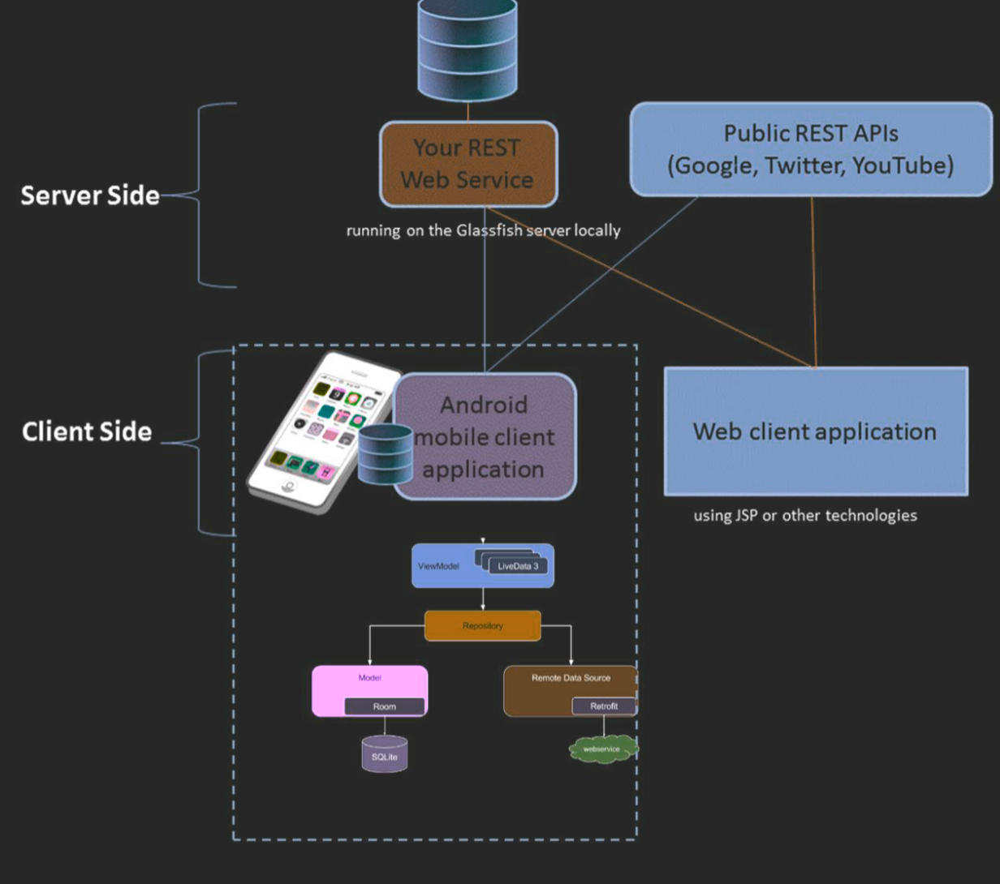
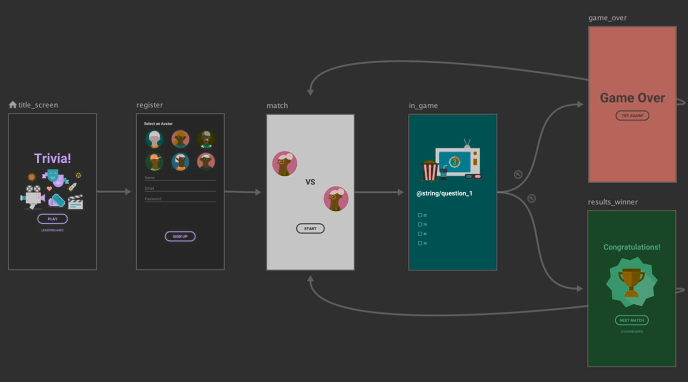
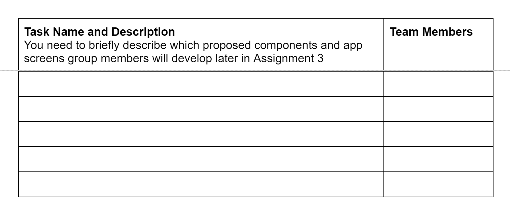

# Assignment 1: Research Paper Analysis Presentation (Weight: 15%) - Due 27/03/2023 4:30pm
## requirement
Assignment 1  - Research Paper Presentation (15%)   
Presentations in your allocated lab in Week 5  (on-campus students must present in person and online students will present online via Zoom)  
This is a group assignment (group of 2), where each group member will present their own slides (5 minutes each).   
Your group member should be from the same lab.  
Attendance in Week 5 lab is compulsory.  
This assignment uses questions at the end of the presentation as the method of validation.  
[Monash University - 登录](https://lms.monash.edu/mod/assign/view.php?id=11206852)  

[Building a Crowdsensing Platform Based on Spatio-Temporal Fencing | SpringerLink](https://link.springer.com/chapter/10.1007/978-3-030-94822-1_52)

  

  
 

#  Android Project Proposal 20% Due date Friday, 21 April 2023, 11:55 PM
Android Project Proposal 20%

**Due date Friday, 21 April 2023, 11:55 PM**

[https://lms.monash.edu/course/view.php?id=149600&section=4](https://lms.monash.edu/course/view.php?id=149600&section=4)

4. Generative AI tools are not restricted for this assessment task. ("In this assessment, you can use generative artificial intelligence (AI) to assist you in any way. Any use of generative AI must be appropriately acknowledged")

This is a group assignment (groups of 3-4).

Only one of the group members need to submit the proposal AND the task allocation form to Moodle. Please make sure you use the template (the guideline) provided in the assignment specification for this proposal.

This assignment requires submitting:

1. A project proposal using the template provided in Appendix A The word limit of the proposal is 1500 words.

2. A task allocation (Appendix B).

you will propose a mobile distributed application with an Android app as its front-end. You will interact with online public web APIs like a weather API or YouTube API, and cloud-based services such as Google Firebase for storage (as the backend). In Assignment 3, you will build this app in Android according to your proposal.

Section 1 - Key steps

(following the template in Appendix A)

**Step 1**. As a group, you will first decide on the application domain (health, fitness, entertainment,education, smart energy, smart parking or smart gardening to name a few) and its use and purpose. You need to also describe the user group, and discuss the scope and limitations

Scope,（What is being delivered）1. 解决用户什么样的痛点 == 为什么要开发这个 2. 开发时间和目标level

Limitation - (What is not delivered)要实现上面的goal有什么限制或者产品本身的局限性

1. Free account in Firebase，so each user can store limit data

2. 因为数据存储在云服务端，为来用户隐私考虑，会定期删除数据，只保留XX月数据

**Step 2**. You need to conduct a brief market and competitor analysis of similar apps in the market (Google Play Store or App Store), find and review two apps of the same type and understand their key functionalities, strengths, and weaknesses. You should provide FIVE screenshots of the main screens of each of these two apps, and describe any features/functionalities that differentiate your proposed app from existing apps. It is fine for your app to serve the same purpose as existing apps but it must be different from existing offerings in some way

**Step 3**. You need to draw a diagram that shows the main components of the proposed mobile distributed application (explained in the template with an example). Provide a list the server side and client-side components, and how they work together

**step 4**. You need to provide an overview of your UI design for the main screens (Section 2 Part 1) and the navigation hierarchy of your app using prototyping tools with a FREE trial (e.g. Lucid Charts, InVision, FIGMA, Wondershare Mockitt (previously known as Mockingbots)). This overview is explained in the template with an example

**Step 5**. You will assign the tasks among the group members and complete the Task Allocation form (Appendix B).

**Step 6**. Your proposed Android app must include the key screens and components defined in Section 2 as the minimum requirements.

**Step 7**. You need to consider the requirements for each achievement level described in Section 3

Section 2 – Key requirements

(PASS level)

Your proposed app must include the following screens and Android components as the minimum requirements

section 3 – Achievement Levels

**Credit leve** l To achieve a Credit level, the mobile app must successfully implement TWO additional features:

Firebase Authentication for Login and Signup

Android RecyclerView with CardView that displays data from the Room database (using LiveData)

**Distinction level** To achieve a Distinction level, the mobile app must implement TWO additional features.

Firebase Database to store the user's profile/data

WorkManager to run a job in the background continuously e.g. every night to store the local

data in the Firebase database

([App Architecture: Data Layer - Schedule Task with WorkManager - Android Developers](https://developer.android.com/topic/libraries/architecture/workmanager))

**High Distinction level** To achieve a High Distinction level, the mobile app must implement ONLY ONE of the following additional, advanced features.

- Integrating the android app with Facebook SDK and sending a message/data from the app

to your Facebook account

- Incorporating Google calendar and using the user's calendar events to perform context-

aware and personalised tasks

- Using sensors in the app that is meaningful and related to your app but it must be implemented and demonstrated with the emulator

[Sensors | Android Developers](https://developer.android.com/guide/topics/sensors)[Sensors Overview | Android Developers](https://developer.android.com/guide/topics/sensors/sensors_overview#test-with-the-Android-emulator)

- Other advanced features (you MUST discuss it with your tutor and get their approval)

# The project proposal

## 1 Introduction

## 1.1. An Overview of the proposed android app

//here briefly discuss the application domain and main use/purpose

## 1.2. User group

## 1.3. Key functionalities

## 1.4. Scope and limitations

## 2. The market and competitor analysis

a brief description of two (the most popular and well-known) apps and how your app will be different and novel compared to these two apps, include a few screenshots of these two apps

## 3. The system architecture

In this section, you will provide a system architecture diagram of your proposed app that shows the front-side and server-side components, plus all the key Android components mentioned in Section 2 Part 2 (refer to the example below). You also need to provide a short paragraph about these components and how they work together.

This diagram is only an example. You must show the name of APIs you will use, the server-side database (e.g. Firebase). You also must show what Android components you will include in another box. If you are using any other components, show it in the diagram

## 4. The UI Design and Screen Mockups

In this section, you need to provide screen mockups created by any prototyping tool and the navigation flow between them (using arrows). You need to provide a meaningful title for each screen. The figure below is just a guide [Design navigation graphs | Android Developers](https://developer.android.com/guide/navigation/navigation-design-graph)

## 5. Advanced features

//additional components based on Section 3 and how you will achieve them (any SKD details, or online sources and tutorials)

## 6. References

(the publications, and website links based on the APA style)

## Appendix B

**Task Allocation Form**

Please provide the name of tasks and the name of the group member(s) who did the task
in the table below
