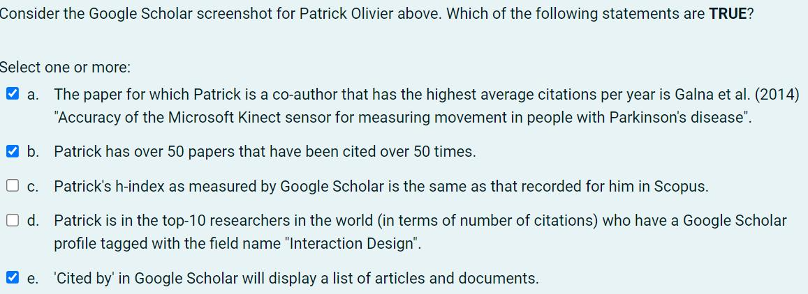
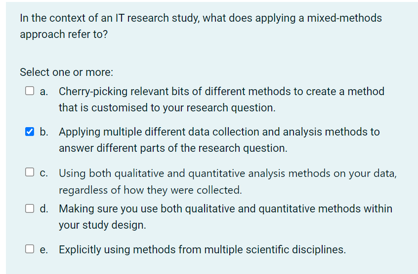
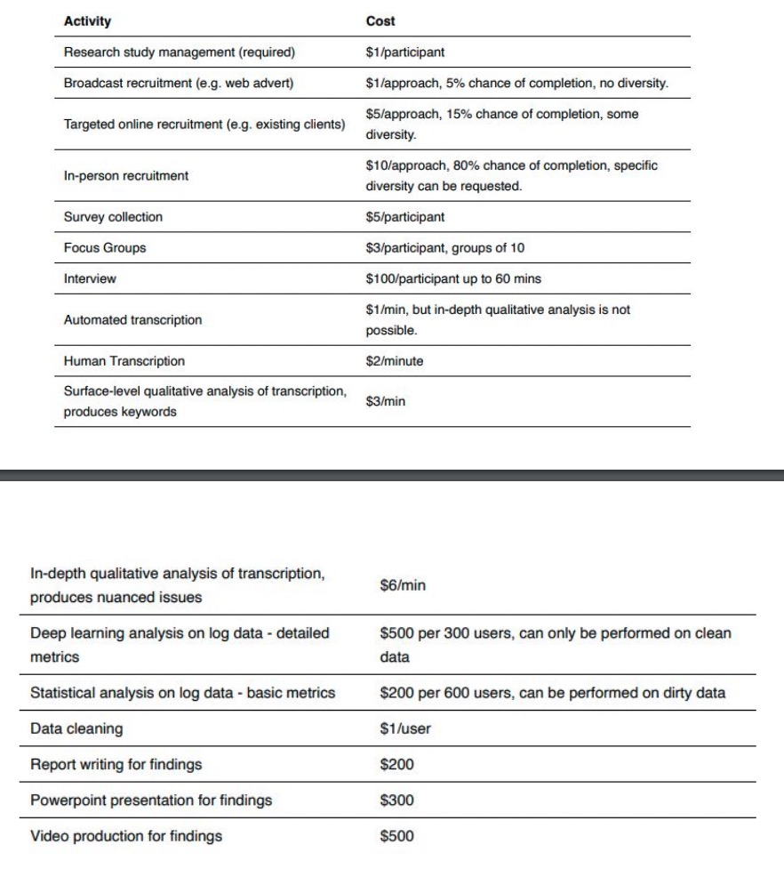
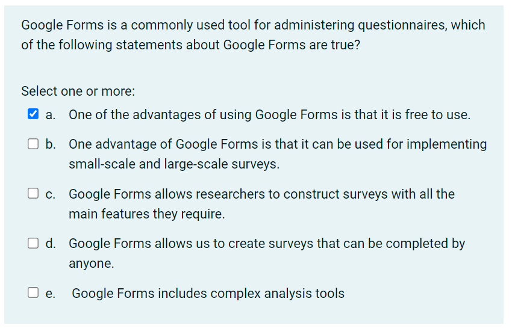
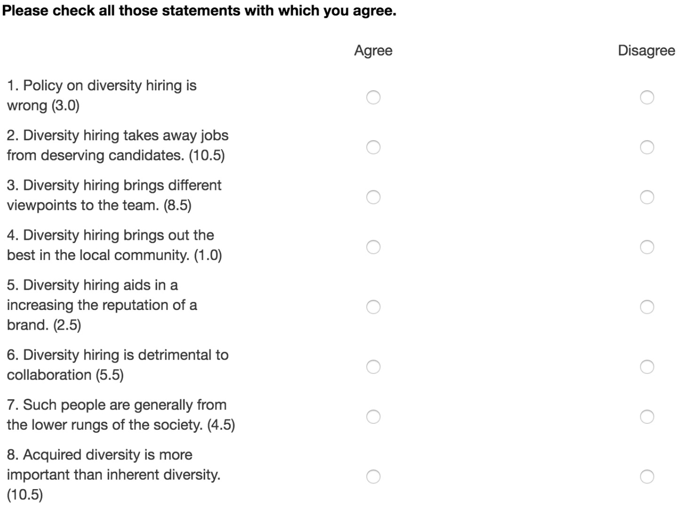
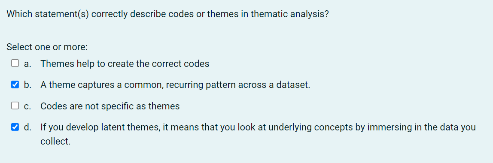
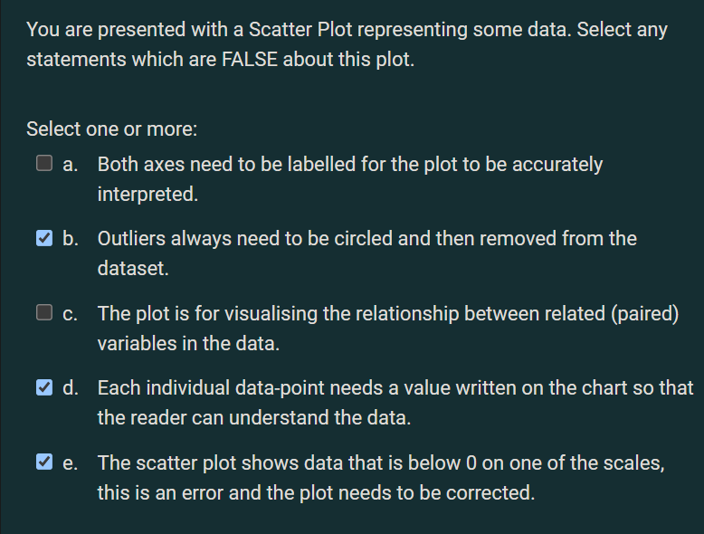
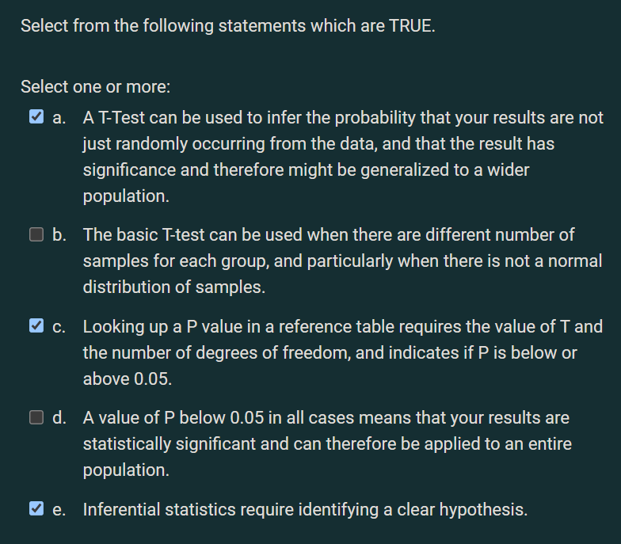
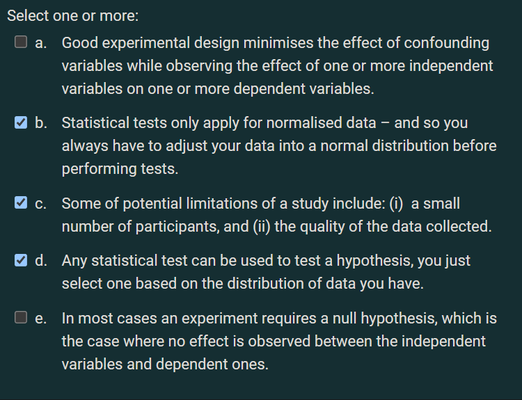
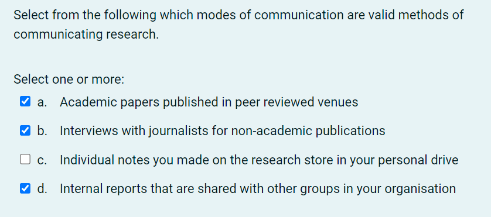

Create time: 2022-10-05  Last update: 2022-12-05

# How to use the FIT study Note document
1. download the [markdown file repository](https://github.com/GreenH47/mynote) and  navigate to the `docs` folder
2. view all the markdown files via [Obsidian vault](https://help.obsidian.md/How+to/Working+with+multiple+vaults) that can show the linked section in the note document    
3. You may find some extra material or program template  repository in the Course Brief introduction for the FIT Note markdown Document (some course don't have )

4. you can view [the web page](https://greenh47.github.io/mynote/) which transfer from MD file online but will lose the extra information or wrong    markdown display

  
# FIT5125 Course Brief introduction

| week | Introduction                               |
| ---- | ------------------------------------------ |
| 3    |  Literature |
| 4    | Configuring Research                        |
| 5    | Surveys|
| 6    | interviews                                 |
| 7    | qualitative analysis |
| 8    |   descriptive stats    |
| 9    |  inferential  stats   |
| 10 & 11  | communicating research |
| 11   | creating IP          |

[FIT5125 - IT research methods](https://handbook.monash.edu/2022/units/FIT5125?year=2022) done for the year 2022. (Semester 2)  
# Week 3 - Literature
## EXERCISE

# Week 4 Configuring Research
## EXERCISE

## Week 4 Assessment – Effective Configuration of Research 
### scenario
> You work for a large IT consultancy who is contracted by Monash University eSolutions to improve the  design of university wide unit Moodle pages, specifically in relation to its mobile usability. The university  already has anecdotal data that this aspect of Moodle is not a great experience for users, and needs  work. As per your consultancies standard practice, after an initial meeting with the client, you are tasked  by your team with the following
### Task 1
> 1. Define what you consider the three main research questions that need to be answered in the course  of your conducting this consultancy project.  (limit 100 words) 定义你认为在开展该咨询项目过程中需要回答的三个主要研究问题

该大学已经有传闻数据表明，Moodle 的这一方面对用户来说不是很好的体验，需要改进。
 Moodle 页面设计 --> 移动可用性
• 确定利益相关者期望-利益相关者和研究人员的期望匹配
• 确定可用资源——时间、金钱、人员
• 确定研究方法
• 用户是谁（学生&老师）
• 用户缺少什么/哪里不好
• 用户需要什么/什么样算好
• 需要哪些数据（现存（记录系统交互的文件）/创造）定性数据或定量数据
• 谁，用什么方法，分析什么数据

### Task 2
> 2.	Describe how qualitative and quantitative methods will be used to answer these questions and draw out the best findings for your client outlining existing data and that which requires collection. 描述如何使用定性和定量方法来回答这些问题，并为客户得出最佳发现，概述现有数据和需要收集的数据(limit 300 words)

#### Qualitative methods：定性分析法
什么是定性分析？
> Tutor 胃口大/胃口小

定性研究方法则旨在对作为研究人员的你所观察到的东西建立一个完整而详细的描述。定性的方法不是提供预测和因果解释，而是提供收集到的数据的背景和解释。

定性数据分析法有哪些？
1) 访谈或小组讨论 (Interviews or focus groups)
描述采访的地点、时间和方式，需要解答以下几个问题：
你是如何发现和选择参与者的？
有多少人参加？
访谈的形式是什么（结构化、半结构化、非结构化）？
采访时长是多少？
采访内容是如何录制的？

2) 参与/行为观察 (Participant/behavioral observation)
描述你在哪里、何时以及如何进行观察或进行人种学研究：
你观察了哪些团体或社区？
你是如何接触到他们的？
你花了多长时间进行这项研究，研究地点在哪里？
你在社区里扮演了什么角色？
你如何记录你的资料（例如视听记录、笔记）？

3) 现有数据 (Existing data)
解释你如何选择案例研究材料（例如文本或图像）作为你分析的焦点：
你分析了什么类型的材料？
你是如何收集和挑选它们的？

#### Quantitative methods：定量分析法
什么是定量分析？
>Tutor 一顿吃两个巨无霸
Tutor 吃完两个汉堡之后还能吃6个鸡块和一份大薯

这种方法试图量化数据并从目标人群的样本中归纳结果。它遵循结构化的数据收集过程，以数字的形式输出数据。定量研究也观察使用统计手段的客观分析。 在定量研究中，为了得到有效的可概括的结果，你应该足够详细地描述你的方法，以便其他研究人员采用你的研究成果。解释你如何操作化概念和测量变量，抽样方法或纳入标准，以及你用于收集数据的任何工具、程序和材料。

定量分析方法有哪些？
1) 调查 (Surveys)
描述调查的地点、时间和方式，需要解答以下几个问题：
你是如何设计题目的？题目的形式是什么？你用什么抽样方法选择参与者？
你是通过电话、邮件、网络还是当面进行调查的？参与者需要多长时间回复？
样本量和反应率是多少？ 你可以将完整的问卷作为附录，
以便你的读者能够确切地看到所收集的数据。

2) 实验 (Experiments)
详细说明你用来进行实验的工具、技术和程序：
你是如何设计这个实验的？
你是如何招募参与者的？
你是如何处理和测量这些变量的？
你在实验中使用了什么工具或技术？ 在实验研究中，提供足够的细节让另一位研究人员
重现你的结果是特别重要的。

3) 现有数据 (Existing data)
解释你如何收集和选择相关资料（例如出版物或档案数据）以包含在你们的研究中：
你从哪里获得资料的？
数据最初是如何产生的？
你选择材料的标准是什么（比如日期范围）

### task 3
> 3.	Describe the resources you expect to be necessary, considering time, money and expertise, breaking this down into key activities that will be required. 描述您预计需要的资源，考虑时间、金钱和专业知识，将其分解为所需的关键活动。(limit 300 words)

**收集数据**
定性
- 采访/访谈： 采访者/被采访者花费
- 问卷调查：问卷建立/发送/收回/奖励的花费

定量
- 数据收集方式对应花费

**分析数据 **
定性
- 转录类型对应花费
- 是否需要专业人士分析  

定量
- 数据展示花费
- 数据清理花费
- 数据分析/可视化花费
- 数据保存花费

# WEEK 5 Surveys
## EXERCISE

## Assessed Exercise (Week 5)  "Critique and development of a questionnaire"
### scenario
> During the Week 5 studio you participated in an online questionnaire.  The area of focus (i.e. overall topic) of the questionnaire is "how technology has transformed the weekly  grocery shop"  The Week 5 assignment requires you to critique and develop the questionnaire. A PDF version of the  questionnaire is available on the Moodle page for Week 5.技术如何改变了每周的日常采购
### task 1
> Critique the provided questionnaire based on your understanding of good questionnaire  design. Identify 4 different problems with the questionnaire, an example question for each problem,  and your proposal for how each example question could be improved.·   找出提供的问卷中的四个错误    
>  50 words maximum for each description of an issue identified.
>  50 words maximum for each suggestion of how to improve.

### task 2
> develop an additional sub-topic for the questionnaire. Create a sub-topic heading, a  description of the sub-topic, and 4 additional questions that could be included within this sub-topic.  Briefly justify why each new question should be included.

Overall topic： " how technology has transformed the weekly grocery shop ".  技术如何改变了每周的日常采购

**如何创建小标题**
从以下几个方面结合思考  
- 网站
- App
- 优点
- 缺陷
- 设备  

**如何描述小标题**  
为了了解。。对于weekly grocery shop的改变，我们可以从。。。方面进行进一步讨论

**问题类型**  
- open questions  
- closed questions  
-  scale questions

**具体问题**
- 明确&详细 （具体哪方面）  
- 目的明确  
- 问题类型明确  
- 提供的选项理由充足

每个陈述都有一个数值，表明它被判断为有利还是不利。  
检查人们是否同意的每个陈述，并计  算平均分数

# WEEK 6 Interviews
## EXERCISE

## Assessed Exercise (Week 6)  "Interviews and Focus Groups: Planning and conducting an  interview"
### scenario
> Technology has transformed the way we interact with day-to-day services such as shopping and  transport. However, these activities are increasingly individualistic and private activities. We are  interested in people's experiences of these daily activities and the opportunities for technology to  support richer social interaction during these tasks.主题：技术已经改变了我们与购物和交通等日常服务互动的  方式。 然而，这些活动越来越成为个人活动。 我们对人们  对这些日常活动的体验以及在这些任务中支持更丰富的社交  互动的技术机会感兴趣
> 1. PDF of your interview schedule named "STUDENT-ID-Week5-schedule.pdf".  
> 2. PDF of your manual transcription of the interview using the Week 6 assignment template provided on Moodle named  "STUDENT-ID-Week6-transcript.pdf"  
> 3. Completed consent form named "STUDENT-ID-Week6-consent.pdf"  
> 4.  Audio recording of your 20 minute (or longer) interview named "STUDENT-ID-Week6-recording.mp3"

### task 1 采访纲领至少六个问题
> Create an interview schedule for a semi-structured interview of students. Include at least 6  questions in your interview schedule (not including follow-up "probes"). Add your schedule to the  assessment template for Week 5 (provided on Moodle) but there is a strict 500-word word limit for your interview schedule.

主题可参考上周问卷，技术对日常服务互动的方式影响
+ 购物
+ 交通——公交卡充值，查询到站间隔，网约车
+ 学习
+ 上班
+ 生活

task1 interview schedule  
1. 自我介绍  
“Hi, I’m XXX, a student from Monash university, thank you for your  time to participate an interview with me. Today’s interview is  about ...”  

2. 让采访者进行自我介绍  
介绍不充足的地方可以进行追问，例如所在位置，第几学期等  

3. 正式开始话题  
至少6个正式问题，每个问题都可以是一个单独的方面
格式1：为了了解。。。我将对被采访者提出的问题是：“。。。”  
格式2: 为了。。我将询问他。

sample
 技术对于日常采购影响？
 ——有影响，以前去coles，现在线上
 
 我同意，好多人都线上购物了，那么你线上购物的频率是多少？
 ——每周一次平时经常刷手机加入购物车

###  task 2 录音+同意书
> Recruit a fellow student (from any unit, program or course) to interview. Make sure you audio  record the interview. Make sure your participant fills in a consent form (provided on Moodle). Submit  your consent form and audio file to Moodle. your interview must be at least 20 minutes long (may be longer)

1. 建议提前写好对话 再找队友一起录音  
2. 但需要表现出这是一段真实的采访不是读稿子
3. 20mins 大约1500+字数  
4. 基于刚刚的6个主要问题在被采访者回答后根据回答进行深入  

技巧：  
+ 适当重复，总结被采访者回答。  
+ 根据回答细节进行追问。  
+ 对被采访者的回答作出回应或肯定。  
+ 可以给出情景让被采访者回答来增加答案的具体性。  
+ 结尾时表达感谢。 Thank you again for your par/cipa/on. Your answer is very helpful to my research.

### task 3 
> Task 3: Manually transcribe the interview. use Intelligent transcription, rather than verbatim  transcription (which takes much longer). Add your transcription to the assessment template for Week  5 (provided on Moodle) 智能转录 轻度编辑 删除与对话或讨论的主题无关的  短语

# WEEK 7 Qualitative Analysis
## EXERCISE

## communication

## Week 7 Assessment "Thematic analysis of interviews”
### reference
https://gradcoach.com/what-is-thematic-analysis/

https://www.scribbr.com/methodology/thematic-analysis/

https://www.interaction-design.org/literature/article/how-to-do-a-thematic-analysis-of-user-interviews

### scenario
> We have conducted three interviews in which people discuss  their grocery shopping habits and how using technology transformed their experience 
> check Transcripts for A3.pdf  

### task 1
> Task 1: Thematically analyse the transcripts of all three interviews and derive THREE themes (groups  of codes). Write down your theme names, and the names of the associated codes, using the Week 6  template.    阅读三个转录，三个转录一起给三个主题，每一个主题给三个code
> ⚐ Remember the order in which analysis was carried out in the workshops: i) thoroughly read the  transcripts, ii) code (and refine) your codes, iii) group the codes into interesting themes.

###  Task 2
>For each code you included in Task 1, provide a description of the code and at least 2 illustrative quotes from the transcript. Use the Week 6 template.  
>⚐ Limit your description of each code (not including the illustrative quotes) to no more than 50 words 给Task1中的每一个code（共九个）进行说明并仅用至少两段对话内容（说明部分不超过50字）

### Task 3
> Write a description of each theme included in your response to Task 1. Your description should include a justification for its inclusion, and an explanation of how the theme captures something interesting about students' experience of, and beliefs about, feedback. Use the Week 6  template.  
> ⚐ Limit your description of each theme to no more than 150 words.
> 解释Task1中的每一个主题 1）主题的解释 2）这个  主题是如何与学生的反馈和想法相关的  （不超过150字

### how to Thematically analyse
Thematic analysis is a method of analyzing qualitative data. It is usually applied to a set of texts, such as an interview or transcripts. The researcher closely examines the data to identify common themes – topics, ideas and patterns of meaning that come up repeatedly.
主题分析是一种分析定性数据（一组表示事物性质、规定事物类别的文字表述型数据，不能将其量化，只能将其 定性）的方法。它通常应用于一组文本，例如采访笔录。研究人员仔细检查数据以识别常见主题-主题，思想和意义模式，这些主题会反复出现
#### Step 1: Familiarization
全面了解我们收集的所有数据
#### Step 2: Coding
我们需要对数据进行编码。编码意味着突出我们文本的部分——通常是短语或句子——并提出速记标签或“代码”来描述它们的内容。每个代码都描述了该部分文本中表达的想法或感觉。
#### Step 3: Generating themes
我们查看我们创建的代码，识别其中的模式，并开始提出主题。
#### Step 4: Reviewing themes
必须确保我们的主题是有用且准确的数据表示。在这里，我们返回数据集并将我们的主题与它进行比较。
#### Step 5: Defining and naming themes
定义主题包括准确表述每个主题的含义，并弄清楚它如何帮助我们理解数据。
命名主题涉及为每个主题提出一个简洁易懂的名称。
例如，我们可能会查看“对专家的不信任”，并准确确定我们在这个主题中所说的“专家”指的是谁。我们可能会认为这个主题的一个更好的名称是“不信任权威”或“阴谋思维”。
#### Step 6: Writing up
撰写主题分析需要介绍来确定我们的研究问题、目标和方法。
我们还应该包括一个方法部分，描述我们如何收集数据（例如通过半结构化访谈或开放式调查问题）并解释我们如何进行主题分析本身。
结果或发现部分通常依次解决每个主题。我们描述了主题出现的频率及其含义，包括作为证据的数据示例。最后，我们的结论解释了主要内容，并展示了分析如何回答了我们的研究问题。
在我们的示例中，我们可能会争辩说，关于气候变化的阴谋思维在年长的保守派选民中很普遍，指出许多选民对这个问题的看法存在不确定性，并讨论了错误信息在受访者看法中的作用。

# WEEK 8 Descriptive Stats
## EXERCISE

## communication

## Week 8 Assessment – Descriptive Statistics
### TASK 1 
> Select a single metric that relates to a personal characteristic of the respondents (from Q1-Q8)

+ import file data
https://au.mathworks.com/matlabcentral/answers/72545-how-to-import-csv-file-in-matlab

+ Convert Text to Numeric Values
https://au.mathworks.com/help/matlab/matlab_prog/converting-from-string-to-numeric.html
~~~matlab
X = str2double('3.1416')

>>X = 3.1416
~~~
+ remove empty elements
https://au.mathworks.com/matlabcentral/answers/293562-how-to-delete-empty-lines-in-a-table
~~~matlab
idx=all(cellfun(@isempty,A{:,:}),2)

A(idx,:)=[]
~~~

### TASK 2
> Design a MATLAB script to compute the population standard deviation and the Interquartile Range of  this metric. Annotate each line of your script to describe what it does and the result it produces 计算总体标准差和该指标的四分位距

#### population standard deviation
https://au.mathworks.com/help/matlab/ref/std.html
~~~matlab
Age_PSD = std(Age_mat,1);
~~~

#### Interquartile Range of  this metric
https://au.mathworks.com/help/stats/prob.normaldistribution.iqr.html
~~~matlab
Age_IR = iqr(Age_mat);
~~~

### TASK  3
> Imagine that this data is a sample of a wider population (e.g. all students at Monash). Create a script to  compute the sample standard deviation. Annotate each line of your script to describe what it does and  the result it produce 计算样本标准差

~~~matlab
Age_STD = std(Age_mat,0);
~~~

### TASK 4
> Select a numeric scale metric from the data, use MATLAB to produce a boxplot of this metric, and label  the boxplot appropriately. Annotate your boxplot using MATLAB to indicate what each element means.  Annotate each line of your script to describe what it does 做任意纯数字列列的boxplot并标注每条线

~~~matlab
boxplot(Age_mat);
xlabel('student');
ylabel('age');
title('What is your age?');
~~~

# WEEK 9 Inferential Stats

## EXERCISE

## Week 9 "Working with hypotheses"
### scenario
> In this exercise you will formulate a hypothesis, prepare a plan of your study (including statistical testing) and  justify it, including the potential limitations of it. Consider the topic of the survey that you participated in during  the unit, and used for the Week 8 assessment task

### task 1
> Propose a hypothesis. It should be something you can realistically test using one or more of the  statistical tests covered in this course. It can concern any topic or natural phenomena which relates in  some way to the survey topic (max. 50 words) 关于什么的假设。假设的背景.要可测量的因变量

https://grammar.yourdictionary.com/for-students-and-parents/how-create-hypothesis.html
假设在线学习模式对学生每周平均学习时间的影响。
双面测试来查看同一组学生在2019 年第二学期和2020年第一学期的平均每周学习时间之间的差异。（2019年第二学期是面对面学习，并且2020  年第一学期为在线学习模式。）  

### task 2
> Write down the null hypothesis (max. 50 words). 一句话解释原假设

H0：与原始的面对面教学相比，在线教学不会影响学生每周的平均学习时间。  
H1：与原始的面对面教学相比，在线教学将对学生每周的平均学习时间产生影响。

### task 3
> Write down the independent and dependent variables as well as at least three confounding  variables  (max. 50 words). 自变量 因变量 混淆变量

https://www.scribbr.com/methodology/independent-and-dependent-variables/
https://www.scribbr.com/methodology/confounding-variables/

自变量: 
+ 在一个实验中，实验者主动加以操纵、控制并对被试的反应可能产生影响的变量。它独立于被试的行为存在。
自变量independent variables：学习方法。 

因变量:
+ 因自变量改变而改变的变量，是实验者观察的变量。  
因变量dependent variables：每周平均学习时间。  
 
混杂变量confounding variables：
+ 不同学科。学生素质。学生年龄。

### task 4
> magine you had a budget of up to 1000AUD (in addition to up to 100 hours of your time to conduct the  study). Explain what data you will collect to investigate this hypothesis and how you would obtain the  data in a practical fashion (max. 100 words) 哪些数据。获取方式。花销。时间计划

收集什么数据：
+ 我们需要收集不同时期学生的平均每周学习时间。该组学生将属于同一专业的同一组学生。 

从哪里收集数据：
+ 我们将从bis专业中随机选择50名学生来收集数据。  

用什么方式收集以及如何筛选数据：
+ 该过程将通过电子邮件发送。为了防止未答复，我们将向所有商务信息系 统专业的学生发送电子邮件，并从收到的答复中随机选择50个答复。  

花销，
+ 例如奖励机制（收集数据时也会由于不同的方法产生花销）：为了鼓励学生快速回答问题，我们会在前 50名学生成功回答后给予$ 5的代金券。此过程将花费$ 250。

 时间：
 + 将用1天时间进行邮件发送，2天等待回复，1天筛选数据

### task 5
> What statistical tests do you expect to conduct to test the hypothesis. Please explain the circumstances  in which you would conduct each test (max. 150 words). 测试方式以及它们的优劣势。  可以列举2-4种方法进行测试

https://www.scribbr.com/statistics/statistical-tests/

https://stats.oarc.ucla.edu/spss/whatstat/what-statistical-analysis-should-i-usestatistical-analyses-using-spss/
T-test
https://prosancons.com/education/pros-and-cons-of-t-test/
Mann-Whitney U
http://www.stat.ucla.edu/~rgould/x401f01/mannwhitney.html
Chi-square test
https://passel2.unl.edu/view/lesson/9beaa382bf7e/2
https://passel2.unl.edu/view/lesson/9beaa382bf7e/14

### task 6
> What are the limitations of your study? Write a paragraph that explains these limitations as well as  potential future investigations you might conduct (max. 200 words). 局限性&未来进一步调查

局限性：  
https://blog.wordvice.com/how-to-present-study-limitations-and-alternatives/
https://libguides.usc.edu/writingguide/limitations#:~:text=Definition,the%20findings%20from%20your%20research.
+ 数据数量是否足够  
+ 数据样本是否能满足测试方法  
+ confounding variables是否会严重影响试验结果  

future investigations：  
https://research-methodology.net/research-methodology/suggestions-future-research/
+ 如何&何时获取更多数据  
+ 是否需要改变测试方式

# WEEK 10&11 Communicating Research

## EXERCISE

## weekly communication
>   Describe what steps you took in identifying the arguments and  concepts in your groups chosen paper and communicating this  to your class audience?

如何总结论点 
-  分配到的文章主题是什么  
- 根据abstract和conclusion的内容提炼arguments  
- 观点是什么  

如何与观众交流  
- 以易于理解的方式表达  
- 专业词汇进行简化  
- 逻辑从大到小进行讲解

## Assessed Exercise (Week 10) “Creating a Video Communication Plan”
### scenario
> As part of your assessment submission for Assignment 4, you need to produce a video which communicates a specific piece of FIT research. You can select from any of the papers listed on the Moodle page for Week 10. Your task is to create a ‘video treatment’ document, filling in the time, content and script columns that will effectively communicate your chosen paper.Your 90 second video will be sent to a number of investment companies seeking opportunities.what the nature of a specific piece of research is (in your case the that described in the papers).he only goal of the video is to stimulate interest in the organisations to find out more about the research. Therefore, your video will be used to introduce the core technical innovations and the significance of these to gain potential meetings with members of the organisations at which the detail and opportunities can be discussed further

what to submit
+ create a ‘video treatment’ document, filling in the time, content and script columns that effectively communicate your chosen paper
+ 90 second video

Target audience
+ where the business engagement staff are seeking to communicate to investment companies and other organisations (such as private donors and charities)

Purpose
+ stimulate interest in the organisations to find out more  about the research.
+ gain potential meetings with members of the organisations at which the detail and opportunities can be discussed further

Content
+ what the nature of a specific piece of research is (in your case the that described in the papers)
+ introduce the core technical innovations and the significance of these 

### How to do it

Time
+ the length of each part (10 ~ 15s)

Content
+ what thing will be discussed in this section

Script 旁白字幕
+ dialogue captain display in video

Visual 视觉效果
+ BGM
+ pictures
+ video segment
+ Other visual elements

Justification
+ reason to select this part
+ why in this display format
+ How to draw attention

### part of my outline

# week 12
## Assessed Exercise (Week 12) “Reporting with an impact declaration
### scenario
> in this part of the assignment your task is to fill in a simple ‘Impact Declaration’ that will accompany your video plan and your final video.
> This form summaries the potential impact of the IP and will be used by the Business Development team to decide how to approach relevant investors.

### how to do it
+ SUMMARY / BACKGROUND (max 50 words) 详细的背景摘要，对研究及其结果进一步描述
+ WHAT IS THE PROBLEM BEING TACKLED? (max 50 words) 问题陈述。我们用这项科技想要解决的问题是什么？
+ WHAT IS THE POTENTIAL SOLUTION / APPLICATION FOR A PARTNER? (max 50 words) 潜在的解决方案和应用 这项科技如何解决问题的以及如何应用这项技术。
+ WHAT IS THE IMPACT/HOW DOES IT MAKE THE INDUSTRY PARTNER SUCCESSFUL (max 50 words) e.g. Social good, ROI (cost savings) efficiency/productivity), What would they be interested in on a commercial level? What’s in it for them? E.g, How will they reach their KPI’s, sales targets 会对投资者在商业方面产生什么影响。主要考虑他们在商业方面如 何获利。比如社会影响（公益），利润变高（成本降低/提高生产率）
+ WHAT IS THE TECHNOLOGY BEING USED? (max 50 words) 把这项技术中使用到的所有技术都列举出来。 比如：监视功能，语音收集功能，匿名技术，分析技术等。
+ IS THERE POTENTIAL TO PATENT THIS WORK? (max 50 words) Do you think this idea should be patented, briefly explain your answer? 这项技术是否可以申请专利？ 首先说是/否。 其次，说明专利的政策：新颖性和实用性 Your invention must be unique and inventive or innovative in order to gain patent protection.发明必须是独特的，有创造力的 或创新的，才能获得专利保护。最后，分析你的科技是否具有这两个特性
+ potential CONFLICTS WITH EXISTING PRIOR ART? (max 50 words inc. links to prior) 该科技中是否存在现有技术。是否有人在某个时间之前已经描述或展示或做出了包含与本发明非常相似的技术用途的东西。本科技存在哪些现有技术。
+ WHAT IS THE COMMERCIAL POTENTIAL OF THIS RESEARCH? (max 50 words) Note this is different to patent, as work can be commercialised without having a patent  该技术的商业潜力。这与专利不同，因为无需专利就可以将作品商业化。往大了说，不要只关注该技术本身存在的行业而是关注于该技术的潜力。例如：它在未来可能会发展成应用于每个人生活中的技术，为什么。
+ WHICH INDUSTRIES CAN BENEFIT FROM THIS RESEARCH, WHY? (max 50 words) e.g. financial institutions, utilities, companies? 该技术可以使哪些行业受益。该技术可以应用的范围有多广泛。可以跨越哪些行业进行应用。公益，金融，医疗，教育等。

