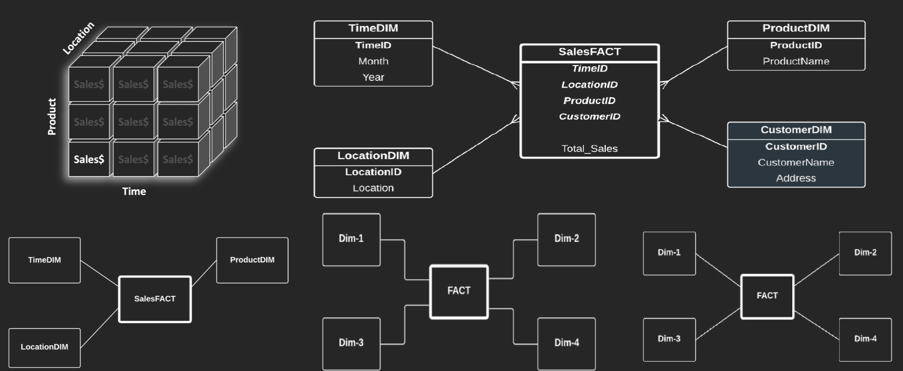
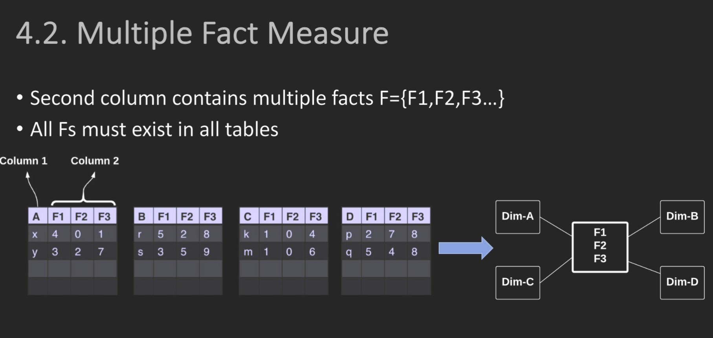
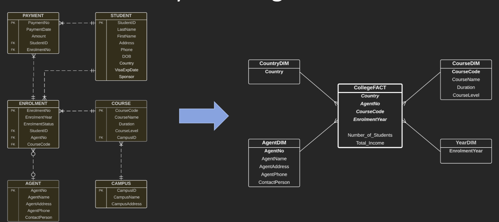

# Unit Overview 单位概览
Welcome to FIT5137 Advanced Database Technology Semester 2, 2023.
欢迎来到 FIT5137 高级数据库技术 2023 年第 2 学期。

This unit provides an in-depth exploration of advanced database technologies, focusing on three main topics:
本单元深入探讨了高级数据库技术，重点关注三个主要主题：

1. Data Engineering: 1. 数据工程：
   - Data transformation: Techniques for manipulating and converting data to meet specific requirements.
- 数据转换：用于操作和转换数据以满足特定要求的技术。
   - Data cleaning: Strategies to identify and rectify errors, inconsistencies, and missing values in datasets.
- 数据清理：识别和纠正数据集中的错误、不一致和缺失值的策略。
   - Working with public data: How to access, analyze, and leverage publicly available datasets.
- 使用公共数据：如何访问、分析和利用公开可用的数据集。

2. Data Warehouse: 2. 数据仓库：
   - Understanding the concept and architecture of a data warehouse.
- 了解数据仓库的概念和体系结构。
   - Designing and querying data warehouses for efficient data retrieval and analysis.
- 设计和查询数据仓库，以实现高效的数据检索和分析。

3. Geospatial Databases: 3. 地理空间数据库：
   - Introduction to geospatial data and its unique characteristics.
- 介绍地理空间数据及其独特特征。
   - Geospatial database management systems (DBMS) and their features.
- 地理空间数据库管理系统（DBMS）及其功能。
   - Spatial data modeling, indexing, and querying techniques.
- 空间数据建模、索引和查询技术。

Throughout this unit, you will gain a comprehensive understanding of these topics and develop practical skills in data engineering, data warehousing, and geospatial databases.
在本单元中，您将全面了解这些主题，并培养数据工程，数据仓库和地理空间数据库方面的实践技能。

|Week 周|Topics 主题|
|---|---|
|Week 1 第 1 周|Introduction to data engineering, Data transformation and data warehousing, SQL revision   数据工程简介、数据转换和数据仓库、SQL 修订版|
|Week 2 第 2 周|Star schema modelling and implementation, More advanced dimension modelling   星型架构建模和实现，更高级的维度建模|
|Week 3 第 3 周|Case studies of data cleaning in data warehousing, Pre and post data warehousing, Extended fact tables and pivot tables   数据仓库、数据仓库前后、扩展事实数据表和数据透视表中数据清理的案例研究|
|Week 4 第 4 周|Concepts of granularity in data warehousing, Designing high and low granularity data warehousing   数据仓库中的粒度概念，设计高粒度和低粒度数据仓库|
|Week 5 第 5 周|How to use public data, How to use third party data, Data privacy   如何使用公共数据， 如何使用第三方数据， 数据隐私|
|Week 6 第 6 周|Differences between common data analytics and data analytics for data warehousing, Data analytics techniques: clustering and classification   常见数据分析和数据仓库数据分析之间的差异， 数据分析技术：聚类和分类|
|Week 7 第 7 周|Introduction to Spatial Databases, Spatial DBMS (PostGIS), Spatial concepts, Spatial objects   空间数据库简介， 空间DBMS （PostGIS）， 空间概念， 空间对象|
|Week 8 第 8 周|Spatial SQL, Spatial functions, Spatial distances   空间 SQL， 空间函数， 空间距离|
|Week 9 第 9 周|Spatial queries, Spatial SQL, KNN and Range Queries   空间查询、空间 SQL、KNN 和范围查询|
|Week 10 第 10 周|Import objects, Spatial data formats, QGIS visualization   导入对象、空间数据格式、QGIS 可视化|
|Week 11 第 11 周|Spatial query optimization, Spatial data pre-processing   空间查询优化、空间数据预处理|
|Week 12 第 12 周|Roads structure, Trajectories and Trajectory tracker apps   道路结构、轨迹和轨迹跟踪器应用程序|

|Deadline 限期|Task Name 任务名称|Task Content 任务内容|
|---|---|---|
|Assignment 2 (10%) 作业 2 （10%）|Video Presentation (Individual), Week 8   视频演示（个人），第 8 周|Create a 5-minute video presentation discussing topics such as public/3rd party data, data privacy, granularity, and analytics. Utilize materials from lectures and labs covered in week 4-6.   创建 5 分钟的视频演示，讨论公共/第三方数据、数据隐私、粒度和分析等主题。利用第 4-6 周涵盖的讲座和实验室材料。|
|Assignment 3 (30%) 作业 3 （30%）|Major Assignment-1 (Group), Week 9   主要作业-1（小组），第9周|Perform data cleaning and preparation using a public dataset. Collaborate in groups of 2 or 3 students. Utilize the lecture and lab materials from week 4.   使用公共数据集执行数据清理和准备。以 2 或 3 名学生为一组进行协作。利用第 4 周的讲座和实验材料。|
|Assignment 4 (30%) 作业 4 （30%）|Major Assignment-2 (Group), Week 12   主要作业-2（小组），第12周|Conduct geospatial data analysis on public transport accessibility in Melbourne. Collaborate in groups of 2 or 3 students. Utilize the lectures and labs materials covered in week 7-10.   对墨尔本的公共交通可达性进行地理空间数据分析。以 2 或 3 名学生为一组进行协作。利用第 7-10 周涵盖的讲座和实验材料。|
|Assignment 5 (10%) 作业 5 （10%）|Trajectory Report (Individual), Week 14   轨迹报告（个人），第 14 周|Create your own trajectory and write a 1000-word report based on it. Utilize the lectures and labs materials covered in week 11-12.   创建自己的轨迹，并据此编写1000字的报告。利用第 11-12 周涵盖的讲座和实验材料。|

# week 2
## Star Schema Notation
Star Schema Notation is a graphical representation of a star schema used in data warehousing. A star schema is a type of dimensional modeling where data is organized into a central fact table surrounded by dimension tables. It is called a star schema because the diagrammatic representation resembles a star with the fact table in the center and dimension tables radiating outward like the arms of a star.
星型架构表示法是数据仓库中使用的星型架构的图形表示形式。星型架构是一种维度建模，其中数据被组织到由维度表包围的中央事实数据表中。之所以称为星型模式，是因为图解表示类似于一颗星星，事实表位于中心，维度表像星星的臂一样向外辐射。

In Star Schema Notation, the fact table is represented as a large rectangle in the center, and the dimension tables are represented as smaller rectangles connected to the fact table with lines. Each dimension table represents a different aspect of the data, such as time, geography, or product.
在星型架构表示法中，事实数据表表示为中心的一个大矩形，维度表表示为用线条连接到事实数据表的较小矩形。每个维度表表示数据的不同方面，例如时间、地理位置或产品。

The notation also includes labels or descriptions on the lines connecting the fact table to the dimension tables, specifying the relationship type (e.g., one-to-one, one-to-many) between the tables.
该表示法还包括将事实数据表连接到维度表的线上的标签或说明，指定表之间的关系类型（例如，一对一、一对多）。

This graphical representation helps in visually understanding the structure of the star schema, including the relationships between the tables and the hierarchies within each dimension. It is commonly used in data modeling and data warehousing to design, understand, and communicate the structure of star schemas.
这种图形表示有助于直观地理解星型架构的结构，包括表与每个维度内的层次结构之间的关系。它通常用于数据建模和数据仓库，以设计、理解和传达星型模式的结构。

## Fact and Dimensions
Fact and Dimensions contain attributes  
• Each Dimension has a Dimension ID (PK)  
• Dimension IDs in Fact are FK and PK  
• Fact can only have numerical values  
事实和维度包含属性 • 每个维度都有一个维度 ID (PK) • 事实中的维度 ID 为 FK 和 PK • 事实只能有数值  
## transfer ER to star

  

1. Identify the Fact Table:  
    标识事实数据表：
    
    - Look for the entity in the E/R Diagram that represents the main business transaction or event. This entity will be the fact table in the star schema.  
        在 E/R 图中查找表示主要业务事务或事件的实体。此实体将是星型架构中的事实数据表。
    - Determine the attributes of the fact table, which will become the columns in the fact table.  
        确定事实数据表的属性，这些属性将成为事实数据表中的列。
2. Identify the Dimension Tables:  
    标识维度表：
    
    - Identify the entities in the E/R Diagram that are directly related to the fact table.  
        标识 E/R 图中与事实数据表直接相关的实体。
    - Each of these entities will become a dimension table in the star schema.  
        其中每个实体都将成为星型架构中的维度表。
    - Determine the attributes of each dimension table, which will become the columns in the dimension tables.  
        确定每个维度表的属性，这些属性将成为维度表中的列。
    - Include a primary key column in each dimension table to uniquely identify the dimension records.  
        在每个维度表中包含一个主键列，以唯一标识维度记录。
3. Map the Relationships: 映射关系：
    
    - Identify the relationships between the fact table and dimension tables in the E/R Diagram.  
        标识 E/R 图中的事实数据表和维度表之间的关系。
    - For each relationship, create a foreign key column in the fact table that references the primary key column of the related dimension table.  
        对于每个关系，在事实数据表中创建一个引用相关维度表的主键列的外键列。
4. Denormalize the Dimension Tables (Optional):  
    非规范化维度表（可选）：
    
    - Analyze the attributes in the dimension tables and consider whether denormalization is needed.  
        分析维度表中的属性，并考虑是否需要非规范化。
    - If certain attributes are frequently used together or need to be efficiently queried, you may consider combining them into a single denormalized dimension table to avoid joins.  
        如果某些属性经常一起使用或需要高效查询，则可以考虑将它们合并到单个非规范化维度表中以避免联接。
5. Design the Star Schema:  
    设计星型架构：
    
    - Create the tables in the star schema based on the identified fact table and dimension tables.  
        根据标识的事实数据表和维度表在星型架构中创建表。
    - Define the columns of each table based on the identified attributes.  
        根据标识的属性定义每个表的列。
    - Establish the relationships between the fact table and dimension tables using foreign key columns.  
        使用外键列建立事实数据表和维度表之间的关系。

Remember, the E/R Diagram and the star schema serve different purposes. The E/R Diagram is a logical representation of the entities, attributes, and relationships in a system, while the star schema is a specific data modeling technique for data warehousing. The process described above is a general guideline and may vary depending on your specific requirements and the complexity of your E/R Diagram.  
请记住，E/R 图和星型模式有不同的用途。E/R 图是系统中实体、属性和关系的逻辑表示形式，而星型架构是用于数据仓库的特定数据建模技术。上述过程是一般准则，可能会根据您的特定要求和 E/R 图的复杂性而有所不同。