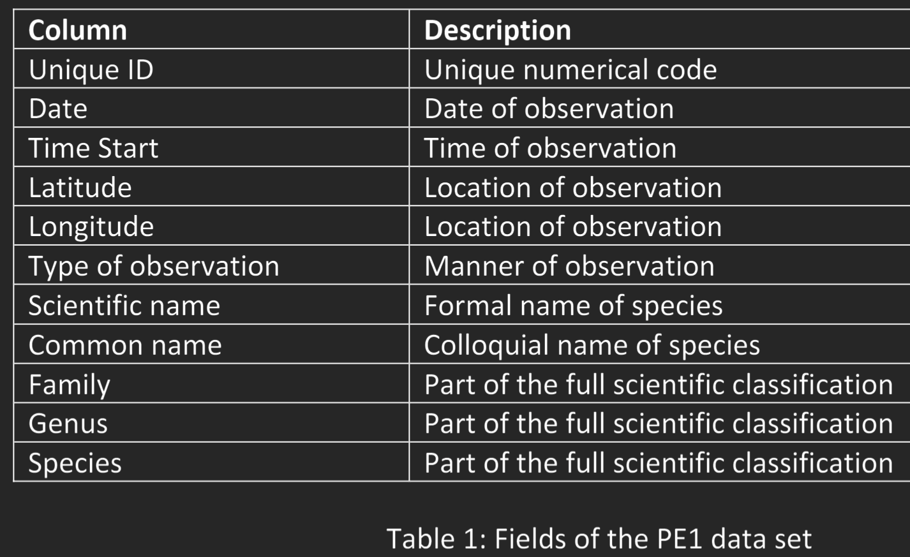
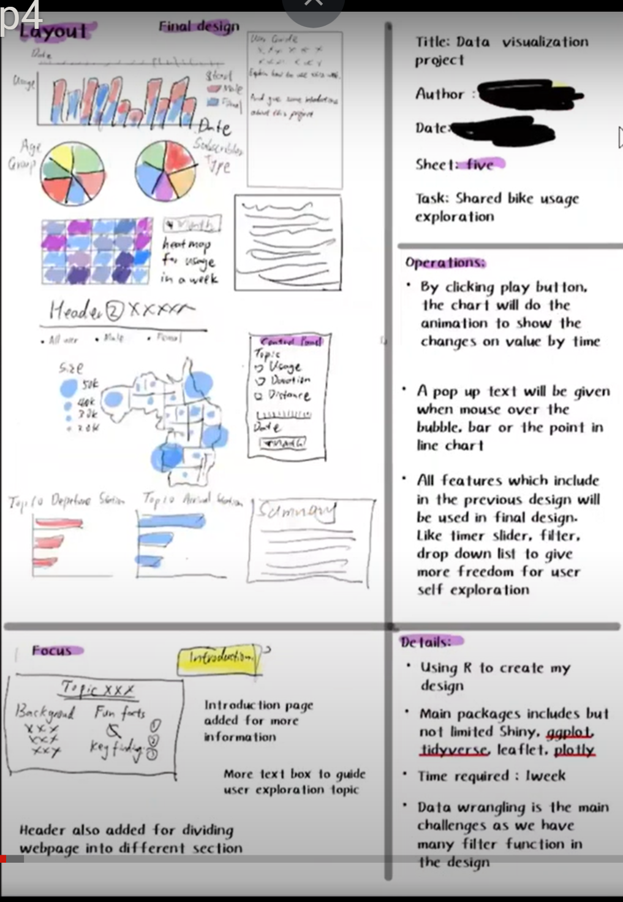
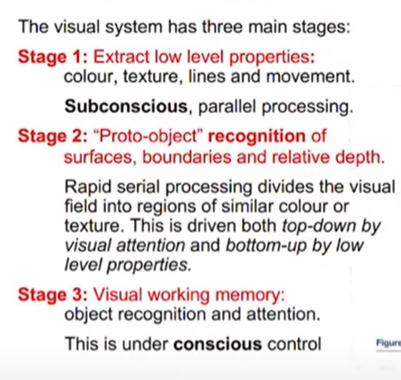

Create time: 2023-02-24  Last update: 2023-02-24

# How to use the FIT study Note document
1. download the [markdown file repository](https://github.com/GreenH47/mynote) and  navigate to the `docs` folder
2. view all the markdown files via [Obsidian vault](https://help.obsidian.md/How+to/Working+with+multiple+vaults) that can show the linked section in the note document    
3. You may find some extra material or program template  repository in the Course Brief introduction for the FIT Note markdown Document (some course don't have )

4. you can view [the web page](https://greenh47.github.io/mynote/) which transfer from MD file online but will lose the extra information or wrong    markdown display

  
# FIT5147 Data exploration and visualisation Course Brief introduction


| week | Introduction                                            |
| ---- | ------------------------------------------------------- |
| 1    | Visual Analytics and Visualisation For Data Exploration |
| 2    | Visualisation of Tabular Data                           |
| 3    | Analysis of Trends and Patterns in Tabular Data         |
| 4    | Data Maps, Tools For Creating Data Maps                 |
| 5    | Spatial Analytics                                       |
| 6    | Network Data Analysis & Visualisation                   |
| 7    | Textual Data Analysis & Visualisation                   |
| 8    | Visualisation Design Methodology                        |
| 9    | Human Visual System                                     |
| 10   | Visual Communication                                    |
| 11   | Interactive Data Visualisation                          |
| 12     |  History And Future Of Visualisation                                                       |


[FIT5147 - Data exploration and visualisation](https://handbook.monash.edu/2023/units/FIT5147?year=2023) done for the year 2023. (Semester 1)  
# R introduction
For the introduction and basic syntax. Please refer to [R introduction](Rintro.md)

# Week 1: Visual Analytics and Visualisation For Data Exploration
## Learning Objectives:
At the end of this week, you should:

-   be able to read data into **R** and **Tableau Public** and use visualisations to explore the data
-   understand the role visualisation plays in data science: data checking and cleaning, exploration and discovery, and the presentation and communication of results
-   know what visual analytics is and have an understanding of the complementary role visualisation and data analytics play in data science

# Week 2 Visualisation Of Tabular Data
## Learning objectives
-   seen the many standard visualisations <mark style="background: #ff0000;">(line graphs, bar charts, frequency distributions, time series data etc 折线图、条形图、频率分布、时间序列数据等)</mark> for showing tabular data and know when to use them;
-   seen standard visualisations for <mark style="background: #3CB371;">multivariate tabular data (small multiples, MDS, SPLOMs etc) and know when to use them; 多元表格数据（小倍数、MDS、SPLOM 等）的标准可视化</mark>
-   the ability to use these visualisation to <mark style="background: #D2691E;">understand data distributions, to test assumptions such as normality and to guide transformation of data; 理解数据分布、测试正态性等假设并指导数据转换</mark>
-   knowledge of curve and surface fitting to data; 曲线和曲面拟合数据
-   knowledge of data clustering techniques; 数据聚类技术
-   have first-hand experience with R<mark style="background: #0000CD;"> and the graphics package ggplot2</mark> to
    -   read, check, clean and transform data;读取、检查、清理和转换数据；
    -   construct standard visualisations for tabular data, curve fitting, data clustering and to understand data distributions; 为表格数据、曲线拟合、数据聚类构建标准可视化并理解数据分布
    -   create interactive visualisations using the package Shiny.使用包 Shiny 创建交互式可视化。

## reference
[Module 2 Making sense of tabular data](https://lms.monash.edu/mod/book/tool/print/index.php?id=11404011)


## tutorial
-   be able to read, check, clean and transform data with R
-   be able to do create advanced plots and visualisations using ggplot2

#

# Assignment 1 Project Proposal
## requirement
```ad-note
title: Requirment
collapse:

1. Identify the project topic, related questions that you want to address, and data source(s) that you will be using to answer those questions.
2. Submit your Project Proposal in the Assessment section of Moodle in Week 3 Project Proposal (2%) Monday, 13 March 2023, 9:30 AM  

Write a one page document consists of the following sections:
 > 1. Your full name, student ID, tutors’ names, and tutorial number.
 > 2. Project title.
 > 3. Brief introduction of your topic and motivation (max 1-2 paragraphs).
 > 4. Up to 3 questions you wish to answer. The number of questions depends on the scope of the question itself. You can have one general question or three more detailed ones.
 > 5. Data source(s) you plan to use to answer these questions, including a brief description of the data in each data source (e.g., number of rows; number of columns; type of data: tabular, spatial, network, textual or other; URL).
 > 6. The bibliographical details of any references you have cited in the previous sections.  
 
The topic and questions should allow for interesting and detailed analysis in the Data Exploration Project (DEP) and the subsequent Data Visualisation Project (DVP, due at the end of semester), which involves presenting the findings from your DEP in a narrative format. It is strongly recommended that you do not include questions that are
● too easy to answer (e.g., what is the correlation between x and y, what is the average value of z variable, what are the top/bottom N values), or
● too difficult to do, or
● not relevant to the unit (e.g., training a machine learning model), or
● are not possible to find out from the data sources provided
 > Proposals with such questions will all be rejected (and not receive the Suitability and Clarity grade, according to the marking rubric). If in doubt, you should talk to your tutor during their consultation before the due date.
 >  Good questions are general enough that they are not linked to specific parts of the data, allowing for more open-ended and exploratory analysis. For instance, asking “Where is the safest part of the network?” lets you explore various interpretations of how to link “where” and “safest” to the data about a network, whereas “Which LGA-code has the lowest value of number-of-deaths?” is very specific to the data and limits the exploration and visualisations possible.
 > The data must be accessible to the teaching staff, so the use of open data is encouraged (see the list of suggested data sources at the end of this document). Use of closed or proprietary data is allowed as long as explicit permission has been granted by the original source(s) for its use in the assignment.
 >  The data should include the last couple of years. Avoid common topics like COVID-19, unless you can think of some novel questions relating to it, perhaps by also using data on another related topic and from a different source. In such a case, you must discuss your intentions with your tutor before the due date.
 >  Please ensure you read the rest of this entire document before deciding on your project, as the proposal is for the entire Data Exploration Project. See the end of this document for an example proposal and potential data sources that you may look at to get yourself started

```


## how to write the proposal
```ad-note
title: Establish the research area based on:
 1. your interest area   (Player transfer; Player Hot area; AirBNB )  
1. which area is popular (covid; House price; Digital mining)   
1. where can you find the available data ([Kaggle: Your Machine Learning and Data Science Community](https://www.kaggle.com/); [FiveThirtyEight | FiveThirtyEight uses statistical analysis — hard numbers — to tell compelling stories about politics, sports, science, economics and culture.](https://fivethirtyeight.com/))  
2. Which research direction (Which city is the most popular vacation destination? Why this position has more chance to goal? From different month and area to analysis )  
```


```ad-note
title: How to write:
1.  Why come up this idea
2. how to select the data  
3.  relation between different column (logic integration)
```

# Programming Exercise 1: Tableau Public
```ad-note
title: Requirment
collapse:

1. Use data visualisation to check for and find the three aforementioned irregularities in the dataset. Each types of irregularity may occur multiple times in the data.  
2. Amend the data to correct these errors using any tool of your choice (e.g., Excel,  Python, R, Tableau)  
3. Using visual analysis, answer the following questions (Q1: Compare and contrast when different types of frogs were observed.  Consider this on both an hourly and a monthly timescale. What does this  suggest about the behaviour of the researchers or the frogs?  Q2: Compare and contrast the “Type of Observation” used to gather the  data. How does this variable support, challenge or change your conclusions)
4. Write a report that describes this data exploration process (see below for details)  
  
Written Report  
Once you have finished your data exploration, write a report that contains the following  information:  
1. Data checking and cleaning (i.e., Steps 1 to 3)  
An image to show what your data looks like after loading it in Tableau  
A brief explanation (maximum of one paragraph per error) and an  accompanying image of each of the errors or irregularities that you have  found, showing how you found them using Tableau, and explaining &  justifying how you resolved them. The image must show a relevant  visualisation, not just the data or a table.  A简要说明（每个错误最多一段）和一张您发现的每个错误或违规行为的图片，显示您如何使用 Tableau 发现它们，并解释和证明您是如何解决它们的。图片必须显示相关的可视化效果，而不仅仅是数据或表格
2. Data exploration (i.e., Step 4)  
Your answers to Q1 and Q2 with accompanying images of the data  visualisations that you used to support your analysis, and a brief explanation  of why you have used those type of visualisations 您对 Q1 和 Q2 的回答，以及您用于支持分析的数据可视化的附带图像，以及您使用这些类型的可视化的原因的简要说明
  
submit requirment
+ Be submitted as a PDF file  
+ Be no more than 5 pages in length, including figures, with a minimum font size of  10 (title page and any table of contents are excluded from the page limit)  
+ Be properly structured with headings, subheadings, figure captions, page  numbers, and references (if appropriate)  
+ Have high quality images of your visualisations with clearly readable and legible  text/labels (presume that it is read as part of an A4 document with no zooming)  
+ Not include any code snippets  
+ No Generative AI software or system may be used to complete this assessment  task.

ssessment Criteria  
The following outlines the criteria which you will be assessed against.  
+ Demonstrated ability to check and clean data and read into Tableau Public [1%]  
+ Demonstrated ability to visually explore data using Tableau Public [2%]  
+ Demonstrated ability to see trends/patterns in data [1%]  
+ Quality of report [1%]  
+ mandatory interviews to discuss your submission will occur  during the Tutorial in Week 5
+ 
```


# week 3
## quiz
```
Which of the following statements is incorrect? 
a. Common analytic techniques are required to determine the values of visual variables. 
b. A visual variable can be used to help visually differentiate between different values in the data. 
c. The size and shape of each point in a scatter plot may be visual variables. 
d. Visual variables are encoded to parts of the data.

Which of the following statements is incorrect? a. Common analytic techniques are required to determine the values of visual variables. b. A visual variable can be used to help visually differentiate between different values in the data. c. The size and shape of each point in a scatter plot may be visual variables. d. Visual variables are encoded to parts of the data.
```

```
What does visual encoding mean in visualisation design? 
a. How data is aggregated and filtered 
b. How the user interacts with the visualisation 
c. How different views are arranged 
d. How data is mapped to visual and spatial variables e. How the visualisation is programmed

D. Visual encoding in visualization design refers to the process of mapping data to visual and spatial variables, such as position, size, shape, color, and texture, among others. This involves assigning different visual variables to different data attributes in order to represent the data in a meaningful and effective way. By using visual encoding, designers can create visualizations that allow users to see patterns, trends, and relationships in the data more easily, and to gain insights that might be difficult to discern from raw data. Therefore, option D is the correct answer.
```

```
Given the total sales for different product categories at multiple stores, which of the following would be the best visualisation idiom to compare the relative proportion of sales for different product categories across all stores? 
a. Compound bar chart 
b. Spider diagram 
c. Normalised stacked bar chart 
d. Parallel coordinates for each store with axes for each product category 
e. Histogram

A normalized stacked bar chart allows you to display the contribution of each product category to total sales in a stacked bar chart format, with each category represented by a different color. Normalizing the data means that each bar represents a percentage of the total sales for that store, making it easier to compare the relative contributions of each category across stores. Therefore, option C is the correct answer.
```

```
Which of the following is NOT a characteristic of hierarchical clustering? 
a. It can be visualised using a parallel coordinates plot 
b. It can be visualised using a dendrogram 
c. Cophenetic correlation coefficient can be used to measure how well the clustering explains the data 
d. An item that belong to a child group also belongs to the parent group 
e. It can be done using UPGMA (unweighted pair-group method using arithmetic averages) method

parallel coordinates plot is a visualization technique used to display multivariate data by plotting each observation as a sequence of points along a set of parallel axes.
```

```
Which of the following visualisations is a radial version of parallel coordinates? 
a. Small multiples 
b. Pie chart 
c. Spider diagram or radar chart 
d. Doughnut chart e. Scatter plot matrix (SPLOM)

This chart displays multivariate data by plotting each observation as a point on a set of radial axes, with one axis for each variable. Each variable has a value that determines the position along its corresponding axis, and the resulting shape of the plot reveals patterns and relationships in the data. Therefore, option C is the correct answer.
```

```
Which of the following is an example of categorical data? 
a. Name 
b. Yearly salary 
c. Education level 
d. Age 
e. Height
Categorical data consists of categories or labels that are not numerical in nature, and it can be further divided into nominal and ordinal categories. In this case, education level is an example of ordinal categorical data because it has a natural ordering (e.g., high school, bachelor's degree, master's degree, etc.). The other options are all examples of numerical data or continuous data. Therefore, option C is the correct answer.
```

# Week 4

## Quiz
### 1 test cases for weak equivalence class
In the example, each of the three variables a, b and c is the length of a side from the range `[1, 10]`. Come up with test cases for weak equivalence class testing that cover the same expected outputs (isosceles, equilateral, scalene, not a triangle).  
| Test Case | a   | b   | c   | Expected Output |
|-----------|-----|-----|-----|----------------|
| TC1       | 1   | 1   | 1   | Equilateral    |
| TC2       | 2   | 2   | 3   | Isosceles       |
| TC3       | 3   | 4   | 5   | Scalene         |
| TC4       | 10  | 10  | 10  | Equilateral    |
| TC5       | 6   | 8   | 8   | Isosceles       |
| TC6       | 2   | 3   | 7   | Not a Triangle |
| TC7       | 9   | 10  | 1  | Not a Triangle |


# Quiz 2
[Check out this ShareGPT conversation](https://shareg.pt/fqOC3TZ)

# Quiz 3

# DVP
## five design sheet
### Sheet 1: Brainstorm 
Generate ideas, filter, categorize, combine, refine & question


### Different style, 2,3,4. Layout, focus, operations, evaluation
Why we need different style:
Each style has its own adv and disavd,
Where we can find style:
Refer week8 -week10 lecture materials,


### Sheet 5: final version
It can be same as previous sheet, or it can be formed by elements from sheet 2,3,4.
Deriving from sheet 2,3,4 is much better way.
why bar chart why this colour 


In the DVP assignment, you have to explain in detail about sheet 2,3,4 design.
The reasoning and process behind your design
How you implemented the design
What you learnt from the assignment
Any small differences between Sheet 5 and the implementation

### How to design 

#### stage 1 visual channel
colour, symbols, interactive, highlight

#### stage 2 grouping
see the difference between the data

#### stage 3 process
  
  


What is the kind of data to be visualised?
Why is the data being visualised— what task does the user wish to perform?
How is the data visually represented and what interaction is provided?

What:
Tabular data: Data organised in tables, a row for each data Item and a column for each of its attributes.
Spatial data: Data which is naturally organised and understood in terms of its spatial location or extent.
Network data: Nodes in the network are data items and links between the nodes are relations between. For instance a social network.
Textual data: Textual documents and collections of textual documents


Why (according to Munzner) has 3 main reasons:
Discover: derive insight from the data. This includes both data checking and exploration.
Present: present insight or knowledge to some intended audience;
Enjoy: Visualisations that entice and entertain.

Discover - Analytical tasks include:
Search for elements that satisfy certain properties, if they exist. This might be locating a known data point, filtering the data, or finding outliers.
Identify the properties of a single data item
Compare or rank elements
Visually identify patterns in some subset of elements.
Calculate derived properties not originally in the data.

Present - Presentation tasks include
Visualise by mapping elements and their attributes to visual variables to create a view
Manipulate (or configure) a view by navigating and selecting subsets of elements

Providence tasks that further support analysis include
Annotate visual elements with text or graphical elements
Record visualisation elements so that they can be preserved and accessed outside the analytics tool.
Revisit an earlier visualisation or relocate an element or pattern that was previously found by the analyst

Providence tasks that further support analysis include
Annotate visual elements with text or graphical elements
Record visualisation elements so that they can be preserved and accessed outside the analytics tool.
Revisit an earlier visualisation or relocate an element or pattern that was previously found by the analyst

# quiz 4
[Check out this ShareGPT conversation](https://shareg.pt/pNbs76y)  