Create time: 2023-02-24  Last update: 2023-06-27

# How to use the FIT study Note document
1. download the [markdown file repository](https://github.com/GreenH47/mynote) and  navigate to the `docs` folder
2. view all the markdown files via [Obsidian vault](https://help.obsidian.md/How+to/Working+with+multiple+vaults) that can show the linked section in the note document    
3. You may find some extra material or program template  repository in the Course Brief introduction for the FIT Note markdown Document (some course don't have )

4. you can view [the web page](https://greenh47.github.io/mynote/) which transfer from MD file online but will lose the extra information or wrong    markdown display

  
# FIT5171 System validation and verification, quality and standards Course Brief introduction

## course outline
| week | Introduction                                        |
| ---- | --------------------------------------------------- |
| 1    | Overview of unit & Fundamentals of software testing |
| 2    | Test Planning & Test-driven development             |
| 3    | Discrete mathematics refresher                      |
| 4    | Black box / functional testing                      |
| 5    | White box / structural testing                      |
| 6    | Component testing                                   |
| 7    | Software quality & metrics                          |
| 8    | System testing                                      |
| 9    | Object-oriented testing                             |
| 10   | Software verification and validation techniques     |
| 11   | Revisiting the fundamentals of testing              |

[FIT5171 - System validation and verification, quality and standards - Monash University](https://handbook.monash.edu/2023/units/FIT5171?year=2023) done for the year 2023. (Semester 1)   

## git repo for this unit
[GitHub - GreenH47/FIT5171\_2023s1: FIT5171 System validation and verification, quality and standards - S1 2023](https://github.com/GreenH47/FIT5171_2023s1)  
# Note in Pdf version
[FIT5171\_2023s1/exam/fit5171note.pdf at main · GreenH47/FIT5171\_2023s1 · GitHub](https://github.com/GreenH47/FIT5171_2023s1/blob/main/exam/fit5171note.pdf)  

## What do you need to know before hand?
A solid foundation in software development  
Software Requirements Specification (SRS)  
Software development (Java)  
Software Development Life Cycle (SDLS)  
A good command of discrete mathematics concepts  
This unit covers the core software engineering disciplines concerned with managing and delivering quality software. Topics include processes, tools and techniques for system validation and verification, including major commercial tools used in industry. It shows how to detect, analyse and control defects in complex software systems. Inspection and testing methodologies, analysis of artefacts, robustness, quality assurance, and advanced software validation and verification methods are covered.

## Learning outcomes
1. Explain the importance of quality assurance in software engineering;  
2. Articulate the role of validation and verification methods in the system development life cycle; key issues in software testing, testing levels and testing techniques;  
3. Categorise and apply selection and combination of techniques and test related measures;  
4. Measure, evaluate and analyse software under test using different quality and complexity metrics;  
5. Develop adequate test cases to help detect software system defects using industry-strength IDEs, unit testing frameworks such as JUnit, code coverage tools such as Cobertura, and other similar products;  
6. Implement continuous integration (CI) at unit, integration & system testing level using a CI server such as Jenkins to automatically run regression test suites on the system under test.

# Exam review

Prepare for following weeks thoroughly: 4, 5, 6, 8, 9, 10, 11  
+ Test strategy, test plan, TDD  
+ <mark style="background: #ff0000;">Blackbox Testing (aka functional testing)</mark>
+ Boundary Value Testing (BVT)
+ normal/robust, weak/normal
+ <mark style="background: #ff0000;">Equivalent Class Testing (ECT)</mark>
+ <mark style="background: #3CB371;">Decision Table Testing (DTT)</mark>
+ <mark style="background: #3CB371;">White-box Testing (aka structural testing)</mark>
+ Program graph
+ DD-path graph
+ MM-Path graph
+ Basis Path testing
+ Cyclomatic complexity  


## week 1
### TDD
TDD stands for Test Driven Development, which is a software development process that follows a specific cycle. Here are the steps in the TDD cycle:
当然！TDD 代表 测试 驱动 开发， 是 一个 遵循 特定 周期 的 软件 开发 过程。以下是TDD周期中的步骤：
1. Add a test: The first step in TDD is to write a test. The test should be a small, focused piece of code that verifies a specific behavior or feature of the application.添加测试：TDD 的第一步是编写测试。测试应该是一小段重点代码，用于验证应用程序的特定行为或功能。
2. Run the test: Once you have written the test, you should run it to verify that it fails. If it passes, then either the test or the code under test is incorrect.运行测试：编写测试后，应运行它以验证它是否失败。如果通过，则测试或被测代码不正确。
3. Write the code: After the test fails, you need to write the minimum amount of code required to make the test pass. 编写代码：测试失败后，您需要编写使测试通过所需的最少代码量。
4. Run all tests: Once you have written the code, you need to run the test suite again to make sure that everything continues to work correctly.运行所有测试：编写代码后，需要再次运行测试套件以确保一切继续正常工作。
5. Refactor the code: Once the test suite is passing, you can then begin to refactor the code to make it more efficient, maintainable, and extensible.重构代码：测试套件通过后，可以开始重构代码，使其更高效、更易于维护和可扩展。 
6. Repeat: You should then repeat this cycle, adding new tests and features, and refactoring the code as needed until the software is complete.重复：然后，应重复此循环，添加新的测试和功能，并根据需要重构代码，直到软件完成

### Comparison of different level of testing
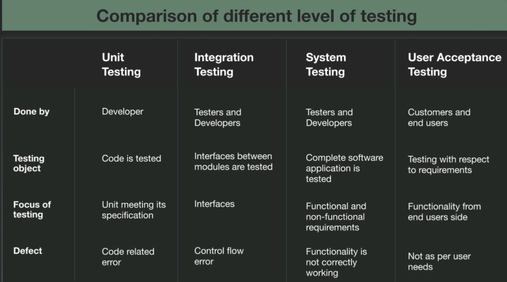

### TDD: pros & cons 

|Advantage 优势|Disadvantage|
|---|---|
|More tests, less debugging  <br>更多测试，更少调试|Difficult in certain scenarios (UI, database, network)  <br>在某些情况下（UI、数据库、网络）很难|
|More productive 更高效|Needs management support 需求管理支持|
|Validates not only code, but also design  <br>不仅验证代码，还验证设计|Developer blind spots 开发人员盲点|
|Better test coverage, greater confidence  <br>更好的测试覆盖率，更大的信心|False sense of security 虚假的安全感|
|Better code structure 更好的代码结构|Maintenance overhead for (bad) tests  <br>（不良）测试的维护开销|

### unit test
A unit test is a type of automated test that is designed to validate the behavior of a single unit of code, typically a method or function. The goal of unit testing is to verify that the code under test works as expected and adheres to its specified requirements.
单元测试是一种自动测试，旨在验证单个代码单元（通常是方法或函数）的行为。单元测试的目标是验证待测试的代码是否按预期工作并遵守其指定的要求。
Unit tests are typically written using a testing framework, which provides a set of tools and methods for defining test cases and verifying their results. In Java, popular testing frameworks include JUnit and TestNG.
单元测试通常使用测试框架编写，该框架提供了一组用于定义测试用例和验证其结果的工具和方法。在Java中，流行的测试框架包括JUnit和TestNG。
Unit tests should ideally be written using a suite of repeatable and isolated tests that verify different inputs, edge cases, and outputs. Because unit tests are automated, they are also faster and more reliable than manual testing. They can be executed either as part of a continuous integration pipeline or on-demand during development.
理想情况下，单元测试应使用一套可重复和隔离的测试来编写，这些测试验证不同的输入、边缘情况和输出。由于单元测试是自动化的，因此它们也比手动测试更快、更可靠。它们可以作为持续集成管道的一部分执行，也可以在开发期间按需执行。

### Benefits of unit testing
+ Identify defects early (at development time) Otherwise small defects will lead to larger problems  
+ Allows easy defect isolation  
+ Improves confidence of code  
+ Encourage code review

## week 2
### JUnit Basics
JUnit tests are also called test methods in a test class Naming convention of test classes: name of class under test + Test E.g., ShoppingCartTest.java for ShoppingCart.java  
Test names should be meaningful and reflect purpose E.g., shouldReturnTrueWhenUsersHaveSameEmail()

### Test Annotations  
- `@BeforeEach`: This annotation is used to mark a method that should be run before each individual test case. This is typically used to set up any necessary test fixtures or dependencies before running the test.  
    `@BeforeEach` ：此注释用于标记应在每个测试用例之前运行的方法。这通常用于在运行测试之前设置任何必要的测试夹具或依赖项。
    
- `@AfterEach`: This annotation is used to mark a method that should be run after each individual test case. This is typically used to clean up any resources that were created during setup, or to reset the state of the system under test.  
    `@AfterEach` ：此注释用于标记应在每个单独的测试用例之后运行的方法。这通常用于清理在安装过程中创建的任何资源，或重置受测系统的状态。
    
- `@BeforeAll`: This annotation is used to mark a method that should be run once, before any test cases are executed. This is typically used to set up any resources or dependencies that will be used across all tests.  
    `@BeforeAll` ：此注释用于标记在执行任何测试用例之前应运行一次的方法。这通常用于设置将在所有测试中使用的任何资源或依赖项。
    
- `@AfterAll`: This annotation is used to mark a method that should be run once, after all test cases have been executed. This is typically used to clean up any resources or dependencies that were created in the `@BeforeAll` method.  
    `@AfterAll` ：此注释用于标记在执行所有测试用例后应运行一次的方法。这通常用于清理在 `@BeforeAll` 方法中创建的任何资源或依赖项。

### Test Assertions
Assertions allow us to compare expected vs actual behaviours (output values, exceptions, etc.) 断言允许我们比较预期行为与实际行为（输出值、异常等）
assertTrue() assertFalse()  assertEquals() assertNotEquals()  assertNull() assertNotNull()  assertSame() assertNotSame()  assertArrayEquals() assertThrows()  

### The difference between a test plan and a test strategy
[The difference between a test plan and a test strategy - Inspired Testing](https://www.inspiredtesting.com/news-insights/insights/353-the-difference-between-a-test-plan-and-a-test-strategy#:~:text=vs%20Test%20Plan-,Test%20Plan,testing%20nee)  
  
|Test Plan 测试计划|Test Strategy 测试策略|
|---|---|
|A test plan for software project can be defined as a document that defines the scope, objective, approach and emphasis on a software testing effort  <br>软件项目的测试计划可以定义为定义软件测试工作的范围、目标、方法和重点的文档|Test strategy is a set of guidelines that explains test design and determines how testing needs to be done  <br>测试策略是一组指南，用于解释测试设计并确定需要如何进行测试|
|Components of Test plan include- Test plan id, features to be tested, test techniques, testing tasks, features pass or fail criteria, test deliverables, responsibilities, and schedule, etc.  <br>测试计划的组件包括 - 测试计划 ID、要测试的功能、测试技术、测试任务、功能通过或失败标准、测试可交付成果、职责和时间表等。|Components of Test strategy includes- objectives and scope, documentation formats, test processes, team reporting structure, client communication strategy, etc.  <br>测试策略的组成部分包括目标和范围、文档格式、测试流程、团队报告结构、客户沟通策略等。|
|Test plan is carried out by a testing manager or lead that describes how to test, when to test, who will test and what to test  <br>测试计划由测试经理或主管执行，描述如何测试、何时测试、谁将测试以及测试什么|A test strategy is carried out by the project manager. It says what type of technique to follow and which module to test  <br>测试策略由项目经理执行。它说明了要遵循哪种类型的技术以及要测试的模块|
|Test plan narrates about the specification  <br>测试计划叙述有关规范|Test strategy narrates about the general approaches  <br>测试策略叙述了一般方法|
|Test plan can change 测试计划可以更改|Test strategy cannot be changed  <br>无法更改测试策略|
|Test planning is done to determine possible issues and dependencies in order to identify the risks.  <br>执行测试计划以确定可能的问题和依赖项，以便识别风险。|It is a long-term plan of action.You can abstract information that is not project specific and put it into test approach  <br>这是一项长期行动计划。您可以抽象出非项目特定的信息并将其放入测试方法|
|A test plan exists individually  <br>单独存在测试计划|In smaller projects, the test strategy is often found as a section of a test plan  <br>在较小的项目中，测试策略通常作为测试计划的一部分。|
|It is defined at project level  <br>它是在项目级别定义的|It is set at organization level and can be used by multiple projects  <br>它是在组织级别设置的，可以由多个项目使用|

## week 3 Discrete maths
### label 
+ And(∧) 与；且  
+ Or(∨) 或  
+ Implies(⇒) 实质蕴含  
+ Equiv(⇔)实质等价  
+ ⊢ 推导出 

### Predicate Logics 谓词逻辑
+ Universal (∀) 任意  
+ existential (∃) 存在  
+ Set（P）集合  
+ ∃x (P(x) ⋀ Q(x)) 在P，Q两个集合中都存在x
### set 
+ 无顺序，不重复 == Java重的set概念  
+ {1,2,3,4}  {x : N | x ≤ 64}  
+ N：非负整数集合或自然数集合{0,1,2,3,...}  
+ Z：整数集合{...,-1,0,1,...}  
+ Q：有理数集合  
+ R：实数集合(包括有理数和无理数）  
+ ∅ ：空集（不含有任何元素的集合）  
+ N*或N+：正整数集合{1,2,3,...}
+ Membership: 属于  
+ Set inclusion:  Subset: 子集  Proper subset:真子集  
+ Set cardinality:  `#A` = 3 集合元素个数 ｜A｜
+   
### Power set P
A power set is set of all subsets, empty set and the original set itself 幂集是所有子集、空集和原始集本身的集合   
+ $∀X • X$   is a set, $Px = {A|A ⊆ X}$  
+ for every X, Px (which is defined as the set of all subsets of X) is a set.对于每个 X，Px（定义为 X 的所有子集的集合）是一个集合。
+ power set of A = {1, 2} is P(A) = {{}, {1}, {2}, {1, 2}}

### Set operations 集合运算
+ Union并集 : $A 𝕌 B$  The set containing all the elements of  which all other sets are subs
+ Intersection交集 : $A∩B$  Items common in A,B
+ Difference : 差集 A - B; A = {1, 2, 3, 4, 5, 6} and B = {3, 4, 5, 6, 7, 8},A – B = {1, 2},B – A = {7, 8},
+ Cartesian product笛卡尔积 : `{a, b} ⇥ {0, 1} = {(a, 0), (a, 1), (b, 0), (b, 1)}`

### Relations ( ⇔) 两个集合间的逻辑联系
Relations (R) are defined over sets  A relation is a collection of ordered pairs, which  contains an object from one set to the other set 关系 (R) 是在集合上定义的 关系是有序对的集合，其中包含从一个集合到另一个集合的对象 Can be one-to-one, one-to-many  or many-to-one, many-to-many  
The Cartesian product deals with ordered pairs, so  the order in which the sets are considered is 笛卡尔积处理有序对，因此考虑集合的顺序是  `friends : Person ⇔ Person`  
$X х Y = {(x, y)} | x ∈ X and y ∈ Y} Where X х Y ≠ Y х X$  
Using n(A) for the number of elements in a set A, we have $n(X х Y) = n(X) х n(Y)$ 

### functions (→ )
函数是一种特殊的关系类型。这种特殊类型的关系描述了一个元素如何映射到另一个集合或同一个集合中的另一个元素  
It is a relation that defines the set of  inputs to the set of outputs.  Note that all functions are relations, but  not all relations are functions 它是定义输入集到输出集的关系。请注意，所有函数都是关系，但并非所有关系都是函数  
`→ `  implies/ when used in functions, it  symbolises mapping A→B, if A is true then B is also true.  If A is false then nothing said about  B  
`age : Person N`  `birthday : Person → Date`  

### Undirected graphs 无向图
  
$G = (V, E)$  定义称二元组G=(V,E)是一个无向图(undirected graph)
+ <mark style="background: #ff0000;">V: a non-empty set of nodes {n1, n2 , n3, ..., nm }</mark>   V是一个非空有限集合 
+ <mark style="background: #ff0000;">E: a set of edges {e1, e2, ..., ep}, where each ek = (ni, nj)</mark>  E是V中元素的无序对所组成的集合  
+ 把V的元素叫做图的顶点 (vertex)，E的元素叫做图的边 (edge)。V(G)表示图G的顶点集，E(G)表示图G的边集。若 |V(G)|=n，则称G为n阶图  
#### Representation & Degree
`V = {n 1 , n 2 , n 3 , n 4 , n 5 , n 6 , n 7}`  
`E = {e1 , e2 , e3 , e4 , e 5 , } = {(n 1 , n 2 ), (n 1 , n 4 ), (n 2 , n 5 ), (n 3 , n 4 ), (n 4 , n 6 )}`  
<mark style="background: #0000CD;">Degree of node : No. of edges that have that node as  an endpoint</mark>  
`degree(n 1 ) = 2, degree(n 4 ) = 3,  degree(n 7 ) = 0`  
+ Degree 度， 节点边的数量 （环算作两条边）  
+ Path路径，多条相连的边的组合 Nodes ni and nj are connected if they  are in a path.  A component is a maximal set of  connected node 如果节点 ni 和 nj 在一条路径中，则它们是连通的 分量是连通节点的最大集合 `Path(n1,n5) = (n1, n2, n5) = <e1,  e4>` 
### Directed graphs 有向图

+ 头/原点 Source， indgree = 0  
+ 终点 Sink， outdgree = 0  
+ 入度 indgree 汇入节点的边的数量  
+ 出度 outdgree 从节点引出的边的数量
#### Semi -Paths

#### n-Connectedness

#### Strongly connected components 强连通分量


### McCabe’s Cyclomatic complexity圈复杂度 
[Cyclomatic Complexity in Software Testing (Example)](https://www.guru99.com/cyclomatic-complexity.html)  
[Cyclomatic Complexity - GeeksforGeeks](https://www.geeksforgeeks.org/cyclomatic-complexity/)  
圈复杂度（Cyclomatic Complexity）是衡量计算机程序复杂程度的一种措施。它根据程序从开始到结束的线性独立路径的数量计算得来的.圈复杂度越高，代码就越难复杂难维护。坑就越大。
计算公式1：V(G)=E-N+2P。其中，E表示控制流图中边的数量，N表示控  制流图中节点的数量，P图的连接组件数目（图的组件数是相连节点的最大集合）
`(G) = #E - #V + p` — Strongly connected graph  
`V(G) = #E - #V + 2p` — Not strongly connected graph  

The cyclomatic complexity calculated for above code will be from control flow graph. The graph shows seven shapes(nodes), seven lines(edges), hence cyclomatic complexity is 7-7+2 = 2.   为上述代码计算的圈复杂度将来自控制流图。该图显示了七个形状（节点），七个线（边），因此圈复杂度为 7-7+2 = 2。
```
If (Condition 1)
Statement 1

Else
Statement 2

If (Condition 2)
Statement 3

Else
Statement 4
```
+ Nodes (N): 节点 （N）：There are 6 nodes in the control flow graph.控制流图中有 6 个节点。
+ Edges (E): 边缘 （E）：There are 7 edges in the control flow graph.控制流图中有 7 条边。
+ Connected components (P):连接的组件 （P）There is 1 connected component in the control flow graph.控制流图中有 1 个连接的组件。
+ M = E - N + 2P = 7 - 6 + 2(1) = 3
+ Therefore, the cyclomatic complexity of this code is 3. This value represents the number of independent paths through the code, and can be used to estimate the number of test cases needed to achieve full code coverage. In this case, we determined that at least 4 test cases are needed to cover all possible branches, which is consistent with the cyclomatic complexity metric of 3.因此，此代码的圈复杂度为 3。此值表示通过代码的独立路径数，可用于估计实现完整代码覆盖所需的测试用例数。在这种情况下，我们确定至少需要 4 个测试用例来覆盖所有可能的分支，这与圈复杂度度量 3 一致。

This metric is useful because of properties of Cyclomatic complexity (M) –  
由于圈复杂度 （M） –
1. M can be number of test cases to achieve branch coverage (Upper Bound)  
    M可以是测试用例的数量，以实现分支覆盖（上限）
2. M can be number of paths through the graphs. (Lower Bound)  
    M 可以是通过图形的路径数。（下限）


## week 4
### 黑盒测试 Blackbox
1. 黑盒代表盒子是不透明的  
2. 关注输入和输出，而忽略盒子里面的操作  
3. 有Functional 和Non-functional之分 Functional ：具体功能，登陆，注册等  Non-Functional：稳定性，安全性，易用性等  
4. Equivalence Partitioning  Testers can divide possible inputs into groups or “partitions” 
5. Boundary Value Analysis  Testers can identify that a system has a special response around a specific boundary value.  
6. Decision Table Testing  Many systems provide outputs based on a set of conditions.
### Normal Boundary Value Testing (NBVT) 边界值测试

### Robustness testing
For each variable, we need to test its minimum and maximum values, which gives us 2n test cases. The total number of test cases required for the robust version of BVT is: 2n (minimum and maximum values) + 4n + 1 (normal values) 对于每个变量，我们需要测试它的最小值和最大值，这给了我们 2n 个测试用例。健壮版BVT所需的测试用例总数为：2n（最小值和最大值）+4n+1（正常值）

### Worst case testing

### Robust worst-case testing

### Equivalence class testing 等价类测试


### weak normal equivalence class testing
Let Cx denote the equivalence classes of valid values for variable x (Cx is a set of equivalence classes). Then the number of test cases is max (#Cxi ), for xi ranging over all variables. That is, the maximum number of equivalence classes for all variables 令 Cx 表示变量 x 的有效值的等价类（Cx 是一组等价类）。那么测试用例的数量是最大的（#Cxi），因为 xi 遍及所有变量。即所有变量的最大等价类数  

### Weak robust equivalence class testing.
We assume the same settings as in the previous question. Let Ixi denote the  equivalence classes of invalid values for variable xi . Let n denote the number of variables.  the number of tests is max (#Cxi ) +  nXi=1(#Ixi ), for xi ranging over all variables. Basically, we include also the total number of test cases in the invalid areas for each variable. Note that cardinality of Ixi may not always be 2 since there may be gaps between valid equivalence classes  我们采用与上一个问题相同的设置。设 Ixi 表示变量 xi 的无效值的等价类。设 n 表示变量的数量。测试次数为 max (#Cxi ) + nX i=1 (#Ixi )，xi 遍及所有变量。基本上，我们还包括每个变量的无效区域中的测试用例总数。请注意，Ixi 的基数可能并不总是 2，因为有效等价类之间可能存在间隙

### Decision table Testing

#### how to make dtt
in the example each of the three variables a, b and c is the length of a side from the range `[1, 200]`. Come up with test cases for weak normal equivalenceclass testing that cover the same expected outputs 在示例中，三个变量 a、b 和 c 中的每一个都是范围 [1, 200] 中的边的长度。提出涵盖相同预期输出的弱正态等价类测试的测试用例  
equivalence classes:  
+ D1 = {(a, b, c) | a = b = c}  
+ D2 = {(a, b, c) | a = b ∧ a̸ = c ∧ c < a + b}  
+ D3 = {(a, b, c) | a̸ = b ∧ a̸ = c ∧ b̸ = c ∧ a < b + c ∧ b < a + c ∧ c < a + b}  
+ D4 = {(a, b, c) | a = b + c}  
+ D5 = {(a, b, c) | a > b + c}
  

### testing effort
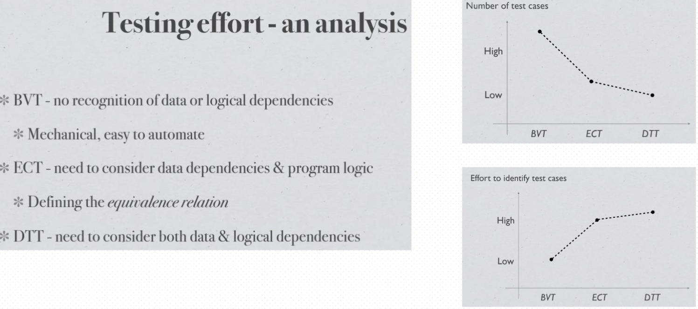

### Difference Between Equivalence Class Testing & Boundary Value Analysis:
[Equivalence Class Testing: Complete Guide |Professionalqa.com](https://www.professionalqa.com/equivalence-class-testing)  

|Equivalence Class Testing  <br>等效等级测试|Boundary Value Analysis 边界值分析|
|---|---|
|1. Equivalence Class Testing is a type of black box technique.  <br>1. 等效类测试是一种黑盒技术。|1. Next part of Equivalence Class Partitioning/Testing.  <br>1. 等效类分区/测试的下一部分。|
|2. It can be applied to any level of testing, like unit, integration, system, and more.  <br>2.它可以应用于任何级别的测试，如单元，集成，系统等。|2. Boundary value analysis is usually a part of stress & negative testing.  <br>2. 边界值分析通常是压力和负测试的一部分。|
|3. A test case design technique used to divide input data into different equivalence classes.  <br>3. 一种测试用例设计技术，用于将输入数据划分为不同的等价类。|3. This test case design technique used to test boundary value between partitions.  <br>3. 此测试用例设计技术用于测试分区之间的边界值。|
|4. Reduces the time of testing, while using less and effective test cases.  <br>4.减少测试时间，同时使用更少和有效的测试用例。|4. Reduces the overall time of test execution, while making defect detection faster & easy.  <br>4. 减少测试执行的总时间，同时使缺陷检测更快、更容易。|
|5. Tests only one from each partition of the equivalence classes.  <br>5. 从等效类的每个分区中仅测试一个。|5. Selects test cases from the edges of the equivalence classes.  <br>5. 从等效类的边缘选择测试用例。|
## week 5
### 白盒测试 Whitebox  
1. 白盒代表盒子是透明的  
2. 不仅关注输入和输出，同时关注盒子内的代码结构  
3. Testing structure of the software  
4. 将代码转换成数学模型
### Program graph
1. 有向图  
2. 点Node代表 Statement  
3. 边Edge代表 Flow  
4. 多行Statement可浓缩

### DD-path （Decision-to-decision path 决策到决策路径）  
主要着眼测试覆盖率问题。程序有向图中存在分支，覆盖率考虑的是对各个分支情况的测试覆盖程度，因此对有向图中线性串行的部分进行压缩，在压缩图(即DD-路径)的基础上进行测试用例设计，用测试覆盖指标考察测试效果 
  
###  Basic Path Test 基础路径测试 - 找出最佳测试路径

## week6
### Functional decomposition 功能分解 / Block Diagram 模块图
1. 每一个方块代表了系统中一种功能  
2. 是软件设计的第一个草图  

### Integration Testing
1. System - hierarchically composed of units  
2. Objectives - testing of interfacing and interaction of units To expose problems arising from the combination To find a working solution from components  
3. 集成测试是在单元测试的基础上，测试在将所有的软件单元按照概要设计规格说明的要求组装成模块、子系统或系统的过程中各部分工作是否达到或实现相应技术指标及要求的活动。 也就是说，在集成测试之前，单元测试应该已经完成,集成测试中所使用的对象应该是已经经过单元测试的软件单元
#### Potential hazards
+ Internal - between components (Method invocation; Parameter; Method return) 单元间的接口，指的是代码间的相互调用，我们传递一些参数来判断测试调用有没有问题  
+ Interaction - at system boundary 集成后的功能，不同的功能之间是否会产生相互影响？
### Integration testing approaches
#### Decomposition-based 基于分解，功能分解，模块分解  
1. Big bang - all units together, no error localisation  大爆炸策略 一起运行 迅速 一次试运行成功率不大 问题定位和修改都比较困难 功能增强型项目
2. Top down - stubs, early demo  从上至下 较早的验证了主要的控制和判断点 首先实现和验证一个完整的软件功能 桩的开发和维护时本策略大 底层组件的测试不够充分 适合产品控制结构相对清晰和稳定，产品的高层接口变化比较小，产品的底层接口未定义或者经常可能被修改，产品的控制组件具有较大的技术风险，需要尽早的被验证
3. Bottom up - terminal, drivers  从下至上 集成测试开始阶段可能会并行的进行集成 驱动的开发工作量也很庞大。对于高层的验证被推迟到了最后，设计上的错误不能被及时发现 适用范围 底层接口比较稳定、变动较少的产品高层接口变化比较频繁的产品底层组件较早被完成的产品
4.  Sandwich - a combination of the above 2  在测试的时候，对目标层的上一层使用自顶向下的集成策略对目标的下一层使用自底向上的集成策略，最后测试在目标层会合

#### Call graph-based  
1. Pairwise integration   Instead of testing all possible combinations of inputs, pairwise integration testing only tests combinations of input pairs. identify defects or issues that arise due to the interactions between two components, while minimizing the number of test cases needed. 成对集成测试的目标是识别由于两个组件之间的交互而产生的缺陷或问题，同时最大限度地减少所需的测试用例数量。
2. Neighbour integration   testing only the interactions between adjacent modules that are directly connected to one another in the call graph. 仅测试在调用图中直接相互连接的相邻模块之间的交互。

#### Path-based
In path-based integration testing, the system is tested for different combinations of inputs, and the resulting output paths are compared against the expected output paths. This technique aims to ensure that the system functions correctly when inputs are combined to achieve different outcomes.
在基于路径的集成测试中，测试系统的不同输入组合，并将生成的输出路径与预期的输出路径进行比较。该技术旨在确保当输入组合以实现不同的结果时，系统正常运行。
#### Module Execution Path (MEP)
message method sequence of module execution paths  


## week8
### Software complexity metrics 软件（复杂度）度量 - Structure 结构度量
+ Control-flow structure: the sequence in which instructions are executed in a program.控制流结构：指令在程序中执行的顺序。  
+ Data-flow structure: the trail of a data item created or handled by a program. 数据流结构：一个程序中的数据项从创建到处理的轨迹。  
+ Data structure: the organization of the data itself, independent of the program. 数据结构：数据本身的组织，独立于程序。
### A decomposition tree

Sequence: P1;P2 - Sequence of P1 & P2 Merge the terminal node of P1 with the initial node of P2. P1;P2 - P1 & P2 的序列 将 P1 的终端节点与 P2 的初始节点合并  
Nesting: P1(P2 , x) - nesting of P2 onto P1 at node x Replace x with P2 ,P1(P2 , x) - 在节点 x 处将 P2 嵌套到 P1 上 用 P2 替换 x


### Morphology metrics


## week9
### mutation testing 突变/变异测试
[Mutation operators](https://pitest.org/quickstart/mutators/)  
1. 通过一系列的规则生成新的Java 代码  类似<变<=; +变- ；i++变i--去掉call void method   Remove condition 变if（true）  
2. 使用新生成的代码跑现有的Unit Test，如果现有的test method有效  性非常高，所有的test必然失败  MT之后，test失败的越多，test method越好   MT是针对test的test，测试UT是否完备  
3. MT生成的代码是根据Compile生成的代码而不是原代码 （不改变 source code）
4. Killing the mutation  Each mutated version is called a mutant and tests detect and  reject mutants by causing the behavior of the original version to  differ from the mutant. This is called killing the mutant. 简言之，mutation test会在程序编译或运行时插入微小的差异(mutant)， 理想的测试用例应当能够检测出这些差异带来的程序行为异常。如果一 个mutant引发的程序行为异常能够被testcases捕捉并导致testcases失 败，则称mutant被消灭（killed）；反之如果mutant带来的程序行为变 化无法被测试用例捕捉，则称mutant存活（survived/ alive）
5. quivalent mutation a mutant cannot be killed by any set of test data. This type of mutants is said to be functionally equivalent to the originalprogram当改变任何测试数据，这个test都fail不了mutation叫做equivalent

## week11
### Finding threads- Finite State Machines


# Mock exam
## Unit Testing
### Q1
Consider a program FizzPrime that takes as input two non-negative integers, x and i, both between 0 and 100, both inclusive. The number x is a prime numbers. As output, the program prints the number i itself within the range ([0, 100]) when it is not divisible by x. For multiples of x, but not multiples of x^2, the program should print “Fizz” instead of the number. For multiples of x^2 but not multiples of x^3, the program should print “Prime”. Finally, for numbers which are multiples of x^3 the program should print “FizzPrime” instead. 考虑一个程序 FizzPrime，它将两个非负整数 x 和 i 作为输入，它们都在 0 到 100 之间，包括两者。数字 x 是质数。作为输出，程序在 ([0, 100]) 范围内打印不能被 x 整除的数字 i 本身。对于 x 的倍数，但不是 x2 的倍数，程序应该打印“Fizz”而不是数字。对于 x2 的倍数而不是 x3 的倍数，程序应该打印“Prime”。最后，对于 x3 的倍数，程序应该打印“FizzPrime”。
####  robust equivalence classes
a) (5 marks) Develop robust equivalence classes for the input variables x and i given the  above specification. a)（5 分）根据上述规范为输入变量 x 和 i 开发稳健的等价类  

x 
+ invalid:1. X < 0 ; X >100;  x is not a prime number  
+ valid: x >= 0 ,x<=100,x is a prime number

i  
+ invalid:1. i < 0 ;  i >100;  
+ valid: i >= 0 ,i<=100

Equivalence (i, Fizz, Prime, FizzPrime)  
	R1 = {x,i is valid, i cannot be divided by x}  
	R2 = {x,i is valid, i canbe divided by x but cannot be divided by x^2}  
	R3 = {x,i is valid, i canbe divided by x^2 but cannot be divided by x^3}  
	R4 = {x,i is valid, i canbe divided by x^3}  
	R5 = {x <0 ,i is valid} R6 = {x >100, i is valid} R7 = {X is not a prime, i is valid}  
	R8 = {i <0 ,x is valid} R9 = {i >100, x is valid}  

|test Case|x|i|Expected Output|
|---|---|---|---|
|R1|3|4|4|
|R2|3|6|Fizz|
|R3|3|9|Prime|
|R4|3|27|FizzPrime|
|R5|-1|-|Error input|
|R6|101|-|Error input|
|R7|4|-|Error input|

#### robust boundary value testing
develop test cases using the robust (not worst-case) version of the boundary value testing technique   

|Test Case |x|i|Expected Output |Explanation |
|---|---|---|---|---|
|1|-1|7|Invalid input 输入无效|Input x is less than the lower boundary (0-100), invalid.  <br>输入 x 小于下限 （0-100），无效。|
|2|0|7|Invalid input 输入无效|Input x is less than the lower boundary (0-100), invalid.  <br>输入 x 小于下限 （0-100），无效。|
|3|1|7|Invalid input 输入无效|Input x is less than the lower boundary (0-100), invalid.  <br>输入 x 小于下限 （0-100），无效。|
|4|7|7|Fizz 嘶嘶声|i is equal to x, so "Fizz" is printed.  <br>i 等于 x，因此打印“嘶嘶声”。|
|5|99|7|Invalid input 输入无效|Input x is greater than the upper boundary (0-100), invalid.  <br>输入 x 大于上限 （0-100），无效。|
|6|100|7|Invalid input 输入无效|Input x is greater than the upper boundary (0-100), invalid.  <br>输入 x 大于上限 （0-100），无效。|
|7|101|7|Invalid input 输入无效|Input x is greater than the upper boundary (0-100), invalid.  <br>输入 x 大于上限 （0-100），无效。|
|8|7|-1|Invalid input 输入无效|Input i is less than the lower boundary (0-100), invalid.  <br>输入 i 小于下限 （0-100），无效。|
|9|7|0|0|Number i is not divisible by x, so it remains unchanged.  <br>数字 i 不能被 x 整除，因此保持不变。|
|10|7|1|1|Number i is not divisible by x, so it remains unchanged.  <br>数字 i 不能被 x 整除，因此保持不变。|
|11|7|99|99|Number i is not divisible by x, so it remains unchanged.  <br>数字 i 不能被 x 整除，因此保持不变。|
|12|7|100|100|Number i is not divisible by x, so it remains unchanged.  <br>数字 i 不能被 x 整除，因此保持不变。|
|13|7|101|Invalid input 输入无效|Input i is greater than the upper boundary (0-100), invalid.  <br>输入 i 大于上限 （0-100），无效。|

#### Blackbox testing analysis/selection
You have been given the task of performing blackbox testing on an implementation of the above algorithm. Of the main blackbox testing techniques we have discussed: boundary value testing (BVT), special value testing (SVT), equivalence class testing (ECT), and decision table-based testing (DTT), explain why each technique is(or is not) appropriate. 您的任务是对上述算法的实现执行黑盒测试。在我们讨论的主要黑盒测试技术中：边界值测试 (BVT)、特殊值测试 (SVT)、等价类测试 (ECT) 和基于决策表的测试 (DTT)，解释为什么每种技术是（或不是） ） 合适的  
+ BVT: Not a appropriate, because not consider the x is a prime and output logic.
+ SVT: is appropriate, because consider the x is a prime and output logic.
+ ECT: is appropriate
+ DTT: is appropriate, it consider the out put logic

### Q2
The minimax algorithm is a way of finding an optimal move in a two-player game for one player, by minimising the possible loss for the worst case scenario (maximum loss). It has been widely used in 2-player zero-sum game plays. The algorithm for the depth limited minimax algorithm is given below. minimax 算法是一种通过最小化最坏情况下的可能损失（最大损失）来为一个玩家在两人游戏中找到最佳移动的方法。它已广泛用于 2 人零和游戏。下面给出深度受限极小极大算法的算法。
```
/*
minimax(node, depth, maximisingP layer)  
Input: node B    //Node where search begins.  
Input: depth B    //the maximum depth to search.  
Input: maximisingPlayer //Boolean value representing the player for which the search is performed.  
Output: the best value
*/
```
#### program graph

#### cyclomatic complexity of the program graph
C= E-V+2p E: 边的数量 N: 节点的数量 P: 连通分量的数量
Total branches (E) = 2 (for the first "if" statement) + 2 (for the second "if" statement) + N (for the "foreach" loop condition) 总分支 （E） = 2（对于第一个“if”语句）+ 2（对于第二个“if”语句）+ N（对于“foreach”循环条件）
Cyclomatic Complexity = E - N + 2  = (2 + 2 + N) - N + 2 = 6
### Q3
#### program graph

#### Cyclomatic complexity
draw the final condensed graph for the program graph you came up with in part (a)  above, and ii. calculate the Cyclomatic complexity of the condensed graph you draw  

### Q3
Given an undirected graph G with vertices V = {1, 2, 3, 4, 5, 6, 7, 8} and edges E = {12, 14, 16, 22, 23, 28, 34, 35, 67, 78}
#### undirected graph/directed graph
  
#### node degree
Calculate the degree of each node in the graph.
  

#### Cyclomatic number
The Cyclomatic number of of G, `V (G) = #E − #V + p = 10 − 8 + 1 = 3`  
#### source nodes or sink nodes
Source nodes: 1 Sink nodes: 4, 5, 8

#### semi-paths
Yes, (12, 23, 16, 67), (12, 28, 16, 67), and (12, 23, 34, 16, 67, 78) are semi-paths  

#### x-connected node
0-connected: none. 1-connected: 2 & 6, 3 & 7, etc. 2-connected: 1 & 2, 6 & 7, etc. 3-connected: none.  

#### reachability matrix


## Integration Testing
### Q3 select reasonable integration method 
One of the goals of integration testing is to be able to isolate faults when a test case causes a failure. Consider integration testing for a program written in a procedural/object-oriented programming language. Rate the following integration strategies on their abilities of (1) relative fault isolation and (2) testing of co-functionality. You also need to provide a rationale for your answer 集成测试的目标之一是能够在测试用例导致故障时隔离故障。考虑对使用面向过程/面向对象的编程语言编写的程序进行集成测试。评价以下集成策略在 (1) 相对故障隔离和 (2) 协同功能测试方面的能力。您还需要为您的回答提供理由  
Show your ratings graphically by placing the letters corresponding to a strategy on a line, as in the example below. Suppose that for the ability of fault isolation, strategies X and Y are about equal and not very effective, and strategy Z is very effective. Note that this rating is relative and qualitative, so don’t agonise over where exactly to put a  strategy, but focus on their relative position.  
A Big bang  
B Decomposition-based top-down integration  
C Decomposition-based bottom-up integration  
D Decomposition-based sandwich integration  
E Call graph-based pairwise integration  
F Call graph-based neighbourhood integration (radius 1)   
G Call graph-based neighbourhood integration (radius 2)  

the ranking of fault isolation from highest to lowest: 
A is the worst. E>F>G. B≈C > D 
pairwise is from two random points but Decomposition only select one unknown pts.
### Q2
  
####   MM-paths  
For example, the MM-path for component D (UserDAO) is MEP (D, 1) = (1, 2, 3). The MM-path for component E (MissionDAO) is MEP (E , 1) = (1, 2, 3)  
+ MEP(A,1) = (1,2,3,5)  MEP(A,2) = (1,2,4)  MEP(A,3) = (5)  
+ MEP(B,1) = (1,2,3,8)  MEP(B,2) = (1,2,4)  MEP(B,3) = (5,6,8)  MEP(B,4) = (5,7)  MEP(B,5) = (8)  
+ MEP(C,1) = (1,2)  MEP(C,2) = (3,4,8)  MEP(C,3) = (3,5,6,8)  MEP(C,4) = (3,5,7,8
#### MM-path complexity
5 edges between A and B  2 edges between B and E  4 edges between C and D  7 edges between B and C  
The Cyclomatic complexity is `V (G) = #E − #V + p = 18 − 5 + 1 = 14`  

## Software Metrics
### Q4
∃A, B : Program • M (A) + M (B) < M (A + B)  
where M represents a given metric and A + B represents the composition of A and B  
Given a program, the repeated application of the following two operations can be used to  decompose it into a unique tree of structured programming constructs.  
Sequence: composing two program graphs sequentially by merging one program graph’s  terminal node with the other program graph’s initial node. For example, sequential  composition of programs A and B is denoted by A; B.  
Nesting: replacing one node in one program with the entirety of another program. For  example, nesting program B in program A at node x of A is denoted by A(B, x).  
The depth of nesting values of programs constructed by the above two operations are defined as below  
Sequence: n(P1; P2; . . . ; Pn) = max(n(P1), n(P2), . . . , n(Pn)), and  
Nesting: n(P1(P2; . . . ; Pn)) = 1 + max(n(P2), . . . , n(Pn)), where P2, . . . , Pn are sequentially  nested inside P1  
Pn sequence (n = 1, 2, . . .) D2 while loop  D0 if-then D3 do-while loop  D1 if-then-else Cn case-switch  
The depth of nesting value for all the above constructs is 1 except for P1, which is 0. The  depth of nesting value of a program is calculated in a bottom-up fashion.  
For Weyuker’s property 9 and the metric depth of nesting n(P ) of a valid program P , do the  following:  
(a) State whether the property holds or not.  (b) Prove your claim (informally).
Sequence:
n(A) = n(px) ; n(B) = n(py)  
n(A+B) = n(px;py) =max(n(px),n(py)) == n(A) or n(b);  n(A+B) <= n(A) + n(b}
Nesting:  
n(A) = n(p1) = 0  ; n(B) = n(p2) = 1  
n(A+B) = n(p1(p2)) = 1 + max(n(p2)) = 2  ; n(A) + n(B) < n(A+B)

## Mutation Testing
### Q1
The following Java method, min, returns the smallest of three integer parameters  
```java
1 public int min ( int a , int b , int c ) {  
2 int temp = a ;  
3 if ( b < a ) {  
4 temp = b ;  
5 }  
6 if ( c < b ) {  
7 temp = c ;  
8 }  
9 return temp ;  
10 }
```
#### equivalent mutant
come up with an equivalent mutant by applying a first-order mutation. In your answer, identify: 1. The mutation operator applied, 2. The associated statement to be changed, and 3. What the statement is changed to.  
	Mutation Operator Applied: Relational Operator Replacement
	应用的突变运算符：关系运算符替换
	This mutation operator involves changing the relational operator (e.g., >, <, = =, etc.) in a conditional statement.此突变运算符涉及更改条件语句中的关系运算符（例如， > 、 < 、 == 等）。
	Associated Statement to be changed: Line 6 - if (c < b)要更改的相关语句：第 6 行 - if (c < b)
	What the statement is changed to: We will change the < operator to <=, resulting in the modified statement: if (c <= b)语句更改为：我们将 < 运算符更改为 <= ，导致修改后的语句： if (c <= b)
#### non-equivalent first-order mutants
devise a set of three test cases that achieves 100% statement coverage. Come  up with three non-equivalent first-order mutants of the original program, making use one of the following mutation operators in each mutant. Determine the kill rate of your  test suite on the three mutants.  The mutation operators you can use are:  ror Relational operator replacement.  sdl Statement deletion. uoi Unary operator insertion.   

|Test Case|Input|Expected Output|
|---|---|---|
|Case 1|a = 5, b = 3, c = 7|3|
|Case 2|a = 4, b = 6, c = 2|2|
|Case 3|a = 1, b = 2, c = 1|1|

|Mutant 突变体|Operator 算子|Description 描述|Original Statement 原始声明|Mutated Statement 突变声明|Test Case Killed 测试用例被杀|
|---|---|---|---|---|---|
|Mutant 1 突变体 1|ror|Relational Operator Replacement  <br>关系运算符替换|if (b < a) 如果（b < a）|if (b >= a) 如果 （b >= a）|Case 1, Case 3 案例 1、案例 3|
|Mutant 2 变种人2|sdl|Statement Deletion 语句删除|if (c <= b) 如果 （c <= b）|_delete line 删除行_|Case 1, Case 2 案例 1、案例 2|
|Mutant 3 变种人3|uoi|Unary Operator Insertion 一元运算符插入|temp = c; 温度 = c;|temp = -c; 温度 = -c;|Case 2, Case 3 案例 2、案例 3|

All MT be killed by test cases, so the rate is 100%
#### statement coverage
is there a defect in the program? If so, develop the smallest set of test cases that achieves 100% statement coverage but does not reveal the defect. If not, develop  the smallest set of test cases that achieves 100% statement coverage.   

defect in the program is that it doesn't compare the value of a and c. if a=1,b=3,c=2.the result will be 2 instead of 1.   

|Test Case 测试用例|a|b|c|Expected Output 预期输出|
|---|---|---|---|---|
|1|1|3|2|1|
|2|3|2|1|1|

# week 1 Why testing & Objectives of this unit
##   Learning Objectives:

-   explain the importance of quality assurance in software engineering;
-   articulate the role of validation and verification methods in the system development life cycle; key issues in software testing, testing levels and testing techniques
##   lecture
### Goals of Software testing  
Functionality: software functions correctly  
Usability: ease of use  
Security: free from vulnerabilities and prevent exploits  
Reliability: frequency & criticality of failures (MTBF)  
Efficiency: speed, scalability  
Maintainability: update, modify the application if required  
Portability: compatibility with other environments/systems  
### Test-driven Development (TDD)

+ Test-driven development is a software development process relying on software requirements being converted to test cases before software is fully developed, and tracking all software development by repeatedly testing the software against all test cases.  
+ A Test case is a singular set of actions or instructions to perform that validates a specific aspect of a product or application functionality.

#### TDD visualised
  
1. Add a test (!)  
2. Run all tests, and confirm that the new test fails (!)  
3. Write/refine production code to cause the test to pass  
4. Run all tests again  
5. Refactor code if necessary  
6. Repeat
#### TDD: pros & cons
Advantage:  
+ More tests, less debugging  
+ More productive  
+ Validates not only code, but also  design  
+ Better test coverage, greater  confidence  
+ Better code structure

Disadvantage:  
+ difficult in certain scenarios  UI, database, network  
+ Needs management support  
+ Developer blind spots  
+ false sense of security  
+ Maintenance overhead for (bad) tests

###  black box testing
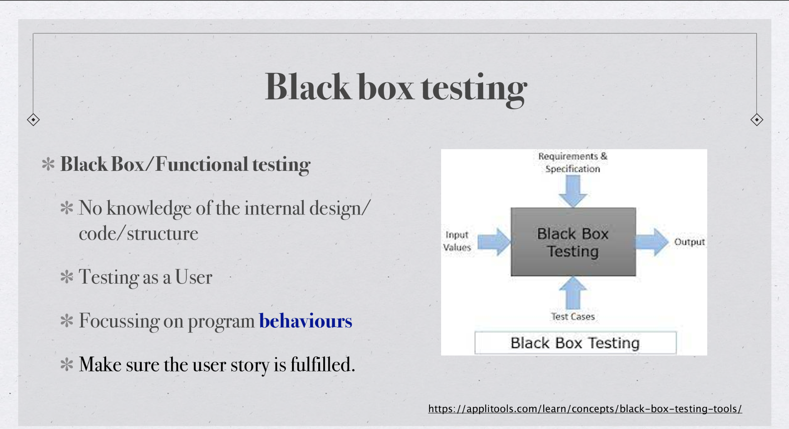
### white box testing

### comparison of different level of testing

## tutorial 
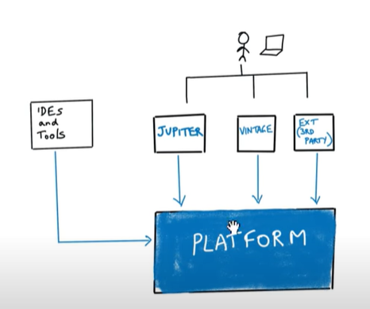  
```java
//pom.xml 
<?xml version="1.0" encoding="UTF-8"?>
<project xmlns="http://maven.apache.org/POM/4.0.0"
         xmlns:xsi="http://www.w3.org/2001/XMLSchema-instance"
         xsi:schemaLocation="http://maven.apache.org/POM/4.0.0 http://maven.apache.org/xsd/maven-4.0.0.xsd">
    <modelVersion>4.0.0</modelVersion>

    <groupId>io.javabrains</groupId>
    <artifactId>junit-5-basics</artifactId>
    <version>1.0-SNAPSHOT</version>

// maven properties
    <properties>
	    // level of java
        <maven.compiler.source>8</maven.compiler.source>
        // comile level of java
        <maven.compiler.target>8</maven.compiler.target>
        <project.build.sourceEncoding>UTF-8</project.build.sourceEncoding>
        // junit.jupiter.version and the reference of junit.jupiter dependencies
        <junit.jupiter.version>5.4.0</junit.jupiter.version>
    </properties>

    <dependencies>
	    // junit-jupiter-engine core platform runing the test
        <dependency>
            <groupId>org.junit.jupiter</groupId>
            <artifactId>junit-jupiter-engine</artifactId>
            <version>${junit.jupiter.version}</version>
            // where to active your library
            <scope>test</scope>
        </dependency>
	    //junit-jupiter-api where you using
        <dependency>
            <groupId>org.junit.jupiter</groupId>
            <artifactId>junit-jupiter-api</artifactId>
            <version>${junit.jupiter.version}</version>
            <scope>test</scope>
        </dependency>
    </dependencies>

</project>
```

### 2.1 Application: anagram detector
> An anagram of a word is another word produced by rearranging the letters of the original word, using all the original letters exactly once.6 For example, “listen” is an anagram of “silent”.   
> This application will need to include the following functionality.   
> 1. Given two words as input, return whether they are anagrams of each other. For example, for “listen” and “silent”, the detector should return true. For “pizza” and “donut”, the detector should return false.
2. Given a list of words separated by whitespace characters, return all the groups of words that are anagrams of each other. For example, assume that the detector is given the following text as input. `tews tis lives tamed elvis ream evils comics stew wets markers dashed west veils rat mace sit mated cosmic mare remarks shaded`  Given the above input, the detector will find the following groups of anagrams as output: `• tis sit
• tamed mated
• comics cosmic
• mare ream
• markers remarks
• dashed shaded
• west wets tews stew
• lives veils elvis evils
• rat
• mace`
> Note that the last two groups in the output represent the two words that do not have anagrams in the input

```java
import java.util.*;  
  
public class AnagramDetector {  
    // This is the main method of the program  
    public static void main(String[] args) {  
        // Create a scanner object to read user input from the console  
        Scanner input = new Scanner(System.in);  
        // Prompt the user to enter words separated by spaces  
        System.out.println("Enter words separated by spaces:");  
        // Read the user input as a single string  
        String words = input.nextLine();  
        // Split the string into an array of words  
        String[] wordsArray = words.split(" ");  
  
        // Call the getAnagramGroups method to group the words by anagrams  
        List<List<String>> anagramGroups = getAnagramGroups(wordsArray);  
  
        // Loop through each group of anagrams  
        for (List<String> group : anagramGroups) {  
            // Create a StringBuilder object to construct a string of words in the current group  
            StringBuilder sb = new StringBuilder();  
            // Loop through each word in the current group  
            for (String word : group) {  
                // Append the current word and a space to the StringBuilder object  
                sb.append(word).append(" ");  
            }  
            // Convert the StringBuilder object to a string and remove any extra spaces at the end  
            String result = sb.toString().trim();  
            // Print the string of words in the current group  
            System.out.println(result);  
        }  
    }  
  
    // This method takes an array of words and groups them by anagrams  
    public static List<List<String>> getAnagramGroups(String[] words) {  
        // Create a list to hold the groups of anagrams  
        List<List<String>> anagramGroups = new ArrayList<>();  
        // Create a map to hold each anagram and its corresponding group  
        Map<String, List<String>> anagramMap = new HashMap<>();  
  
        // Loop through each word in the input array  
        for (String word : words) {  
            // Convert the current word to a char array and sort it  
            char[] chars = word.toCharArray();  
            Arrays.sort(chars);  
            // Convert the sorted char array back to a string  
            String sortedWord = new String(chars);  
  
            // Check if the anagramMap already contains the current sorted word  
            if (anagramMap.containsKey(sortedWord)) {  
                // If it does, add the current word to the corresponding group  
                anagramMap.get(sortedWord).add(word);  
            } else {  
                // If it doesn't, create a new group for the current word  
                List<String> group = new ArrayList<>();  
                group.add(word);  
                // Add the new group to the anagramGroups list  
                anagramGroups.add(group);  
                // Add the current sorted word and its corresponding group to the anagramMap  
                anagramMap.put(sortedWord, group);  
            }  
        }  
  
        // Return the list of groups of anagrams  
        return anagramGroups;  
    }  
}
```
### TDD(Test-Driven Development) for 2.1
> Making use of the TDD process, write some tests for the above functionality and use them to guide you in writing the actual code that actually implements the functionality. You should do this iteratively
####  Iteration 1 
```java
@Test  
 /*  
check that the getAnagramGroups method returns an  
empty list when passed an empty array of words.  
*/  
void getAnagramGroupsEmptyList() {  
    String[] words = {};  
    List<List<String>> result = AnagramDetector.getAnagramGroups(words);  
    assertTrue(result.isEmpty());  
}
```
it return true so no need to modify
#### Iteration 2
```java
@Test  
    /*  
    * check that the getAnagramGroups method correctly groups    * a set of words that are all anagrams of each other    * */void getAnagramGroupsSameGroup() {  
    String[] words = {"listen", "silent", "enlist"};  
    List<List<String>> result = AnagramDetector.getAnagramGroups(words);  
    assertEquals(1, result.size());  
    assertTrue(result.get(0).contains("listen"));  
    assertTrue(result.get(0).contains("silent"));  
    assertTrue(result.get(0).contains("enlist"));  
}
```
it return true so no need to modify
####  Iteration 3
```java 
@Test  
public void testGetAnagramGroups() {  
    // Test case with no input  
    String[] emptyWordsArray = {};  
    assertTrue(AnagramDetector.getAnagramGroups(emptyWordsArray).isEmpty());  
  
    // Test case with single word input  
    String[] singleWordArray = {"hello"};  
    assertEquals(1, AnagramDetector.getAnagramGroups(singleWordArray).size());  
  
    // Test case with input containing only anagrams  
    String[] anagramWordsArray = {"race", "care", "acre"};  
    assertEquals(1, AnagramDetector.getAnagramGroups(anagramWordsArray).size());  
  
    // Test case with input containing no anagrams  
    String[] nonAnagramWordsArray = {"hello", "world", "java"};  
    assertEquals(3, AnagramDetector.getAnagramGroups(nonAnagramWordsArray).size());  
  
    // Test case with input containing multiple anagram groups  
    String[] multipleGroupsWordsArray = {"race", "care", "acre", "listen", "silent", "enlist"};  
    assertEquals(2, AnagramDetector.getAnagramGroups(multipleGroupsWordsArray).size());  
  
    
}
```
it all return true so no need to modify
#### Iteration 4
```java
@Test  
/*  
* This test case ensures that the getAnagramGroups method correctly  
* groups anagrams even when the input array contains duplicates  
* */  
public void testGetAnagramGroups_InputWithDuplicates_ReturnsAnagramGroups() {  
    AnagramDetector detector = new AnagramDetector();  
    List<List<String>> result = detector.getAnagramGroups(new String[]{"eat", "tea", "ate", "ape", "pea", "pea", "are"});  
    assertEquals(3, result.size());  
    assertTrue(result.contains(Arrays.asList("eat", "tea", "ate")));  
    assertTrue(result.contains(Arrays.asList("ape", "pea", "pea")));  
    assertTrue(result.contains(Collections.singletonList("are")));  
    assertFalse(result.contains(Arrays.asList("tea", "ate", "eat", "pea", "ape", "pea", "are")));  
}
```

### 2.2 k-th largest element of an array
>  write  a java program k-th largest element of an array user input an array sperate by , first and then input an int k, find the k-th largest element in this array.   
>  IF given an array -1, 0, 2, 6, 4 and  3, you are required to find the 3rd largest element of the array, which is 2
```java
import java.util.Arrays;  
import java.util.Scanner;  
  
public class KthLargestElement {  
  
    public static void main(String[] args) {  
        // Read input array from user  
        Scanner scanner = new Scanner(System.in);  
        System.out.print("Enter the array elements separated by comma: ");  
        String input = scanner.nextLine();  
        String[] values = input.split(",");  
        int[] arr = new int[values.length];  
        for (int i = 0; i < values.length; i++) {  
            arr[i] = Integer.parseInt(values[i].trim());  
        }  
  
        // Read the value of k from user  
        System.out.print("Enter the value of k: ");  
        int k = scanner.nextInt();  
  
        // Find the k-th largest element using findKthLargestElement()  
        int kthLargest = findKthLargestElement(arr, k);  
  
        // Print the k-th largest element  
        System.out.println("The " + k + "-th largest element is " + kthLargest);  
    }  
  
    public static int findKthLargestElement(int[] arr, int k) {  
      
	// If k is greater than the length of the array, return -1  
	if (k > arr.length) {  
	    return -1;  
	}  
	  
	// Sort the array in descending order  
	Arrays.sort(arr);  
	int x = arr.length - k;  
	int kthLargest = arr[x];  
	return kthLargest;
	}
}

```
terminal window  
```
Enter the array elements separated by comma: -1, 0, 2, 6, 4
Enter the value of k: 3
The 3-th largest element is 2

```

so we will test findKthLargestElement() method and make iteration
```java 
public static int findKthLargestElement(int[] arr, int k) {  
      
	// If k is greater than the length of the array, return -1  
	if (k > arr.length) {  
	    return -1;  
	}  
	  
	// Sort the array in descending order  
	Arrays.sort(arr);  
	int x = arr.length - k;  
	int kthLargest = arr[x];  
	return kthLargest;
}
```
#### Iteration 1: Simple Test Case
```java
@Test  
/*  
* an array with only one element, and we want to  
* find the 1st largest element. We expect the output to be the same element.  
* */  
public void testKthLargestElement() {  
    int[] arr = {3};  
    int k = 1;  
    int expected = 3;  
    int actual = KthLargestElement.findKthLargestElement(arr, k);  
    assertEquals(expected, actual);  
}  
  
@Test  
/*  
*  array of multiple elements. We want to find the 3rd largest element of the array.  
* */  
public void testKthLargestElementMulti() {  
    // Test Case 1  
    int[] arr1 = {3};  
    int k1 = 1;  
    int expected1 = 3;  
    int actual1 = KthLargestElement.findKthLargestElement(arr1, k1);  
    assertEquals(expected1, actual1);  
  
    // Test Case 2  
    int[] arr2 = {5, 3, 9, 8, 1};  
    int k2 = 3;  
    int expected2 = 5;  
    int actual2 = KthLargestElement.findKthLargestElement(arr2, k2);  
    assertEquals(expected2, actual2);  
}
```

#### Iteration : Edge Cases
```java
import org.junit.Test;
import static org.junit.Assert.assertEquals;

public class KthLargestElementTest {

    @Test
    public void testKthLargestElement() {
        // Test Case 1
        int[] arr1 = {3};
        int k1 = 1;
        int expected1 = 3;
        int actual1 = KthLargestElement.findKthLargestElement(arr1, k1);
        assertEquals(expected1, actual1);

        // Test Case 2
        int[] arr2 = {5, 3, 9, 8, 1};
        int k2 = 3;
        int expected2 = 5;
        int actual2 = KthLargestElement.findKthLargestElement(arr2, k2);
        assertEquals(expected2, actual2);

        // Test Case 3
        int[] arr3 = {3, 3, 5, 2, 5, 2};
        int k3 = 2;
        int expected3 = 5;
        int actual3 = KthLargestElement.findKthLargestElement(arr3, k3);
        assertEquals(expected3, actual3);

        // Test Case 4
        int[] arr4 = {5, 3, 9, 8, 1};
        int k4 = 10;
        int expected4 = -1;
        int actual4 = KthLargestElement.findKthLargestElement(arr4, k4);
        assertEquals(expected4, actual4);

        // Test Case 5
        int[] arr5 = {};
        int k5 = 1;
        int expected5 = -1;
        int actual5 = KthLargestElement.findKthLargestElement(arr5, k5);
        assertEquals(expected5, actual5);
    }
}

```
all pass

# Week 2 Test-driven Development/ Unit testing / Test Planning
## Learning Objectives
-   articulate the advantages and disadvantages of <mark style="background: #0000CD;">Test-Driven Development (TDD)</mark>  
-   know the benefits of unit testing; develop unit test cases using industry-strength IDES, and unit testing frameworks such as JUnit.   
-   demonstrate the basic elements of <mark style="background: #ff0000;">test strategy and test planning</mark>;
## Lecture
### Unit testing
Unit: a very small abstraction of a class/object that performs some operations  
Unit testing: testing units  Individually, in isolation, separately, not together, one at a time  
#### Junit basics
+ JUnit tests are also called test methods in a test class
+ Naming convention of test classes: name of class under  test + Test `ShoppingCartTest.java for  ShoppingCart.java`  
+ Test names should be meaningful and reflect purpose `shouldReturnTrueWhenUsersHaveSameEmail()`
#### Test Annotations
[JUnit 5 User Guide](https://junit.org/junit5/docs/current/user-guide/#writing-tests-annotations)  
`@Before Each, @After Each` :  
initialise the user every time before  running the test case for a particular user  
```java
private User target;  
@BeforeEach  
public void setUp() {  
	target = new User();  
}
```
`@Timeout(value=1000, unit =  TimeUnit.MILLISECONDS)` : timeout  
in 1,000 milliseconds  
`@ParameterisedTest` : Claim this  
methods has input parameter  
```java
@ParameterizedTest 
@ValueSource(ints = {1, 3, 5, -3, 15, Integer.MAX_VALUE}) // six numbers 
void isOdd_ShouldReturnTrueForOddNumbers(int number) { 
	assertTrue(Numbers.isOdd(number)); 
}
```
#### Test Assertions
Assertions allow us to compare  expected vs actual behaviours (output  values, exceptions, etc.)  
```java
assertTrue() assertFalse()  
assertEquals() assertNotEquals()  
assertNull() assertNotNull()  
assertSame() assertNotSame()  
assertArrayEquals() assertThrows()  
```

### Test plan
[Sample System Integration Test Plan - XYZ Remote Office Payroll System ](https://www.practitest.com/assets/pdf/system-integration-testing-template.pdf)

## Tutorial
You will create  add method for each requirement incrementally. You will be develop the requirements using TDD.
### Quiz
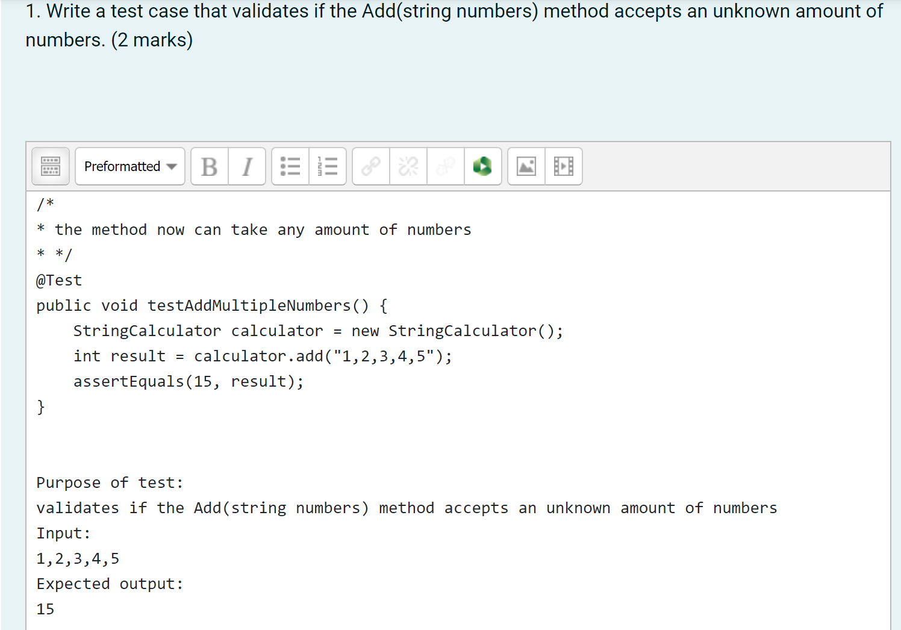
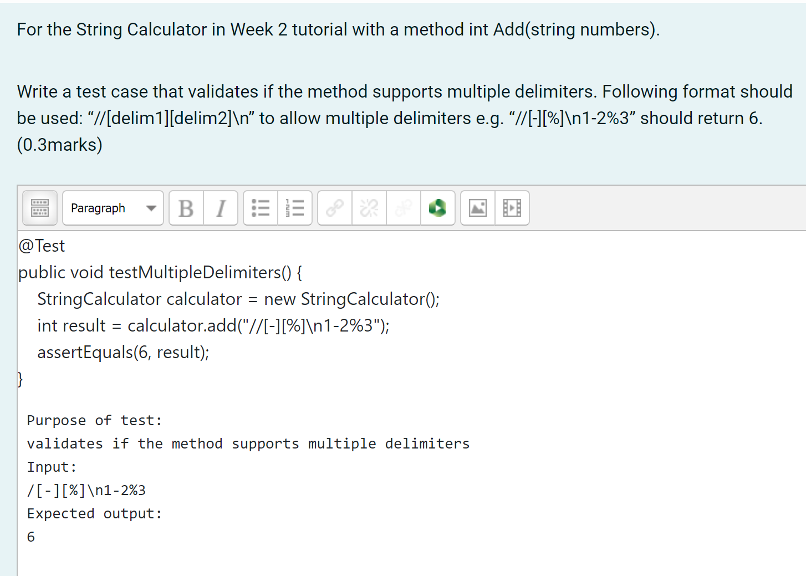
### Iteration 1
The method can take up to 2 numbers, and will return their sum (for an empty string it will return 0)  for example “” or “1” or “1,2” 
```java
@Test
public void testAddMethodWithEmptyString() {
    StringCalculator calculator = new StringCalculator();
    int result = calculator.add("");
    assertEquals(0, result);
}

```  

```java
public class StringCalculator {
    public int add(String numbers) {
        if (numbers.isEmpty()) {
            return 0;
        }
        return -1; // Placeholder return value for now
    }
}
```
### iteration 2
the method now can take any amount of numbers
```java
@Test
public void testAddMethodWithMultipleNumbers() {
    StringCalculator calculator = new StringCalculator();
    int result = calculator.add("1,2,3,4,5");
    assertEquals(15, result);
}
```  

```java
// Calculate the sum of the numbers  
int sum = 0;  
for (String token : tokens) {  
    // Convert each token to an integer and add it to the sum  
    sum += Integer.parseInt(token);  
}

```
### iteration 3
allow the Add method to handle new lines between numbers (instead of commas). The following input is ok: “1\n2,3” (will equal 6)  
```java
@Test
public void testAddMethodWithNewLinesBetweenNumbers() {
    StringCalculator calculator = new StringCalculator();
    int result = calculator.add("1\n2,3");
    assertEquals(6, result);
}

```

```java
String[] tokens = numbers.split("[,\n]");
```
### iteration 4
```java
/*  
* Support different delimiters, the beginning of the string  
* will contain a separate line that looks like this:“//delimiter\n[numbers. . . ]”  
* for example “//;\n1;2” should return three where the delimiter is ‘;’  
* item The first line is optional. All existing scenarios should still be supported  
* */  
@Test  
public void testAddMethodWithCustomDelimiter() {  
    StringCalculator calculator = new StringCalculator();  
    int result = calculator.add("//;\n1;2");  
    assertEquals(3, result);  
}
```  
split the input string `numbers` using a regular expression that matches either commas or new lines as a delimiter, using the pattern `[,\n]`. This allows  handle both commas and new lines as separators between the numbers
```java
// Default delimiter is comma or new line 
String delimiter = "[,\n]"; 
// Check if the input string specifies a custom delimiter 
if (numbers.startsWith("//")) { 
// Extract the delimiter and the numbers 
	int delimiterEndIndex = numbers.indexOf("\n"); 
	delimiter = numbers.substring(2, delimiterEndIndex); 
	numbers = numbers.substring(delimiterEndIndex + 1); 
} 
// Split the input string using the specified delimiter 
String[] tokens = numbers.split(delimiter); 
// Calculate the sum of the numbers 
int sum = 0;
```

### Iteration 5
```java
/*  
* Calling add with a negative number will throw an exception  
* “negatives not allowed” – and prints the negative number that was passed.  
* If there are multiple negatives, show all of them in the exception message  
* */  
@Test  
public void testAddMethodWithNegativeNumbers() {  
    StringCalculator calculator = new StringCalculator();  
    try {  
        int result = calculator.add("1,-2,3,-4");  
        fail("Exception should have been thrown");  
    } catch (IllegalArgumentException e) {  
        assertEquals("Negatives not allowed: -2, -4", e.getMessage());  
    }  
}
```  

```java
// Calculate the sum of the numbers  
int sum = 0;  
List<Integer> negatives = new ArrayList<>();  
for (String token : tokens) {  
    // Convert each token to an integer and add it to the sum  
    int number = Integer.parseInt(token);  
    if (number < 0) {  
        negatives.add(number);  
    }  
    sum += number;  
}  
  
// If there are negative numbers, throw an exception  
if (!negatives.isEmpty()) {  
    StringBuilder sb = new StringBuilder("Negatives not allowed: ");  
    for (int i = 0; i < negatives.size(); i++) {  
        sb.append(negatives.get(i));  
        if (i < negatives.size() - 1) {  
            sb.append(", ");  
        }  
    }  
    throw new IllegalArgumentException(sb.toString());  
}
```

### iteration 6
```java
/*  
* Numbers bigger than 1000 should be ignored, so adding 2 + 1001 = 2  
* */  
@Test  
public void testAddMethodWithNumbersGreaterThan1000() {  
    StringCalculator calculator = new StringCalculator();  
    int result = calculator.add("2,1000,1001");  
    assertEquals(1002, result);  
}
```

```java
// Calculate the sum of the numbers, ignoring numbers greater than or equal to 1000 
int sum = 0; 
List<Integer> negatives = new ArrayList<>(); 
for (String token : tokens) { 
	// Convert each token to an integer and add it to the sum 
	int number = Integer.parseInt(token); 
	if (number < 0) { 
		negatives.add(number); 
	} 
	else if (number <= 1000) { 
		sum += number; 
	} 
}
```

### Iteration 7
```java
/*  
* Delimiters can be of any length with the following format:  
* “//[delimiter]\n” for example: “//[—]\n1—2—3” should return 6  
* */  
@Test  
public void testAddMethodWithLongDelimiter() {  
    StringCalculator calculator = new StringCalculator();  
    int result = calculator.add("//[***]\n1***2***3");  
    assertEquals(6, result);  
}
```

handle long delimiters by checking if the delimiter starts and ends with square brackets, and removing them if so. Also use the `Pattern.quote` method to escape any special characters in the delimiter before using it to split the input string.
```java
// Check if the input string specifies a custom delimiter  
if (numbers.startsWith("//")) {  
    // Extract the delimiter and the numbers  
    int delimiterEndIndex = numbers.indexOf("\n");  
    delimiter = numbers.substring(2, delimiterEndIndex);  
    // Handle long delimiters  
    if (delimiter.startsWith("[") && delimiter.endsWith("]")) {  
        delimiter = delimiter.substring(1, delimiter.length() - 1);  
    }  
    numbers = numbers.substring(delimiterEndIndex + 1);  
}  
  
// Split the input string using the specified delimiter  
String[] tokens = numbers.split(Pattern.quote(delimiter));
```
### iteration 8 
```java
/*  
* Allow multiple delimiters like this: “//[delimitor1][delimitor2]\n”  
* for example “//[-][;]\n1-2;3” should return 6  
* */  
@Test  
public void testAddMethodWithMultipleDelimiters() {  
    StringCalculator calculator = new StringCalculator();  
    int result = calculator.add("//[-][;]\n1-2;3");  
    assertEquals(6, result);  
}
```  
update the `add` method to handle this case by modifying the regular expression used to split the input string. extract the delimiter(s) from the input string and use the `|` character to indicate alternate delimiters in the regular expression used to split the input string. The delimiter(s) can be specified in the input string using the format `//[delimiter]\n` (for a single delimiter) or `//[delimiter1][delimiter2]...\n` (for multiple delimiters).
```java
// Check if the input string has a custom delimiter  
String delimiterRegex = "[,\n]";  
if (numbers.startsWith("//")) {  
    int delimiterStartIndex = 2;  
    int delimiterEndIndex = numbers.indexOf("\n");  
    String delimiterLine = numbers.substring(delimiterStartIndex, delimiterEndIndex);  
    // Split the delimiter line by "][" to handle multiple delimiters  
    String[] delimiters = delimiterLine.split("\\]\\[");  
    for (String delimiter : delimiters) {  
        // Remove the square brackets from each delimiter  
        delimiter = delimiter.replace("[", "").replace("]", "");  
        // Add each delimiter to the regular expression  
        delimiterRegex += "|" + Pattern.quote(delimiter);  
    }  
    // Remove the delimiter line from the input string  
    numbers = numbers.substring(delimiterEndIndex + 1);  
}  
  
// Split the input string using the delimiter(s)  
String[] tokens = numbers.split(delimiterRegex);
```

### Iteration 9 IDK 
```java
/*  
* Make sure you can also handle multiple delimiters with  
* length longer than one char  
* */  
@Test  
public void Q9AddMultipleDelimiters() {  
    StringCalculator calculator = new StringCalculator();  
    int result = calculator.add("//[---][%$]\n1--;2$3");  
    assertEquals(6, result);  
}
```

# Week 3 Discrete maths
## Lecture
[Glossary of mathematical symbols - Wikipedia](https://en.wikipedia.org/wiki/Glossary_of_mathematical_symbols)  
[Directed and Undirected graph in Discrete Mathematics](https://www.javatpoint.com/directed-and-undirected-graph-in-discrete-mathematics)  
[CS Academy graph generater](https://csacademy.com/app/graph_editor/)  
Logic  
Basic set theory  
Relations & functions  
Basic graph theory  
### Quiz
  
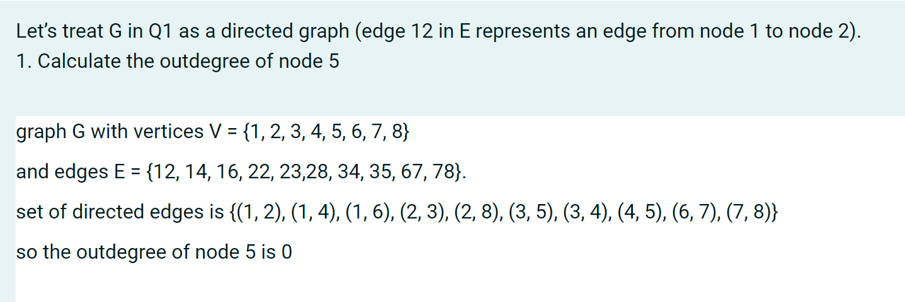
### Propositional logic 命题逻辑
Propositional logic is the logic that deals with a collection of declarative statements which have a truth value,  <mark style="background: #0000CD;">true or false</mark>.  
Proposition symbols:  `penguines_black_white`  
logical operators : Logic not (¬), and (⋀), or (⋁), implies意味着  (⇒) & equivalent (⇔)  
公理和推理规则 `¬ ¬p⊢p, {p, p ⇒q}⊢q`  


Predicate logic is an expression consisting of variables with a specified domain. It consists of objects, relations,  formulas and/or functions between the objects 谓词逻辑是由具有指定域的变量组成的表达式。它由对象、对象之间的关系、公式和/或函数组成
+ Universal (∀) & existential (∃)  
+ ∀x . P(x) => ∀ logician . wants_beer(logician)  

#### First-order logic  
+ Quantifies over arguments only  
+ Exist a person who is both a student and a tutor in  FIT.  
+ ∃x (P(x) ⋀ Q(x)

### Basic set definitions
Definition: a collection of elements  No ordering, no multiplicity 定义：元素的集合没有顺序，没有多重性
+ Enumeration: {1,2,3,4}  
+ Set comprehension: ${x : N | x ≤ 64}$  
+ A special set - the empty set ∅  

### Set membership & inclusion
+ Membership: $x∈{x}, x ∉ ∅$
+ Subset子集：: $A ⊆ B ⇔ ∀ x : A • x ∈ B$
+ Proper subset 
+ Set cardinality 设置基数 `#A | A |` `#A = 3`

#### Power set P
A power set is set of all subsets, empty set and the original set itself 幂集是所有子集、空集和原始集本身的集合   
+ $∀X • X$   is a set, $Px = {A|A ⊆ X}$  
+ power set of A = {1, 2} is P(A) = {{}, {1}, {2}, {1, 2}}
#### Set operations

+ Union : $A 𝕌 B$  The set containing all the elements of  which all other sets are subs
+ Intersection : $A∩B$  Items common in A,B
+ Difference : $A\B$ 
+ Cartesian product笛卡尔积 : `{a, b} X {0, 1} = {(a, 0), (a, 1), (b, 0), (b, 1)}`
### Relations ( ⇔) & functions (→ )  
#### Relations ( ⇔)
Relations (R) are defined over sets  A relation is a collection of ordered pairs, which  contains an object from one set to the other set 关系 (R) 是在集合上定义的 关系是有序对的集合，其中包含从一个集合到另一个集合的对象 Can be one-to-one, one-to-many  or many-to-one, many-to-many  
The Cartesian product deals with ordered pairs, so  the order in which the sets are considered is 笛卡尔积处理有序对，因此考虑集合的顺序是  `friends : Person ⇔ Person`  
$X х Y = {(x, y)} | x ∈ X and y ∈ Y} Where X х Y ≠ Y х X$  
Using n(A) for the number of elements in a set A, we have $n(X х Y) = n(X) х n(Y)$ 
#### functions (→ )
It is a relation that defines the set of  inputs to the set of outputs.  Note that all functions are relations, but  not all relations are functions 它是定义输入集到输出集的关系。请注意，所有函数都是关系，但并非所有关系都是函数  
`→ `  implies/ when used in functions, it  symbolises mapping A→B, if A is true then B is also true.  If A is false then nothing said about  B  
`age : Person N`  `birthday : Person → Date`  
### Graph theory
#### Undirected graphs 无向图  
[CS Academy graph generater](https://csacademy.com/app/graph_editor/)

$G = (V, E)$   
+ <mark style="background: #ff0000;">V: a non-empty set of nodes {n1, n2 , n3, ..., nm }</mark>    
+ <mark style="background: #ff0000;">E: a set of edges {e1, e2, ..., ep}, where each ek = (ni, nj)</mark>  
#### Representation & Degree

`V = {n 1 , n 2 , n 3 , n 4 , n 5 , n 6 , n 7}`  
`E = {e1 , e2 , e3 , e4 , e 5 , } = {(n 1 , n 2 ), (n 1 , n 4 ), (n 2 , n 5 ), (n 3 , n 4 ), (n 4 , n 6 )}`  
<mark style="background: #0000CD;">Degree of node : No. of edges that have that node as  an endpoint</mark>  
`degree(n 1 ) = 2, degree(n 4 ) = 3,  degree(n 7 ) = 0`  
#### Incidence Matrix

#### Path & Connectedness
Nodes ni and nj are connected if they  are in a path.  A component is a maximal set of  connected node 如果节点 ni 和 nj 在一条路径中，则它们是连通的 分量是连通节点的最大集合 `Path(n1,n5) = (n1, n2, n5) = <e1,  e4>` 

### Directed graphs

directed graph D = (V, E)  
+ V: a non-empty set of nodes {n1,  n2, n3 , ..., n m } 
+ E: a set of edges {e1, e2, ..., ep}  
where each ek = <ni, nj> an ordered pair
#### Indegrees & outdegrees

+ Indegree (or fan-in) of a node n is  the<mark style="background: #0000CD;"> no. of distinct edges that have n as  target</mark>. A node with indegree = 0 is called a source node  
+ Outdegree (or fan-out) of a node n  is the<mark style="background: #ff0000;"> no. of distinct edges that have n  as the start node</mark>.  A node with outdegree = 0 is called a  sink node
#### Paths & semi-paths


## Tutorial
### Q1
Decide if the following predicates are true. If not, give a counter example   
#### (a) ∀A∃B • C ≡ ∃B∀A • C , where A and B are variable declarations and C is a Boolean expression  
1. check if both sides of the equivalence are logically equivalent  
2. ∀A∃B • C = "For all A, there exists a B such that C is true"  ∀A∃B • C =“对于所有A，存在一个B使得C为真”
3. ∃B∀A • C = "There exists a B such that for all A, C is true"  ∃B∀A • C =“存在一个B使得对于所有A，C为真”
4. find a counterexample  A be the set of integers and B be the set of real numbers. Let C be the Boolean expression "A is a subset of B".
5. ∀A∃B • C = "For all sets of integers A, there exists a set of real numbers B such that A is a subset of B" ∀A∃B • C = “对于所有整数集 A，存在一组实数 B，使得 A 是 B 的子集”This statement is true because we can always choose B to be the set of real numbers, which contains the set of integers. Therefore, C is true for all A.
6. ∃B∀A • C = "There exists a set of real numbers B such that for all sets of integers A, A is a subset of B" ∃B∀A • C = “存在一组实数 B，使得对于所有整数集 A，A 是 B 的子集” 
7. This statement is false because we can choose B to be any non-empty set of real numbers, and there will always exist an integer that is not in B. Therefore, C is false for some A. 这个陈述是错误的，因为我们可以选择 B 是任何非空的实数集，并且总会存在一个不在 B 中的整数。因此，对于某些 A，C 是错误的。
8. conclusion:  ∀A∃B • C is not logically equivalent to ∃B∀A • C
#### (b) ∀A, B : P N • A ⊆ B ∨ B ⊆ A 
∀A, B : P N • A ⊆ B ∨ B ⊆ A can be read as "For all sets A and B of natural numbers, A is a subset of B or B is a subset of A." ∀A, B : P N • A ⊆ B ∨ B ⊆ A 可以理解为“对于自然数的所有集合 A 和 B，A 是 B 的子集或 B 是 A 的子集。”To prove this predicate, we need to show that for any arbitrary sets A and B of natural numbers, either A is a subset of B or B is a subset of A. 为了证明这个谓词，我们需要证明对于任意自然数集合 A 和 B，要么 A 是 B 的子集，要么 B 是 A 的子集。
1. Case 1: A ⊆ B If A is a subset of B, then the predicate is true.  
2. Case 2: B ⊆ A If B is a subset of A, then the predicate is true.
3. Case 3: A ∩ B = ∅ If A and B have no common elements, then either A is a subset of B or B is a subset of A. This is because if there is no element in common between A and B, then either A is entirely contained within B, or B is entirely contained within A. 如果 A 和 B 没有公共元素，则 A 是 B 的子集或 B 是 A 的子集。这是因为如果 A 和 B 之间没有公共元素，则 A 完全包含在 B 中，或者B 完全包含在 A 中。
4. Case 4: A ∩ B ≠ ∅ If A and B have some common elements, then we can define the set C = A ∪ B. Since C is a set of natural numbers, we know that C is a subset of the natural numbers 如果A和B有一些共同的元素，那么我们可以定义集合C = A ∪ B。由于C是自然数的集合，我们知道C是自然数的子集 Moreover, we know that A and B are not disjoint, so A ∩ B ≠ ∅ implies that A and B are not both equal to ∅. 此外，我们知道 A 和 B 不相交，所以 A ∩ B ≠ ∅ 意味着 A 和 B 不都等于 ∅。A and B are not both equal to ∅. Therefore, at least one of A and B is not equal to ∅, which implies that at least one of A and B is not equal to ∅ ∪ ∅ = ∅. A 和 B 不都等于 ∅。因此，A 和 B 中至少有一个不等于 ∅，这意味着 A 和 B 中至少有一个不等于 ∅ ∪ ∅ = ∅。
5. for any arbitrary sets A and B of natural numbers, either A is a subset of B or B is a subset of A. Therefore, the predicate ∀A, B : P N • A ⊆ B ∨ B ⊆ A is true. 对于任意自然数集合 A 和 B，要么 A 是 B 的子集，要么 B 是 A 的子集。因此，谓词∀A, B : P N • A ⊆ B ∨ B ⊆ A 为真。
### Q2
Give a formal definition of the binary relation R, over natural numbers, such that each x is related to y  by R if and only if y is greater than the square of x but less than the square of x + 1. 给出自然数上二元关系 R 的正式定义，使得每个 x 都通过 R 与 y 相关当且仅当 y 大于 x 的平方但小于 x + 1 的平方。For any x, y ∈ N, xRy if and only if y > x^2 and y < (x+1)^2.  
1. simply plug in the values of x and y into the definition of the relation and see if it holds true x=2 and y=9, 9 > 2^2 and 9 < (2+1)^2 True  
2. x=3 and y=8, 8 > 3^2 and 8 < (3+1)^2 False
### Q3
Let S be the set of natural numbers between 1 and 15 inclusively. Express R in Q2 as a set of ordered pairs in S.   设 S 为 1 到 15 之间的自然数集。将 Q2 中的 R 表示为 S 中的一组有序对。For any x, y ∈ N, xRy if and only if y > x^2 and y < (x+1)^2.  R as a set of ordered pairs in S, where S is the set of natural numbers between 1 and 15 inclusively. To do this, we need to list all the pairs (x, y) where x and y are elements of S and xRy holds. R 作为 S 中的一组有序对，其中 S 是 1 到 15 之间的自然数集。为此，我们需要列出所有对 (x, y)，其中 x 和 y 是 S 的元素并且 xRy 成立。
1. the values of x in S: 1, 2, 3, 4, 5, 6, 7, 8, 9, 10, 11, 12, 13, 14, 15  
2. x^2 < y < (x+1)^2 list the ordered pairs (x, y) where xRy holds for each x in S  
3. For x=1, the values of y that satisfy xRy are 2, 3, 4, 5, 6, 7, 8, 9, 10, 11, 12, 13, 14, 15. So the ordered pairs are: `{(1, 2), (1, 3), (1, 4), (1, 5), (1, 6), (1, 7), (1, 8), (1, 9), (1, 10), (1, 11), (1, 12), (1, 13), (1, 14), (1, 15)}`  
4. For x=2, the values of y that satisfy xRy are 5, 6, 7, 8, 9, 10, 11, 12, 13, 14, 15. So the ordered pairs are: `{(2, 5), (2, 6), (2, 7), (2, 8), (2, 9), (2, 10), (2, 11), (2, 12), (2, 13), (2, 14), (2, 15)}`  
5. For x=3, the values of y that satisfy xRy are 10, 11, 12, 13, 14, 15. So the ordered pairs are: `{(3, 10), (3, 11), (3, 12), (3, 13), (3, 14), (3, 15)}`  
6. For x=4, the values of y that satisfy xRy are 17, 18, 19, 20, 21, 22, 23, 24, 25. However, since 25 is greater than 15, we can exclude it from our list of ordered pairs. So the ordered pairs are: `{(4, 17), (4, 18), (4, 19), (4, 20), (4, 21), (4, 22), (4, 23), (4, 24)}`  
7. For x=5, the values of y that satisfy xRy are 26, 27, 28, 29, 30, 31, 32, 33, 34 However, since all of these values are greater than 15, we can exclude them from our list of ordered pairs. So there are no ordered pairs for x=5.
8. For x= 6 ~ 15 is the same reason
9. Therefore, the set of ordered pairs in S that represent the relation R is: `{(1, 2), (1, 3), (1, 4), (1, 5), (1, 6), (1, 7), (1, 8), (1, 9), (1, 10), (1, 11), (1, 12), (1, 13), (1, 14), (1, 15), (2, 5), (2, 6), (2, 7), (2, 8), (2, 9), (2, 10), (2, 11), (2, 12), (2, 13), (2, 14), (2, 15), (3, 8), (3, 9), (3, 10), (3, 11), (3, 12), (3, 13), (3, 14), (3, 15), (4, 13), (4, 14), (4, 15)}`  
### Q4 Graph Theory
Given an undirected graph G with vertices V = {1, 2, 3, 4, 5, 6, 7, 8} and edges E = {12, 14, 16, 22, 23,  28, 34, 35, 67, 78}  
#### (a) Draw G graphically
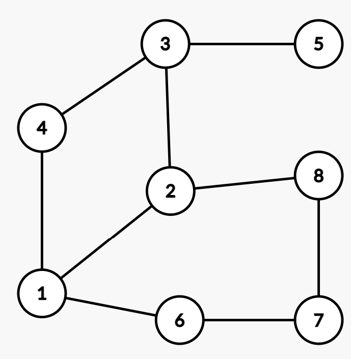
#### (b) Calculate the degree of each node in the graph
-   count the number of edges incident to each vertex. in an undirected graph, the degree of a node is equal to the number of edges incident to it, because each edge contributes to the degree of both of its endpoints. 计算入射到每个顶点的边数。在无向图中，节点的度数等于入射到它的边的数量，因为每条边都会影响其两个端点的度数。
-   degree(1) = 3

#### (c) Calculate the Cyclomatic number of G
The cyclomatic number, also known as the connectivity or the circuit rank, is a graph-theoretic measure that gives the minimum number of edges that need to be removed from a graph in order to disconnect it or make it acyclic. 圈数，也称为连通性或电路等级，是一种图论度量，它给出了需要从图中删除的最小边数，以便断开它或使其成为非循环的。 
The formula for the cyclomatic number is: `c = |E| - |V| + k`  where |E| is the number of edges, |V| is the number of vertices, and k is the number of connected components in the graph.其中|E|是边数，|V|是顶点的数量，k 是图中连通分量的数量。
1. `|V| = 8` `|E| = 10 (counting each undirected edge once)` `k = 1 (because the graph is connected)` 
2. `c = |E| - |V| + k = 10 - 8 + 1 = 3` 
### Q5 
Let’s treat G in Q5 as a directed graph (edge 12 in E represents an edge from node 1 to node 2)  V = {1, 2, 3, 4, 5, 6, 7, 8} and edges E = {12, 14, 16, 22, 23,  28, 34, 35, 67, 78}  
#### (a) Draw G graphically

#### (b) Calculate the in-degree and out-degree of each node (ignoring edge 22 for this question)
in a directed graph, the in-degree of a node is the number of edges coming into it, while the out-degree of a node is the number of edges going out from it. 在有向图中，节点的入度是进入它的边的数量，而节点的出度是从它出去的边的数量。


#### (c) Are there any source nodes or sink nodes in G?
A source node is a node with in-degree 0, meaning there are no incoming edges to that node. A sink node is a node with out-degree 0, meaning there are no outgoing edges from that node.源节点是入度为 0 的节点，这意味着该节点没有传入边。汇节点是出度为 0 的节点，这意味着该节点没有出边。

#### d) Does this graph contain semi-paths? If so, identify them.
A semi-path is a sequence of vertices in a directed graph where all edges go in the same direction. That is, it is a directed path that either starts from a source node or ends at a sink node.半路径是有向图中的一系列顶点，其中所有边都在同一方向上。也就是说，它是一条有向路径，要么从源节点开始，要么到汇节点结束。
-   Semi-path from source node 4: 4 -> 6 -> 7
-   Semi-path from source node 6: 6 -> 7
-   Semi-path to sink node 3: 2 -> 8 -> 5 -> 3
-   Semi-path to sink node 7: 1 -> 2 -> 8 -> 7
#### e) Identify a pair of nodes that are 0-connected, 1-connected, 2-connected, and 3-connected, if any  (ignoring edge 22 again)
two nodes are said to be k-connected if there exist at least k edge-disjoint directed paths between them. That is, there are k paths from the first node to the second node, and no two of these paths share any common edges.如果两个节点之间至少存在 k 条边不相交的有向路径，则称这两个节点是 k-连通的。也就是说，从第一个节点到第二个节点有 k 条路径，并且这些路径中没有两条共享任何公共边。
-   0-connected pairs: There are no pairs of nodes that are 0-connected in G, because in a directed graph, two nodes must share at least one edge to be 0-connected.
-   1-connected pairs: (1,2), (2,3), (2,8), (3,5), (5,7), (6,7), (7,8)
-   2-connected pairs: (1,3), (1,5), (1,7), (4,2), (4,3), (4,5), (4,8), (6,2), (6,3), (6,5), (6,8)
-   3-connected pairs: (1,8), (4,7)
#### (f) Work out the reachability matrix for G
The reachability matrix for a directed graph is an adjacency matrix where the entry in row i and column j is 1 if there exists a directed path from node i to node j, and 0 otherwise.有向图的可达性矩阵是一个邻接矩阵，其中如果存在从节点 i 到节点 j 的有向路径，则行 i 和列 j 中的条目为 1，否则为 0。

```
//adjacency matrix
    1  2  3  4  5  6  7  8
--------------------------
1 | 0  1  0  1  1  0  0  0
2 | 0  0  1  0  1  0  0  1
3 | 0  0  0  0  1  0  1  0
4 | 0  0  0  0  1  0  0  1
5 | 0  0  0  0  0  0  1  1
6 | 0  0  0  0  0  0  1  1
7 | 0  0  0  0  0  0  0  1
8 | 0  0  0  0  0  0  0  0
```
the entry in row i and column j is 1 if and only if there exists a directed path from node i to node j. For example, the entry in row 1 and column 2 is 1 because there exists a directed path from node 1 to node 2, namely the path (1,2). The entry in row 2 and column 1, however, is 0 because there is no directed path from node 2 to node 1.当且仅当存在从节点 i 到节点 j 的有向路径时，第 i 行和第 j 列中的条目为 1。例如，第1行第2列的条目为1，因为存在从节点1到节点2的有向路径，即路径(1,2)。但是，第 2 行和第 1 列中的条目为 0，因为没有从节点 2 到节点 1 的定向路径。
### Q6 Draw a directed graph for each of the following common control constructs
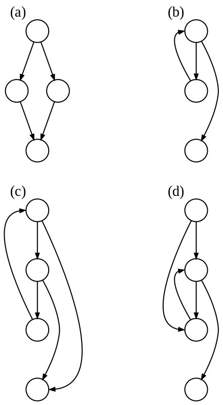    
(a) an if-then-else  
(b) a while loop  
(c) a natural loop with two exits, e.g. while with an if...break in the middle; non-structured but reducible  
(d) an irreducible CFG: a loop with two entry points, e.g. goto into a while or for loop
#### if-then
```
      +--------+
      |        |
      v        |
+-----------+  |
|  condition|  |
+-----------+  |
      |        |
      | true   | false
      v        |
+-----------+  |
|  action   |  |
+-----------+  |
      |        |
      +--------+

```
the condition node represents the boolean condition to be evaluated. If the condition is true, control flows to the action node, where some action is taken. If the condition is false, control simply continues on to the next node in the graph.条件节点表示要评估的布尔条件。如果条件为真，控制流向动作节点，在该节点采取一些动作。如果条件为假，控制将简单地继续到图中的下一个节点。
#### if-then-else
```
       +--------+
       |        |
       v        |
 +-----------+  |
 | condition |  |
 +-----------+  |
       |        |
       | true   | false
       v        |
 +-----------+  |
 |   then    |  |
 +-----------+  |
       |        |
       v        |
 +-----------+  |
 |   else    |  |
 +-----------+  |
       |        |
       v        |
 +-----------+  |
 |  after if |  |
 +-----------+  |

```
the condition node represents the boolean condition to be evaluated. If the condition is true, control flows to the then node, where some action is taken. If the condition is false, control flows to the else node, where a different action is taken. After either the then or else actions are taken, control flows to the after if node.条件节点表示要评估的布尔条件。如果条件为真，则控制流向 then 节点，在该节点采取某些操作。如果条件为假，则控制流向 else 节点，在该节点执行不同的操作。在执行 then 或 else 操作之后，控制流向 after if 节点。
#### case switch
```
       +-----------+
       |           |
       v           |
 +------------+   |
 | expression |   |
 +------------+   |
       |           |
       | case 1    | case 2
       v           |
 +------------+   |
 |   action   |   |
 +------------+   |
       |           |
       v           |
 +------------+   |
 |   action   |   |
 +------------+   |
       |           |
       v           |
 +------------+   |
 | default    |   |
 +------------+   |
       |           |
       v           |
 +------------+   |
 |   action   |   |
 +------------+   |
       |           |
       v           |
 +------------+   |
 |  after    |   |
 +------------+   |

```
the expression node represents the value whose different cases are evaluated. Depending on the value of the expression, control flows to one of the case nodes, where a specific action is taken. If none of the cases match, control flows to the default node, where a default action is taken. After the case or default actions are taken, control flows to the after node.表达式节点表示评估其不同情况的值。根据表达式的值，控制流向其中一个案例节点，在此执行特定操作。如果所有情况都不匹配，则控制流向默认节点，在此处执行默认操作。在采取 case 或 default 操作后，控制流向 after 节点。
#### while loop
```
       +-----------+
       |           |
       v           |
 +------------+   |
 | condition  |   |
 +------------+   |
       |           |
       |  true     |
       v           |
 +------------+   |
 |   body     |   |
 +------------+   |
       |           |
       v           |
 +------------+   |
 |  after     |   |
 +------------+   |

```
the condition node represents the boolean condition to be evaluated before each iteration of the loop. If the condition is true, control flows to the body node, where some action is taken. After the action is taken, control flows back to the condition node to evaluate the condition again. If the condition is false, control flows to the after node.条件节点表示在循环的每次迭代之前要评估的布尔条件。如果条件为真，则控制流向 body 节点，在此执行某些操作。采取行动后，控制流回条件节点以再次评估条件。如果条件为假，控制流向后节点。
#### do-while loop
```
       +-----------+
       |           |
       v           |
 +------------+   |
 |   body     |   |
 +------------+   |
       |           |
       v           |
 +------------+   |
 | condition  |   |
 +------------+   |
       |           |
       |  true     |
       v           |
 +------------+   |
 |   body     |   |
 +------------+   |
       |           |
       v           |
 +------------+   |
 |  after     |   |
 +------------+   |

```
the body node represents the action to be taken in each iteration of the loop. After the action is taken, control flows to the condition node to evaluate the boolean condition. If the condition is true, control flows back to the body node to take the action again. If the condition is false, control flows to the after node. Note that the body node is executed at least once, regardless of the value of the condition. body 节点表示循环的每次迭代中要采取的操作。采取行动后，控制流向条件节点以评估布尔条件。如果条件为真，则控制流回正文节点以再次执行操作。如果条件为假，控制流向后节点。请注意，无论条件值如何，主体节点至少执行一次。
# Assignment 1
```ad-note
title: Requirment
collapse:

This assignment carries 10 marks. The assessment will be based on the submitted files as well  as a demo/interview conducted in-tutorial in week5 
You will need to submit a test plan report and the project setup, contained in a single .zip file, to  Moodle. 
1.2 Test Plan document  
The report will include following parts:  The report should not exceed 4 pages in length
(1) testing objective,  
(2) scope of testing,  
(3) approach (including any assumption/constraints, software requirements to be tested, testing tools),  
(4) test plan (including testing team and test environment) and  
(5) testing procedure (including test execution and unit test cases). You should document test cases in a  tabular form (check the format in Week 2 lecture).
1.3 Project set up and testing requirements  
1. Maven project: We have provided Java files with no project structure. You need to create a  maven project and import these files into correct location.  
2. BuyTicket and ChooseTicket are required to be combined into one class. You can call this call  TicketSystem.  
3. Write code on any five test cases you created in the report. Test cases should test different  constraint
1.4 Demo  
Each group will also need to give a code walkthrough to a TA, showing your understanding of the code,  
and your test plan. All the team members will be interviewed. All the team members are required to  attend the same tutorial during week 5 tutorial

1.5 Assessment Breakdown  
5 marks - Testing documentation
5 marks - Setup and testing You need to show that you have successfully set up the local working environment and have developed  some test cases.  
Your report can contain screenshots showing that your setup is successful. If you ran into problems  setting up the environment, your report should briefly document the problem and the status of the setup  as an append
```

# Week 4  Blackbox Testing
## Lecture
### Blackbox testing  

+ No knowledge of the internal structure  
+ Testing behaviour of the software  
+ Functional testing(具体功能，登陆，注册等) & non-functional testing (load testing, usability testing, etc.稳定性，安全性，易用性等)  
### Boundary Value Testing (BVT)
errors tend to occur near the boundary values for an input variable. test using variable values from the input (domain) of a program  

#### Normal Boundary Value Testing (NBVT)
+ Focus on valid values of the input variables.   
+ Focus on valid values of the input variables (min, min+, nor, max, max-)  
+ NBVT => Single fault assumption Failures are usually caused by only one fault, not more  
+ Test cases:<mark style="background: #3CB371;">(nominal, boundary)(boundary, nominal) (nominal, nominal)</mark>  
+ One variable takes: min, min+, nor, max-, max <mark style="background: #0000CD;">Total 4n+1 cases</mark>
  
#### Robustness testing
  
+ Simple extension of boundary value analysis Add values min- & max+  
+ Purpose: exception handling  May cause runtime errors in strongly-typed languages  
+ total no. of test cases = 6n + 1  
#### Worst case testing  
  
+ Disregard single fault assumption, acquire more test cases  
+ for each variable Take min, min+, nor, max-, max Take the Cartesian product x 1 x x2  
+ <mark style="background: #ff0000;">test cases = 5 ^ n</mark> Applicable when failure is costly
#### Robust worst-case testing
  
+ Taking it one step further Add min- & max+  
+ <mark style="background: #3CB371;">test cases now = 7^n</mark>  Applicable when failure is  really costly
### Equivalence class testing
[Equivalence Class Testing: Complete Guide |Professionalqa.com](https://professionalqa.com/equivalence-class-testing)  
+ Basic idea: partition the entire input set into disjoint subsets  
+ Covering: complete testing  
+ Disjointness: no redundancy  
+ One test case from each equivalence class 
+ Key: find a good equivalence relation  
+ Weak equivalence and strong equivalence classes
#### example
```
a ≤ x1 ≤ d, with intervals [a,b), [b,c),  [c,d]  
e ≤ x 2 ≤ g, with intervals [e,f), [f,g]  Partition based on intervals  
V1 = { x1 : a ≤ x1 < b }  
V2 = { x1 : b ≤ x1 < c }  
V3 = { x1 : c ≤ x1 ≤ d }  
V4 = { x2 : e ≤ x2 < f }, V5 = { x2 : f ≤ x2 ≤ g }  
NV1 = { x1 : x1 < a }, NV2 = { x1 : x1 > d }  
NV3 = { x2 : x2 < e }, NV4 = { x2 : x2 > g }
```
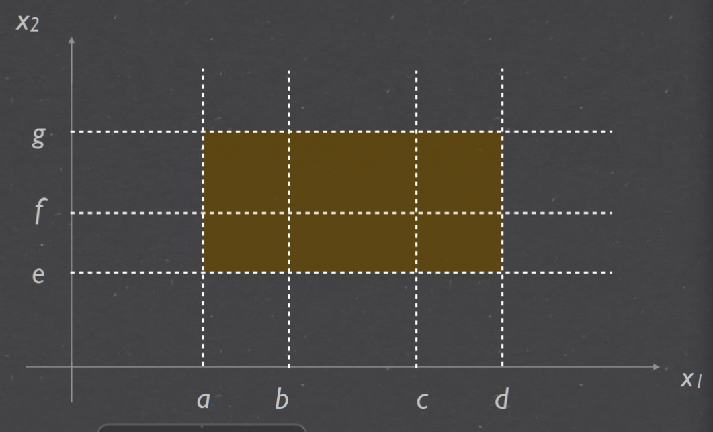 
Equivalent classes of valid values:  C x1 = { V1, V2, V3 }  C x2 = { V4, V5 }  
Equivalent classes of invalid values:  I x1 = { NV1, NV2 }   I x2 = { NV3, NV4 }
#### Weak equivalence class testing  
  
+ Weak normal  Choosing one valid value from each equivalent class (over valid interval)  
+ Weak robust  Test case include invalid values One invalid value => other valid values
#### Strong equivalence class testing
  
+ Strong normal  Choosing each element of cartesian  product of the equivalent classes  (valid interval  
+ Strong robust  Choosing each element of cartesian  product of all the equivalent classes  (both valid and invalid)
### Decision Table - based Testing
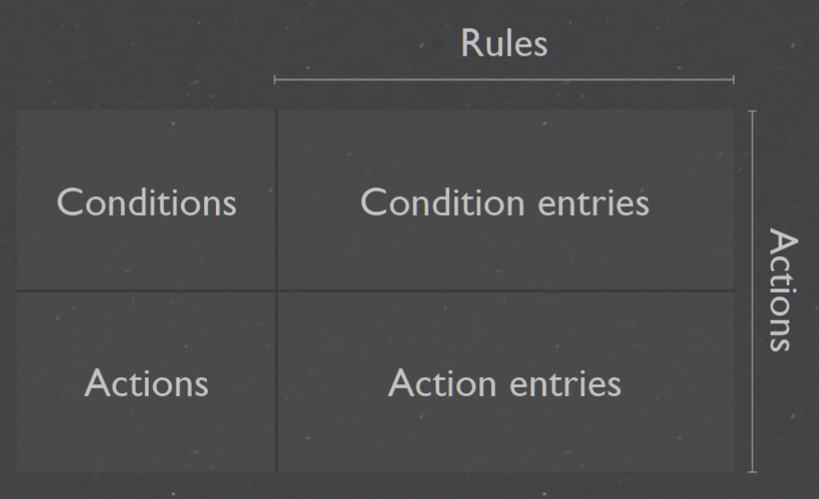  
+ Guarantees completeness of testing => every possible combination of conditional  values (Conditions → Actions)  
+ Cause-Effect table where Cause and effects  are captured for better test coverage


### Testing effort  
  
+ BVT - no recognition of data or logical dependencies  Mechanical, easy to automate    
+ ECT - need to consider data dependencies & program logic  Defining the equivalence relation  
+ DTT - need to consider both data & logical dependencies


## Tutorial
### 1. work out a formula for the number of test cases for each of the following  cases and briefly explain
#### (a) The robust BVT (with additional values min− and max + for each variable) 
(n × 2) + 1   
where n is the number of input variables in the program.   The (n × 2) term in the formula represents the number of boundary values for each input variable that need to be tested. adds 1 to the number of test cases for the basic BVT to account for the additional values,
#### (b) Weak normal equivalence class testing

### 4. Under the tutorial resources, you will find a pdf document which includes the NextDate  method, which, given a day, a month, and a year, returns the date of the following day.
```
Rules must be complete  Conditions must cover all possibilities  
Rules must be exclusive  Given certain conditions, only one rule can be true  
D1 = {d: day | 1 ≤ d ≤ 27}  
D2 = {d: day | d = 28} = {28}  
D3 = {d: day | d = 29} = {29}  
D4 = {d: day | d = 30} = {30}  
D5 = {d: day | d = 31} = {31}
M1 = {m: month | m has 30 days}  
M2 = {m: month | m has 31 days except December}  
M3 = {m: month | m is December}  
M4 = {m: month | m is February}  
Y1 = {y: year | y is a leap year}  
Y2 = {y: year | y is a common year}
```

#### Complete the decision table on slide 37 for NextDate by filling in the missing conditions and associated actions
| Rules      |    | 7      | 8     | 9   | 10    | 11 | 12 | 13 |
| ---------- | -- | ------ | ----- | --- | ----- | -- | -- | -- |
| Conditions | c1 | D1-D4, | D1,D2 |  D3 | D4,D5 | D1 | D2 | D3 |
|            | C2 | M3     | M4    | M4  | M4    | M4 | M4 | M4 |
|            | C3 |        | Y1    | Y1  | Y1,Y2 | Y2 | Y2 | Y2 |
| Actions    | a1 |        |       |     | x     |    |    | x  |
|            | a2 | x      | x     |     |       | x  |    |    |
|            | a3 |        |       | x   |       |    | x  |    |
|            | a4 |        |       | x   |       |    | x  |    |
|            | a5 |        |       |     |       |    |    |    |
|            | a6 |        |       |     |       |    |    |    |

Rule 7: If the day is in the range D1-D4, month is February, and the year is a common year, then the following day of the given date will be 01-Mar.
Rule 8: If the day is 28, month is February, and the year is a leap year, then the following day of the given date will be 29-Feb.
Rule 9: If the day is 29, month is February, and the year is a leap year, then the following day of the given date will be 01-Mar.
Rule 10: If the day is in the range D4-D5, month is February, and the year is a leap or common year, then the following day of the given date does not exist and the output will be invalid.
Rule 11: If the day is in the range D1-D4, month is not February, and the year is a leap or common year, then the following day of the given date can be computed normally by moving to the next day.
Rule 12: If the day is 28, month is not February, and the year is a common year, then the following day of the given date will be 01-Mar.
Rule 13: If the day is 29 or 30, month is not February, and the year is a common year, then the following day of the given date will be the next day of the same month.


# week 5 White-box testing
## Lecture
### White-box testing

+ Testing structure of the software  不仅关注输入和输出，同时关注盒子内的代码结构
+ Abstraction is the key Programs → mathematical objects (models 将代码转换成数学模型  
+ Analyse the abstract program Data flow, control flow, coverage, etc.
### Program graph  
  
+ directed graph; Nodes: statement fragments;  Edges: flow of control;  Paths: program execution
+ Simplification: grouping of statements Basic blocks - sequential execution  
+ identify test cases {(1,2), (2,9)}  {(1,2), (2,3),(3,4),(4,3),(3,5), (5,7),(7,8),(8,2),(2,9)}
### Decision-to-decision paths DD-paths  
  
主要着眼测试覆盖率问题。  
程序有向图中存在分支，覆盖率考虑的是对各个分支情况的测试覆盖程度，因此对有向图中线性串行的 部分进行压缩，在压缩图(即DD-路径)的基础上进行测试用例设计，用测试覆盖指标考察测试效果
```
Indegree: no. of incoming edges for a node  
Outdegree: no. of outgoing edges for a node  
Path: a sequence of adjacent edges  
2-connected: if there is a path between the two nodes
```
### Test coverage metrics  
Test coverage is a percentage measure of the degree to which the source code of  a program is executed when a particular test suite is run.  

### Basis path testing  
Path testing is a structural testing method that involves using the source code of a  program in order to find every possible executable path.  It helps to determine all faults lying within a piece of code. This method is  designed to execute all or selected path through a computer program.  Any software program includes, multiple entry and exit points. Testing each of  these points is a challenging as well as time-consuming. In order to reduce the  redundant tests and to achieve maximum test coverage, basis path testing is used  
  

  
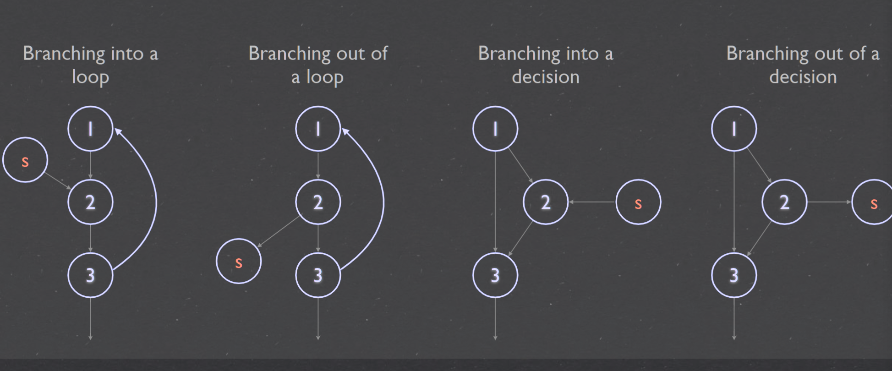  
# Week 6 Integration Testing
## Lecture
-   Objectives of integration testing
-   Integration testing approaches
	-   Decomposition-based
	-   Call graph-based
	-   Path-based
-   A comparison of different approaches
### Phases & goals of testing
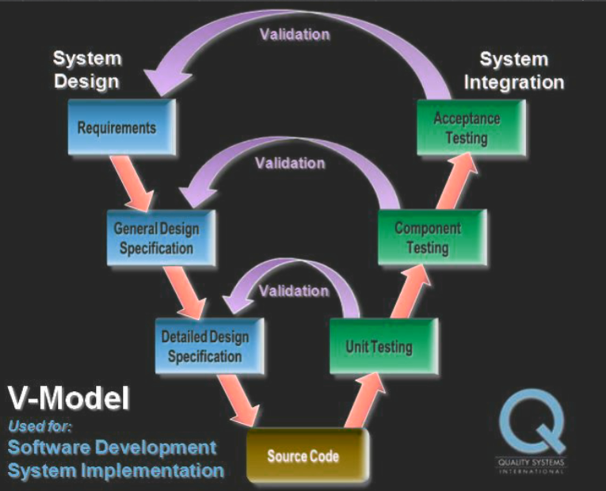  
### Integration testing
集成测试是在单元测试的基础上，测试在将所有的软件单元按照概要设计规格  
说明的要求组装成模块、子系统或系统的过程中各部分工作是否达到或实现相  
应技术指标及要求的活动。 也就是说，在集成测试之前，单元测试应该已经完  
成，集成测试中所使用的对象应该是已经经过单元测试的软件单元
+ System - hierarchically composed of units  
+ Objectives - testing of interfacing and interaction of units; To expose problems arising from the combination; To find a working solution from component 
+ Internal - between components 单元间的接口，指的是代码间的相互调用，我们传递  
一些参数来判断测试调用有没有问题  
	- Method invocation - calls/message passing  
	- Parameter - types, values, order, etc.  
	- Method return - identity, types, sequence,  
- External - outside of system Interrupts, I/O timing, etc集成后的功能，不同的功能之间是否会产生相互影响


### Decomposition-based Integration testing
Decompose the system in different ways 基于分解，功能分解，模块分解: 
+ System Architecture: hierarchically composed of components Organised in layers
+ Layers of components
  
### Structural integration approaches: 

#### Big bang
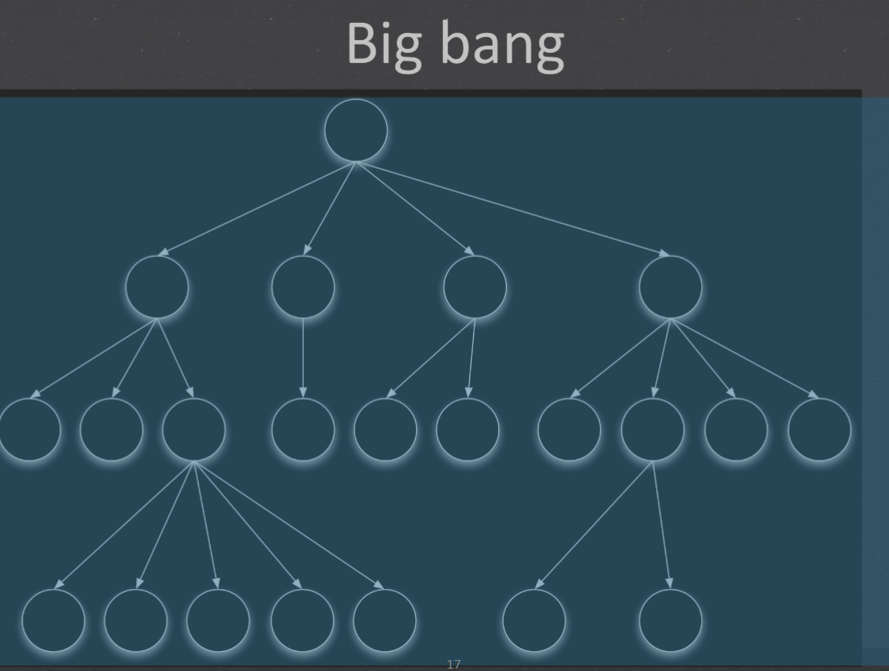

 + all units together, no error localisation 
 + 迅速（如果执行没有问题的话）完成集成测试，并且只要极少数的驱动和桩模块设计，它需要的测试用例也是最少的  
 + 将所测模块连接起来进行测试一次试运行成功率不大，导致测试效率比较低  
 + 其问题定位和修改都比较困难  
 + 适用一个维护型项目（或功能增强型项目），其以前的产品已经很稳定了  
 + 被测系统比较小，并且它的每个函数都经过充分的单元测试  

#### Top down
  
+ stubs(桩：模拟的子模块dummy component simulate the input-output behaviours of the called unit (methods | sub-systems )), early demo  
+ 较早的验证了主要的控制和判断点可以首先实现和验证一个完整的软件功能  
+ 支持故障隔离  
+ Difficult to write when called unit has complex parameter  
+ 底层组件行为的验证被推迟 底层组件的测试不够充分  
+ 适合产品控制结构相对清晰和稳定，产品的高层接口变化比较小  
#### Bottom up  

+ terminal, drivers(驱动器：模拟的父节点dummy component emulating not-yet-implemented behaviour of a calling unit (upper lever components))  
+ 该策略允许对底层组件行为的早期验证，可以在任何一个叶子节点已经就绪的情况下进行集成测试  
+ 支持故障隔离  
+ 对于高层的验证被推迟到了最后，设计上的错误不能被及时发现  
+ 底层接口比较稳定、变动较少的产品.高层接口变化比较频繁的产品底层组件较早被完成的产品

#### Sandwich

+ a combination of the above methods  
+ 中间一层为目标层 对目标层的上一层使用自顶向下的集成策略 对目标的下一层使用自底向上的集成策略，最后测试在目标层会合  
+ 集合了自底向上和自顶向下这两种策略的优点  
+ 中间层在被集成前测试不够充分  
+ 大部分软件开发项目都可使用该策略  
+ 上层更多的是偏重于高层的组件开发，我们可以采用自顶向下的策略集成；
+ 而下层偏重于具体的组件实现,我们采用自底向上的策略来集成；
+ 中间部分可能就是一些接口实现了，完事上下层在中间层会合；
+ 完事之后，我们可以在它们的最外成采用大爆炸方式集成也是可以的

### Call graph-based integration
+ Directed graphs for calling relationships between components (methods, classes,  subroutines, units  
+ More behavioural, less structured  
+ Avoid impossible edges, stubs, drivers  
+ Aligns better with development/builds  
+ More difficult fault isolation All neighbours of a faulty unit need to be retested

#### Pairwise integration  
Integration testing of pairs of units Use actual code No stubs or drivers  

#### Neighbour integration
Neighbour: edge distance; Neighbour integration: include neighbouring nodes  
  
### Path-based
+ Hybrid method - functional testing + structural testing  
+ Testing cases: behavioural threads  
+ interactions(behavioural) rather than interfaces(structural)  
+ Closely coupled with actual system behaviour Works well for Object Oriented  Programs  

  
  

### Mocking
Mocking is a technique used in unit and integration testing to simulate the behavior of an object or component that is not yet available or that would be too complex or costly to include in the testing environment.  
+  isolate the code that they want to test, by replacing any dependencies with mock objects or stubs that mimic the behavior of the real objects  
+ Increases test coverage: Mocking components or objects can help developers test edge cases and scenarios that would otherwise be difficult to replicate  
+ Speeds up testing: Use of mocks can eliminate the need to wait for slow or unavailable components  
+ Facilitates parallel testing: Mocking can easily allow multiple tests to be run in parallel wit out any interference from the other components which are not yet developed. 
```java
public class Calculator {
    private Database db;
    public Calculator(Database db) {
        this.db = db;
    }
    public int add(int a, int b) {
        int result = a + b;
        db.persist(result);
        return result;
    }
}
public class Database {
    public void persist(int result) {
        // logic to persist the result in the database
    }
}

```

```java
public class CalculatorTest {
    @Test
    public void testAdd() {
        // create mock Database object
        Database db = Mockito.mock(Database.class);
        // create Calculator object with mock Database dependency
        Calculator calc = new Calculator(db);
        // call add method on Calculator
        int result = calc.add(2, 3);
        // verify that add method returned correct result
        assertEquals(5, result);
        // verify that persist method was called on the mock Database object
        Mockito.verify(db).persist(5);
    }
}

```

## Tutorial
### Q1 
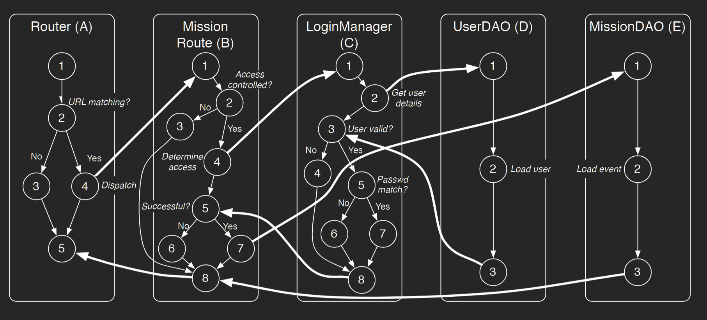  
simple Web application for management of personnel, which deals with classes `Persons, Expertise, Missions, Invitations` the interactions between components for the loading of a Mission page is shown below in Figure 1, showing the authentication & authorisation control flow  
+ `Router` is responsible for routing HTTP requests to the appropriate resources  that handles them   
+ `MissionRoute`  is responsible for creating pages to present mission details. once it is determined that authentication and authorisation the resource consults the `LoginManager` 
+ `LoginManager` to grant/refuse access based on user input. The LoginManager in turn invokes UserDAO  
+ `UserDAO` to load user details given the user name. If access is granted or that access control is not required, the resource then invokes MissionDAO  
+ `MissionDAO` to obtain mission details. If the user is denied access, it constructs a page to show the error accordingly. Finally, MissionRoute returns the page back to the Router.
#### Q1-a List all MM-paths for all the 5 components above
List all MM-paths for all the 5 components above. You can use letters A, B, C, D and E  to represent the 5 components in Figure 1. Recall that an MM-path starts from a source  node and ends at a sink node, with no intervening sink nodes.    
For example, the MM-path for component D (UserDAO) is MEP (D, 1) = (1, 2, 3). The MM-path for component E (MissionDAO) is MEP (E , 1) = (1, 2, 3)  
```
MEP(A,1) = (1,2,3,5) MEP(A,2) = (1,2,4) MEP(A,3) = (5)  
MEP(B,1) = (1,2,3,8) MEP(B,2) = (1,2,4) MEP(B,3) = (5,6,8) MEP(B,4) = (5,7) MEP(B,5) = (8)  
MEP(C,1) = (1,2) MEP(C,2) = (3,4,8) MEP(C,3) = (3,5,6,8) MEP(C,4) = (3,5,7,8)
```
[wc\_logical | Lucidchart](https://lucid.app/lucidchart/7fd1cddf-b1d1-4406-9fa0-3a22457fe58c/edit?viewport_loc=-17%2C184%2C1579%2C783%2CUK-LoNa_GiR-&invitationId=inv_67158b1b-e431-4bc4-acad-78d755496f4d)  
#### Q1-b Based on the  above MM-paths you developed in part
1. Draw the MM-path graph for the components.   
2. Calculate the MM-path complexity for the graph you just drew.

### Q2 Rate the relative fault isolation capabilities of the following integration strategies 
```
Rate the relative fault isolation capabilities of the following integration strategies   
1. Big bang  
2. Decomposition-based top-down integration   
3. Decomposition-based bottom-up integration   
4. Call graph-based neighbourhood integration (radius 1) 
Please also provide rationales for your choices.
```
1.  Decomposition-based bottom-up integration[Bottom up](#Bottom%20up): This strategy involves integrating modules from the bottom layer up, in order of their dependence on other modules. This allows for early detection and isolation of faults, as any issues with lower-level modules will be revealed before higher-level modules are integrated. This approach is often referred to as "test early and often" and is the most effective way to identify and isolate defects.  
2. Decomposition-based top-down integration[Top down](#Top%20down): This strategy involves integrating modules from the top layer down, in order of their calling relationships. This means that higher-level modules will be integrated before lower-level ones, which can make it more difficult to identify and isolate faults.  
3.  Call graph-based neighbourhood integration (radius 1)[Neighbour integration](#Neighbour%20integration): This strategy involves integrating modules that are closely related to each other, based on their calling relationships. By integrating neighboring modules, issues are more likely to be isolated within a small area of the program, which makes debugging easier.  
4.  Big bang[Big bang](#Big%20bang): This strategy involves integrating all modules at once, without any intermediate testing. This is the least effective strategy, as any faults that arise may be difficult to isolate and may require significant backtracking to fix. This approach can be very time-consuming, as it is difficult to identify where the issue lies. It is also difficult to verify that all modules are working correctly, as failures can cascade throughout the system.
### Q3 some of the benefits brought by mocking
+  isolate the code that they want to test, by replacing any dependencies with mock objects or stubs that mimic the behavior of the real objects  
+ Increases test coverage: Mocking components or objects can help developers test edge cases and scenarios that would otherwise be difficult to replicate  
+ Speeds up testing: Use of mocks can eliminate the need to wait for slow or unavailable components  
+ Facilitates parallel testing: Mocking can easily allow multiple tests to be run in parallel wit out any interference from the other components which are not yet developed. 
### Q4 Explain some of the difficulties in TDD for UserHandler without mocking.  
it is decided that an additional  layer of abstraction will be added to handle the storage of Users that adds additional functionality  (e.g., validation) on top of the underlying DAO layer. This new class is called UserHandler and  it will interact with UserDAO to achieve its functionalities.  
UserHandler class interacts with UserDAO which interacts with the database. 
without mocking would require an actual connection to the database, which can be time-consuming and make the tests slow.  
there could be many test cases that require specific data to be present in the database, which can be challenging to set up  
there could be issues with data consistency since the tests will be updating, inserting, and deleting data in the actual database. This can lead to unexpected behavior and make it difficult to isolate issues that arise during testing.

### Q5 how to apply Mocking 
[Unit tests with Mockito - Tutorial](https://www.vogella.com/tutorials/Mockito/article.html)  
[A Unit Tester’s Guide to Mockito | Toptal®](https://www.toptal.com/java/a-guide-to-everyday-mockito)  
Study the Mockito documentation to learn how the following is done.  
1. Creating a mock object : simply call the `mock()` method, passing in a class or interface that you want to mock `MyClass myMock = Mockito.mock(MyClass.class);`
2. Specifying expected return results when a certain method is called use Mockito's `when()/thenReturn()` method chaining.`MyClass myMock = Mockito.mock(MyClass.class); when(myMock.someMethod()).thenReturn("expected result");`  This tells Mockito to return the string "expected result" when the `someMethod()` method is called on `myMock`.
3. Add partial mocking support to real objects use Mockito's `spy()` method, which wraps the real object and allows you to override specific methods.
```java
// Create a real object of MyClass:
MyClass myRealObject = new MyClass();

// Create a spy object of MyClass:
MyClass mySpy = Mockito.spy(myRealObject);

// Override the return result of someMethod() when it's called on the spy object:
when(mySpy.someMethod()).thenReturn("mocked result");

// Use mySpy object in your tests, as you would with any other mock object:
String result = mySpy.someMethod();

```

### Q6 implement new method with mocking
Suppose that we want to implement UserHandler.updatePassword(Long, String), which  takes 2 parameters: a Long value representing a User’s ID, and a String value representing  the new password value. updatePassword() returns true if the update is successful and false  otherwise. Two conditions can make an update fail:  
1. A null password is provided as the parameter value, or  
2. The new password is the same as the current one.  
Moreover, if no User object can be retrieved with the given ID, updatePassword should throw  an SQLException.  
Implement the above method in UserHandler class. Note that this class should make use of UserDAO class to access the database.
```java
public class UserHandler {
    private final UserDAO userDAO;

    public UserHandler(UserDAO userDAO) {
        this.userDAO = userDAO;
    }

    public boolean updatePassword(Long userId, String newPassword) throws SQLException {
        // Check if the password is null or empty
        if (newPassword == null || newPassword.isEmpty()) {
            return false;
        }

        User user = userDAO.getUserById(userId);

        // Check if a user with the given ID was found
        if (user == null) {
            throw new SQLException("User not found with ID: " + userId);
        }

        // Check if the new password is the same as the current password
        if (newPassword.equals(user.getPassword())) {
            return false;
        }

        user.setPassword(newPassword);

        return userDAO.updateUser(user);
    }
}

```
### Q7 Mockito with database
Develop test cases for the UserHandler class. Decide whether/when to use Mockito. Suppose  you want to test for the following scenarios.  
1. Null person to be retrieved from a given ID.  
2. Null password provided as the parameter value.  
3. New password same as the current one
```java
import java.sql.SQLException;

import org.junit.Assert;
import org.junit.Before;
import org.junit.Test;
import org.mockito.Mockito;

public class UserHandlerTest {

    private UserHandler userHandler;
    private UserDAO mockUserDAO;

    @Before
    public void setUp() {
        mockUserDAO = Mockito.mock(UserDAO.class);
        userHandler = new UserHandler(mockUserDAO);
    }
//Null person to be retrieved from a given ID
    @Test(expected = SQLException.class)
    public void testUpdatePasswordUserNotFound() throws SQLException {
        Long userId = 1L;
        String newPassword = "newPassword";

        // Stub the UserDAO to return null when getUserById method is called
        Mockito.when(mockUserDAO.getUserById(userId)).thenReturn(null);

        // Call the updatePassword method
        boolean result = userHandler.updatePassword(userId, newPassword);

        // Verify that the result is false
        Assert.assertFalse(result);

        // Should throw SQLException since no user is found with the given ID
    }
//Null password provided as the parameter value.  
    @Test
    public void testUpdatePasswordNullPassword() throws SQLException {
        Long userId = 1L;
        String newPassword = null;

        // Call the updatePassword method
        boolean result = userHandler.updatePassword(userId, newPassword);

        // Verify that the result is false
        Assert.assertFalse(result);
    }
//New password same as the current one
    @Test
    public void testUpdatePasswordSamePassword() throws SQLException {
        Long userId = 1L;
        String oldPassword = "password";
        String newPassword = "password";

        // Create a User object with the old password
        User user = new User();
        user.setId(userId);
        user.setPassword(oldPassword);

        // Stub the UserDAO to return the User object when getUserById method is called
        Mockito.when(mockUserDAO.getUserById(userId)).thenReturn(user);

        // Call the updatePassword method
        boolean result = userHandler.updatePassword(userId, newPassword);

        // Verify that the result is false
        Assert.assertFalse(result);
    }

}

```
## Quiz 6 Work out the program graph of knuth morris pratt algorithm
[Knuth–Morris–Pratt algorithm - Wikipedia](https://en.wikipedia.org/wiki/Knuth%E2%80%93Morris%E2%80%93Pratt_algorithm) searches for occurrences of a "word" `W` within a main "text string" `S` by employing the observation that when a mismatch occurs, the word itself embodies sufficient information to determine where the next match could begin, thus bypassing re-examination of previously matched characters.  
```python
def kmp_search(pattern, text):
    """
    Search for the pattern string in the given text string 
    using the Knuth-Morris-Pratt algorithm.
    Returns a list of indices where the pattern is 
    found in the text, or an empty list if not found.
    """
    m = len(pattern)
    n = len(text)

    if m == 0:
        return [0]

    if n == 0:
        return []

    # Construct the failure function
    f = [0] * m
    j = 0

    for i in range(1, m):
        while j > 0 and pattern[j] != pattern[i]:
            j = f[j-1]

        if pattern[j] == pattern[i]:
            j += 1

        f[i] = j

    # Perform the search
    j = 0
    indices = []

    for i in range(n):
        while j > 0 and pattern[j] != text[i]:
            j = f[j-1]

        if pattern[j] == text[i]:
            j += 1

        if j == m:
            indices.append(i-m+1)
            j = f[j-1]

    return indices
    
pattern = "abc"
text = "abcbabcabcdabc"
kmp_search(pattern, text)

``` 


  
# Week7 Mocking and Software Integration Testing
know how Mockito Framework works.
知道 Mockito 框架是如何工作的。
How to mock objects for the testing purpose.
如何为测试目的模拟对象。
[Mockito Framework:](https://javadoc.io/doc/org.mockito/mockito-core/latest/org/mockito/Mockito.html)  
## Quiz
Consider a hospital data system, and one of the key features of this system is to retrieve a list of patients admitted to the hospital at that time. Using mockito, create a dummy implementation for this service and write one test case for it.  
Consider the following interface for the hospital data system, which defines the behavior for retrieving a list of patients:  
考虑以下医院数据系统的接口，它定义了检索患者列表的行为：
```java
public interface PatientService {
    List<Patient> getAdmittedPatients();
}

```
To create a dummy implementation of this service, we can use Mockito to create a mock object of the `PatientService` interface, and then specify an expected return value for the `getAdmittedPatients()` method:  
要创建此服务的虚拟实现，我们可以使用 Mockito 创建 `PatientService` 接口的模拟对象，然后为 `getAdmittedPatients()` 方法指定预期的返回值：
```java
import org.junit.Test;
import org.junit.runner.RunWith;
import org.mockito.Mockito;
import org.mockito.runners.MockitoJUnitRunner;
import java.util.ArrayList;
import java.util.List;
import static org.junit.Assert.*;

@RunWith(MockitoJUnitRunner.class)
public class HospitalDataSystemTest {

    @Test
    public void testAdmittedPatients() {
        // create mock object of PatientService
        PatientService patientService = Mockito.mock(PatientService.class);

        // specify expected return value for getAdmittedPatients()
        List<Patient> expectedPatients = new ArrayList<>();
        expectedPatients.add(new Patient("John", "Doe"));
        expectedPatients.add(new Patient("Jane", "Doe"));
        when(patientService.getAdmittedPatients()).thenReturn(expectedPatients);

        // test method that uses getAdmittedPatients()
        List<Patient> actualPatients = patientService.getAdmittedPatients();
        assertEquals(expectedPatients.size(), actualPatients.size());
        for (int i = 0; i < expectedPatients.size(); i++) {
            assertEquals(expectedPatients.get(i).getFirstName(), actualPatients.get(i).getFirstName());
            assertEquals(expectedPatients.get(i).getLastName(), actualPatients.get(i).getLastName());
        }
    }
}

```
In this example, we have created a test method called `testAdmittedPatients()`. This method creates a mock object of `PatientService` using Mockito, and then specifies an expected return value for the `getAdmittedPatients()` method using the `when()` and `thenReturn()` methods.  
在此示例中，我们创建了一个名为 `testAdmittedPatients()` 的测试方法。该方法使用 Mockito 创建一个 `PatientService` 的 mock 对象，然后使用 `when()` 和 `thenReturn()` 方法为 `getAdmittedPatients()` 方法指定一个预期的返回值。

We then test the `PatientService` method by calling `getAdmittedPatients()` and comparing the expected and actual values. In this case, we create a list of two sample patients and specify that this is the expected return value for the `getAdmittedPatients()` method.  
然后我们通过调用 `getAdmittedPatients()` 并比较预期值和实际值来测试 `PatientService` 方法。在本例中，我们创建了一个包含两个样本患者的列表，并指定这是 `getAdmittedPatients()` 方法的预期返回值。

Note that we are using the `MockitoJUnitRunner` to run our test, which prepares the test environment for Mockito and makes it easy to use Mockito in our tests.  
请注意，我们正在使用 `MockitoJUnitRunner` 来运行我们的测试，它为 Mockito 准备了测试环境，并使得在我们的测试中使用 Mockito 变得容易。

# Assignment2
[Mockito (Mockito 5.3.1 API)](https://javadoc.io/doc/org.mockito/mockito-core/latest/org/mockito/Mockito.html#mock-java.lang.Class-) mockito 文档


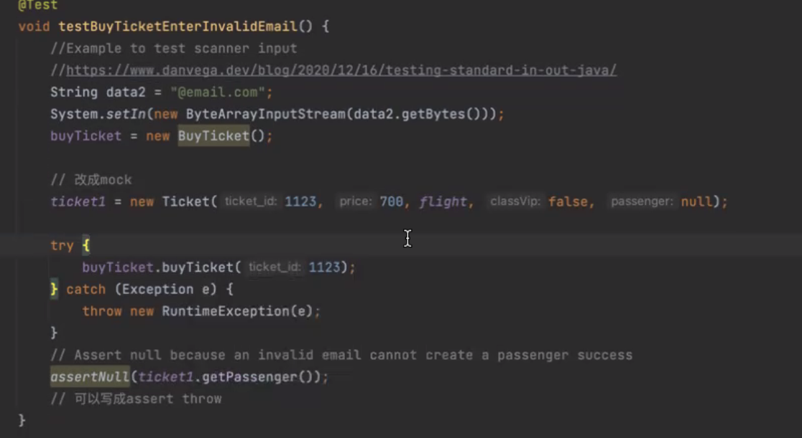
[How to test standard in and out in Java - Dan Vega](https://www.danvega.dev/blog/2020/12/16/testing-standard-in-out-java/) Junit test Scanner


# Week 8 Software Quality and Metrics
## Learning Objectives: 学习目标：
-   know different aspects of software quality metrics  了解软件质量指标的不同方面
-   measure, evaluate and analyse software under test using different quality and complexity metrics 使用不同的质量和复杂性指标测量、评估和分析被测软件

# week 9
## Quiz
Mutation testing is a technique to assess the efficacy and quality of a test suite. It works by making mutants, syntactic variations of the program under test, and measuring how many of the mutants are killed by the test suite. The presence of non-equivalent live mutants represents inadequacy of the test suite.
The following Java method, max, returns the largest of the three integer parameters.
```java
public int max(int a,int b,int c)
{
int temp a;
if (b > a) { temp = b;}

if (c > b) { temp = c;}
return temp;
}
```
Come up with three non-equivalent mutants of the original program, each making use one of the following mutation operators. 
Determine the kill rate of your test suite on each of the three mutants.
Note: The mutation operators you can use are:
ror: Relational operator replacement.
sdl: Statement deletion.
uoi: Unary operator insertion.
scr: Scalar variable replacement.
vie: Scalar variable initialisation elimination.  
Here are three non-equivalent mutants of the original `max` method, each making use of one of the mutation operators:  
以下是原始 `max` 方法的三个非等效突变体，每个突变体都使用其中一个突变运算符：

1.  `ror` - Relational operator replacement:  
    `ror` - 关系运算符替换：

```
public int max(int a, int b, int c) {
    int temp = a;
    if (b >= a) { temp = b; }
    if (c > b) { temp = c; }
    return temp;
}
```

Copy Code

This mutant replaces the `>` operator with `>=` in the first `if` statement. The test case(s) that check for the case where all three integers are equal will fail to notice the mutation.  
此突变体在第一个 `if` 语句中将 `>` 运算符替换为 `>=` 。检查所有三个整数都相等的情况的测试用例将不会注意到突变。

2.  `vie` - Variable initialization elimination:  
    `vie` - 变量初始化消除：

```
public int max(int a, int b, int c) {
    int temp;
    if (b > a) { temp = b; }
    if (c > b) { temp = c; }
    return temp;
}
```

Copy Code

This mutant removes the initialization of `temp` to `a`. The test case(s) that cover the case where `a` is the largest number will fail to notice the mutation.  
这个突变体移除了 `temp` 到 `a` 的初始化。涵盖 `a` 是最大数字的情况的测试用例将无法注意到突变。

3.  `sdl` - Statement deletion:  
    `sdl` - 语句删除：

```
public int max(int a, int b, int c) {
    int temp = a;
    if (c > b) { temp = c; }
    return temp;
}
```

Copy Code

This mutant removes the `if` statement that compares `b` and `a`. The test case(s) that cover the case where `b` is the largest number will fail to notice the mutation.  
这个突变体删除了比较 `b` 和 `a` 的 `if` 语句。涵盖 `b` 是最大数字的情况的测试用例将无法注意到突变。

To determine the kill rate of the test suite on each mutant, we need to run the test suite on each mutant and observe how many mutants are killed (i.e. detected and rejected by the test suite) and how many survive (i.e. not detected and accepted as equivalent by the test suite).  
为了确定测试套件对每个突变体的杀伤率，我们需要在每个突变体上运行测试套件并观察有多少突变体被杀死（即检测到并被测试套件拒绝）和多少存活（即未检测到并接受）与测试套件等效）。

Assuming that the test suite has enough test cases to cover all possible scenarios, here are the expected kill rates:  
假设测试套件有足够的测试用例来覆盖所有可能的场景，这里是预期的杀伤率：

1.  `ror` - Relational operator replacement: The kill rate of this mutant should be lower than 100%, because some test case(s) will fail to detect the mutation when all three integers are equal. The expected kill rate depends on the distribution of integers in the test cases. If the test cases cover cases where all three integers are different, the expected kill rate should be close to 100%. If the test cases cover cases where two or three integers are equal, the expected kill rate will be lower.  
    `ror` - 关系运算符替换：这个突变体的杀死率应该低于 100%，因为当所有三个整数都相等时，一些测试用例将无法检测到突变。预期的杀伤率取决于测试用例中整数的分布。如果测试用例涵盖了所有三个整数都不同的情况，则预期的杀死率应该接近 100%。如果测试用例涵盖两个或三个整数相等的情况，则预期的杀死率会更低。
    
2.  `vie` - Variable initialization elimination: The kill rate of this mutant should be 100% if the test suite has enough test cases to cover all possible scenarios. The mutation is relatively simple and affects only one variable. A well-designed test suite should be able to detect this mutation.  
    `vie` - 变量初始化消除：如果测试套件有足够的测试用例来覆盖所有可能的场景，那么这个突变体的杀灭率应该是100%。突变相对简单，只影响一个变量。一个设计良好的测试套件应该能够检测到这种突变。
    
3.  `sdl` - Statement deletion: The kill rate of this mutant should be lower than 100%, because some test case(s) will fail to detect the mutation when all three integers are equal or when `b` is the largest number. The expected kill rate depends on the distribution of integers in the test cases. If the test cases cover cases where `a` is the largest number or where `c` is larger than `b` and `a`, the expected kill rate should be close to 100%. If the test cases cover cases where `b` is the largest number, the expected kill rate will be lower.  
    `sdl` - 语句删除：这个突变体的杀死率应该低于100%，因为当所有三个整数都相等或者 `b` 是最大数时，一些测试用例将无法检测到突变。预期的杀伤率取决于测试用例中整数的分布。如果测试用例涵盖 `a` 是最大数字或 `c` 大于 `b` 和 `a` 的情况，则预期的杀灭率应接近 100%。如果测试用例涵盖 `b` 数量最多的用例，则预期的杀灭率会更低。

# Quiz11
