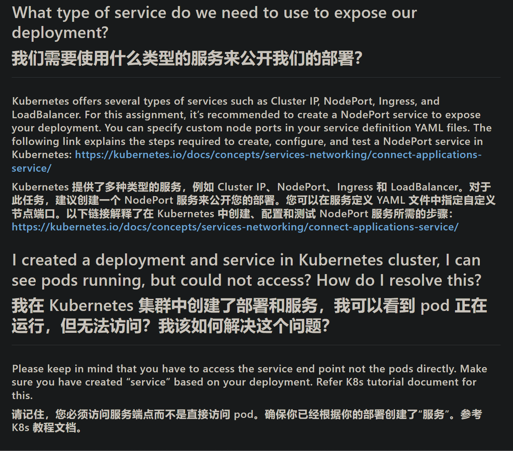
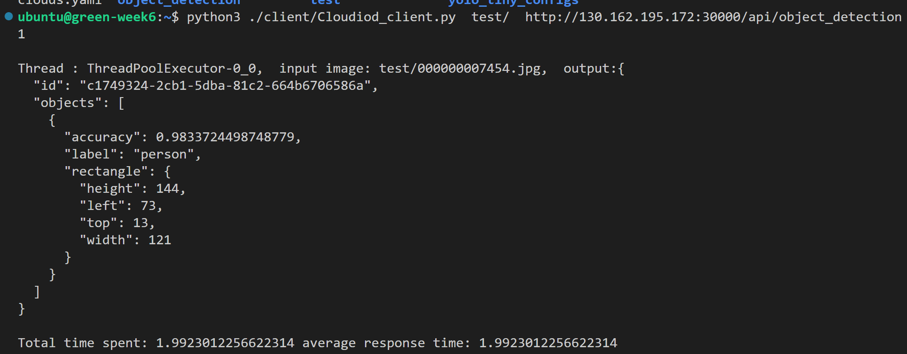
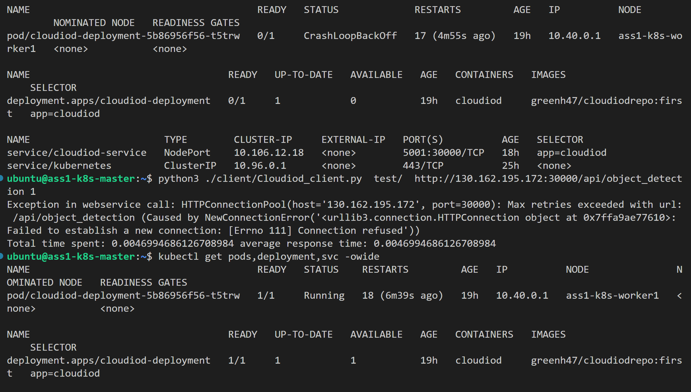
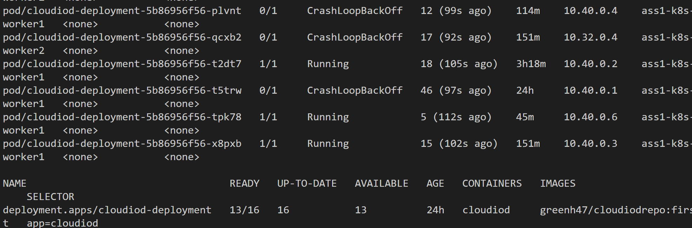
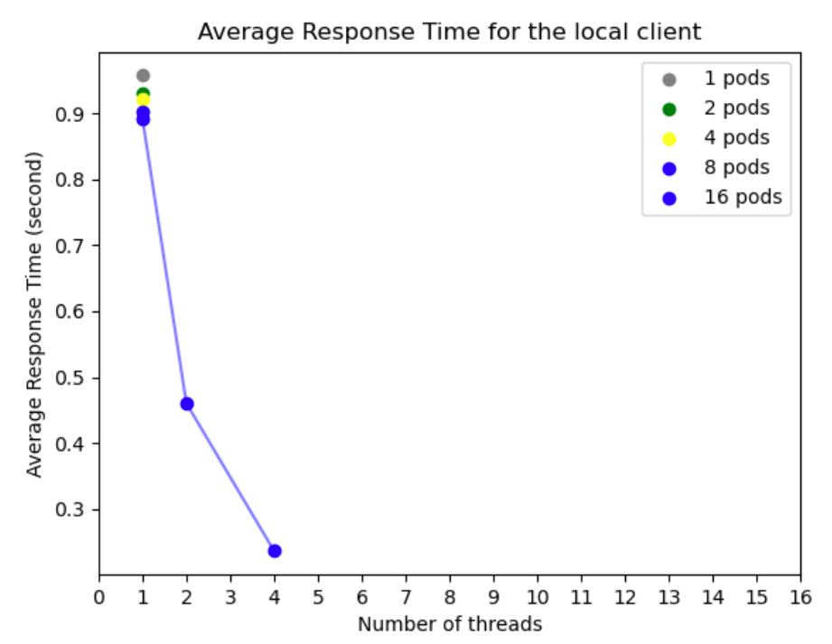

# Assignment 1
[git repository for FIT5225_23s1/assignment1/](https://github.com/GreenH47/FIT5225_23s1/tree/main/assignment1)  
## requirement
+ Writing a python web service that accepts images in JSON object format, uses YOLO and OpenCV  to process images, and returns a JSON object with a list of detected objects.  
+ Building a Docker Image for the object detection web service.  
+ Creating a Kubernetes cluster on virtual machines (instances) in the Oracle Cloud Infrastructure  (OCI).  
+ Deploying a Kubernetes service to distribute inbound requests among pods that are running the object detection service.  
+ Testing the system under varying load and number of pods conditions
## web service  
develop a RESTful API that allows clients to upload images to the server  

You must use Flask to build your web service and any port over 1024. Your Flask server should be multi-threaded to handle multiple clients concurrently.  

Each image should be sent to the web service using an HTTP POST request containing 
JSON object with a unique ID (e.g. UUID) 
and a base64-encoded image (the client script for sending images to the web service is provided to you) 
convert the image into a textual representation using the base64 method A sample JSON request use<font color="#548dd4">d to sen</font>d an image could be as follows 
```json
{  
	"id":"06e8b9e0-8d2e-11eb-8dcd-0242ac130003",  
	"image":"YWRzZmFzZGZhc2RmYXNkZmFzZGYzNDM1MyA7aztqMjUzJyBqaDJsM2 ..."  
}
```
The web service creates a thread per request and uses YOLO and OpenCV python libraries to detect objects in the image.  
You can leverage this script and build a web service using flask and also handle base64 decoding. For each image (request), your web service returns a JSON object with a list of all objects detected in that image as follows  
```json
{  
	"id":"The id from the client request",  
	"objects": [  
		{  
		"label": "human/book/cat/...",  
		"accuracy": a real number between 0-1,  
		"rectangle": {  
			"height": number,  
			"left": number,  
			"top": number,  
			"width": number  
			}  
		}  
		...  
	]  
}
```
The “id” is the same id sent by the client along with the image. This is used to associate an asynchronous  response with the request at the client-side. The “label” represents the type of object detected, e.g., cat,  book, etc. “Accuracy” is a value representing the precision in object detection and a rectangle is a JSON  object showing the position of a box around the object in the image. A sample response is shown below:  
```json
{  
"id": "2b7082f5-d31a-54b7-a46e-5e4889bf69bd",  
"objects": [  
		{  
			"label": "book",  
			"accuracy": 0.7890481352806091,  
			"rectangle": {"height": 114, "left": 380, "top": 363, "width": 254}  
		},  
		{  
			"label": "cat",  
			"accuracy": 0.6877481352806091,  
			"rectangle": {"height": 114, "left": 180, "top": 63, "width": 254}  
		}  
	]  
}
```

You only need to build the server-side RESTful API. We provided the client script (`Cloudiod_client.py`  file) that is designed to invoke the REST API with a different number of requests. Please make sure your  web service is fully compatible with requests sent by the given client script  
use the yolov3-tiny framework to develop a fast and reliable RESTful API for  object detection  We have provided the yolov3-tiny config file and weights in the `yolo_tiny_configs.zip` file. We have  also provided you with a sample group of images (128 images in `inputfolder` in the `client.zip` file and you should use them for testing2. Please extract the given `client.zip` file, where you can find `inputfolder` and `Cloudiod_client.py` along with a `readme` file that explains how you to use them. You can run the client application as follows 
```
python Cloudiod_client.py <inputfolder> <endpoint> <num_threads>

inputfolder represents the folder that contains 128 images for the test. 
The endpoint is the REST  API URL of your web service  
num_threads indicates the total number of threads sending requests  to the server concurrently.  
Please refer to the client script Cloudiod_client.py and ReadMe.txt file for  more details.  
python Cloudiod_client.py inputfolder/ http://118.138.43.2:5000/api/object_detection 16
```

## Dockerfile - 10 Marks
You are required to build a Dockerfile that includes all the required instructions to build your Docker image. [Dockerfile reference](https://docs.docker.com/engine/reference/builder/)  To reduce complexity, dependencies, file sizes, and build times, avoid installing extra or unnecessary package Optimisation of your Dockerfile while keeping it easy to read and maintain is important  

## Kubernetes Cluster - 20 Marks
You are tasked to install and configure a Kubernetes cluster on OCI VMs. 
For this purpose, you are  going to install K8s on group of three VM instances on OCI (All your VM inastances should be AMD  machines, shape VM.Standard.E4.Flex, 8GB Memory and 4 OCPUs).   
You need to setup a K8s cluster with 1 controller and 2 worker nodes that run on OCI VMs. You need to install Docker on VMs. You  should configure your K8s to use Docker to set up and initialise a Kubernetes cluster for you
## Kubernetes Service - 20 Marks
you need to create service and deployment configurations that will in turn create and deploy required pods in the cluster. [Kubernetes Documentation | Kubernetes](https://kubernetes.io/docs/home/)  
Please make sure you set CPU request and CPU limit to “0.5” and memory request and limit to “512MiB” for each pod. initially, you will start with a single pod to test your web service and gradually increase the number as described in the Section. the preferred way of achieving this is by creating replica sets and scaling them accordingly  
you are required to expose your deployment to enable communication with the web service  running inside your pods. You can make use of the NodePort capabilities of Kubernetes to expose your  deployment. 
you should ensure that your controller instance has all the necessary ports open and that necessary network configurations, including OCI “Security Lists,” are properly set up. You may also need to open ports using  “firewalld” on instances. It is recommended that you map a well-known port (such as 80 or 8080) to your  Kubernetes service port
## Experiments 
test your system under a varying number of threads in the client with a different number of resources (pods) in your cluster When the system is up and running, you will run experiments to test the impact of num of threads in the client and number of pods (available resources) in the cluster on the response time of the service The `Cloudiod_client.py` script automatically measures the average response time for you and prints it at the end of its execution 
The number of pods must be scaled to 1, 2, 4, 8 and 16. Since the amount of CPU and Memory allocated to each pod are limited. You will also vary  the number of threads in the client to analyse the impact of increasing the load on the overall average response time of the service To do so, you vary the `num_threads` argument of `Cloudiod_client.py` script  to 1, 2, 4, 8, and 16. This way you will run a total of 5 × 5 = 25 experiments. For each run, 128 images  will be sent to the server and the average response time is collected.  
you are required to conduct two sets of experiments where the client is executed locally on the master node of kubernetes and on a VM instance in your pt-project in Nectar.  
your goal is to create two separate 2D line plots based on the client location (local or Nectar VM) and the number of pods (1, 2, 4, 8, and 16) as the legend. The x-axis should represent the number of threads (1, 2, 4, 8, and 16), and the y-axis should represent the average response time in seconds. . Make sure to run each experiment multiple times to ensure that the average response time values are consistent. If you repeat an experiment,  add a new column to the Excel sheet to record the results  
In your report, discuss this plot and justify  your observations. Please make sure you are using the correct labels for the plot. To automate your  experimentation and collect data points, you can write a script that automatically varies the parameters for the experiments and collects data points

## How to do it
### preparation
1. open the folder in Vscode and install all depend package   
2. move terminal dic to `object_detection` folder and run this command `python object_detection.py ../yolo_tiny_configs/ ../client/inputfolder/000000026923.jpg` here is the result   
3. build flask web service with this code demo   
### web service program
1. change the web service py file into this and run the flask service in terminal  
```python
from flask import Flask
from flask import request

app = Flask(__name__)
@app.route("/")
def hello_world():
    return "<h1>This program is develop by Shixin Huang for fit5225 2023 S1 assignment 1Hello, World!</h1>"

# get user input for detection and return result
@app.route('/api/detect',methods=['POST'])
def detect():
    print("===start===")
    #print (request.get_json())
    return request.get_data()

if __name__=='__main__':
    app.run(debug=True, host='0.0.0.0', threaded=True,port=81)
```
2. run this command `python ./client/Cloudiod_client.py  test/  http://localhost:81/api/detect 1` to call object detection function and the terminal shall return like this info  because the image data format looks like that `{  "id":"06e8b9e0-8d2e-11eb-8dcd-0242ac130003", "image":"YWRzZmFzZGZhc2RmYXNkZmFzZGYzNDM1MyA7aztqMjUzJyBqaDJsM2 ..." }`  so we need extract the `"image":` bytes for further process.
3. then look back the flask terminal we can find the return post result   
4. then change the `object_detection.py` to implement this function into our server  
```python
import base64
# convert base64 string to bytes and doing detection
def base64_convert_detect(base64_string):
    image_bytes = np.fromstring(base64.b64decode(base64_string),np.uint8)
    # copy the fuction in main()
    image=cv2.imdecode(image_bytes,cv2.IMREAD_COLOR).copy()
    image=cv2.cvtColor(image,cv2.COLOR_BGR2RGB)
    # load the neural net.  Should be local to this method as its multi-threaded endpoint
    nets = load_model(CFG, Weights)
    return do_prediction(image, nets, Lables)

# other def method

def do_prediction(image,net,LABELS):
	# other function
	
	# TODO Prepare the output as required to the assignment specification
    # ensure at least one detection exists
    result = []
    if len(idxs) > 0:
        # loop over the indexes we are keeping
        for i in idxs.flatten():
            # we don't need print result so make change
            # and follow the format in assignment request
            # {
            # "label": "human/book/cat/...",
            # "accuracy": a real number between 0-1,
            # "rectangle": {
                # "height": number,
                # "left": number,
                # "top": number,
                # "width": number
                # }
            # }
            result.append(
                {
                "label":LABELS[classIDs[i]],
                "accuracy":confidences[i],
                "rectangle":{
                    "height": boxes[i][3],
                    "left": boxes[i][0],
                    "top": boxes[i][1],
                    "width": boxes[i][2]
                    }
                }
            )


            # print("detected item:{}, accuracy:{}, X:{}, Y:{}, width:{}, height:{}".format(LABELS[classIDs[i]],
            #                                                                                  confidences[i],
            #                                                                                  boxes[i][0],
            #                                                                                  boxes[i][1],
            #                                                                                  boxes[i][2],
            #                                                                                  boxes[i][3]))
    return result
    
## argument
yolo_path  = "./yolo_tiny_configs"

if __name__ == '__main__':
    if len(sys.argv) != 3:
        raise ValueError("Argument list is wrong. Please use the following format:  {} {} {}".
                        format("python iWebLens_server.py", "<yolo_config_folder>", "<Image file path>"))

    main()
```
5. change the `server.py` to match 
```python
# get user input for detection
@app.route('/api/object_detection',methods=['POST'])
def detect():
    print("===start===")
    #print (request.get_json())
    raw_data = json.loads(request.get_json())
    image_data = raw_data["image"]
    result = object_detection.base64_convert_detect(image_data)

    return {
        "id":raw_data["id"],
        "objects":result
    }
```
6. run the command beyond `python ./client/Cloudiod_client.py  test/  http://localhost:5001/api/object_detection 1` and get such result in json format   
### Dockerfile
  

```dockerfile
FROM python:3.8.10
RUN apt update
RUN apt-get install -y python3-opencv
WORKDIR /service
COPY requirements.txt requirements.txt
RUN pip3 install -r requirements.txt
COPY client/ /service/client/
COPY object_detection/ /service/object_detection/
COPY yolo_tiny_configs/ /service/yolo_tiny_configs/
COPY server.py /service/
EXPOSE 5001
CMD [ "python3","/service/server.py"]
```
requirements.txt  
```txt
click==8.1.3
Flask==2.2.3
importlib-metadata==6.1.0
itsdangerous==2.1.2
Jinja2==3.1.2
Markupsafe==2.1.2
numpy==1.24.2
opencv-python==4.7.0.72
Werkzeug==2.2.3
Zipp==3.15.0
```
1. download docker desktop [Docker](https://hub.docker.com/) and follow this instruction [Manual installation steps for older versions of WSL | Microsoft Learn](https://learn.microsoft.com/en-us/windows/wsl/install-manual#step-4---download-the-linux-kernel-update-package) to use docker and its command in vscode and windows
2. build local container `docker build -t cloudiod:first .`  and it will run the Dockerfile command together   
3. run the image in docker desktop and keep the reserve port   
4. and run the command `python ./client/Cloudiod_client.py  test/  http://localhost:5001/api/object_detection 1` we can find the post request in docker   
5. push image to the cloud `docker login`; `docker tag <image name> <docker username>/<repo name>`; `docker push <docker username>/<repo name>`; `docker pull <docker username>/<repo name>`  
### Kubernetes Service 
[Developing on Remote Machines using SSH and Visual Studio Code](https://code.visualstudio.com/docs/remote/ssh)  
1. setting up k8s cluster in OCI and follow the guide of week5 tutorial  
2. ssh to master node and pull docker image we have uploaded 

### Kubernetes Service  
  

[Developing on Remote Machines using SSH and Visual Studio Code](https://code.visualstudio.com/docs/remote/ssh)   
[Remote SSH using Visual Studio Code -](https://saket404.github.io/ssh/ssh-using-vscode/)  
[Connecting Applications with Services | Kubernetes](https://kubernetes.io/docs/tutorials/services/connect-applications-service/) 
deployment and service(node port) apply and use `kubectl apply -f deployment.yaml` to apply the change  
```yaml
# deployment.yaml
apiVersion: apps/v1 # for versions before 1.9.0 use apps/v1beta2
kind: Deployment
metadata:
  name: cloudiod-deployment
spec:
  replicas: 1 # tells deployment to run 2 pods matching the template
  selector:
    matchLabels:
      app: cloudiod
  template:
    metadata:
      labels:
        app: cloudiod
    spec:
      containers:
        - name: cloudiod
          image: <docker image repo>
          resources:
            limits:
              memory: "512Mi"
              cpu: "0.5"      
            requests:
                memory: "512Mi"
                cpu: "0.5" 
          ports:
            - containerPort: 5001


```
use `kubectl get pods,deployment,svc -owide` to check out 
use `kubectl logs <pod name>` to check out logs  
use `curl <pod ip>:<port>` to check web service 

```yaml
# service.yaml
apiVersion: v1 # for versions before 1.9.0 use apps/v1beta2
kind: Service
metadata:
  name: cloudiod-service
spec:
  type: NodePort
  externalTrafficPolicy: Cluster
  selector:
    app: cloudiod
  ports:
    - protocol: TCP
      port: 5001
      targetPort: 5001
      nodePort: 30000
```
use `kubectl apply -f service.yaml` to apply the change(chatgpt really helpful for this assignment)   
and use `curl localhost:<nodePort>` to check web service (in master node and work node). then switch local terminal use `python ./client/Cloudiod_client.py  test/  http://<master node public ip>:30000/api/object_detection 1` to do detection   
and move to nectar instance to test web connection with same command    


### experiment
change the thread number `python Cloudiod_client.py  <input folder name> <URL> <num_threads>` the thread number 1, 2, 4, 8, and 16, and we can see that the thread number effect the response time  
  
another is change nod number in `deployment.yaml` under  `spec: replicas: 1 # tells deployment to run 1 pods matching the template` and don't forget to apply change the nod number `kubectl apply -f deployment.yaml` .   
The number of pods must be scaled to 1, 2, 4, 8 and 16 so this way you will run a total of 5 × 5 = 25 experiments.   For each run, 128 images will be sent to the server and the average response time is collected .and you need to check whether the pod is running before doing the experiment   
[How to Fix OOMKilled Kubernetes Error (Exit Code 137)](https://komodor.com/learn/how-to-fix-oomkilled-exit-code-137/) [# What is Kubernetes CrashLoopBackOff? And how to fix it](https://sysdig.com/blog/debug-kubernetes-crashloopbackoff/)   
use this command to real time monitor the status `watch kubectl get pods,deployment,svc -owide`
  
  
### iteration
reduces the Docker image size, makes the image more memory-efficient, uses a production-grade web server, improves security by using a slim base image, and removes an unnecessary RUN command. 减小了 Docker 映像的大小，使映像的内存效率更高，使用了生产级 Web 服务器，通过使用 slim 基础映像提高了安全性，并删除了不必要的 RUN 命令.   
```dockerfile
FROM python:3.8.10-slim-buster

RUN apt-get update && apt-get install -y --no-install-recommends \
    libgl1-mesa-glx \
    python3-opencv \
    gcc \
    && rm -rf /var/lib/apt/lists/*


WORKDIR /service
COPY requirements.txt requirements.txt
RUN pip3 install --no-cache-dir -r requirements.txt
COPY client/ /service/client/
COPY object_detection/ /service/object_detection/
COPY yolo_tiny_configs/ /service/yolo_tiny_configs/
COPY server.py gunicorn.conf.py /service/
EXPOSE 5001
CMD [ "gunicorn","server:app"]
```

Uses a production-grade web server: The second YAML file uses Gunicorn which is a production-grade WSGI HTTP server for Python. Gunicorn is known for its efficiency when handling multiple requests and connections, making it a better choice for a production environment.
使用生产级 Web 服务器：第二个 YAML 文件使用 Gunicorn，它是用于 Python 的生产级 WSGI HTTP 服务器。 Gunicorn 在处理多个请求和连接时以其高效着称，使其成为生产环境的更好选择。
```
# gunicorn.conf.py
bind = "0.0.0.0:5001"
workers = 1
```

here is the optimization result 
and if sum(num_thread) <= num_pod, you can double run the experiment to save time.  
  

## automatic script
 here is a random number generator for duplicate result and copy it to your clipboard.   
```python
import random
import pyperclip

# random number range
min_val = 0.9
max_val = 1.1

while True:
    # Prompt the user to choose the desired format
    choice = input("Enter 1 to generate 5 results in one column, or 2 to generate 8 results in two columns, or Q to quit: ")

    if choice.upper() == "Q":
        # Exit the loop if the user enters "Q"
        break
    elif choice == "1":
        # Generate 5 random numbers with 14 decimal places and format them as a single column
        rand_nums = [round(random.uniform(min_val, max_val), 14) for _ in range(5)]
        formatted_nums = "\n".join("{:.14f}".format(num) for num in rand_nums)
        print("Random numbers:\n", formatted_nums)
    elif choice == "2":
        # Generate 8 random numbers with 14 decimal places and format them as two columns
        rand_nums = [round(random.uniform(min_val, max_val), 14) for _ in range(8)]
        formatted_nums = []
        for i in range(0, len(rand_nums), 2):
            formatted_nums.append("{:.14f}\t{:.14f}".format(rand_nums[i], rand_nums[i+1]))
        formatted_nums = "\n".join(formatted_nums)
        print("Random numbers:\n", formatted_nums)
    else:
        # Print an error message if the user enters an invalid choice
        print("Invalid choice. Try again.")

    # Copy the formatted numbers to clipboard
    pyperclip.copy(formatted_nums)

```

here is the the script that print the result and the sample table format looks like that  

| Number of pods | Number of threads | Average Response Time 1st (second) | Average Response Time 2rd (Second) |
| -------------- | ----------------- | ---------------------------------- | ---------------------------------- |
| 1              | 1                 | 1.041416535                        | 0.983136018                        |
| 2              | 1                 | 1.036224471                        | 1.076945882                        |
| 4              | 1                 | 1.075466647                        | 0.977709092                        |

```python
import pandas as pd
import matplotlib.pyplot as plt
import numpy as np

# read the Excel file into a pandas dataframe
df = pd.read_excel('Template.xlsx', sheet_name='Local_client')

# define the range of thread numbers for the plot
thread_numbers = list(range(17))

# define colors for each group of pods
colors = ['grey', 'green', 'pink', 'yellow', 'black']

# ensure that we have at least as many colors as the maximum number of pods in the data frame
max_num_pods = df['Number of pods'].max()
if len(colors) < max_num_pods:
    colors += ['blue'] * (max_num_pods - len(colors))

# create a dictionary to store the location of each pod on the plot
pod_locations = {}

# loop through each row and plot the combined average response time on the y-axis
for i in df.index:
    
    # get the pod number and response times from the first and second requests
    pod_number = df['Number of pods'][i]
    avg_response_time = (float(df['Average Response Time 1st (second)'][i]) + float(df['Average Response Time 2rd (Second)'][i]))/2

    # check for N/A and Exception response times and replace them with NaN 
    if pd.isna(df['Average Response Time 1st (second)'][i]) or pd.isna(df['Average Response Time 2rd (Second)'][i]) or 'Exception' in str(df['Average Response Time 1st (second)'][i]) or 'Exception' in str(df['Average Response Time 2rd (Second)'][i]):
        continue

    # calculate x and y coordinates of the point
    x = thread_numbers.index(df['Number of threads'][i])
    y = avg_response_time

    # plot the point and add it to the pod_locations dictionary
    plt.scatter(x, y, color=colors[pod_number-1])
    pod_locations.setdefault(pod_number, []).append((x, y))

# draw lines between pod locations of the same pod number
for pod_number, locations in pod_locations.items():
    # sort locations by the x-coordinate value
    sorted_locations = sorted(locations, key=lambda x: x[0])

    # plot lines between each pair of consecutive points
    for i in range(len(sorted_locations)-1):
        x1, y1 = sorted_locations[i]
        x2, y2 = sorted_locations[i+1]
        plt.plot([x1, x2], [y1, y2], color=colors[pod_number-1], alpha=0.5)

# add a legend and axis labels to the plot
plt.legend(['{} pods'.format(i) for i in pod_locations.keys()])
plt.xlabel('Number of threads')
plt.xticks(range(len(thread_numbers)), thread_numbers)
plt.ylabel('Average Response Time (second)')
plt.title('Average Response Time for the local client')

# save the plot as a PNG image file
plt.savefig('Local_avg_res_time.png')

```
and here is one of the result (not complete version) 

# Assignment 2 designing an AWS Cloud-Based Solution for a Toll Management Application
## Background
INKED, a toll road operator company, has decided to migrate its on-premise toll management application to Amazon Web Services (AWS) and has hired you as a Cloud Solution Architect/Consultant to design their cloud solution. As an AWS solution architect, you will be responsible for designing a cloud-based solution that captures images of vehicle plates and automatically charges driver accounts based on factors such as vehicle type and distance travelled. This solution will leverage AWS services and your knowledge gained in the FIT5225 unit to enable LINKED to collect fees from drivers using their toll system. You may spend some time reading about how automatic toll systems work  
INKED 是一家收费公路运营公司，已决定将其本地收费管理应用程序迁移到 Amazon Web Services (AWS)，并聘请您作为云解决方案架构师/顾问来设计他们的云解决方案。作为 AWS 解决方案架构师，您将负责设计一个基于云的解决方案，该解决方案可捕获车牌图像并根据车辆类型和行驶距离等因素自动向驾驶员账户收费。该解决方案将利用 AWS 服务和您在 FIT5225 单元中获得的知识，使 LINKED 能够向使用其收费系统的司机收取费用。您可能会花一些时间阅读自动收费系统的工作原理
## Report
### requirement
+ The report must be in PDF format.  
+ The report should not exceed 1500 words.  
+ Only ONE diagram should be included in the report apart from the text.  
+ A cover sheet must be included in the report, containing all necessary information such as student name, ID, unit, etc

###  architectural diagram of your solution 
Include an architectural diagram of your solution using AWS Architecture Icons. You can find more information and download the icons from the official AWS website: [AWS Architecture Icons](https://aws.amazon.com/architecture/icons/) Your architecture diagram should illustrate the various components of your solution, including the AWS services used, and how they interact with each other. You can use Microsoft PowerPoint or any other tools like this: [Flowchart Maker & Online Diagram Software](https://www.draw.io/index.html).    
使用 AWS 架构图标包括您的解决方案的架构图。您可以从 AWS 官方网站找到更多信息并下载图标：。您的架构图应说明解决方案的各个组件，包括使用的 AWS 服务，以及它们如何相互交互。您可以使用 Microsoft PowerPoint 或任何其他工具，例如。

### address key aspects
In your design explanation, ensure to consider and address key aspects such as <mark style="background: #ff0000;">Scalability, Security, Failure Handling (including availability and reliability) and cost-effectiveness</mark>. To do so, you may need to make <mark style="background: #3CB371;">reasonable assumptions</mark> about the system’s <mark style="background: #0000CD;">requirements,</mark> <mark style="background: #D2691E;">constraints</mark>, and<span style="background:#d3f8b6"> limitations</span>, but ensure that each assumption is justifiable based on the information provided. E<span style="background:#9254de">xplain how each assumption influenced</span> your design decisions, with a particular focus on these key aspects  
在您的设计说明中，确保考虑并解决关键方面，例如可扩展性、安全性、故障处理（包括可用性和可靠性）和成本效益。为此，您可能需要对系统的要求、约束和限制做出合理的假设，但要确保根据所提供的信息，每个假设都是合理的。解释每个假设如何影响您的设计决策，并特别关注这些关键方面

### understanding of AWS services
Provide clear and concise explanations that <mark style="background: #ff0000;">demonstrate your understanding of AWS services</mark>, including <mark style="background: #3CB371;">why you selected specific AWS service</mark>s, <mark style="background: #D2691E;">what specific type of that service was used</mark>, and  <mark style="background: #0000CD;">which settings were considered</mark>. Your explanation should emphasize on h<mark style="background: #ff0000;">ow your application works</mark> and <mark style="background: #3CB371;">how various components of the architecture interact </mark>with each other.  
提供清晰简洁的解释，证明您对 AWS 服务的理解，包括您选择特定 AWS 服务的原因、使用了哪种特定类型的服务以及考虑了哪些设置。您的解释应强调您的应用程序如何工作以及架构的各个组件如何相互交互。

### The quality of your design
The quality of your design will be evaluated based on its <mark style="background: #0000CD;">completeness</mark>, <mark style="background: #ff0000;">correctness</mark>, and <mark style="background: #3CB371;">clarity</mark>. Make sure to i<mark style="background: #D2691E;">nclude all the relevant components and AWS services</mark> required to implement your solution. Use <mark style="background: #0000CD;">clear and consistent labelling and notation</mark> in your architecture diagram. Finally, make sure your d<mark style="background: #D2691E;">esign is easy to read and understand</mark>  
您的设计质量将根据其完整性、正确性和清晰度进行评估。确保包括实施您的解决方案所需的所有相关组件和 AWS 服务。在架构图中使用清晰一致的标签和符号。最后，确保您的设计易于阅读和理解

### solution focus
Your solution should focus solely on the task of <mark style="background: #0000CD;">reading and storing vehicles’ plates</mark> and <mark style="background: #ff0000;">issuing charging bills for drivers</mark>. It is not necessary to consider other aspects of the system, such as user registration portals or user databases. You may assume that your system has access to a relational  database (such as Aurora RDS) that contains all necessary information regarding drivers and their  vehicles  
您的解决方案应该只专注于读取和存储车牌以及为司机开具收费单的任务。没有必要考虑系统的其他方面，例如用户注册门户或用户数据库。您可以假设您的系统可以访问关系数据库（例如 Aurora RDS），其中包含有关驾驶员及其车辆的所有必要信息

## Note
### storage
  
[What is Amazon S3? - Amazon Simple Storage Service](https://docs.aws.amazon.com/AmazonS3/latest/userguide/Welcome.html)  


  [Object Storage Classes – Amazon S3](https://aws.amazon.com/s3/storage-classes/)  

  

### EC2 Amazon Elastic Compute Cloud
[Amazon EC2](https://aws.amazon.com/pm/ec2/)  
[Amazon EC2 Instance Types - Amazon Web Services](https://aws.amazon.com/ec2/instance-types/)  
### EBS Amazon Elastic Block Store
[Amazon Elastic Block Store (Amazon EBS) - Amazon Elastic Compute Cloud](https://docs.aws.amazon.com/AWSEC2/latest/UserGuide/AmazonEBS.html)  

### Amazon Virtual Private Cloud (Amazon VPC)
[What is Amazon VPC? - Amazon Virtual Private Cloud](https://docs.aws.amazon.com/vpc/latest/userguide/what-is-amazon-vpc.html)  


### architect
[Reference Architecture Examples and Best Practices](https://aws.amazon.com/architecture/?cards-all.sort-by=item.additionalFields.sortDate&cards-all.sort-order=desc&awsf.content-type=*all&awsf.methodology=*all&awsf.tech-category=*all&awsf.industries=*all&awsf.business-category=*all) 
[AWS Well-Architected - Build secure, efficient cloud applications](https://aws.amazon.com/architecture/well-architected/?achp_expl1&wa-lens-whitepapers.sort-by=item.additionalFields.sortDate&wa-lens-whitepapers.sort-order=desc&wa-guidance-whitepapers.sort-by=item.additionalFields.sortDate&wa-guidance-whitepapers.sort-order=desc)  
[Overview of Amazon Web Services - Overview of Amazon Web Services](https://docs.aws.amazon.com/whitepapers/latest/aws-overview/introduction.html?achp_expl3)  
[Establishing your Cloud Foundation on AWS](https://aws.amazon.com/architecture/cloud-foundations/)  

### diagram
[AWS Diagram - Learn What is a AWS Architecture Diagram and More](https://www.smartdraw.com/aws-diagram/)  
[Free AWS Architecture Diagram Examples | EdrawMax Online](https://www.edrawmax.com/article/aws-architecture-diagram-examples.html)  
[IoT | AWS Architecture Center](https://aws.amazon.com/architecture/iot/?cards-all.sort-by=item.additionalFields.sortDate&cards-all.sort-order=desc&awsf.content-type=*all&awsf.methodology=*all)  


  

  
  

# assignment 2 CloudSnap: A Serverless Image Storage System with Tagging
## Synopsis  
This assignment aims to build a cloud-based online system that allows users to store and retrieve images based on auto-generated tags. The focus of this project is to design a serverless application that enables clients to upload their images to public cloud storage. Upon image upload, the application automatically tags the image with the objects detected in it, such as person, car, etc. Later on, clients can query images based on the objects present in them. To achieve this, the application provides users with a list of image URLs (or tumbnails) that include the specific queried objects 概要 本作业旨在构建一个基于云的在线系统，允许用户根据自动生成的标签存储和检索图像。这个项目的重点是设计一个无服务器应用程序，使客户能够将他们的图像上传到公共云存储。上传图像后，应用程序会自动为图像标记检测到的物体，例如人、车等。稍后，客户端可以根据图像中存在的物体查询图像。为此，该应用程序为用户提供了包含特定查询对象的图像 URL（或缩略图）列表

## Assignment Description  
Teams should develop an AWS cloud-based solution that leverages services such as S3, Lambda, API Gateway, and database services (e.g., DynamoDB) to build a system for automated object detection tagging and query handling. The teams should produce a solution that enables end-users to upload their images into an S3 bucket. Upon uploading an image to a designated S3 bucket, a lambda function is automatically triggered, which uses the Yolo object detection feature to identify the objects in the image and stores the list of detected objects along with the image’s S3 URL in a database. Furthermore, the end-user should be able to submit queries to an API endpoint using API Gateway to search for tagged images (more details to come). Table 1 provides a glossary of terms used in the assignment description 任务描述 团队应开发一个基于 AWS 云的解决方案，该解决方案利用 S3、Lambda、API 网关和数据库服务（例如 DynamoDB）等服务来构建用于自动对象检测标记和查询处理的系统。团队应该制定一个解决方案，使最终用户能够将他们的图像上传到 S3 存储桶中。将图像上传到指定的 S3 存储桶后，会自动触发 lambda 函数，该函数使用 Yolo 对象检测功能来识别图像中的对象，并将检测到的对象列表与图像的 S3 URL 一起存储在数据库中。此外，最终用户应该能够使用 API 网关向 API 端点提交查询以搜索标记的图像（更多细节即将到来）。表 1 提供了作业描述中使用的术语表  
## Authentication and Authorisation  
Security is one of the most crucial aspects of developing cloud-first applications. When your application is publicly exposed, you must ensure that your endpoints and resources are safeguarded against unauthorized access and malicious requests. AWS, through its Cognito service, provides a straightforward, secure, and centralized approach to protect your web application and its various resources from unauthorized access 身份验证和授权安全性是开发云优先应用程序最重要的方面之一。当您的应用程序公开时，您必须确保您的端点和资源受到保护，免受未经授权的访问和恶意请求。 AWS 通过其 Cognito 服务提供了一种直接、安全和集中的方法来保护您的 Web 应用程序及其各种资源免遭未经授权的访问  
To leverage the AWS Cognito service, first, you need to create a user pool that stores user credentials. Then, you need to create and configure a client app that provides access to your application and/or other AWS services to query and use the user pool. Finally, you have two options to communicate with the AWS Cognito service and perform authentication and/or authorization: 1) Use the AWS Amplify JavaScript Library to initialize the authentication module of your application or 2) Use the AWS JavaScript SDK to access the user pool and identity provider(s) that you have defined earlier 要利用 AWS Cognito 服务，首先，您需要创建一个用户池来存储用户凭证。然后，您需要创建和配置一个客户端应用程序，以提供对您的应用程序和/或其他 AWS 服务的访问，以查询和使用用户池。最后，您有两个选项可以与 AWS Cognito 服务通信并执行身份验证和/或授权：1) 使用 AWS Amplify JavaScript 库初始化应用程序的身份验证模块或 2) 使用 AWS JavaScript SDK 访问用户池和您之前定义的身份提供者  
## workflow and features
Detect whether a user is authenticated or not. If the user has not signed in, access to all pages/endpoints except the sign-up service needs to be blocked, and the user should be redirected to the “sign-up.html” page to register a new account. For each new account, you need to record the user’s email address, first name, last name, and password. Cognito will take care of sending an email to new users, asking them to verify their email address and change their temporary password 检测用户是否通过身份验证。如果用户尚未登录，则需要阻止对除注册服务以外的所有页面/端点的访问，并将用户重定向到“sign-up.html”页面以注册新帐户。对于每个新帐户，您需要记录用户的电子邮件地址、名字、姓氏和密码。 Cognito 将负责向新用户发送电子邮件，要求他们验证他们的电子邮件地址并更改他们的临时密码  
Your application should include a login page that allows users to sign in. After successful authentication, users should be able to upload images, submit queries, view query results, and sign out of the application. All of these services must be protected against unauthorized access. You can implement login and sign-up web pages using either the Hosted UI feature of Cognito or your own version that calls Cognito APIs 您的  应用程序应包含一个允许用户登录的登录页面。成功验证后，用户应该能够上传图片、提交查询、查看查询结果以及退出应用程序。所有这些服务都必须防止未经授权的访问。您可以使用 Cognito 的托管 UI 功能或您自己调用 Cognito API 的版本来实现登录和注册网页  
Uploading files to an S3 bucket, invoking Lambda functions to execute the business logic of your application, and accessing the database for data storage and retrieval all require fine-grained access control permissions that you need to set up via IAM roles and appropriate policies. It is important to note that IAM roles in AWS Academy have several limitations. Therefore, you should carefully consider how to perform authentication and authorization in your system while taking these limitations into account. 将文件上传到 S3 存储桶、调用 Lambda 函数来执行应用程序的业务逻辑以及访问数据库以进行数据存储和检索都需要细粒度的访问控制权限，您需要通过 IAM 角色和适当的策略来设置这些权限。请务必注意 2 AWS Academy 中的 IAM 角色有一些限制。因此，在考虑这些限制的同时，您应该仔细考虑如何在您的系统中执行身份验证和授权。  
As an optional feature, you can add federated authentication using AWS Cognito Identity Pools to your application and earn bonus marks (up to 5 points shall be awarded if you add federated authentication to your project). For this purpose, you need to create a Facebook or Google app that serves as an external identity provider and authenticates users on behalf of your application, then forwards authentication  tokens to your application. Note that having external authentication providers in your project is not mandatory. Since federated authentication might be challenging and maybe impossible with your AWS academy account, I strongly recommend that you finish the requirements of the assignment first, and then, if you have extra time, work on this feature 作为一项可选功能，您可以将使用 AWS Cognito 身份池的联合身份验证添加到您的应用程序并获得奖励分数（如果您将联合身份验证添加到您的项目，最多可获得 5 分）。为此，您需要创建一个 Facebook 或 Google 应用程序作为外部身份提供者并代表您的应用程序对用户进行身份验证，然后将身份验证令牌转发到您的应用程序。请注意，在您的项目中拥有外部身份验证提供程序不是强制性的。由于联合身份验证可能具有挑战性，甚至可能无法使用您的 AWS academy 帐户，我强烈建议您先完成作业的要求，然后，如果您有多余的时间，再研究此功能  
## Image Upload  
Your solution should provide a mechanism to upload an image to an S3 bucket. Uploading an image to an S3 bucket can be done either through an API Gateway endpoint (using POST REST APIs) or it can be done directly using AWS SDKs (for instance, boto3 if you are using Python). Whenever an image is uploaded to the S3 bucket, your system must trigger an event and invoke a Lambda function 图片上传 您的解决方案应该提供一种将图片上传到 S3 存储桶的机制。可以通过 API 网关端点（使用 POST REST API）将图像上传到 S3 存储桶，也可以直接使用 AWS 开发工具包（例如，如果您使用 Python，则为 boto3）。每当图像上传到 S3 存储桶时，您的系统都必须触发事件并调用 Lambda 函数  
You are expected to configure the triggers and grant the required Amazon resource permissions (execution roles) for the Lambda function. The Lambda function should read the uploaded image, detect objects in the image, and save the list of detected objects (called tags) along with the S3 URL for that image in an AWS database for future queries. Please note that you should update your Yolo script that you were given in your first assignment to suit the AWS Lambda function. This includes removing any Flask-related code, incorporating the Lambda function and required libraries to read the image from S3 buckets, and storing the S3 URL and tags in the database. You may create a separate S3 bucket to store the Yolo and other config files, which can be referenced in your Lambda function 您需要为 Lambda 函数配置触发器并授予所需的 Amazon 资源权限（执行角色）。 Lambda 函数应该读取上传的图像，检测图像中的对象，并将检测到的对象列表（称为标签）连同该图像的 S3 URL 保存在 AWS 数据库中以供将来查询。请注意，您应该更新您在第一个作业中获得的 Yolo 脚本以适应 AWS Lambda 函数。这包括删除任何与 Flask 相关的代码，合并 Lambda 函数和所需的库以从 S3 存储桶中读取图像，以及将 S3 URL 和标签存储在数据库中。您可以创建一个单独的 S3 存储桶来存储 Yolo 和其他配置文件，这些文件可以在您的 Lambda 函数中引用  
You may also ignore detected objects with an accuracy of detection below a specific threshold (e.g., 0.6). Please note that Amazon Rekognition is a specialised AWS service for identifying objects in images and can be used instead of Yolo. However, in this assignment, you are not allowed to use the Amazon Rekognition service 您还可以忽略检测精度低于特定阈值（例如 0.6）的检测对象。请注意，Amazon Rekognition 是一种专门用于识别图像中对象的 AWS 服务，可以用来代替 Yolo。但是，在此作业中，您不得使用 Amazon Rekognition 服务
## Queries  
Your solution should provide APIs which allow following queries.  
### Find images based on the tags
Find images based on the tags: The user can send a text-based query to request URLs of images  that contain specific tags with a minimum repetition number for each tag (e.g., “person, 1”, “person,  2, car, 1”). You are expected to create an API Gateway with a RESTful API that allows users to submit their requests, such as GET or POST requests 查询 您的解决方案应提供允许进行以下查询的 API。 1. 根据标签查找图像：用户可以发送基于文本的查询来请求包含特定标签的图像的 URL，每个标签的最小重复次数（例如，“人，1”，“人，2，车” , 1”）。您应该创建一个带有 RESTful API 的 API 网关，允许用户提交他们的请求，例如 GET 或 POST 请求   
Your application might send a list of tags via specific GET parameters in the requested URL, for  example:  
https://jyufwbyv8.execute-api.us-east-1.amazonaws.com/dev/search?tag1=cat&tag1count=1&tag2=car&tag2count=1  
or it can be a POST request with a JSON object including a list of tags and their counts. A sample JSON object for a query request is given below 或者它可以是带有 JSON 对象的 POST 请求，其中包括标签列表及其计数。下面给出了查询请求的示例 JSON 对象:  
```json
{  
"tags": [  
	{  
		"tag": "person",  
		"count": 1  
	},  
	{  
		"tag": "desk",  
		"count": 2  
	},  
...  
]  
}
```
A response should include the list of URLs to all images that contain all the requested tags with at least the number in the count value in the query. This can be a JSON message similar to the following 响应应包括所有图像的 URL 列表，这些图像包含所有请求的标签，至少包含查询中计数值中的数字。这可以是类似于以下内容的 JSON 消息  
```json 
{  
	"links": [  
		"https://cloudsnap.s3.amazonaws.com/image1.png",  
		"https://cloudsnap.s3.amazonaws.com/image59.png",  
		"https://cloudsnap.s3.amazonaws.com/image180.png"  
	]  
}
```
Your query may require to trigger one more Lambda function that receives a list of tags and finds s3-url of images containing all tags in the query with least number of repetition from the database, i.e., logical AND operation, not OR operation between tags. By default, a count of 1 should be considered for each tag if it is not specified in the UI or the query. In your UI instead of showing the s3-urls you can preview the images found as the results 您的查询可能需要触发另一个 Lambda 函数，该函数接收标签列表并从数据库中查找包含查询中所有标签且重复次数最少的图像 s3-url，即逻辑 AND 操作，而不是标签之间的 OR 操作。默认情况下，如果未在 UI 或查询中指定，则每个标记的计数应为 1。在您的用户界面中，您可以预览作为结果找到的图像，而不是显示 s3-url  
### Find images based on the tags of an image  
Find images based on the tags of an image: The user can send an image as part of an API call. The list of all objects (tags) and their counts in the sent image is discovered and then all the images in CloudSnap storage containing those set of tags and with at least count numbers are found. Finally, as a response, the list of URLs to matching images (similar to to the previous section) are returned to the user. You should make sure that the image uploaded for the query purpose is not added to the database or stored in s3 根据图像标签查找图像：用户可以将图像作为 API 调用的一部分发送。发现发送图像中所有对象（标签）及其计数的列表，然后找到 CloudSnap 存储中包含这些标签集且至少具有计数的所有图像。最后，作为响应，匹配图像的 URL 列表（类似于上一节）返回给用户。您应该确保为查询目的上传的图像没有添加到数据库或存储在 s3 中  
### Manual addition or removal of tags  
Manual addition or removal of tags: Your solution should also provide an API that allow end-user to add or remove tags of an image. You are expected to create a POST API which allow users to submit their requests. A sample JSON message sent to add/remove tags is  手动添加或删除标签：您的解决方案还应提供允许最终用户添加或删除图像标签的 API。您应该创建一个 POST API，允许用户提交他们的请求。发送给添加/删除标签的示例 JSON 消息是
```json
{  
	"url":"https://cloudsnap.s3.amazonaws.com/image1.png",  
	"type": 1, /* 1 for add and 0 for remove */  
	"tags": [  
		{  
			"tag": "person",  
			"count": 2  
		},  
		{  
			"tag": "alex",  
			"count": 1  
		}  
	]  
}
```
“type” can be set to 1 or 0 for adding or removing a tag, respectively. The above request adds two "person" tags to the image and one "alex" tag to the tag list of the image in the URL: If “type” is set to 0, the tags are removed from the tag list of the image up to the maximum of either the available tags or the count value. For example, if the count for the tag person is 2 and only one tag of person is in the tag list, we remove the only existing tag. If a tag is not included in the list of tags requested for deletion, you can simply ignore it in the request. Please note that if “count” is not specified in the request, the default value of 1 should be considered. https://cloudsnap.s3.amazonaws.com/image1.png. This can be done through a Lambda function to update the entry in the database “type” 可以设置为 1 或 0，分别用于添加或删除标签。上面的请求在URL中为图片添加了2个“person”标签，为图片的标签列表添加了1个“alex”标签： 如果“type”设置为0，则标签从图片的标签列表中移除到可用标签或计数值的最大值。例如，如果标签 person 的计数为 2，并且标签列表中只有一个 person 标签，我们将删除唯一存在的标签。如果某个标签不在请求删除的标签列表中，您可以在请求中忽略它。请注意，如果请求中未指定“count”，则应考虑默认值 1。 https://cloudsnap.s3.amazonaws.com/image1.png。这可以通过 Lambda 函数更新数据库中的条目来完成  
### Delete an image
Delete an image: The user can communicate the URL of an image to an API and the system should remove the image from s3 and relevant entries from the database. 删除图像：用户可以将图像的 URL 传递给 API，系统应该从 s3 中删除图像，并从数据库中删除相关条目。  
## User Interface
You can design a simple user interface (UI) (We suggest web-based GUI). But UI can be of any form that includes the following: upload images, submit queries, and view query results. A UI makes your system easier and more enjoyable to use. However, you have the option not to create a UI for application or have UI for some parts and not the others. If you opt to ignore UI or full-fledged UI, you can write scripts (e.g., Python) to handle communications with your application APIs. Please be aware that you might need to manually copy credentials provided by the identity pool to your scripts each time if you choose to work with the later option 您可以设计一个简单的用户界面 (UI)（我们建议使用基于 Web 的 GUI）。但 UI 可以是任何形式，包括以下内容：上传图片、提交查询和查看查询结果。 UI 使您的系统使用起来更轻松、更愉快。但是，您可以选择不为应用程序创建 UI，或者为某些部分创建 UI 而其他部分没有。如果您选择忽略 UI 或成熟的 UI，您可以编写脚本（例如 Python）来处理与应用程序 API 的通信。请注意，如果您选择使用后面的选项，您可能每次都需要手动将身份池提供的凭据复制到您的脚本中  
## Team Report - 750 words
+ Include an architecture diagram in the team report. For the architecture diagram, you must use AWS Architecture Icons (more info can be found here: https://aws.amazon.com/architecture/icons/) 在团队报告中包含架构图。对于架构图，您必须使用 AWS 架构图标（更多信息可以在这里找到：https://aws.amazon.com/architecture/icons/） 
+ Include a table to describe the role of each team member in your team report, You can provide a three-column table in your report that shows student name and id, percentage of contribution and elements of the project the member contributed (maximum of 100 words per member) 在你的团队报告中包括一个表格来描述每个团队成员的角色，你可以在你的报告中提供一个三列的表格，显示学生姓名和 ID、贡献百分比和成员贡献的项目元素（最多 100 字每个成员）  
+ Report includes a simple user guide for testing your application (you should keep your application up and running for two weeks after the submission deadline) 报告包括用于测试您的应用程序的简单用户指南（您应该在提交截止日期后的两周内保持您的应用程序正常运行）  
+ Your report should include a link to the source code (GitHub or Bitbucket). All students must commit their code to a private code repository rather than delegate this to a single team member. This can also provide an evidence base if teams run into “issues” and how you contributed to the project. You should share your private repository with the whole teaching team. Please do not use a public repository to avoid any plagiarism 您的报告应包含指向源代码（GitHub 或 Bitbucket）的链接。所有学生都必须将他们的代码提交到私有代码存储库，而不是将其委托给单个团队成员。如果团队遇到“问题”以及您如何为项目做出贡献，这也可以提供证据基础。您应该与整个教学团队共享您的私人存储库。请不要使用公共存储库以避免任何窃  

## Individual report - 750 words  
+ In your individual report, you should describe your role in the project, and how you contributed to the delivery of the system (150 words) 在你的个人报告中，你应该描述你在项目中的角色，以及你如何为系统的交付做出贡献（150 字）  
+ Include a personal reflection on the team work your experience in working with other individual team members in your group. Comment on your teammates’ work, challenges the entire team faced, and how well the team worked (150 words) 包括对团队工作的个人反思，你与团队中其他个人团队成员合作的经验。评论队友的工作、整个团队面临的挑战以及团队的工作情况（150 字）  
+ You should answer the following questions (a paragraph with 100 word each): 1. What are the updates you will perform to your application if you have users from all over the world? 2. What sort of design changes you will make to reduce chance of failures in your application? 3. What are the design changes you will make to increase the performance of your applications in terms of response time, query handling, and loading images?  您应该回答以下问题（每段 100 字）： 1. 如果您的用户来自世界各地，您将对您的应用程序执行哪些更新？ 2. 您将进行哪些设计更改以减少应用程序失败的可能性？ 3. 为了提高应用程序在响应时间、查询处理和加载图像方面的性能，您将进行哪些设计更改？
