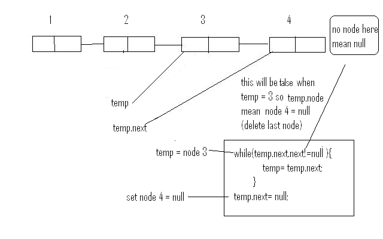

[Explore - LeetCode](https://leetcode.com/explore/learn/card/linked-list/)  
Similar to the array, the linked list is also a `linear` data structure. Here is an example:  
与数组类似，链表也是一种 `linear` 数据结构。下面是一个示例：


As you can see, each element in the linked list is actually a separate object while all the objects are `linked together by the reference field` in each element.  
如您所见，链表中的每个元素实际上都是一个单独的对象，而所有对象都在 `linked together by the reference field` 每个元素中。

There are two types of linked list: singly linked list and doubly linked list. The example above is a singly linked list and here is an example of doubly linked list:  
链表有两种类型：单链表和双向链表。上面的例子是一个单链表，下面是一个双向链表的例子：

  
## Singly Linked List  
简介 - 单向链表

[Report Issue 报告问题](https://github.com/LeetCode-Feedback/LeetCode-Feedback/issues)

---

Each node in a singly-linked list contains not only the value but also `a reference field` to link to the next node. By this way, the singly-linked list organizes all the nodes in a sequence.  
单向链表中的每个节点不仅包含值，还 `a reference field` 包含链接到下一个节点。通过这种方式，单向链表按顺序组织所有节点。

Here is an example of a singly-linked list:  
下面是单链表的示例：


The blue arrows show how nodes in a singly linked list are combined together.  
蓝色箭头显示单向链表中的节点如何组合在一起。

### Node Structure 节点结构
Here is the typical definition of a node in a singly-linked list:  
以下是单链表中节点的典型定义：
```java
// Definition for singly-linked list.
public class SinglyListNode {
    int val;
    SinglyListNode next;
    SinglyListNode(int x) { val = x; }
}
```
In most cases, we will use the `head` node (the first node) to represent the whole list.  
在大多数情况下，我们将使用节点（第一个 `head` 节点）来表示整个列表。
Unlike the array, we are not able to access a random element in a singly-linked list in constant time. If we want to get the ith element, we have to traverse from the head node one by one. It takes us O(N) time on average to visit an element by index, where N is the length of the linked list.
与数组不同，我们无法在常量时间内访问单向链表中的随机元素。如果我们想获取 i th 元素，我们必须从头节点逐个遍历。平均需要我们 O(N) 时间到 visit an element by index ，其中 N 是链表的长度。

For instance, in the example above, the head is the node 23. The only way to visit the 3rd node is to use the "next" field of the head node to get to the 2nd node (node 6); Then with the "next" field of node 6, we are able to visit the 3rd node.
例如，在上面的例子中，头部是节点 23。访问第 3 个节点的唯一方法是使用头节点的“下一个”字段到达第 2 个节点（节点 6）;然后使用节点 6 的“下一个”字段，我们可以访问第 3 个节点。

### Add Operation - Singly Linked List
If we want to add a new value after a given node `prev`, we should:   
如果我们想在给定节点 `prev` 之后添加一个新值，我们应该：

1. Initialize a new node `cur` with the given value;  
    使用给定值初始化一个新节点 `cur` ;
2. Link the "next" field of `cur` to prev's next node `next`;  
    将 的 “next” 字段链接到 prev `cur` 的下一个节点 `next` ;
3. Link the "next" field in `prev` to `cur`.  
    将 `prev` “下一个”字段链接到 `cur` 。

Unlike an array, we don’t need to move all elements past the inserted element. Therefore, you can insert a new node into a linked list in `O(1)` time complexity if you have a reference to `prev`, which is very efficient.  
与数组不同，我们不需要将所有元素都移动到插入的元素之后。因此，如果您引用 `prev` ，则可以在时间复杂度中 `O(1)` 插入新节点，这非常有效。
### Delete Operation - Singly Linked List  
删除操作 - 单向链表

If we want to delete an existing node `cur` from the singly linked list, we can do it in two steps:  
如果我们想从单向链表中删除现有节点 `cur` ，我们可以通过两个步骤来完成：

1. Find cur's previous node `prev` and its next node `next`;  
    查找cur的上一个节点和下一个节点 `prev` `next` ;
2. Link `prev` to cur's next node `next`.  
    链接到 `prev` cur的下一个节点 `next` 。

In our first step, we need to find out `prev` and `next`. It is easy to find out `next` using the reference field of `cur`. However, we have to traverse the linked list from the head node to find out `prev` which will take `O(N)` time on average, where N is the length of the linked list. So the time complexity of deleting a node will be `O(N)`.  
在我们的第一步中，我们需要找出 `prev` 和 `next` .使用 的 `cur` 参考字段很容易找到 `next` 。但是，我们必须从头节点遍历链表，以找出 `prev` 平均需要 `O(N)` 时间的链表，其中 N 是链表的长度。因此，删除节点的时间复杂度将是 `O(N)` 。

The space complexity is `O(1)` because we only need constant space to store our pointers.  
空间复杂性是 `O(1)` 因为我们只需要恒定的空间来存储我们的指针

### Design Linked List 设计链表
```run-java
class MyLinkedList {
    private Node head;
    private int size;

    private class Node {
        int val;
        Node next;

        Node(int val) {
            this.val = val;
        }
    }

    public MyLinkedList() {
        head = null;
        size = 0;
    }

    public int get(int index) {
        if (index < 0 || index >= size) {
            return -1;
        }

        Node curr = head;
        for (int i = 0; i < index; i++) {
            curr = curr.next;
        }

        return curr.val;
    }

    public void addAtHead(int val) {
        Node newNode = new Node(val);
        newNode.next = head;
        head = newNode;
        size++;
    }

    public void addAtTail(int val) {
        Node newNode = new Node(val);

        if (head == null) {
            head = newNode;
        } else {
            Node curr = head;
            while (curr.next != null) {
                curr = curr.next;
            }
            curr.next = newNode;
        }

        size++;
    }

    public void addAtIndex(int index, int val) {
        if (index < 0 || index > size) {
            return;
        }

        if (index == 0) {
            addAtHead(val);
        } else if (index == size) {
            addAtTail(val);
        } else {
            Node newNode = new Node(val);
            Node curr = head;
            for (int i = 0; i < index - 1; i++) {
                curr = curr.next;
            }
            newNode.next = curr.next;
            curr.next = newNode;
            size++;
        }
    }

    public void deleteAtIndex(int index) {
        if (index < 0 || index >= size) {
            return;
        }

        if (index == 0) {
            head = head.next;
        } else {
            Node curr = head;
            for (int i = 0; i < index - 1; i++) {
                curr = curr.next;
            }
            curr.next = curr.next.next;
        }

        size--;
    }
    public static void main(String[] args) {
    MyLinkedList obj = new MyLinkedList();
    obj.addAtHead(1);
    obj.addAtTail(3);
    obj.addAtIndex(1, 2);    // linked list becomes 1->2->3
	System.out.println("linked list becomes 1->2->3");
    // Test get method
    System.out.println(obj.get(0));  // Output: 1
    System.out.println(obj.get(1));  // Output: 2
    System.out.println(obj.get(2));  // Output: 3
    System.out.println(obj.get(3));  // Output: -1 (index out of bounds)
	System.out.println("linked list becomes 1->3");
    obj.deleteAtIndex(1);    // now the linked list is 1->3

    // Test get method after deletion
    System.out.println(obj.get(0));  // Output: 1
    System.out.println(obj.get(1));  // Output: 3
    System.out.println(obj.get(2));  // Output: -1 (index out of bounds)
	System.out.println("linked list becomes 0->1->3");
    obj.addAtHead(0);
    obj.addAtIndex(2, 2);    // linked list becomes 0->1->3

    // Test get method after adding new nodes
    System.out.println(obj.get(0));  // Output: 0
    System.out.println(obj.get(1));  // Output: 1
    System.out.println(obj.get(2));  // Output: 2
    System.out.println(obj.get(3));  // Output: 3
    System.out.println(obj.get(4));  // Output: -1 (index out of bounds)
}

}


```
## node . node.next
node = current node
节点 = 当前节点

node.next = next node to current
node.next = 当前节点的下一个节点

node.next.next = 2nd node from current node
node.next.next = 当前节点中的第二个节点



## Two-Pointer in Linked List  
链表中的双指针
Given a linked list, determine if it has a cycle in it.  
We initialize two pointers, slow and fast, pointing to the head of the linked list.
我们初始化两个指针， slow 并 fast 指向链表的 。 head
We traverse the linked list using the two pointers. slow moves one step at a time, while fast moves two steps at a time.
我们使用两个指针遍历链表。 slow 一次移动一步，同时 fast 一次移动两步。
If there is a cycle in the linked list, eventually the fast pointer will catch up to the slow pointer. This indicates the presence of a cycle, and we return true.
如果链表中有一个循环，最终指针 fast 将赶上 slow 指针。这表明存在一个循环，我们返回 true .
If the fast pointer reaches the end of the linked list (i.e., it becomes null), it means there is no cycle, and we return false.
如果 fast 指针到达链表的末尾（即它变成 null ），则表示没有循环，我们返回 false 。
```run-java
class Solution {
    public static boolean hasCycle(ListNode head) {
        if (head == null || head.next == null) {
            return false;
        }

        ListNode slow = head;
        ListNode fast = head.next;

        while (slow != fast) {
            if (fast == null || fast.next == null) {
                return false;
            }
            slow = slow.next;
            fast = fast.next.next;
        }

        return true;
    }
}

```

Given the `head` of a linked list, return _the node where the cycle begins. If there is no cycle, return_ `null`.
```java

public class Solution {
    public ListNode detectCycle(ListNode head) {
        if (head == null || head.next == null) {
            return null;
        }

        ListNode slow = head;
        ListNode fast = head;

        boolean hasCycle = false;
        while (fast != null && fast.next != null) {
            slow = slow.next;
            fast = fast.next.next;
            if (slow == fast) {
                hasCycle = true;
                break;
            }
        }

        if (!hasCycle) {
            return null;
        }

        slow = head;
        while (slow != fast) {
            slow = slow.next;
            fast = fast.next;
        }

        return slow;
    }
}
```

##  Intersection of Two Linked Lists  
两个链表的交集

Solution

Given the heads of two singly linked-lists `headA` and `headB`, return _the node at which the two lists intersect_. If the two linked lists have no intersection at all, return `null`.  
给定两个单链列表的头部，返回两个列表 `headA` `headB` 相交的节点。如果两个链表根本没有交集，则返回 `null` 。

For example, the following two linked lists begin to intersect at node `c1`:  
例如，以下两个链表在节点 `c1` 处开始相交：

```run-java
public class ListNode {
    int val;
     ListNode next;
     ListNode(int x) {
         val = x;
         next = null;
     }
 }
public class Solution {
    public ListNode getIntersectionNode(ListNode headA, ListNode headB) {
        if (headA == null || headB == null) {
            return null;
        }

        ListNode pA = headA;
        ListNode pB = headB;

        // Traverse both lists until they meet (or reach the end)
        while (pA != pB) {
            // Move pointers to the next node
            if (pA == null) {
                pA = headB;
            } else {
                pA = pA.next;
            }

            if (pB == null) {
                pB = headA;
            } else {
                pB = pB.next;
            }
        }

        return pA;  // Return the intersection point (or null)
    }
    public static void main(String[] args) {
    // Create the two linked lists
    ListNode intersectNode = new ListNode(2);
    
    ListNode headA = new ListNode(1);
    ListNode nodeA1 = new ListNode(9);
    ListNode nodeA2 = intersectNode;
    
    ListNode headB = new ListNode(3);
    ListNode nodeB = intersectNode;
    
    ListNode nodeA3 = new ListNode(1);
    ListNode nodeA4 = new ListNode(4);
    
    headA.next = nodeA1;
    nodeA1.next = nodeA2;
    nodeA2.next = nodeA3;
    nodeA3.next = nodeA4;
    
    headB.next = nodeB;

    Solution solution = new Solution();
    ListNode result = solution.getIntersectionNode(headA, headB);

    System.out.println("Intersected at: " + result.val);  // Output: Intersected at 2
}


}

```

If pA reaches the end of linked list headA, we set pA to the head of headB.
如果 pA 到达链表 headA 的末尾，我们设置为 pA 的 headB 头部。
If pB reaches the end of linked list headB, we set pB to the head of headA.
如果 pB 到达链表 headB 的末尾，我们设置为 pB 的 headA 头部。
In all other cases, we simply move pA and pB to their next nodes.
在所有其他情况下，我们只需移动到 pA pB 它们的下一个节点。
If the two linked lists have an intersection, the pointers will eventually meet at the intersection point.
如果两个链表有交集，则指针最终将在交点相遇。
If there is no intersection, both pointers will reach the end (null) simultaneously.
如果没有交集，两个指针将同时到达终点 （ null ）。
We return the intersection point (or null if there is no intersection).
我们返回交点（或者 null 如果没有交点）。

## Reverse Linked List 反向链表  
Given the `head` of a singly linked list, reverse the list, and return _the reversed list_.  
给定单向链表的 ， `head` 反转列表，并返回反转列表。

**Example 1: 示例 1：**


**Input:** head = [1,2,3,4,5]
**Output:** [5,4,3,2,1]  
```java
class Solution {
    public ListNode reverseList(ListNode head) {
        ListNode prev = null;
        ListNode curr = head;
        ListNode next = null;
        while(curr != null) {
            // save next
            next = curr.next;
            // reverse
            curr.next = prev;
            // move prev and curr
            prev = curr;
            curr = next;
        }
        return prev;
    }
}
```

### Remove Linked List Elements
Given the `head` of a linked list and an integer `val`, remove all the nodes of the linked list that has `Node.val == val`, and return _the new head_.
**Example 1: 示例 1：**


**Input:** head = [1,2,6,3,4,5,6], val = 6
**Output:** [1,2,3,4,5]  

```java
public class Solution {
    public ListNode removeElements(ListNode head, int val) {
        // Handle the case where head is null
        if (head == null) {
            return null;
        }

        // Create a dummy node to handle the head removal case
        ListNode dummy = new ListNode(0);
        dummy.next = head;

        ListNode prev = dummy;
        ListNode curr = head;

        // Iterate through the linked list
        while (curr != null) {
            // If the current node's value matches the given value, remove it
            if (curr.val == val) {
                prev.next = curr.next;
            } else {
                // Move the previous pointer only if the current node is not removed
                prev = curr;
            }

            // Move the current pointer
            curr = curr.next;
        }

        return dummy.next;  // Return the new head
    }
}

```

###  Odd Even Linked List 奇偶链表  
Given the head of a singly linked list, group all the nodes with odd indices together followed by the nodes with even indices, and return the reordered list.  
```java
public class Solution {
    public ListNode oddEvenList(ListNode head) {
        if (head == null || head.next == null) {
            return head;
        }

        ListNode odd = head;
        ListNode even = head.next;
        ListNode evenHead = even;

        while (even != null && even.next != null) {
            odd.next = even.next;
            odd = odd.next;
            even.next = odd.next;
            even = even.next;
        }

        odd.next = evenHead;

        return head;
    }
}

```
We initialize two pointers, odd and even, pointing to the first and second nodes of the linked list, respectively. We also store the head of the even nodes in the evenHead variable.
我们初始化两个指针， odd 和 分别指向链表的第一个和 even 第二个节点。我们还将偶数节点的头部存储在变量中 evenHead 。
We traverse the linked list, moving the odd pointer to the next odd node and the even pointer to the next even node. We do this by connecting odd.next to even.next and updating odd and even accordingly.
我们遍历链表，将 odd 指针移动到下一个奇数节点，将 even 指针移动到下一个偶数节点。我们通过连接 odd.next even.next 和更新 odd even 来做到这一点。
When we reach the end of the linked list (i.e., even becomes null or even.next becomes null), we connect the last odd node (odd) to the head of the even nodes (evenHead).
当我们到达链表的末尾（即成为 even null 或 even.next 成为 null ）时，我们将最后一个奇数节点（）连接到偶数节点（ odd ）的头部 evenHead 。
Finally, we return the original head of the linked list, which has been rearranged according to the problem's requirement.
最后，我们返回链表的原始 head 文件，该链表已根据问题的要求重新排列。