Create time: 2022-10-05  Last update: 2022-11-28

# How to use the FIT study Note document
1. download the [markdown file repository](https://github.com/GreenH47/mynote) and  navigate to the `docs` folder
2. view all the markdown files via [Obsidian vault](https://help.obsidian.md/How+to/Working+with+multiple+vaults) that can show the linked section in the note document    
3. You may find some extra material or program template  repository in the Course Brief introduction for the FIT Note markdown Document (some course don't have )

4. you can view [the web page](https://greenh47.github.io/mynote/) which transfer from MD file online but will lose the extra information or wrong    markdown display

  
# FIT5136 Course Brief introduction

| week | Introduction                               |
| ---- | ------------------------------------------ |
| 1    |  Intro to software development methodology  |
| 2    | Requirements Engineering  |
| 3    |  Analysis and OOP concepts |
| 4    | Working as a Team, The Unified Process, More on Agile, VCS                           |
| 5    | Initial Class Diagram,Sequence Diagram, State Chart|
| 6    | From Modules to Objects                                 |
| 7    | design |
| 8    |   SE Code of Ethics    |
| 9    |  Implementation Issues + Continuous Integration    |
| 10   | quality and testing |
| 11   | software testing           |


[FIT5136 - Software engineering handbook](https://handbook.monash.edu/2022/units/FIT5136?year=2022) done for the year 2022. (Semester 2)  


# FIT5136 Week  1
## Waterfall life-cycle model
+ Plan-driven processes, all activities are  planned,
+ however, waterfall model leaves limited space  for the changes or frequent client interaction


## Rapid prototyping life-cycle model
+ It is client-oriented, where the client get to provide  feedback on the prototype before moving on


## Incremental Development
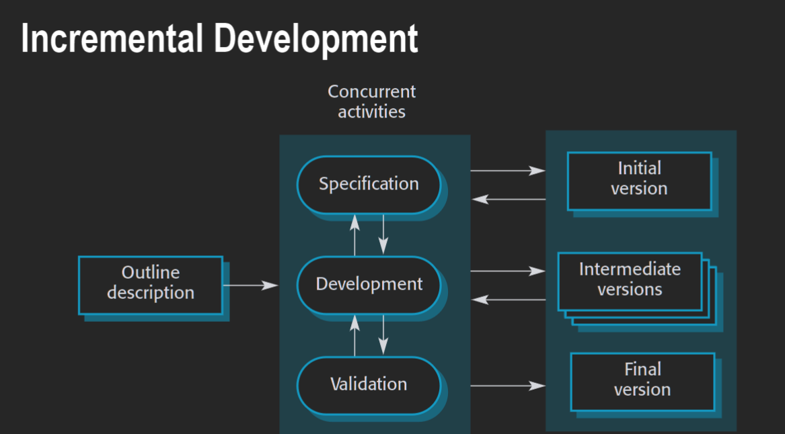
+ Initial version: developing an initial implementation 初始版本：开发初始实施
+  Intermediate versions: getting feedback from the clients and users and evolving the software through versions until the system is developed 中间版本：从客户和用户那里获得反馈，并通过版本改进软件，直到开发出系统
+  Each “increment” includes some of the functionality requested by the client 每个“增量”包括客户要求的一些功能

## Agile methodology


# FIT5136 Week 2 Requirements engineering

+ Business: what is it that the business requires  the system to do  业务需要系统做什么
+ User: what is it that the user (or customer)  requires the system to do. A user can be a  stakeholder.  用户（或客户）需要系统做什么。用户可以是利益相关者
+ Functional: what the system should  functionally do  系统在功能上应该做什么
+ Non-functional: quality of service system  required to provide  系统需要提供的服务质量
+ Constraint: things that system should prohibit  the user to do  系统应该禁止用户做的事情
+ Implementation: platform, etc requirements of  the system平台等系统要求

## Functional requirements
+ <mark style="background: #0000CD;">定义系统的行为</mark>
+ Describe functionality or system services 描述功能或系统服务  
+ Describe how the system should react to particular inputs  and how the system should behave in particular  situations  描述系统应如何对特定输入做出反应以及系统在特定情况下应如何表现
+ Expressed as inputs and outputs 表示为输入和输出

### Example
+ A user shall be able to search properties for all suburbs
+ At the end of each month, the system shall generate a  list of properties sold or rented
+ Each property agent shall be uniquely identified by his or her 8-digit employee number.
+ <mark style="background: #ff0000;">login  不是功能性要求</mark>

## Non-functional requirements
+ <mark>定义系统的特性, 一般是隐性的</mark>
+ A specific criteria that can be used to judge the operation of a system, rather than specific behaviours可用于判断系统运行而非特定行为的特定标准
+ The nitty-gritty of the services or functions offered by the system. The requirements that makes the quality of the system better系统提供的服务或功能的本质。使系统质量更好的要求
+ Often apply to the system as a whole rather than individual features or functions.通常适用于整个系统而不是单个特性或功能
+ Non-functional requirements may be more critical than functional requirements. If they are not met, the system may be useless非功能性需求可能比功能性需求更重要。  如果不满足，系统可能无用

### Example
+ number of customers allowed, password requirements, response time, storage requirements, I/O device capability, among others.允许的客户数量、密码要求、响应时间、存储要求、I/O 设备能力等。
+ the property management system shall be available to all property agents ***during normal working hours (Mon–Fri, 0830–1730***
+ Customers must authenticate themselves ***using their drivers license***
+ After receiving an inspection request, the system must acknowledge with a response e-mail ***within 10 seconds***
+  <mark style="background: #3CB371;">login  不是非功能性要求</mark>

## ==重点USE CASE DIAGRAMS==
TO DESCRIBE AND DOCUMENT ALL INTERACTIONS WITH THE SYSTEM 描述和记录与系统的所有交互


A use case models an interaction between the software product itself and the users  (actors) of that software product  
Tool for formalizing your understanding of requirements.  
Captures some user-visible function or behaviour.  
Relationship(s) between actors and use cases
用例对软件产品本身与该软件产品的用户（参与者）之间的交互进行建模 • 用于形式化您对需求的理解的工具。 • 捕捉一些用户可见的功能或行为。 • 参与者和用例之间的关系

### syntax


### Actor
An actor is a member of the world outside the software product

How to identify
+ An actor is a frequent user of the software product  
+ Most of the software have more than one type of actor
<mark style="background: #3CB371;">+ As an initiator:发起人
• is generally an actor who initiates/start the use case  通常是发起/启动用例的参与者
• is placed on the left-side of the use case diagram 位于用例图的左侧</mark>
<mark style="background: #0000CD;">+  As a participant;  参与者
• is generally an actor who participates in the use case  参与用例
• placed on the right-side of the use case diagram  放置在用例图的右侧
• one actor can participant in multiple use case 一个参与者可以参与多个用例</mark>
> Customer must go to the real estate agent’s office with proof of ownership (of the house/apartment) to let the real estate agent add the property to the system for sale. 
> Real estate agent is the initiator and customer is the participant


Overlapping actors (Actor Generalization)
If two actors communicate with the same set of use cases in the same way,  we can express this as a generalization to another (possibly abstract)  actor 如果两个参与者以相同的方式与同一组用例进行通信，我们可以将其表示为对另一个（可能是抽象的）参与者的概括


### Inclusion and extension
Inclusion:  `<<Include>>  `
+ The inclusion are compulsory part of the use case.  包含是用例的强制性部分
+ An including use case never stands alone. It always includes the included use case 包含用例永远不会孤立。它始终包括包含的用例


Extension:  `<<Extend>>`
+   is used to separate optional behaviour from mandatory  behaviour.  用于将可选行为与强制行为分开
+ The extended use case may stand alone, but, under certain conditions,  it may be extended by another use case扩展用例可能是独立的，但在某些情况下，它可能会被另一个用例扩展
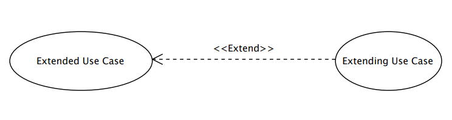

Example

> When a student is enrolled, a confirmation is required to be sent to the student
> When a student is enrolled, a student can choose to enroll to the units
>  How to find what to include or extend?
>  Check your client’s requirements


## ==必考User stories==
+ A user story is an informal, general explanation of a software feature written from the perspective of the end user or customer. <mark style="background: #3CB371;">从客户的角度出发，非正式的，普遍的软件功能的解释 功能性要求</mark>
+ The purpose of a user story is to articulate how a piece of work will deliver a particular value back to the customer. 目<mark style="background: #ff0000;">的是阐明一项工作将如何向客户交付特定的价值</mark>
+ 用户故事应该非常简短，并从客户的角度编写——它们通常需要放在索引卡上。  
+ 由于它们是根据需要来表述的，因此通常很容易为它们编写测试。  
+ 这些用户故事应以客户的语言编写，并使用适合其业务的术语。

`As a <user>, I want to <goal> so that <benefit>`
+ <mark style="background: #0000CD;">As a (who wants to accomplish something)谁需要这个功能 [user]</mark>
+ I<mark style="background: #ff0000;"> want to (what they want to achieve) 他们想要做什么？[goal]</mark>    
+ <mark style="background: #3CB371;">So that (why they want to achieve the goal) 这样做会带来什么好处呢？[benefit]</mark>
+ Benefit is optional, but is it?

Example
+ As a wiki user, I want to upload a file to the wiki so that I can share it with my colleagues
+ As a survey  participant, I want an  indication of  progress so that I  know how much I  have left to complete
+ As a customer, I  would like the  system to not  corrupt the  database


the INVEST mnemonic to guide user stories
+ Independent（独立的）用户故事之间应该尽量避免相互依赖
+ Negotiable（可协商的）所有之前达成的一致在新的变化发生情况下，协商后达成新的一致，从而推动系统的研发进展。
+ Valuable to users or customers（对用户或者客户是有价值的）如果不知道用户故事给用户带来什么好处，就无法知道用户故事的价值
+ Estimable（可估算的）user stories 应该与可以估计实现工作量的功能相对应。
+ Small（小的）user stories 必须足够小 追求快速交付
+ Testable（可测试的），所有合格的需求必须是可测试的


## ==必考Acceptance criteria==
<mark style="background: #D2691E;">the criteria to test that the user story is implemented as expected. 测试用户故事是否按预期实施的标准</mark> user story的边界，用于确认软件何时按预期工作，即故事何时完成
+ Good Acceptance Criteria 会带有非功能性需求。
+ 它是一个顺序结构，写它的语法使用<mark style="background: #3CB371;">一般现在时</mark>
+ 禁止使用 can, will, be able to 等词  
+ 动词的使用必须准确和小组选择的程序类型有关。  Text-based ： 不可以用choose, click, select。 可以用 enter.  Desktop-based: 不可以用enter
+ <mark style="background: #ff0000;">顺序 不会报错 理想 positive test</mark>
+ <mark style="background: #3CB371;">在哪个页面让我干什么 导航到下一个页面</mark>
+ <mark style="background: #0000CD;">最后非功能性需求</mark>

### example 
user story 1
> For a smart home app, one of the user stories could be: “As a homeowner, I want to be able to dim or brighten individual light globes so that I can create my ideal lighting.

The acceptance criteria for this user story might be
+ The user will select a globe and then see this view;  
+ This view should use a slider control so that the user has the full range of brightness levels  available to them;  
+ When opening this view, the initial slider position should reflect the current brightness of the  selected globe;  
+ The time for a light globe to respond to a change made by the user should be no greater  than 1 second

User story 2
> As a Customer I want to to check the  balance of my bank account so that I  can perform transactions

The acceptance criteria 2
+ Customer logged in before  checking balance.  
+ Balance for all accounts is  displayed

User story 3
> As a Customer I want to transfer money from my  account to another bank account so that I don’t  have to go to the bank for making such  transactions

The acceptance criteria 3
+ Customer logged in before transferring  amount.
+ System check the receivers account number  and validate it prior to performing the  transactions.  
+ If Ok the local account balance is updated  and displayed.  
+ System update both accounts concurrently

## USABILITY DESIGN  PRINCIPLES
USABILITY DESIGN PRINCIPLES HELPS US  UNDERSTAND THE BETTER WAY TO DESIGN THE  USER-INTERFACE OF A SOFTWARE 可用性设计原则帮助我们了解设计软件用户界面的更好方法
### Donald Norman’s design principles
+ (1) Visibility: relevant objects should be in view and obvious to recognise (1) 可见性：相关物体应清晰可见且易于识别
+ (2) Affordance: the appearance of an object should indicate how it should be used （2）可供性：一个物体的外观应该表明它应该如何使用
+ (3) Constraints: limiting the possible actions of an object, to prevent user making errors (3) 约束：限制一个对象可能的动作，防止用户出错
+ (4) Cognitive aids/ Feedback: External representations intended to gain our attention (4) 认知辅助/反馈：旨在引起我们注意的外部表征
+ (5) Consistency/ Transfer effects: transferring learning and expectations of similar  objects/interfaces to the current task (5) 一致性/迁移效果：将相似对象/接口的学习和期望迁移到当前任务
+ (6) Natural mapping: laying out screens to better represent their function (6) 自然映射：布局屏幕以更好地表现其功能

### Ben Shneiderman’s 8 golden rules
+ Strive for consistency: consistent user-interfaces 力求一致性：一致的用户界面
+ Cater to universal usability: for all range of users (age, disability, etc) 迎合通用可用性：适用于所有范围的用户（年龄、残疾等）
+ Offer informative feedback: give user feedback on their actions (green, tick, sound,  highlighting, etc) 提供信息反馈：向用户提供有关其操作的反馈（绿色、勾选、声音、突出显示等）
+ Design dialogue to yield closure: feedback or warnings at the end of the action 设计对话以产生关闭：行动结束时的反馈或警告
+ Prevent errors: detect error, let the user undo their mistake 预防错误：检测错误，让用户撤消错误
+ Permit easy reversal of actions: offer an easy way out where possible (change of mind,  unsubscribe) 允许轻松逆转行动：在可能的情况下提供简单的出路（改变主意，取消订阅）
+ Support internal locus of control: give the user a sense of control. Let the user initiate, and  control actions 支持内部控制点：给用户一种控制感。让用户发起和控制动作
+ Reduce short-term memory load: Don’t make navigation and tasks excessively complex—use  meaningful mnemonics, icons, and abbreviations or “hint” 减少短期记忆负荷：不要让导航和任务过于复杂——使用有意义的助记符、图标和缩写或“提示”

# FIT5136 Week 3 Analysis and OOP Concepts
## UML
for specifying, visualizing,  constructing and documenting the artefacts of software  systems, as well as for business modeling and other non-  software systems用于指定、可视化、构建和记录软件系统的人工制品，以及用于业务建模和其他非软件系统

Static diagrams 静态图
+ display the organization of a system in terms  of the components that make up that system and their  relationships 根据构成该系统的组件及其关系显示系统的组织

Dynamic diagrams 动态图
+ show the dynamic behaviour of the objects in  a system   E.g., how different components communicate with each other to  perform a task 显示系统中对象的动态行为 • 例如，不同组件如何相互通信以执行任务  


1. Use case diagrams, which show the interactions between a system and its environment, together with use case scenarios which provide more interaction details 用例图，显示系统与其环境之间的交互，以及提供更多交互细节的用例场景
2. Class diagrams, which show the object classes in the system  and the associations between these classes 类图，显示系统中的对象类以及这些类之间的关联
3. interaction Diagrams, which show interactions between actors  and the system and between system components.  • Sequence diagram shows object interactions arranged in  time sequence 交互图，显示参与者与系统之间以及系统组件之间的交互。 • 序列图显示按时间顺序排列的对象交互
4. Statecharts , which show how the system reacts to internal and  external events. 状态图，显示系统如何对内部和外部事件作出反应

## Requirements Analysis: The 3 steps - Overview
+ Functional modelling Present scenarios of all the use cases Use case scenario 功能建模 o 所有用例的当前场景 o 要创建的人工制品：用例场景
+ Class modelling   Determine the entity classes and their attributes  Determine the interrelationships and interactions between the entity classes   Class diagram 类建模 o 确定实体类及其属性 o 确定实体类之间的相互关系和交互 o 要创建的人工制品：类图
+ Dynamic modelling  Determine the operations performed by or to each entity class   State chart 动态建模 o 确定每个实体类执行的操作或对每个实体类执行的操作 状态图

### Use case scenario
A scenario = a description of a use case  
A scenario can be “normal” and “exception”
场景 = 用例的描述 场景可以是“正常”和“异常”  
  
  

+ Use Case Name - short, descriptive verb phrase;  简短的描述性动词短语 
+ Scenario - a sentence that captures the essence of the use case (functionality);  捕捉用例本质（功能）的句子
+ Trigger – the actor who perform certain actions to triggers the use case;  实际触发用例的参与者
+ Brief description - a paragraph that captures the goal of the use case;  简要描述：描述用例目标的段落
+ Actors - actors involved in the use case (initiator and participant actors);  用例中涉及的参与者（发起者和参与者参与者）
+ Related use cases - does the use case have any relation with other use cases – inclusion/exclusion/generalization?   相关用例：该用例是否与其他用例有任何关系 - 包含/排除/泛化
+ Preconditions – the conditions that must met before the use case can execute, they can be considered as constraints;  先决条件：在用例可以执行之前必须为真的事情——它们是对系统状态的约束；
+ Postconditions – the conditions that must be met at the end of the use case, they can be considered as outcomes  后置条件： 在用例结束时必须为真的事情；
+ Flow of events - the steps in the use case (if everything goes well – no error, interruption);  事件流：用例中的步骤（如果一切顺利——没有错误、中断）；
+ Exception conditions - a list of alternatives to the main flow (capture errors, interruption to the main flow)异常条件： 主要流程的替代列表（捕获错误，中断主要流程）

### Class diagram
Class diagrams are used when developing an object-oriented  system model to show the classes in a system and the associations  between these classes.在开发面向对象的系统模型时使用类图来显示系统中的类以及这些类之间的关联。

objects represent something in the  real world Easy way to remember: they are usually nouns, such as a patient, a prescription, a recipe, a doctor, a  lecturer, student, etc.   对象代表现实世界中的某些事物，例如患者、处方、食谱、医生、讲师、学生等。 • 易于记忆：它们通常是名词
#### Essential Elements of a UML Class Diagram
+ Class  类
+ Attributes  属性
+ Operations  操作
+ Relationships  关系
+ Associations  Generalization  Composition/Aggregation  Dependency  关联 • 泛化 • 组合/聚合 • 依赖关系
+ Constraint Rules and Notes 约束规则和注释


# FIT5136 WEEK 4
## WEEKLY QUIZ

## ==必考Workflows==

+ 这四个Phase加起来叫一个Event，另外Event之间需要解释
+ Person-hour = amount of work 1 person can do in 1 hr 工时 = 1 人在 1 小时内可以完成的工作量
+ Shaded area = person-hrs x time = total effort 阴影面积 = 工时 x时长 = 总努力


# ==重点WEEK 5 Initial Class Diagram,Sequence Diagram, State Chart==
## WEEKLY QUIZ
answer content in 5136w5.pdf


## Associations
https://www.visual-paradigm.com/guide/uml-unified-modeling-language/what-is-class-diagram/


+ If the association has a navigability (i.e.an arrow on one end) it indicates that one class knows about the other but not vice versa 如果关联具有可导航性（即一端有箭头），则表明一个类知道另一个类，反之则不然


+ Sometimes, the association is complex – needs a class  (sometimes called Association Class) to represent it有时，关联很复杂——需要一个类（有时称为关联类）来表示它。


+ Each end of an association can have its multiplicity shown. This indicates how many objects of each class are involved in the association. One to one;  One to Many;  Many to one; Many to many; We read multiplicities from left to right 关联的每一端都可以显示其多重性。 ▪ 这表示关联中涉及每个类的对象数。 – 一对一 – 一对多 – 多对一 – 多对多 ▪ 我们从左到右阅读多重性


## ==重点The Generalization Relationship 对应关系==
Lots of different terms for this  
+ Inheritance  
+  “is-a”  
+ Generalization 
+  Superclass/subclass

### Generalization 归化 空心箭头指向父类


+ 能够推断这些类的不同成员具有一些共同特征
+ 概括地说，与较高级别的类相关联的属性和操作也与较低级别的类相关联

### The “is-a” relationship 


Subclasses inherit the attributes and operations of their  superclass 子类继承其超类的属性和操作
+ Every lecturer and every tutor have name, id and password,  inherited from the User class.  每个讲师和每个导师都有从 User 类继承的姓名、ID 和密码
+ Lecturers and Tutors can mark assignments, because Users  can讲师和导师可以标记作业，因为用户可以

Subclasses provide extra operations and attributes 子类提供额外的操作和属性
+ Lecturers can create assignments 讲师可以创建作业

### Aggregation (has-a relationship) 聚合 a 是b 的一部分 空心菱形

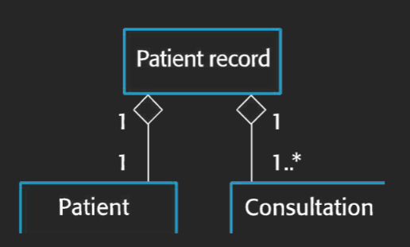
+ An aggregation model shows how classes that are collections are composed of other classes. 聚合模型显示作为集合的类如何由其他类组成
+ An aggregation is the kind of association that exists between a group and its members 聚合是存在于组及其成员之间的一种关联
+ the aggregate object may potentially exist without  its constituent objects (although not necessarily in  a useful state),  聚合对象可能在没有其组成对象的情况下存在（尽管不一定处于有用状态）
+ at any time, each object may be a constituent of  more than one aggregate (e.g. a person may  belong to several clubs)在任何时候，每个对象都可能是多个聚合的组成部分（例如，一个人可能属于多个俱乐部）
+ constituent objects are typically of the same class  (but, again, that’s not always the case)组成部分对象通常属于同一类（但同样，情况并非总是如此）
## ==重点how do we get from requirements to classes==
+ <mark style="background: #0000CD;">Determine entity classes and their attributes  (particularly entity)  确定实体类及其属性（尤其是实体</mark>  
+ <mark style="background: #ff0000;"> Determine the interrelationships and  interactions between the classes  确定类之间的相互关系和交互</mark>
+  <mark style="background: #3CB371;">Represented as a class diagram 表示为类图</mark>

Goal  
+ to create a dictionary of abstractions.

How?
+ Study use case scenarios
+ other requirements docs.

Steps:
+ Start by looking for tangible things.寻找有形的东西开始
+ Figure out what is inside and outside the problem boundary弄清楚问题边界的内部和外部是什么
+ Some things may be classes 有些东西可能是类
+ Some may be simple attributes 有些可能是简单的属性

### Scenario
> 
> 
### Classification of identified nouns 已识别名词的分类
Candidate entity classes 候选实体类:
+ RealEstateSystem, Agent, Property, House, Apartment, Category, ForRent, ForSale, RealEstateCompany

Abstract nouns* (attributes) 抽象名词*（属性）
+ list of properties, list of agents, name of the agent, mobile number,  business name, address of the company, number of storeys, age of  the property, unit number, floor number, id, street address, suburb,  no of bedrooms, no of bathrooms, number of car spaces, floor plan,  type, inspection time, price per week, bond, available date, land  size, selling price

Outside problem domain:
+ system (redundant), city, Parallex, council, council administrators  (redundant), property’s information (synonym), amount (redundant),  market, companies, month, administrator

### identify multiplicities and relationships 识别多重性和关系
+ Not all the classes will have a relationship with each other It could be: Association ▪ Generalisation ▪ Aggregation 并非所有的类都会相互关联——可能是： ▪ 关联 ▪ 泛化 ▪ 聚合
+ If two classes do not have a relationship with each other, they do  not have multiplicity either 如果两个类之间没有关系，它们也不具有多重性
+ Multiplicities are only added for association and aggregation  Could be:  ▪ One to one  ▪ One to many  ▪ Many to many (– If it is many to many, leave it as it is for initial class diagram)  多重性仅用于关联和聚合 – 可能是： ▪ 一对一 ▪ 一对多 ▪ 多对多 – 如果是多对多，则保留其为初始类图
+ For each class, find out what other classes it needs to  interact.   to manage the data of the other class  ▪ is dependent on the data of the other class  ▪ the two classes in question needs to work together对于每个类，找出它需要交互的其他类。 – 交互是 ▪ 管理其他类的数据 ▪ 依赖于其他类的数据 ▪ 有问题的两个类需要一起工作

### commonalities in responsibilities
Look for commonalities in responsibilities between classes. ▪ See whether these can be simplified using inheritance – does an “is-a” relationship exist? 寻找类之间职责的共同点。 ▪ 看看这些是否可以使用继承来简化——是否存在“is-a”关系？

Example of inheritance:  
+ Type of Properties  ▪ House  ▪ Apartment  
+ Type of Category  ▪ ForRent  ▪ ForSale

## ==重点Initial Class Diagram==


### ==重点how to draw diagram==
1. 仔细阅读收集到的客户需求
2. 定义所有收集到资料的名词部分，并对他们具体分类： [Classification of identified nouns 已识别名词的分类](#Classification%20of%20identified%20nouns%20已识别名词的分类)
+ Abstract Noun; 
+ Outside problem Noun; 
+ Candidate entity class
3. 画出所有的Candidate entity class, 定义它们之间的关系
+ “is-a”relationship (Inheritance);  [Generalization 归化 空心箭头指向父类](#Generalization%20归化%20空心箭头指向父类)
+ Aggregation relationship; [Aggregation (has-a relationship) 聚合 a 是b 的一部分 空心菱形](#Aggregation%20(has-a%20relationship)%20聚合%20a%20是b%20的一部分%20空心菱形)
+ Association relationship;[Associations](#Associations)
4. Identify the multiplicity between classes [identify multiplicities and relationships 识别多重性和关系](#identify%20multiplicities%20and%20relationships%20识别多重性和关系)
+ One to One; 
+ One to many;
+  Many to many (必须避免)
5. 把收集到的abstract noun 填入attribute 里，检查是否合适
## Three Types of Classes
<mark style="background: #0000CD;">Model = Entity Classes;   View = Boundary Classes;  Controller = Control Classes</mark>


### Entity Class 实体类 Model
+  Models “long-lived” information  模型“长期存在的”信息 
+ Usually “passive” But they may still contain complex algorithms.  Examples: Property, Agent, Real Estate Company通常是“被动的”——但它们可能仍包含复杂的算法。 • 示例：物业、代理、房地产公司
+ 

### Boundary Class 边界类 View
+ Class that lives on the system’s  “automation boundary”存在于系统“自动化边界”上的类
+ Models the interaction between  product and environment  (actor)  • 对产品和环境（参与者）之间的交互进行建模
+ Associated with input or output  • 与输入或输出相关联
+ 

### Control Class 控制类 Controller
+ Mediate interaction between  boundary and entity classes.  调解边界和实体类之间的交互。
+ Models complex computations and  algorithms  为复杂的计算和算法建模
+  Sometimes relate to use cases – but  not always.  有时与用例相关——但并非总是如此
+  For simple program, possibly the class  that contains the main() method 对于简单程序，可能是包含 main() 方法的类
+ 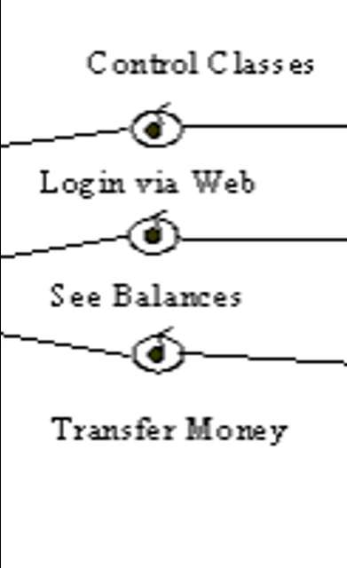

### class communication


## ==重点Sequence_diagram==


+ The realization of a specific scenario of a use case is  depicted using an interaction diagram 使用交互图来描述用例的特定场景的实现
+ Models <mark style="background: #ff0000;">the flow of logic </mark>within the system 对系统内的逻辑流进行建模
+  Describes how—and in what order—a group of objects  works together  描述一组对象如何以及以何种顺序协同工作
+ <mark style="background: #3CB371;">Shows the interactions between objects.  显示对象之间的交互</mark>
+  Plan and understand the detailed functionality of an existing or future scenario.  规划和理解现有或未来场景的详细功能
+ Models the details of a use case – a use case scenario为用例的细节建模 用例场景

### ==Sequence Diagram for Use Case==
+ ==Boundary class (view) for presenting something to user only !==
+  ==Control class (controller) for verifying inputs and interacting with entity class!==
+ ==Entity Class (model) for doing something that we really want==
+ ==User 的部分==
+ ==Forward pass使用实线==
+ ==Back pass 使用虚线==

How to refine the scenario and use it to show the  interactions between objects 如何细化场景并使用它来显示对象之间的交互
+ Use the information from the class diagram   使用类图中的信息
+ Then, add boundary and control class  添加边界和控制类
+  If required, you can add more arrows to show inner working of  the system  您可以添加更多箭头以显示系统的内部工作
+ Add as much of information as possible 添加尽可能多的信息


+ Message sent from a Class A object to a  Class B object corresponds to a method in  Class B 从 A 类对象发送到 B 类对象的消息对应于 B 类中的一个方法
+ Actor interacts with the system via  UserInterface obj (boundary class view) Actor 通过 UserInterface 与系统交互
+ there are 8 actions sent by the Actor into the system. Therefore, in the sequence diagram, there must be exactly 8 messages sent to the Boundary classes Actor 向系统发送了 8 个动作。因此，在序列图中，必须恰好有 8 条消息发送到 Boundary 类
+ Boundary classes interacts with the  entities via control object(s) 边界类通过控制对象与实体交互
+ user's input will be verified in controller  

## ==重点选考UML state chart==

<mark style="background: #3CB371;">动态建模，使用特定场景的状态图对对象的行为进行建模</mark>
+ 起点黑圆圈 终点黑圆圈套一个同心圆环
+ 不用跨级返回循环
+ 可以画登录 没时间的话从mainpage开始画
+ 起始点->各个state->state之间过程、操作->终止点
+  当前界面用户可以看见什么内容 主要功能选项 可不写


https://sparxsystems.com/resources/tutorials/uml2/state-diagram.html  


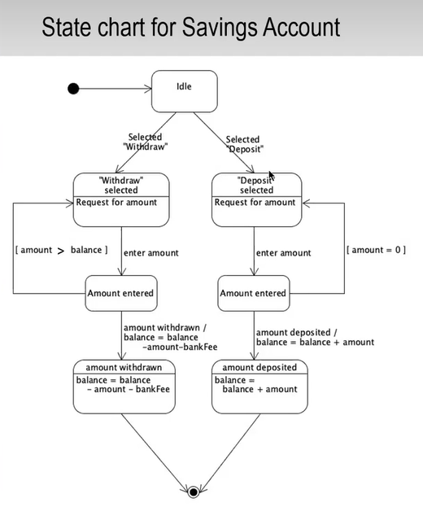

Scenario
> The door can be in one of three states: "Opened", "Closed" or "Locked". It can respond to the events Open, Close, Lock and Unlock. Notice that not all events are valid in all states; for example, if a door is opened, you cannot lock it until you close it. Also notice that a state transition can have a guard condition attached: if the door is Opened, it can only respond to the Close event if the condition doorWay->isEmpty is fulfilled门可以处于以下三种状态之一：“打开”、“关闭”或“锁定”。它可以响应打开、关闭、锁定和解锁事件。请注意，并非所有事件在所有状态下都有效；例如，如果一扇门是打开的，在您关闭它之前您无法锁定它。另请注意，状态转换可以附加一个警戒条件：如果门已打开，则只有在满足 doorWay->isEmpty 条件时才能响应关闭事件
> 


# FIT5136 WEEK 6
## WEEKLY QUIZ

content in  week6 FLUX.pdf

# FIT5136 WEEK 7
## WEEKLY QUIZ

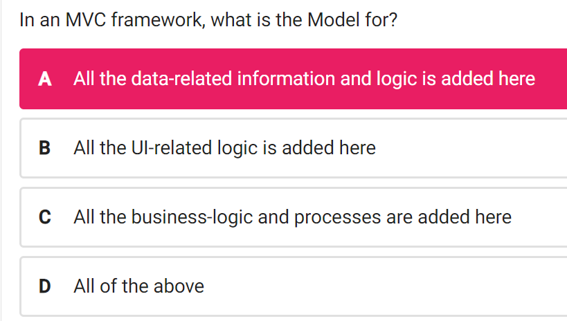


# FIT5136 WEEK 8 SE Code of Ethics  

## WEEKLY QUIZ

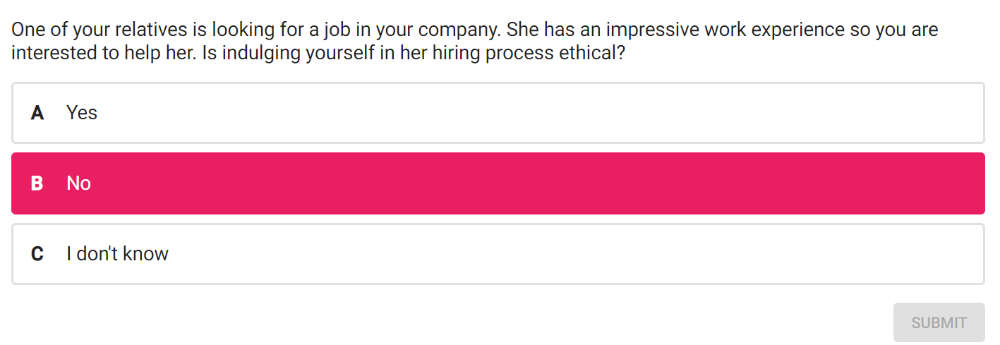


## ==重点software Engineering Code of Ethic==
+ 找到几种人
+ 定义每个人的行为
+ ethical ? professional? legal?
+ if good  code of ethic
+ if bad where bad and violate which aspect
+ each action evaluate within 2 code

ACM SE ethics code
https://ethics.acm.org/code-of-ethics/software-engineering-code/
to address the complexity of  moral issues 解决道德问题的复杂性 

1. ==PUBLIC== Software engineers shall act consistently  with the ==public interest== 软件工程师的行为应符合公共利益
2. ==CLIENT AND EMPLOYER== Software engineers shall act  in a manner that is in the ==best interests of their client and  employer== consistent with the public interest 软件工程师的行为方式应符合其客户和雇主的最大利益，并符合公共利益
3. ==PRODUCT== Software engineers shall ensure that their products and related modifications ==meet the highest professional standards possible==. In particular, software engineers shall, as appropriate 软件工程师应确保他们的产品和相关修改符合最高的专业标准。特别是，软件工程师应酌情
4. ==JUDGEMENT== Software engineers shall ==maintain integrity and independence in their professional judgment.== In particular, software engineers shall, as appropriate 软件工程师应保持其专业判断的完整性和独立性。特别是，软件工程师应酌情
5. ==MANAGEMENT== Software engineering managers and leaders shall subscribe to and promote an ==ethical approach to the management of software development and maintenance== . In particular, those managing or leading software engineers shall, as appropriate 软件工程经理和领导者应赞同并提倡以合乎道德的方式管理软件开发和维护。特别是，那些管理或领导软件工程师的人应酌情
6. ==PROFESSION== Software engineers shall ==advance the integrity and reputation of the profession consistent== with the public interest. In particular, software engineers shall, as appropriate: 软件工程师应促进符合公共利益的职业诚信和声誉。特别是，软件工程师应酌情：
7. ==COLLEAGUES== Software engineers shall ==be fair to and supportive of their colleagues.== In particular, software engineers shall, as appropriate: 软件工程师应公平对待并支持他们的同事。特别是，软件工程师应酌情：
8. ==SELF== Software engineers shall participate in lifelong learning regarding the practice of their profession and shall promote an ethical approach to the practice of the profession. In particular, software engineers shall continually endeavor to: 软件工程师应参与有关其职业实践的终身学习，并应促进职业实践的道德方法。特别是，软件工程师应不断努力：


### PUBLIC
Software engineers shall act consistently  with the ==public interest== 软件工程师的行为应符合公共利益
+ 承担责任
+ 平衡利益
+ 安全合规
+ 公示危害
+ 解决公众问题
+ 公开声明
+ 残障支持
+ 公益事业

### CLIENT AND EMPLOYER
Software engineers shall act  in a manner that is in <mark style="background: #D2691E;">the best interests of their client and  employer </mark>consistent with the public interest 软件工程师的行为方式应符合其客户和雇主的最大利益，并符合公共利益
+ 竭尽所能 诚实公开
+ 不用 盗版软件
+ 授权使用雇主财产
+ 文件批准
+ 保密
+ 收集证据
+ 识别问题
+ 不参与同业竞争
+ 不使用不当利益

### Product
Software engineers shall ensure that their products and related modifications <mark style="background: #3CB371;">meet the highest professional standards possible</mark>. In particular, software engineers shall, as appropriate 软件工程师应确保他们的产品和相关修改符合最高的专业标准。特别是，软件工程师应酌情
+ 保质保时
+ 完成目标
+ 识别解决问题
+ 培训胜任
+ 合适方法
+ 遵守专业标准
+ 理解软件规范
+ 确保使用软件规范
+ 项目定量评估
+ 充分测试审查
+ 准备文档解决方案
+ 尊重隐私
+ 数据授权使用
+ 数据完整有效

### Judgement
Software engineers shall <mark style="background: #3CB371;">maintain integrity and independence in their professional judgment.</mark> In particular, software engineers shall, as appropriate 软件工程师应保持其专业判断的完整性和独立性。特别是，软件工程师应酌情
+ 调整技术判断
+ 只签署受监督文件
+ 评估文档客观
+ 不得 财务不当
+ 披露利益冲突

### Management
Software engineering managers and leaders shall subscribe to and promote an <mark style="background: #D2691E;">ethical approach to the management of software development and maintenance</mark> . In particular, those managing or leading software engineers shall, as appropriate 软件工程经理和领导者应赞同并提倡以合乎道德的方式管理软件开发和维护。特别是，那些管理或领导软件工程师的人应酌情
+ 确保良好管理
+ 了解开发标准
+ 保密
+ 力所能及
+ 项目评估
+ 招聘合适人才
+ 薪酬合理
+ 提拔人才
+ 产权所有明确
+ 规定审理指控
+ 言行一致

### PROFESSION
Software engineers shall <mark style="background: #ff0000;">advance the integrity and reputation of the profession consistent</mark> with the public interest. In particular, software engineers shall, as appropriate: 软件工程师应促进符合公共利益的职业诚信和声誉。特别是，软件工程师应酌情：
+ 有道德的环境
+ 促进了解软件
+ 共享软件知识
+ 遵守本守则
+ 自我提升‘
+ 遵守法律
+ 诚实守信
+ 纠正错误
+ 避免利益冲突

### Colleagues
Software engineers shall <mark style="background: #3CB371;">be fair to and supportive of their colleagues</mark>. In particular, software engineers shall, as appropriate: 软件工程师应公平对待并支持他们的同事。特别是，软件工程师应酌情：
+ 鼓励同事遵守
+ 协助发展
+ 充分信任
+ 客观坦率
+ 公平
+ 不过度干预
+ 征求意见

### Self
Software engineers shall participate in <mark style="background: #D2691E;">lifelong learning regarding the practice of their profession</mark> and shall promote an ethical approach to the practice of the profession. In particular, software engineers shall continually endeavour to: 软件工程师应参与有关其职业实践的终身学习，并应促进职业实践的道德方法。特别是，软件工程师应不断努力：
+ 了解规范
+ 提高开发质量
+ 文档管理
+ 法律法规
+ 公平公正

## IP Copyright
IP
+ Intellectual property (IP) refers to creations of the mind: inventions, literary and artistic works, and symbols, names, images, and designs used in commerce知识产权 (IP) 是指心灵的创造：发明、文学和艺术作品以及商业中使用的符号、名称、图像和设计
+ Give authors and inventors rights for a limited time  授予作者和发明者在有限时间内的权利
+ 4 Ways to Protect Intellectual Property Trade Secrets; Trademarks and Service Marks; Patents; Copyrights  保护知识产权的方法 商业秘密 商标和服务标志  专利 版权 


Copyright
+ Copyright law secures for the owner of a  creative work the exclusive right to control who  can make copies, or make works derived from  the original work版权法确保创意作品的所有者拥有控制谁可以复制或制作源自原始作品的作品的专有权 Protect specific expressions of ideas, not ideas  themselves 保护思想的具体表达，而不是思想本身

知识产权是思想的表达，而不是思想本身。
+ 软件著作权
+ 软件专利
+ 开源软件（Copyleft）
# FIT5136 WEEK 10 Quality and Testing
## WEEKLY QUIZ
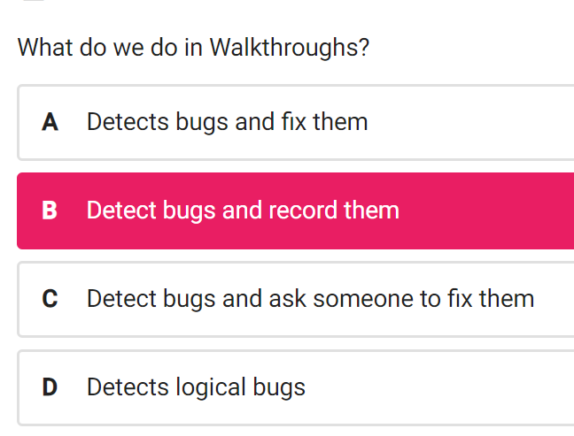


## quality assurance (QA) 质量保证 (QA)
+ Human Reviews -   人工审核（演练Walkthroughs和检查Inspections，Non-execution-based）
+ Proving （正式方式，Non-execution-based）
+ Software Testing -   软件测试（Execution-based）

# ==重点WEEK 11 Software Testing==
+ <mark style="background: #0000CD;">Test Workflow should cover testings during every workflow测试贯穿整个阶段</mark>
+ Positive and Negative Testing
+ Unit Testing
+  Test case selection
+  <mark style="background: #ff0000;">Black-box testing techniques (functional) Ignore the code, use the specs to select test case （功能性）– 忽略代码，使用规范选择测试用例</mark>
+  <mark style="background: #3CB371;">Glass-box testing technique (statement, branch, path)   Ignore the specs, use the code to select test cases (statement, branch, path) – 忽略规范，使用代码选择测试用例</mark>


## Positive and Negative Test
+ Positive testing determines that your <mark style="background: #0000CD;">application works as  expected.</mark> If an error is encountered during positive testing, the   test fails 正面测试确定您的应用程序按预期工作。如果在正面测试期间遇到错误，则测试失败
+ Negative testing ensures that your application can gracefully <mark style="background: #ff0000;">handle invalid input or unexpected user behavior</mark> The purpose of negative testing is to detect such situations  and prevent applications from crashing.负测试确保您的应用程序可以优雅地处理无效输入或意外的用户行为 负面测试的目的是检测此类情况并防止应用程序崩溃。

## Black Box Testing 黑盒测试
+ We base the test data on the functionality of the code artifacts 将测试数据基于代码工件的功能
+ Each item of functionality or function is identified 识别每个功能或功能项
+ Test data are devised to test each (lower-level) function separately 设计测试数据以分别测试每个（低级）功能
+ Then, higher-level functions composed of these lower-level functions are tested 然后，由这些低级功能组成的高级功能被测试


## White Box Testing 白盒测试 (Glass Box Testing / Structural testing)
+ Code Flow Graphs help in finding the correct coverage manually 代码流图有助于手动查找正确的覆盖率 
+ Issues (Coverage):
• Statement coverage
• Branch coverage
• Path coverage
• All-definition-use path coverage
问题（覆盖率）： • 语句覆盖率 • 分支覆盖率 • 路径覆盖率 • 全定义使用路径覆盖率

### Statement coverage
+ Running a set of test cases in which every statement is executed at least once 运行一组测试用例，其中每条语句至少执行一次
+  A CASE tool needed to keep track 需要一个 CASE 工具来跟踪
+ weakness Both statements can be executed  without the fault showing up 两个语句都可以执行而不会出现错误
+ 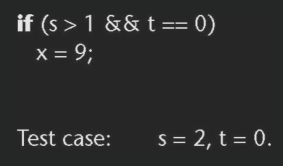
### Branch Coverage
+  Running a set of test cases in which every branch is executed at least once (as well as all statements) 运行一组测试用例，其中每个分支至少执行一次（以及所有语句）

### path Coverage
+ Running a set of test cases in which every path is executed at least once (as well as all statements) 运行一组测试用例，其中每条路径至少执行一次（以及所有语句
+ Problem: The number of paths may be very large eg. for loops 路径的数量可能非常大——例如。 for 循环

### test compare
```java
public int returnInput(int input, boolean condition1, boolean condition2, boolean condition3)
{ 
	int x = input;
	int y = 0;
	if (condition1) x++;
	if (condition2) x--;
	if (condition3) y=x;
	return y;
}
```
Branch coverage
> Goal: cover 100% of branches
Two test case is needed
Test case 1: returnInput(x, true, true, true)
Test case 2: returnInput(x, false, false, false)
100% statement covered
100% of branches covered
only two paths

Statement coverage
> Goal: execute every statement  
One test case is needed  
Test case 1: returnInput(x, true, true, true)  
100% statement covered only half of branches  
only one path
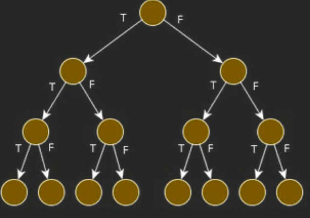

Path Coverage
> Goal: to cover 100% of paths  
8 test cases are needed

100% statement covered  
100% of branches covered  
100% of paths covered


# FIT5136 WEEK 12
## WEEKLY QUIZ


# Exam note
+ 尽管部分开卷考试， 但是基本没时间看书！ （提前复习很重要）
+ 考试时间： 2小时10分钟
+ 需要用笔画图， 因此带好铅笔和橡皮
+ 题目类型：
1. (10 pts) function /no + user story + acceptance criteria
2. (20 pts) initial class diagram
3. (20 pts) sequence diagram
4. (10 pts) UML / state chart / unifed
5. (15 pts) extra  (test / ip copyright)
6. (25 pts) ethics
7. 没有Programming 题目，没有 ER-digram for class diagram
8. 除了作业相关的题目，可能还有10分以内的非作业内容，比如说IP等


# Sample exam and question
## question 1 workflow
### scenario

> After graduation, three IT students decided to start a software company called SmartComputing. You had just been hired as a software engineer by the founders.
> On your first day in the new job you asked the Chief Technology Officer (CTO) about SmartComputing’s software engineering process. She replied:
> We follow the Unified Process to make sure we develop the right product in the right way. The process consists of five distinct workflows. <mark style="background: #3CB371;">We complete all the tasks and confirm all the documentations in each workflow before we move on to the next workflow. (waterfall plan driven只有纵向没有 横向)</mark>
> 
> The first workflow is the Requirements Workflow, where we brainstorm ideas about features that our customers will love to have.  
> The next workflow is the Analysis Workflow. This involves analysing the problem domain more deeply and describing the requirements in the kind of exacting detail that developers need. Typically, in this workflow we will produce conceptual class diagrams,detailed use case scenarios, interaction diagrams and statecharts.  
> Once the Analysis Workflow is completed, we begin the Design Workflow, where we refine the conceptual class diagram into something more concrete, producing a detailed class diagram.  
> The next workflow of the process is the Implementation Workflow. In this workflow, we write the code to implement the detailed class diagram produced in the previous workflow.  
> <mark style="background: #0000CD;">Finally, we will have the Test Workflow, where we test our program to ensure that the system works correctly.</mark>  
> Based on what you have learned in FIT5136, analyse and critique the company’s software engineering process described above by the CTO

### 1a workflow
 [==必考Workflows==](#==必考Workflows==)
The Unified Process has two dimensions:
  
<mark style="background: #ff0000;">The vertical process that are more technical oriented (Requirement, Analysis, Design, Implementation, Testing</mark>,   
The <mark style="background: #3CB371;">horizontal processes that are more business oriented (Inception, Elaboration, Construction and Transition).</mark>  
The vertical process is similar to the company’s description of the “Unified process” (incrementation)  
The company does no<mark style="background: #D2691E;">t focus on horizontal process at all (Iterations among workflows) which are more business oriented</mark>.The main thing that makes <mark style="background: #D2691E;">unified process is the combination of these two dimensions-iteration and incrementation</mark>.  
From the CTO description, the company process is therefore too similar to <mark style="background: #0000CD;">traditional waterfall model –step by step – one workflow after another is like one phase after another.</mark>
From the description, the company focuses on testing at the end of the process. <mark style="background: #ff0000;">Testing should not just be done at the end for the Unified Process! Testing should also be done in every workflow – the entire process</mark>!  
Test Workflow should cover testings during every workflow – inspection, human reviews and checking for traceability of artefacts  
There should also be more testing of program at the end like integration testing, system testing and acceptance testing in the final testing  

## question 2 use case diagram + use case scenario
### scenario
> You then asked the CTO about the latest project the company is undertaking. She mentioned that the project is to develop an on-line learning platform called Poodle 2 system for the university.
> The first task you, as the software engineer, are assigned for ==Poodle 2== is the analysis of the functionality of adding students to the system:
>==An administrator is able to add a student enrolled in a unit==. An ==administrator can also list the students added in the last 24 hours== and also ==delete a student if it was added by mistake==
> (a) Draw a UML use case diagram for this functionality.
> (b) On the next page is a detailed description of the normal scenario for the “Add Student” use case, with no exception conditions. ==Write three exception conditions, including reasonable actions to be taken==.
> 

### 2a UML use case diagram 
[==重点USE CASE DIAGRAMS==](#==重点USE%20CASE%20DIAGRAMS==)
admin is initiator so in the left


### 2b use case scenario 
 [Use case scenario](#Use%20case%20scenario)  
Question 2 (b)
Solutions (reasonable exceptions include (but not limited to):
+ 2.1 If the administrator enters the wrong id, then System displays message to try again
+ 2.1 If the administrator enters the wrong password, then System displays message to try again.
+ 3.1 If the student is not found, go back to the main page.
+ 3.1 If the id entered is not a student, go back to the main page.
+ 4.1 If the unit is not found, go back to the main page.
+ 5.1 If the student cannot be added because he is already enrolled in the unit, go back to the main page.
+ 6.1 Administrator hits cancel, go back to the main page
## question 3 noun extractions +  initial class diagram
### scenario
> The CTO provides more description about the Poodle 2 project below:
> The ==university== that we graduated from has a very bad ==on-line learning platform called Poodle==. We were asked to improve and extend the current system. I think we were successful in getting the project because three of us were former students and we had used their system before. Based on my experience, I can confirm that the system is really bad and definitely needs improvements. We ==call this project Poodle 2.==
> Every user of Poodle 2 is identified by ==an id and a name==. To use the system, every user will need a ==password== to log in. In Poodle 2, ==administrators== can ==create units==. Each ==unit is identified by a unit code and a unit name==. ==Teaching staff== can ==create contents in units== they teach and each teaching staff can teach up to ==four unit==s. ==Students have access to the contents as long as they are enrolled in the unit==. Every student can enrol in up to ==four units==. An ==administrator can add a student to the unit== if the student is officially enrolled in the unit. An ==administrator can also delete a student from the unit if the student is no longer enrolled.==
> Students are allowed to ==comment on units and contents in Poodle 2==. Comments on a unit and comments on its contents can ==only be created and viewed by students currently enrolled in the unit and staff teaching the unit==. 
> ==Users given authorisation can post replies to a comment.== A  ==lecturer of a unit or an administrator can remove a comment== if the comment is deemed inappropriate, irrelevant or not useful in general
> Based on the CTO’s description of the Poodle 2 project and the use case scenario in Question 2, you are tasked  to produce an initial class diagram for the project

### 3a noun extractions 
[Classification of identified nouns 已识别名词的分类](#Classification%20of%20identified%20nouns%20已识别名词的分类)
> (a) Perform noun extractions and build a dictionary of abstractions for the system. Use it to decide on your candidate classes by assessing each abstraction and considering whether it: 
> lies outside the problem boundary and may therefore be ignored, 
> is a candidate entity class, 
> or is likely to be a simple attribute of a class

 Outside the problem boundary and may therefore be ignored: 
+ platform, experience, Poodle 2 (okay to make this an entity class), project, system, Poodle, Improvement

 Candidate entity classes:
+ University, Unit, Administrator, User, Teaching Staff, Student, Comment, Lecturer, Content

Attributes: 
+ id, name, password, unit code, unit name, replies (reply), authorisation.

### 3b initial UML class diagram 
[==重点Initial Class Diagram==](#==重点Initial%20Class%20Diagram==)
> (b) Develop an initial UML class diagram for the system, with the relevant classes and attributes resulting from your dictionary of abstractions. Concentrate on modelling the problem domain rather than any boundary or control classes. Make sure you:
>  include appropriate attributes for the classes
>  describe the relationship between classes using generalization, association, aggregation and composition (as appropriate)
>   indicate the multiplicity (cardinality) of the relationships properly.
>    DO NOT include responsibilities or operations. You do not have all the information at this point to do so


## question 4 
> Based on the initial class diagram you have produced for Question 3 and the use case scenario in Question 2, produce a sequence diagram to show the messages exchanged between objects needed to carry out the Add Student use case scenario
### 4a sequence diagram
 [==重点Sequence_diagram==](#==重点Sequence_diagram==)


## question 5 statechart diagram
### scenario
> After some discussions inside the company, it was decided that the commenting feature should be enhanced to make it more useful. An informal description of the new feature was documented below.
> “A ==user can create comments about any content== in Poodle 2. The comment is ==publicly visible by default==. However, the ==author of the comment can subsequently make the comment visible only to a group of users==.
> A ==comment can be reported by a user== if she deems it to be inappropriate, irrelevant or not useful. Once reported, a ==comment can be deleted by a member of the teaching staff or a system administrator.== An accidentally ==deleted comment can be subsequently restored by a member of the teaching staff or an administrator==.
> A ==comment can also be promoted by a member of the teaching staff== if it is deemed to be highly informative, relevant or useful. A ==promoted comment cannot be reported, nor can it be deleted.==
> However, if the ==content itself is deleted, all comments associated with this content will be permanently deleted.==”

### 5a state chart diagram
 [==重点选考UML state chart==](#==重点选考UML%20state%20chart==)
> Develop a UML statechart diagram as a precise representation of the above informal specification of the enhanced commenting feature. When there is ambiguity in the informal specification, clarify it by stating your assumptions explicitly (separately from the statechart diagram)


## question 6 etheic
> Having completed a few features with tight schedules, your talent had finally been recognised by the founders of SmartComputing with good recommendations from your team leader.
> One week before the project deadline, the ==Chief Technical Officer (CTO)== called ==your team leader== into her office and showed him a piece of functionality implemented in the latest version of a competitor’s software, Noodle. The CTO said, “This is a feature we must have! Please ask the team to implement it by the end of the week so that we can demo the feature to the university.”
> You were asked by your team leader to start designing it. After thinking for a couple of hours, you came to the conclusion that Poodle 2 was so different from Noodle that this feature simply didn’t make sense for Poodle 2. Moreover, it was not only difficult to implement, it would also make the system less reliable. ==You went back to the team leader to discuss these issues with him. The team leader then had a meeting with the CTO and explained your concerns to her (good).==
> After hearing the team leader’s explanation, the CTO was still adamant about including the feature in Poodle 2. To convince the team leader that it was easy to implement, she showed him the ==source code of Noodle, which is free and open-source==, and asked him to ==“just copy their code then you’re done!”(bad illegal)== The team ==leader went ahead, followed her suggestions and completed the implementation on time for the demo==

### 6a ethical 
[==重点software Engineering Code of Ethic==](#==重点software%20Engineering%20Code%20of%20Ethic==)
> What are the ethical and professional issues that arise with the behaviour of the CTO and the team leader in this situation? How would you evaluate their behaviours? In your answer, you must refer to the applicable parts of the Software Engineering code of ethics

Team leader (and I) did the right thing initially because we try to raise the initial concerns with the CTO. We tried to adhere to the following clauses:
+ 2.06 Identify, document, collect evidence and report to the employer promptly if, in their opinion, a project is likely to be problematic.(报告问题)
+ 3.10 Ensure adequate testing, debugging and review of software and related documents on which they work （专业判断）

However, after the initial meeting CTO as well as the team leader did not take care of the issue with free and open source software:
+ § “Open Source” doesn’t necessarily mean you can reuse portions of the code for your work.
+ § They need to find out what OS (Open Source) license the author has before they can reuse and copy.

They are therefore in breach of the following clauses:
+ 2.02 Not knowingly use software that is obtained or retained either illegally or unethically.
+ 3.03 Identify, define and address ethical, economic, cultural, legal and environmental issues related to work projects.
+ 3.05 Ensure an appropriate method is used for any project on which they work or propose to work
+ 3.13 Be careful to use only accurate data derived by ethical and lawful means, and use it only in ways properly authorised. (copy code)

By telling the team leader to go ahead and copy, CTO has also breached the following management clauses:
+ 5.01 Ensure good management for any project on which they work, including effective procedures for promotion of quality and reduction of risk (This risk is breaking IP law!)
+ 5.11 Not ask a software engineer to do anything inconsistent with this Code (copy code)
+ 8.08 Not influenced others to undertake any action that involves a breach of the Code

By right, the team leader should:
+ 6.12 Express concerns to the people involved when significant violations of this Code are detected

Therefore, they both should go find out about the legality issues with Open Source, because they should:
+ 8.05 Improve their knowledge of relevant standards and the law governing the software and related documents on which they work,

##  question 7 workflow
###  scenario
> The SmartSolutions software company had a contract with a transportation company, TransCo, to add a new component to their existing scheduling tool. The new component was to be a smart reasoning component for recommending routes to drivers. After the first version was delivered, TransCo decided that the new component would have to ==contain more features== to allow maximum flexibility for users (“event 1”).
> After incorporating these and the second version was delivered, SmartSolutions found out that the company producing the constraint solver library that it was using had gone broke, so it needed to ==change the design== to use a different library(“event 2”).
> Then SmartSolutions realized its own analysts had misunderstood one of TransCo’s requirements, so they had to ==re-do some of the analysis== (“event 3”).
> Below is an “empty” depiction of the Unified Process. Extend the figure to represent (roughly) the relative effort given to the different workflows during this project. Indicate on the x (time) axis roughly when “event 1”, “event 2” and “event 3” occurred
> 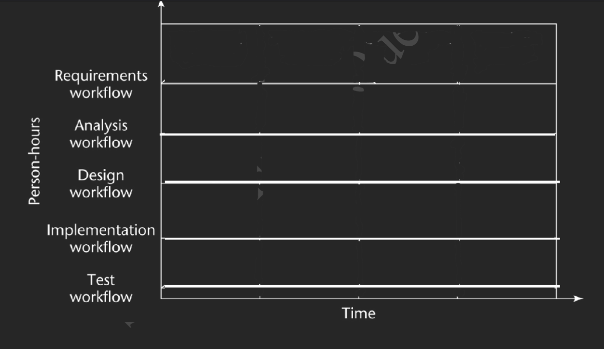
### 7a workflow 
[==必考Workflows==](#==必考Workflows==)
normal flow

event 1 requirement  change
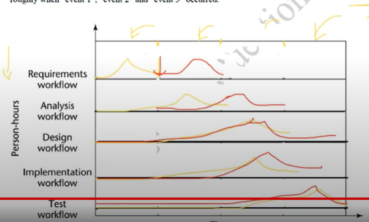
event 2 design change

event 3 analysis change


## question 8 testing
> Suppose that you are a software engineer working on a car simulation system. You are given the pseudocode for the drive method in the Driver class


### 8.a testing
[==重点WEEK 11 Software Testing==](#==重点WEEK%2011%20Software%20Testing==)
> Write a set of 10 test cases for glass box unit testing of the drive() method.


## Question 9 no/functional requirement
> You are a software engineer working on an online shopping application. Web customers can browse items, but has to register the first time they make a purchase. When making a purchase, the customer can go back at any time and view the items in their shopping basket. When they proceed to the “checkout” phase, the system allows them the option of paying by credit card (which means the system has to connect to a credit payment service), or by PayPal. A separate database system will store all the customer registration information

### 9a no/functional requirement 
[Week 2 Requirements engineering](#Week%202%20Requirements%20engineering)
> Below are 3 of the requirements, written in English. Each of these is not well-written (well-written requirements should be precise, unambiguous, complete and consistent.) For each
> (i) indicate whether this is a functional or non-functional requirement (1 mark)
> (ii) re-write the requirement (2 marks)

(a) “When customers register they have to provide a password, which must be a ‘strong’
one.”
+   functional requirement
+ (Note: what is meant by strong password?) 
+ When users register they must provide a password, which should be comprised of at least 8 characters, at least one of which numeric or taken from the following set: '-', '_', '.', '$', '#'

(b) “The shopping website has to work on all the main web browsers.”
+ non-functional requirement
+ (Note: “work”? which browsers?)
+ The shopping website must display and react to user input in the same manner on the following browsers: IE7+, Firefox 3.x+, Safari 4.x.

(c) “Customers will be able to search for items”
+ functional requirement
+ (Note: simple or more complex search?)
+ Customers will be able to search for items in the database by entering a query either including the name or the brand of the product. The system will display all results in a list.

# Extra exercise css
## c1 use case diagram one
> a. The computer shop sells laptops and desktops
> b. You can search and buy a product based on brand, memory, screen size, price, and/or VGA cards
> c. You can borrow a device on rent
> d. You can buy a device on loan, in addition to other payment methods
> e. A customer can sell products, review a product, request to assemble a device
> f. Admin can manage products and customers

[==重点USE CASE DIAGRAMS==](#==重点USE%20CASE%20DIAGRAMS==)

## c2 use case scenario
> a. Write a use case scenario on “Loan a device” with exception conditions
> a. Write a use case scenario on “Review a product” with exception condition

[Use case scenario](#Use%20case%20scenario)

## c3 sequence diagram
>  b. Draw a sequence diagram on the above-mentioned use case

[==重点Sequence_diagram==](#==重点Sequence_diagram==)

## c4  statechart
> d. Draw a statechart on the above-mentioned use case

[==重点选考UML state chart==](#==重点选考UML%20state%20chart==)

## c5 initial class diagram on CSS
[==重点Initial Class Diagram==](#==重点Initial%20Class%20Diagram==)

## c6 black box test cases
> 6. Write black box test cases on Loan a device and review a product use cases

[==重点WEEK 11 Software Testing==](#==重点WEEK%2011%20Software%20Testing==)

# Extra exercise two


## e1. functional requirement 
select some function and write down: 
[Functional requirements](#Functional%20requirements) 
+ download photo
+ system read photo
+ tag
+ upload
+ watermark

## e2. Non functional requirement:
[Non-functional requirements](#Non-functional%20requirements)
+ colour theme can be switch for easier reading
+ API linked  to system
+ flag design icon to show different options
+ system accept file type


## e3. User story
 [==必考User stories==](#==必考User%20stories==)
+ 功能性需求选择来写
+ as a staff, i want to add a watermark so that user can identify their photo
+ as a user, i want to upload photo to the cloud so that i can view the photo in different device anywhere anytime


## e4. Acceptance criteria
 [==必考Acceptance criteria==](#==必考Acceptance%20criteria==)

>  as a staff, i want to add a watermark so that user can identify their photo

 Acceptance criteria 1 
+ desktop system select click choose page
+ staff login
+ staff choose photos on XX page, 
+ add watermark
+ confirm and response within 2 second

> as a user, i want to upload photo to the cloud so that i can view the photo in different device anywhere anytime

 Acceptance criteria 2
+ d

## e5. Initial class diagram 20pts 
[==重点Initial Class Diagram==](#==重点Initial%20Class%20Diagram==)
+ desktop user client staff system
+ 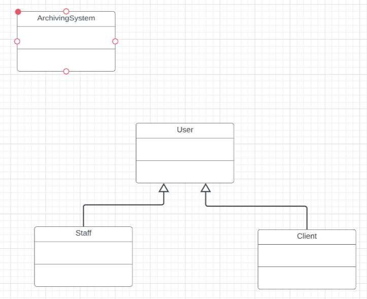
+ api
+ 


[My Initial class diagram in lucidchart](https://lucid.app/lucidchart/a4026035-3501-4a58-bd72-e21ef3b3d8c3/edit?viewport_loc=-324%2C159%2C2281%2C1036%2C0_0&invitationId=inv_3d939728-1cf9-48da-8b9b-8975c434fd64
)

## e6. Sequence diagram 20 pts 
[==重点Sequence diagram==](#==重点Sequence_diagram==)


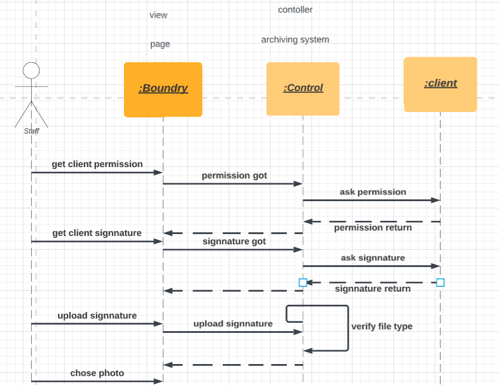

