Create time: 2022-05-05  Last update: 2022-12-05

# How to use the FIT study Note document
1. download the [markdown file repository](https://github.com/GreenH47/mynote) and  navigate to the `docs` folder
2. view all the markdown files via [Obsidian vault](https://help.obsidian.md/How+to/Working+with+multiple+vaults) that can show the linked section in the note document    
3. You may find some extra material or program template  repository in the Course Brief introduction for the FIT Note markdown Document (some course don't have )

4. you can view [the web page](https://greenh47.github.io/mynote/) which transfer from MD file online but will lose the extra information or wrong    markdown display

  
# FIT9132 Course Brief introduction

[FIT9132 - Introduction to databases](https://handbook.monash.edu/2022/units/FIT9132?year=2022) done for the year 2022. (Semester 1)  

# WEEK 1
ER Modeling


Logical Model  
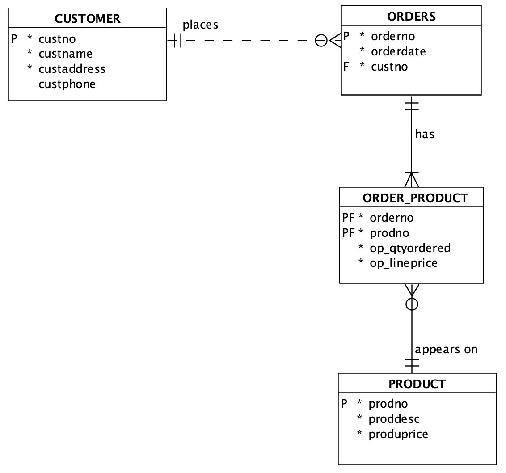

Physical Model


# week 2 Conceptual Modelling
  
理解数据库设计的各个阶段
理解ANSI/SPARC结构在数据库设计中的⻆⾊
认识实体关系图当中的各个组成部分
理解strong/weak entity之间的不同
学习绘制概念模型图

### ER diagram

### Entities

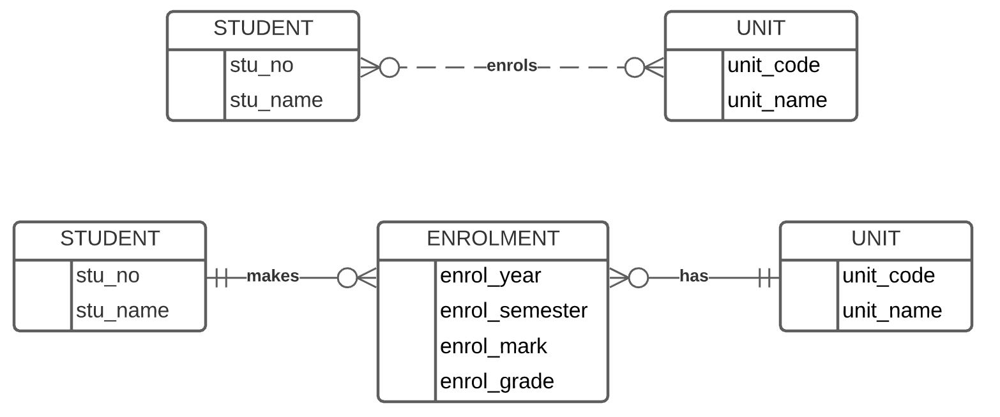

#### Strong Entity
Has a key which may be defined without reference to other entities  


####  Weak Entity
Has a key which requires the existence of one or more other entities.  
For example FAMILY entity - need to include the key of employee to create a suitable key for family


### Relationship
#### Identifying
 ▪  Identifier of A is part of identifier of B
▪  Shown with solid line
▪  ENROLMENT - STUDENT Enrolment key includes student id,which is an identifier of student.  


#### Non-identifying 
▪ Identifier of A is NOT part of identifier of B.
▪ Shown with broken line
▪ Department no (identifier of department) is not part of Employee’s identifier


### Attributes
#### Simple
Cannot be subdivided 
Age, sex, marital status

#### Composite
Can be subdivided into additional attributes
Address into street, city

#### Single-valued
Can have only a single value
 Person has one social security number

#### Multi-valued
Can have many values
Person may have several college degrees

####  Derived
Can be derived with algorithm
 Age can be derived from date of birth

#### Multivalued Attribute
An attribute that has a list of values.
Car colour may consist of body colour, trim colour, bumper colour.
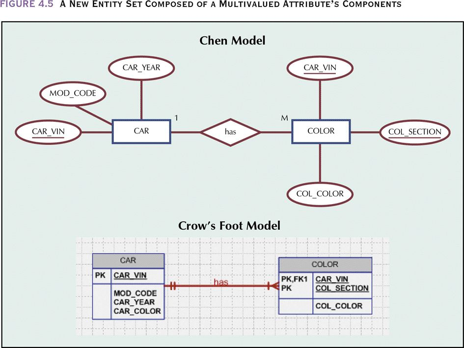

### ERD 
#### Step 1 Identify Main Entities

#### STEP 2: Identify the relationships which exist between these entities  
(remember to add an appropriate verb)

#### Step 3 Add Non-Key Attributes
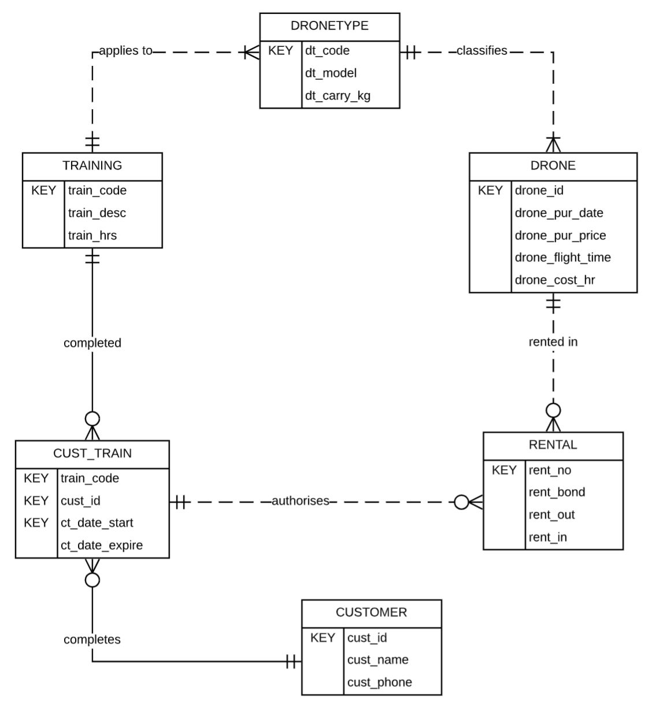


# WEEK 3 Relational Database Model
• Explain the relational model and its components
• Identify and evaluate the issues of insert, update and delete anomalies
• Define entity and referential integrity
• Differentiate the types of keys and distinguish their roles in the relational model
• Formulate and write relational algebra to solve query scenarios

Basic structure is the mathematical concept of a RELATION mapped to the  'concept' of a table (tabular representation of relation)  
– Relation - abstract object  
– Table - pictorial representation  
– Storage structure - "real thing" - eg. isam file of 1's and 0's

## A Relation
A relation consists of two parts  
– heading  – body
Relation heading ⇨ column headings  
Relation body ⇨ set of data rows
### Relation Heading ⇨ column headings  
Also called Relational Schema consists of a fixed set of attributes  

 `R (A1,A2,.......An)  
`R = relation name, Ai = attribute i` 

Each attribute corresponds to one underlying domain:  
 Customer relation heading:  
	 CUSTOMER (custno, custname, custadd, custcredlimit)
		dom(custno) = customer_number

###  Relation Body ⇨ set of data rows

### Relation Properties
#### No duplicate tuples
sets do not contain duplicate elements   hence tuples must be unique

#### Tuples are unordered within a relation
sets are not ordered   hence tuples can only be accessed by content

#### No ordering of attributes within a tuple
#### Tuple values are atomic - cannot be divided
 `EMPLOYEE (eid, ename, departno, dependants) `
	 not allowed: `dependants (dep_name, dep_age) `multivalued hence no multivalued (repeating) attributes allowed, called the first  normal form rule

### Functional Dependency
A set of attributes A functionally determines an attribute B if, and only if, for  each A value, there is exactly one value of B in the relation. It is denoted as 

<mark style="background: #0000CD;">A  → B (A determines B, or B depends on A)</mark>

## Relational Model Keys
###   superkey
A superkey of a relation R is an attribute or set of attributes which exhibits only  the uniqueness property  
– No two tuples of R have the same value for the superkey (Uniqueness  property)  
– t1[superkey] ≠ t2[superkey]
### candidate key (CK)
A candidate key (CK) of a relation R is an attribute or set of attributes which  exhibits the following properties:  
– <mark style="background: #ff0000;">Uniqueness property (as above)</mark>, and  
– No proper subset of CK has the uniqueness property  (Minimality or Irreducibility property) ie. a minimal superkey
–<mark style="background: #3CB371;"></mark>One candidate key is chosen to be the primary key (PK) of a relation
### Primary key
<mark style="background: #D2691E;">One candidate key is chosen to be the primary key (PK) of a relation
preferably a single attribute, preferably numeric</mark>


### Null
NULL is NOT a value - is a representation of the fact that there is NO VALUE
VALUE NOT APPLICABLE
VALUE UNKNOWN
VALUE DOES NOT EXIST
VALUE UNDEFINED

### Writing Relations
Relations may be represented using the following notation:  
– RELATION_NAME (attribute1, attribute2,...)  
▪ Relation_name must not be pluralised (is a set name)  
▪ The primary key is underlined.  
`STAFF (staff_id, staff_surname, staff_initials, staff_address,  staff_phone)`

### Foreign Key (FK)
An attribute/s in a relation that exists in the same, or another relation  as a Primary Key  

### Data Integrity
==Entity integrity==
Primary key value must not be NULL.  
• No duplicate tuple property then ensures that each primary key  must be unique  
• Implemented in the RDBMS via a unique index on the PK

==Referential integrity==
– The values of FK must either match a value of a full PK in the  related relation or be NULL.  

==Column/Domain integrity==
– All values in a given column must come from the same domain  (the same data type and range)

## Relational Algebra
8 basic operations:  
– single relation: 
• selection,•  projection  

– two relations:  
• cartesian product, join  • union  
• intersection  • difference  • division

### PROJECT 𝝿


### SELECT 𝝈


### Multiple Actions


### NATURAL JOIN
Step 1: STUDENT X MARK


Step 2: delete rows where IDs do not match (select =)


Step 3: delete duplicate columns (project away)


### UNION, INTERSECT, DIFFERENCE
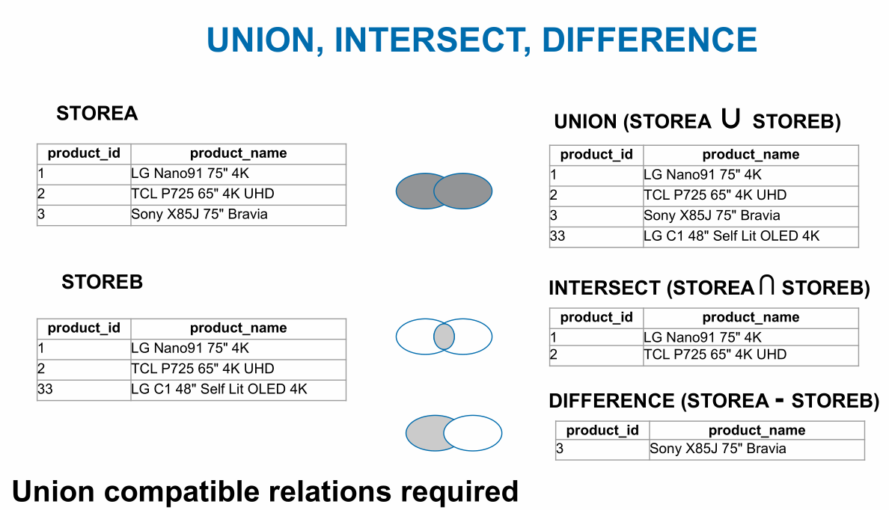

## quiz and exercise


# week 4 Normalisation
•理解在数据库设计中进⾏数据规范化的原因
•理解在数据规范化中各种不同类型的dependency的定义
•理解在数据规范化中从UNF到3NF的各个步骤
•注意到更⾼阶的数据规范化（Boyce Codd, 4NF和5NF）
•可以通过给定的relation画出dependency图
•可以对给出的数据库描述进⾏数据规范化的操作
•可以通过给定的逻辑等级的图标进⾏快速数据规范化

Data Normalisation  
▪ Relations MUST be normalised in order to avoid anomalies which may  occur when inserting, updating and deleting data.  
▪ Normalisation is a systematic series of steps for progressively refining the  data model.  
▪ A formal approach to analysing relations based on their primary key /  candidate keys and functional dependencies

Used:  
▪ as a design technique=="bottom up design"==, and  
▪ as a way of validating structures produced via =="top down design" (ER model  converted to a logical model - see next week)==  
▪ for this unit only concerned with conversion to third normal form 

## The Normalisation Process Goals
Creating valid relations, i.e. each relation meets the properties of the  relational model. In particular:  
– Entity integrity  – Referential integrity  
– No many-to-many relationship  
– Each cell contains a single value (is atomic)
创建有效关系，即每个关系都满足关系模型的属性。特别是： – 实体完整性 – 参照完整性 – 没有多对多关系 – 每个单元格包含一个值（是原子的）
  
In practical terms when implemented in an RDBMS:  
– Each table represents a single subject  
– No data item will be unnecessarily stored in more than one table (remember  some redundancy still exists - minimal redundancy).  
– The relationship between tables can be established (via PK and FK pairs).  
– Each table is void of insert, update and delete anomalies.  
实际上，当在 RDBMS 中实现时： – 每个表代表一个主题 – 没有数据项将不必要地存储在多个表中（记住一些冗余仍然存在 - 最小冗余）。 – 可以建立表之间的关系（通过 PK 和 FK 对）。 – 每个表都没有插入、更新和删除异常。 

## Representing a form as a relation
This process follows a standard approach:  
– arrive at a name for the form which indicates what it represents (its subject)  
– determine if any attribute is multivalued (repeating) for a given entity  instance of the forms subject if an attribute (or set of attributes) appears multiple times then the group  of related attributes need to be shown enclosed in brackets to indicate  there are multiple sets of these values for each instance
此过程遵循标准方法： – 为表单指定一个名称，表明其代表什么（其主题） – 确定表单主题的给定实体实例的任何属性是否是多值（重复）如果一个属性（或一组属性）出现多次，则需要将相关属性组显示在括号中，以指示每个实例有多组这些值

example
`DRUG_SLSREP (drug_code, drug_name, slsrep_id, slsrep_name,  slsrep_mobile)`
该表格由分配给销售代表数据的重复药品行（实例）组成 


## Dependency
### Functional Dependency Revisited
▪ An attribute B is FUNCTIONALLY DEPENDENT on another attribute A, if a  value of A determines a single value of B at any one time.
`CUSTNUMB ➔ CUSTNAME  ORDERNO ➔ ORDERDATE`


### Functional Dependency
#### TOTAL DEPENDENCY  
– attribute A determines B AND attribute B determines A  
`• EMPLOYEE-NUMBER ➔ TAX-FILE-NUMBER  • TAX-FILE-NUMBER ➔ EMPLOYEE-NUMBER`

#### FULL DEPENDENCY  
occurs when an attribute is always dependent on all attributes in the  composite PK  
`ORDERNO, PRODNO ➔ QTYORDERED`

#### PARTIAL  DEPENDENCY  
Lack of full dependency for multiple attribute key 
`ORDERNO, PRODNO  ➔ PRODDESC, QTYORDERED`
– here although qtyordered is fully dependent on orderno and prodno, only  prodno is required to determine proddesc  
– proddesc is said to be partially dependent on orderno and prodno

####   TRANSITIVE DEPENDENCY
occurs when Y depends on X, and Z depends on Y - thus Z also depends on  X ie. X ➔ Y ➔ Z  
– and Y is not a candidate key (or part of a candidate key)  
`ORDERNO ➔ CUSTNUMB ➔ CUSTNAME`

当 Y 依赖于 X 并且 Z 依赖于 Y 时发生 - 因此 Z 也依赖于 X 即。 X ➔ Y ➔ Z – Y 不是候选键（或候选键的一部分）

## Normal Form
### UNF 


### 1NF
A RELATION IS IN FIRST NORMAL FORM (1NF)  IF:  
• a unique primary key has been identified for each tuple/row.  
• it is a valid relation  
– Entity integrity (no part of PK is null)  
– Single value for each cell ie. no repeating group  (multivalued attribute).  
• all attributes are functionally dependent on all or part of the  primary key

如果： • 已为每个元组/行标识了唯一的主键，则关系为第一范式 (1NF)。 • 这是一个有效的关系 – 实体完整性（PK 的任何部分都不为空） – 每个单元格的单个值，即。没有重复组（多值属性）。 • 所有属性在功能上都依赖于全部或部分主键

### UNF to 1NF
–  identifying a unique identifier for the repeating group.  
– remove any repeating group along with the PK of the main relation.  
– The PK of the new relation resulting from the removal of repeating  group will normally have a composite PK made up of the PK of the  main relation and the unique identifier chosen in 1. above, but this  must be checked
标识重复组的唯一标识符。 
删除任何重复组以及主要关系的 PK。 
删除重复组产生的新关系的 PK 通常会有一个复合 PK，由主关系的 PK 和上面 1. 中选择的唯一标识符组成，


### 1NF to 2NF
all non key attributes are functionally dependent on the primary key  
– all non key attributes are functionally dependent on any candidate  key 
所有非键属性在功能上依赖于主键
所有非键属性在功能上依赖于任何候选键
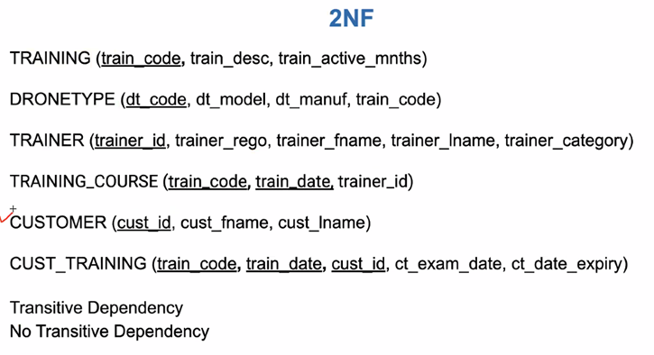

### 2NF to 3NF
Move from 2NF to 3NF by removing transitive dependencies  
– Remove the attributes with transitive dependency into a new relation.  
– The determinant will be an attribute in both the original and new  relations (it will become a PK / FK relationship)  
– Assign the determinant to be the PK of the new relation
删除传递依赖从 2NF 移动到 3NF——将具有传递依赖的属性删除到新关系中。 – 行列式将是原始关系和新关系中的属性（它将成为 PK / FK 关系） – 将行列式分配为新关系的 PK
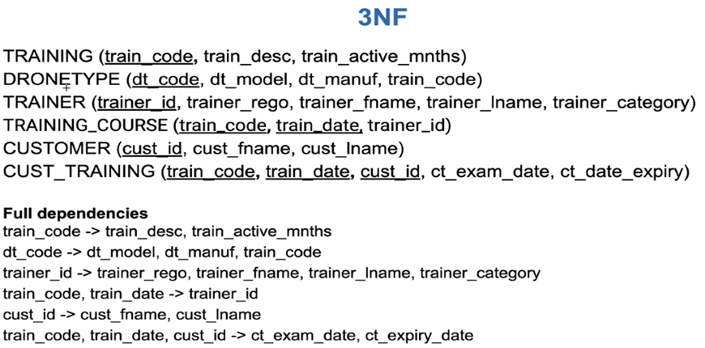

### summary
  
<mark style="background: #3CB371;">UNF to 1NF define PK & remove repeating group.  
1NF to 2NF remove partial dependency.  
2NF to 3NF remove transitive dependency.  
UNF 到 1NF 定义 PK 并删除重复组。 
1NF 到 2NF 消除部分依赖。
2NF 到 3NF 消除了传递依赖。</mark>


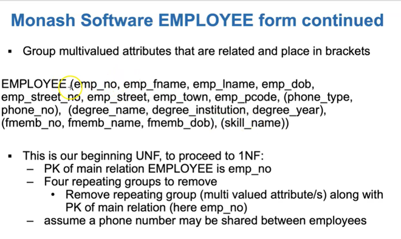


# week 5 Logical Modelling
Define the steps taken to map an ER diagram to a relational model
 Map an ER diagram to a relational model
Use SQL Developer - Data Modeler to draw a logical level ER diagram

## Relational Model Characteristics
Each relation must have a unique name  
▪ Each attribute of a relation must have a distinct name within the relation  
▪ An attribute cannot be multivalued (consist of repeating values)  
▪ All values of an attribute need to be from the same domain  
▪ The order of attributes and tuples in a relation is immaterial  
▪ Each relation must have a primary key  
▪ Logical (not physical) connections are made between relations by virtue  
of primary/foreign key pairing


## Transforming ER diagrams into relations
Essentially  
– KEY to PK  
– Represent relationships with PK/FK pairs

▪ The steps are:  
– Map strong (regular) entities  
– Map weak entities  
– Map binary relationships  
– Map associative entities  
– Map unary relationships  
– Map ternary relationships

### Mapping a Composite Attribute


### Mapping a Multi valued Attribute


### Mapping a Weak Entity
For each weak entity type, create a new relation and include all of the simple  attributes as attributes of this relation. The PK of the identifying relation is  also included as the FK in this new relation


### Mapping a 1:M Binary Relationship
For each 1:M binary relationship, first create a relation for each of the  two entity types participating in the relationship. Then include the PK  attribute (or attributes) of the entity on the one-side of the relationship  as the FK on the many-side of the relationship
对于每个 1:M 二元关系，首先为参与该关系的两个实体类型中的每一个创建一个关系。然后将实体的PK属性（或属性）包含在关系的一侧作为关系的多侧的FK


### Mapping a M:N Binary Relationship
First create a relation for each of the two entity types participating in the relationship.  
– Then create a new relation and include as foreign key attributes, the PK  attribute (or attributes) for each of the two participating entity types. These  attributes become the PK of the new relation.  
– If there are any nonkey attributes associated with the M:N relationship, they  are also included in the new relation.  
首先为参与关系的两个实体类型中的每一个创建一个关系。 – 然后创建一个新关系，并将两个参与实体类型中的每一个的 PK 属性（或多个属性）作为外键属性包括在内。这些属性成为新关系的PK。 – 如果有任何与 M:N 关系关联的非关键属性，它们也包含在新关系中。 


### Mapping an associative entity with an Identifier


### Mapping a 1:M Unary Relationship
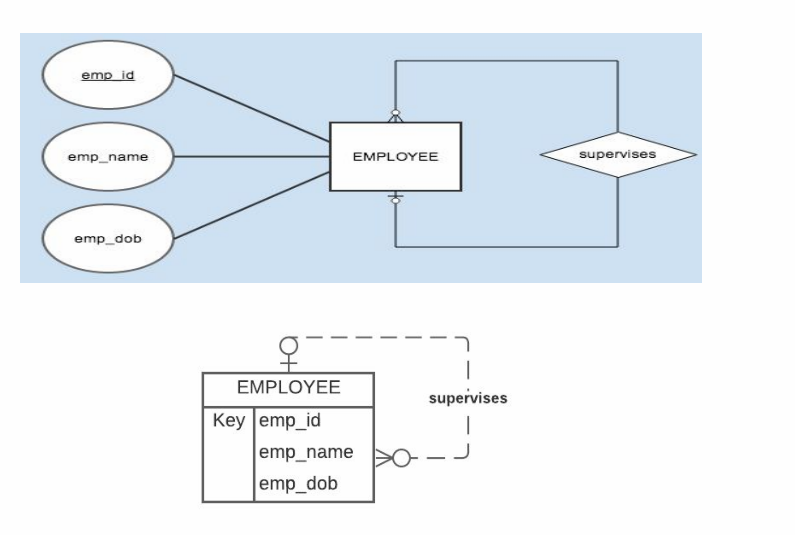

### Mapping a M:N Unary Relationship


# week6 Creating & Populating the Database
Map an ER diagram to a relational model  

Use SQL Developer - Data Modeler to draw a logical level ER diagram, map it to the  relational model and generate a schema file

## CREATE A TABLE (DDL)


### Alternative (BETTER) method of defining FKs


### ALTER TABLE
Used to change a tables structure.  
▪ For example:  
– Adding column(s).  
– Removing column(s).  
– Adding constraint(s) - used previously for FK's, but can be any constraint  
– Removing constraint(s)


### ALTER TABLE_Manipulate Constraints
Turn constraint ON or OFF to temporarily disable


Remove/re add constraint to modify constraint
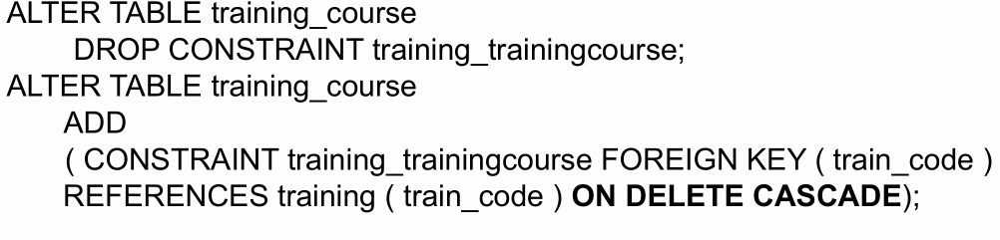

### DROP_DELETING A TABLE
`DROP TABLE training_course PURGE`
`DROP TABLE trainer CASCADE CONSTRAINTS PURGE;`

## ADDING TUPLES/ROWS TO A TABLE (DML)
### INSERT_Adding data to table
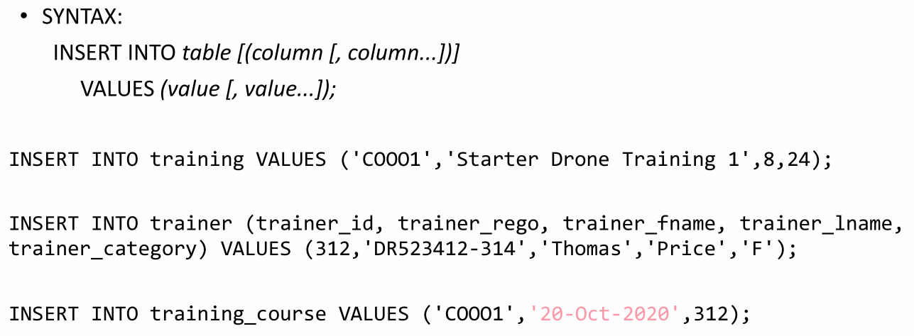
#### (TO_DATE)Inserting DATES into a table
convert a date
`to_date('06 Apr 2022','dd Mon yyyy')`
convert a date and time
`to_date('06/04/2022 17:00','dd/mm/yyyy hh:mi')`
convert a time
`to_date('17:00','hh:mi')`
Insert a rental into the RENTAL table
`insert into RENTAL (rent_no, rent_bond, rent_out, rent_in,drone_id, ct_id) values (123, 250,to_date('06 Apr 2022 10:00','dd Mon yyyy hh:mi'), null,234, 2345);`

### COMMIT and ROLLBACK
COMMIT makes the changes to the database permanent.  ROLLBACK will undo the changes.  COMMIT/ROLLBACK only applicable to INSERT/UPDATE and DELETE

### (SEQUENCE) auto-increment of a numeric
Create sequence
`CREATE SEQUENCE manuf_seq ` 
`INCREMENT BY 1;`

Access the sequence using two built-in variables
`INSERT INTO manufacturer`
`VALUES(manuf_seq.nextval,'DJI');`


# WEEK 7 Structured Query Language (SQL)
Create tables in a database  
Add new records to a table  
Use ORACLE's sequences to generate keys  
Remove tables from a database
## SELECT
### Anatomy of an SQL SELECT Statement


###   Comparison
Compare the value of one expression to the value of another expression
`=, !=,< >, <, >, <=, >=`
`  drone_pur_price > 2000`

### BETWEEN_Range
test whether the value of an expression falls within a specified range of  values
`drone_pur_price BETWEEN 3000 AND 5300`
(both are inclusive)

### IN_Set Membership
test whether the value of expression equals one of a set of value
`dt_code in ('DMA2','DSPA') `

### LIKE_Pattern Match
whether a string (text) matches a specified pattern

% character represents any sequence of zero or more character
`WHERE dt_model LIKE 'DJI%'`(drone type models starting with DJI)

_ character represents any single character
`WHERE train_code LIKE '__I__' `(drone types with a train_code with  an I in the middle)

### AND, OR, NOT
An expression is evaluated LEFT to RIGHT  
Sub-expression in brackets are evaluated first  
NOTs are evaluated before AND and OR  
ANDs are evaluated before OR  
Use of BRACKETS better alternative  

AND is evaluated to be TRUE if and only if both conditions are TRUE  
• OR is evaluated to be TRUE if and only if at least one of the conditions  is TRUE


### NVL_replace a NULL with a value
It is used to replace a NULL with a value (numeric OR character/string)
`SELECT stu_nbr`
	`NVL(enrol_mark,0),`
	`NVL(enrol_grade,'WH')`
`FROM enrolment; `

`select rent_no, drone_id,  `
`to_char(rent_out,'dd-Mon-yyyy') as dateout, `
`nvl(to_char(rent_in,'dd-Mon-yyyy'),'Still out')  as datein  `
`from rental;`


`select rent_no, drone_id, rent_out, `
`nvl(rent_in,'Still out') from rental;`


### AS_Renaming Column
`select drone_id, drone_cost_hr/60 as costpermin  from drone;`

### (ORDER BY)Sorting Query Result
==Must be used if more than one row may be returned==
Order can be ASCending or DESCending. The default is ASCending
`select drone_id, drone_flight_time `
`from drone`
`order by `
`drone_flight_time desc, drone_id;`

### (DISTINCT)removing Duplicate Rows in the Query Result
`select distinct drone_id  `
`from rental  `
`order by drone_id;`


### TO_CHAR
Text representing date must be formatted  with TO_DATE when comparing or  inserting/updating
`select to_char(sysdate,'dd-Mon-yyyy') from dual; = 20-Apr-2021`
`select  to_char(sysdate,'dd-Mon-yyyy hh:mi:ss AM')  from dual; = 0-Apr-2020 02:51:24 PM `


## JOIN
placing the join in the where clause is not acceptable
### JOIN ON
the general form which always works
`from aaa JOIN bbb ON aaa.a = bbb.b`
`from aaa JOIN bbb ON aaa.key = bbb.key`


### JOIN USING
requires matching attribute/s in the two tables
`FROM trainer JOIN training_course USING (trainer_id)`


### NATURAL JOIN
requires matching attribute/s in the two tables
`FROM trainer NATURAL JOIN training_course`


### Different Types of SQL JOINs
 `(INNER) JOIN`: Returns records that have matching values in both tables
  `LEFT (OUTER) JOIN`: Returns all records from the left table, and the matched records from the right table
  `RIGHT (OUTER) JOIN`: Returns all records from the right table, and the matched records from the left table
  `FULL (OUTER) JOIN`: Returns all records when there is a match in either left or right table


# week8 DML Update, Delete and Transaction  Management
interpret a graphical representation of a relational database  
● code simple SQL statements on a single table  
● code SQL statements that use rows from more than a single table using different types of  
ANSI standard JOIN operations  
● code SQL SELECT statements to select rows based on different conditions  
● use ORACLE's date data type in SQL statements correctly  
● define an alias for tables and columns  
● sort the retrieved data into different orders via SQL ORDER BY
解释关系数据库的图形表示 ● 在单个表上编写简单的 SQL 语句 ● 使用不同类型的 ANSI 标准 JOIN 操作使用多个表中的行编写 SQL 语句 ● 编写 SQL SELECT 语句以根据不同条件选择行● 在 SQL 语句中正确使用 ORACLE 的日期数据类型 ● 为表和列定义别名 ● 通过 SQL ORDER BY 将检索到的数据排序为不同的顺序

# FINAL
## SQL

# SQL FINAL


```sql
/*
1. Display the full details of employees who earn less than $1000, order the output  by  the employee number.
*/

SELECT
    empno,
    empname,
    empinit,
    empjob,
    to_char(empbdate,'dd Mon yyyy'),
    empmsal,
    empcomm,
    deptno,
    mgrno
FROM
    payroll.employee
WHERE
    empmsal < 1000
ORDER BY
    empno;

```

```sql
/*
2. List the department number of departments that have employees, order the output by the department number .
*/

SELECT DISTINCT
    deptno
FROM
    payroll.employee
ORDER BY deptno;
```

```sql
/*
3. Display the full details of trainers (employee job is TRAINER) who earn less than 2500 each month and are working in department 20. Order the output by  employee number.
*/

SELECT
    empno,
    empname,
    empinit,
    empjob,
    to_char(empbdate,'dd Mon yyyy'),
    empmsal,
    empcomm,
    deptno,
    mgrno
FROM
    payroll.employee
WHERE
    upper(empjob) = 'TRAINER'
    AND empmsal < 2500
    AND deptno = 20
ORDER BY
    empno;
```

```sql
/*
4. Display the name, job, monthly salary and commission of employees whose monthly salary is higher than their commission. Rename the columns: Name, Job, Monthly Salary and Commission. Order the output by name and within name by descending monthly salary.
*/

SELECT
    empname  AS "Name",
    empjob   AS "Job",
    empmsal  AS "Monthly Salary",
    empcomm  AS "Commission"
FROM
    payroll.employee
WHERE
    empmsal > empcomm
ORDER BY
    empname,
    empmsal DESC;
```

```sql
/*
5. Display the name and job of employees whose job ends with the letter R. Order the output by name and within name by job.
*/

SELECT
    empname,
    empjob
FROM
    payroll.employee
WHERE
    upper(empjob) LIKE '%R'
ORDER BY
    empname,
    empjob;
```

```sql
/*
6. Display the name and job of employees that have a name starting with “J”, “K” or “M”. Order the output by name and within name by job.
*/

SELECT
    empname,
    empjob
FROM
    payroll.employee
WHERE
        upper(empname) LIKE 'J%'
    OR
        upper(empname) LIKE 'K%'
    OR
        upper(empname) LIKE 'M%'
ORDER BY
    empname,
    empjob;
```

```sql
/*
7. Display the name, job, date of birth and monthly salary of employees who were born before 1990 and earn more than 1500 each month. Order the output by name and within name by monthly salary.
*/

SELECT
    empname,
    empjob,
    to_char(empbdate, 'Dd-Mon-YYYY') AS birthdate,
    empmsal
FROM
    payroll.employee
WHERE
        empbdate < TO_DATE('01-JAN-1990', 'dd-MON-YYYY')
    AND empmsal > 1500
ORDER BY
    empname,
    empmsal;
```

```sql
/*
8. Display the name, job, date of birth and salary of employees that don't have a commission. Order the output by name, and within name by date of birth.
*/

SELECT
    empname,
    empjob,
    to_char(empbdate, 'Dd-Mon-YYYY') AS birthdate,
    empmsal
FROM
    payroll.employee
WHERE
    empcomm IS NULL
ORDER BY
    empname,
    empbdate;
```

```sql
/*
9. Display the employee name, job, department name, location and monthly salary of employees that work in NEW YORK. Order the output by name, and within name by job.
*/

SELECT
    e.empname,
    e.empjob,
    d.deptname,
    d.deptlocation,
    e.empmsal
FROM
    payroll.employee e join payroll.department d on e.deptno = d.deptno
WHERE
    upper(d.deptlocation) = 'NEW YORK'
ORDER BY e.empname;
```

```sql
/*
10. Display the name and job of employees who do not work in NEW YORK or CHICAGO. Order the output by name, and within name by job.
*/

SELECT
    e.empname,
    e.empjob,
    d.deptname,
    d.deptlocation
FROM
         payroll.employee e
    JOIN payroll.department d
    ON e.deptno = d.deptno
WHERE
    upper(d.deptlocation) NOT IN ( 'NEW YORK', 'CHICAGO' )
ORDER BY
    e.empname,
    empjob;
```

```sql
/*
11. Display the name, job, date of birth and salary of employees who were born in the first half of the 70s. Display the output in birth date order and within birthdate by name.
*/

SELECT
    empname,
    empjob,
    to_char(empbdate, 'Dd-Mon-YYYY') AS birthdate,
    empmsal
FROM
    payroll.employee
WHERE
    empbdate BETWEEN TO_DATE('01-JAN-1970', 'DD-MON-YYYY') AND TO_DATE('31-DEC-1974',
    'DD-MON-YYYY')
ORDER BY
    empbdate,
    empname;
```

```sql
/* 
12.  Display the name, job and salary of employees who earn less than 1500 or greater than 3000 per month. Order the output by name, and within name by monthly salary.
*/

SELECT
    empname,
    empjob,
    empmsal
FROM
    payroll.employee
WHERE
    empmsal NOT BETWEEN 1500 AND 3000
ORDER BY
    empname,
    empmsal;
```

```sql
/* 
13. Display the name, job and manager number of employees who have a manager. 
Order the output by manager number and within a given manager by employee name.
*/

SELECT
    empname,
    empjob,
    mgrno
FROM
    payroll.employee
WHERE
    mgrno IS NOT NULL
ORDER BY
    mgrno,
    empname;
```

```sql
/*
14. Display the name, job, department name, department location and monthly salary of employees who either work in DALLAS or as a MANAGER, and earn more than 2500. Order the output by name and within name by monthly salary.
*/

SELECT
    e.empname,
    e.empjob,
    d.deptname,
    d.deptlocation,
    e.empmsal
FROM
         payroll.employee e
    JOIN payroll.department d
    ON ( e.deptno = d.deptno )
WHERE
    ( upper(d.deptlocation) = 'DALLAS'
      OR upper(e.empjob) = 'MANAGER' )
    AND e.empmsal > 2500
ORDER BY
    e.empname,
    empmsal;
```

```sql
/*
15. Display the name, job, monthly salary and salary grade of all employees. Display the list in monthly salary order within salary grade order.
*/

SELECT
    e.empname,
    e.empjob,
    e.empmsal,
    s.salgrade
FROM
    payroll.employee e
    JOIN payroll.salgrade s ON (
        e.empmsal BETWEEN s.sallower AND s.salupper
    )
ORDER BY
    s.salgrade,
    e.empmsal;
```

```sql
/*
16. Display the name and location of ALL departments, and the name of their employees. Display the output in employee name order within department name order.
*/

SELECT
    d.deptname,
    d.deptlocation,
    e.empname
FROM
    payroll.employee e
    RIGHT OUTER JOIN payroll.department d ON (
        e.deptno = d.deptno
    )
ORDER BY
    d.deptname,
    e.empname;
```

```sql
/*
17. Display the name of ALL employees, their job and the name of their manager. List the output in employee name order within manager name order.
*/

SELECT
    e.empname "Employee",
    e.empjob AS "Emp Job",
    m.empname AS "Manager"
FROM
    payroll.employee e
    LEFT OUTER JOIN payroll.employee m ON (
        e.mgrno = m.empno
    )
ORDER BY
    m.empname,
    e.empname;
/*
-- here NVL(m.empname,'NA') could be used to display a value rather than leave the managers name null for the director
*/
```

```sql
/*
18. For each employee display their employment history. In the listing include the employees’ name, the name of the department they worked for, the begin and end date and their monthly salary. Display the output in begin date order (most recent at the top of the list) within employee name order.
*/

SELECT
    e.empname,
    d.deptname,
    to_char(histbegindate,'DD-Mon-YYY') as HISTBEGIN,
    to_char(histenddate,'Dd-Mon-YYYY') as HISTEND,
    h.histmsal
FROM
    payroll.employee e
    JOIN payroll.history h ON (
        e.empno = h.empno
    )
    JOIN payroll.department d ON (
        d.deptno = h.deptno
    )
ORDER BY
    e.empname,
    h.histbegindate DESC;
```

```sql
/*
19. Display the employee name, empjob, monthly salary and annual salary of all employees (annual salary is monthly salary x 12). Order the output by annual salary with the highest value shown first and within annual salary by name.
*/

SELECT
    empname,
    empjob,
    empmsal,
    empmsal * 12 AS "Annual Salary"
FROM
    payroll.employee
ORDER BY
    "Annual Salary" DESC,
    empname;
```

```sql
/*
20. Display the employee name, empjob, monthly salary, empcommission and annual income (salary and empcommission) of all employees. Commission is paid on a monthly basis. Order the output by name,and within by annual income.
*/

SELECT
    empname,
    empjob,
    empmsal,
    empcomm,
    12 * ( empmsal + nvl(empcomm, 0) ) AS "Annual Income"
FROM
    payroll.employee
ORDER BY
    empname,
    "Annual Income";
```

```sql
/*
1. Display for all employees their number, name, job, monthly salary, their current annual salary (not including commission) and what their annual salary would be if they were given a 10% pay rise. Order the output by employee number.
*/

SELECT
    empno,
    empname,
    empjob,
    empmsal,
    empmsal * 12          AS annual_salary,
    empmsal * 12 * 1.1    AS ann_sal_with_rise
FROM
    payroll.employee
ORDER BY
    empno;
```

```sql
/*
2. Display the name of all employees, their birthdate and their age in years. Order the output by birthdate, within birthdate order the output by name.
*/

SELECT
    empname,
    to_char(empbdate, 'DD-Mon-YYYY')                       AS birthdate,
    floor(months_between(sysdate, empbdate) / 12)          AS "Age in Yrs"
FROM
    payroll.employee
ORDER BY
    empbdate,
    empname;
```

```sql
/*
3. Display for all employees, their number, name, job, monthly salary, commission (which is paid monthly) and their current annual salary (including commission). Order the output by  employee number.
*/

SELECT
    empno,
    empname,
    empjob,
    empmsal,
    empcomm,
    ( empmsal + nvl(empcomm, 0) ) * 12 AS total_salary
FROM
    payroll.employee
ORDER BY
    empno;
```

```sql
/*
4. Display all employees details in the following format: EMPLOYEE N. Smith IS A Trainer AND WORKS IN THE Training DEPARTMENT.

INITCAP() 函数将每个单词的第一个字母设置为大写，所有其他字母设置为小写。单词由空格或非字母数字字符分隔。

SELECT INITCAP('steven king') "Emp. Name"  
FROM DUAL;

>> Emp. Name
-----------
Steven King
*/
SELECT
    'EMPLOYEE '
     || empinit
     || '. '
     || initcap(empname)
     || ' IS A '
     || initcap(empjob)
     || ' AND WORKS IN THE '
     || initcap(deptname)
     || ' DEPARTMENT.' as empdetails
FROM
    payroll.employee e
    JOIN payroll.department d ON (
        e.deptno = d.deptno
    )
ORDER BY empname;

SELECT
    'EMPLOYEE '
     || empinit
     || '. '
     || initcap(empname)
     || ' IS A '
     || initcap(nvl(empjob,'----'))
     || ' AND WORKS IN THE '
     || initcap(nvl(deptname,'----'))
     || ' DEPARTMENT.' as empdetails
FROM
    payroll.employee e
    left outer JOIN payroll.department d ON (
        e.deptno = d.deptno
    )
ORDER BY e.empno;
```

```sql
/*
5. Display the name of all employees, their birthdate and their age in months. Order the output by age in months (with the oldest employee first), within age in months order the output by name. The age in months must be shown with one decimal point and right aligned.
*/

SELECT
    empname,
    to_char(empbdate, 'dd-Mon-yyyy')                                     AS birthdate,
    lpad(to_char(months_between(sysdate, empbdate), '990.0'), 10)        AS age_in_months
FROM
    payroll.employee
ORDER BY
    age_in_months DESC,
    empname;

/*
LPAD() 函数用另一个字符串向左填充一个字符串，达到一定的长度。
SELECT LPAD("SQL Tutorial", 20, "ABC");
>> ABCABCABSQL Tutorial
*/
```

```sql
/*
6. Display the employees who were born in February. Order the output by employeename.


EXTRACT() Extract the month from a date:

SELECT EXTRACT(MONTH FROM "2017-06-15");
>> 6
*/

SELECT
    empname,
    to_char(empbdate, 'dd-Mon-yyyy') AS birthdate
FROM
    payroll.employee
WHERE
    EXTRACT(MONTH FROM empbdate) = 2
ORDER BY
    empname;
```

```sql
  
/*
7. Display the employee name, salary and commission (using the GREATEST function) for those employees who earn more commission than their monthly salary. Order the output by employee name and within name by monthly take home pay (salary plus commission).

GREATEST() Return the greatest value of the list of arguments:
*/

SELECT
    empname,
    empmsal,
    empcomm
FROM
    payroll.employee
WHERE
    empcomm = greatest(empcomm, empmsal)
ORDER BY
    empname,
    ( empmsal + empcomm );
    
```

```sql
/*
8. Display the name of all employees and their birthdate in the following format: EMPLOYEE N. Smith was born on FRIDAY the 17 of DECEMBER , 1982. Order the output by employee name.

 INITCAP() 函数将每个单词的第一个字母设置为大写，所有其他字母设置为小写。单词由空格或非字母数字字符分隔

RTRIM() 从字符串中删除尾随空格：

SELECT RTRIM('SQL Tutorial    ') AS RightTrimmedString;
>>SQL Tutorial
*/

SELECT
    'EMPLOYEE '
     || empinit
     || '. '
     || initcap(empname)
     || ' was born on '
     || rtrim(TO_CHAR(empbdate,'DAY') )
     || ' the '
     || EXTRACT(DAY FROM empbdate)
     || ' of '
     || rtrim(TO_CHAR(empbdate,'MONTH') )
     || ','
     || EXTRACT(YEAR FROM empbdate) as "EMP DOB Details"
FROM
    payroll.employee
ORDER BY 
    empname;
```

```sql
/*
9. Display the name of the employees who have registered for a course and the
number of times they have registered. Order the output by employee number.

`GROUP BY`语句将具有相同值的行分组到汇总行中，例如“查找每个国家/地区的客户数量”。

`GROUP BY`语句通常与聚合函数 ( `COUNT()`, `MAX()`, `MIN()`, `SUM()`, `AVG()`) 一起使用，以按一列或多列对结果集进行分组
SELECT _column_name(s)_  
FROM _table_name_  
WHERE _condition_  
GROUP BY _column_name(s)  
ORDER BY _column_name(s);_

SELECT COUNT(CustomerID), Country
FROM Customers
GROUP BY Country
ORDER BY COUNT(CustomerID) DESC;

>>COUNT(CustomerID) Country
13USA

11Germany

11France

*/

SELECT
    e.empno,
    e.empname,
    COUNT(*) AS nbr_registrations
FROM
         payroll.employee e
    JOIN payroll.registration r
    ON ( e.empno = r.empno )
GROUP BY
    e.empno,
    e.empname
ORDER BY
    empno;
```

```sql
/*
10. Who is the oldest employee? Show the employee number, name and date of birth. Order the output by employee number.
*/

SELECT
    empno,
    empname,
    to_char(empbdate, 'DD-Mon-YYYY')
FROM
    payroll.employee
WHERE
    empbdate = (
        SELECT
            MIN(empbdate)
        FROM
            payroll.employee
    )
ORDER BY
    empno;
```

```sql
/*
11. For each department, list the department number and name, the number of employees, the minimum and maximum monthly salary, the total monthly salary and the average salary paid to their employees. Name the columns: NbrOfEmployees, MinSalary, MaxSalary, TotalSalary, AvgSalary. Order the output by department number.
*/

SELECT
    d.deptno,
    d.deptname,
    COUNT(e.empno)                           "NbrOfEmployees",
    MIN(empmsal)                             "MinSalary",
    MAX(empmsal)                             "MaxSalary",
    SUM(empmsal)                             "TotalSalary",
    to_char(AVG(empmsal), '9999.99')          "AvgSalary"
FROM
    payroll.employee      e
    RIGHT OUTER JOIN payroll.department    d
    ON ( e.deptno = d.deptno )
GROUP BY
    d.deptno,
    d.deptname
ORDER BY
    deptno;
```

```sql
/*
12. Display the department number, jobs available in that department and the total monthly salary paid for each job. Order the output by department number and within a department by job.
*/

SELECT
    deptno,
    empjob,
    SUM(empmsal)
FROM
    payroll.employee
GROUP BY
    deptno,
    empjob
ORDER BY deptno,empjob;
```

```sql
/*
13. Which employee earns more than the average salary? Show the employee number, name and monthly salary. Order the output by employee number.
*/

SELECT
    empno,
    empname,
    empmsal
FROM
    payroll.employee
WHERE
    empmsal > (
        SELECT
            AVG(empmsal)
        FROM
            payroll.employee
    )
ORDER BY 
    empno;
```

```sql
/*
14. Which department has the greatest average monthly salary? Show the department no, name and average monthly salary. Order the output by department number.

ROUND() 函数将数字四舍五入到指定的小数位数
SELECT ROUND(235.415, 2) AS RoundValue;
>>RoundValue
235.420
*/

SELECT
    d.deptno,
    d.deptname,
    round(AVG(empmsal),2) "AvgSalary"
FROM
    payroll.employee e
    JOIN payroll.department d ON (
        e.deptno = d.deptno
    )
GROUP BY
    d.deptno,
    d.deptname
HAVING
    AVG(empmsal) = (
        SELECT
            MAX(AVG(empmsal) )
        FROM
            payroll.employee
        GROUP BY
            deptno
    )
ORDER BY 
    deptno;
```

```sql
/*
15. Which course has the most offerings? Show the course code, description and number of offerings. Order the output by the number of offerings in descending order and within the number of offerings by the course code.
*/

SELECT
    c.crscode,
    c.crsdesc,
    COUNT(*) "NbrOfferings"
FROM
         payroll.course c
    JOIN payroll.offering o
    ON ( c.crscode = o.crscode )
GROUP BY
    c.crscode,
    c.crsdesc
HAVING
    COUNT(*) = (
        SELECT
            MAX(COUNT(*))
        FROM
            payroll.offering
        GROUP BY
            crscode
    )
ORDER BY
    COUNT(*) DESC,
    crscode;
```

```sql
/*
16. Display the name, job and date of birth of employees who perform the same job as SCOTT and were born in the same year. Do not include SCOTT in the output. Order the output by employee name. 
*/

SELECT
    e.empname,
    e.empjob,
    to_char(empbdate, 'dd-Mon-yyyy')
FROM
    payroll.employee e
WHERE
        ( e.empjob,
          EXTRACT(YEAR FROM empbdate) ) = (
            SELECT
                e.empjob,
                EXTRACT(YEAR FROM empbdate)
            FROM
                payroll.employee e
            WHERE
                upper(empname) = 'SCOTT'
        )
    AND upper(e.empname) <> 'SCOTT'
ORDER BY
    empname;
```

```sql
/*
17. Using the MINUS statement, which employees have never registered in a course. Show their employee number and name. Order the output by employee number.

`SELECT DISTINCT`语句用于仅返回不同（不同）的值。
在表中，一列通常包含许多重复值；有时您只想列出不同的（不同的）值。
SELECT DISTINCT _column1_, _column2, ..._  
FROM _table_name_;
*/

SELECT
    empno,
    empname
FROM
    payroll.employee
MINUS
SELECT DISTINCT
    e.empno,
    empname
FROM
         payroll.registration r
    JOIN payroll.employee e
    ON ( r.empno = e.empno )
ORDER BY
    empno;
```

```sql
/*
18. Using the INTERSECT statement, which employees have both registered for and conducted courses. Show the employee number and name. Order the output by employee number.
*/

SELECT DISTINCT
    e.empno AS "TrainerAndStudent",
    empname
FROM
         payroll.offering o
    JOIN payroll.employee e
    ON ( o.empno = e.empno )
INTERSECT
SELECT DISTINCT
    e.empno,
    empname
FROM
         payroll.registration r
    JOIN payroll.employee e
    ON ( r.empno = e.empno )
ORDER BY
    "TrainerAndStudent";
```
