# GLPI project
[Home - GLPI Project](https://glpi-project.org/) 
[Install GLPI Using Docker Compose | DevOps Compass Guided IT Solutions by Docker Captain](https://www.heyvaldemar.com/install-glpi-using-docker-compose/) 
# installation

```bash
sudo apt update
sudo apt install -y docker-ce docker-ce-cli containerd.io
sudo groupadd docker
sudo usermod -aG docker $USER   # log out/in once
mkdir -p ~/glpi-stack && cd ~/glpi-stack
```

create `.mariadb.env`

```

MYSQL_ROOT_PASSWORD=glpiRootP@ss
MYSQL_DATABASE=glpidb
MYSQL_USER=glpiuser
MYSQL_PASSWORD=glpiP@ss
```

create `docker-compose.yml`  

```yaml
version: "3.8"

services:
  db:
    image: mariadb:10.7    # version tested by the GLPI community :contentReference[oaicite:4]{index=4}
    container_name: glpi-db
    env_file: .mariadb.env
    volumes:
      - db_data:/var/lib/mysql
    restart: unless-stopped

  glpi:
    image: diouxx/glpi:latest              # widely used community image :contentReference[oaicite:5]{index=5}
    container_name: glpi-app
    depends_on:
      - db
    environment:
      - TZ=Australia/Melbourne             # adjust as needed
    ports:
      - "8080:80"                          # browse http://<host>:8080
    volumes:
      - glpi_files:/var/www/html/glpi      # keeps plugins & uploads
    restart: unless-stopped

volumes:
  db_data:
  glpi_files:

```

```shell
docker compose up -d          # starts both containers in background
docker compose ps             # confirm healthy state

```

visit `http://192.168.0.153:8080 ` to Initialization the website.  
DB host = `db`, user/password from `.mariadb.env`, database = `glpidb`. 
Default logins / passwords are:

- glpi/glpi for the administrator account
- tech/tech for the technician account
- normal/normal for the normal account
- post-only/postonly for the postonly account


# nginx config

`sudo nano /etc/nginx/sites-available/ticket` 

```
server {
    listen 80;
    server_name ticket.greenhuang.local;

    # forward every request to GLPI container on the same host
    location / {
        proxy_pass http://127.0.0.1:8080;
        proxy_set_header Host $host;
        proxy_set_header X-Forwarded-Proto $scheme;
        proxy_set_header X-Real-IP $remote_addr;
        proxy_set_header X-Forwarded-For $proxy_add_x_forwarded_for;
    }

    # optional: basic security hardening
    add_header X-Frame-Options SAMEORIGIN;
    add_header X-Content-Type-Options nosniff;
}

```

```bash
sudo ln -s /etc/nginx/sites-available/ticket /etc/nginx/sites-enabled/

sudo nginx -t              # syntax check

sudo systemctl reload nginx
```

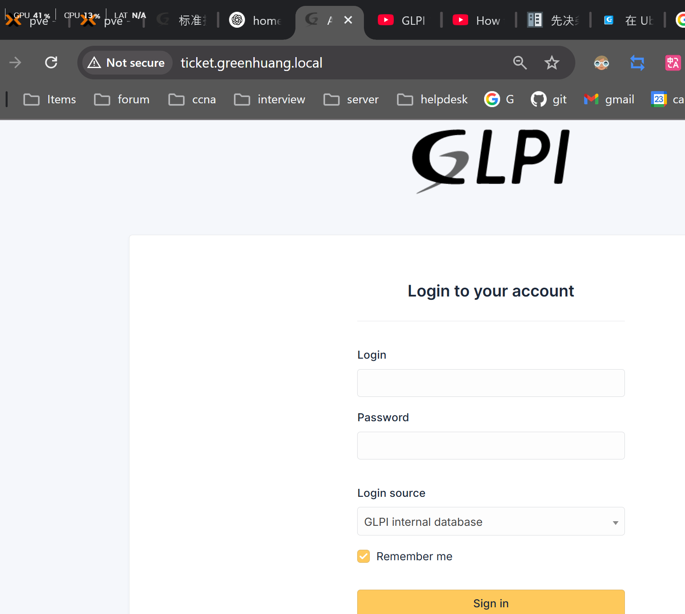

# setup
```
greenhuang
xVK3UhFrc2jzsFj
```
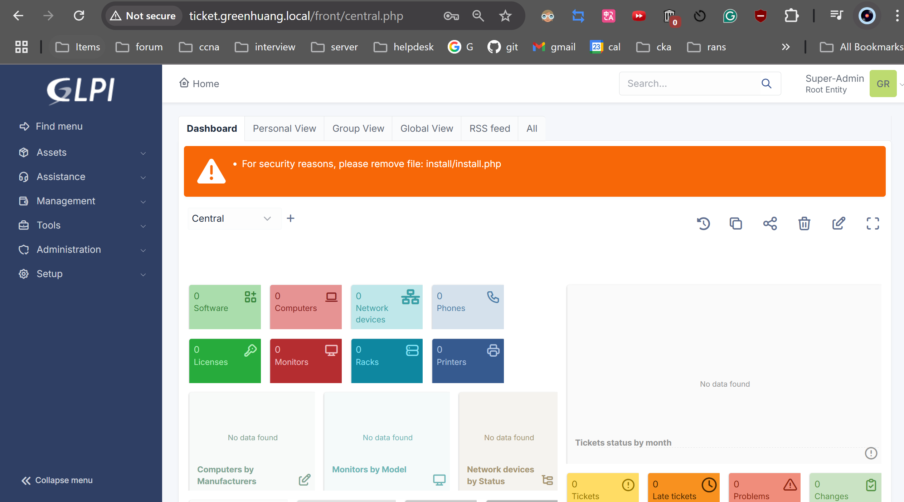

#  Synchronize User Accounts from Active Directory to GLPI

[GLPI linked with Active Directory / English support / Forum GLPI-Project](https://forum.glpi-project.org/viewtopic.php?id=172754)

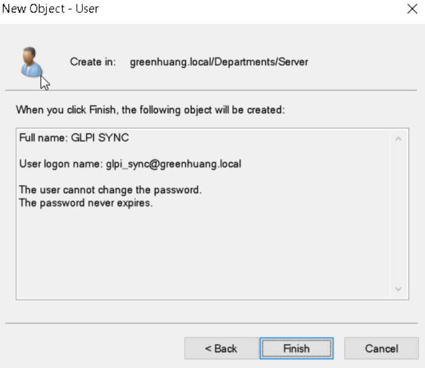
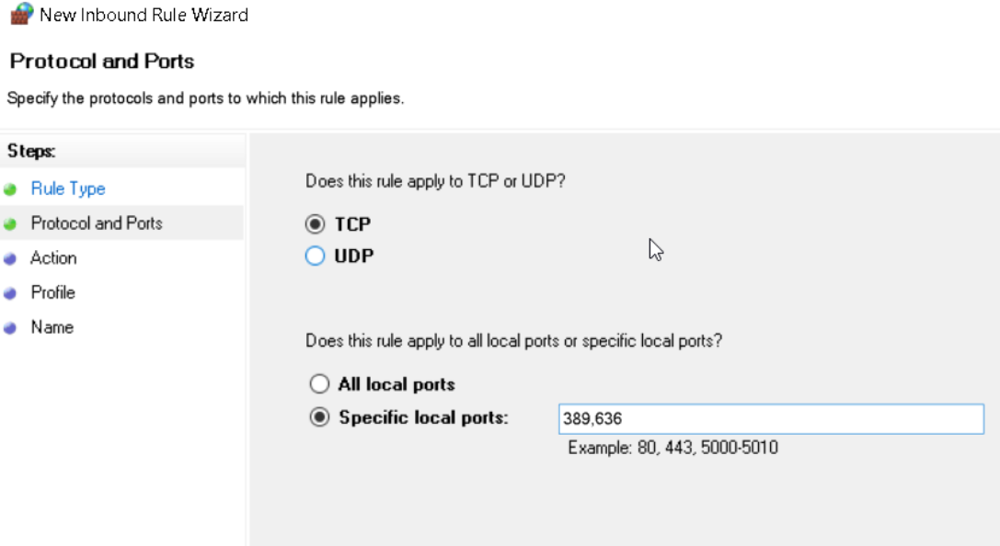
follow this video setup  
[GLPI - How to Import / Synchronize User Accounts from Active Directory to GLPI - YouTube](https://www.youtube.com/watch?v=iYvkrIeJ-z0)   
```
Note: Replace the highlighted orange information with your own details

	Connection Filter: 
			(&(objectCategory=person)(objectclass=user))
		or

			(&(objectClass=user)(objectCategory=person)(!(userAccountControl:1.2.840.113556.1.4.803:=2)))

	BaseDN: ou=departments,dc=ttc,dc=local

	RootDN: glpi_sync@ttc.local

	Login Field: samaccountname

	Synchronization Filed: objectguid
```

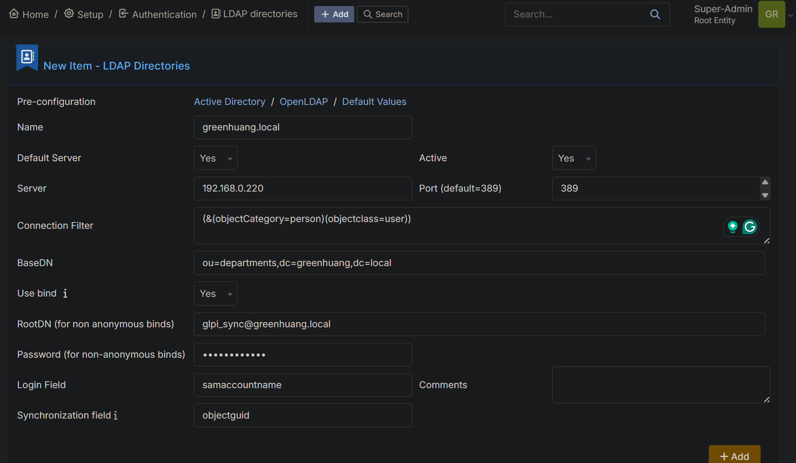
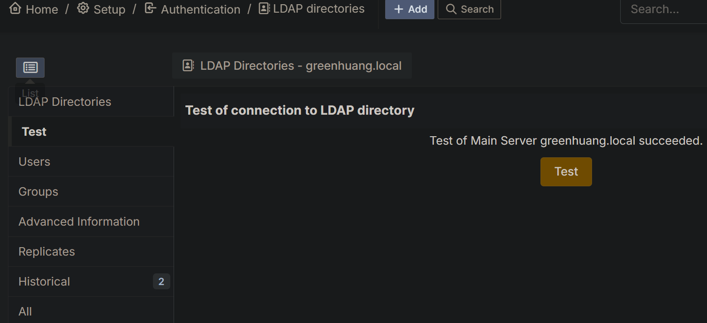

import user from current AD  
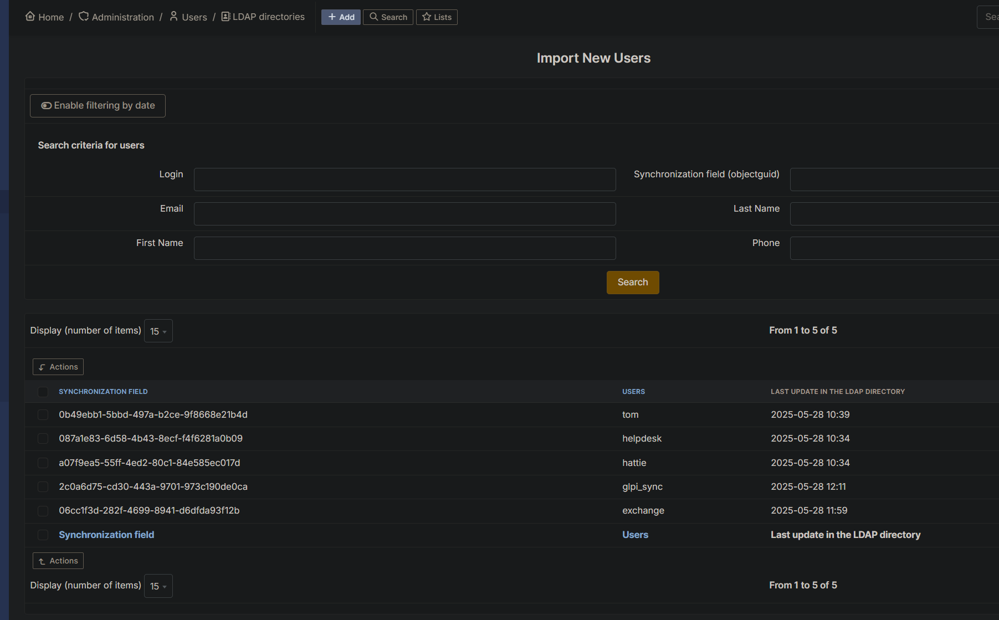
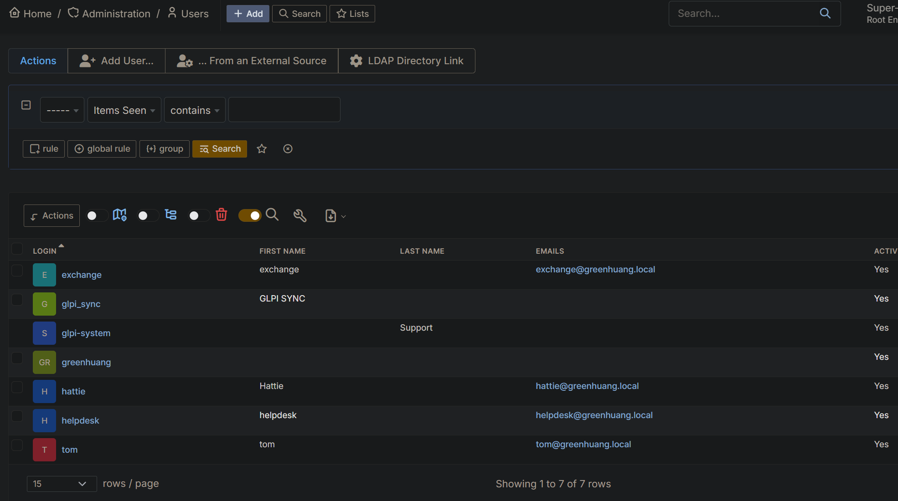
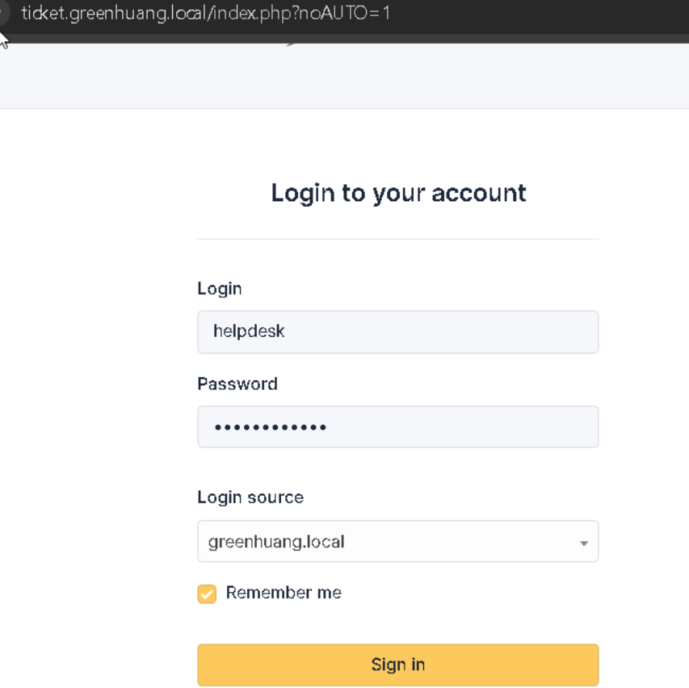
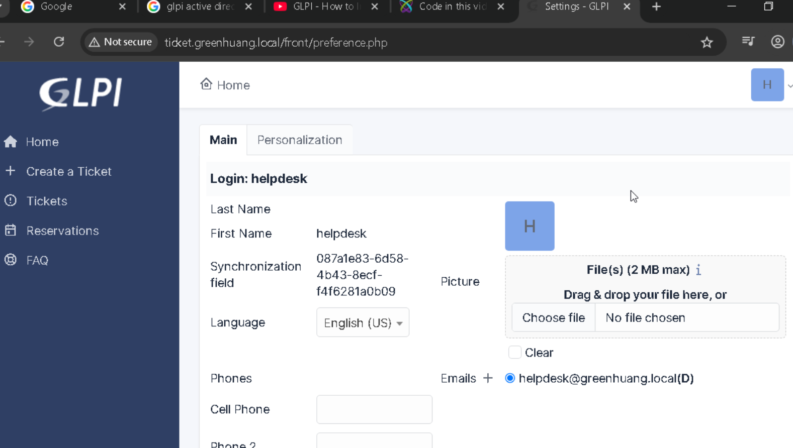
# ticketing system 
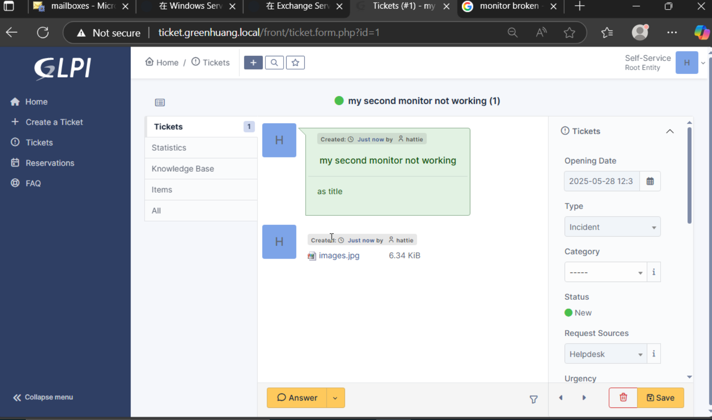
