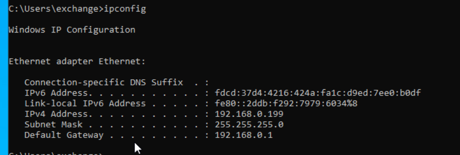
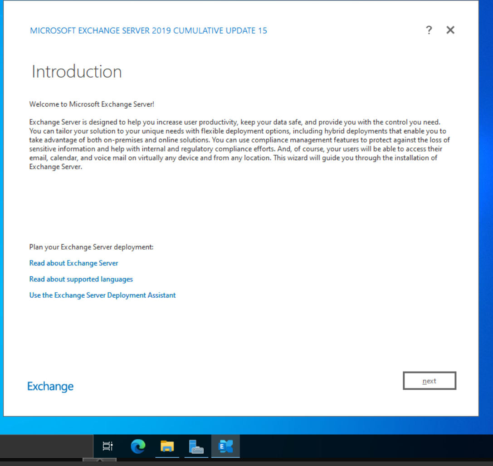
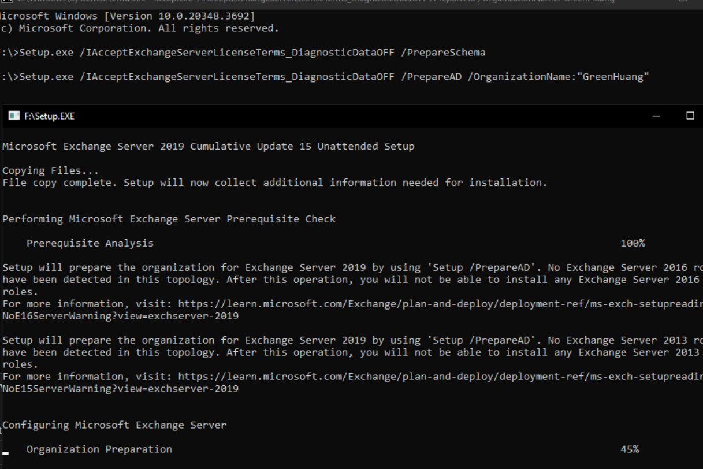
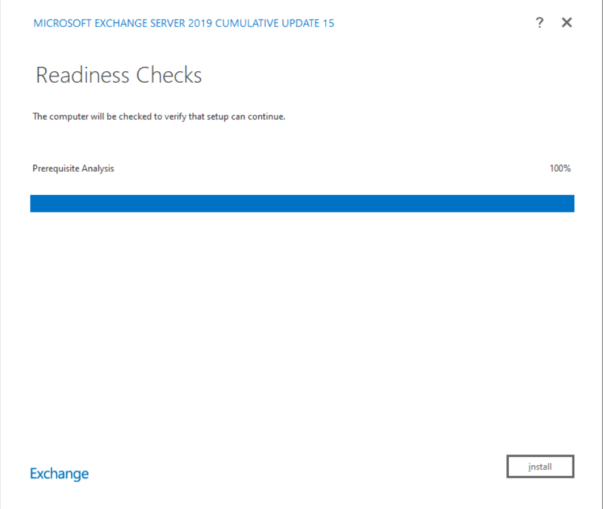
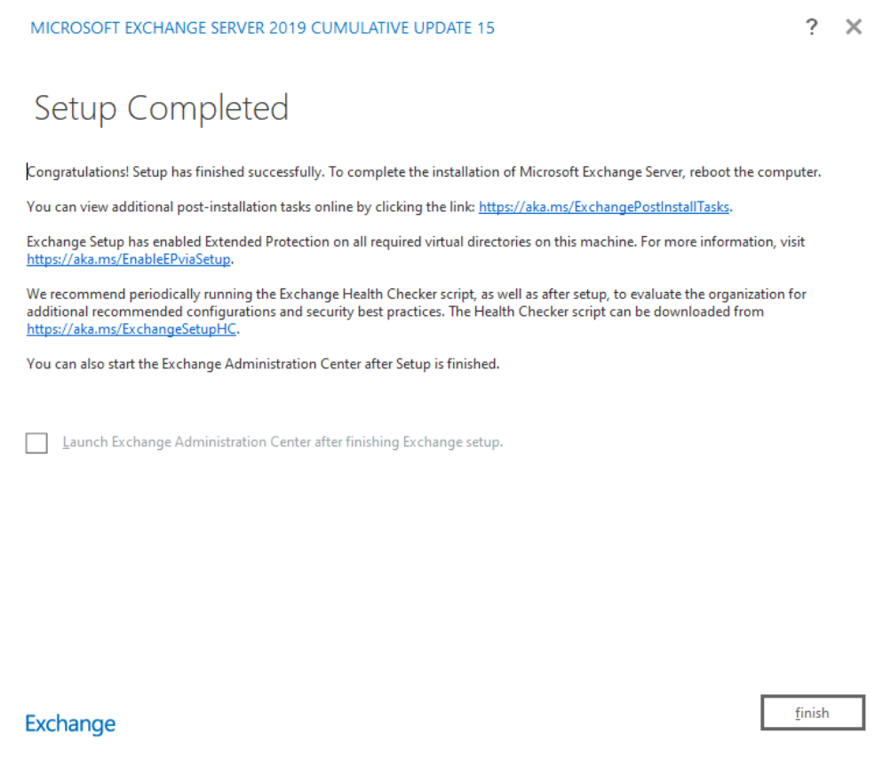
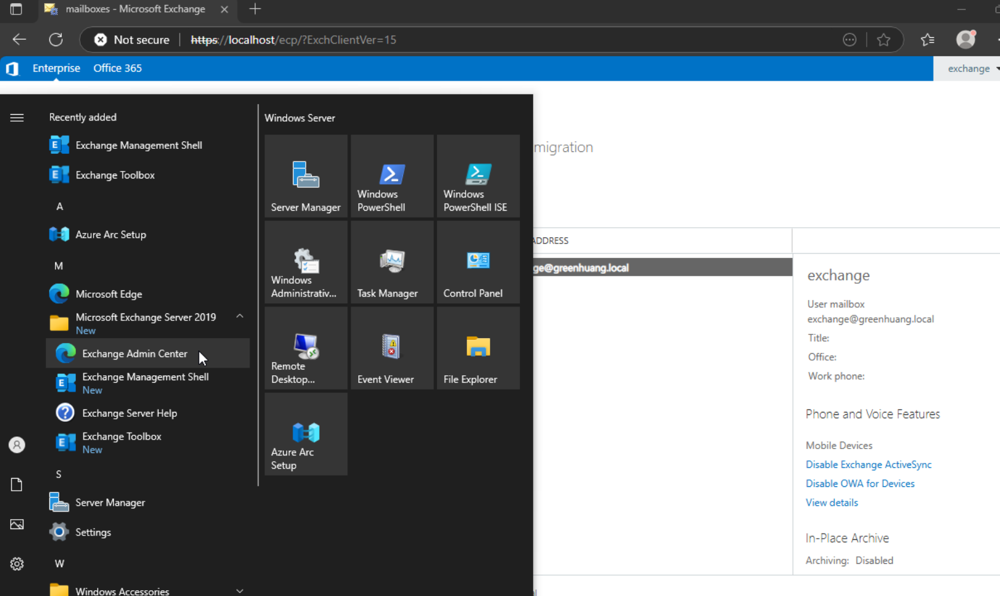
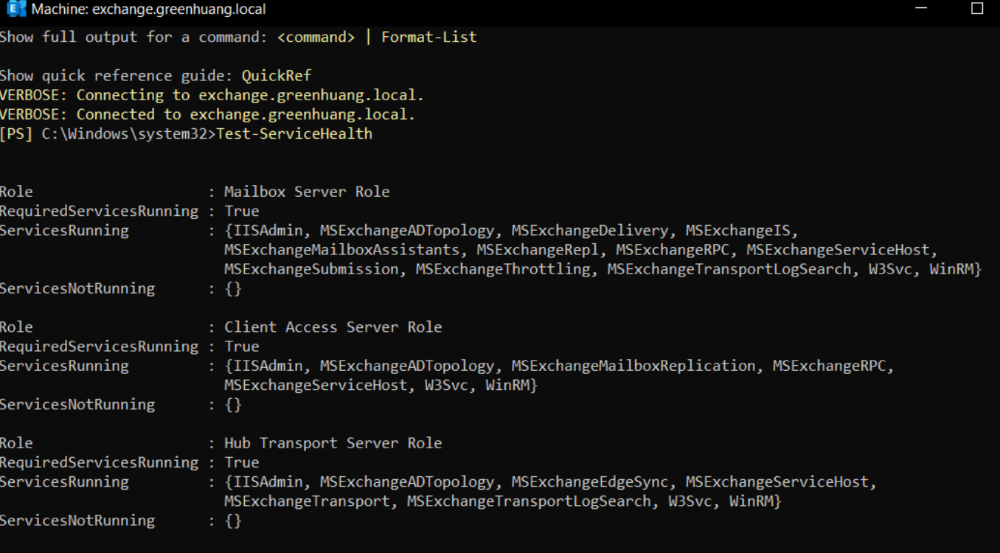
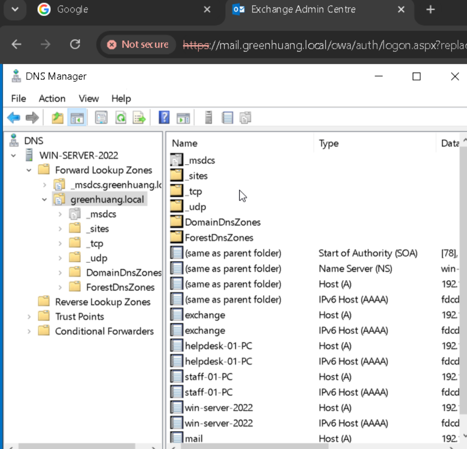
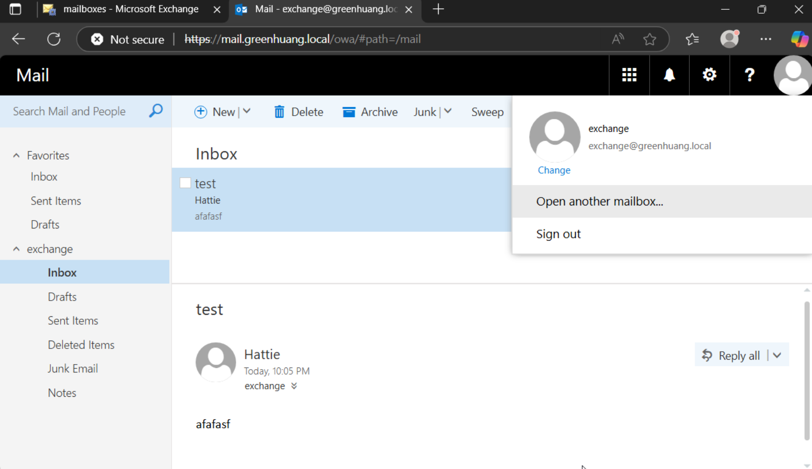

[Exchange Server - ALI TAJRAN](https://www.alitajran.com/exchange-server/) 

[Install Exchange Mailbox servers using the Setup wizard | Microsoft Learn](https://learn.microsoft.com/en-us/exchange/plan-and-deploy/deploy-new-installations/install-mailbox-role)  

[Homelab Series - Setting up Microsoft Exchange 2019 - YouTube](https://www.youtube.com/watch?v=0iqVhlh225Q)

[Download Cumulative Update 15 Exchange Server 2019 (KB5042461) from Official Microsoft Download Center](https://www.microsoft.com/en-us/download/details.aspx?id=106402) 

[Exchange Server 2019 download & key: Microsoft : Free Download, Borrow, and Streaming : Internet Archive](https://archive.org/details/mul_exchange_server_2019_cumulative_update_12_x64_dvd_52bf3153)




[Install Exchange Mailbox servers using the Setup wizard | Microsoft Learn](https://learn.microsoft.com/en-us/exchange/plan-and-deploy/deploy-new-installations/install-mailbox-role) 

[Prepare Active Directory and domains for Exchange Server, Active Directory Exchange Server, Exchange Server Active Directory, Exchange 2019 Active Directory | Microsoft Learn](https://learn.microsoft.com/en-us/exchange/plan-and-deploy/prepare-ad-and-domains) 

Prepare Active Directory (once per forest)3 准备 Active Directory（每个林一次）

- Mount the Exchange CU ISO (assume drive E:).挂载 Exchange CU ISO（假设驱动器 E:） 。
- Extend the schema扩展架构 
```
E:\Setup.exe /PrepareSchema /IAcceptExchangeServerLicenseTerms_DiagnosticDataOFF
```

- Prep the forest准备森林
```
E:\Setup.exe /PrepareAD /OrganizationName:"GreenHuang" /IAcceptExchangeServerLicenseTerms_DiagnosticDataOFF
```


- Prep all domains准备所有域
```
E:\Setup.exe /PrepareAllDomains /IAcceptExchangeServerLicenseTerms_DiagnosticDataOFF
```

- Wait for AD replication to finish (‐-15 min in a single-site lab) 等待 AD 复制完成（单站点实验室中为 15 分钟） 
- Run Setup.exe → Check for Updates → Mailbox role (Management Tools auto-selected) → tick “Automatically install Windows Server roles…” and step through the wizard until the readiness check is green, then click Install 运行 Setup.exe → 检查更新 → 邮箱角色 （自动选择管理工具）→ 勾选“自动安装 Windows Server 角色...”并按照向导一步步操作，直到准备就绪检查为绿色，然后单击“ 安装 
- Either way, reboot when Setup completes.无论哪种方式，安装完成后都重新启动。Tip: Never rename the server or change its IP after Exchange is installed.提示： 安装 Exchange 后切勿重命名服务器或更改其 IP。




[Configure internal DNS for Exchange - ALI TAJRAN](https://www.alitajran.com/configure-internal-dns-exchange/)  
after that add a A record `mail.greenhuang.local` to exchange ip address  



now user can visit `mail.greenhuang.local/owa/` to login their account  

