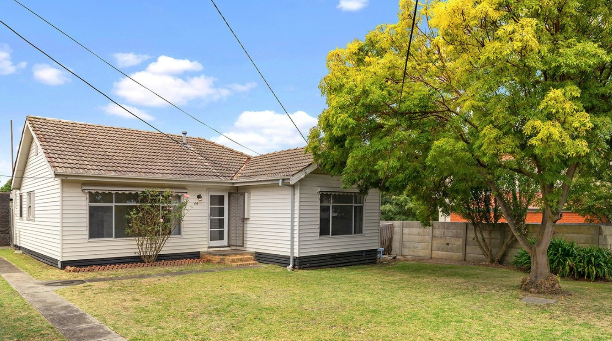
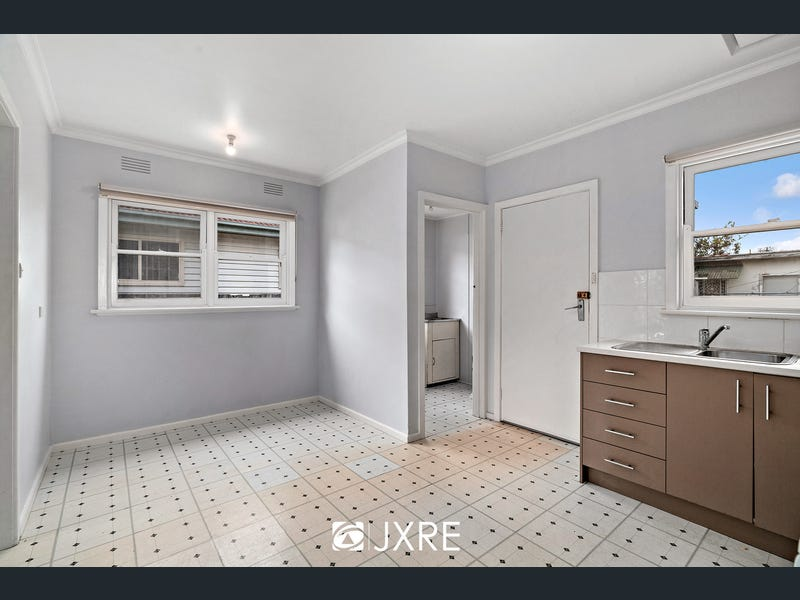
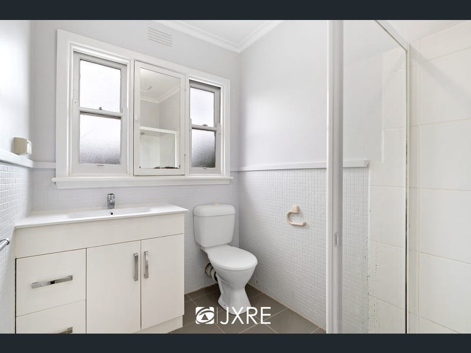

# 房屋概述 
clayton panorama st一室转租，现急招男性室友，步行十分钟至clayton校区
房子地址：64 Panorama Street, Clayton VIC 
三室两卫（非独立卫浴），两间卧室已有两人居住  
[64 Panorama St - Google Maps](https://www.google.com/maps/place/64+Panorama+St,+Clayton+VIC+3168/@-37.9223377,145.1268442,17z/data=!3m1!4b1!4m6!3m5!1s0x6ad66ad6fe0b1569:0x7d4397960003551b!8m2!3d-37.9223377!4d145.1294191!16s%2Fg%2F11c13zphnn?entry=ttu)  
  
  

# 房屋设施  
无空调，无暖气，有燃气灶燃气炉冰箱微波炉，有无线网（optus nbn 100M）  
## 厨房

## 餐厅及洗衣房

## 客厅 

## 卫生间 

## 后院  

# 出租卧室信息  

3.8x3.0 = 11.4 平方米，最大主卧，内置两个衣柜  
窗户朝东开设，视野良好，周遭安静  

# 费用情况
以下所有费用均为三人平分
+ 网络：[nbn Plans from Optus Home Internet](https://www.optus.com.au/broadband-nbn/home-broadband/plans/shop?gclid=Cj0KCQjwy9-kBhCHARIsAHpBjHjyTEX0OzfNN0oY_vgrK2oJrEiDPNSdvYBx2fMZv_eUQDr-PV8TQukaAiqBEALw_wcB&gclsrc=aw.ds#byomodem&ca_chid=2003387&ca_source=gaw&ca_ace=&ca_nw=g&ca_dev=c&ca_pl=&ca_pos=&ca_agid=96899273493&ca_caid=9528466201&ca_adid=659944383039&ca_kwt=optus%20nbn&ca_mt=e&ca_fid=&ca_tid=kwd-307196086473&ca_lp=9071449&ca_li=&ca_devm=&ca_plt=&ca_sadt=&ca_smid=&ca_spc=&ca_spid=&ca_sco=&ca_sla=&ca_sptid=&ca_ssc=) -> 100M 99aud/ month = 33aud/month  
+ 水费：[South East Water | Home](https://southeastwater.com.au/) -> 约合（年代久远账目懒得查了） 10aud/month   
+ 燃气+电费：[Electricity and gas | EnergyAustralia](https://www.energyaustralia.com.au/home/electricity-and-gas)  -> 约合（年代久远账目懒得查了） 50aud/month    

<mark style="background: #ff0000;">总计各项支出约为33+10 +50 = 93 aud/month</mark>

# 合同签约
  

