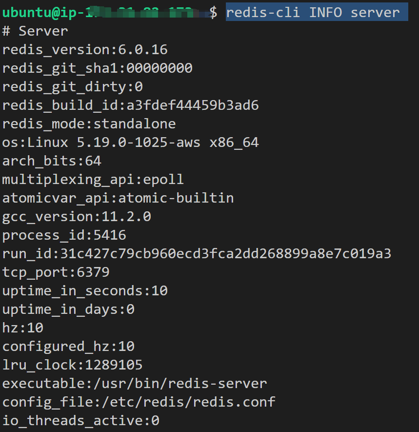

# install
```bash
sudo apt update
sudo apt install redis-server
sudo nano /etc/redis/redis.conf

bind 0.0.0.0
# requirepass foobared
requirepass ""
sudo systemctl restart redis-server
redis-cli ping
redis-cli INFO server
```

# test
```bash
redis-cli --scan --pattern '*'
systemctl status redis

redis-cli monitor

redis-cli
config set requirepass pwd
save
exit

redis-cli -a pwd --scan --pattern '*'

```


